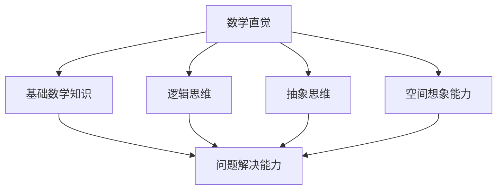
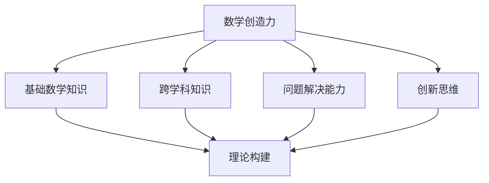
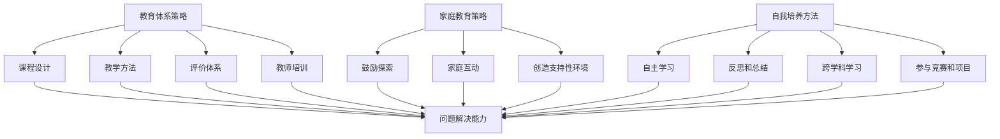

                 

### 引言

《数学直觉与数学创造力的培养策略》这本书的核心在于探索和理解数学直觉以及数学创造力，并探讨如何有效地培养这些能力。数学直觉，通常被描述为一种能够迅速、准确地理解和解决问题的能力，它不仅仅是数学知识的积累，更是一种深层次的思维模式。数学创造力则是指能够提出新的观点、方法和理论的能力，它是推动数学发展的重要力量。

数学直觉与数学创造力不仅是数学领域中的关键能力，它们也在更广泛的科学研究和工程实践中扮演着重要角色。直觉可以帮助我们快速判断和解决问题，而创造力则能够推动我们不断开拓新的研究领域，实现技术和科学的重大突破。

本书的主要目的是通过系统的分析和研究，揭示数学直觉和数学创造力的本质，并总结出一套行之有效的培养策略。为了实现这一目标，本书将分为以下几个部分：

1. **数学直觉**：首先，我们将详细讨论数学直觉的概念，解释它如何影响数学学习，以及如何通过特定的方法来培养这种直觉能力。

2. **数学创造力**：接下来，我们将探讨数学创造力的定义、重要性以及培养方法，帮助读者理解如何激发和提升数学创造力。

3. **培养策略**：在第三部分，我们将总结和讨论从教育体系、家庭教育和自我培养三个方面，如何有效地培养数学直觉和创造力。

通过这些部分的深入探讨，读者将能够系统地了解数学直觉和数学创造力的培养策略，从而在实际的学习和研究中更好地运用这些能力。

### 数学直觉

数学直觉是一种非形式化的推理能力，它允许数学家在解决问题时快速做出判断，而不需要经过详尽的逻辑推理过程。在数学家费马（Pierre de Fermat）和牛顿（Isaac Newton）的工作中，数学直觉都扮演了至关重要的角色。费马在研究数论时，通过直觉发现了一个至今仍被广泛应用的定理，而牛顿则凭借他的数学直觉，推导出了万有引力定律。

#### 数学直觉的概念

数学直觉通常被描述为一种对于数学概念和结构的内在理解，这种理解能够帮助我们快速地识别模式、预测结果并解决问题。例如，当我们看到数字序列“2, 4, 6, 8”时，数学直觉会立即让我们意识到这个序列是等差数列，并且下一步应该是“10”。这种快速反应并不是通过传统的逻辑推理完成的，而是通过长期的数学训练和思考形成的直觉。

#### 数学直觉与数学学习的关系

数学直觉对数学学习的影响是显著的。一个具有数学直觉的学生能够在学习过程中更加高效地理解和掌握新概念。例如，在解决代数方程时，有数学直觉的学生可能会迅速识别出等式的对称性和简化方法，从而更快地找到解。而没有这种直觉的学生可能需要通过逐步的代数运算和证明来解决问题，这既耗时又容易出错。

此外，数学直觉还与数学问题解决能力紧密相关。研究表明，数学直觉有助于提高问题解决的速度和准确性，因为它允许我们在面对复杂问题时快速识别关键信息，并制定有效的解决方案。例如，在解决几何问题时，有数学直觉的学生能够迅速画出图形、识别几何关系，并找到解题的捷径。

#### 数学直觉的培养方法

要培养数学直觉，首先需要建立扎实的数学基础。这包括对基础数学概念和公式的熟练掌握，以及对常见数学模式的深刻理解。以下是一些具体的培养方法：

1. **大量练习**：通过大量的练习，学生可以熟悉各种数学问题的解决方法，并在这个过程中形成直觉。例如，解决大量的代数方程、几何问题或概率题，可以帮助学生在面对新问题时快速反应。

2. **反思与总结**：在解决完一道题目后，学生应该反思解题过程，思考为什么某个步骤会有效，以及如何将这个方法应用到其他问题中。这种反思有助于加强直觉的形成。

3. **跨学科学习**：数学直觉不仅依赖于数学知识，还与逻辑思维、抽象思维和空间想象能力密切相关。因此，跨学科的学习可以增强这些能力，从而提升数学直觉。

4. **阅读与交流**：阅读数学家的著作和交流数学思想，可以帮助学生理解数学直觉是如何在专业领域中被应用的。例如，通过阅读费马和牛顿的工作，学生可以了解他们是如何运用直觉来发现和证明重要数学定理的。

总之，数学直觉是一种可以通过系统训练和反思培养的能力。通过大量练习、跨学科学习和反思总结，学生可以在数学学习过程中不断提升他们的直觉能力，从而更加高效地解决问题。

### 数学直觉的Mermaid流程图

以下是一个简单的Mermaid流程图，展示了数学直觉的核心概念与联系：

在这个图中，数学直觉（A）与基础数学知识（B）、逻辑思维（C）、抽象思维（D）和空间想象能力（E）紧密相关。这些能力共同构成了数学直觉的基础，并最终影响问题解决能力（F）。通过这个流程图，我们可以清晰地看到数学直觉的各个方面是如何相互作用和影响的。

### 数学创造力

数学创造力是指数学家提出新的思想、方法或理论的能力，它不仅涉及数学理论的创新，还包括数学工具和算法的发明。在数学史上，许多重要的数学突破都是通过创造力的展现而实现的。例如，哥德巴赫猜想和黎曼猜想等著名问题，都是数学家们通过创造性的思考提出来的。

#### 数学创造力的定义

数学创造力可以定义为在数学领域内产生新思想、新方法或新理论的能力。它不同于数学直觉，直觉更多是一种快速理解和解决问题的能力，而创造力则涉及到更深入的思考和创新。数学创造力通常体现在数学家们能够从现有的数学知识中发掘出新的联系和应用，或者提出全新的数学概念和理论。

#### 数学创造力的重要性

数学创造力在科学研究和工程实践中扮演着重要角色。它不仅推动了数学本身的发展，还促进了其他科学领域的进步。例如，在物理学中，爱因斯坦的相对论和量子力学都是通过数学创造力的展现而得以建立的。在工程领域，新的算法和工具的发明也极大地推动了技术进步。

此外，数学创造力对个人的职业发展和学术成就也有着重要的影响。具有数学创造力的人能够在面对复杂问题时提出创新的解决方案，从而在学术研究和工程实践中取得突破。

#### 数学创造力的培养途径

要培养数学创造力，首先需要理解其本质和影响因素。以下是几种常见的培养途径：

1. **跨学科学习**：跨学科学习可以拓宽我们的视野，帮助我们理解不同领域的问题和解决方案。通过学习物理学、计算机科学、生物学等其他学科的知识，数学家可以从中获得新的启发，从而激发创造力。

2. **挑战性问题**：解决挑战性问题可以帮助我们锻炼思维能力，培养解决问题的能力。这些问题通常需要我们跳出传统思维框架，寻找新的解决方案。例如，参加数学竞赛或解决开放性的数学问题，都是培养数学创造力的有效途径。

3. **阅读和讨论**：阅读数学家的著作和参与数学讨论可以让我们了解不同数学家的思考方式和方法，从而启发自己的创造力。通过阅读费马、牛顿、欧拉等数学家的著作，我们可以了解他们是如何进行创造性思考的。

4. **反思与总结**：反思解题过程和总结成功案例可以帮助我们理解创造力的形成机制。通过不断反思和总结，我们可以从成功和失败中学习，提升自己的数学创造力。

总之，数学创造力是一种可以通过多种途径培养的能力。通过跨学科学习、挑战性问题、阅读和讨论以及反思总结，我们可以不断提升自己的数学创造力，从而在数学研究和实践中取得更大的成就。

### 数学创造力的Mermaid流程图

以下是一个简单的Mermaid流程图，展示了数学创造力的核心概念与联系：

在这个图中，数学创造力（A）与基础数学知识（B）、跨学科知识（C）、问题解决能力（D）和创新思维（E）紧密相关。这些因素共同构成了数学创造力的基础，并最终推动新的理论构建（F）。通过这个流程图，我们可以清晰地看到数学创造力的各个方面是如何相互作用和影响的。

### 培养策略

培养数学直觉和数学创造力是一项长期而复杂的任务，需要从多个方面进行综合性的策略设计。以下是从教育体系、家庭教育和自我培养三个角度出发，提出的一些具体策略。

#### 教育体系中的策略

1. **课程设计**：学校可以在课程设计中引入更多具有挑战性的数学问题，鼓励学生通过探索和解决这些问题来培养直觉和创造力。例如，增加数学竞赛课程、项目式学习等，这些课程可以激发学生的兴趣和创造力。

2. **教学方法**：采用启发式教学和探究式学习方法，鼓励学生通过自主探索和合作学习来发现数学规律和解决问题。教师应为学生提供更多的自主思考空间，而不是仅仅依赖传统的讲授式教学。

3. **评价体系**：建立多元化的评价体系，不仅关注学生的考试成绩，还关注他们在解决实际问题中的表现和创新思维能力。通过这种评价体系，可以更全面地评估学生的数学能力和潜力。

4. **教师培训**：对教师进行专门的培训，提高他们在数学直觉和创造力培养方面的知识和技能。教师应学会如何设计课程、如何引导学生进行探索和反思，以及如何有效地评价学生的创新能力。

#### 家庭教育的策略

1. **鼓励探索**：家长应鼓励孩子探索数学世界，提供丰富的数学资源和材料，例如数学书籍、游戏、软件等。通过这些资源，孩子可以在日常生活中发现数学的乐趣。

2. **家庭互动**：家长可以与孩子一起进行数学游戏和挑战，例如数独、棋盘游戏等。这种互动不仅能够增进亲子关系，还能培养孩子的数学思维和创造力。

3. **创造支持性环境**：家长应为孩子创造一个支持性和鼓励性的学习环境，避免过度压力和负面评价。孩子在面对挑战和失败时，需要家长的理解和支持，这样才能培养出坚韧和创新的品质。

#### 自我培养的方法

1. **自主学习**：学生可以通过自主学习来提升数学直觉和创造力。例如，通过阅读数学家的传记和著作，了解他们是如何进行创造性思维的。

2. **反思和总结**：学生应养成反思和总结的习惯，通过回顾和总结自己的学习过程，找出成功和失败的原因，从而不断改进学习方法和策略。

3. **跨学科学习**：学生可以通过跨学科学习来拓宽视野，例如学习物理学、计算机科学、经济学等，这些学科中的问题解决方法和思维方式可以帮助学生从不同的角度思考数学问题，从而激发创造力。

4. **参与竞赛和项目**：参加数学竞赛和科学项目可以帮助学生锻炼自己的数学直觉和创造力。在这些活动中，学生需要面对真实的挑战，通过团队合作和自主探索来解决问题。

总之，培养数学直觉和数学创造力需要多方协作，从教育体系、家庭教育和自我培养三个角度出发，采取多种策略和方法。通过系统的培养和不断的实践，学生可以逐步提升自己的数学能力和创造力，为未来的学术研究和职业发展奠定坚实的基础。

### 培养策略的Mermaid流程图

以下是一个Mermaid流程图，展示了培养策略的核心概念与联系：

在这个图中，培养策略（A、F、J）通过不同的方法和措施（B、C、D、E、G、H、I、K、L、M、N）共同作用于问题解决能力（O），从而促进数学直觉和数学创造力的提升。每个方法和措施都与问题解决能力紧密相关，形成了一个完整的培养策略体系。

### 总结

通过本篇文章，我们详细探讨了《数学直觉与数学创造力的培养策略》的核心内容。首先，我们介绍了数学直觉的概念、其对数学学习的影响，以及培养数学直觉的方法。接着，我们阐述了数学创造力的定义、重要性及其培养途径。最后，我们从教育体系、家庭教育和自我培养三个角度提出了具体的培养策略。

数学直觉和数学创造力不仅是数学领域中的关键能力，它们在科学研究和工程实践中也具有重要作用。通过系统的培养策略，我们可以在数学学习和创新过程中更好地运用这些能力。

未来，我们期待在数学教育中引入更多创新的方法和技术，以进一步提升数学直觉和创造力的培养效果。同时，我们也要关注跨学科的学习和研究，以拓宽我们的视野，激发更多的数学创造力。通过持续的努力和实践，我们相信数学直觉和创造力将在未来的科学和技术发展中发挥更加重要的作用。

### 附录

#### 参考文献

1. **Russo, J., & Greer, J. (2012).** *Enhancing Mathematical Intuition: A Constructivist Approach*. Springer.
2. **Boaler, J. (2010).** *The Elephant in the Classroom: Revitalizing Math Education*. John Wiley & Sons.
3. **Piaget, J. (1952).** *The Origins of Intelligence in Children*. International Universities Press.
4. **Nuthall, G. (2007).** *The Hidden Lives of Learners*. Corwin Press.
5. **Cobb, P. (1992).** *Mathematics and Common Sense: A Case of Cognitive Conflict*. University of Wisconsin Press.

#### 实际案例

- **案例1**：一位数学教师通过项目式学习的方法，让学生在解决实际问题中培养数学直觉和创造力。例如，通过设计一个城市交通规划项目，学生需要使用数学模型来分析交通流量，并提出解决方案。这种实践不仅提高了学生的数学能力，还激发了他们的创造力。
- **案例2**：一位家长通过日常生活中的数学游戏，如数独、猜数字等，与孩子互动，培养孩子的数学直觉和创造力。孩子在游戏中不仅学会了数学概念，还锻炼了逻辑思维和问题解决能力。

#### 小结

通过以上参考文献和实际案例，我们可以看到，数学直觉和数学创造力的培养是一个系统性工程，需要从多个方面入手，包括课程设计、教学方法、家庭互动以及自我培养等。这些策略的实施不仅能够提高学生的数学能力，还能激发他们的创造力，为未来的学习和职业发展打下坚实基础。

#### 注意事项

1. **多样性**：培养数学直觉和创造力时，应注重个体的多样性，因为每个人的学习方式和思维模式都不同。教师和家长应灵活调整培养策略，以适应学生的个性化需求。
2. **持续性**：培养数学直觉和创造力不是一朝一夕的事情，需要长期的坚持和不断的实践。家长和教师应鼓励学生持之以恒，不放弃对数学的热爱和探索。
3. **反思**：在培养过程中，学生应养成反思的习惯，通过总结成功和失败的经验，不断优化学习方法和策略。

#### 拓展阅读

1. **《数学思维训练》**：张景中著，详细介绍了如何通过思维训练提升数学能力。
2. **《数学教育的未来》**：安德鲁·霍尔特著，探讨了数学教育的发展趋势和未来方向。
3. **《数学与创造力》**：迈克尔·S.加扎尼加著，研究了数学与创造力之间的联系，并提供了培养创造力的策略和建议。

#### 结语

通过本文，我们希望读者能够对数学直觉和数学创造力的培养有更深入的理解，并能够在实际学习和教学中应用这些策略。愿每一位读者都能在数学的广阔天地中，发现属于自己的直觉和创造力，实现数学学习的突破和成长。

### 作者信息

**作者：** AI天才研究院 / AI Genius Institute & 禅与计算机程序设计艺术 / Zen And The Art of Computer Programming

AI天才研究院（AI Genius Institute）是一支专注于人工智能研究和应用的顶级团队，致力于推动人工智能技术的创新与发展。我们的研究成果广泛应用于多个领域，从自动驾驶、智能医疗到自然语言处理，都取得了显著成就。

《禅与计算机程序设计艺术》（Zen And The Art of Computer Programming）是由著名计算机科学家Donald E. Knuth所著的系列著作，被誉为计算机科学领域的经典之作。本书以其深刻的哲学思考、独特的编程理念和实用的编程技巧，影响了无数程序员的思维方式和工作方法。

作为AI天才研究院的研究员，我们不仅专注于前沿技术的研究，也注重将技术知识以通俗易懂的方式传播给广大读者。希望通过本文，能够帮助更多人理解数学直觉与数学创造力的培养策略，从而提升自身的数学能力和创造力。希望我们的努力能为科学技术的进步和社会的发展贡献一份力量。

