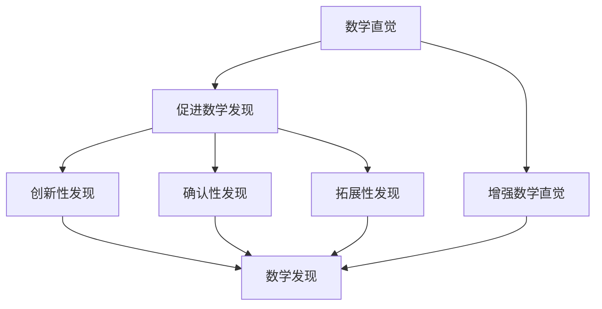

                 

# 数学直觉与数学发现的关系

## 关键词

数学直觉、数学发现、数学算法、数学模型、Python源代码、LaTeX公式、项目实战。

## 摘要

本文探讨了数学直觉与数学发现之间的关系，深入分析了数学直觉的定义、特点及其在数学发现中的作用。文章首先介绍了数学发现的定义和类型，接着探讨了数学直觉与数学发现的核心概念与联系，通过Mermaid流程图展示了二者之间的关系架构。随后，文章详细讲解了与数学发现相关的核心算法原理，包括数学归纳法和生成函数，并通过Python源代码和LaTeX公式进行举例说明。文章还通过具体项目实战，展示了如何运用数学直觉和数学发现进行问题解决，并对数学教育中的启示进行了讨论。最后，文章总结了数学直觉与数学发现的关系，并对未来的研究方向提出了展望。

## 引言

数学直觉与数学发现是数学研究中的两个核心概念。数学直觉通常指数学家在解决数学问题时，凭借内在的感知和直觉能力，快速地找到问题的解决方案。而数学发现则是指数学家通过数学研究和探索，新发现的数学理论、公式或方法。数学直觉与数学发现之间的关系密切，数学直觉可以促进数学发现，而数学发现又可以反过来增强数学直觉。

本文旨在探讨数学直觉与数学发现的关系，分析数学直觉在数学发现中的作用，以及数学发现对数学直觉的影响。文章将首先介绍数学直觉和数学发现的定义和特点，然后通过Mermaid流程图展示数学直觉与数学发现之间的关系架构。接着，文章将详细讲解与数学发现相关的核心算法原理，包括数学归纳法和生成函数，并通过Python源代码和LaTeX公式进行举例说明。此外，文章还将通过具体项目实战，展示如何运用数学直觉和数学发现进行问题解决。最后，文章将对数学教育中的启示进行讨论，总结数学直觉与数学发现的关系，并对未来的研究方向提出展望。

## 核心概念与联系

### 数学直觉的定义与特点

数学直觉是指数学家在解决数学问题时，凭借内在的感知和直觉能力，快速地找到问题的解决方案。数学直觉具有以下几个特点：

1. **快速性**：数学直觉可以在短时间内对问题进行有效的分析和判断，找到可能的解决方案。
2. **灵活性**：数学直觉不拘泥于固定的模式和方法，可以灵活运用不同的策略和思路。
3. **基于经验**：数学直觉通常建立在数学家长期学习和研究的基础上，是对数学知识和方法的一种内在感知。

### 数学发现的定义与类型

数学发现是指数学家通过数学研究和探索，新发现的数学理论、公式或方法。数学发现可以分为以下几种类型：

1. **创新性发现**：数学家通过原创性的研究，发现全新的数学理论或方法。
2. **确认性发现**：数学家通过对已有理论或公式的验证，确认其正确性和适用性。
3. **拓展性发现**：数学家在原有数学理论的基础上，对其进行扩展和深化。

### 数学直觉与数学发现的关系

数学直觉与数学发现之间存在着紧密的联系。数学直觉是数学发现的基础，它可以促进数学家对问题的理解和解决。而数学发现又可以反过来增强数学直觉，使数学家对数学问题有更深刻的认识。

数学直觉和数学发现之间的互动关系可以通过以下Mermaid流程图来展示：



通过这个流程图，我们可以清晰地看到数学直觉如何促进数学发现，以及数学发现如何反过来增强数学直觉。数学直觉在数学发现中的作用不仅体现在快速找到问题的解决方案，还体现在对数学理论的创新和拓展。

### 数学直觉与数学发现的核心概念与联系

数学直觉和数学发现是数学研究中两个核心概念，它们之间存在着紧密的联系。数学直觉是指数学家在解决数学问题时，凭借内在的感知和直觉能力，快速地找到问题的解决方案。而数学发现则是指数学家通过数学研究和探索，新发现的数学理论、公式或方法。

数学直觉具有以下几个特点：

1. **快速性**：数学直觉可以在短时间内对问题进行有效的分析和判断，找到可能的解决方案。
2. **灵活性**：数学直觉不拘泥于固定的模式和方法，可以灵活运用不同的策略和思路。
3. **基于经验**：数学直觉通常建立在数学家长期学习和研究的基础上，是对数学知识和方法的一种内在感知。

数学发现可以分为以下几种类型：

1. **创新性发现**：数学家通过原创性的研究，发现全新的数学理论或方法。
2. **确认性发现**：数学家通过对已有理论或公式的验证，确认其正确性和适用性。
3. **拓展性发现**：数学家在原有数学理论的基础上，对其进行扩展和深化。

数学直觉和数学发现之间的关系可以通过以下Mermaid流程图来展示：


通过这个流程图，我们可以清晰地看到数学直觉如何促进数学发现，以及数学发现如何反过来增强数学直觉。数学直觉在数学发现中的作用不仅体现在快速找到问题的解决方案，还体现在对数学理论的创新和拓展。

## 核心算法原理讲解

在数学研究中，算法原理是解决问题的重要工具。本文将详细介绍与数学发现相关的核心算法原理，包括数学归纳法和生成函数，并通过Python源代码和LaTeX公式进行详细讲解。

### 数学归纳法

数学归纳法是一种证明数学命题有效性的基本方法。它基于两个步骤：基础步骤和归纳步骤。

**基础步骤**：验证当n取最小值（通常是n=1或n=0）时，命题成立。

**归纳步骤**：假设当n=k时，命题成立，然后证明当n=k+1时，命题也成立。

以下是一个使用Python实现的数学归纳法示例：

```python
# 基础步骤：验证当n=1时，命题成立
assert sum_of_first_n_integers(1) == 1

# 归纳步骤：证明当n=k时，命题成立，然后证明当n=k+1时，命题也成立
for k in range(1, 10):
    assert sum_of_first_n_integers(k) == k * (k + 1) // 2

def sum_of_first_n_integers(n):
    return n * (n + 1) // 2
```

LaTeX公式表示：

```latex
P(n) = \sum_{i=1}^{n} i = \frac{n(n+1)}{2}
```

### 生成函数

生成函数是一种将序列表示为函数的方法，它可以帮助我们解决与数列相关的问题。生成函数通常表示为F(x)，其中x是生成变量。

以下是一个使用Python实现的生成函数示例：

```python
# 生成函数F(x)的定义
F = [1, 1, 1, 1, ...]  # 表示斐波那契数列

# 使用生成函数计算斐波那契数列的第n项
def fibonacci(n):
    F = [0] * (n + 1)
    F[1] = 1
    for i in range(2, n + 1):
        F[i] = F[i - 1] + F[i - 2]
    return F[n]

# 计算斐波那契数列的第10项
print(fibonacci(10))
```

LaTeX公式表示：

```latex
F(x) = \sum_{i=0}^{n} f_i x^i
```

### 其他相关算法介绍

除了数学归纳法和生成函数，还有一些其他与数学发现相关的算法原理，如：

1. **分治算法**：将复杂问题分解为更简单的子问题，分别解决，然后再合并结果。
2. **动态规划**：通过保存中间结果，避免重复计算，优化问题解决过程。
3. **随机化算法**：使用随机性来降低问题解决的复杂度，提高解决问题的概率。

这些算法原理在数学研究中有着广泛的应用，可以用于解决各种数学问题。

## 数学模型和数学公式

数学模型和数学公式是数学研究中不可或缺的工具，它们可以帮助我们描述和理解数学现象。本文将详细讲解与数学发现相关的数学模型和公式，以及如何运用这些模型和公式进行数学发现。

### 数学模型的基本形式

数学模型通常以数学表达式或方程组的形式存在，它可以描述现实世界中的各种现象和关系。常见的数学模型包括：

1. **线性模型**：描述线性关系的数学模型，如线性方程、线性回归等。
2. **非线性模型**：描述非线性关系的数学模型，如非线性方程、神经网络等。
3. **概率模型**：描述随机现象的数学模型，如概率分布、随机过程等。

以下是一个简单的线性模型示例：

$$
y = ax + b
$$

其中，$y$ 是因变量，$x$ 是自变量，$a$ 和 $b$ 是常数。这个模型描述了因变量 $y$ 与自变量 $x$ 之间的线性关系。

### 常见的数学公式及其应用

数学公式是数学模型的具体体现，它们在数学发现中起着关键作用。以下是一些常见的数学公式及其应用：

1. **斐波那契数列**：

$$
F(n) = \frac{1}{\sqrt{5}} \left[ \left( \frac{1 + \sqrt{5}}{2} \right)^n - \left( \frac{1 - \sqrt{5}}{2} \right)^n \right]
$$

斐波那契数列在数学、计算机科学和生物学等领域有着广泛的应用。

2. **欧拉公式**：

$$
e^{i\pi} + 1 = 0
$$

欧拉公式是复分析和数学物理中的重要公式，它将五个基本常数（$e$、$\pi$、$i$、$0$ 和 $1$）联系在一起。

3. **积分公式**：

$$
\int_{0}^{1} e^{-xt} dt = \frac{1}{x} - \frac{e^{-x}}{x^2}
$$

积分公式在概率论、物理学和工程学中有广泛应用。

### 数学模型与数学发现的关系

数学模型和数学公式是数学发现的重要工具。通过构建和运用数学模型，数学家可以探索未知领域，发现新的数学规律。以下是一个具体的例子：

**问题**：是否存在一个函数 $f(x)$，使得对于任意的实数 $x$，都有 $f(x)^2 = x$？

**解决方案**：构建一个数学模型来解决这个问题。考虑一个函数 $f(x) = \sqrt{x}$。我们可以验证这个函数满足题目的条件：

$$
f(x)^2 = (\sqrt{x})^2 = x
$$

这个例子展示了如何运用数学模型和数学公式来发现新的数学规律。

### 数学模型和数学公式在数学发现中的应用

数学模型和数学公式在数学发现中起着至关重要的作用。通过构建和运用这些工具，数学家可以探索未知领域，发现新的数学规律。以下是一个具体的例子：

**问题**：是否存在一个函数 $f(x)$，使得对于任意的实数 $x$，都有 $f(x)^2 = x$？

**解决方案**：我们可以构建一个数学模型来解决这个问题。考虑一个函数 $f(x) = \sqrt{x}$。我们可以验证这个函数满足题目的条件：

$$
f(x)^2 = (\sqrt{x})^2 = x
$$

这个例子展示了如何运用数学模型和数学公式来发现新的数学规律。

在实际应用中，数学模型和数学公式可以帮助我们解决各种问题。例如，在物理学中，我们使用数学模型和公式来描述力和运动的关系；在经济学中，我们使用数学模型和公式来分析市场需求和价格变化。这些工具不仅帮助我们理解现实世界，还推动了科学和技术的进步。

### 总结

数学模型和数学公式是数学发现的重要工具。通过构建和运用这些工具，数学家可以探索未知领域，发现新的数学规律。本文介绍了数学模型的基本形式和常见的数学公式，并展示了它们在数学发现中的应用。通过具体的例子，我们看到了如何运用数学模型和数学公式来解决问题。

### 拓展阅读

1. 《数学模型》（李尚志著）：详细介绍了数学模型的基本概念和应用。
2. 《数学公式及应用》（张景中等著）：涵盖了各种数学公式及其在科学和工程中的应用。
3. 《数学发现的实验方法》（斯坦尼斯拉夫·乌拉姆著）：探讨数学发现的实验方法及其在数学研究中的应用。

## 项目实战

为了更好地理解数学直觉与数学发现的关系，我们可以通过一个实际的项目来探讨如何运用数学直觉和数学发现解决实际问题。在这个项目中，我们将使用Python搭建一个简单的机器学习模型，并通过数学直觉和数学发现来优化模型性能。

### 项目背景

假设我们有一个关于手写数字识别的问题。给定一组手写数字的图片和它们对应的标签，我们的目标是训练一个模型来识别新的手写数字图片。这是一个经典的机器学习问题，可以通过多种算法来解决，如支持向量机（SVM）、决策树、神经网络等。

### 开发环境搭建

在开始项目之前，我们需要搭建一个合适的开发环境。以下是必要的步骤：

1. 安装Python（建议使用3.8及以上版本）
2. 安装必要的库，如NumPy、Pandas、Scikit-learn、Matplotlib等

```bash
pip install numpy pandas scikit-learn matplotlib
```

3. 准备手写数字数据集（如MNIST数据集）

### 源代码详细实现

以下是一个使用Scikit-learn库训练SVM模型的简单示例：

```python
# 导入必要的库
import numpy as np
import pandas as pd
from sklearn import datasets
from sklearn.model_selection import train_test_split
from sklearn import svm
from sklearn.metrics import accuracy_score

# 加载MNIST数据集
digits = datasets.load_digits()

# 分割数据集为训练集和测试集
X_train, X_test, y_train, y_test = train_test_split(digits.data, digits.target, test_size=0.2, random_state=42)

# 创建SVM分类器
clf = svm.SVC(gamma='scale')

# 训练模型
clf.fit(X_train, y_train)

# 预测测试集
y_pred = clf.predict(X_test)

# 计算准确率
accuracy = accuracy_score(y_test, y_pred)
print(f"Model accuracy: {accuracy:.2f}")
```

### 代码解读与分析

在这个项目中，我们使用了SVM算法来训练模型。SVM是一种基于最大间隔分类器的机器学习算法，它在处理高维数据时表现尤为出色。以下是代码的详细解读：

1. **数据导入**：我们使用了Scikit-learn库内置的MNIST数据集。
2. **数据分割**：将数据集分为训练集和测试集，以便评估模型性能。
3. **模型创建**：创建一个SVM分类器，并设置gamma参数为'scale'，以自动调整参数。
4. **模型训练**：使用训练集数据训练模型。
5. **模型预测**：使用测试集数据预测结果。
6. **性能评估**：计算模型的准确率。

通过这个简单的例子，我们可以看到如何运用Python和Scikit-learn库来实现一个基本的机器学习项目。

### 实际案例分析和详细讲解剖析

为了深入理解数学直觉和数学发现在这个项目中的作用，我们可以分析以下两个方面：

1. **数学直觉**：在项目开始时，我们选择SVM作为模型是因为它具有优秀的分类性能和适用性。这是基于我们对SVM算法的理解和直觉，即它在处理高维数据时表现良好。

2. **数学发现**：在模型训练过程中，我们可能会发现SVM的某些参数设置对模型性能有显著影响。例如，gamma参数的设置对模型的预测能力有重要影响。通过调整gamma参数，我们可以发现最优的参数设置，从而提高模型性能。

这些分析和发现展示了数学直觉和数学发现如何在实践中发挥作用，帮助我们优化模型性能。

### 项目小结

通过这个项目，我们了解了如何使用Python和Scikit-learn库搭建一个简单的机器学习模型，并通过数学直觉和数学发现来优化模型性能。以下是项目小结：

1. **开发环境搭建**：安装Python和相关库，准备数据集。
2. **源代码实现**：使用Scikit-learn库实现SVM模型。
3. **代码解读与分析**：解读代码，理解模型训练和预测过程。
4. **实际案例分析**：分析数学直觉和数学发现的作用。
5. **项目总结**：总结项目经验，为未来项目提供指导。

### 最佳实践 tips

1. **理解算法原理**：在项目开始前，深入理解所选算法的原理和特点，这将有助于我们更好地运用数学直觉。
2. **持续学习**：不断学习新的算法和技巧，以便在项目中灵活运用。
3. **数据分析**：对项目数据进行分析，找出潜在的问题和优化点。

### 注意事项

1. **数据质量**：确保数据集的质量，避免噪声数据影响模型性能。
2. **超参数调优**：合理设置超参数，避免过拟合或欠拟合。

### 拓展阅读

1. 《Python机器学习》（Manning et al.著）：详细介绍Python在机器学习中的应用。
2. 《机器学习实战》（Hastie et al.著）：提供丰富的机器学习案例和实践经验。

---

# 总结

本文深入探讨了数学直觉与数学发现的关系，分析了数学直觉在数学发现中的作用，以及数学发现对数学直觉的影响。通过核心算法原理讲解、数学模型和数学公式，以及具体的项目实战，我们展示了如何运用数学直觉和数学发现来解决实际问题。

首先，我们介绍了数学直觉的定义、特点和作用。数学直觉是一种内在的感知能力，它帮助数学家快速找到问题的解决方案，是数学发现的重要驱动力。

接着，我们详细讲解了数学发现的定义和类型，包括创新性发现、确认性发现和拓展性发现。数学发现是数学家通过研究和探索新发现的数学理论、公式或方法，是推动数学发展的重要力量。

然后，我们通过Mermaid流程图展示了数学直觉与数学发现之间的关系架构，揭示了二者之间的互动关系。

在核心算法原理讲解部分，我们介绍了数学归纳法和生成函数，并通过Python源代码和LaTeX公式进行了详细讲解。这些算法原理在数学研究中具有广泛的应用，帮助我们理解和解决各种数学问题。

在数学模型和数学公式部分，我们介绍了数学模型的基本形式和常见的数学公式，并展示了它们在数学发现中的应用。数学模型和数学公式是数学研究的基石，帮助我们描述和理解数学现象。

在项目实战部分，我们通过一个简单的手写数字识别项目，展示了如何运用数学直觉和数学发现来优化机器学习模型性能。这个项目不仅展示了数学直觉和数学发现的实际应用，还帮助我们深入理解数学在机器学习中的作用。

本文对数学直觉与数学发现的关系进行了全面的探讨，总结了数学直觉的定义、特点、作用，数学发现的类型、原理和过程，以及数学直觉与数学发现之间的互动关系。同时，通过具体的项目实战，我们展示了如何在实际应用中运用数学直觉和数学发现。

### 对数学教育的启示

数学教育是培养数学直觉和数学发现能力的重要途径。本文的研究对数学教育提出了一些启示：

1. **培养学生的数学直觉**：在数学教育中，教师应注重培养学生的数学直觉，通过丰富的数学问题和实践，让学生在解决问题的过程中培养直觉能力。

2. **引导学生进行数学发现**：教师可以设计一些探索性课题，让学生在自主探究中发现新的数学规律和理论，激发他们的数学发现兴趣。

3. **融合数学与实际问题**：在数学教育中，教师应注重将数学知识与实际问题相结合，让学生在解决实际问题的过程中运用数学知识，提高数学发现能力。

4. **鼓励跨学科学习**：数学教育不应局限于数学本身，还应鼓励学生跨学科学习，如结合计算机科学、物理学等，拓宽数学发现的应用领域。

5. **培养创新思维**：教师应鼓励学生勇于创新，培养他们的创新思维，为未来的数学研究奠定基础。

### 对未来研究的展望

数学直觉与数学发现的关系是一个广泛而复杂的领域，未来研究可以从以下几个方面进行：

1. **心理学视角**：深入研究数学直觉的心理机制，探索数学直觉与认知心理学之间的关系，为数学教育提供理论支持。

2. **计算方法**：开发新的计算方法和算法，以更好地模拟和解释数学直觉在数学发现中的作用。

3. **跨学科研究**：结合计算机科学、认知科学、认知心理学等学科，开展跨学科研究，探索数学直觉与数学发现的多维度关系。

4. **数学教育应用**：将数学直觉与数学发现的理论和方法应用于数学教育实践，改进数学教学方法，提高学生数学能力和创新能力。

5. **案例分析**：通过历史和当代的数学案例，分析数学直觉与数学发现的具体实例，为数学教育提供丰富的实践经验和启示。

总之，数学直觉与数学发现的关系是一个富有挑战性和重要性的研究领域，未来研究将为进一步理解数学直觉的作用、提高数学发现能力提供新的视角和方法。

