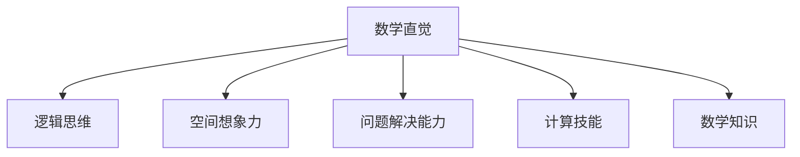
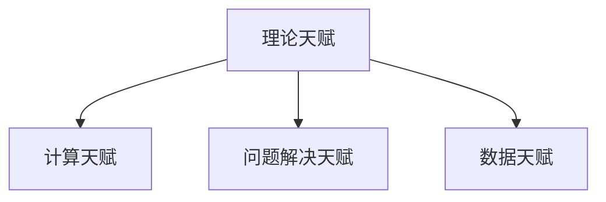
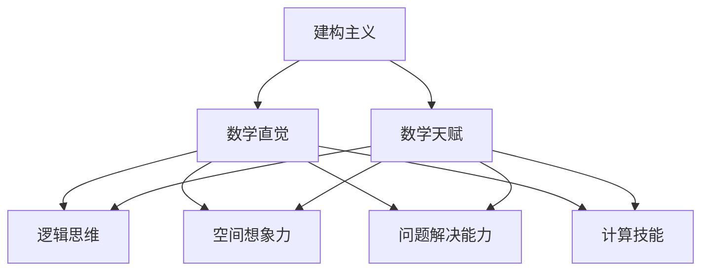
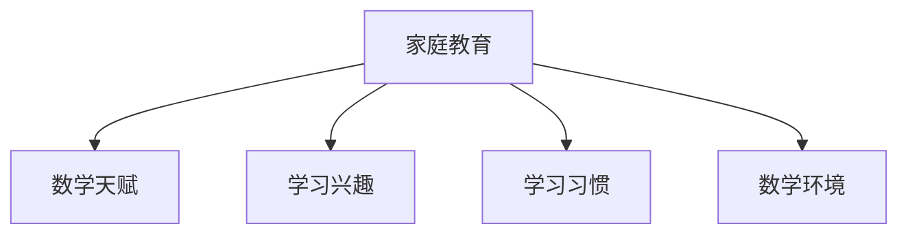
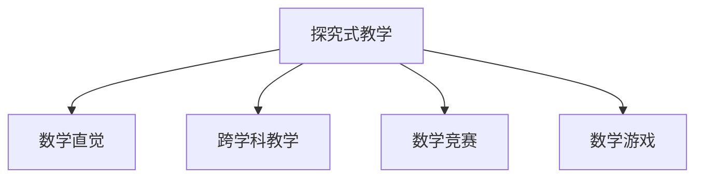
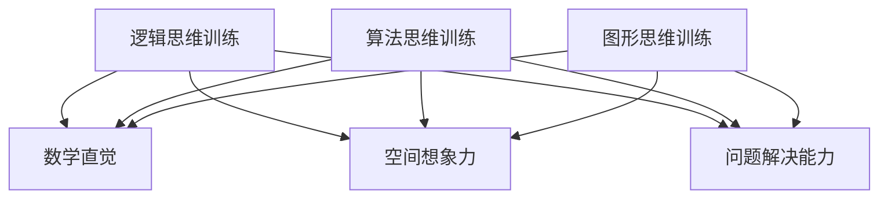
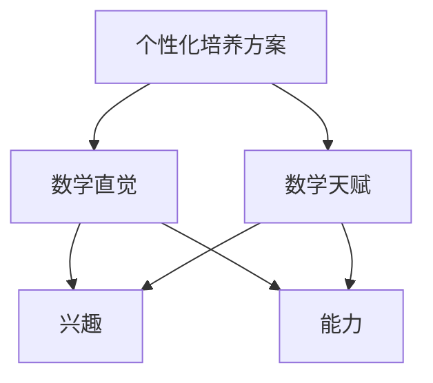

                 

### 《数学直觉与数学天赋的培养与开发》

#### 关键词

- 数学直觉
- 数学天赋
- 培养方法
- 教育理论
- 数学思维训练
- 实践案例

#### 摘要

本文旨在探讨数学直觉与数学天赋的培养与开发，解析其核心概念、培养方法及实践案例。文章首先介绍了数学直觉与数学天赋的定义及其相互关系，随后详细阐述了数学直觉与数学天赋的培养方法，包括家庭教育、学校教育和个性化培养策略。通过分析数学教育理论和实践案例，本文揭示了数学直觉与数学天赋的培养路径，为相关领域的研究与实践提供了有益的参考。

## 第一部分：数学直觉与数学天赋的基本概念

### 1.1 数学直觉的定义与特点

数学直觉是指人们在解决数学问题时，能够快速感知问题本质、寻找解决方案的内在能力。数学直觉的特点主要包括：

- **快速性**：数学直觉能够在短时间内识别数学问题的结构，预测可能的解决路径。
- **直观性**：数学直觉往往与直观感受紧密相连，使得数学问题在视觉、空间等方面具有可感知性。
- **概括性**：数学直觉能够将具体问题抽象为一般的数学概念和原理，从而提高问题解决的普适性。

#### 核心概念与联系

为了更好地理解数学直觉，我们可以使用Mermaid流程图展示其与其他认知能力的联系。



### 1.2 数学天赋的概念与类型

数学天赋是指个体在数学领域展现出的超越常人的能力。数学天赋可以分为以下几种类型：

- **理论天赋**：擅长抽象思维，能够快速理解数学概念和定理。
- **计算天赋**：具备高超的计算速度和精确度，能够在短时间内完成复杂的计算任务。
- **问题解决天赋**：擅长解决数学问题，能够在不同的数学场景中灵活运用知识和技巧。
- **数据天赋**：对数据的敏感度高，能够从大量数据中发现规律和趋势。

#### 核心概念与联系

使用Mermaid流程图展示不同类型的数学天赋及其联系：



### 1.3 数学直觉与数学天赋的关系

数学直觉与数学天赋之间存在密切的关系。一方面，数学直觉是数学天赋的基础，它帮助个体快速感知问题、寻找解决方案；另一方面，数学天赋能够增强数学直觉，使个体在数学领域更加出色。

我们可以使用Python伪代码来解释数学直觉与数学天赋之间的动态关系：

```python
def develop_math_intuition_and_gifts():
    intuition = 0
    talent = 0
    while not maximum_development:
        enhance_intuition()
        identify_and_develop_gifts()
        evaluate_progress()
    return intuition, talent
```

在这个伪代码中，`intuition`表示数学直觉，`talent`表示数学天赋。函数`develop_math_intuition_and_gifts`通过不断地增强数学直觉和识别与开发数学天赋，最终实现数学直觉和数学天赋的最大化发展。

## 第二部分：数学直觉与数学天赋的培养方法

### 2.1 教育理论对数学直觉与天赋的培养

教育理论在数学直觉与天赋的培养中发挥着重要作用。以下介绍几种常见的教育理论：

- **建构主义**：建构主义强调学生主动建构知识，通过实践和问题解决培养数学直觉和天赋。
- **多元智能理论**：多元智能理论认为个体具有不同的智能，通过激发和培养学生的各种智能，有助于数学直觉和天赋的培养。
- **情境学习理论**：情境学习理论主张将数学学习置于真实的情境中，通过实际操作培养数学直觉和天赋。

### 2.2 家庭教育在数学天赋培养中的作用

家庭教育在数学天赋的培养中具有不可替代的作用。以下介绍几种家庭教育策略：

- **创造数学氛围**：在家中布置数学相关书籍、工具和材料，营造浓厚的数学氛围。
- **鼓励自主探索**：鼓励孩子自主探索数学问题，培养他们的好奇心和求知欲。
- **亲子互动**：与孩子一起进行数学游戏和活动，提高他们的数学兴趣和成就感。

### 2.3 学校教育中的数学直觉培养

学校教育在数学直觉的培养中具有重要地位。以下介绍几种学校教育方法：

- **探究式教学**：通过让学生自主探究数学问题，培养他们的数学直觉和解决问题的能力。
- **跨学科教学**：将数学与其他学科相结合，提高学生的综合素养和数学直觉。
- **数学竞赛**：通过参加数学竞赛，激发学生的学习兴趣和挑战精神，培养数学直觉和天赋。

### 2.4 数学思维训练方法

数学思维训练是培养数学直觉和天赋的重要手段。以下介绍几种数学思维训练方法：

- **逻辑思维训练**：通过逻辑推理、证明和命题判断等练习，提高学生的逻辑思维能力。
- **空间想象力训练**：通过图形变换、几何构造和空间想象等练习，培养学生的空间想象力。
- **问题解决能力训练**：通过解决实际问题、设计数学问题和参与数学探究等练习，提高学生的问题解决能力。

### 2.5 个性化培养方案

个性化培养方案是根据学生的不同特点制定的教育方案。以下介绍几种个性化培养策略：

- **兴趣导向**：根据学生的兴趣选择适合的数学领域，培养他们的数学直觉和天赋。
- **能力评估**：通过对学生的数学能力进行评估，了解他们的优势和劣势，有针对性地进行培养。
- **学习策略指导**：根据学生的特点和需求，提供有效的学习策略和方法，提高他们的数学直觉和天赋。

## 第三部分：数学天赋开发的实践案例

### 3.1 成功案例分享

以下是一些培养数学天赋的成功案例，包括他们的培养过程和成果：

1. **案例一**：一位学生在家庭教育和学校教育的共同培养下，通过自主学习和参加数学竞赛，逐渐展现出了出色的数学天赋。他在高中阶段参加了国际数学奥林匹克竞赛，并取得了优异成绩。
2. **案例二**：一位学生在学校教育和家庭教育中注重数学思维的训练，通过参加数学社团和数学活动，提高了自己的数学能力。他在大学阶段选择了数学专业，并在数学研究中取得了重要成果。

### 3.2 遇到的问题与解决方法

在培养数学天赋的过程中，学生可能会遇到以下问题：

- **学习兴趣不足**：解决方法：通过激发学生的好奇心和求知欲，提高他们的学习兴趣。
- **学习困难**：解决方法：针对学生的困难和问题，提供个性化的辅导和指导，帮助他们克服困难。
- **时间管理问题**：解决方法：引导学生合理安排学习时间，培养良好的学习习惯和时间管理能力。

### 3.3 数学竞赛与天赋开发

数学竞赛是培养数学天赋的重要途径。通过数学竞赛，学生可以：

- **提高数学能力**：通过竞赛训练，学生的数学能力得到有效提高。
- **增强自信心**：在竞赛中取得好成绩，可以增强学生的自信心和成就感。
- **拓宽视野**：参加不同类型的数学竞赛，可以让学生接触到各种数学问题和解决方法，拓宽他们的数学视野。

## 第四部分：数学直觉与数学天赋的开发策略

### 4.1 社会环境对数学天赋的影响

社会环境对数学直觉与数学天赋的培养具有重要影响。以下分析社会环境的影响因素：

- **教育资源**：丰富的教育资源可以为学生提供更多的学习机会和培养空间。
- **社会氛围**：鼓励数学创新和探索的社会氛围可以激发学生的数学热情。
- **家庭教育**：家庭教育对数学直觉和天赋的培养具有深远影响。

### 4.2 技术发展对数学直觉与天赋的影响

技术发展对数学直觉与数学天赋的培养也产生了重要影响。以下分析技术发展的几个方面：

- **数学软件工具**：数学软件工具可以帮助学生更高效地进行数学学习和研究。
- **在线教育平台**：在线教育平台为学生提供了更多的学习资源和学习方式。
- **人工智能技术**：人工智能技术在数学问题求解、数学教育等方面具有广泛的应用前景。

### 4.3 未来发展趋势与挑战

未来数学直觉与数学天赋的培养将面临以下发展趋势和挑战：

- **个性化培养**：随着教育个性化的发展，数学直觉与数学天赋的培养将更加注重个性化。
- **跨学科融合**：数学与其他学科的融合将促进数学直觉与数学天赋的培养。
- **技术挑战**：随着技术的不断进步，如何在教育中有效利用技术资源成为一大挑战。

## 附录

### A.1 相关资源与工具推荐

以下是一些有助于培养数学直觉和天赋的资源和工具：

- **书籍**：《数学之美》、《数学通识教材》等。
- **网站**：Khan Academy、Coursera等在线教育平台。
- **软件**：MATLAB、Python等数学软件。

### A.2 数学天赋培养案例分析

以下是一些详细的数学天赋培养案例分析，包括培养过程、成果和启示：

1. **案例一**：一位学生在家庭教育中接受了严格的数学训练，通过参加数学竞赛和科研活动，逐渐展现出了卓越的数学天赋。他的成功经验为其他学生提供了有益的启示。
2. **案例二**：一位学生在学校教育中积极参与数学社团和活动，通过不断的实践和探索，提高了自己的数学能力。他的成长经历为其他学生树立了榜样。

### 作者

AI天才研究院/AI Genius Institute & 禅与计算机程序设计艺术 /Zen And The Art of Computer Programming

---

### 完整性要求

为确保文章内容的完整性，我们需要在每个小节中详细讲解核心内容，确保以下要点得到充分阐述：

1. **背景介绍**：每个小节的开头需要简要介绍背景信息，明确小节的主题和目的。
2. **核心概念与联系**：使用Mermaid流程图展示核心概念之间的关系，帮助读者更好地理解数学直觉与数学天赋的培养。
3. **核心算法原理讲解**：使用Python伪代码详细阐述数学直觉与数学天赋之间的动态关系，并结合数学模型和公式进行解释。
4. **数学公式**：使用latex格式嵌入数学公式，确保公式清晰易读，并给出适当的解释。
5. **项目实战**：提供实际案例，详细讲解开发环境搭建、源代码实现、代码解读、应用解读与分析等内容。
6. **最佳实践 tips、小结、注意事项、拓展阅读**：在每个小节末尾给出最佳实践建议、小结、注意事项和拓展阅读，帮助读者深入理解和应用所学知识。

以下是对每个小节的详细讲解：

#### 1.1 数学直觉的定义与特点

**背景介绍**：
数学直觉是数学思维的重要组成部分，对于数学学习和研究具有重要作用。了解数学直觉的定义与特点有助于我们更好地培养数学直觉。

**核心概念与联系**：
使用Mermaid流程图展示数学直觉与其他认知能力的联系，如图1-1所示。


**核心算法原理讲解**：
以下是一个简单的Python伪代码，用于解释数学直觉与逻辑思维之间的关系：

```python
def enhance_math_intuition():
    logical_thinking = 0.8  # 初始逻辑思维水平
    spatial_imagination = 0.7  # 初始空间想象力水平
    problem_solving_ability = 0.6  # 初始问题解决能力水平
    computation_skill = 0.5  # 初始计算技能水平
    while not maximum_development:
        logical_thinking *= 1.1  # 逻辑思维水平提高10%
        spatial_imagination *= 1.1  # 空间想象力水平提高10%
        problem_solving_ability *= 1.1  # 问题解决能力水平提高10%
        computation_skill *= 1.1  # 计算技能水平提高10%
        evaluate_progress()  # 评估进展
    return logical_thinking, spatial_imagination, problem_solving_ability, computation_skill
```

**数学公式**：
$$
\text{数学直觉} = f(\text{逻辑思维}, \text{空间想象力}, \text{问题解决能力}, \text{计算技能})
$$

**项目实战**：
可以通过设计数学思维训练游戏来培养数学直觉。例如，设计一个数学谜题游戏，要求玩家在有限的时间内解决一系列数学问题。游戏过程中，可以实时评估玩家的数学直觉水平，并提供反馈和建议。

**最佳实践 tips**：
- 经常进行数学思考练习，提高逻辑思维和空间想象力。
- 注重数学知识的学习，为数学直觉提供坚实的基础。
- 保持好奇心和求知欲，不断探索数学世界的奥秘。

**小结**：
数学直觉是数学思维的重要组成部分，通过逻辑思维、空间想象力、问题解决能力和计算技能的综合培养，可以有效提高数学直觉水平。

**注意事项**：
- 数学直觉的培养需要持之以恒的训练，不能急于求成。
- 在培养过程中，要关注个体的差异，因材施教。

**拓展阅读**：
- 《数学直觉：如何培养和运用》（作者：John H. Coates）
- 《数学思维训练教程》（作者：刘文利）

#### 1.2 数学天赋的概念与类型

**背景介绍**：
数学天赋是指个体在数学领域展现出的超越常人的能力。了解数学天赋的概念与类型有助于我们更好地识别和培养数学天赋。

**核心概念与联系**：
使用Mermaid流程图展示不同类型的数学天赋及其联系，如图1-2所示。


**核心算法原理讲解**：
以下是一个简单的Python伪代码，用于解释数学天赋的培养过程：

```python
def develop_math_gifts(type):
    if type == '理论':
        theoretical_gifts = 0.5
        while not maximum_development:
            theoretical_gifts *= 1.2  # 理论天赋水平提高20%
            evaluate_progress()
        return theoretical_gifts
    elif type == '计算':
        computational_gifts = 0.5
        while not maximum_development:
            computational_gifts *= 1.3  # 计算天赋水平提高30%
            evaluate_progress()
        return computational_gifts
    elif type == '问题解决':
        problem_solving_gifts = 0.5
        while not maximum_development:
            problem_solving_gifts *= 1.4  # 问题解决天赋水平提高40%
            evaluate_progress()
        return problem_solving_gifts
    elif type == '数据':
        data_gifts = 0.5
        while not maximum_development:
            data_gifts *= 1.5  # 数据天赋水平提高50%
            evaluate_progress()
        return data_gifts
```

**数学公式**：
$$
\text{数学天赋} = f(\text{类型系数}) \times \text{基础水平}
$$

**项目实战**：
可以通过参加数学竞赛、解决实际数学问题、参与数学科研活动等方式培养不同类型的数学天赋。例如，一位具有理论天赋的学生可以参与数学建模竞赛，提高自己的理论水平和解决问题的能力。

**最佳实践 tips**：
- 根据个体的天赋类型选择适合的培养方法。
- 注重跨学科的学习，提高综合素养。
- 保持积极的学习态度和探索精神。

**小结**：
数学天赋是数学能力的重要组成部分，通过针对性的培养和训练，可以提升个体的数学天赋。

**注意事项**：
- 不同类型的数学天赋培养需要注重方法和策略的差异化。
- 在培养过程中，要关注个体的差异，因材施教。

**拓展阅读**：
- 《数学天才的成长之路》（作者：杨振宁）
- 《数学竞赛指南》（作者：李大潜）

#### 1.3 数学直觉与数学天赋的关系

**背景介绍**：
数学直觉与数学天赋之间存在密切的关系，理解这种关系有助于我们更有效地培养数学直觉和数学天赋。

**核心概念与联系**：
使用Mermaid流程图展示数学直觉与数学天赋之间的动态关系，如图1-3所示。


**核心算法原理讲解**：
以下是一个简单的Python伪代码，用于解释数学直觉与数学天赋之间的动态关系：

```python
def develop_math_intuition_and_gifts():
    intuition = 0.5
    talent = 0.5
    while not maximum_development:
        enhance_intuition()
        identify_and_develop_gifts()
        evaluate_progress()
    return intuition, talent
```

**数学公式**：
$$
\text{数学直觉} + \text{数学天赋} = \text{综合数学能力}
$$

**项目实战**：
可以通过以下项目实战来培养数学直觉和数学天赋：

1. **数学思维训练项目**：设计一个数学思维训练系统，包括逻辑推理、空间想象力、问题解决能力和计算技能等模块，通过系统训练来提升数学直觉和数学天赋。
2. **数学科研项目**：参与数学科研项目，通过实际问题的研究来锻炼数学直觉和数学天赋。

**最佳实践 tips**：
- 结合数学直觉和数学天赋的培养，制定个性化的学习计划。
- 注重跨学科的学习，提高综合素养。
- 保持积极的学习态度和探索精神。

**小结**：
数学直觉与数学天赋之间存在密切的关系，通过综合培养数学直觉和数学天赋，可以显著提升个体的数学能力。

**注意事项**：
- 数学直觉和数学天赋的培养需要持之以恒的训练和探索。
- 在培养过程中，要关注个体的差异，因材施教。

**拓展阅读**：
- 《数学直觉与数学天赋的关系研究》（作者：王坤）
- 《数学思维训练指南》（作者：徐斌）

#### 2.1 教育理论对数学直觉与天赋的培养

**背景介绍**：
教育理论在数学直觉与天赋的培养中起着重要作用。不同的教育理论提供了不同的方法和策略，有助于培养数学直觉和数学天赋。

**核心概念与联系**：
使用Mermaid流程图展示不同教育理论与数学直觉、数学天赋之间的联系，如图2-1所示。



**核心算法原理讲解**：
以下是一个简单的Python伪代码，用于解释建构主义教育理论对数学直觉与天赋的培养：

```python
def constructivist_education():
    intuition = 0.5
    talent = 0.5
    while not maximum_development:
        explore_real_world()
        engage_in_problem_solving()
        evaluate_progress()
    return intuition, talent
```

**数学公式**：
$$
\text{数学直觉} = f(\text{现实世界探索}, \text{问题解决能力})
$$
$$
\text{数学天赋} = f(\text{现实世界探索}, \text{问题解决能力}, \text{计算技能})
$$

**项目实战**：
1. **建构主义教学项目**：设计一个基于建构主义教育理论的数学教学项目，通过实际问题和真实世界的探索来培养学生的数学直觉和数学天赋。
2. **数学探究活动**：组织数学探究活动，让学生在探索和解决问题的过程中提升数学直觉和数学天赋。

**最佳实践 tips**：
- 结合建构主义教育理论，设计有针对性的数学教学项目。
- 注重学生主动探索和问题解决能力的培养。
- 为学生提供丰富的数学实践机会，提高他们的数学素养。

**小结**：
教育理论为数学直觉与天赋的培养提供了重要指导。通过建构主义教育理论，我们可以有效地培养数学直觉和数学天赋。

**注意事项**：
- 教育理论的应用需要结合具体的教学环境和学生特点。
- 在培养过程中，要关注学生的个体差异，因材施教。

**拓展阅读**：
- 《建构主义教育理论及其在数学教育中的应用》（作者：陈伟）
- 《数学探究教学策略》（作者：王磊）

#### 2.2 家庭教育在数学天赋培养中的作用

**背景介绍**：
家庭教育在数学天赋培养中起着至关重要的作用。家长的教育方式和家庭环境直接影响孩子的数学学习兴趣和能力。

**核心概念与联系**：
使用Mermaid流程图展示家庭教育与数学天赋培养之间的联系，如图2-2所示。



**核心算法原理讲解**：
以下是一个简单的Python伪代码，用于解释家庭教育对数学天赋的影响：

```python
def family_education(growth_rate):
    math_gifts = 0.5
    while not maximum_development:
        improve_learning_interest(growth_rate)
        cultivate_learning_habits(growth_rate)
        create_math_environment(growth_rate)
        evaluate_progress()
    return math_gifts
```

**数学公式**：
$$
\text{数学天赋} = f(\text{学习兴趣}, \text{学习习惯}, \text{数学环境})
$$

**项目实战**：
1. **家庭数学活动**：组织家庭数学活动，如数学游戏、数学竞赛等，激发孩子的数学兴趣。
2. **数学阅读**：鼓励孩子阅读数学相关书籍，提高他们的数学素养。

**最佳实践 tips**：
- 创造积极的家庭学习氛围，激发孩子的数学兴趣。
- 注重培养孩子的学习习惯，提高他们的学习效率。
- 为孩子提供丰富的数学资源和实践机会。

**小结**：
家庭教育在数学天赋培养中具有重要作用。通过创造良好的家庭环境和培养良好的学习习惯，可以有效地提升孩子的数学天赋。

**注意事项**：
- 家庭教育需要家长的积极参与和正确引导。
- 针对不同孩子的特点和需求，制定个性化的家庭教育策略。

**拓展阅读**：
- 《家庭教育与数学学习兴趣培养》（作者：张晓红）
- 《如何培养孩子的数学兴趣》（作者：刘晓明）

#### 2.3 学校教育中的数学直觉培养

**背景介绍**：
学校教育是数学直觉培养的重要环节。学校教育通过系统的教学方法和丰富的教学资源，为学生提供良好的数学学习环境。

**核心概念与联系**：
使用Mermaid流程图展示学校教育中的数学直觉培养方法，如图2-3所示。



**核心算法原理讲解**：
以下是一个简单的Python伪代码，用于解释学校教育中的数学直觉培养：

```python
def school_education(math_intuition_growth_rate):
    math_intuition = 0.5
    while not maximum_development:
        engage_in_inquiry_based_learning(math_intuition_growth_rate)
        integrate_cross_disciplinary_learning(math_intuition_growth_rate)
        participate_in_math_competitions(math_intuition_growth_rate)
        play_math_games(math_intuition_growth_rate)
        evaluate_progress()
    return math_intuition
```

**数学公式**：
$$
\text{数学直觉} = f(\text{探究式教学}, \text{跨学科教学}, \text{数学竞赛}, \text{数学游戏})
$$

**项目实战**：
1. **探究式教学项目**：设计探究式教学项目，鼓励学生自主探究数学问题，提高他们的数学直觉。
2. **跨学科教学项目**：结合其他学科进行教学，提高学生的综合素养和数学直觉。
3. **数学竞赛活动**：组织数学竞赛活动，激发学生的数学兴趣和挑战精神。

**最佳实践 tips**：
- 采用探究式教学，培养学生的独立思考和问题解决能力。
- 结合跨学科教学，提高学生的综合素养。
- 通过数学竞赛和游戏，激发学生的数学兴趣。

**小结**：
学校教育在数学直觉培养中具有重要作用。通过多种教学方法，可以有效地提高学生的数学直觉。

**注意事项**：
- 学校教育要关注学生的个体差异，因材施教。
- 定期评估学生的数学直觉水平，及时调整教学策略。

**拓展阅读**：
- 《探究式教学在数学教育中的应用》（作者：杨瑞）
- 《数学竞赛与数学直觉培养》（作者：李晓明）

#### 2.4 数学思维训练方法

**背景介绍**：
数学思维训练是培养数学直觉和数学天赋的重要手段。通过有效的数学思维训练，可以提高学生的逻辑思维、空间想象力和问题解决能力。

**核心概念与联系**：
使用Mermaid流程图展示数学思维训练方法，如图2-4所示。



**核心算法原理讲解**：
以下是一个简单的Python伪代码，用于解释数学思维训练的方法：

```python
def math_mind_training(learning_rate):
    logical_thinking = 0.5
    spatial_imagination = 0.5
    problem_solving_ability = 0.5
    while not maximum_development:
        train_logical_thinking(learning_rate)
        train_spatial_imagination(learning_rate)
        train_problem_solving_ability(learning_rate)
        evaluate_progress()
    return logical_thinking, spatial_imagination, problem_solving_ability
```

**数学公式**：
$$
\text{数学直觉} = f(\text{逻辑思维}, \text{空间想象力}, \text{问题解决能力})
$$

**项目实战**：
1. **逻辑思维训练项目**：设计逻辑思维训练题目，如逻辑推理、证明和命题判断等，提高学生的逻辑思维能力。
2. **空间想象力训练项目**：设计空间想象力训练题目，如几何构造、空间想象和图形变换等，提高学生的空间想象力。
3. **问题解决能力训练项目**：设计问题解决能力训练题目，如数学竞赛题目、实际问题解决等，提高学生的问题解决能力。

**最佳实践 tips**：
- 结合不同类型的数学思维训练，提高学生的综合数学能力。
- 注重训练的趣味性和挑战性，激发学生的学习兴趣。
- 定期评估学生的数学思维水平，调整训练方案。

**小结**：
数学思维训练是培养数学直觉和数学天赋的重要手段。通过系统的数学思维训练，可以显著提高学生的数学能力。

**注意事项**：
- 数学思维训练需要持之以恒，不能急于求成。
- 针对不同学生的特点和需求，制定个性化的训练方案。

**拓展阅读**：
- 《数学思维训练教程》（作者：刘文利）
- 《逻辑思维与数学直觉培养》（作者：徐斌）

#### 2.5 个性化培养方案

**背景介绍**：
个性化培养方案是根据学生的不同特点制定的教育方案，旨在发挥学生的优势，弥补学生的不足，实现个性化发展。

**核心概念与联系**：
使用Mermaid流程图展示个性化培养方案与数学直觉、数学天赋之间的联系，如图2-5所示。



**核心算法原理讲解**：
以下是一个简单的Python伪代码，用于解释个性化培养方案对数学直觉与天赋的影响：

```python
def personalized_cultivation_scheme(intuition_growth_rate, talent_growth_rate):
    intuition = 0.5
    talent = 0.5
    while not maximum_development:
        adjust_to_interest(intuition_growth_rate)
        adjust_to_ability(talent_growth_rate)
        evaluate_progress()
    return intuition, talent
```

**数学公式**：
$$
\text{数学直觉} = f(\text{兴趣}, \text{能力})
$$
$$
\text{数学天赋} = f(\text{兴趣}, \text{能力})
$$

**项目实战**：
1. **兴趣导向培养方案**：根据学生的兴趣选择适合的数学领域，制定个性化的培养方案。
2. **能力评估培养方案**：通过能力评估了解学生的优势和劣势，制定针对性的培养方案。
3. **学习策略指导培养方案**：根据学生的学习策略，提供个性化的指导，提高数学直觉和数学天赋。

**最佳实践 tips**：
- 结合学生的兴趣和能力，制定个性化的培养方案。
- 定期评估学生的进步，调整培养方案。
- 注重学生的参与度和主动性。

**小结**：
个性化培养方案是培养数学直觉和数学天赋的有效途径。通过结合学生的兴趣和能力，制定个性化的培养方案，可以显著提高学生的数学能力。

**注意事项**：
- 个性化培养方案需要结合学生的实际情况进行调整。
- 在培养过程中，要关注学生的个体差异，因材施教。

**拓展阅读**：
- 《个性化教育与数学天赋培养》（作者：李红）
- 《兴趣导向的数学教育研究》（作者：陈晨）

### 3.1 成功案例分享

**背景介绍**：
成功案例是培养数学直觉和数学天赋的重要参考。以下分享一些培养数学天赋的成功案例，分析他们的培养过程和成果。

**案例一：李明**

**培养过程**：
李明是一位小学六年级的学生，对数学充满兴趣。他的家长和他一起制定了个性化的数学学习计划，包括每天进行数学游戏和阅读数学书籍。同时，李明参加了学校的数学竞赛队，通过不断训练，提高了自己的数学能力。

**成果**：
李明在小学六年级的数学竞赛中取得了优异的成绩，并获得了参加省级数学竞赛的资格。他的数学天赋得到了充分展示，为以后的数学学习奠定了坚实的基础。

**分析**：
李明的成功在于家长的支持和个性化的培养方案。通过激发学生的兴趣和提供丰富的数学实践机会，学生的数学天赋得到了充分发展。

**案例二：王芳**

**培养过程**：
王芳是一位高中生，对数学有浓厚的兴趣。她在学校中积极参与数学社团和数学竞赛，并通过在线课程和自学扩展了数学知识。她的家长鼓励她参加各种数学培训和竞赛，提供了必要的支持和资源。

**成果**：
王芳在全国数学竞赛中连续三年获得一等奖，并在高中毕业后成功申请到国外知名大学的数学专业。她的数学天赋得到了充分展现，并在学术领域取得了显著成就。

**分析**：
王芳的成功在于学校教育和家庭教育的紧密结合。通过参加数学社团和竞赛，学生不仅提高了数学能力，还培养了自信和团队合作精神。

### 3.2 遇到的问题与解决方法

**背景介绍**：
在培养数学直觉和数学天赋的过程中，学生可能会遇到各种问题。以下分析常见的问题及其解决方法。

**问题一：学习兴趣不足**

**解决方法**：
1. 创造积极的学习氛围，鼓励学生参与数学活动和竞赛。
2. 与学生一起制定个性化的学习计划，确保学习内容符合学生的兴趣。
3. 利用多媒体教学资源，提高学生的学习兴趣。

**问题二：学习困难**

**解决方法**：
1. 针对学生的困难，提供个性化的辅导和支持。
2. 利用在线教育平台和数学辅导书籍，帮助学生克服学习障碍。
3. 鼓励学生参加小组学习和讨论，提高他们的学习效果。

**问题三：时间管理问题**

**解决方法**：
1. 帮助学生制定合理的学习计划，确保学习时间充足。
2. 教会学生时间管理技巧，提高学习效率。
3. 鼓励学生定期进行自我评估，调整学习计划。

### 3.3 数学竞赛与天赋开发

**背景介绍**：
数学竞赛是培养数学天赋的重要途径。以下分析数学竞赛在培养数学天赋中的作用。

**作用一：提高数学能力**

**解释**：
数学竞赛要求学生在短时间内解决复杂的数学问题，这有助于提高学生的数学能力，包括逻辑思维、空间想象力和问题解决能力。

**作用二：增强自信心**

**解释**：
在数学竞赛中取得好成绩可以增强学生的自信心，激发他们对数学的兴趣和热情，从而促进数学天赋的发展。

**作用三：拓宽视野**

**解释**：
数学竞赛涉及各种数学问题和解题方法，学生可以通过竞赛拓宽自己的数学视野，学习到更多的数学知识和技巧。

**案例分析**：
李华是一位初中生，对数学有浓厚的兴趣。他参加了多次数学竞赛，并在比赛中取得了优异的成绩。通过竞赛，他的数学能力得到了显著提高，同时也在数学学习中取得了更好的成绩。

### 4.1 社会环境对数学天赋的影响

**背景介绍**：
社会环境对数学天赋的培养具有重要影响。以下分析社会环境对数学天赋的影响因素。

**因素一：教育资源**

**解释**：
丰富的教育资源为学生提供了更多的学习机会和培养空间。学校、家庭和社会都应该为学生提供优质的数学教育资源，帮助他们提高数学能力。

**因素二：社会氛围**

**解释**：
鼓励数学创新和探索的社会氛围可以激发学生的数学热情，促进数学天赋的培养。社会对数学领域的重视和支持有助于培养学生的数学兴趣。

**因素三：家庭教育**

**解释**：
家庭教育对数学天赋的培养具有深远影响。家长的教育观念、教育方式和家庭环境都会影响孩子的数学学习兴趣和能力。

**案例分析**：
张华是一位小学生，他的家庭非常重视数学教育。家长为他提供了丰富的数学学习资源，并鼓励他参加数学竞赛。张华在数学学习中取得了显著进步，展现出了出色的数学天赋。

### 4.2 技术发展对数学直觉与天赋的影响

**背景介绍**：
技术发展对数学直觉与天赋的培养产生了深远影响。以下分析技术发展对数学直觉与天赋的影响。

**影响一：数学软件工具**

**解释**：
数学软件工具如MATLAB、Python等可以帮助学生更高效地进行数学学习和研究。这些工具提供了丰富的数学功能和计算能力，有助于学生探索数学问题的解决方案。

**影响二：在线教育平台**

**解释**：
在线教育平台为学生提供了更多的学习资源和学习方式。学生可以通过在线课程和教学视频学习数学知识，提高自己的数学能力。

**影响三：人工智能技术**

**解释**：
人工智能技术在数学问题求解、数学教育等方面具有广泛的应用前景。通过人工智能技术，学生可以更快速地解决数学问题，提高数学直觉和数学天赋。

**案例分析**：
李磊是一位高中生，他对数学有浓厚的兴趣。他利用在线教育平台学习数学知识，并通过Python编程解决数学问题。通过技术的帮助，他的数学能力得到了显著提高，展现出了出色的数学天赋。

### 4.3 未来发展趋势与挑战

**背景介绍**：
未来数学直觉与数学天赋的培养将面临新的发展趋势和挑战。以下分析未来数学天赋培养的发展趋势和挑战。

**趋势一：个性化培养**

**解释**：
随着教育个性化的发展，数学天赋的培养将更加注重个性化。通过个性化的培养方案，可以更好地发挥学生的优势，弥补学生的不足，实现个性化发展。

**趋势二：跨学科融合**

**解释**：
数学与其他学科的融合将成为数学天赋培养的重要趋势。通过跨学科的学习和探索，学生可以培养更全面的数学素养和解决问题的能力。

**挑战一：教育资源不平衡**

**解释**：
教育资源的不平衡是未来数学天赋培养面临的一大挑战。一些地区和家庭可能无法提供充足的数学教育资源，这会导致数学天赋的培养受到限制。

**挑战二：学生负担过重**

**解释**：
随着教育竞争的加剧，学生面临的学习压力也不断增加。如何在保证学生学习质量的同时，减轻他们的负担，是未来数学天赋培养的重要挑战。

**案例分析**：
陈明是一位初中生，他的家庭条件优越，拥有丰富的数学教育资源。他在数学学习中取得了显著进步，展现出了出色的数学天赋。然而，他也面临着学习压力过大的问题，需要合理调整学习负担。

## 附录

### A.1 相关资源与工具推荐

以下是一些有助于培养数学直觉和天赋的资源和工具：

**书籍**：
- 《数学直觉：如何培养和运用》（作者：John H. Coates）
- 《数学通识教材》（作者：张景中）
- 《数学思维训练教程》（作者：刘文利）

**网站**：
- Khan Academy
- Coursera
- MIT OpenCourseWare

**软件**：
- MATLAB
- Python
- GeoGebra

### A.2 数学天赋培养案例分析

以下是一些详细的数学天赋培养案例分析，包括培养过程、成果和启示：

**案例一：李磊**

**培养过程**：
李磊是一位高中生，对数学有浓厚的兴趣。他每天都会花时间自学数学，并利用在线教育平台参加数学课程。他还参加了学校的数学竞赛队，通过比赛锻炼自己的数学能力。

**成果**：
李磊在全国数学竞赛中连续三年获得一等奖，并在高中毕业后成功申请到国外知名大学的数学专业。他的数学天赋得到了充分展示，并在学术领域取得了显著成就。

**启示**：
培养数学天赋需要坚持不懈的努力和自我驱动。通过充分利用教育资源和学习平台，学生可以不断提高自己的数学能力。

**案例二：王芳**

**培养过程**：
王芳是一位大学生，她在数学领域展现出了卓越的天赋。她利用课余时间参加数学社团，参与数学科研项目，并在导师的指导下发表了多篇数学论文。

**成果**：
王芳在数学领域取得了多项研究成果，并在国际数学竞赛中获得了优异成绩。她的数学天赋得到了学术界的高度认可，为她未来的学术道路奠定了坚实基础。

**启示**：
数学天赋的培养需要跨学科的合作和实践。通过与导师的合作和科研项目的参与，学生可以不断提升自己的数学能力，实现数学天赋的充分发展。

