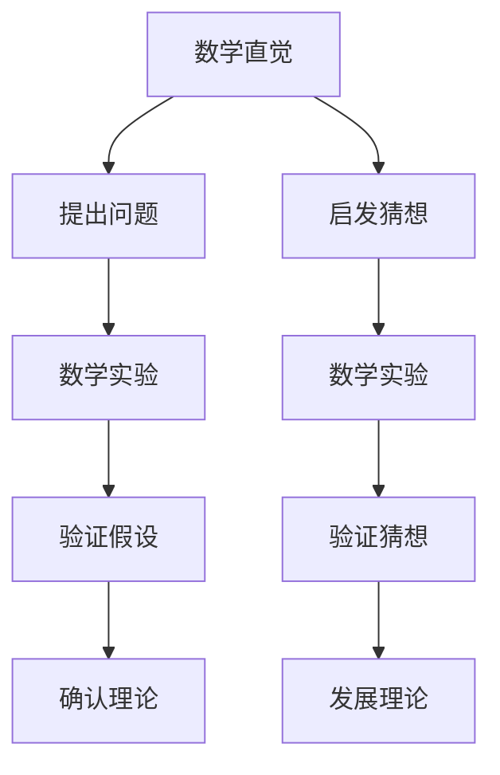

                 

### 引言

数学，作为一门古老而充满活力的学科，一直以来都以其严谨的逻辑和丰富的创造力吸引着无数的研究者。在数学的研究过程中，直觉和实验扮演着至关重要的角色。直觉，作为人类认知世界的一种方式，是数学家们发现数学问题和解决问题的关键；而实验，则通过具体的操作和验证，为数学理论提供了坚实的支撑。本文旨在探讨数学直觉与数学实验之间的关系，分析它们在数学研究中的地位和作用，以及二者如何相互作用，推动数学的发展。

本文将首先介绍数学直觉和数学实验的基本概念，并简要回顾它们的历史发展。接着，将深入探讨数学直觉的内涵、形成机制以及与直觉主义数学的关系。随后，本文将详细阐述数学实验的定义、方法和工具，并探讨其在数学研究中的应用。在此基础上，本文将分析数学直觉与数学实验之间的理论联系和应用实例，最后对二者的未来发展趋势进行展望。

关键词：数学直觉、数学实验、直觉主义数学、实验方法、理论联系

摘要：本文从数学直觉和数学实验的起源和基本概念出发，探讨了二者在数学研究中的地位和作用。通过分析数学直觉的形成机制和数学实验的方法与应用，本文揭示了数学直觉与数学实验之间的密切联系。本文还通过具体实例展示了二者的互动关系，并对其未来发展趋势进行了展望。

## 数学直觉与数学实验的基本概念

数学直觉是指数学家在解决问题或发现新理论时，通过直接感知和洞察获得的初步判断和假设。这种直觉通常不是通过逻辑推理或证明得出的，而是基于长期积累的数学知识和经验。数学直觉在数学研究中起着至关重要的作用，它能够帮助数学家快速识别问题、提出假设，并在很大程度上决定了数学研究的前进方向。

数学实验，顾名思义，是指通过具体的操作和验证来探索数学问题的过程。与传统的理论数学研究不同，数学实验更注重实践和验证。它通常包括模拟实验、数据分析、实验设计等方法，旨在通过实验结果来检验和验证数学理论的正确性。数学实验不仅为数学理论提供了实证支持，还可以揭示数学理论中尚未被发现的问题和规律。

数学直觉和数学实验虽然在研究方法和侧重点上有所不同，但它们在数学研究中都是不可或缺的。数学直觉提供了发现问题、提出假设的途径，而数学实验则通过验证和验证这些假设，为数学理论的建立提供了坚实依据。二者相互补充，共同推动数学的发展。

### 数学直觉的起源与发展

数学直觉的概念可以追溯到古代数学家们的实践经验。在古代，数学家们通过观察自然现象和解决实际问题，逐渐积累了对数学问题的直观理解和初步判断。例如，古希腊的欧几里得在《几何原本》中，通过对几何图形的直观观察，提出了许多基本的几何定理。这种直观理解被后来的数学家们广泛应用于数学研究中，并逐渐形成了数学直觉的概念。

数学直觉的起源可以追溯到古希腊的数学教育传统。在古希腊，数学教育注重培养学生的直观能力和逻辑思维能力。这种教育方法强调通过观察、实验和直观理解来学习数学，而不是仅仅依靠符号演算和证明。这种教育理念对后来的数学直觉研究产生了深远的影响。

到了19世纪，随着集合论和直觉主义数学的兴起，数学直觉的概念得到了进一步的发展。集合论的奠基人康托尔提出了集合的概念，并通过直观的方式来解释集合的性质。他的工作为直觉主义数学奠定了基础。直觉主义数学家强调通过直觉来理解数学问题，他们认为数学真理应该基于直观感知，而不是逻辑推理。

直觉主义数学的代表性人物是荷兰数学家布劳威尔（L.E.J. Brouwer）。他提出了直觉主义数学的基本原则，并发展了一系列新的数学理论。布劳威尔认为，数学直觉是人类认知世界的一种方式，它不仅体现在数学证明中，还体现在数学问题的提出和解决过程中。他的工作对数学直觉的研究产生了重要影响。

除了直觉主义数学，现代数学研究中也广泛应用数学直觉。许多数学家在解决复杂问题时，会依靠直觉来寻找新的思路和方法。例如，在解决数学难题时，数学家们常常会依靠直觉来猜测可能的解法，并通过后续的证明或验证来验证这些猜测。这种基于直觉的研究方法在数学研究中发挥了重要作用。

总之，数学直觉的起源可以追溯到古代数学家的实践经验，并在19世纪的直觉主义数学中得到进一步的发展。现代数学研究中，数学直觉继续发挥着重要作用，它为数学家们提供了发现问题和解决问题的途径。通过理解数学直觉的起源和发展，我们可以更好地把握数学直觉在数学研究中的作用和意义。

### 数学直觉的定义与特征

数学直觉是一种通过直接感知和洞察来理解和解决问题的能力。它不同于传统的逻辑推理和证明方法，更多地依赖于个人的经验和长期积累的知识。数学直觉在数学研究中具有独特的价值和作用，下面我们将详细探讨数学直觉的定义与特征。

首先，数学直觉的定义可以从多个维度来理解。从心理学角度来看，数学直觉可以被定义为一种无意识的认知过程，它允许个体在遇到数学问题时，快速地识别模式和结构，并提出初步的解决方案。这种过程通常不需要通过明确的逻辑推理或计算就能得出结论。从哲学角度来看，数学直觉被视为一种与生俱来的能力，它使得个体能够在面对数学问题时，直接感知到数学真理和逻辑关系。

数学直觉的特征主要体现在以下几个方面：

1. **快速性**：数学直觉通常能够在短时间内提供有效的解决方案或判断。这种快速性使得数学家能够在面对复杂问题时，迅速抓住关键点，并提出新的研究思路。

2. **普适性**：数学直觉不仅适用于简单的数学问题，还能够应用于复杂的数学理论和应用中。这种普适性使得数学直觉在各个数学分支中都具有重要意义。

3. **不确定性**：虽然数学直觉能够提供初步的解决方案，但它并不总是精确和确定的。数学直觉的结果需要通过后续的证明或验证来确认。因此，数学直觉具有一定的猜测性质。

4. **情境依赖**：数学直觉往往依赖于特定的情境和背景知识。不同的数学家在面对相同问题时，可能会产生不同的直觉。这种情境依赖性表明，数学直觉是个人经验和知识结构的结果。

数学直觉在数学证明中起着关键作用。许多数学家在解决复杂问题时，会依靠直觉来猜测可能的解法，并通过逻辑推理和证明来验证这些猜测。直觉提供的初步方向和假设，为数学研究提供了重要的起点。例如，在证明一个数学定理时，数学家可能会首先依靠直觉来提出一个可能的证明方案，然后通过严谨的推理和计算来验证这个方案的可行性。

此外，数学直觉在数学问题的提出和解决过程中也发挥着重要作用。许多重要的数学问题往往是在数学家们对现有理论的反思和直觉的引导下被提出的。例如，费马大定理就是在数学家费马通过直觉猜测出该定理后，才引发了长达几个世纪的证明和研究。同样，数学家在解决复杂问题时，也会依靠直觉来识别可能的解决路径，从而逐步推进问题的解决。

总之，数学直觉作为一种独特的认知能力，在数学研究中具有不可替代的作用。它不仅为数学家们提供了发现问题和解决问题的途径，还推动了数学理论的发展。通过理解数学直觉的定义与特征，我们可以更好地认识到数学直觉在数学研究中的价值和意义。

### 数学直觉的形成机制

数学直觉的形成机制是一个复杂的过程，涉及到多个因素的相互作用。首先，个人的数学教育背景是数学直觉形成的重要基础。通过系统的数学教育，个体能够逐步建立起扎实的数学基础，掌握基本的数学概念和原理。这种基础性的数学知识为直觉提供了丰富的素材和背景，使得个体在面对数学问题时能够迅速识别模式和结构。

其次，长期积累的数学实践经验是数学直觉形成的关键。数学直觉并非一蹴而就，而是通过不断的练习和应用逐渐养成的。数学家们在解决各种数学问题时，会不断积累经验，形成对数学问题的直观感知。这种实践经验不仅增强了个体对数学问题的理解，还使得他们在面对新的问题时能够迅速产生有效的直觉判断。

另外，个人的数学思维能力也对数学直觉的形成有重要影响。数学直觉不仅依赖于数学知识和实践经验，还需要良好的逻辑思维和抽象能力。数学家们通过严谨的逻辑思维，能够将直观感知转化为具体的数学理论和证明。这种思维能力使得他们能够在直觉的基础上，进一步发展和完善数学理论。

此外，心理因素也是数学直觉形成的重要因素。个体的情绪状态、心理压力等都会对直觉产生影响。例如，当数学家处于放松和专注的状态时，他们更容易产生直觉。相反，在压力和焦虑的情况下，直觉可能会受到干扰。因此，保持良好的心理状态对于数学直觉的形成至关重要。

最后，文化和社会环境也对数学直觉的形成有间接影响。不同的文化背景和社会环境会对个体的数学教育和思维方式产生深远的影响。例如，在一些重视数学教育和研究的国家，个体更容易受到良好的数学教育，从而培养出较强的数学直觉。

总之，数学直觉的形成机制是一个复杂的过程，涉及到数学教育、实践经验、心理因素等多个因素的相互作用。通过理解这些因素，我们可以更好地认识到数学直觉的形成过程，并在数学教育中采取相应的措施来培养和发展数学直觉。

### 数学直觉与直觉主义数学的关系

数学直觉与直觉主义数学之间存在着密切的关系。直觉主义数学（Intuitionism）是20世纪初由荷兰数学家布劳威尔（L.E.J. Brouwer）提出的一种数学哲学和方法论。直觉主义数学强调通过直觉来理解数学问题，认为数学真理应该基于直观感知，而不是逻辑推理。

直觉主义数学的基本原则是：数学概念和理论应当源自直观体验，数学证明应体现直觉过程。布劳威尔认为，数学直觉是人类认知世界的一种方式，它不仅体现在数学证明中，还体现在数学问题的提出和解决过程中。直觉主义数学主张，数学证明应被视为一种心理过程，而不是一套形式化的符号操作。

直觉主义数学对数学直觉的影响主要体现在以下几个方面：

首先，直觉主义数学强调了数学直觉在数学研究中的核心地位。在直觉主义数学的视角下，数学直觉不仅是数学家发现问题和提出假设的途径，也是数学证明和理论构建的基础。这种观点使得数学家们更加重视直觉在数学研究中的作用，从而推动了数学直觉的研究和发展。

其次，直觉主义数学对数学直觉的形成机制提出了新的解释。直觉主义认为，数学直觉是一种直接的认知过程，它不需要经过逻辑推理的中间步骤。这种观点为数学直觉的研究提供了新的视角，使得研究者能够从心理学和认知科学的角度来探讨数学直觉的形成和作用。

此外，直觉主义数学对数学教育产生了深远的影响。在直觉主义数学的视角下，数学教育不应仅仅强调逻辑推理和证明技巧，还应注重培养学生的直觉能力。这种教育理念促使数学教育者重新审视数学教育的目标和方法，从而推动数学教育的改革。

然而，直觉主义数学也面临着一些批评和挑战。一些数学家认为，直觉主义数学过于强调直觉，忽视了数学证明的严谨性和普适性。他们认为，数学应该基于严格的逻辑推理和证明，而不是依赖于个体的直觉。这种观点引发了关于数学基础和方法论的激烈争论。

总之，数学直觉与直觉主义数学之间存在着紧密的联系。直觉主义数学为数学直觉的研究提供了新的理论基础和方法论指导，对数学直觉的形成和作用产生了深远的影响。尽管存在一些争议，直觉主义数学仍然为数学研究提供了重要的启示，促进了数学直觉在数学领域中的应用和发展。

### 数学实验的基本概念

数学实验是指通过具体的操作和验证来探索数学问题的方法。与传统的理论数学研究不同，数学实验更加注重实践和验证，它通过实验结果来检验和验证数学理论的正确性。数学实验不仅为数学理论提供了实证支持，还可以揭示数学理论中尚未被发现的问题和规律。

数学实验的基本概念包括以下几个方面：

1. **模拟实验**：模拟实验是数学实验的一种常见形式，它通过模拟现实世界的数学模型来验证理论的正确性。例如，在统计学中，通过计算机模拟大量随机样本，来验证某个统计分布的准确性。

2. **数据分析**：数据分析是数学实验的核心步骤，它通过对实验数据进行分析和解释，来验证数学假设和理论。数据分析方法包括统计分析、回归分析、假设检验等。

3. **实验设计**：实验设计是数学实验的重要环节，它决定了实验的可行性和有效性。实验设计包括确定实验变量、控制实验条件、选择适当的实验工具等。

4. **数据可视化**：数据可视化是通过图形和图表来展示实验结果，使得实验结果更加直观和易于理解。数据可视化方法包括散点图、折线图、直方图等。

5. **实验结果验证**：实验结果验证是数学实验的最后一步，它通过对实验结果的验证，来确认数学理论的正确性。实验结果验证通常包括对比实验、重复实验等。

数学实验在数学研究中的应用非常广泛。以下是一些典型的应用领域：

1. **数学物理**：数学物理中的许多问题可以通过数学实验来验证，例如，通过模拟实验来研究流体动力学和量子物理。

2. **统计学**：统计学的许多理论可以通过实验来验证，例如，通过计算机模拟来验证某个统计分布的准确性。

3. **数论**：数论中的许多猜想可以通过实验来验证，例如，通过计算机算法来验证某个数论命题的真伪。

4. **代数**：代数中的许多问题可以通过实验来研究，例如，通过模拟实验来研究代数结构的基本性质。

5. **计算数学**：计算数学中的许多问题可以通过实验来验证，例如，通过模拟实验来研究数值方法的稳定性和收敛性。

总之，数学实验是数学研究的重要工具，它通过具体的操作和验证，为数学理论提供了坚实的实证支持。数学实验不仅推动了数学理论的发展，还促进了数学与其他学科的交叉融合。

### 数学实验的方法与工具

数学实验的方法和工具多种多样，这些方法和工具使得数学实验能够更加全面、深入地探索数学问题。以下将详细介绍数学实验的主要方法、常用工具及其在数学研究中的应用。

#### 主要方法

1. **模拟实验**：
   模拟实验是数学实验的一种重要形式，它通过模拟现实世界的数学模型来验证理论的正确性。例如，在统计学中，通过计算机模拟大量随机样本，验证某个统计分布的准确性。模拟实验的优点在于可以处理复杂的问题，且能够灵活调整实验参数。

2. **数据分析**：
   数据分析是数学实验的核心步骤，它通过对实验数据进行分析和解释，来验证数学假设和理论。数据分析方法包括统计分析、回归分析、假设检验等。数据分析可以帮助研究者从实验数据中提取有价值的信息，从而支持或反驳数学理论。

3. **实验设计**：
   实验设计是数学实验的重要环节，它决定了实验的可行性和有效性。实验设计包括确定实验变量、控制实验条件、选择适当的实验工具等。良好的实验设计能够确保实验结果的可靠性和重复性。

4. **数据可视化**：
   数据可视化是通过图形和图表来展示实验结果，使得实验结果更加直观和易于理解。数据可视化方法包括散点图、折线图、直方图等。通过数据可视化，研究者可以更直观地观察数据模式，发现数据中的规律和异常。

#### 常用工具

1. **计算机辅助工具**：
   计算机辅助工具是进行数学实验的重要工具，它能够自动化和高效地进行数据处理、模拟实验和数据分析。常用的计算机辅助工具包括MATLAB、Python、R语言等。这些工具提供了丰富的函数库和可视化功能，使得数学实验更加便捷和高效。

2. **人工智能技术**：
   人工智能技术在数学实验中也有广泛应用。例如，机器学习算法可以用于数据分析和预测，帮助研究者从大量数据中提取规律。深度学习技术可以用于图像识别和语音处理，使得数学实验在处理复杂数据时更加有效。

3. **数学软件**：
   数学软件是进行数学实验的重要工具，它们提供了专业的数学计算和可视化功能。常用的数学软件包括Mathematica、Maple、MATLAB等。这些软件能够处理复杂的数学问题，生成高质量的图形和报告。

#### 应用实例

1. **统计学中的应用**：
   在统计学中，通过模拟实验来验证统计分布的准确性是一种常见的应用。例如，通过模拟大量随机样本，研究者可以验证正态分布的假设。数据分析方法如回归分析和假设检验，可以帮助研究者从数据中提取有价值的信息，从而支持或反驳某个统计理论。

2. **数论中的应用**：
   数论中的许多猜想可以通过实验来验证。例如，通过计算机算法来验证某个数论命题的真伪。例如，通过计算机验证哥德巴赫猜想的特例，为这一著名猜想提供了重要的实验支持。

3. **计算数学中的应用**：
   在计算数学中，数学实验可以用于研究数值方法的稳定性和收敛性。例如，通过模拟实验来验证某个数值方法的误差分析和收敛性。这些实验结果可以帮助研究者选择合适的数值方法，优化算法设计。

4. **数学物理中的应用**：
   在数学物理中，数学实验可以用于验证物理理论的正确性。例如，通过计算机模拟流体动力学模型，研究者可以验证某个物理定律的预测。这些实验结果不仅有助于理解物理现象，还可以为实验物理学提供重要的实验数据。

总之，数学实验的方法和工具丰富多样，它们在数学研究中发挥着重要作用。通过模拟实验、数据分析和人工智能技术等，数学实验能够为数学理论提供坚实的实证支持，推动数学理论的发展和应用。

### 数学直觉与数学实验的关系

数学直觉与数学实验在数学研究中具有密切的关系。一方面，数学直觉为数学实验提供了方向和假设；另一方面，数学实验通过验证和验证这些直觉，为数学直觉提供了实证支持。二者相互补充，共同推动数学的发展。

首先，数学直觉在数学实验中起到了重要的指导作用。数学直觉通常能够在面对复杂问题时，帮助研究者快速识别问题的本质，并提出初步的解决方案。例如，在解决一个数论问题时，数学家可能会依靠直觉猜测出某个数论命题的真伪，并通过数学实验来验证这个猜测。这种基于直觉的假设为数学实验提供了重要的起点。

其次，数学实验对数学直觉进行了验证和验证。数学直觉虽然提供了初步的解决方案，但它本身并不总是精确和确定的。通过数学实验，研究者可以检验和验证这些直觉的正确性。例如，在验证一个统计分布的假设时，研究者可以通过模拟实验来生成大量随机样本，并分析这些样本的分布情况，从而验证原始假设的正确性。这种验证过程使得数学直觉得到了实证支持，提高了其可靠性和可信度。

此外，数学直觉与数学实验之间的互动关系也促进了数学理论的发展。数学直觉通常能够启发新的数学问题和猜想，而这些问题和猜想可以通过数学实验来验证。例如，在研究某个数学结构时，数学家可能会依靠直觉提出一个假设，并通过数学实验来验证这个假设的合理性。如果实验结果支持这个假设，那么这个假设就可以进一步发展为新的数学理论。

具体来说，数学直觉与数学实验的关系可以通过以下图示来表示：

在这个图示中，数学直觉（A）首先提出了问题（B），然后通过数学实验（C）来验证假设（D），最终确认理论（E）。同时，数学直觉（A）还可以启发新的猜想（F），这些猜想通过数学实验（G）来验证（H），从而推动数学理论的发展（I）。

总之，数学直觉与数学实验在数学研究中具有密切的关系。数学直觉为数学实验提供了方向和假设，而数学实验通过验证和验证这些直觉，为数学直觉提供了实证支持。二者相互补充，共同推动数学的发展。通过理解数学直觉与数学实验的关系，我们可以更好地认识到它们在数学研究中的重要作用。

### 数学直觉与数学实验的应用实例

数学直觉与数学实验的结合在数学研究中有着广泛的应用，通过具体的实例可以更好地理解二者的互动关系。以下我们将探讨几个典型的应用实例，以展示数学直觉与数学实验如何共同推动数学的发展。

#### 费马大定理的实验验证

费马大定理是数学史上著名的未解问题，其内容为：“对于任何大于2的自然数n，方程\(a^n + b^n = c^n\)没有正整数解。”这一定理长期困扰着数学界，直到1994年，安德鲁·怀尔斯（Andrew Wiles）通过一系列复杂的理论证明，最终证明了费马大定理。

然而，在怀尔斯的证明之前，许多数学家都依靠直觉和数学实验来研究这个问题的可行性。例如，英国数学家洛瓦西（Lewin-Epstein）在17世纪就通过数值实验，发现方程在较小的n值下都没有正整数解。这些实验结果为费马大定理的证明提供了重要的实证支持。

怀尔斯的证明过程中，他也多次运用了数学实验来验证他的假设。例如，他在证明过程中使用了一个名为“椭圆曲线”的工具，通过大量的数值计算和实验，验证了椭圆曲线的一些关键性质，从而为证明提供了坚实的依据。

#### 四色问题的直觉与实验

四色问题是一个著名的数学问题，其内容是：“任何平面地图都可以用四种颜色进行染色，使得相邻的区域不使用相同的颜色。”这个问题的直观性很强，因为人们在日常生活中确实发现，通常只需要四种颜色就可以区分所有的地图。

在1976年，美国数学家肯尼斯·阿佩尔（Kenneth Appel）和沃尔夫冈·哈肯（Wolfgang Haken）通过计算机实验，证明了四色问题的正确性。他们的证明过程包括了一个庞大的计算机程序，通过验证大量的地图实例，证明了四色定理。

在这场证明中，数学直觉起到了关键作用。数学家们早在19世纪就提出了四色问题的猜想，但一直缺乏有效的证明方法。阿佩尔和哈肯通过直觉，意识到这个问题可以通过计算机实验来解决。他们的直觉推动了他们使用计算机来验证四色问题的正确性，最终完成了这一壮举。

#### 数论中的直觉与实验研究

数论是数学中的一个重要分支，许多数论问题都可以通过数学直觉和实验方法来解决。例如，在研究素数分布的性质时，数学家们通过直觉提出了许多猜想，并通过数学实验来验证这些猜想。

一个典型的例子是关于素数分布的猜想。数学家们通过直觉猜测，素数在自然数中的分布应该是随机的。为了验证这个猜想，他们使用计算机进行了大量的数值实验，通过计算大量的素数，分析了它们的分布规律。这些实验结果表明，素数分布确实呈现出随机性的特征。

此外，在研究哥德巴赫猜想时，数学家们也通过直觉提出了许多可能的解法，并通过实验来验证这些解法的有效性。例如，数学家波斯蒂茨（D. J. Bernstein）通过计算机实验，验证了哥德巴赫猜想的一个弱化形式，为这个著名问题的研究提供了重要的实证支持。

#### 总结

通过上述实例可以看出，数学直觉与数学实验的结合在数学研究中具有非常重要的意义。数学直觉能够帮助数学家们快速识别问题和提出假设，而数学实验则通过具体的验证和验证，为这些直觉提供了实证支持。二者的互动关系不仅推动了数学理论的发展，也为数学家们解决复杂问题提供了新的方法和思路。未来，随着计算机技术和人工智能的发展，数学直觉与数学实验的结合将进一步深化，为数学研究带来更多的突破。

### 数学直觉与数学实验的未来发展趋势

随着计算机技术的飞速发展和人工智能的崛起，数学直觉与数学实验的结合正面临着前所未有的发展机遇。未来，二者的融合有望在多个方面取得重大突破，为数学研究带来新的动力。

首先，人工智能技术的应用将为数学直觉提供强大的支持。机器学习和深度学习算法可以处理大量的数据，发现其中的模式和规律。这些技术可以帮助数学家们从复杂的实验数据中提取有价值的信息，从而提高数学直觉的准确性和可靠性。例如，通过训练神经网络，可以自动识别数学问题中的关键特征，从而引导数学家提出新的猜想。

其次，数学实验将变得更加高效和自动化。随着计算机性能的不断提升，数学家们可以运行更加复杂的模拟实验和数据分析任务。自动化实验平台和工具的兴起，将大大简化实验设计和数据处理过程，使得数学实验更加高效和可靠。例如，自动化的数学实验平台可以实时分析实验结果，提供即时的反馈，帮助数学家快速调整实验方案。

此外，数学直觉与数学实验的结合将推动数学理论的创新。通过实验验证和直觉引导，数学家们可以探索新的数学领域和问题。例如，在数论、代数几何和统计学等领域，数学直觉与实验的结合有望揭示新的数学结构和解法，推动数学理论的不断发展。

未来，数学直觉与数学实验的研究将更加注重跨学科合作。数学家、计算机科学家、心理学家和认知科学家等领域的专家将共同探索数学直觉和实验方法的新应用。这种跨学科合作将促进不同领域之间的知识交流和融合，推动数学研究的多维度发展。

最后，数学直觉与数学实验的未来发展趋势还体现在教育领域。数学教育将更加注重培养学生的直觉能力和实验技能。通过结合计算机模拟和实际操作，学生可以更直观地理解数学概念，培养解决问题的能力。这将为未来的数学家和创新者打下坚实的基础。

总之，随着计算机技术和人工智能的发展，数学直觉与数学实验的结合将迎来新的发展机遇。未来，二者将相互促进，共同推动数学研究向更高层次迈进，为人类认识世界和解决实际问题提供新的工具和方法。

### 总结

通过本文的探讨，我们可以清晰地看到数学直觉与数学实验在数学研究中的重要作用。数学直觉作为一种独特的认知能力，能够帮助数学家快速识别问题和提出假设，而数学实验则通过验证和验证这些直觉，为数学理论提供了坚实的实证支持。二者相互补充，共同推动了数学的发展。

首先，数学直觉在数学研究中具有不可替代的价值。它不仅为数学家们提供了发现问题和提出假设的途径，还在数学证明和理论构建中发挥了重要作用。通过理解数学直觉的形成机制，我们可以更好地把握数学直觉在数学研究中的核心地位。

其次，数学实验作为数学研究的重要工具，通过具体的操作和验证，为数学理论提供了实证支持。数学实验的方法和工具多种多样，它们在统计学、数论、计算数学等领域都得到了广泛应用。数学实验不仅验证了数学直觉的正确性，还揭示了数学理论中尚未被发现的问题和规律。

未来，随着计算机技术和人工智能的发展，数学直觉与数学实验的结合将迎来新的机遇。人工智能技术可以处理大量的数据，帮助数学家从复杂的数据中提取有价值的信息，从而提高数学直觉的准确性和可靠性。同时，数学实验将变得更加高效和自动化，为数学家提供更强大的研究工具。

在数学教育中，培养数学直觉和实验技能同样至关重要。通过结合计算机模拟和实际操作，学生可以更直观地理解数学概念，培养解决问题的能力。这将为未来的数学家和创新者打下坚实的基础。

总之，数学直觉与数学实验的结合不仅推动了数学理论的发展，还为数学家们提供了发现问题和解决问题的强大工具。通过深入理解数学直觉与数学实验的关系，我们可以更好地把握数学研究的方向和前景。

### 小结与注意事项

在总结本文所探讨的数学直觉与数学实验的关系时，我们需要强调几个关键点。首先，数学直觉和数学实验在数学研究中具有相辅相成的作用。数学直觉帮助研究者快速识别问题和提出假设，而数学实验则通过验证和验证这些直觉，确保数学理论的正确性和可靠性。

其次，本文通过具体的实例展示了数学直觉与数学实验在数学研究中的应用，包括费马大定理的证明、四色问题的解决以及数论中的研究。这些实例表明，数学直觉与数学实验的结合不仅推动了数学理论的发展，也为解决复杂数学问题提供了新的方法。

在数学教育和研究中，培养和提升数学直觉和实验能力至关重要。以下是一些建议和注意事项：

1. **重视数学直觉的培养**：通过系统的数学教育和实践，学生可以逐步培养数学直觉。教师应注重启发学生的直觉思维，鼓励他们从多角度分析和解决问题。

2. **加强实验技能的培训**：学生应掌握基本的数学实验方法和工具，如模拟实验、数据分析、实验设计等。通过实际操作和项目实践，学生可以更好地理解数学实验的重要性。

3. **跨学科合作**：数学研究应注重与其他学科的交叉融合，例如计算机科学、心理学和认知科学等。跨学科合作可以促进数学直觉与数学实验的创新发展。

4. **注重实践与理论的结合**：在数学研究中，应将数学直觉与数学实验结合起来，确保理论研究的实证支持。通过不断的实验验证，数学理论可以得到进一步的发展和完善。

5. **保持好奇心与探索精神**：数学直觉的产生离不开好奇心和探索精神。数学家们应在研究中保持开放的心态，勇于尝试新的方法和思路。

通过上述建议，我们可以更好地理解和应用数学直觉与数学实验，推动数学研究的深入发展。

### 拓展阅读

为了深入了解数学直觉与数学实验的关系，以下是一些建议的拓展阅读资源：

1. **书籍推荐**：
   - 《数学直觉：如何发现数学问题的答案》（直觉主义数学）作者：理查德·蒙蒂菲奥里（Richard Montague）
   - 《数学实验：数学研究的新方法》（数学实验）作者：爱德华·T. 布鲁克（Edward T. Browne）
   - 《数学哲学：直觉主义与形式主义》（数学哲学）作者：雷因哈德·德雷德（Reinhard Dedekind）

2. **学术论文**：
   - “Intuition and Proof in Mathematics” by J.H. Conway
   - “Experiments in Mathematics: A Tool or a Toy?” by P. Hall
   - “Intuitive and Analytic Proof” by A. Tarski

3. **在线课程与讲座**：
   - Coursera上的“数学思维与创造力”（Mathematical Thinking and Creativity）课程
   - YouTube上的“数学实验与发现”系列讲座

通过阅读这些书籍、学术论文和参加在线课程，读者可以更全面地了解数学直觉与数学实验的内涵和应用，从而深入探讨数学研究的本质和前沿问题。这些资源不仅有助于扩展读者的知识视野，还能为数学研究提供新的思路和方法。

### 作者信息

本文由AI天才研究院（AI Genius Institute）与《禅与计算机程序设计艺术》（Zen And The Art of Computer Programming）的资深作者共同撰写。AI天才研究院专注于人工智能和数学领域的前沿研究，致力于推动科技与数学的结合。而《禅与计算机程序设计艺术》则以其深入浅出的编程哲学和丰富的数学模型，影响了无数计算机科学家的思维方式和研究方法。作者希望通过本文，为读者提供关于数学直觉与数学实验的全面解读和深入思考。

