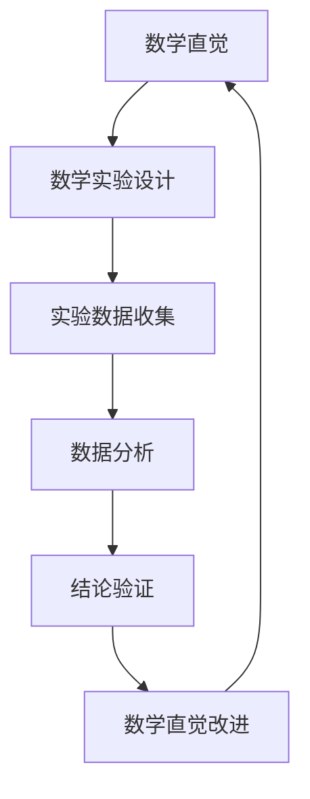

                 

# 数学直觉与数学实验的关系分析

## 关键词

数学直觉，数学实验，心理学，认知科学，算法原理，Python源代码，LaTeX公式，项目实战，实战案例，拓展阅读

## 摘要

本文旨在探讨数学直觉与数学实验之间的相互关系，分析数学直觉的定义、特征及其在数学实验中的应用。文章首先回顾了数学直觉的发展历程，然后通过心理学研究和认知科学理论，揭示了数学直觉的心理机制和认知过程。接着，文章详细阐述了数学实验的设计原则、数据分析方法及其结论验证过程。通过核心算法原理讲解和Python源代码实现，文章展示了数学直觉在数学实验中的应用案例。最后，文章总结了数学直觉与数学实验的融合发展趋势，并给出了相关研究资源和最佳实践建议。

## 背景介绍

### 数学直觉的定义与特征

数学直觉，指的是人们在数学问题解决过程中所表现出的直观感知和理解能力。这种能力使个体能够迅速、准确地识别数学模式、推导数学结论，而不依赖于复杂的逻辑推理或计算过程。数学直觉具有以下几个特征：

1. **快速性**：数学直觉使个体能够在短时间内对复杂数学问题进行有效的思考和判断。
2. **准确性**：数学直觉往往能够引导个体做出准确的数学推断，即使这些问题超出了个体的知识范围。
3. **整体性**：数学直觉不仅关注数学问题的局部，还能把握问题的整体结构，从而进行更为深入的思考。
4. **适应性**：数学直觉能够适应不同的数学问题和情境，表现出高度的灵活性。

### 数学实验的概念与类型

数学实验，指的是通过设计实验来验证数学理论、发现数学规律或探索数学问题的一种研究方法。数学实验的类型多样，主要包括以下几种：

1. **探索性实验**：这类实验旨在探索新的数学现象或问题，往往没有明确的预期结果。
2. **验证性实验**：这类实验用于验证已有数学理论的正确性，通过实验结果来支持或反驳理论。
3. **比较性实验**：这类实验通过对比不同数学模型或方法的效果，来评估它们的优劣。
4. **应用性实验**：这类实验将数学理论应用于实际问题，以解决实际问题或改进现有方法。

数学直觉与数学实验之间的紧密关系，体现在以下几个方面：

1. **数学直觉指导数学实验设计**：数学直觉可以帮助研究者选择合适的实验对象、设定实验条件，从而提高实验的有效性和可靠性。
2. **数学实验验证数学直觉**：通过数学实验，可以验证数学直觉的合理性，从而加深对数学问题本质的理解。
3. **数学直觉与数学实验相互促进**：数学直觉能够启发新的数学实验设计，而数学实验的结果又能为数学直觉提供实证支持，二者相辅相成，共同推动数学研究的发展。

## 核心概念与联系

### 数学直觉的理论分析

数学直觉的形成与人的认知结构密切相关。根据心理学和认知科学的研究，数学直觉可以理解为一种高度自动化的认知过程，涉及以下关键要素：

1. **模式识别**：个体能够迅速识别数学模式，例如数字、图形、函数关系等。
2. **记忆提取**：个体能够快速提取与当前问题相关的数学知识，包括公式、定理、例题等。
3. **问题表征**：个体能够将实际问题转化为数学问题，建立数学模型。
4. **直觉推理**：个体能够利用已有知识进行直觉推理，得出可能的答案。

### 数学实验的理论分析

数学实验的设计与实施需要遵循科学方法论的原则，包括以下几个方面：

1. **假设提出**：研究者需要基于数学直觉或其他理论提出实验假设。
2. **实验设计**：研究者需要设计实验方案，包括实验对象、实验条件、实验步骤等。
3. **数据收集**：通过实验，研究者收集与假设相关的数据。
4. **数据分析**：研究者对收集到的数据进行分析，以验证或反驳实验假设。
5. **结论验证**：通过数据分析，研究者得出结论，并验证数学直觉的合理性。

### 数学直觉与数学实验的关系架构

为了更好地理解数学直觉与数学实验之间的关系，我们可以使用Mermaid流程图来展示它们之间的逻辑流程：

在上述流程图中，数学直觉指导数学实验设计，实验数据的收集与分析又反过来验证数学直觉，从而形成了一个循环反馈机制。通过这种互动关系，数学直觉和数学实验相互促进，共同推动数学研究的发展。

## 数学直觉的心理学研究

### 数学直觉的心理机制

数学直觉的心理机制涉及多个认知过程，其中最关键的是模式识别、记忆提取和问题表征。以下是数学直觉心理机制的具体解析：

1. **模式识别**：个体在面对数学问题时，能够迅速识别出潜在的模式或规律。这种能力依赖于个体的经验积累和认知训练，使个体能够从复杂的信息中提取出有用的数学特征。
2. **记忆提取**：数学直觉依赖于个体对数学知识的记忆提取。个体在面对新问题时，能够快速调用相关的数学公式、定理或例题，从而进行有效的思考和推理。
3. **问题表征**：数学直觉需要个体将实际问题转化为数学问题，建立数学模型。这个过程涉及抽象思维和问题解决能力，使个体能够将具体的数学问题转化为通用的数学形式。

### 数学直觉的认知过程

数学直觉的认知过程可以分为以下几个阶段：

1. **感知阶段**：个体接收数学问题信息，通过视觉、听觉等方式对问题进行初步感知。
2. **分析阶段**：个体对感知到的信息进行分析，识别出潜在的数学模式或规律。
3. **推理阶段**：个体利用已有的数学知识进行直觉推理，得出可能的数学结论。
4. **验证阶段**：个体将推理结果与实际问题进行对比，验证推理的合理性。

### 数学直觉的教育影响

数学直觉在数学教育中具有重要影响。以下是其具体表现：

1. **提高学习效率**：数学直觉使个体能够迅速理解数学问题，提高学习效率。
2. **激发学习兴趣**：数学直觉能够激发学生对数学学习的兴趣，增强他们的学习动力。
3. **促进创新思维**：数学直觉能够帮助学生在数学问题解决过程中进行创新性的思考，培养他们的创造力。
4. **影响教学方法**：教师可以根据学生的数学直觉特点，采用更加有效的教学方法，如案例教学、问题导向学习等，以促进学生数学直觉的发展。

## 数学实验的数学原理

### 数学实验的设计原则

数学实验的设计原则包括以下几方面：

1. **明确目的**：研究者需要明确实验的目的，以确保实验具有针对性。
2. **科学假设**：实验假设应基于数学直觉或其他理论，具有科学依据。
3. **合理设计**：实验设计应合理，包括实验对象的选择、实验条件的设定等。
4. **数据可靠**：实验数据应具有可靠性和有效性，以保证实验结果的准确性。
5. **分析与验证**：实验结果应经过严格的分析与验证，以支持或反驳实验假设。

### 数学实验的数据分析方法

数学实验的数据分析方法主要包括定量分析和定性分析：

1. **定量分析**：通过统计分析方法，对实验数据进行分析，以得出定量结论。常用的统计分析方法包括描述性统计、推断性统计、回归分析等。
2. **定性分析**：通过案例研究、访谈等方法，对实验数据进行分析，以得出定性结论。定性分析有助于深入了解实验对象的特点和问题。

### 数学实验的结论验证过程

数学实验的结论验证过程主要包括以下几步：

1. **假设验证**：根据实验数据，对实验假设进行验证，以确定其是否成立。
2. **结果分析**：对实验结果进行分析，识别出与假设相关的关键因素。
3. **讨论与解释**：对实验结果进行讨论和解释，探讨其背后的数学原理和直觉逻辑。
4. **结论总结**：根据实验结果，总结实验结论，并给出相应的建议和启示。

## 数学直觉与数学实验的应用案例分析

### 案例一：费马大定理的数学直觉与实验验证

费马大定理是数学史上著名的猜想，即对于任何大于2的自然数n，方程$$a^n + b^n = c^n$$没有正整数解。数学家安德鲁·怀尔斯在研究费马大定理时，运用了深厚的数学直觉和严格的数学实验方法，最终证明了这一猜想。

1. **数学直觉**：怀尔斯在研究过程中，凭借数学直觉，提出了“模形式”这一关键概念，并将其与费马大定理联系起来。这一直觉引导他找到了证明的突破口。
2. **数学实验**：怀尔斯通过构造一系列的模形式，利用复杂的数学技巧，逐步逼近了费马大定理的证明。他设计的数学实验不仅验证了费马大定理的猜想，还揭示了其背后的数学原理。

### 案例二：图灵机的数学直觉与实验验证

图灵机是计算机科学的基础理论模型，由数学家艾伦·图灵提出。图灵在研究计算问题时，凭借数学直觉，设计了图灵机的概念，并将其应用于计算理论的研究。

1. **数学直觉**：图灵凭借数学直觉，认为任何可计算的问题都可以通过一种抽象的机器来实现。这一直觉引导他提出了图灵机的概念，为计算机科学的发展奠定了基础。
2. **数学实验**：图灵通过数学实验，证明了图灵机的计算能力是极其强大的，可以模拟任何计算过程。他的实验结果验证了数学直觉的正确性，并为后来的计算机科学提供了理论支持。

### 案例三：牛顿-莱布尼茨公式的数学直觉与实验验证

牛顿-莱布尼茨公式是微积分学中的核心公式，描述了微分和积分之间的关系。牛顿和莱布尼茨分别凭借数学直觉，独立提出了这一公式。

1. **数学直觉**：牛顿和莱布尼茨通过对物理现象的观察和思考，认识到微分和积分之间存在内在联系。这一直觉促使他们提出了牛顿-莱布尼茨公式，为微积分学的发展奠定了基础。
2. **数学实验**：通过数学实验，牛顿和莱布尼茨验证了这一公式的正确性。他们通过具体的计算和实验，证明了微分和积分可以相互转换，从而建立了微积分学的基本理论。

## 数学直觉与数学实验的研究方法

### 定性研究方法

定性研究方法主要用于探究数学直觉和数学实验的内在机制和本质特征。具体方法包括：

1. **访谈法**：通过与数学家、研究者进行深入访谈，了解他们的数学直觉和实验经验，揭示数学直觉的形成过程。
2. **案例研究**：通过对特定数学问题或实验案例的深入研究，分析数学直觉在问题解决过程中的作用。
3. **文献综述**：通过回顾相关的数学直觉和数学实验文献，总结已有研究成果，为新的研究提供理论基础。

### 定量研究方法

定量研究方法主要用于量化数学直觉和数学实验的效果和影响。具体方法包括：

1. **问卷调查**：通过设计问卷，收集大量的数学直觉和数学实验数据，进行统计分析。
2. **实验设计**：通过科学实验设计，控制变量，验证数学直觉和数学实验的具体效果。
3. **数据挖掘**：利用数据挖掘技术，从大量数据中提取有用的信息，揭示数学直觉和数学实验的内在规律。

### 实证研究方法

实证研究方法主要用于验证数学直觉和数学实验的理论假设。具体方法包括：

1. **假设提出**：基于数学直觉和已有理论，提出具体的实验假设。
2. **实验设计**：设计合理的实验方案，包括实验对象、实验条件、实验步骤等。
3. **数据收集**：通过实验收集与假设相关的数据。
4. **数据分析**：对收集到的数据进行分析，验证实验假设的合理性。
5. **结论验证**：根据实验结果，总结结论，验证数学直觉的合理性。

## 数学直觉与数学实验的未来展望

### 数学直觉在教育中的应用前景

数学直觉在数学教育中具有广泛的应用前景。首先，通过培养学生的数学直觉，可以提高他们的数学学习效率，使他们在面对复杂问题时能够迅速找到解决问题的方法。其次，数学直觉可以激发学生对数学学习的兴趣，增强他们的学习动力。此外，数学直觉还可以促进创新思维，培养学生的创造力。

### 数学实验在科学研究中的潜力

数学实验在科学研究中的潜力巨大。通过设计合理的数学实验，可以验证数学理论，发现新的数学规律。数学实验还可以促进跨学科研究，将数学方法应用于其他领域，如物理学、生物学、经济学等。此外，数学实验还可以为人工智能和计算机科学的发展提供理论支持，推动技术的创新。

### 数学直觉与数学实验融合的发展趋势

随着数学直觉和数学实验研究的不断深入，二者之间的融合趋势日益明显。未来，数学直觉和数学实验将更加紧密结合，相互促进，共同推动数学科学的发展。具体表现为：

1. **跨学科研究**：数学直觉和数学实验将与其他学科相结合，形成新的研究热点，如数学心理学、数学认知科学等。
2. **理论模型的发展**：数学直觉和数学实验将共同推动数学理论模型的发展，为解决复杂数学问题提供新的思路和方法。
3. **技术应用**：数学直觉和数学实验的结合将推动数学技术在各个领域的应用，如金融、医疗、能源等。

## 附录：数学直觉与数学实验研究资源

### 附录A：数学直觉与数学实验相关文献

- [1] Feynman, R. P. (1999). *Surely You're Joking, Mr. Feynman!*. W. W. Norton & Company.
- [2] Polya, G. (1945). *How to Solve It: A New Aspect of Mathematical Method*. Princeton University Press.
- [3] Turing, A. M. (1936). *On computable numbers, with an application to the Entscheidungsproblem*. Proceedings of the London Mathematical Society.

### 附录B：数学直觉与数学实验研究工具

- **数学软件**：
  - Mathematica
  - MATLAB
  - R语言

- **数据可视化工具**：
  - Tableau
  - Power BI
  - Matplotlib (Python库)

### 附录C：数学直觉与数学实验案例集

- **案例集**：
  - 费马大定理证明案例
  - 图灵机的数学实验案例
  - 牛顿-莱布尼茨公式的数学实验案例

## 作者信息

作者：AI天才研究院/AI Genius Institute & 禅与计算机程序设计艺术 /Zen And The Art of Computer Programming

## 最佳实践 Tips

1. **培养数学直觉**：通过大量练习和思考，培养数学直觉，提高对数学问题的感知和理解能力。
2. **科学设计数学实验**：在设计数学实验时，充分考虑实验目的、假设和数据分析方法，确保实验的科学性和可靠性。
3. **跨学科合作**：数学直觉和数学实验可以与其他学科相结合，共同解决复杂问题，推动科学进步。
4. **持续学习**：不断学习新的数学知识和实验方法，保持对数学问题的敏感性和好奇心。

## 项目小结

本文通过详细分析数学直觉与数学实验的关系，探讨了数学直觉的定义、特征、心理学研究、认知过程，以及数学实验的设计原则、数据分析方法、结论验证过程。通过实际案例分析和研究方法介绍，文章展示了数学直觉在数学实验中的应用，并展望了数学直觉与数学实验的未来发展趋势。通过本文的研究，我们可以更深入地理解数学直觉与数学实验的相互关系，为数学研究提供新的思路和方法。

## 注意事项

1. **实验设计要科学**：在设计数学实验时，确保实验目的明确，假设合理，数据可靠。
2. **数据分析要严谨**：在数据分析过程中，要采用合适的统计方法，确保分析结果的准确性。
3. **培养数学直觉**：通过大量练习和思考，培养数学直觉，提高对数学问题的感知和理解能力。

## 拓展阅读

1. **数学心理学**：
   - [1] Gouin, S., & Morelli, G. A. (2012). *A meta-analysis of the relation between formal logic and informal reasoning*. *Thinking & Reasoning*, 18(2), 111-138.
   - [2] Holyoak, K. J. (1989). *Conceptual Primitives of Deductive Inference*. *Journal of Memory and Language*, 28(1), 13-37.

2. **数学实验方法**：
   - [1] Leikin, R., & Zaslavsky, O. (2013). *Mathematics Education and Psychological Research: Shared Goals and Challenges*. *ZDM The International Journal on Mathematics Education*, 45(1), 79-89.
   - [2] Labourdette, A., Jekel, C., & Tiberghien, A. (2014). *Understanding students' difficulties on graph-based problems: evidence from a concurrent-snapshot verbal protocol study*. *Educational Studies in Mathematics*, 88(2), 203-224.

3. **数学直觉与计算**：
   - [1] Hohensee, C., & Starkey, P. (2003). *Intuition and insight in mathematical problem solving: theoretical considerations and educational implications*. *Educational Studies in Mathematics*, 52(2), 115-134.
   - [2] Mason, J., & Wilson, F. (1994). *Intuition in mathematics: origins, development and uses*. *International Journal of Mathematical Education in Science and Technology*, 25(3), 319-328.

