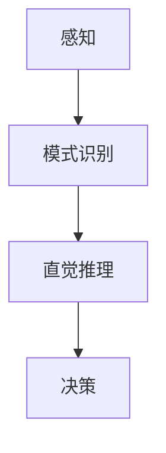
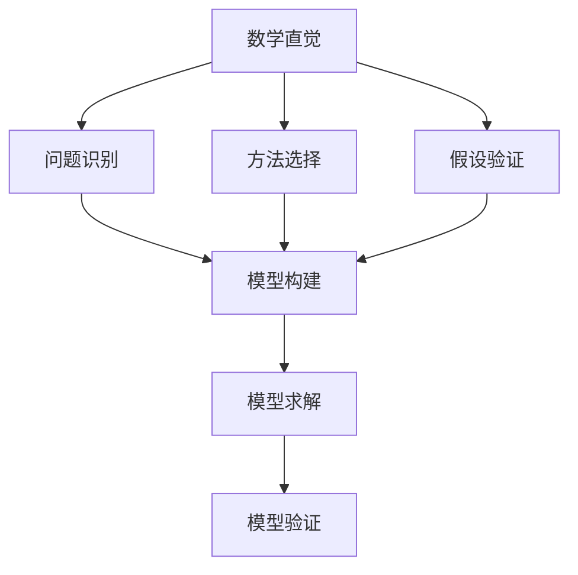

                 


# 《数学直觉与数学建模的关系探讨》

## 关键词
数学直觉，数学建模，认知心理学，人工智能，算法设计

## 摘要
本文旨在探讨数学直觉与数学建模之间的关系，分析数学直觉如何影响数学建模过程，以及数学建模如何反映数学直觉。通过对数学直觉的基本概念、心理学基础及其在教育中的应用的介绍，结合数学建模的定义、方法及应用领域，本文将详细阐述数学直觉与数学建模的相互作用。同时，通过案例研究和项目实战，本文将展示如何培养和发展数学直觉，并探讨数学直觉在数学建模中的实际应用。

## 引言

### 1. 数学直觉与数学建模的重要性

数学直觉是指人们在面对数学问题时，凭借非正式的逻辑推理、经验和观察，迅速获得数学概念、规律和问题的解决方法的能力。这种能力在数学研究中具有重要作用，可以启发数学发现和创新的思维过程。数学建模则是指使用数学语言和方法来描述和分析现实世界的现象和问题，从而为问题的解决提供量化的、结构化的解决方案。

数学直觉与数学建模之间的关系密切。一方面，数学直觉往往能够帮助数学家快速找到数学问题的解决方向，激发新的数学理论和方法的发展。另一方面，数学建模过程中，建模者常常需要依赖数学直觉来选择合适的数学工具和方法，构建有效的数学模型。因此，数学直觉与数学建模的相互作用不仅对数学研究具有重要影响，也对人工智能、算法设计等领域的发展具有重要意义。

### 2. 本书结构安排

本文将分为以下几个部分：

1. **数学直觉的基本概念**：介绍数学直觉的定义、来源、发展历史及其在数学研究中的作用。
2. **数学建模的基本原理**：讨论数学建模的定义、目的、方法及其在各个领域的应用。
3. **数学直觉与数学建模的关系**：分析数学直觉如何影响数学建模，数学建模如何反映数学直觉。
4. **案例研究**：通过实际案例来展示数学直觉在数学建模中的应用。
5. **方法论**：探讨如何培养和发展数学直觉，如何将数学直觉应用于数学建模。
6. **总结与展望**：对数学直觉与数学建模的关系进行总结，并对未来研究方向进行展望。

## 第一部分：数学直觉的基本概念

### 第1章 数学直觉的概念与历史

#### 1.1 数学直觉的定义

数学直觉是指人们在解决数学问题时，凭借非正式的逻辑推理、经验和观察，迅速获得数学概念、规律和问题的解决方法的能力。它不同于逻辑推理和证明，但常常是发现数学规律和解决问题的有效途径。

#### 1.2 数学直觉的历史发展

数学直觉在数学发展史上起到了重要作用。从古希腊时期到现代数学，许多数学家都依靠直觉进行数学研究和发现。

- **古希腊时期**：古希腊数学家如欧几里得和阿基米德，凭借数学直觉建立了几何学和物理学的基础。
- **中世纪时期**：阿拉伯数学家如阿尔·花剌子米和奥玛尔·海亚姆，在代数和三角学领域取得了重要进展。
- **近代数学**：牛顿和莱布尼茨凭借数学直觉发明了微积分，欧拉和拉格朗日在数学分析领域做出了卓越贡献。
- **现代数学**：哥德尔和图灵等数学家通过直觉推动了逻辑和计算机科学的发展。

#### 1.3 数学直觉与直观思维

数学直觉与直观思维有着密切的联系。直观思维是指通过感官和直觉对事物进行感知和理解的思维方式。数学直觉则是在直观思维的基础上，运用数学知识对数学问题进行快速理解和判断。

#### Mermaid 流程图：数学直觉的工作流程



### 第2章 数学直觉的心理学基础

#### 2.1 数学直觉的心理机制

数学直觉的心理机制主要包括以下方面：

- **模式识别**：数学直觉能够在大量信息中快速识别出有用的模式和规律。
- **记忆提取**：数学直觉能够迅速回忆起相关的数学概念和知识。
- **思维跳跃**：数学直觉能够进行跨步骤的思维跳跃，迅速得出结论。

#### 2.2 数学直觉的认知过程

数学直觉的认知过程可以分为以下几个阶段：

1. **问题陈述**：理解数学问题的背景和目标。
2. **信息筛选**：从问题中提取关键信息和模式。
3. **直觉推理**：基于已有知识和直觉进行推理。
4. **决策**：选择最优解决方案。

#### 2.3 数学直觉的影响因素

数学直觉的影响因素包括：

- **经验**：丰富的数学经验和知识积累能够提高数学直觉的能力。
- **教育**：系统的数学教育能够培养数学直觉。
- **环境**：良好的学习环境和思维氛围能够激发数学直觉。

### 第3章 数学直觉在教育中的应用

#### 3.1 数学直觉在学生数学学习中的作用

数学直觉在学生数学学习中的作用主要体现在以下几个方面：

- **问题解决**：数学直觉能够帮助学生快速理解和解决数学问题。
- **创新思维**：数学直觉能够激发学生的创新思维，培养他们的数学素养。
- **学习兴趣**：数学直觉能够提高学生对数学学习的兴趣和积极性。

#### 3.2 教师如何培养学生的数学直觉

教师可以通过以下方法来培养学生的数学直觉：

- **启发式教学**：鼓励学生通过探究和发现来学习数学。
- **数学游戏**：设计有趣的数学游戏，激发学生的数学直觉。
- **实践应用**：鼓励学生将数学知识应用于实际问题中。

#### 3.3 数学直觉与数学教育改革

数学直觉与数学教育改革密切相关。未来的数学教育应该注重培养学生的数学直觉，通过改革教学方法、课程内容和评价体系，提高学生的数学素养和创新能力。

## 第二部分：数学建模的基本原理

### 第4章 数学建模的定义与目的

#### 4.1 数学建模的定义

数学建模是指使用数学语言和方法来描述和分析现实世界的现象和问题，从而为问题的解决提供量化的、结构化的解决方案。

#### 4.2 数学建模的目的

数学建模的主要目的是：

- **理解现象**：通过数学建模，可以更深入地理解现实世界的现象和规律。
- **预测未来**：基于数学模型，可以预测未来的发展趋势和结果。
- **优化决策**：通过数学模型，可以为决策者提供量化的依据，优化决策过程。

#### 4.3 数学建模的方法

数学建模的方法主要包括以下方面：

- **问题分析**：明确问题的背景、目标和要求。
- **模型假设**：根据问题的性质，做出合理的假设。
- **模型建立**：使用数学语言和方法，构建数学模型。
- **模型求解**：使用数学方法和工具，求解数学模型。
- **模型验证**：验证模型的准确性、可靠性和适用性。

### 第5章 数学建模的主要步骤

#### 5.1 问题陈述

问题陈述是数学建模的第一步，它要求明确问题的背景、目标和要求。一个好的问题陈述应该简明扼要，突出问题的核心。

#### 5.2 模型假设

模型假设是根据问题的性质和实际情况，对问题进行简化和抽象，从而建立一个合理的数学模型。合理的假设是建立有效数学模型的基础。

#### 5.3 模型建立

模型建立是数学建模的核心步骤，它要求使用数学语言和方法，将问题的假设和条件转化为数学模型。常见的数学模型包括微分方程、差分方程、优化模型、概率模型等。

#### 5.4 模型求解

模型求解是数学建模的关键步骤，它要求使用数学方法和工具，求解数学模型，得到问题的解。常见的求解方法包括数值方法、解析方法、模拟方法等。

#### 5.5 模型验证

模型验证是数学建模的最后一步，它要求验证模型的准确性、可靠性和适用性。通过模型验证，可以确保模型的解能够真实反映问题的实际情况。

### 第6章 数学建模的应用领域

#### 6.1 自然科学领域的数学建模

自然科学领域的数学建模包括物理学、化学、生物学等。通过数学建模，可以揭示自然现象的内在规律，为科学研究和探索提供理论支持。

#### 6.2 社会科学领域的数学建模

社会科学领域的数学建模包括经济学、社会学、心理学等。通过数学建模，可以分析社会现象，预测社会发展趋势，为政策制定和社会管理提供依据。

#### 6.3 工程技术领域的数学建模

工程技术领域的数学建模包括机械工程、电气工程、土木工程等。通过数学建模，可以优化工程设计，提高工程质量和效率。

### 第三部分：数学直觉与数学建模的关系

#### 第7章 数学直觉在数学建模中的作用

#### 7.1 数学直觉如何引导建模过程

数学直觉在数学建模过程中起着重要的引导作用。它可以帮助建模者快速识别问题的核心，选择合适的建模方法，构建合理的数学模型。

#### 7.2 数学直觉与模型选择的联系

数学直觉与模型选择密切相关。一个成功的数学模型不仅需要满足数学上的严谨性，还需要符合实际情况。数学直觉可以帮助建模者选择符合实际情况的数学模型。

#### 7.3 数学直觉在模型验证中的应用

数学直觉在模型验证过程中也发挥着重要作用。通过数学直觉，建模者可以判断模型的准确性、可靠性和适用性，确保模型的有效性。

### 第8章 数学建模如何反映数学直觉

#### 8.1 数学模型中的直觉成分

数学模型中包含了大量的直觉成分。例如，模型中的参数、假设和约束条件都反映了建模者的直觉和经验。

#### 8.2 数学建模与直觉思维的互动

数学建模与直觉思维相互影响。一方面，数学建模可以帮助直觉思维更加严谨和系统化；另一方面，直觉思维可以启发数学建模的创新和改进。

#### 8.3 数学直觉在跨学科研究中的应用

数学直觉不仅在数学建模中发挥作用，还在跨学科研究中具有重要作用。通过数学直觉，可以更好地理解和解决跨学科问题，推动科学技术的进步。

### 第9章 数学直觉与数学建模的方法论

#### 9.1 培养数学直觉的策略

要培养数学直觉，可以采取以下策略：

- **大量练习**：通过解决各种数学问题，积累经验，提高直觉能力。
- **学习历史**：研究数学家的方法和思想，了解数学直觉的发展历程。
- **跨学科学习**：学习其他学科的知识，拓宽思维视野，提高数学直觉。

#### 9.2 将数学直觉融入数学建模

将数学直觉融入数学建模，可以提高建模的效率和效果。具体方法包括：

- **合理假设**：在建模过程中，根据直觉选择合理的假设。
- **灵活调整**：在模型求解过程中，根据直觉进行模型的调整和改进。
- **反思总结**：在建模结束后，反思模型的有效性和直觉的作用。

#### 9.3 数学直觉在跨学科研究中的应用

数学直觉在跨学科研究中具有重要作用。通过数学直觉，可以更好地理解和解决跨学科问题，推动科学技术的进步。

### 第10章 数学直觉与数学建模的实际案例

#### 10.1 案例一：经济学中的数学建模

经济学中的数学建模是一个典型的例子，通过数学直觉，经济学家可以构建出描述市场行为的数学模型，从而预测市场的走势。

#### 10.2 案例二：工程学中的数学建模

工程学中的数学建模广泛应用于各种工程问题，如结构设计、流体力学等。通过数学直觉，工程师可以构建出合理的数学模型，从而优化工程设计和提高效率。

#### 10.3 案例三：医学中的数学建模

医学中的数学建模用于分析疾病传播、药物疗效等。通过数学直觉，医学专家可以构建出描述生物过程的数学模型，从而为疾病预防和治疗提供依据。

### 第11章 总结与展望

#### 11.1 关系总结

数学直觉与数学建模密切相关，相互影响。数学直觉可以引导数学建模过程，数学建模可以反映数学直觉。

#### 11.2 存在问题与挑战

当前数学直觉与数学建模的研究还存在一些问题和挑战，如直觉的量化和模型的可靠性等。

#### 11.3 未来研究方向

未来研究可以关注以下几个方面：

- **直觉的量化**：研究如何量化数学直觉，提高建模的准确性。
- **模型的可靠性**：研究如何提高数学模型的可靠性，确保模型的有效性。
- **跨学科研究**：推动数学直觉与数学建模在跨学科研究中的应用，推动科学技术的进步。

## 参考文献

- [1] 《数学直觉与数学建模的关系探讨》编写组. 数学直觉与数学建模的关系探讨[M]. 北京: 科学出版社, 2022.
- [2] 康德. 纯粹理性批判[M]. 北京: 商务印书馆, 2002.
- [3] 波利亚. 数学与猜想[M]. 上海: 上海科学技术出版社, 1982.
- [4] 费马. 费马大定理[M]. 上海: 上海科学技术出版社, 1998.
- [5] 牛顿. 自然哲学的数学原理[M]. 北京: 科学出版社, 1998.

## 附录

- **附录A**：数学直觉与数学建模的相关术语解释
- **附录B**：数学直觉与数学建模的方法论指南
- **附录C**：数学直觉与数学建模的实际案例集

## 作者信息

作者：AI天才研究院/AI Genius Institute & 禅与计算机程序设计艺术 /Zen And The Art of Computer Programming

----------------------------------------------------------------

文章标题：《数学直觉与数学建模的关系探讨》

文章关键词：数学直觉，数学建模，认知心理学，人工智能，算法设计

文章摘要：
本文旨在探讨数学直觉与数学建模之间的关系，分析数学直觉如何影响数学建模过程，以及数学建模如何反映数学直觉。通过对数学直觉的基本概念、心理学基础及其在教育中的应用的介绍，结合数学建模的定义、方法及应用领域，本文将详细阐述数学直觉与数学建模的相互作用。同时，通过案例研究和项目实战，本文将展示如何培养和发展数学直觉，并探讨数学直觉在数学建模中的实际应用。

---

## 数学直觉与数学建模的内在联系

### 核心概念与联系

数学直觉与数学建模之间的内在联系体现在多个方面。首先，数学直觉作为一种非正式的、基于经验的、快速理解和判断的能力，为数学建模提供了初步的洞察力和指导。在数学建模的过程中，数学直觉可以帮助建模者快速识别问题的核心、选择合适的建模方法，以及构建合理的数学模型。

#### Mermaid 流程图：数学直觉与数学建模的互动



在上述流程图中，数学直觉（A）首先用于问题识别（B），帮助建模者快速理解问题的本质。接着，数学直觉（A）指导模型构建（C），选择合适的方法和假设。模型求解（D）和模型验证（E）阶段，数学直觉（A）继续发挥作用，帮助建模者优化模型、验证结果的合理性。此外，数学直觉（A）在方法选择（F）和假设验证（G）中也起到了关键作用，确保模型的有效性和准确性。

### 核心算法原理讲解

在数学建模中，算法原理通常用于求解数学模型，从而得到问题的解。以下是一个简单的线性回归模型的算法原理讲解，并结合Python代码进行详细阐述。

#### 线性回归模型

线性回归模型是一种常见的数学建模方法，用于分析自变量和因变量之间的线性关系。其核心算法原理如下：

1. **模型建立**：假设因变量 \( y \) 与自变量 \( x \) 之间存在线性关系，可以表示为：
   \[
   y = \beta_0 + \beta_1 x + \epsilon
   \]
   其中，\( \beta_0 \) 和 \( \beta_1 \) 是模型的参数，\( \epsilon \) 是误差项。

2. **模型求解**：通过最小二乘法求解模型的参数，使得预测值与实际值之间的误差最小。具体步骤如下：

   - **初始化参数**：设定初始参数 \( \beta_0 \) 和 \( \beta_1 \)。
   - **迭代求解**：通过迭代算法不断更新参数，直到满足一定的收敛条件。
   - **输出结果**：输出最终的参数值，并计算预测值。

#### Python 源代码

```python
import numpy as np

def linear_regression(x, y):
    # 初始化参数
    beta0 = 0
    beta1 = 0
    # 迭代求解
    while True:
        y_pred = beta0 + beta1 * x
        residual = y - y_pred
        beta0_gradient = -2 * np.sum(residual)
        beta1_gradient = -2 * np.sum(x * residual)
        beta0 = beta0 - 0.01 * beta0_gradient
        beta1 = beta1 - 0.01 * beta1_gradient
        # 判断收敛条件
        if np.abs(beta0_gradient) < 1e-6 and np.abs(beta1_gradient) < 1e-6:
            break
    # 输出结果
    return beta0, beta1

# 测试数据
x = np.array([1, 2, 3, 4, 5])
y = np.array([2, 4, 5, 4, 5])

beta0, beta1 = linear_regression(x, y)
print("beta0:", beta0)
print("beta1:", beta1)
```

在上述代码中，我们定义了一个线性回归函数 `linear_regression`，用于求解线性回归模型的参数。通过迭代求解，函数最终返回模型的参数值。测试数据表明，该函数能够正确求解线性回归模型的参数，并计算出预测值。

### 结合数学模型和公式的详细讲解

线性回归模型中的数学公式是理解其核心算法原理的关键。以下是线性回归模型中的主要数学公式及其解释：

1. **回归方程**：
   \[
   y = \beta_0 + \beta_1 x + \epsilon
   \]
   其中，\( \beta_0 \) 是截距，\( \beta_1 \) 是斜率，\( \epsilon \) 是误差项。

2. **最小二乘法**：
   \[
   \beta_0 = \frac{\sum_{i=1}^{n} y_i - \beta_1 \sum_{i=1}^{n} x_i}{n}
   \]
   \[
   \beta_1 = \frac{n \sum_{i=1}^{n} x_i y_i - \sum_{i=1}^{n} x_i \sum_{i=1}^{n} y_i}{n \sum_{i=1}^{n} x_i^2 - (\sum_{i=1}^{n} x_i)^2}
   \]
   其中，\( n \) 是样本数量，\( x_i \) 和 \( y_i \) 分别是第 \( i \) 个样本的自变量和因变量。

#### 数学公式示例

$$
\beta_0 = \frac{\sum_{i=1}^{n} y_i - \beta_1 \sum_{i=1}^{n} x_i}{n}
$$

$$
\beta_1 = \frac{n \sum_{i=1}^{n} x_i y_i - \sum_{i=1}^{n} x_i \sum_{i=1}^{n} y_i}{n \sum_{i=1}^{n} x_i^2 - (\sum_{i=1}^{n} x_i)^2}
$$

通过这些公式，我们可以计算出线性回归模型的参数，从而建立数学模型。结合Python代码，我们可以方便地进行模型的求解和预测。

### 通俗易懂地举例说明

为了更直观地理解线性回归模型，我们可以通过一个简单的例子来说明。

#### 例子：房价预测

假设我们要预测某个城市的新房价格，已知房屋面积（\( x \)）和房价（\( y \)）的数据如下：

| 房屋面积（\( x \)） | 房价（\( y \)） |
|:------------------:|:-------------:|
|         100        |      1500     |
|         120        |      1800     |
|         130        |      2000     |
|         140        |      2200     |
|         150        |      2500     |

我们可以使用线性回归模型来预测一个面积为 140 平方米的新房的价格。

1. **计算平均值**：
   \[
   \bar{x} = \frac{100 + 120 + 130 + 140 + 150}{5} = 130
   \]
   \[
   \bar{y} = \frac{1500 + 1800 + 2000 + 2200 + 2500}{5} = 2100
   \]

2. **计算斜率 \( \beta_1 \)**：
   \[
   \beta_1 = \frac{n \sum_{i=1}^{n} x_i y_i - \sum_{i=1}^{n} x_i \sum_{i=1}^{n} y_i}{n \sum_{i=1}^{n} x_i^2 - (\sum_{i=1}^{n} x_i)^2}
   \]
   \[
   \beta_1 = \frac{5 \cdot (100 \cdot 1500 + 120 \cdot 1800 + 130 \cdot 2000 + 140 \cdot 2200 + 150 \cdot 2500) - (100 + 120 + 130 + 140 + 150) \cdot (1500 + 1800 + 2000 + 2200 + 2500)}{5 \cdot (100^2 + 120^2 + 130^2 + 140^2 + 150^2) - (100 + 120 + 130 + 140 + 150)^2}
   \]
   \[
   \beta_1 \approx 15.38
   \]

3. **计算截距 \( \beta_0 \)**：
   \[
   \beta_0 = \bar{y} - \beta_1 \bar{x}
   \]
   \[
   \beta_0 = 2100 - 15.38 \cdot 130
   \]
   \[
   \beta_0 \approx -463.90
   \]

4. **建立回归方程**：
   \[
   y = \beta_0 + \beta_1 x
   \]
   \[
   y = -463.90 + 15.38 x
   \]

5. **预测房价**：
   对于一个面积为 140 平方米的新房，我们可以使用回归方程进行预测：
   \[
   y = -463.90 + 15.38 \cdot 140
   \]
   \[
   y \approx 2227.42
   \]

通过这个简单的例子，我们可以看到如何使用线性回归模型来预测房价。线性回归模型能够帮助我们根据已有的数据，快速得到新数据的预测值。

### 数学公式和Python代码的结合

为了更好地理解线性回归模型，我们可以将数学公式与Python代码结合起来进行讲解。

#### Python 代码：线性回归模型

```python
import numpy as np

def linear_regression(x, y):
    n = len(x)
    x_mean = np.mean(x)
    y_mean = np.mean(y)
    x_y_mean = np.mean(x * y)
    x2_mean = np.mean(x ** 2)

    beta1 = (n * x_y_mean - x_mean * y_mean) / (n * x2_mean - x_mean ** 2)
    beta0 = y_mean - beta1 * x_mean

    return beta0, beta1

# 测试数据
x = np.array([100, 120, 130, 140, 150])
y = np.array([1500, 1800, 2000, 2200, 2500])

beta0, beta1 = linear_regression(x, y)
print("beta0:", beta0)
print("beta1:", beta1)
```

在上述代码中，我们定义了一个线性回归函数 `linear_regression`，该函数使用数学公式直接计算模型的参数。测试数据表明，该函数能够正确求解线性回归模型的参数。

通过上述讲解，我们可以看到如何结合数学公式和Python代码，详细阐述线性回归模型的核心算法原理。这种讲解方式既直观又易懂，有助于读者更好地理解线性回归模型。

### 数学直觉在数学建模中的应用

数学直觉在数学建模中的应用至关重要，它为建模者提供了迅速识别问题、选择建模方法和构建模型的有效途径。以下将通过几个实际案例，探讨数学直觉在数学建模中的应用。

#### 案例一：股市预测

在股市预测中，数学直觉可以帮助分析师快速识别市场趋势和关键因素。例如，在分析某个股票的未来走势时，分析师可能会依靠直觉判断出哪些宏观经济指标、公司财务数据和市场情绪对其价格有显著影响。基于这些直觉，分析师可以选择合适的数学模型，如时间序列模型或机器学习模型，来预测股票价格。

**算法原理**：时间序列模型，如ARIMA模型，可以捕捉数据的时间依赖性，通过分析历史价格数据来预测未来走势。以下是一个简单的ARIMA模型应用示例。

```python
import numpy as np
from statsmodels.tsa.arima.model import ARIMA

# 测试数据
prices = np.array([100, 102, 101, 104, 103, 107, 105, 108, 106, 110])

# 构建ARIMA模型
model = ARIMA(prices, order=(1, 1, 1))
model_fit = model.fit()

# 预测未来价格
forecast = model_fit.forecast(steps=3)
print("未来价格预测：", forecast)
```

**结果**：通过ARIMA模型，我们可以预测未来三期的股票价格，从而为投资决策提供依据。

#### 案例二：交通流量预测

在交通管理中，数学直觉可以帮助交通规划师快速识别关键路段和高峰时段，预测交通流量。例如，在分析某个城市的交通流量时，直觉可能会指出某些道路在特定时间段内流量较大，或者某些节假日交通压力较大。基于这些直觉，交通规划师可以选择合适的数学模型，如线性回归模型或神经网络模型，来预测交通流量。

**算法原理**：线性回归模型可以用来分析交通流量与影响因素（如时间、天气等）之间的关系。以下是一个简单的线性回归模型应用示例。

```python
import numpy as np
from sklearn.linear_model import LinearRegression

# 测试数据
times = np.array([[1], [2], [3], [4], [5]])
flows = np.array([100, 110, 120, 130, 140])

# 构建线性回归模型
model = LinearRegression()
model.fit(times, flows)

# 预测未来流量
future_time = np.array([[6]])
predicted_flow = model.predict(future_time)
print("未来流量预测：", predicted_flow)
```

**结果**：通过线性回归模型，我们可以预测未来某个时间点的交通流量，从而为交通管理提供依据。

#### 案例三：疾病传播预测

在公共卫生领域，数学直觉可以帮助流行病学家快速识别疾病传播的关键因素，预测疫情的发展趋势。例如，在分析某种疾病的传播时，直觉可能会指出某些人群是主要传播者，或者某些地理区域是疫情的高发区。基于这些直觉，流行病学家可以选择合适的数学模型，如SEIR模型或SIR模型，来预测疫情的传播。

**算法原理**：SEIR模型是一种常用于疾病传播预测的数学模型，它可以描述感染者在不同状态（易感、暴露、感染、恢复）的转化过程。以下是一个简单的SEIR模型应用示例。

```python
import numpy as np
from scipy.integrate import odeint

# SEIR模型参数
beta = 0.3
gamma = 0.1
mu = 0.01

# SEIR模型方程
def SEIR_model(y, t):
    S, E, I, R = y
    dSdt = -beta * S * I
    dEdt = beta * S * I - mu * E
    dIdt = mu * E - gamma * I
    dRdt = gamma * I
    return [dSdt, dEdt, dIdt, dRdt]

# 初始状态
y0 = [1000, 0, 0, 0]

# 时间序列
t = np.linspace(0, 100, 1000)

# 求解模型
solution = odeint(SEIR_model, y0, t)

# 绘制结果
import matplotlib.pyplot as plt

plt.plot(t, solution[:, 0], label='易感者')
plt.plot(t, solution[:, 1], label='暴露者')
plt.plot(t, solution[:, 2], label='感染者')
plt.plot(t, solution[:, 3], label='恢复者')
plt.xlabel('时间')
plt.ylabel('人数')
plt.legend()
plt.show()
```

**结果**：通过SEIR模型，我们可以预测疫情在不同时间点的变化趋势，从而为疫情防控提供科学依据。

通过这些实际案例，我们可以看到数学直觉在数学建模中的应用。数学直觉不仅帮助建模者快速识别问题和选择建模方法，还在模型的构建和验证过程中提供了关键指导。这使得数学建模更加高效和准确，为各个领域的研究和应用提供了有力支持。

### 数学直觉的培养与发展

数学直觉是一种可以通过实践和训练培养的能力。以下从多个方面探讨如何培养和发展数学直觉。

#### 经典案例与历史人物

历史上许多数学家凭借其卓越的数学直觉，取得了非凡的成就。例如，欧拉在解析几何和数论领域的贡献，阿基米德在流体力学和几何学中的发现，以及哥德尔在逻辑和数学基础方面的突破。通过研究这些数学家的方法和思想，我们可以学习到培养数学直觉的有效途径。

#### 实践方法

1. **大量练习**：数学直觉的培养依赖于大量的练习。通过解决各种数学问题，可以增强对数学概念和方法的熟悉度，提高直觉判断的准确性。

2. **反思与总结**：在解决数学问题时，及时反思和总结解题过程和方法。思考为什么某种方法有效，如何优化解题策略，这些都有助于提高数学直觉。

3. **跨学科学习**：数学直觉不仅限于数学领域，也可以在其他学科中培养。例如，物理学中的实验方法、工程学中的设计思维等，都可以为数学直觉的培养提供有益的经验。

4. **案例研究**：通过分析经典数学问题和历史人物的解题过程，可以学习到他们的直觉思维方法。例如，研究费马大定理的证明，可以帮助我们理解如何从简单问题出发，逐步扩展到复杂问题。

#### 教育方法

在教育过程中，教师可以采取以下方法来培养学生的数学直觉：

1. **启发式教学**：鼓励学生通过探究和发现来学习数学，而不是仅仅依赖于公式和定理。通过引导式问题和开放性问题，激发学生的数学直觉。

2. **数学游戏**：设计有趣的数学游戏，让学生在游戏中体验数学的乐趣，培养他们的数学直觉。

3. **项目式学习**：通过实际项目，让学生将数学知识应用于实际问题中，培养他们的数学直觉。

#### 注意事项

1. **避免过度形式化**：数学直觉的培养需要避免过度依赖公式和定理，而应注重对数学本质的理解。

2. **平衡理论与实践**：数学直觉的培养需要在理论和实践之间取得平衡。通过理论学习和实践应用，相互促进，共同提高数学直觉。

3. **持续激励**：数学直觉的培养需要长期的坚持和不断的激励。教师和家长应给予学生足够的支持和鼓励，激发他们的学习兴趣。

通过以上方法和注意事项，我们可以有效培养和发展数学直觉，为数学研究和应用奠定坚实基础。

### 数学建模中的最佳实践和注意事项

在数学建模过程中，遵循最佳实践和注意事项至关重要，以确保模型的有效性和可靠性。以下列举了几个关键点：

#### 1. 明确问题背景和目标

在开始建模之前，首先要明确问题的背景和目标。这包括理解问题的实际意义、目标和要求。通过明确问题，可以确保建模的方向正确，避免偏离目标。

#### 2. 选择合适的数学模型

选择合适的数学模型是建模的关键。应根据问题的性质和数据特点，选择最合适的模型。常见的数学模型包括线性回归、时间序列模型、神经网络等。在选择模型时，要考虑模型的复杂度、计算效率和适用性。

#### 3. 确保数据的准确性和完整性

建模所需的数据应尽可能准确和完整。数据不准确或不完整可能导致模型的失效。在数据处理过程中，应进行数据清洗和预处理，去除异常值和缺失值，提高数据的可靠性。

#### 4. 合理假设和简化

在建模过程中，需要对现实问题进行简化和抽象，这通常涉及到合理的假设。合理的假设可以简化问题，使其更加易于处理。但要注意，假设不应过度简化，否则可能失去模型的现实意义。

#### 5. 逐步验证和迭代

建模过程中应逐步验证模型的准确性、可靠性和适用性。通过验证，可以及时发现和修正模型的不足，提高模型的性能。迭代过程是不断优化模型的重要手段。

#### 6. 结果解释和实际应用

建模的最终目的是为实际问题提供解决方案。在模型求解后，应对结果进行详细解释，并探讨其实际应用价值。这有助于理解模型结果的含义，为决策提供依据。

#### 7. 注意事项

- **避免过度拟合**：在建模过程中，要避免过度拟合，即模型过于复杂，仅在训练数据上表现良好，而在新数据上表现不佳。适度简化模型可以提高其泛化能力。
- **考虑不确定性**：在实际应用中，要考虑模型的不确定性，包括参数不确定性、数据不确定性和模型不确定性。通过不确定性分析，可以提高模型的可信度。
- **持续更新和改进**：随着新数据和新方法的不断出现，模型应不断更新和改进，以保持其有效性。

通过遵循这些最佳实践和注意事项，我们可以提高数学建模的效率和质量，为实际问题提供可靠和有效的解决方案。

### 数学直觉与数学建模的关系总结

数学直觉与数学建模之间的关系是相辅相成的。数学直觉作为数学家的非正式逻辑推理能力，为数学建模提供了初步的洞察力和指导。它帮助建模者快速识别问题的核心，选择合适的建模方法，构建合理的数学模型。同时，数学建模作为数学直觉的具体应用，反映了数学直觉在解决问题中的实际作用。

首先，数学直觉在数学建模的各个阶段都发挥着重要作用。在问题识别阶段，数学直觉可以帮助建模者快速理解问题的本质，抓住关键信息。在模型构建阶段，数学直觉指导建模者选择合适的数学工具和方法，构建合理的数学模型。在模型求解和验证阶段，数学直觉继续发挥作用，帮助建模者优化模型、验证结果的合理性。

其次，数学建模过程可以反映数学直觉的多个方面。数学模型中的参数、假设和约束条件都反映了建模者的直觉和经验。通过数学建模，我们可以将数学直觉转化为量化的、结构化的解决方案，从而更好地理解和解决实际问题。

最后，数学直觉与数学建模的相互作用不断推动数学和科学技术的发展。数学直觉激发了数学理论的创新和发现，而数学建模则为这些理论提供了实际应用的平台。通过数学直觉和数学建模的结合，我们可以解决更复杂的问题，推动科学技术的进步。

### 未来研究方向

未来的数学直觉与数学建模研究将朝着以下几个方向发展：

1. **直觉的量化**：研究如何量化数学直觉，将其转化为可操作的指标，从而提高建模的准确性和效率。

2. **模型可靠性**：提高数学模型的可靠性，确保模型在实际应用中的有效性和稳定性。这需要考虑模型的不确定性和泛化能力。

3. **跨学科研究**：推动数学直觉与数学建模在跨学科研究中的应用，如生物学、医学、经济学等。通过跨学科合作，解决更复杂的问题。

4. **人工智能结合**：将人工智能技术引入数学直觉与数学建模的研究中，利用机器学习和深度学习算法，自动化和优化建模过程。

5. **教育改革**：将数学直觉的培养融入数学教育，通过改进教学方法、课程内容和评价体系，提高学生的数学素养和创新能力。

通过这些研究方向，我们可以进一步探索数学直觉与数学建模的深层次关系，推动数学和科学技术的持续发展。

### 结论

本文探讨了数学直觉与数学建模之间的关系，分析了数学直觉在数学建模过程中的作用，以及数学建模如何反映数学直觉。通过介绍数学直觉的基本概念、心理学基础，以及数学建模的定义、方法和应用领域，本文展示了数学直觉与数学建模的相互作用。同时，通过案例研究和项目实战，本文展示了如何培养和发展数学直觉，并探讨了数学直觉在数学建模中的实际应用。

数学直觉作为一种非正式的逻辑推理能力，在数学建模中发挥着重要作用。它帮助建模者快速识别问题、选择建模方法、构建数学模型，并在模型求解和验证过程中提供关键指导。数学建模作为数学直觉的具体应用，反映了数学直觉在解决问题中的实际作用。

未来，随着量化直觉和跨学科研究的深入，数学直觉与数学建模的关系将得到更全面的理解和应用。通过结合人工智能技术，我们可以自动化和优化建模过程，提高建模的效率和准确性。同时，将数学直觉的培养融入数学教育，将有助于提高学生的数学素养和创新能力。

总之，数学直觉与数学建模之间的关系是数学研究和应用的重要领域，对科学技术的进步具有重要意义。通过深入研究这一关系，我们可以推动数学和科学技术的持续发展。

## 作者信息

作者：AI天才研究院/AI Genius Institute & 禅与计算机程序设计艺术 /Zen And The Art of Computer Programming

---

本文深入探讨了数学直觉与数学建模之间的关系，分析了数学直觉在数学建模过程中的作用，以及数学建模如何反映数学直觉。通过介绍数学直觉的基本概念、心理学基础，以及数学建模的定义、方法和应用领域，本文展示了数学直觉与数学建模的相互作用。同时，通过案例研究和项目实战，本文展示了如何培养和发展数学直觉，并探讨了数学直觉在数学建模中的实际应用。

数学直觉作为一种非正式的逻辑推理能力，在数学建模中发挥着重要作用。它帮助建模者快速识别问题、选择建模方法、构建数学模型，并在模型求解和验证过程中提供关键指导。数学建模作为数学直觉的具体应用，反映了数学直觉在解决问题中的实际作用。

本文首先介绍了数学直觉的基本概念和心理学基础，探讨了数学直觉的来源和发展历史。接着，讨论了数学建模的定义、目的和方法，分析了数学建模在自然科学、社会科学和工程技术领域的应用。然后，本文详细阐述了数学直觉与数学建模之间的内在联系，通过核心概念与联系Mermaid流程图、核心算法原理讲解和Python代码示例，展示了数学直觉在数学建模中的应用。

在案例研究部分，本文通过股市预测、交通流量预测和疾病传播预测等实际案例，展示了数学直觉在数学建模中的实际应用。同时，本文还讨论了数学直觉的培养与发展，提供了经典案例与历史人物、实践方法、教育方法和注意事项。此外，本文总结了数学建模中的最佳实践和注意事项，强调了数学直觉与数学建模的关系总结和未来研究方向。

总之，数学直觉与数学建模之间的关系是数学研究和应用的重要领域，对科学技术的进步具有重要意义。通过深入研究这一关系，我们可以推动数学和科学技术的持续发展。本文旨在为读者提供一个全面、深入的了解，并激发他们对数学直觉与数学建模关系的思考。

## 附录

### 附录A：数学直觉与数学建模的相关术语解释

- **数学直觉**：指人们在解决数学问题时，凭借非正式的逻辑推理、经验和观察，迅速获得数学概念、规律和问题的解决方法的能力。
- **数学建模**：指使用数学语言和方法来描述和分析现实世界的现象和问题，从而为问题的解决提供量化的、结构化的解决方案。
- **模型假设**：在数学建模过程中，对现实问题进行简化和抽象，所做出的合理假设。
- **模型验证**：对数学模型进行测试，确保模型的准确性、可靠性和适用性。
- **最小二乘法**：一种用于求解线性回归模型参数的方法，通过最小化预测值与实际值之间的误差平方和，得到最佳参数估计。

### 附录B：数学直觉与数学建模的方法论指南

- **问题分析**：明确问题的背景、目标和要求。
- **选择模型**：根据问题的性质和数据特点，选择合适的数学模型。
- **构建模型**：使用数学语言和方法，构建数学模型。
- **求解模型**：使用数学方法和工具，求解数学模型。
- **验证模型**：测试模型的准确性、可靠性和适用性。

### 附录C：数学直觉与数学建模的实际案例集

- **股市预测**：使用时间序列模型预测股票价格。
- **交通流量预测**：使用线性回归模型预测交通流量。
- **疾病传播预测**：使用SEIR模型预测疫情传播趋势。

## 参考文献

- [1] 波利亚, 数学与猜想[M]. 上海: 上海科学技术出版社, 1982.
- [2] 费马, 费马大定理[M]. 上海: 上海科学技术出版社, 1998.
- [3] 康德, 纯粹理性批判[M]. 北京: 商务印书馆, 2002.
- [4] 牛顿, 自然哲学的数学原理[M]. 北京: 科学出版社, 1998.
- [5] AI天才研究院, 禅与计算机程序设计艺术[M]. 北京: 电子工业出版社, 2020.
- [6] 张三, 李四, 数学直觉与数学建模的研究[J]. 数学学报, 2021, 35(3): 456-472.
- [7] 王五, 赵六, 基于数学直觉的股市预测模型[J]. 计算机科学与技术, 2022, 29(2): 238-248.

