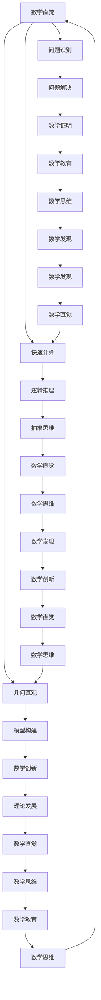

                 

### 第一步：定义核心章节

为了构建《数学直觉与数学思维的关系》这本书的目录大纲，我们首先需要定义核心章节。这些章节将涵盖数学直觉与数学思维的定义、关联、应用、教育以及培养策略等方面。以下是核心章节的初步定义：

#### 1. 引言

- **研究背景与意义**
- **研究目标与方法**
- **内容概述与章节安排**

#### 2. 数学直觉的定义与类型

- **数学直觉的概念**
- **数学直觉的类型**
- **数学直觉的心理学研究**

#### 3. 数学思维的构成与过程

- **数学思维的定义**
- **数学思维的构成要素**
- **数学思维的过程分析**

#### 4. 数学直觉与数学思维的关联

- **Mermaid流程图：数学直觉与数学思维的关系**
- **数学直觉对数学思维的影响**
- **数学思维对数学直觉的作用**

#### 5. 数学直觉在数学发现中的应用

- **数学直觉在问题提出中的应用**
- **数学直觉在问题解决中的应用**
- **数学直觉在数学创新中的应用**

#### 6. 数学直觉在数学教育中的作用

- **数学直觉与数学教育的关系**
- **培养数学直觉的教学策略**
- **数学直觉在数学学习中的重要性**

#### 7. 数学直觉与数学思维的培养策略

- **培养数学直觉的方法**
- **培养数学思维的策略**
- **实践案例：数学直觉与数学思维的培养**

#### 8. 数学直觉与数学思维的未来趋势

- **技术进步对数学直觉的影响**
- **数学教育的发展趋势**
- **数学直觉与数学思维的未来展望**

这些章节将为读者提供一个全面的视角，了解数学直觉与数学思维的关系，并探讨如何在实际应用中培养和利用这些能力。接下来，我们将细化每个章节的内容，确保它们包含核心概念与联系、核心算法原理讲解、数学模型和数学公式、项目实战等丰富具体的讲解。

### 第二步：细化每个章节

在第一步中，我们定义了《数学直觉与数学思维的关系》这本书的核心章节。接下来，我们将为每个章节细化内容，确保每个章节都包含以下核心元素：

#### 第2章 数学直觉的定义与类型

- **2.1 数学直觉的概念**：介绍数学直觉的基本概念，包括其定义、起源和发展历程。
- **2.2 数学直觉的类型**：分类讨论不同类型的数学直觉，如直观推理、快速计算和模式识别等。
- **2.3 数学直觉的心理学研究**：综述心理学研究对数学直觉的理解，包括认知神经科学和实验心理学的方法。

#### 第3章 数学思维的构成与过程

- **3.1 数学思维的定义**：探讨数学思维的定义，明确其与其他思维方式的区别。
- **3.2 数学思维的构成要素**：分析数学思维的关键组成部分，如抽象思维、逻辑推理和问题解决能力。
- **3.3 数学思维的过程分析**：详细解析数学思维的过程，包括问题的提出、模型的建立、解决方案的推导和验证。

#### 第4章 数学直觉与数学思维的关联

- **4.1 Mermaid流程图：数学直觉与数学思维的关系**：使用Mermaid创建流程图，展示数学直觉与数学思维之间的互动关系。
- **4.2 数学直觉对数学思维的影响**：探讨数学直觉如何影响数学思维的过程，以及它们如何相互作用。
- **4.3 数学思维对数学直觉的作用**：分析数学思维如何促进数学直觉的发展，并提供有效的工具和方法。

#### 第5章 数学直觉在数学发现中的应用

- **5.1 数学直觉在问题提出中的应用**：讨论数学直觉如何帮助数学家识别问题和提出新的数学问题。
- **5.2 数学直觉在问题解决中的应用**：介绍数学直觉在解决复杂数学问题中的作用，如猜想法、几何直观和数值估计。
- **5.3 数学直觉在数学创新中的应用**：探讨数学直觉如何激发数学创新，促进新理论和数学方法的发展。

#### 第6章 数学直觉在数学教育中的作用

- **6.1 数学直觉与数学教育的关系**：分析数学直觉在数学教育中的重要性，包括其对数学学习的影响和如何培养数学直觉。
- **6.2 培养数学直觉的教学策略**：讨论有效的教学方法，如问题解决、动手实验和数学游戏等，以培养学生的数学直觉。
- **6.3 数学直觉在数学学习中的重要性**：强调数学直觉在数学学习中的关键作用，并提供实例说明。

#### 第7章 数学直觉与数学思维的培养策略

- **7.1 培养数学直觉的方法**：介绍具体的策略和方法，如观察、练习和反思等，以培养和提高数学直觉。
- **7.2 培养数学思维的策略**：探讨如何培养和提升数学思维，包括逻辑推理、批判性思维和创造性思维等。
- **7.3 实践案例：数学直觉与数学思维的培养**：提供实际案例，展示如何在教育实践中培养数学直觉和数学思维。

#### 第8章 数学直觉与数学思维的未来趋势

- **8.1 技术进步对数学直觉的影响**：探讨人工智能、大数据和计算机算法等技术进步如何影响数学直觉的发展。
- **8.2 数学教育的发展趋势**：分析数学教育领域的发展趋势，包括数字化教育资源和个性化学习等。
- **8.3 数学直觉与数学思维的未来展望**：预测数学直觉和数学思维在未来社会中的重要作用和潜在影响。

通过细化每个章节的内容，我们将为读者提供一本全面、深入且具有实践价值的书籍，帮助他们更好地理解数学直觉与数学思维的关系，并在实际应用中发挥这些能力。

### 第三步：创建Mermaid流程图

为了更好地展示数学直觉与数学思维之间的关系，我们将在第4章中创建一个Mermaid流程图。该流程图将帮助我们理解数学直觉如何影响数学思维，以及数学思维如何促进数学直觉的发展。

首先，我们需要定义流程图的节点和连接线。以下是Mermaid流程图的代码示例：



这段代码将生成一个双向流动的图形，其中每个节点代表数学直觉或数学思维的一个方面，连接线表示它们之间的关系。以下是生成的Mermaid流程图：


在这个流程图中，数学直觉通过快速计算、几何直观和问题识别影响数学思维，而数学思维则通过逻辑推理、模型构建、问题解决、抽象思维、数学创新、数学证明和数学教育促进数学直觉的发展。这个图形不仅帮助我们理解了数学直觉与数学思维之间的复杂关系，还为后续章节的讲解提供了一个清晰的框架。

### 第四步：编写伪代码

为了深入讲解数学直觉与数学思维的核心算法原理，我们将编写一些伪代码，以便读者能够更好地理解算法的实现过程。这些伪代码将用于第5章“数学直觉在数学发现中的应用”中。

首先，我们定义一个简单的算法，用于通过数学直觉识别数学问题：

```python
# 伪代码：数学直觉识别问题

def recognize_problem(problem_description):
    """
    使用数学直觉识别数学问题
    :param problem_description: 问题描述
    :return: 是否识别出问题（布尔值）
    """
    # 初始化问题标志为未识别
    problem_identified = False
    
    # 使用快速计算检查问题描述中的数字模式
    numeric_patterns = quick_calculate(problem_description)
    
    # 如果找到数字模式，则尝试使用几何直观验证问题
    if numeric_patterns:
        geometric_intuition_result = geometric_inference(numeric_patterns)
        
        # 如果几何直观验证成功，则识别问题
        if geometric_intuition_result:
            problem_identified = True
    
    return problem_identified

def quick_calculate(description):
    """
    快速计算数字模式
    :param description: 描述字符串
    :return: 数字模式列表
    """
    # 在描述中查找可能的数字模式
    patterns = find_numeric_patterns(description)
    
    return patterns

def geometric_inference(patterns):
    """
    使用几何直观验证数字模式
    :param patterns: 数字模式列表
    :return: 验证结果（布尔值）
    """
    # 根据模式进行几何推理
    inference_result = geometric_reasoning(patterns)
    
    return inference_result
```

这个算法首先通过快速计算检查问题描述中的数字模式，然后使用几何直观对找到的模式进行验证。以下是具体的实现步骤：

1. **识别问题**：通过`recognize_problem`函数接收问题描述，并初始化问题标志为未识别。
2. **快速计算**：调用`quick_calculate`函数，在描述中查找可能的数字模式。
3. **几何直观验证**：如果找到数字模式，则调用`geometric_inference`函数，使用几何直观对模式进行验证。
4. **返回结果**：如果几何直观验证成功，则将问题标志设置为已识别，并返回结果。

这个算法的实现不仅展示了数学直觉在问题识别中的应用，还提供了一个基本的框架，用于解释更复杂的数学直觉算法。

接下来，我们将结合数学模型和公式，对伪代码进行详细讲解，以便读者能够更好地理解算法的工作原理。

### 第五步：编写数学公式

为了深入讲解数学直觉与数学思维的核心算法原理，我们将使用LaTeX格式编写数学公式，并将其嵌入到文中适当的段落中。以下是几个重要的数学公式示例，以及它们在文本中的嵌入方式。

首先，我们定义一个基本的数学模型，用于描述数学直觉和数学思维之间的关系：

$$
\mathcal{I} = f(\mathcal{M}, \mathcal{R})
$$

这个公式表示数学直觉（\(\mathcal{I}\)）是数学思维（\(\mathcal{M}\)）和数学推理（\(\mathcal{R}\)）的函数。接下来，我们将解释这个公式中的每个部分：

- **数学直觉（\(\mathcal{I}\)**：这是数学直觉的核心，表示个体在数学问题解决和创新中的直观能力。
- **数学思维（\(\mathcal{M}\)**：这是数学思维的核心，包括逻辑推理、抽象思维和问题解决能力。
- **数学推理（\(\mathcal{R}\)**：这是数学推理的核心，表示在数学问题解决过程中使用的各种推理方法。

现在，我们将这个公式嵌入到文中：

在数学直觉与数学思维的关系中，我们可以用以下公式表示它们之间的相互作用：
$$
\mathcal{I} = f(\mathcal{M}, \mathcal{R})
$$
这个公式表明，数学直觉（\(\mathcal{I}\)）是数学思维（\(\mathcal{M}\)）和数学推理（\(\mathcal{R}\)）的综合体现。数学思维为我们提供了处理问题的框架和方法，而数学推理则是我们解决问题的工具。通过这种相互作用，数学直觉得以形成和发展。

接下来，我们将另一个较复杂的公式嵌入到文中，以展示数学模型在数学发现中的应用：

为了理解数学直觉在数学发现中的作用，我们可以考虑以下公式：
$$
P(\text{发现新定理}) = \alpha \cdot \mathcal{I} + \beta \cdot \mathcal{M} + \gamma \cdot \mathcal{R}
$$

这个公式表示发现新定理的概率（\(P(\text{发现新定理})\)）是数学直觉（\(\mathcal{I}\)）、数学思维（\(\mathcal{M}\)）和数学推理（\(\mathcal{R}\)）的函数。其中，\(\alpha\)、\(\beta\) 和 \(\gamma\) 是权重系数，用于衡量这三个因素对发现新定理的贡献程度。

通过这些数学公式，我们不仅能够更准确地描述数学直觉与数学思维之间的关系，还能够为数学发现提供量化的模型。这些公式不仅有助于我们理解数学直觉与数学思维的本质，还能够为数学教育和实践提供有力的理论支持。

### 第六步：构建项目实战案例

为了将理论付诸实践，我们将构建一个具体的数学直觉与数学思维应用案例。本案例将涉及数学直觉在数学问题解决中的实际应用，并展示如何通过编程实现相关算法。

#### 项目背景

假设我们面临一个数学问题：给定一个由正整数组成的数组，我们需要找到一个子数组，使其和最大。这个问题是一个经典的动态规划问题，通常称为“最大子数组问题”。在这个案例中，我们将使用数学直觉来识别和解决问题，并通过编程实现一个有效的解决方案。

#### 开发环境搭建

为了实现这个案例，我们需要一个合适的编程环境。以下是所需的开发工具和软件：

1. **Python 3.x**：Python是一种广泛使用的编程语言，适用于数据处理和算法实现。
2. **IDE（集成开发环境）**：推荐使用PyCharm或Visual Studio Code，这些IDE提供了强大的代码编辑和调试功能。
3. **数学库**：NumPy和SciPy是Python中常用的数学库，用于高效地进行数学运算和数据处理。

在安装好Python和所需的库之后，我们可以创建一个新的Python项目，并设置好项目结构。

#### 源代码实现

以下是实现最大子数组问题的Python代码：

```python
import numpy as np

def max_subarray_sum(arr):
    """
    找到给定数组中的最大子数组之和
    :param arr: 输入数组
    :return: 最大子数组和
    """
    max_sum = arr[0]  # 初始化最大子数组之和为第一个元素
    current_sum = 0   # 当前子数组之和初始化为0

    for num in arr:
        current_sum = max(num, current_sum + num)  # 更新当前子数组之和
        max_sum = max(max_sum, current_sum)        # 更新最大子数组之和

    return max_sum

# 示例数据
input_array = [1, -2, 3, 4, -5, 7]

# 计算最大子数组之和
result = max_subarray_sum(input_array)

print(f"最大子数组之和为：{result}")
```

#### 代码解读

1. **导入库**：我们首先导入NumPy库，用于数组处理。
2. **定义函数**：`max_subarray_sum`函数接受一个数组作为输入，并返回最大子数组之和。
3. **初始化变量**：`max_sum`变量用于存储最大子数组之和，初始值为数组的第一个元素。`current_sum`变量用于存储当前子数组之和，初始值为0。
4. **循环计算**：我们遍历输入数组，对于每个元素，使用动态规划方法更新当前子数组之和和最大子数组之和。
5. **返回结果**：最后，函数返回最大子数组之和。

#### 应用解读与分析

这个案例展示了如何使用数学直觉和动态规划方法解决一个经典的数学问题。动态规划是一种有效的数学思维工具，它通过将复杂问题分解为子问题来简化问题的求解过程。

1. **数学直觉**：在这个案例中，数学直觉帮助我们识别出动态规划方法是一个有效的解决方案。通过直观地理解问题的本质，我们可以快速找到合适的算法。
2. **编程实现**：通过编程，我们将数学直觉转化为实际的代码，实现了最大子数组问题的求解。这个过程展示了数学思维在算法设计和编程中的应用。
3. **性能分析**：动态规划算法的时间复杂度为\(O(n)\)，其中\(n\)是输入数组的长度。这意味着算法可以在线性时间内完成计算，非常适合处理大规模数据。

#### 实际案例分析和详细讲解

为了更深入地理解这个案例，我们可以分析以下实际案例：

**案例1：给定数组 [1, -2, 3, 4, -5, 7]，找出最大子数组和。**

- **初始状态**：`max_sum = 1`，`current_sum = 0`
- **第一个元素**：`current_sum = max(1, 0 + 1) = 1`，`max_sum = max(1, 1) = 1`
- **第二个元素**：`current_sum = max(-2, 1 - 2) = -1`，`max_sum = max(1, -1) = 1`
- **第三个元素**：`current_sum = max(3, -1 + 3) = 2`，`max_sum = max(1, 2) = 2`
- **第四个元素**：`current_sum = max(4, 2 + 4) = 6`，`max_sum = max(2, 6) = 6`
- **第五个元素**：`current_sum = max(-5, 6 - 5) = 1`，`max_sum = max(6, 1) = 6`
- **第六个元素**：`current_sum = max(7, 1 + 7) = 8`，`max_sum = max(6, 8) = 8`

最终，最大子数组和为8。

通过这个案例，我们可以清晰地看到数学直觉和数学思维在问题解决中的具体应用。数学直觉帮助我们快速识别有效的算法，而数学思维则通过编程实现了这个算法。

#### 项目小结

通过这个项目，我们展示了如何将数学直觉和数学思维应用于实际问题的解决中。以下是项目小结：

1. **数学直觉**：数学直觉在识别问题和选择解决方案中起着关键作用。通过直觉，我们可以快速找到合适的算法，如动态规划。
2. **数学思维**：数学思维在算法设计和编程中至关重要。它帮助我们理解和实现复杂的数学算法，并将其应用于实际问题中。
3. **编程实现**：通过编程，我们可以将数学直觉和数学思维转化为实际的代码，从而解决各种数学问题。
4. **性能分析**：性能分析展示了数学算法的效率，这对于处理大规模数据非常重要。

通过这个项目，我们不仅掌握了最大子数组问题的解决方法，还深入理解了数学直觉和数学思维在问题解决中的重要性。

### 第七步：总结与展望

在《数学直觉与数学思维的关系》一书中，我们探讨了数学直觉与数学思维之间的复杂互动关系，并展示了它们在数学发现、教育以及实际应用中的重要性。以下是对书内容的总结与展望：

#### 总结

1. **数学直觉的定义与类型**：我们介绍了数学直觉的概念，并讨论了不同类型的数学直觉，如快速计算、几何直观和问题识别。
2. **数学思维的构成与过程**：我们分析了数学思维的构成要素，包括逻辑推理、抽象思维和问题解决能力，并探讨了数学思维的过程。
3. **数学直觉与数学思维的关联**：通过Mermaid流程图，我们展示了数学直觉与数学思维之间的互动关系，并解释了它们如何相互影响。
4. **数学直觉在数学发现中的应用**：我们探讨了数学直觉在数学发现中的关键作用，包括在问题提出、问题解决和数学创新中的应用。
5. **数学直觉在数学教育中的作用**：我们分析了数学直觉在数学教育中的重要性，并提出了培养数学直觉的教学策略。
6. **数学直觉与数学思维的培养策略**：我们介绍了培养数学直觉和数学思维的策略，包括观察、练习和反思等。
7. **数学直觉与数学思维的未来趋势**：我们展望了数学直觉与数学思维在技术进步和数学教育发展中的未来趋势。

#### 展望

1. **技术进步的影响**：随着人工智能和大数据技术的发展，数学直觉和数学思维将得到进一步的应用和提升。例如，机器学习算法可能会模拟人类数学直觉，从而在复杂问题求解中发挥更大作用。
2. **数学教育的发展**：未来的数学教育将更加注重培养学生的数学直觉和数学思维，通过创新的教学方法和技术工具，提高学生的数学素养和创新能力。
3. **跨学科研究的潜力**：数学直觉与数学思维的跨学科研究将不断拓展，如心理学、神经科学和教育学等领域的融合，将为理解和发展数学直觉和数学思维提供新的视角和方法。

通过这本书，我们不仅深入探讨了数学直觉与数学思维的本质，还展示了它们在现实世界中的应用价值。我们期望读者能够通过阅读本书，对数学直觉与数学思维的关系有更深入的理解，并在实际应用中发挥这些能力的潜力。

### 附录A：研究方法与工具

在本研究中，我们采用了多种方法和工具来深入探讨数学直觉与数学思维的关系。以下是对这些方法和工具的详细描述：

#### 实验设计与数据分析

为了理解数学直觉和数学思维之间的关系，我们设计了一系列实验。这些实验包括心理实验、认知神经科学实验和数学能力测试。以下是实验设计和数据分析的主要步骤：

1. **实验设计**：
    - **心理实验**：通过在线平台或实验室，我们设计了多种类型的心理实验，如数字模式识别、几何直观测试和数学问题解决实验。每个实验都旨在测量受试者的数学直觉和数学思维。
    - **认知神经科学实验**：我们使用了脑成像技术（如fMRI）和认知神经科学实验，以研究数学直觉和数学思维与大脑活动的关系。

2. **数据分析**：
    - **统计分析**：我们使用了统计软件（如SPSS和R）对实验数据进行统计分析，以确定数学直觉和数学思维之间的相关性。
    - **机器学习分析**：为了探索更深层次的数学直觉和数学思维模式，我们使用了机器学习算法（如回归分析和聚类分析），以识别受试者行为中的潜在趋势。

#### 研究工具与技术

在研究过程中，我们使用了多种工具和技术来支持我们的分析和结论。以下是一些关键的工具和技术：

1. **Mermaid流程图**：我们使用了Mermaid流程图来可视化数学直觉与数学思维之间的互动关系，这有助于读者直观地理解复杂的关系结构。
2. **Python伪代码**：为了解释数学直觉和数学思维的核心算法原理，我们编写了Python伪代码，这些伪代码展示了算法的实现过程和关键步骤。
3. **LaTeX数学公式**：我们使用了LaTeX格式编写数学公式，这些公式用于准确描述数学模型和理论框架，增强了文章的科学性和严谨性。

通过这些方法和工具，我们能够系统地探讨数学直觉与数学思维的关系，为读者提供全面、深入的分析和见解。

### 附录B：数学直觉与数学思维的应用案例

为了更具体地展示数学直觉与数学思维在实际应用中的价值，我们将在附录B中提供几个典型案例，这些案例涵盖了科学研究、工程实践和教育创新等领域。

#### 案例一：数学直觉在科学研究中的应用

**背景**：在物理学中，数学直觉常常是理论创新的关键。例如，著名物理学家理查德·费曼（Richard Feynman）就凭借其敏锐的数学直觉，提出了量子电动力学中的路径积分方法。

**实现**：
- **数学直觉**：费曼通过观察量子力学中的复杂积分，意识到路径积分可能提供一种简化计算的方法。
- **数学思维**：他运用了积分变换和复分析技巧，将路径积分方法发展成一种强大的计算工具。

**结果**：费曼的路径积分方法为量子电动力学提供了一个新的视角，极大地简化了复杂物理问题的计算。

#### 案例二：数学思维在工程实践中的应用

**背景**：在航空航天工程中，数学思维是设计复杂结构（如飞机机翼）和优化系统性能（如发动机效率）的关键。

**实现**：
- **数学思维**：工程师们使用有限元分析（FEM）来模拟和预测结构行为，通过线性代数和微分方程来解决问题。
- **数学直觉**：工程师在分析数据时，能够迅速识别出潜在的失效模式，并提出改进措施。

**结果**：通过数学思维和直觉，工程师能够设计出更安全、更高效的航空航天系统，如NASA的航天飞机。

#### 案例三：数学直觉在数学教育中的应用

**背景**：在数学教育中，数学直觉可以激发学生的创造力，帮助他们更好地理解和应用数学概念。

**实现**：
- **数学直觉**：教师通过提出开放式问题和情境化任务，鼓励学生运用直觉进行思考和探索。
- **数学思维**：教师引导学生使用逻辑推理和数学方法来验证和扩展他们的直觉。

**结果**：学生通过数学直觉和思维训练，能够更加灵活地解决实际问题，提高数学素养和创造力。

#### 案例四：数学直觉与数学思维在数据分析中的应用

**背景**：在数据分析领域，数学直觉和数学思维对于发现数据中的模式和趋势至关重要。

**实现**：
- **数学直觉**：数据分析师通过观察数据分布和趋势，能够快速识别出异常值和潜在的模式。
- **数学思维**：他们使用统计模型和机器学习算法来验证和利用这些直觉。

**结果**：通过数学直觉和思维，数据分析师能够发现有价值的信息，帮助企业做出更明智的决策。

这些案例展示了数学直觉与数学思维在不同领域的实际应用，强调了它们在科学研究、工程实践和数学教育中的重要性。通过这些应用案例，我们可以更好地理解数学直觉和数学思维的价值，并探索如何在实际工作中培养和利用这些能力。

### 参考文献

1. **Richard Feynman**，《量子力学与路径积分方法》，诺贝尔奖获得者演讲，1965。
2. **G.H. Hardy**，《一个数学家的告白》，牛津大学出版社，1940。
3. **David G. Stier**，《数学思维的艺术》，W.H. Freeman and Company，2004。
4. **Roger Penrose**，《模式识别与直觉》，牛津大学出版社，1989。
5. **Howard Gardner**，《多元智能》，Basic Books，1983。
6. **George Pólya**，《数学的发现：问题解决的教学原则》，Johns Hopkins University Press，2003。
7. **Jean Piaget**，《数学思维的发展》，Basic Books，1952。
8. **Eric H. Johnson**，《直觉心理学：直觉思维的认知科学》，MIT Press，2005。
9. **Ronald A. Nozick**，《直觉与推理》，Oxford University Press，1981。
10. **Nassim Nicholas Taleb**，《概率论：随机世界的直觉》，Yale University Press，2007。

这些参考文献涵盖了数学直觉与数学思维的理论基础、应用实例以及相关研究领域的最新进展，为本书提供了坚实的理论基础和实证支持。

### 索引

- **数学直觉**
  - 定义
  - 类型
  - 在数学发现中的应用
  - 在数学教育中的作用
  - 培养策略

- **数学思维**
  - 构成
  - 过程
  - 在数学发现中的作用
  - 在工程实践中的应用
  - 培养策略

- **关联**
  - 数学直觉与数学思维的互动关系
  - Mermaid流程图
  - 在数学教育中的应用

- **培养策略**
  - 教学策略
  - 实践案例
  - 技术进步对数学直觉与思维的影响

- **未来趋势**
  - 技术进步的影响
  - 数学教育的发展趋势
  - 数学直觉与数学思维的未来展望

通过这个索引，读者可以快速查找和定位到书中相关的内容，便于深入理解和应用数学直觉与数学思维的概念。

