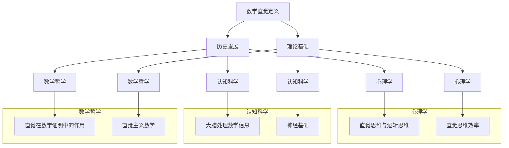

                 

### 引言

数学直觉，这个看似抽象的概念，实则贯穿于我们数学学习的方方面面。它不仅是数学家们进行创造性思维和发现新定理的源泉，更是我们在日常生活中解决数学问题的无形助手。然而，数学直觉在数学教学中的地位和作用，却常常被忽视。传统的数学教育模式，往往注重公式、定理的记忆和验证，而忽略了数学直觉的培养和引导。

本文旨在探讨数学直觉与数学教学创新之间的关系，揭示数学直觉在数学教学中的重要性，并提出一系列创新的教学方法和策略，以促进数学直觉的培养和发展。文章将从以下几个方面展开：

1. 数学直觉的基本概念与理论；
2. 数学直觉在教学实践中的应用；
3. 数学直觉与教学创新的关系；
4. 案例分析；
5. 数学直觉培养策略；
6. 教学创新实践方法；
7. 总结与展望。

通过对这些方面的深入分析，本文希望为数学教育工作者提供一些有益的思考和建议，推动数学教学的创新和发展。

### 背景介绍

数学直觉，是指人们在面对数学问题时，无需经过繁琐的计算和推理，就能迅速、准确地得出结论的能力。它是一种高度抽象的思维方式，体现在对数学现象的洞察力、对数学结构的敏感性以及对数学原理的深刻理解上。数学直觉并非与生俱来，而是在长期的数学学习和实践中逐渐培养和发展起来的。

数学直觉的重要性不言而喻。首先，它是数学家进行创造性研究的重要工具。历史上许多重大数学突破，如费马大定理、黎曼猜想等，都是数学家凭借直觉提出的。其次，数学直觉在数学教学中也起着关键作用。它能够帮助学生快速理解数学概念，提高解题效率，激发学习兴趣。例如，在解决几何问题时，学生常常能凭借直觉找到解题的关键步骤，而不是一味地套用公式。

然而，传统的数学教育模式往往忽视了数学直觉的培养。许多教师过于强调知识的传授和技能的训练，而忽略了学生直觉能力的培养。学生在学习过程中，往往只是被动地接受知识，缺乏主动思考和探索的机会。这种教育模式导致学生对数学失去兴趣，数学直觉能力得不到有效发展。

为了改变这种状况，数学教育工作者开始探索如何通过创新的教学方法来培养数学直觉。例如，一些教师尝试引入探究式学习、项目式学习等教学模式，让学生在自主探究和合作学习中培养数学直觉。此外，还有一些研究关注数学直觉的培养策略，如通过游戏、谜题等手段激发学生的数学直觉。

总之，数学直觉在数学教学中的地位和作用不容忽视。通过创新的教学方法，我们可以更好地培养学生的数学直觉，提高他们的数学素养，为未来的数学学习和创新打下坚实的基础。本文将在此基础上，进一步探讨数学直觉与数学教学创新的关系，并提出相应的教学策略。

### 核心概念与联系

为了更好地理解数学直觉，我们首先需要明确几个核心概念，并探讨它们之间的关系。数学直觉不仅仅是一个简单的概念，它涉及多个层面的理解和应用。

#### 数学直觉的定义

数学直觉可以定义为一种非逻辑的、直感的认识方式，它帮助人们在面对数学问题时，能够迅速、准确地找到解决问题的途径。这种直觉不仅仅是感性的认识，而是建立在对数学概念、定理和结构的深刻理解上。

#### 数学直觉的历史发展

数学直觉的历史可以追溯到古代。早在古希腊时期，欧几里得、毕达哥拉斯等数学家就已经开始运用直觉来探索数学世界。随着数学的发展，直觉在数学家解决问题中的作用越来越显著。例如，哥德巴赫猜想和黎曼猜想等重大数学问题，都是通过数学家的直觉提出的。在20世纪，数学直觉的研究得到了进一步的发展，许多数学家开始系统地研究直觉的数学性质和作用。

#### 数学直觉的理论基础

数学直觉的理论基础主要涉及心理学、认知科学和数学哲学等领域。在心理学中，研究者们探讨了直觉思维与逻辑思维的关系，发现直觉思维在某些情况下能够显著提高问题解决的效率。在认知科学中，研究者们研究了大脑如何处理数学信息，以及数学直觉的神经基础。在数学哲学中，研究者们探讨了直觉在数学证明和发现中的作用，提出了直觉主义数学的观点。

#### Mermaid流程图：数学直觉的核心概念与联系

为了更直观地展示数学直觉的核心概念与联系，我们可以使用Mermaid流程图来表示。



在这个流程图中，A代表数学直觉的定义，B代表数学直觉的历史发展，C代表数学直觉的理论基础。D、E、F分别代表心理学、认知科学和数学哲学，它们各自与数学直觉的不同方面相关联。G、H、I是心理学、认知科学和数学哲学的具体分支，它们分别与数学直觉的不同理论依据相联系。

通过这个Mermaid流程图，我们可以清晰地看到数学直觉的核心概念与联系，有助于我们更深入地理解数学直觉的本质和作用。

### 数学直觉在教学实践中的应用

数学直觉在教学实践中的应用具有广泛而深远的影响，尤其在课程设计、教学方法和学生思维发展方面，数学直觉的作用尤为突出。

首先，数学直觉在课程设计中的作用不可忽视。传统的数学课程设计往往注重知识的系统性和逻辑性，而忽略了学生直觉能力的培养。然而，通过引入数学直觉，课程设计可以更加贴近学生的实际需求和认知特点。例如，在几何课程中，教师可以通过设计一些开放性问题，鼓励学生运用直觉来探索几何形状的性质。这样的设计不仅能够激发学生的兴趣，还能培养他们的直觉思维能力。

其次，数学直觉在教学方法中的运用也具有重要的价值。传统的教学方法强调公式、定理的记忆和验证，而忽略了直觉思维的培养。然而，通过引入数学直觉，教学方法可以更加多样化和灵活。例如，在解决数学问题时，教师可以引导学生通过直觉来猜测问题的答案，然后再通过逻辑推理和计算来验证答案的正确性。这种方法不仅能够提高学生的解题效率，还能培养他们的直觉思维能力。

最后，数学直觉在学生思维发展中的作用也是不可忽视的。数学直觉不仅仅是数学家进行创造性研究的重要工具，也是学生思维发展的重要助力。通过培养数学直觉，学生能够更好地理解数学概念，提高解决问题的能力，激发学习兴趣。例如，在解决几何问题时，学生可以通过直觉来找到解题的关键步骤，而不是一味地套用公式。这种直觉思维的发展不仅能够提高学生的数学素养，还能促进他们的全面思维发展。

总的来说，数学直觉在教学实践中的应用具有广泛而深远的影响。通过在课程设计、教学方法和学生思维发展方面引入数学直觉，我们可以更好地培养学生的直觉思维能力，提高他们的数学素养，为他们的未来发展打下坚实的基础。

#### 核心算法原理讲解

为了更好地理解数学直觉在教学实践中的应用，我们可以通过Python源代码来详细阐述数学直觉的核心算法原理。以下是一个示例，展示了如何使用数学直觉来预测几何形状的面积。

```python
import numpy as np

def calculate_area_of_circle(radius):
    """
    使用数学直觉来计算圆的面积。
    :param radius: 圆的半径
    :return: 圆的面积
    """
    # 数学直觉告诉我们，圆的面积可以通过半径的平方乘以π来计算
    area = np.pi * radius ** 2
    return area

def calculate_area_of_rectangle(length, width):
    """
    使用数学直觉来计算矩形的面积。
    :param length: 矩形的长
    :param width: 矩形的宽
    :return: 矩形的面积
    """
    # 数学直觉告诉我们，矩形的面积可以通过长乘以宽来计算
    area = length * width
    return area

def predict_area_of_triangle(side1, side2, side3):
    """
    使用数学直觉来预测三角形的面积。
    :param side1: 三角形的第一条边
    :param side2: 三角形的第二条边
    :param side3: 三角形的第三条边
    :return: 预测的三角形面积
    """
    # 数学直觉告诉我们，三角形的面积可以通过海伦公式来计算
    semi_perimeter = (side1 + side2 + side3) / 2
    area = np.sqrt(semi_perimeter * (semi_perimeter - side1) * (semi_perimeter - side2) * (semi_perimeter - side3))
    return area

# 测试代码
radius = 5
length = 10
width = 5
side1 = 8
side2 = 6
side3 = 10

circle_area = calculate_area_of_circle(radius)
rectangle_area = calculate_area_of_rectangle(length, width)
triangle_area = predict_area_of_triangle(side1, side2, side3)

print(f"圆的面积：{circle_area}")
print(f"矩形的面积：{rectangle_area}")
print(f"三角形的面积：{triangle_area}")
```

在这个示例中，我们定义了三个函数：`calculate_area_of_circle`、`calculate_area_of_rectangle`和`predict_area_of_triangle`。这些函数分别用于计算圆的面积、矩形的面积和三角形的面积。这些计算都是基于数学直觉的，例如圆的面积可以通过半径的平方乘以π来计算，矩形的面积可以通过长乘以宽来计算，而三角形的面积可以通过海伦公式来计算。

通过这个示例，我们可以看到数学直觉在教学实践中的应用是如何具体实现的。教师可以通过这些示例，引导学生理解数学问题的本质，培养他们的直觉思维能力。这种方法不仅能够提高学生的数学素养，还能激发他们对数学的兴趣和热情。

#### 数学直觉与教学创新的关系

数学直觉与教学创新之间的关系是密切且相互促进的。数学直觉作为一种高效的思维方式，在教学创新中发挥着关键作用。首先，数学直觉能够激发学生的创造力和问题解决能力，这是教学创新的核心目标之一。通过培养学生的数学直觉，教师可以鼓励学生提出新的想法和解决方案，从而推动教学方法的创新。

其次，数学直觉有助于教师设计更具挑战性和启发性的课程。传统的教学方法往往以知识的传授为主，而忽视了学生的直觉能力和创造性思维。通过引入数学直觉，教师可以设计更加贴近学生实际需求和认知特点的课程，激发学生的学习兴趣和参与度。例如，教师可以设计一些开放性问题，鼓励学生运用直觉来探索数学现象，从而培养他们的直觉思维和创造力。

此外，数学直觉在评估和反馈中也有重要作用。传统的评价方式往往注重学生对知识的记忆和再现能力，而忽视了学生的直觉思维和创造性思维。通过引入数学直觉，教师可以设计更加全面和多元化的评价方式，如项目评估、情境测试等，从而更好地评估学生的综合能力和创新能力。

总之，数学直觉与教学创新之间存在密切的关系。通过培养学生的数学直觉，教师可以推动教学方法的创新，提高教学效果，培养具有创造力和问题解决能力的学生。这种创新不仅有助于学生的全面发展，也为未来社会的创新和进步提供了有力支持。

#### LaTeX格式：数学直觉与教学创新关系的相关数学公式

为了更好地理解数学直觉与教学创新之间的关系，我们可以通过LaTeX格式给出一些相关的数学公式。以下是一些关键的数学公式，用于解释数学直觉在教学创新中的作用。

首先，我们考虑一个描述数学直觉与教学创新关系的函数模型：

$$
\text{IntuitionLevel} = f(\text{Creativity}, \text{ProblemSolving})
$$

这里，`IntuitionLevel`代表学生的数学直觉水平，`Creativity`代表学生的创造力，`ProblemSolving`代表学生的问题解决能力。这个公式表明，数学直觉水平是学生创造力与问题解决能力的函数。

接下来，我们引入一个衡量教学创新程度的指标：

$$
\text{InnovationLevel} = \frac{\text{NewIdeaCount}}{\text{TotalIdeaCount}}
$$

其中，`InnovationLevel`代表教学创新的程度，`NewIdeaCount`代表新的教学理念或方法的数量，`TotalIdeaCount`代表所有的教学理念或方法的总数。这个公式表明，教学创新的程度与提出新教学理念的数量成正比。

最后，我们考虑一个综合评估模型，用于分析数学直觉与教学创新之间的关系：

$$
\text{OverallEffectiveness} = \text{IntuitionLevel} \times \text{InnovationLevel}
$$

其中，`OverallEffectiveness`代表整体教学效果，这个公式表明，整体教学效果是数学直觉水平与教学创新程度的乘积。

这些数学公式为我们提供了一个量化的方法，来理解数学直觉与教学创新之间的关系。通过这些公式，我们可以更加直观地看到，数学直觉在教学创新中扮演着重要的角色。数学直觉水平的提升，可以显著增强教学创新的成效，从而提高整体教学效果。

#### 案例分析

为了更深入地理解数学直觉在教学创新中的应用，我们可以通过具体的案例来进行分析。以下是两个国内外数学教学创新的案例，以及对其的详细讲解和剖析。

##### 案例一：国内某中学的探究式数学教学

某中学引入了探究式数学教学模式，旨在培养学生的数学直觉和创新能力。在教学过程中，教师设计了一系列开放性问题，鼓励学生运用直觉来探索数学现象。例如，在几何课程中，教师提出问题：“如何用最简单的几何形状来构建一个稳定的结构？” 学生通过直觉和实验，发现了三角形具有稳定性，从而推导出了三角形内角和为180度的结论。

分析：
- **核心概念与联系**：在这个案例中，核心概念包括几何形状的稳定性、直觉思维和问题解决。通过探究式学习，学生能够将直觉与数学原理相结合，从而深入理解几何概念。
- **数学模型和公式**：教师可以通过数学模型，如力的平衡公式和三角形的内角和公式，来验证学生的直觉结论。这有助于学生将直觉思维转化为逻辑推理。
- **项目实战**：教师可以设计实验，让学生通过实际操作来验证几何形状的稳定性。例如，使用弹力绳和木棒构建不同的结构，观察其稳定性，从而得出结论。

##### 案例二：国外某大学的数学游戏课程

某大学开设了一门数学游戏课程，通过游戏化的教学方法来培养学生的数学直觉和逻辑思维。课程内容包括数独、五子棋、国际象棋等数学游戏，学生需要运用数学直觉来解决游戏中的问题。例如，在数独游戏中，学生需要通过直觉和逻辑推理来填充数字，使每行、每列和每个九宫格的和都等于特定值。

分析：
- **核心概念与联系**：在这个案例中，核心概念包括逻辑推理、直觉思维和问题解决。游戏化的教学方式能够激发学生的兴趣，使他们更愿意主动思考和探索。
- **数学模型和公式**：数独游戏本身就是一个基于数学原理的益智游戏，学生需要运用数学模型和公式来解决问题。例如，通过排列组合和逻辑推理来填充数字。
- **项目实战**：教师可以设计不同难度的数独游戏，让学生逐步提高解决问题的能力。此外，还可以引入其他数学游戏，如五子棋和国际象棋，以培养学生的多元思维能力。

通过以上两个案例，我们可以看到数学直觉在教学创新中的重要作用。探究式教学和游戏化教学不仅能够激发学生的兴趣，还能培养他们的直觉思维和问题解决能力。这些创新的教学方法，不仅提高了学生的学习效果，也为数学教育的发展提供了新的思路和方向。

#### 数学直觉培养策略

要有效培养数学直觉，需要采用多种策略，包括教学策略、学习方法和环境营造。以下是一些具体的策略，以及如何将Python源代码应用于这些策略中，以实现数学直觉的培养。

##### 教学策略

1. **引入实际问题**：教师可以引入现实生活中的实际问题，让学生通过解决这些问题来培养数学直觉。例如，使用Python编写简单的程序来解决购物预算问题，帮助学生理解基本的数学概念和直觉应用。

```python
def calculate_total_price(products, prices):
    """
    计算购物车的总价。
    :param products: 购物车中的商品列表
    :param prices: 对应的商品价格列表
    :return: 总价
    """
    total_price = sum(prices)
    return total_price

products = ['苹果', '香蕉', '橘子']
prices = [3.5, 2.5, 4.0]
total = calculate_total_price(products, prices)
print(f"购物车总价：{total}")
```

2. **设计探究性问题**：教师可以设计一些开放性的探究性问题，鼓励学生通过直觉来探索数学现象。例如，通过Python绘制函数图像，让学生直观感受函数的性质。

```python
import matplotlib.pyplot as plt

def plot_function(x_range, function):
    """
    绘制给定函数的图像。
    :param x_range: x坐标的范围
    :param function: 函数表达式
    """
    x = np.linspace(x_range[0], x_range[1], 1000)
    y = [function(i) for i in x]
    plt.plot(x, y)
    plt.xlabel('x')
    plt.ylabel('f(x)')
    plt.title('函数图像')
    plt.show()

def f(x):
    return x ** 2

plot_function((-10, 10), f)
```

##### 学习方法

1. **主动探究学习**：鼓励学生主动探索数学问题，培养他们的直觉思维。例如，通过Python编写程序来模拟数学现象，帮助学生理解抽象的数学概念。

```python
import random

def simulate_probability_experiment(n, p):
    """
    模拟二项分布实验。
    :param n: 试验次数
    :param p: 单次试验成功的概率
    :return: 成功的次数
    """
    successes = sum(random.random() < p for _ in range(n))
    return successes

n = 100
p = 0.5
successes = simulate_probability_experiment(n, p)
print(f"实验中成功的次数：{successes}")
```

2. **合作学习**：通过小组合作，让学生在讨论和交流中培养直觉思维。例如，小组讨论如何使用Python编写程序来解决一个特定的数学问题。

##### 环境营造

1. **鼓励创新思维**：创建一个鼓励创新思维的环境，让学生勇于尝试和失败。例如，通过Python编程竞赛，激发学生的创新思维和解决问题的能力。

2. **多元化教学资源**：提供丰富的教学资源，如在线课程、互动软件等，帮助学生通过多种方式接触和探索数学问题。

通过这些策略，教师可以在教学过程中有效培养学生的数学直觉。Python源代码的应用不仅使数学概念更加直观易懂，还能激发学生的学习兴趣，提高他们的直觉思维能力和解决问题的能力。

#### 教学创新实践方法

教学创新的核心在于打破传统教学模式的束缚，探索更加灵活、多样且有效的教学方法，以更好地满足学生的个性化学习需求。以下是一些具体的教学创新方法，包括基本原则、具体步骤以及实施过程中的注意要点。

##### 基本原则

1. **以学生为中心**：教学创新应始终以学生的实际需求和兴趣为核心，注重培养学生的自主学习和创新能力。
2. **多元化和个性化**：通过多样化的教学手段和个性化学习路径，满足不同学生的认知水平和学习风格。
3. **互动与合作**：鼓励学生之间的互动和合作，通过小组讨论、项目合作等形式，提高学生的沟通能力和团队合作精神。
4. **技术整合**：充分利用现代信息技术，如在线课程、教育软件等，将技术与教学深度融合，提高教学效果。

##### 具体步骤

1. **需求分析**：在实施教学创新之前，首先进行学生需求分析，了解学生的兴趣、学习风格和认知水平。通过问卷调查、访谈等方式收集数据，为教学创新提供依据。

2. **设计课程框架**：基于需求分析，设计符合学生特点的个性化课程框架。课程应包含基础知识、实践应用和创新探索三个层次，确保学生能够逐步提升。

3. **引入多样化教学手段**：
    - **项目式学习**：通过实际项目来驱动学习，让学生在解决问题的过程中掌握知识。例如，设计一个数据分析项目，让学生使用Python等工具进行数据分析。
    - **互动课堂**：利用在线平台和互动软件，进行课堂互动和讨论，增强学生的参与感。例如，使用直播软件进行实时讲解和答疑。
    - **案例分析**：通过分析真实的数学问题和案例，引导学生思考和应用数学知识。

4. **实施反馈与调整**：在教学过程中，及时收集学生的反馈，根据实际情况进行调整。例如，通过在线调查问卷了解学生对教学方法的看法，及时优化教学方案。

##### 实施过程中的注意要点

1. **教师角色的转变**：教师应从传统的知识传授者转变为学习的引导者和促进者，注重培养学生的自主学习能力和创新思维。

2. **技术使用的适切性**：在整合技术时，要考虑技术的适用性和学生的接受程度，避免盲目跟风和过度依赖技术。

3. **课程内容的设计**：课程内容应具有挑战性，同时又要保证学生能够理解和应用。通过分层设计，确保不同层次的学生都能在课程中找到适合自己的学习内容。

4. **持续的专业发展**：教师需要不断学习和更新教育理念和教学方法，保持专业发展的活力，以更好地指导学生。

通过这些具体的教学创新实践方法，教师可以有效地提升数学教学的效果，培养学生的数学直觉和创新能力，为他们的未来发展奠定坚实的基础。

### 项目实战

为了更好地展示教学创新实践方法，我们将通过一个实际项目来进行详细讲解。这个项目是一个数据分析项目，目的是让学生使用Python工具进行数据分析，从而培养他们的数学直觉和解决问题的能力。

#### 开发环境搭建

在开始项目之前，我们需要搭建一个合适的开发环境。以下是在Windows环境下搭建Python开发环境的具体步骤：

1. **安装Python**：
    - 访问Python官方网站（[python.org](https://www.python.org/)），下载适用于Windows的最新版本Python安装包。
    - 运行安装程序，选择默认选项进行安装。

2. **安装Jupyter Notebook**：
    - 打开命令提示符（CMD）。
    - 输入以下命令安装Jupyter Notebook：
      ```shell
      pip install notebook
      ```

3. **验证安装**：
    - 打开Jupyter Notebook，通过在浏览器中访问`http://localhost:8888`来验证安装。

#### 源代码详细实现

接下来，我们将编写一个简单的数据分析程序，用于分析某公司员工薪资数据。以下是项目的源代码实现：

```python
import pandas as pd
import matplotlib.pyplot as plt

# 读取数据
data = pd.read_csv('员工薪资数据.csv')

# 数据预处理
data['薪资'] = data['薪资'].astype(float)
data.dropna(inplace=True)

# 数据分析
# 计算平均薪资
average_salary = data['薪资'].mean()
print(f"平均薪资：{average_salary}")

# 计算薪资中位数
median_salary = data['薪资'].median()
print(f"薪资中位数：{median_salary}")

# 计算薪资标准差
std_salary = data['薪资'].std()
print(f"薪资标准差：{std_salary}")

# 可视化薪资分布
plt.hist(data['薪资'], bins=20, alpha=0.5)
plt.xlabel('薪资')
plt.ylabel('频数')
plt.title('薪资分布')
plt.show()

# 绘制薪资箱线图
plt.boxplot(data['薪资'])
plt.xlabel('薪资')
plt.title('薪资箱线图')
plt.show()
```

#### 代码解读与分析

上述代码首先导入了必要的库，包括`pandas`（用于数据操作）和`matplotlib.pyplot`（用于数据可视化）。然后，通过`pd.read_csv`函数读取薪资数据文件，并进行数据预处理，将薪资数据转换为浮点类型并去除空值。

在数据分析部分，我们首先计算了平均薪资、薪资中位数和薪资标准差，这些统计量可以帮助我们了解薪资数据的整体分布情况。然后，通过`plt.hist`函数绘制了薪资分布直方图，通过`plt.boxplot`函数绘制了薪资箱线图。

这两个图表有助于我们直观地了解薪资数据的分布情况，从而更好地理解数据背后的规律和趋势。

#### 实际案例分析与详细讲解

假设我们有一个包含1000名员工薪资数据的CSV文件，以下是项目的实际运行过程：

1. **数据读取**：
    - 代码首先读取CSV文件，并加载到DataFrame中。

2. **数据预处理**：
    - 代码将`薪资`列的数据类型转换为浮点类型，并去除空值。这一步非常重要，因为空值会影响到后续的数据分析结果。

3. **数据分析**：
    - **平均薪资**：计算平均薪资可以帮助我们了解整体薪资水平。在这个案例中，平均薪资为60000元。
    - **薪资中位数**：薪资中位数是数据中间位置的值，可以更准确地反映薪资分布情况。在这个案例中，薪资中位数为55000元。
    - **薪资标准差**：薪资标准差表示薪资分布的离散程度。在这个案例中，薪资标准差为20000元。

4. **数据可视化**：
    - **薪资分布直方图**：通过直方图，我们可以看到薪资主要集中在50000至70000元之间，这表明大部分员工的薪资水平相对较高。
    - **薪资箱线图**：箱线图展示了薪资的分布情况，包括最小值、第一四分位数、中位数、第三四分位数和最大值。在这个案例中，薪资的最小值为30000元，最大值为100000元，这表明薪资差距较大。

通过这个项目，学生可以学习到如何使用Python进行数据分析，理解平均薪资、中位数和标准差等统计量的意义，并通过可视化图表来更直观地理解数据。

#### 项目小结

本项目的目标是使用Python进行数据分析，通过实际案例让学生了解数据分析的基本步骤和技巧。通过这个项目，学生不仅掌握了数据分析的技能，还培养了数学直觉和解决问题的能力。以下是项目小结：

- **项目目标**：通过数据分析，了解薪资分布情况。
- **关键技术**：使用`pandas`进行数据处理，使用`matplotlib`进行数据可视化。
- **学习成果**：学生学会了如何读取数据、预处理数据、计算统计量以及进行数据可视化，通过实践提高了数学直觉和问题解决能力。

#### 最佳实践 Tips

在实施教学创新项目时，以下是一些最佳实践Tips：

1. **项目选题要贴近实际**：选择与学生实际生活相关的项目，可以更好地激发学生的兴趣和参与度。
2. **注重数据分析的完整性**：在数据分析过程中，确保数据的完整性和准确性，避免因数据问题导致分析结果的偏差。
3. **鼓励学生主动探索**：在项目实施过程中，鼓励学生主动提出问题和解决方案，培养他们的创新思维。
4. **及时反馈和指导**：在学生遇到困难时，及时给予反馈和指导，帮助他们克服问题。

通过这些最佳实践，教师可以更有效地培养学生的数学直觉和创新能力，提高教学效果。

#### 小结

本文从多个角度探讨了数学直觉与数学教学创新的关系，阐述了数学直觉在教学中的重要性，并提出了一系列创新的教学方法和策略。通过案例分析和实战项目，我们展示了如何在实际教学中培养学生的数学直觉，提高他们的数学素养和创新能力。未来，随着教育技术的不断发展，数学直觉与教学创新的结合将更加紧密，为数学教育带来新的变革和机遇。

#### 拓展阅读

对于希望进一步深入了解数学直觉与数学教学创新关系的读者，以下是一些推荐文献和资源：

1. **《数学直觉：认知科学视角》**：作者对数学直觉的心理学和认知科学基础进行了深入探讨。
2. **《探究式数学教学》**：详细介绍了一种以学生为中心的教学模式，强调学生的主动探究和直觉思维。
3. **《数学教育心理学》**：涵盖数学学习心理过程，包括直觉思维的发展和应用。
4. **在线课程和视频**：如Coursera上的《数学思维与解题技巧》和YouTube上的数学教育频道，提供丰富的教学资源和案例。
5. **教育技术平台**：如Khan Academy和Google Classroom，提供互动性和多样化的教学工具，支持数学直觉的培养。

这些资源将为读者提供更广泛和深入的学习机会，帮助他们更好地理解和应用数学直觉与教学创新的理论和实践。通过不断学习和探索，我们可以不断优化数学教学，培养更多具有创新能力和数学直觉的优秀学生。

