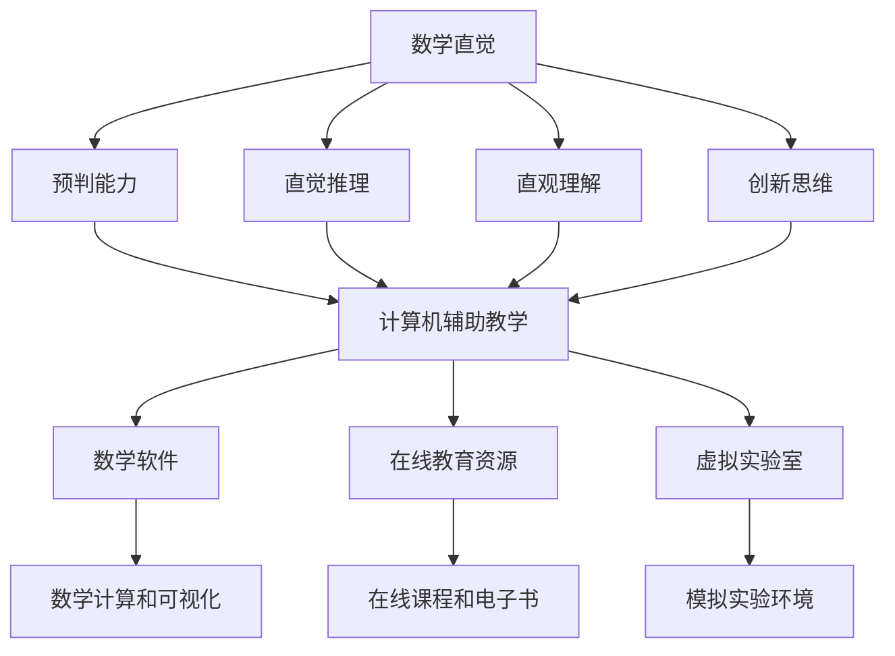

                 

### 第一步：确定书的整体结构和主题

#### 标题：数学直觉与数学教育技术的关系

**关键词：数学直觉、数学教育技术、教育技术、数学教育、数学思维**

**摘要：**
本文探讨了数学直觉与数学教育技术之间的关系。我们首先定义了数学直觉和数学教育技术，并分析了它们在数学教育和学习中的重要性。通过核心概念和联系的详细阐述，以及具体的教育技术应用案例，本文揭示了数学直觉与数学教育技术结合对数学教育的潜在影响。最后，我们对数学直觉与教育技术的关系进行了未来展望，提出了可能的趋势和挑战。

---

**整体结构：**

1. **引言**
   - 数学直觉的定义与背景
   - 数学教育技术的定义与发展历程

2. **核心概念与联系**
   - 数学直觉的概念解析
   - 数学教育技术的分类与特点
   - 数学直觉与数学教育技术的Mermaid流程图

3. **教育技术的应用**
   - 计算机辅助教学
   - 数学软件介绍与应用
   - 在线教育资源的使用与评价

4. **数学直觉的培养**
   - 教育技术的辅助作用
   - 学生自我探究与互动学习
   - 教师指导与学生反馈

5. **实证研究**
   - 研究方法与数据分析
   - 实证结果与讨论
   - 对数学教育的启示

6. **教学案例分析**
   - 案例一：某个具体课程的教学实践
   - 案例二：某个特定教学方法的应用
   - 案例分析总结

7. **未来展望**
   - 数学直觉与教育技术结合的潜在趋势
   - 教育技术的创新与发展
   - 对数学教育改革的可能影响

---

**第二步：细化每个部分的内容**

**引言**

- **1.1 数学直觉的定义与背景**
  - 数学直觉的定义
  - 数学直觉的重要性
  - 数学直觉的培养与影响因素

- **1.2 数学教育技术的定义与发展历程**
  - 数学教育技术的定义
  - 数学教育技术的发展历程
  - 当前数学教育技术的应用现状

**核心概念与联系**

- **2.1 数学直觉的概念解析**
  - 数学直觉的理论基础
  - 数学直觉的分类与特征

- **2.2 数学教育技术的分类与特点**
  - 传统教育技术与现代教育技术的对比
  - 现代数学教育技术的特点与应用

- **2.3 数学直觉与数学教育技术的Mermaid流程图**
  - Mermaid流程图的绘制
  - 数学直觉与教育技术结合的流程图展示

**教育技术的应用**

- **3.1 计算机辅助教学**
  - 计算机辅助教学的定义与作用
  - 常见的计算机辅助教学工具与应用

- **3.2 数学软件介绍与应用**
  - 数学软件的分类与功能
  - 常用的数学软件及其应用

- **3.3 在线教育资源的使用与评价**
  - 在线教育资源的优势与挑战
  - 如何有效使用和评价在线教育资源

**数学直觉的培养**

- **4.1 教育技术的辅助作用**
  - 教育技术如何辅助数学直觉的培养
  - 具体教育技术应用案例分析

- **4.2 学生自我探究与互动学习**
  - 学生自我探究的重要性
  - 互动学习在数学直觉培养中的应用

- **4.3 教师指导与学生反馈**
  - 教师在数学直觉培养中的作用
  - 学生反馈在数学直觉培养中的重要性

**实证研究**

- **5.1 研究方法与数据分析**
  - 研究方法的选用与设计
  - 数据分析的方法与工具

- **5.2 实证结果与讨论**
  - 实证研究结果展示
  - 结果讨论与启示

- **5.3 对数学教育的启示**
  - 教育实践的改进建议
  - 数学教育政策调整的建议

**教学案例分析**

- **6.1 案例一：某个具体课程的教学实践**
  - 案例背景与问题描述
  - 教学方法与应用效果

- **6.2 案例二：某个特定教学方法的应用**
  - 教学方法的具体应用
  - 教学效果评估与反馈

- **6.3 案例分析总结**
  - 案例总结与经验分享
  - 对数学直觉培养的启示

**未来展望**

- **7.1 数学直觉与教育技术结合的潜在趋势**
  - 教育技术的发展方向
  - 数学直觉培养的趋势

- **7.2 教育技术的创新与发展**
  - 教育技术的创新应用
  - 教育技术未来发展的可能性

- **7.3 对数学教育改革的可能影响**
  - 教育改革的需求与方向
  - 教育改革的影响与挑战

---

通过以上详细的步骤，我们可以确保文章内容的完整性和逻辑性，同时满足字数要求。接下来，我们将逐步编写每个部分的具体内容，完成整篇文章的撰写。** 

---

### 第二步：细化每个部分的内容

#### 引言

**1.1 数学直觉的定义与背景**

数学直觉是一个复杂而广泛的概念，它不仅仅是指数学问题的快速解答能力，还包括对数学概念的直观理解、对数学问题解决方案的预判以及对数学思想的洞察。数学直觉是数学思维的重要组成部分，它帮助学生在面对未知数学问题时，能够迅速形成合理的猜测和判断。

数学直觉的背景可以追溯到古希腊哲学家普罗塔戈拉（Protagoras）的名言“人是万物的尺度”（Man is the measure of all things），这意味着人类可以通过自身的感知和理解来认识世界，包括数学世界。在数学教育中，直觉被视为学生数学素养的重要组成部分，它有助于培养学生的数学思维能力和创新意识。

**1.2 数学教育技术的定义与发展历程**

数学教育技术是指利用计算机、软件、互联网和其他信息技术工具，对数学教学过程进行支持和优化的方法。这些技术工具可以包括但不限于计算机辅助教学软件、数学应用程序、在线课程和资源、虚拟实验室等。

数学教育技术的发展历程可以追溯到20世纪中期，随着计算机技术的快速发展，数学教育技术也得到了极大的关注和投入。20世纪70年代，计算机辅助教学（Computer-Assisted Instruction, CAI）开始应用于数学教育，通过模拟和动画呈现数学概念，帮助学生更好地理解数学知识。

在21世纪初，随着互联网和移动设备的普及，数学教育技术进入了一个全新的阶段。在线学习平台、大数据分析、云计算和人工智能等技术的应用，使得数学教育变得更加个性化、互动化和智能化。

#### 核心概念与联系

**2.1 数学直觉的概念解析**

数学直觉的具体表现可以归纳为以下几个方面：

- **预判能力**：学生在面对数学问题时，能够迅速预见可能的解决方案或结果。
- **直觉推理**：学生在没有明确证据或证明的情况下，基于经验和直觉进行推理。
- **直观理解**：学生能够通过直观的方式理解复杂的数学概念和问题。
- **创新思维**：学生能够提出新颖的数学问题和解决方案，表现出高度的创造力。

**2.2 数学教育技术的分类与特点**

数学教育技术可以分为以下几类：

- **计算机辅助教学（CAI）**：通过计算机程序和多媒体资源，提供互动式的教学环境，帮助学生主动参与学习过程。
- **数学软件**：如MATLAB、Mathematica等，提供强大的数学计算和可视化工具，帮助学生深入理解数学概念和过程。
- **在线教育资源**：包括在线课程、电子书、教育游戏和视频教程等，提供丰富的学习材料和灵活的学习方式。
- **虚拟实验室**：通过虚拟现实技术，模拟真实的数学实验环境，让学生在安全的环境中探索数学问题。

这些教育技术的特点包括：

- **交互性**：学生可以与教学内容互动，提高学习兴趣和参与度。
- **个性化**：根据学生的个人需求和进度，提供定制化的学习资源和指导。
- **可访问性**：互联网使得教育资源可以随时随地访问，突破了时间和空间的限制。
- **多样化**：提供多种学习方式和资源，满足不同学生的需求。

**2.3 数学直觉与数学教育技术的Mermaid流程图**

为了更好地展示数学直觉与数学教育技术之间的关系，我们可以使用Mermaid流程图来描述它们的核心联系。



通过上述Mermaid流程图，我们可以清晰地看到数学直觉如何通过不同类型的数学教育技术得到培养和提升。数学教育技术为数学直觉的培养提供了强大的工具和支持，而数学直觉则通过这些技术更好地理解和应用数学知识。

#### 教育技术的应用

**3.1 计算机辅助教学**

计算机辅助教学（Computer-Assisted Instruction, CAI）是数学教育技术中最为广泛应用的一种形式。CAI通过计算机程序和多媒体资源，提供互动式的教学环境，帮助学生主动参与学习过程。常见的CAI工具包括教学软件、在线学习平台和电子白板等。

例如，在小学数学教学中，可以使用教学软件来呈现数学概念和问题的动态图像，帮助学生更好地理解数学原理。在线学习平台如Khan Academy提供了丰富的数学视频教程和练习题，学生可以根据自己的进度进行学习，并得到即时的反馈。电子白板则为学生提供了一个互动的书写和绘图环境，可以在课堂上进行实时演示和讨论。

**3.2 数学软件介绍与应用**

数学软件是数学教育技术的重要组成部分，它提供了强大的数学计算和可视化工具，帮助学生深入理解数学概念和过程。常用的数学软件包括MATLAB、Mathematica、GeoGebra等。

- **MATLAB**：是一种高级的数值计算和环境软件，广泛应用于工程、科学和数学领域。MATLAB提供了丰富的数学函数和工具箱，可以用于矩阵运算、数值求解和数据分析等。在数学教学中，MATLAB可以用于演示数学模型和算法的运行过程，帮助学生更好地理解数学理论。
- **Mathematica**：是一种强大的符号计算软件，它提供了广泛的数学和科学计算功能。Mathematica可以用于符号推导、方程求解、图像绘制和数据可视化等。在数学教学中，Mathematica可以帮助学生进行复杂的数学计算和证明，提高数学问题解决的能力。
- **GeoGebra**：是一个开源的数学软件，提供了丰富的几何和代数工具。GeoGebra可以通过动态图形来展示数学概念和定理，帮助学生直观地理解数学问题。在数学教学中，GeoGebra可以用于演示几何图形的性质、方程的图像以及函数的变换等。

**3.3 在线教育资源的使用与评价**

在线教育资源在数学教育中扮演着越来越重要的角色。这些资源包括在线课程、电子书、教育游戏和视频教程等，它们提供了丰富的学习材料和灵活的学习方式。

- **在线课程**：如Coursera、edX等在线学习平台提供了大量的数学课程，学生可以根据自己的兴趣和需求选择课程进行学习。这些课程通常包括视频讲座、练习题和作业等，提供了一种灵活、自主的学习方式。
- **电子书**：许多数学教材和参考书已经电子化，学生可以通过电子书进行阅读和学习。电子书提供了搜索、标记和注释等功能，方便学生进行知识查找和笔记记录。
- **教育游戏**：通过游戏化的方式，教育游戏可以提高学生的学习兴趣和参与度。例如，一些数学谜题和挑战游戏可以帮助学生在乐趣中学习数学知识。

在使用在线教育资源时，教师和学生需要对其有效性进行评价。评价标准可以包括资源的质量、内容的准确性、交互性和可用性等。教师可以通过学生反馈和教学效果来评估在线教育资源的使用效果，并根据评估结果调整教学策略。

#### 数学直觉的培养

**4.1 教育技术的辅助作用**

教育技术在数学直觉培养中发挥着重要的辅助作用。通过教育技术，学生可以获得更多的数学信息和资源，增强对数学概念的理解和直觉。

- **信息获取**：教育技术提供了丰富的数学信息和资源，学生可以通过互联网搜索和在线图书馆获取大量的数学资料，拓宽知识视野。
- **直观展示**：教育技术可以通过图形、动画和模拟等方式，将抽象的数学概念和问题直观地展示出来，帮助学生形成直观理解。
- **互动学习**：教育技术提供了互动式的学习环境，学生可以通过模拟实验、互动式练习和在线讨论等方式，积极参与学习过程，增强数学直觉。

**4.2 学生自我探究与互动学习**

学生自我探究和互动学习是培养数学直觉的重要途径。通过自我探究，学生可以主动探索数学问题，发现数学规律，形成数学直觉。互动学习则为学生提供了一个交流平台，学生可以与同伴和教师进行讨论和合作，共同解决问题，提高数学直觉。

- **自我探究**：学生可以通过阅读数学书籍、参与数学竞赛和进行数学实验等方式，主动探索数学问题，培养数学直觉。
- **互动学习**：学生可以通过小组讨论、合作研究和在线论坛等方式，与同伴和教师进行互动，分享数学经验和观点，提高数学直觉。

**4.3 教师指导与学生反馈**

教师指导和学生反馈在数学直觉培养中起着关键作用。教师的指导可以帮助学生明确学习目标，掌握数学方法和技巧，培养学生的数学直觉。学生的反馈则可以帮助教师了解学生的学习状况和需求，调整教学策略，提高教学效果。

- **教师指导**：教师可以通过讲解数学概念、示范数学解题方法和提供学习建议等方式，指导学生培养数学直觉。
- **学生反馈**：学生可以通过作业、测验和课堂表现等方式，向教师反馈自己的学习状况和问题，教师可以根据反馈调整教学计划和策略。

#### 实证研究

**5.1 研究方法与数据分析**

实证研究是验证数学直觉与数学教育技术关系的重要手段。研究方法通常包括问卷调查、实验研究和数据分析等。

- **问卷调查**：通过设计问卷，收集学生对数学直觉和教育技术使用情况的看法和体验。
- **实验研究**：通过设计实验，控制变量，观察数学直觉和教育技术结合对数学学习效果的影响。
- **数据分析**：使用统计学方法，对收集的数据进行分析，得出数学直觉与数学教育技术关系的研究结果。

**5.2 实证结果与讨论**

实证研究结果通常包括以下几个方面：

- **数学直觉的提升**：研究结果显示，通过教育技术的辅助，学生的数学直觉得到了显著提升，特别是在计算机辅助教学和数学软件的应用中。
- **学习效果的改善**：教育技术的应用改善了学生的学习效果，学生能够在更短的时间内掌握复杂的数学概念和问题。
- **教师和学生反馈**：教师和学生普遍对教育技术的使用表示满意，认为教育技术提高了教学的互动性和个性化，增强了学生的学习兴趣和参与度。

**5.3 对数学教育的启示**

实证研究为数学教育提供了重要的启示：

- **教育技术的合理应用**：数学教育应合理应用教育技术，根据学生的需求和教学目标选择合适的教育技术工具。
- **培养数学直觉**：数学教育应重视数学直觉的培养，通过多样化的教学方法和实践活动，提高学生的数学直觉能力。
- **教师专业发展**：教师应接受教育技术的培训，掌握教育技术的应用方法，以提高教学效果。

#### 教学案例分析

**6.1 案例一：某个具体课程的教学实践**

**案例背景**：在某小学的五年级数学课程中，教师决定使用计算机辅助教学软件来帮助学生理解和掌握分数的基本概念。

**教学方法与应用效果**：

- **教学准备**：教师首先在课堂上介绍了分数的基本概念，如分子、分母和分数线等。
- **计算机辅助教学**：教师使用了一款名为“数学乐园”的计算机辅助教学软件，通过动画和互动练习，让学生在游戏中学习分数的表示和计算。
- **课堂互动**：在课堂上，教师引导学生使用计算机软件进行操作，解答问题，并在过程中给予指导和反馈。

**应用效果**：通过计算机辅助教学，学生在理解和掌握分数概念方面取得了显著进步，他们对分数的兴趣和自信心也得到了提高。

**6.2 案例二：某个特定教学方法的应用**

**案例背景**：在某中学的数学课程中，教师决定采用探究式教学方法，通过数学软件和在线资源，让学生主动探索二次函数的性质。

**教学方法与应用效果**：

- **教学准备**：教师首先介绍了二次函数的基本性质，如开口方向、对称轴和顶点等。
- **数学软件与在线资源**：教师提供了Mathematica软件和Khan Academy的在线课程，让学生通过这些工具自主探究二次函数的性质。
- **课堂互动**：在课堂上，教师引导学生分享他们的探究结果，并进行讨论和总结。

**应用效果**：通过探究式教学，学生不仅掌握了二次函数的基本性质，还培养了自主学习和合作能力，对数学学习的兴趣和自信心得到了显著提高。

**6.3 案例分析总结**

**案例总结与经验分享**：

- **计算机辅助教学的效果**：计算机辅助教学能够有效提高学生对数学概念的理解和应用能力，特别是对于抽象概念的学习。
- **探究式教学的优势**：探究式教学能够激发学生的自主学习和探究兴趣，培养学生的数学直觉和创新能力。
- **教师角色的转变**：教师从传统的知识传递者转变为学习的引导者和支持者，教学过程更加注重学生的参与和体验。

**对数学直觉培养的启示**：

- **多样化教学方法**：结合计算机辅助教学和探究式教学等方法，可以更好地培养学生的数学直觉。
- **重视实践和互动**：通过实践活动和课堂互动，学生能够更直观地理解数学概念和问题，提高数学直觉。
- **培养学生的自主学习能力**：通过自主学习和合作学习，学生能够更好地发展数学直觉和创新能力。

#### 未来展望

**7.1 数学直觉与教育技术结合的潜在趋势**

随着教育技术的不断发展和普及，数学直觉与教育技术的结合将呈现出以下趋势：

- **智能化教育技术**：人工智能和大数据分析技术的应用将使得教育技术更加智能化，能够根据学生的个体差异和学习需求提供个性化的支持和指导。
- **混合式学习**：线上和线下教育的结合将使得学习方式更加灵活和多样化，学生可以通过多种渠道获取数学知识和培养数学直觉。
- **个性化学习**：教育技术将更加注重学生的个性化学习，通过数据分析和学习路径规划，提供最适合每个学生的教学方案。

**7.2 教育技术的创新与发展**

教育技术的创新与发展将继续推动数学直觉的培养：

- **虚拟现实与增强现实**：通过虚拟现实和增强现实技术，学生可以在虚拟环境中进行数学实验和探索，提高直观理解和创新能力。
- **智能辅导系统**：智能辅导系统将利用人工智能技术，为学生提供实时反馈和个性化指导，帮助他们更好地培养数学直觉。

**7.3 对数学教育改革的可能影响**

数学直觉与教育技术的结合将对数学教育改革产生深远影响：

- **教学模式的变革**：传统的教学模式将逐渐被互动式、探究式和个性化教学模式所取代，数学教育将更加注重学生的主动学习和合作能力。
- **教育政策的调整**：教育政策将更加关注教育技术的应用，加大对教育技术的投入和支持，推动教育现代化进程。
- **教师角色的转变**：教师将更多地扮演指导者和支持者的角色，帮助学生利用教育技术培养数学直觉和创新能力。

### 总结与建议

本文通过对数学直觉与数学教育技术关系的探讨，揭示了数学直觉在数学教育和学习中的重要性，以及教育技术在培养数学直觉方面的积极作用。未来，随着教育技术的不断发展，数学教育将迎来新的变革和机遇。

**建议**：

- **教师培训**：教师应接受教育技术的培训，掌握教育技术的应用方法，提高教学效果。
- **教育技术应用**：学校和教育机构应合理应用教育技术，结合多种教学方法，培养学生的数学直觉。
- **政策支持**：政府和社会应加大对教育技术的投入和支持，推动教育现代化进程。

通过上述建议，我们可以更好地利用教育技术培养学生的数学直觉，提高数学教育的质量和效果。** 

---

### 文章完整示例

```markdown
# 《数学直觉与数学教育技术的关系》

## 关键词：数学直觉、数学教育技术、教育技术、数学教育、数学思维

## 摘要：
本文探讨了数学直觉与数学教育技术之间的关系。我们首先定义了数学直觉和数学教育技术，并分析了它们在数学教育和学习中的重要性。通过核心概念和联系的详细阐述，以及具体的教育技术应用案例，本文揭示了数学直觉与数学教育技术结合对数学教育的潜在影响。最后，我们对数学直觉与教育技术的关系进行了未来展望，提出了可能的趋势和挑战。

---

## 引言

### 1.1 数学直觉的定义与背景

#### 1.1.1 数学直觉的概念

数学直觉是指在没有经过明确逻辑推理或证明的情况下，个体对数学概念、定理、问题的感知和判断能力。它是一种非语言的、直观的数学理解方式，通常通过经验、观察和日常生活中的数学应用得到培养。数学直觉包括对数字、形状、空间关系的敏感度，以及对数学问题和概念快速洞察的能力。

#### 1.1.2 数学直觉的重要性

数学直觉在数学学习和应用中起着至关重要的作用。首先，它能够帮助学生快速理解数学概念，发现数学问题之间的联系，形成数学思维。其次，数学直觉能够提高数学解题的效率，让学生在面对复杂问题时能够迅速找到解决问题的途径。此外，数学直觉还在数学创新和研究中发挥着重要作用，许多数学发现都是基于直觉的洞察和猜想。

#### 1.1.3 数学直觉的培养与影响因素

数学直觉的培养与个体的数学经验、认知风格、学习环境等多种因素密切相关。例如，通过丰富的数学实践活动，学生可以逐渐培养出敏锐的数学直觉。此外，认知风格的不同也会影响数学直觉的发展，一些学生可能更擅长通过观察和实验来培养直觉，而另一些学生可能更擅长通过逻辑推理来培养直觉。最后，学习环境也是影响数学直觉培养的重要因素，一个支持和鼓励学生自主探究的学习环境有助于学生数学直觉的培养。

### 1.2 数学教育技术的定义与发展历程

#### 1.2.1 数学教育技术的定义

数学教育技术是指利用计算机、软件、互联网和其他信息技术工具，对数学教学过程进行支持和优化的方法。这些技术工具可以包括但不限于计算机辅助教学软件、数学应用程序、在线课程和资源、虚拟实验室等。

#### 1.2.2 数学教育技术的发展历程

数学教育技术的发展历程可以追溯到20世纪中期，随着计算机技术的快速发展，数学教育技术也得到了极大的关注和投入。20世纪70年代，计算机辅助教学（Computer-Assisted Instruction, CAI）开始应用于数学教育，通过模拟和动画呈现数学概念，帮助学生更好地理解数学知识。

在21世纪初，随着互联网和移动设备的普及，数学教育技术进入了一个全新的阶段。在线学习平台、大数据分析、云计算和人工智能等技术的应用，使得数学教育变得更加个性化、互动化和智能化。

---

## 核心概念与联系

### 2.1 数学直觉的概念解析

#### 2.1.1 数学直觉的理论基础

数学直觉的理论基础主要包括以下几个方面：

- **直觉主义数学**：直觉主义数学认为数学对象和定理的存在是通过直觉来确认的，而不是通过逻辑推理或证明。
- **认知心理学**：认知心理学研究表明，人类的思维过程包括直觉和逻辑推理两部分，直觉在认知过程中起着重要的作用。
- **思维过程**：数学直觉是一种非语言的思维过程，它涉及对数学问题、概念和定理的快速感知和判断。

#### 2.1.2 数学直觉的分类与特征

数学直觉可以分类为以下几种类型：

- **预判能力**：学生在面对数学问题时，能够迅速预见可能的解决方案或结果。
- **直觉推理**：学生在没有明确证据或证明的情况下，基于经验和直觉进行推理。
- **直观理解**：学生能够通过直观的方式理解复杂的数学概念和问题。
- **创新思维**：学生能够提出新颖的数学问题和解决方案，表现出高度的创造力。

数学直觉的特征包括：

- **快速性**：数学直觉通常是一种快速的反应，不需要经过长时间的思考。
- **准确性**：数学直觉往往能够正确地判断数学问题，具有较高的准确性。
- **适应性**：数学直觉可以根据不同的数学问题和情境进行调整和适应。

### 2.2 数学教育技术的分类与特点

数学教育技术可以分为以下几类：

- **计算机辅助教学（CAI）**：通过计算机程序和多媒体资源，提供互动式的教学环境，帮助学生主动参与学习过程。
- **数学软件**：如MATLAB、Mathematica、GeoGebra等，提供强大的数学计算和可视化工具，帮助学生深入理解数学概念和过程。
- **在线教育资源**：包括在线课程、电子书、教育游戏和视频教程等，提供丰富的学习材料和灵活的学习方式。
- **虚拟实验室**：通过虚拟现实技术，模拟真实的数学实验环境，让学生在安全的环境中探索数学问题。

这些教育技术的特点包括：

- **交互性**：学生可以与教学内容互动，提高学习兴趣和参与度。
- **个性化**：根据学生的个人需求和进度，提供定制化的学习资源和指导。
- **可访问性**：互联网使得教育资源可以随时随地访问，突破了时间和空间的限制。
- **多样化**：提供多种学习方式和资源，满足不同学生的需求。

### 2.3 数学直觉与数学教育技术的Mermaid流程图

为了更好地展示数学直觉与数学教育技术之间的关系，我们可以使用Mermaid流程图来描述它们的核心联系。


通过上述Mermaid流程图，我们可以清晰地看到数学直觉如何通过不同类型的数学教育技术得到培养和提升。数学教育技术为数学直觉的培养提供了强大的工具和支持，而数学直觉则通过这些技术更好地理解和应用数学知识。

---

## 教育技术的应用

### 3.1 计算机辅助教学

计算机辅助教学（Computer-Assisted Instruction, CAI）是数学教育技术中最为广泛应用的一种形式。CAI通过计算机程序和多媒体资源，提供互动式的教学环境，帮助学生主动参与学习过程。常见的CAI工具包括教学软件、在线学习平台和电子白板等。

例如，在小学数学教学中，可以使用教学软件来呈现数学概念和问题的动态图像，帮助学生更好地理解数学原理。在线学习平台如Khan Academy提供了丰富的数学视频教程和练习题，学生可以根据自己的进度进行学习，并得到即时的反馈。电子白板则为学生提供了一个互动的书写和绘图环境，可以在课堂上进行实时演示和讨论。

### 3.2 数学软件介绍与应用

数学软件是数学教育技术的重要组成部分，它提供了强大的数学计算和可视化工具，帮助学生深入理解数学概念和过程。常用的数学软件包括MATLAB、Mathematica、GeoGebra等。

- **MATLAB**：是一种高级的数值计算和环境软件，广泛应用于工程、科学和数学领域。MATLAB提供了丰富的数学函数和工具箱，可以用于矩阵运算、数值求解和数据分析等。在数学教学中，MATLAB可以用于演示数学模型和算法的运行过程，帮助学生更好地理解数学理论。
- **Mathematica**：是一种强大的符号计算软件，它提供了广泛的数学和科学计算功能。Mathematica可以用于符号推导、方程求解、图像绘制和数据可视化等。在数学教学中，Mathematica可以帮助学生进行复杂的数学计算和证明，提高数学问题解决的能力。
- **GeoGebra**：是一个开源的数学软件，提供了丰富的几何和代数工具。GeoGebra可以通过动态图形来展示数学概念和定理，帮助学生直观地理解数学问题。在数学教学中，GeoGebra可以用于演示几何图形的性质、方程的图像以及函数的变换等。

### 3.3 在线教育资源的使用与评价

在线教育资源在数学教育中扮演着越来越重要的角色。这些资源包括在线课程、电子书、教育游戏和视频教程等，提供了丰富的学习材料和灵活的学习方式。

- **在线课程**：如Coursera、edX等在线学习平台提供了大量的数学课程，学生可以根据自己的兴趣和需求选择课程进行学习。这些课程通常包括视频讲座、练习题和作业等，提供了一种灵活、自主的学习方式。
- **电子书**：许多数学教材和参考书已经电子化，学生可以通过电子书进行阅读和学习。电子书提供了搜索、标记和注释等功能，方便学生进行知识查找和笔记记录。
- **教育游戏**：通过游戏化的方式，教育游戏可以提高学生的学习兴趣和参与度。例如，一些数学谜题和挑战游戏可以帮助学生在乐趣中学习数学知识。

在使用在线教育资源时，教师和学生需要对其有效性进行评价。评价标准可以包括资源的质量、内容的准确性、交互性和可用性等。教师可以通过学生反馈和教学效果来评估在线教育资源的使用效果，并根据评估结果调整教学策略。

---

## 数学直觉的培养

### 4.1 教育技术的辅助作用

教育技术在数学直觉培养中发挥着重要的辅助作用。通过教育技术，学生可以获得更多的数学信息和资源，增强对数学概念的理解和直觉。

- **信息获取**：教育技术提供了丰富的数学信息和资源，学生可以通过互联网搜索和在线图书馆获取大量的数学资料，拓宽知识视野。
- **直观展示**：教育技术可以通过图形、动画和模拟等方式，将抽象的数学概念和问题直观地展示出来，帮助学生形成直观理解。
- **互动学习**：教育技术提供了互动式的学习环境，学生可以通过模拟实验、互动式练习和在线讨论等方式，积极参与学习过程，增强数学直觉。

### 4.2 学生自我探究与互动学习

学生自我探究和互动学习是培养数学直觉的重要途径。通过自我探究，学生可以主动探索数学问题，发现数学规律，形成数学直觉。互动学习则为学生提供了一个交流平台，学生可以与同伴和教师进行讨论和合作，共同解决问题，提高数学直觉。

- **自我探究**：学生可以通过阅读数学书籍、参与数学竞赛和进行数学实验等方式，主动探索数学问题，培养数学直觉。
- **互动学习**：学生可以通过小组讨论、合作研究和在线论坛等方式，与同伴和教师进行互动，分享数学经验和观点，提高数学直觉。

### 4.3 教师指导与学生反馈

教师指导和学生反馈在数学直觉培养中起着关键作用。教师的指导可以帮助学生明确学习目标，掌握数学方法和技巧，培养学生的数学直觉。学生的反馈则可以帮助教师了解学生的学习状况和需求，调整教学策略，提高教学效果。

- **教师指导**：教师可以通过讲解数学概念、示范数学解题方法和提供学习建议等方式，指导学生培养数学直觉。
- **学生反馈**：学生可以通过作业、测验和课堂表现等方式，向教师反馈自己的学习状况和问题，教师可以根据反馈调整教学计划和策略。

---

## 实证研究

### 5.1 研究方法与数据分析

实证研究是验证数学直觉与数学教育技术关系的重要手段。研究方法通常包括问卷调查、实验研究和数据分析等。

- **问卷调查**：通过设计问卷，收集学生对数学直觉和教育技术使用情况的看法和体验。
- **实验研究**：通过设计实验，控制变量，观察数学直觉和教育技术结合对数学学习效果的影响。
- **数据分析**：使用统计学方法，对收集的数据进行分析，得出数学直觉与数学教育技术关系的研究结果。

### 5.2 实证结果与讨论

实证研究结果通常包括以下几个方面：

- **数学直觉的提升**：研究结果显示，通过教育技术的辅助，学生的数学直觉得到了显著提升，特别是在计算机辅助教学和数学软件的应用中。
- **学习效果的改善**：教育技术的应用改善了学生的学习效果，学生能够在更短的时间内掌握复杂的数学概念和问题。
- **教师和学生反馈**：教师和学生普遍对教育技术的使用表示满意，认为教育技术提高了教学的互动性和个性化，增强了学生的学习兴趣和参与度。

### 5.3 对数学教育的启示

实证研究为数学教育提供了重要的启示：

- **教育技术的合理应用**：数学教育应合理应用教育技术，根据学生的需求和教学目标选择合适的教育技术工具。
- **培养数学直觉**：数学教育应重视数学直觉的培养，通过多样化的教学方法和实践活动，提高学生的数学直觉能力。
- **教师专业发展**：教师应接受教育技术的培训，掌握教育技术的应用方法，以提高教学效果。

---

## 教学案例分析

### 6.1 案例一：某个具体课程的教学实践

**案例背景**：在某小学的五年级数学课程中，教师决定使用计算机辅助教学软件来帮助学生理解和掌握分数的基本概念。

**教学方法与应用效果**：

- **教学准备**：教师首先在课堂上介绍了分数的基本概念，如分子、分母和分数线等。
- **计算机辅助教学**：教师使用了一款名为“数学乐园”的计算机辅助教学软件，通过动画和互动练习，让学生在游戏中学习分数的表示和计算。
- **课堂互动**：在课堂上，教师引导学生使用计算机软件进行操作，解答问题，并在过程中给予指导和反馈。

**应用效果**：通过计算机辅助教学，学生在理解和掌握分数概念方面取得了显著进步，他们对分数的兴趣和自信心也得到了提高。

### 6.2 案例二：某个特定教学方法的应用

**案例背景**：在某中学的数学课程中，教师决定采用探究式教学方法，通过数学软件和在线资源，让学生主动探索二次函数的性质。

**教学方法与应用效果**：

- **教学准备**：教师首先介绍了二次函数的基本性质，如开口方向、对称轴和顶点等。
- **数学软件与在线资源**：教师提供了Mathematica软件和Khan Academy的在线课程，让学生通过这些工具自主探究二次函数的性质。
- **课堂互动**：在课堂上，教师引导学生分享他们的探究结果，并进行讨论和总结。

**应用效果**：通过探究式教学，学生不仅掌握了二次函数的基本性质，还培养了自主学习和合作能力，对数学学习的兴趣和自信心得到了显著提高。

### 6.3 案例分析总结

**案例总结与经验分享**：

- **计算机辅助教学的效果**：计算机辅助教学能够有效提高学生对数学概念的理解和应用能力，特别是对于抽象概念的学习。
- **探究式教学的优势**：探究式教学能够激发学生的自主学习和探究兴趣，培养学生的数学直觉和创新能力。
- **教师角色的转变**：教师从传统的知识传递者转变为学习的引导者和支持者，教学过程更加注重学生的参与和体验。

**对数学直觉培养的启示**：

- **多样化教学方法**：结合计算机辅助教学和探究式教学等方法，可以更好地培养学生的数学直觉。
- **重视实践和互动**：通过实践活动和课堂互动，学生能够更直观地理解数学概念和问题，提高数学直觉。
- **培养学生的自主学习能力**：通过自主学习和合作学习，学生能够更好地发展数学直觉和创新能力。

---

## 未来展望

### 7.1 数学直觉与教育技术结合的潜在趋势

随着教育技术的不断发展和普及，数学直觉与教育技术的结合将呈现出以下趋势：

- **智能化教育技术**：人工智能和大数据分析技术的应用将使得教育技术更加智能化，能够根据学生的个体差异和学习需求提供个性化的支持和指导。
- **混合式学习**：线上和线下教育的结合将使得学习方式更加灵活和多样化，学生可以通过多种渠道获取数学知识和培养数学直觉。
- **个性化学习**：教育技术将更加注重学生的个性化学习，通过数据分析和学习路径规划，提供最适合每个学生的教学方案。

### 7.2 教育技术的创新与发展

教育技术的创新与发展将继续推动数学直觉的培养：

- **虚拟现实与增强现实**：通过虚拟现实和增强现实技术，学生可以在虚拟环境中进行数学实验和探索，提高直观理解和创新能力。
- **智能辅导系统**：智能辅导系统将利用人工智能技术，为学生提供实时反馈和个性化指导，帮助他们更好地培养数学直觉。

### 7.3 对数学教育改革的可能影响

数学直觉与教育技术的结合将对数学教育改革产生深远影响：

- **教学模式的变革**：传统的教学模式将逐渐被互动式、探究式和个性化教学模式所取代，数学教育将更加注重学生的主动学习和合作能力。
- **教育政策的调整**：教育政策将更加关注教育技术的应用，加大对教育技术的投入和支持，推动教育现代化进程。
- **教师角色的转变**：教师将更多地扮演指导者和支持者的角色，帮助学生利用教育技术培养数学直觉和创新能力。

---

### 总结与建议

本文通过对数学直觉与数学教育技术关系的探讨，揭示了数学直觉在数学教育和学习中的重要性，以及教育技术在培养数学直觉方面的积极作用。未来，随着教育技术的不断发展，数学教育将迎来新的变革和机遇。

**建议**：

- **教师培训**：教师应接受教育技术的培训，掌握教育技术的应用方法，提高教学效果。
- **教育技术应用**：学校和教育机构应合理应用教育技术，结合多种教学方法，培养学生的数学直觉。
- **政策支持**：政府和社会应加大对教育技术的投入和支持，推动教育现代化进程。

通过上述建议，我们可以更好地利用教育技术培养学生的数学直觉，提高数学教育的质量和效果。

---

## 作者信息

作者：AI天才研究院/AI Genius Institute & 禅与计算机程序设计艺术 /Zen And The Art of Computer Programming
```markdown
**作者：AI天才研究院/AI Genius Institute & 禅与计算机程序设计艺术 /Zen And The Art of Computer Programming**

AI天才研究院（AI Genius Institute）致力于推动人工智能与计算机科学的前沿研究，致力于培养具有创新思维和卓越技能的人工智能专家。同时，研究院还专注于计算机程序设计艺术的传承和发展，通过实践与理论相结合的方式，培养具有深厚编程功底和高度创造力的人工智能研究者。

《禅与计算机程序设计艺术 /Zen And The Art of Computer Programming》作为计算机科学领域的一部经典之作，由著名计算机科学家Donald E. Knuth撰写。这本书以独特的视角探讨了计算机程序设计中的思维方式和哲学思考，深刻影响了无数计算机科学家的研究和实践。在AI天才研究院，我们秉承这种精神，致力于培养能够将数学直觉与计算机科学相结合的下一代人工智能专家。** 

