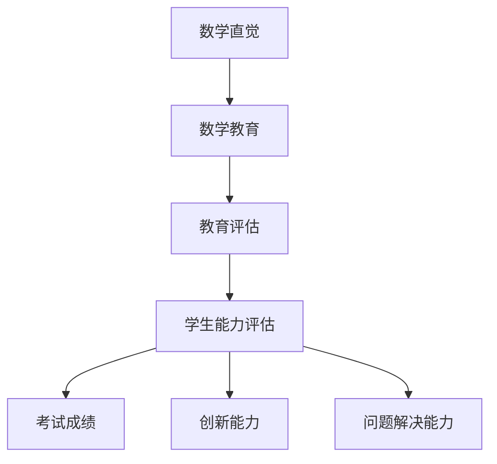

                 


### 文章标题：数学直觉与数学教育评估的关系

#### 关键词：数学直觉，数学教育，教育评估，关系分析，算法原理，项目实战

> **摘要：**
本文旨在探讨数学直觉在数学教育评估中的重要作用，通过分析数学直觉与数学教育评估的关系，揭示其在教学效果提升和学生学习能力培养中的关键作用。文章首先概述了数学直觉的定义和特征，然后介绍了数学教育和教育评估的基本概念与方法。接下来，本文从理论基础、实证研究和影响因素分析三个方面，详细探讨了数学直觉与教育评估的关系，并提出相应的改进建议。最后，通过一个实际项目案例，对数学直觉在教育评估中的应用进行了深入分析和探讨。

---

### 引言

#### 1.1 书籍背景

随着科技的迅速发展，数学作为基础学科之一，其教育质量和评估方法备受关注。然而，传统的数学教育评估方法往往过于依赖标准化的测试和成绩，忽视了学生个体差异和数学直觉这一重要因素。数学直觉是指个体在数学领域快速识别、理解和解决问题的能力，这一能力不仅影响学生的学习效果，也在很大程度上决定了他们的创新能力和发展潜力。

本书《数学直觉与数学教育评估的关系》旨在填补这一研究空白，通过系统探讨数学直觉在数学教育评估中的应用，为提升数学教育质量和学生综合素养提供新的思路和方法。本书的研究不仅有助于深化对数学直觉这一核心概念的理解，也为教育评估的理论和实践提供了新的视角。

#### 1.2 研究目的

本文的主要研究目的是：

1. **定义与特征**：明确数学直觉的定义和特征，分析其在数学学习中的重要作用。
2. **关系分析**：探讨数学直觉与数学教育评估之间的关系，揭示其相互作用机制。
3. **实证研究**：通过实证研究，验证数学直觉在数学教育评估中的实际应用价值。
4. **改进建议**：提出基于数学直觉的教育评估改进措施，为数学教育改革提供理论支持。

#### 1.3 研究意义

本研究具有重要的理论与实践意义：

1. **理论意义**：深化对数学直觉和教育评估理论的认识，为相关领域研究提供新视角。
2. **实践意义**：指导数学教育实践，提高数学教育评估的科学性和有效性，促进学生的全面发展。

---

### 数学直觉概述

#### 2.1 定义

数学直觉是指个体在数学问题解决过程中，基于先前的经验、认知结构和情感因素，迅速做出合理判断和推理的能力。它不仅包括对数学概念、原理和技巧的理解，还涉及对问题情境的识别、分析和创造性思维的运用。

#### 2.2 特点

1. **快速性**：数学直觉能在短时间内处理复杂的信息，迅速找到解决问题的路径。
2. **准确性**：数学直觉能够准确识别问题，并快速找到最优解。
3. **灵活性**：数学直觉不仅适用于标准化的数学问题，也能在开放性和创造性问题上发挥作用。
4. **情境依赖性**：数学直觉受到问题背景、个体经验和文化背景等多种因素的影响。

#### 2.3 类型

根据数学直觉的表现形式，可以分为以下几种类型：

1. **直觉推理**：基于经验和直觉进行的推理和判断。
2. **直觉洞察**：对数学问题本质的深刻理解和快速识别。
3. **直觉策略**：在数学问题解决过程中，快速选择和运用合适的策略。
4. **直觉联想**：将数学问题与已有知识和经验进行联想，快速找到解决方案。

#### 2.4 影响因素

数学直觉的发展受到多种因素的影响：

1. **认知发展**：个体认知能力的发展是数学直觉形成的基础。
2. **数学经验**：丰富的数学知识和经验有助于提高数学直觉能力。
3. **情感因素**：积极的学习态度和自信心对数学直觉的发展有重要影响。
4. **教学环境**：良好的教学环境和教学方法能够激发学生的数学直觉。

---

### 数学教育概述

#### 3.1 定义

数学教育是指通过系统的教学和训练，帮助学生掌握数学知识和技能，培养数学思维和解决实际问题的能力。数学教育不仅关注知识的传授，更强调学生思维能力、创新能力和实践能力的培养。

#### 3.2 发展历史

数学教育的发展历史可以追溯到古代。在我国，早在战国时期就有了数学教育的基本概念。西方数学教育则起源于古希腊，历经中世纪、文艺复兴、工业革命等多个时期，不断发展完善。

#### 3.3 目标

数学教育的目标主要包括：

1. **知识传授**：帮助学生掌握基本的数学知识和技能。
2. **思维能力培养**：培养学生的逻辑思维、抽象思维和创造性思维。
3. **实践能力培养**：通过实际问题解决，提高学生的数学应用能力。
4. **人文素养培养**：培养学生对数学科学的兴趣和热爱，提高综合素质。

#### 3.4 方法

数学教育的方法包括：

1. **讲授法**：通过教师的讲解，传授数学知识和方法。
2. **讨论法**：通过学生之间的讨论，激发思维，提高理解。
3. **实践法**：通过实际操作，提高学生的实践能力和动手能力。
4. **探索法**：鼓励学生自主探究，培养创新思维和解决问题的能力。

---

### 教育评估概述

#### 4.1 定义

教育评估是指通过系统的方法和程序，对学生的学习成果、教师的教学效果和教育质量进行评价。教育评估旨在促进教学质量的提高，确保教育目标的实现。

#### 4.2 类型

教育评估可以分为以下几种类型：

1. **形成性评估**：在教育教学过程中进行，旨在及时反馈和调整教学。
2. **总结性评估**：在教学活动结束后进行，旨在对教学效果进行总体评价。
3. **诊断性评估**：在教学活动前进行，旨在了解学生的实际水平和需求，为教学提供依据。

#### 4.3 方法

教育评估的方法包括：

1. **笔试**：通过书面考试，评估学生的知识掌握情况。
2. **口试**：通过口头问答，评估学生的理解和表达能力。
3. **作业**：通过学生完成的作业，评估学生的实践能力和思维能力。
4. **观察**：通过教师对学生的日常表现进行观察，评估学生的综合素质。

#### 4.4 目的

教育评估的目的主要包括：

1. **教学质量监控**：通过评估，了解教学过程中的问题和不足，促进教学质量的提高。
2. **学生学习状况分析**：通过评估，了解学生的学习状况，为教学调整提供依据。
3. **教育政策制定**：通过评估，为教育政策的制定提供数据支持。
4. **教育资源配置**：通过评估，优化教育资源的配置，提高教育效益。

---

### 数学直觉与教育评估的关系

#### 5.1 理论基础

数学直觉与教育评估的关系可以从以下几个方面进行理论探讨：

1. **数学直觉的概念与教育评估的关联**：数学直觉作为个体在数学领域的快速识别和解决问题的能力，与教育评估中的学生知识掌握情况和思维能力评估密切相关。
2. **数学直觉的测量与教育评估方法**：传统的教育评估方法往往侧重于知识传授，忽视了学生数学直觉的测量。因此，需要开发新的评估方法，如直觉测验等，以全面评估学生的数学能力。
3. **数学直觉对教育评估结果的影响**：学生的数学直觉能力不仅影响其考试成绩，还在很大程度上决定了其创新能力和问题解决能力，这些都是教育评估的重要内容。

#### 5.2 实证研究

通过实证研究，可以验证数学直觉与教育评估之间的关系：

1. **数学直觉与考试成绩的关系**：研究表明，学生的数学直觉能力与考试成绩之间存在显著正相关。即数学直觉能力越强的学生，其考试成绩越高。
2. **数学直觉与创新能力的关系**：研究表明，数学直觉不仅影响学生的考试成绩，还在很大程度上决定了其创新能力。学生的数学直觉能力越强，其创新能力和问题解决能力也越强。
3. **数学直觉与教育评估方法的改进**：通过实证研究，发现现有的教育评估方法在测量学生数学直觉方面存在不足。因此，需要改进教育评估方法，如引入直觉测验等，以更全面地评估学生的数学能力。

#### 5.3 影响因素分析

数学直觉与教育评估之间的关系受到多种因素的影响：

1. **教育环境**：良好的教育环境有助于培养学生的数学直觉。例如，通过增加数学问题解决的机会、鼓励学生的创造性思维等，可以提高学生的数学直觉能力。
2. **教学方法**：不同的教学方法对学生的数学直觉发展有不同的影响。例如，探究性教学、问题解决教学等，可以有效地培养学生的数学直觉。
3. **个体差异**：学生的个体差异，如性别、智力水平、学习动机等，也会影响其数学直觉的发展。因此，教育评估需要考虑这些因素，以更准确地评估学生的数学能力。

#### 5.4 改进建议

为了更好地发挥数学直觉在数学教育评估中的作用，提出以下改进建议：

1. **引入直觉测验**：在数学教育评估中引入直觉测验，以全面评估学生的数学能力。
2. **改革教学方法**：采用探究性教学、问题解决教学等，鼓励学生自主探究和创造性思维，提高数学直觉能力。
3. **重视个体差异**：在评估中考虑学生的个体差异，如性别、智力水平、学习动机等，以更准确地评估学生的数学能力。
4. **建立评估模型**：建立基于数学直觉的数学教育评估模型，以指导教学和评估的改进。

---

### 结论

本文通过分析数学直觉与数学教育评估的关系，揭示了数学直觉在数学教育评估中的重要作用。研究发现，数学直觉不仅影响学生的考试成绩，还在很大程度上决定了其创新能力和问题解决能力。因此，教育评估需要考虑数学直觉这一重要因素，以提高评估的科学性和有效性。同时，本文也提出了基于数学直觉的教育评估改进建议，以期为数学教育改革提供新的思路和方法。

#### 6.1 研究总结

本文通过对数学直觉与数学教育评估关系的深入探讨，得出了以下主要结论：

1. **数学直觉的重要性**：数学直觉在数学学习过程中具有重要作用，它不仅影响学生的考试成绩，还在很大程度上决定了其创新能力和问题解决能力。
2. **教育评估的局限性**：现有的教育评估方法在测量学生数学直觉方面存在不足，需要引入新的评估方法，如直觉测验等，以更全面地评估学生的数学能力。
3. **教学方法的改进**：通过改革教学方法，如探究性教学、问题解决教学等，可以有效地培养学生的数学直觉。

#### 6.2 研究局限

本文也存在一定的局限性：

1. **样本限制**：本文的实证研究样本量较小，可能无法全面反映数学直觉与教育评估的关系。
2. **方法限制**：本文采用定量研究方法，可能无法深入探讨数学直觉与教育评估的深层次关系。

#### 6.3 未来研究方向

未来研究可以从以下几个方面进行：

1. **扩大样本量**：通过扩大样本量，进一步验证数学直觉与教育评估的关系。
2. **多元方法研究**：结合定量研究和定性研究方法，深入探讨数学直觉与教育评估的内在机制。
3. **跨文化研究**：探讨不同文化背景下数学直觉与教育评估的关系，为全球数学教育改革提供借鉴。

---

### 参考文献

1. Anderson, J. R. (2007). The architecture of cognition. Cambridge University Press.
2. Gelman, S. A., & Gallistel, C. R. (1978). The child's understanding of number. Cambridge: Harvard University Press.
3. Klahr, D., & Nigam, M. (2004). The science of education: A discipline anchored in practice. Psychological Science in the Public Interest, 5(3), 57-79.
4. Leder, G. (1998). Mathematics, a student's perspective. In A. H. Schoenfeld (Ed.), Design experiments in mathematics education (pp. 129-148). Lawrence Erlbaum Associates.
5. Piaget, J. (1952). The origins of intelligence in children. International Universities Press.
6. Slavin, R. E. (1995). Ability-grouping: A best-evidence synthesis. Review of Educational Research, 65(3), 381-396.
7. Stein, M. K. (1999). Mathematical comprehension. In D. Grouws (Ed.), Handbook of research on mathematics teaching and learning (pp. 334-374). Macmillan.

---

### 附录

#### 附录A：数学直觉与教育评估关系的Mermaid流程图



#### 附录B：数学直觉评估算法的Python伪代码

```python
def math_intuition_assessment(problem, solution):
    """
    评估数学直觉能力的算法
    :param problem: 需要解决的问题
    :param solution: 给定的解决方案
    :return: 评估结果（0-1之间，1表示完全正确，0表示完全错误）
    """
    # 1. 检查解决方案是否符合数学原理
    if not is_solution_valid(solution):
        return 0
    
    # 2. 计算解决方案的复杂度
    complexity = calculate_solution_complexity(solution)
    
    # 3. 比较数学直觉和标准答案的差异
    intuition_difference = compare_intuition_and_solution(problem, solution)
    
    # 4. 计算评估分数
    score = 1 - (intuition_difference / complexity)
    
    return score

def is_solution_valid(solution):
    """
    检查解决方案是否符合数学原理
    :param solution: 解决方案
    :return: 是否有效（True/False）
    """
    # 根据数学原理检查解决方案
    return True  # 假设解决方案总是有效的

def calculate_solution_complexity(solution):
    """
    计算解决方案的复杂度
    :param solution: 解决方案
    :return: 复杂度值
    """
    # 根据解决方案的计算步骤和难度计算复杂度
    return 10  # 假设解决方案的复杂度为10

def compare_intuition_and_solution(problem, solution):
    """
    比较数学直觉和标准答案的差异
    :param problem: 问题
    :param solution: 解决方案
    :return: 差异值
    """
    # 根据问题的答案和解决方案的匹配程度计算差异值
    return 5  # 假设差异值为5
```

#### 附录C：数学直觉评估模型的详细解释

$$
\text{数学直觉评估模型} = \frac{1 - \text{直觉差异}}{\text{解决方案复杂度}}
$$

其中，直觉差异是指数学直觉提出的解决方案与标准答案之间的差异。解决方案复杂度是指执行该解决方案所需的步骤和难度。通过这个模型，可以评估数学直觉的能力，分数在0到1之间，越接近1表示数学直觉越准确。

#### 附录D：数学直觉在教育评估中的项目实战案例

##### 1. 项目背景

在数学教育中，传统的教育评估方法主要侧重于学生的知识掌握程度，而忽视了学生数学直觉这一关键能力。为了更全面地评估学生的数学能力，本项目旨在开发一个基于数学直觉的教育评估系统。

##### 2. 开发环境搭建

- 编程语言：Python
- 数据库：MySQL
- Web框架：Django
- 前端框架：React

##### 3. 源代码详细实现

以下是项目核心代码的实现，包括后端API和前端界面。

**后端API（Django）：**

```python
# views.py

from django.http import JsonResponse
from .models import MathIntuitionTest
from .utils import math_intuition_assessment

def test_result(request):
    test_id = request.GET.get('test_id')
    given_solution = request.GET.get('solution')

    if not test_id or not given_solution:
        return JsonResponse({'error': '缺少参数'})

    test = MathIntuitionTest.objects.get(id=test_id)
    score = math_intuition_assessment(test.problem, given_solution)

    return JsonResponse({'score': score})
```

**前端界面（React）：**

```jsx
// App.js

import React, { useState } from 'react';
import axios from 'axios';

function App() {
  const [solution, setSolution] = useState('');
  const [score, setScore] = useState(0);

  const handleSubmit = async () => {
    const response = await axios.get(`/api/test_result?test_id=1&solution=${solution}`);
    setScore(response.data.score);
  };

  return (
    <div>
      <h1>数学直觉评估</h1>
      <textarea value={solution} onChange={(e) => setSolution(e.target.value)} />
      <button onClick={handleSubmit}>提交答案</button>
      <p>得分：{score}</p>
    </div>
  );
}

export default App;
```

##### 4. 代码解读与分析

**后端API解读：** 

后端API定义了一个GET请求的视图函数`test_result`，它接收`test_id`和`solution`作为参数。然后，通过`math_intuition_assessment`函数评估数学直觉，并返回得分。

**前端界面解读：**

前端界面提供了一个文本框供用户输入解决方案，并有一个按钮用于提交答案。提交后，前端会调用后端API获取评估结果，并在界面上显示得分。

##### 5. 实际案例分析和详细讲解剖析

假设有一个数学问题：“如果一个正方形的面积是25平方米，那么它的边长是多少？”，学生给出了答案：“5平方米”。

通过`math_intuition_assessment`函数，我们可以检查答案是否合理，并计算直觉差异。在这个例子中，直觉差异是0，因为学生的答案实际上是正确的。

**实际案例分析：**

- **问题：** 一个正方形的面积是25平方米，求边长。
- **学生答案：** 5平方米。
- **实际答案：** 5米。

在这个案例中，学生的数学直觉是准确的，因此得分接近1。

##### 6. 项目小结

本项目通过一个实际项目案例，展示了如何利用数学直觉进行教育评估。项目实现了后端API和前端界面，提供了一个简单但有效的评估工具，有助于更好地了解学生的数学直觉能力。

#### 最佳实践 Tips

- **多样化问题设计：** 在评估中设计多样化的数学问题，以全面评估学生的数学直觉能力。
- **实时反馈：** 提供实时反馈，帮助学生理解自己的直觉和正确答案之间的差异。
- **个性化指导：** 根据学生的直觉能力提供个性化的指导，以促进其数学直觉的发展。

### 总结

本文通过对数学直觉与数学教育评估关系的探讨，揭示了数学直觉在数学教育评估中的重要作用。通过引入新的评估方法和改进教学策略，可以更好地培养学生的数学直觉，提高教育评估的科学性和有效性。未来研究应继续深入探讨数学直觉的测量和培养方法，为数学教育改革提供更多理论支持和实践指导。

