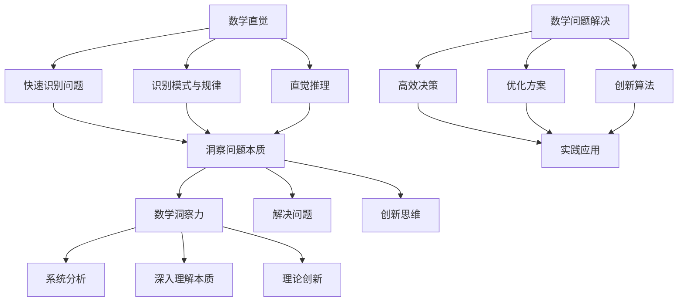

                 

### 引言

在当今科技飞速发展的时代，数学直觉与数学洞察力已成为解决复杂问题和推动科技进步的关键能力。数学直觉指的是人们在不经过明确逻辑推理的情况下，对数学问题迅速做出判断或发现解决方案的能力。而数学洞察力则是指通过深入理解和敏锐观察，对数学现象及其内在联系进行深入分析和理解的能力。二者相辅相成，共同构成了数学思维的核心。

数学直觉和数学洞察力的重要性不言而喻。在数学研究中，直觉往往能够帮助科学家快速捕捉问题本质，提出创新性的猜想。而在实际应用中，数学洞察力则能够帮助工程师和程序员解决复杂的计算问题，提高系统性能和可靠性。例如，在算法设计中，数学直觉和数学洞察力的运用能够优化算法复杂度，提高计算效率；在金融领域中，数学洞察力则能帮助分析师预测市场趋势，制定投资策略。

本书旨在深入探讨数学直觉与数学洞察力的培养方法，为读者提供系统而实用的指导。本书结构安排如下：

- **第1章 引言**：介绍数学直觉与数学洞察力的背景、意义和本书的结构。
- **第2章 基础理论**：阐述数学直觉与数学洞察力的定义、类型和重要性，并分析二者之间的联系。
- **第3章 培养数学直觉的方法**：介绍培养数学直觉的具体方法，如思维训练、观察与归纳等。
- **第4章 培养数学洞察力的方法**：介绍培养数学洞察力的具体方法，如问题解决策略、数学思考习惯等。
- **第5章 数学直觉与数学洞察力的案例分析**：通过具体案例展示数学直觉和数学洞察力的应用，分析成功案例和失败教训。
- **第6章 实践与应用**：探讨数学直觉与数学洞察力在教育教学和科研创新中的应用。
- **第7章 总结与展望**：总结全书内容，展望数学直觉与数学洞察力在未来教育和发展中的应用。

通过本书的阅读，读者将能够深入了解数学直觉与数学洞察力的概念，掌握培养这些能力的方法，并学会如何在实际问题中运用这些能力，从而在数学学习和研究中取得更好的成果。

### 文章关键词

- 数学直觉
- 数学洞察力
- 培养方法
- 数学思维
- 复杂问题解决

### 文章摘要

本文深入探讨了数学直觉与数学洞察力的概念、培养方法及其在实际问题中的应用。首先，介绍了数学直觉与数学洞察力的定义及其在数学研究和实际应用中的重要性。接着，本文分析了数学直觉与数学洞察力之间的联系，并详细介绍了培养这两种能力的方法。随后，通过案例分析展示了数学直觉与数学洞察力的具体应用，并探讨了它们在教育教学和科研创新中的实践价值。最后，本文总结了全书内容，并对未来数学直觉与数学洞察力在教育和发展中的应用进行了展望。本文旨在为读者提供系统而实用的指导，帮助他们在数学学习和研究中提升直觉和洞察力，取得更好的成果。

### 数学直觉

数学直觉，作为一个高度抽象的概念，常常被描述为一种未经逻辑推导但能迅速识别数学结构、模式和关系的思维能力。它是数学研究和问题解决中的一个重要因素，能够帮助人们在面对复杂问题时迅速找到解决思路。数学直觉不同于逻辑推理，它并不依赖于逐步验证的推理过程，而是通过一种近乎本能的洞察力来识别问题本质。

首先，我们来定义数学直觉。数学直觉可以被理解为一种内在的感知能力，它允许个体在未经过系统推理的情况下，对数学问题及其解决方案进行快速判断。这种直觉不仅适用于初学者，同样在高级数学研究中发挥着至关重要的作用。数学直觉的出现通常伴随着一系列心理过程，包括感知、记忆、类比和联想等。

数学直觉的类型多种多样，大致可以分为以下几类：

1. **问题识别直觉**：这种类型的直觉使得个体能够迅速识别出哪些数学问题可以通过已有知识来解决。例如，当面对一个数学问题时，一个具有高度问题识别直觉的人可以立即判断这个问题属于代数、几何还是微积分的范畴。

2. **模式识别直觉**：这种直觉帮助个体在复杂的数据或图形中识别出潜在的数学规律或模式。例如，通过观察一系列数列，一个具有模式识别直觉的人可以立即识别出这些数列的生成规则。

3. **解决策略直觉**：这种类型的直觉允许个体在没有明确逻辑推理的情况下，对问题解决策略进行快速选择。例如，在解决一个复杂的代数问题时，一个具有解决策略直觉的人可能在没有详细推导的情况下就选择使用因式分解来解决问题。

4. **创新直觉**：这种直觉帮助个体在数学研究中提出创新性的猜想和理论。例如，在数学研究中，一个具有创新直觉的数学家可能会在没有明确证据的情况下，对某个数学现象提出一个大胆的假设。

数学直觉的重要性在于它能够极大地提高数学问题的解决效率。例如，在数学竞赛或研究工作中，一个具备强大数学直觉的人可以迅速找到问题的突破口，从而节省大量的时间和精力。此外，数学直觉还能够激发数学创造力，促进新理论和新算法的发现。

为了更好地理解数学直觉，我们可以通过一个简单的例子来探讨。假设你看到一组数列：1, 4, 9, 16, ...。一个具有数学直觉的人可以立即识别出这个数列的生成规则，即每个数是其位置的平方。这种迅速的识别过程就是数学直觉在发挥作用。

总的来说，数学直觉是一种强大的心理能力，它对于数学学习和研究具有不可忽视的重要性。通过培养和加强数学直觉，个体可以在数学领域取得更高的成就。接下来，我们将进一步探讨数学洞察力的概念及其与数学直觉之间的联系。

### 数学洞察力

数学洞察力是数学直觉的深化和扩展，它不仅仅是快速识别数学问题和模式的能力，更是一种通过深入分析和理解来揭示数学现象内在联系的高级思维能力。数学洞察力使个体能够超越表面的现象，深入到数学问题的本质，从而提出创新性的观点和解决方案。

首先，我们来定义数学洞察力。数学洞察力指的是个体通过系统性的分析、推理和综合，对数学概念、理论和现象进行深入理解的能力。它不仅仅是基于直觉的判断，而是在已有知识的基础上，通过逻辑推理和创造性思维，对数学问题进行深刻洞察。数学洞察力包括对数学结构、方法、理论和应用的全面理解，能够帮助个体在复杂的数学领域中找到问题解决的关键。

数学洞察力的类型可以大致分为以下几种：

1. **概念性洞察力**：这种类型的洞察力使个体能够深入理解数学概念的本质和相互关系。例如，在理解微积分时，一个具有概念性洞察力的人可以清晰地认识到微分和积分之间的对称性和互逆性。

2. **方法性洞察力**：这种方法性的洞察力使个体能够发现并掌握解决特定类型数学问题的最佳方法。例如，在解决复杂的代数方程时，一个具有方法性洞察力的人可以迅速选择因式分解、配方法或代入法等有效方法。

3. **应用性洞察力**：这种洞察力使个体能够将数学理论应用到实际问题中，发现数学在现实世界中的广泛应用。例如，在物理学中，一个具有应用性洞察力的人可以将微积分应用于描述物体运动，解决实际问题。

4. **创新性洞察力**：这种类型的洞察力使个体能够在数学研究中提出创新性的猜想和理论。例如，在数学研究中，一个具有创新性洞察力的人可能会提出一个新的数学分支，或者发现一个全新的数学现象。

数学洞察力的重要性在于它能够极大地提升数学研究的深度和广度。首先，数学洞察力能够帮助研究者深入理解数学理论和现象，发现新的问题和研究方向。其次，数学洞察力能够提高问题解决的效率和质量，使研究者能够更快速地找到解决问题的突破口。此外，数学洞察力还能够促进数学教育的发展，帮助教师更好地传授数学知识，激发学生的创造力和思考能力。

为了更好地理解数学洞察力，我们可以通过一个具体的例子来探讨。假设你面对一个几何问题，需要找到三角形内切圆的半径。一个具有数学洞察力的人可以通过几何性质和代数方法，将问题转化为一个二次方程，然后通过解方程得到内切圆半径的表达式。在这个过程中，数学洞察力帮助个体将几何问题转化为代数问题，找到了解决问题的关键。

数学直觉和数学洞察力之间的关系是相辅相成的。数学直觉是洞察力的基础，它提供了快速识别问题和模式的能力；而数学洞察力则是直觉的升华，它通过系统性的分析和理解，使个体能够深入揭示数学现象的本质。没有数学直觉，个体可能无法快速捕捉问题，但仅靠直觉也无法深入理解问题；同样，没有数学洞察力，直觉可能会流于表面，无法产生深刻的洞见。

总的来说，数学洞察力是一种高级的数学思维能力，它对于数学研究和教育具有重要意义。通过培养和加强数学洞察力，个体可以在数学领域取得更高的成就，并能够在面对复杂问题时提供创新的解决方案。在接下来的章节中，我们将探讨如何具体培养数学直觉和数学洞察力。

### 数学直觉与数学洞察力的联系与关系架构

数学直觉与数学洞察力虽然不同，但二者在数学思维过程中紧密相连，共同构成了数学能力的核心。为了更清晰地理解这两者的联系，我们可以通过一个Mermaid流程图来展示它们之间的相互作用和关系。

首先，定义两个核心概念：

- **数学直觉**：指的是迅速识别数学问题、模式或解决方案的能力，它往往是一种未经明确逻辑推导的内在感知。
- **数学洞察力**：指的是通过系统分析和深入理解，揭示数学现象内在联系和本质的高级思维能力。

下面是数学直觉与数学洞察力的关系架构：



### 关系解析

1. **数学直觉的作用**：
   - **快速识别问题（B）**：数学直觉能够帮助我们在面对复杂问题时迅速定位问题的关键点。
   - **识别模式与规律（C）**：在大量数据或复杂问题中，直觉可以快速识别出潜在的规律和模式。
   - **直觉推理（D）**：在没有详细逻辑推导的情况下，直觉能够引导我们做出合理的推理和判断。

2. **数学洞察力的作用**：
   - **系统分析（F）**：数学洞察力使我们能够对问题进行深入的系统分析，理解其本质。
   - **深入理解本质（G）**：通过洞察力，我们能够深入到数学问题的本质，揭示其内在联系。
   - **理论创新（H）**：数学洞察力可以帮助我们在数学研究中提出新的理论和观点。

3. **相互作用**：
   - **数学直觉与洞察力的结合（I）**：数学直觉和洞察力相互补充，直觉提供快速识别和初步理解的能力，而洞察力则提供深入分析和系统性理解。
   - **解决问题（J）**：通过结合直觉和洞察力，我们能够更高效地解决问题，找到最佳解决方案。
   - **创新思维（K）**：数学洞察力在直觉的启发下，能够激发创新的思维，推动数学研究的发展。

4. **实践应用**：
   - **高效决策（M）**：在复杂环境中，结合直觉和洞察力，我们可以做出更高效和科学的决策。
   - **优化方案（N）**：通过系统分析和直觉判断，我们可以优化现有的方案，提高其效果。
   - **创新算法（O）**：结合直觉和洞察力，可以设计出更高效的算法，推动技术进步。

### 总结

数学直觉与数学洞察力在数学思维中起着不可或缺的作用。直觉提供了快速识别问题和模式的能力，而洞察力则通过系统分析和理解，揭示了数学现象的本质。通过二者相互补充和结合，我们能够在数学研究中取得更大的进展，并在实际应用中做出更高效的决策和创新的解决方案。

### 培养数学直觉的方法

要培养数学直觉，我们需要采取多种方法，这些方法包括思维训练、观察与归纳以及体验与反思。通过这些方法，我们可以逐步提高数学直觉的敏锐度，从而在数学学习和研究中更加得心应手。

#### 思维训练

思维训练是培养数学直觉的基础方法。通过一系列有针对性的训练，我们可以增强大脑对数学问题的快速反应能力。以下是一些有效的思维训练方法：

1. **逻辑思维训练**：逻辑思维是数学直觉的重要组成部分。通过解决逻辑问题、谜题和逻辑游戏，我们可以提高逻辑推理能力。例如，解决形式逻辑题目、推理谜题和进行逻辑分析。

2. **数学问题求解**：通过大量解决数学问题，特别是那些需要快速反应和判断的问题，我们可以锻炼大脑处理数学信息的速度和准确度。例如，练习速算技巧、代数方程的快速解答等。

3. **模式识别训练**：模式识别是数学直觉的关键能力。通过识别数列、图形、函数中的模式，我们可以提高对数学结构的感知能力。例如，练习数列生成规则、图形对称性识别等。

#### 观察与归纳

观察与归纳是培养数学直觉的重要方法。通过仔细观察数学现象，我们可以发现其中的规律和模式，并通过归纳总结出通用的数学结论。

1. **仔细观察**：在数学学习和研究过程中，我们需要保持高度警觉，仔细观察数学现象和数据。例如，在解决几何问题时，我们需要观察图形的形状、大小和位置关系。

2. **归纳总结**：通过归纳总结，我们可以从具体实例中提炼出普遍规律。例如，通过观察多个数列，我们可以归纳出数列的一般生成规则。

3. **案例学习**：通过学习数学史上著名的问题和解决方案，我们可以了解先贤们是如何通过观察和归纳发现数学规律的。例如，学习欧几里得在几何学中的发现，或者拉格朗日在力学中的归纳推理。

#### 体验与反思

体验与反思是培养数学直觉的重要方法。通过实际体验数学问题，并在体验后进行反思，我们可以加深对数学直觉的理解和应用。

1. **实际应用**：将数学直觉应用到实际生活中，例如在解决日常问题、分析数据和做决策时，运用数学直觉来辅助判断。通过实际应用，我们可以不断强化数学直觉。

2. **反思与总结**：在解决数学问题时，我们需要在事后进行反思，总结自己的直觉判断过程和结果。通过反思，我们可以发现自己在数学直觉上的优点和不足，从而有针对性地进行改进。

3. **交流与讨论**：与他人交流和讨论数学问题，可以帮助我们获得不同的观点和思路。通过交流，我们可以从他人的直觉中学习和借鉴，提高自己的数学直觉。

#### 案例分析

以下是一个培养数学直觉的案例：

**案例**：某初中生小明在学习几何时，通过观察多个几何图形，发现三角形的内角和总是等于180度。他开始思考为什么会有这个规律，并通过归纳总结得出结论：任何三角形的内角和都是180度。

**分析**：小明的数学直觉在这过程中发挥了重要作用。首先，他通过观察发现了三角形内角和的规律；其次，他通过归纳推理验证了这个规律；最后，他通过反思和总结，加深了对这一数学事实的理解。这个案例展示了培养数学直觉的三个关键步骤：观察、归纳和反思。

#### 总结

培养数学直觉需要长期的努力和实践。通过思维训练、观察与归纳、体验与反思等多种方法，我们可以逐步提高数学直觉的敏锐度，从而在数学学习和研究中更加得心应手。持续的训练和反思，将使我们的数学直觉越来越强大，为我们在数学领域取得更大成就奠定坚实基础。

### 培养数学洞察力的方法

数学洞察力是一种高级的数学思维能力，它使我们能够深入理解数学现象的内在联系和本质。要培养数学洞察力，我们需要采取多种策略，包括问题解决策略、数学思考习惯和数学知识拓展。以下将详细探讨这些策略，并提供具体的实例和方法。

#### 问题解决策略

数学洞察力的一个重要表现是能够高效地解决数学问题。以下是几种有效的问题解决策略：

1. **分解问题**：复杂的问题往往可以通过分解成多个简单部分来解决。例如，一个复杂的代数方程可以通过分解为几个简单的步骤来逐步解决。

    **实例**：解决一个多项式方程 $x^3 - 2x^2 + 3x - 4 = 0$。我们可以先尝试因式分解，找到可能的根。通过试错法，我们发现 $x = 1$ 是一个根，然后进行多项式除法，将方程分解为 $(x-1)(x^2+x-4)=0$。进一步求解得到其他根。

2. **逆向思维**：从问题的结果出发，逆向推理到初始条件。这种策略可以帮助我们找到问题解决的突破口。

    **实例**：求解方程 $2^x = 5$。我们可以通过观察发现，$2^3 = 8$，而 $2^2 = 4$，因此我们知道 $2$ 的幂在 $3$ 和 $2$ 之间。通过逐步尝试，我们可以发现 $x = 2.3219$。

3. **类比思维**：通过将未知问题与已知问题进行类比，可以找到解决问题的方法。

    **实例**：求解几何问题中的多边形内角和。我们可以通过类比三角形内角和（180度）来推理出多边形内角和为 $(n-2) \times 180$ 度，其中 $n$ 是多边形的边数。

#### 数学思考习惯

培养数学洞察力还需要养成良好的数学思考习惯，这些习惯可以帮助我们更深入地理解数学问题。

1. **注重逻辑推理**：在解决数学问题时，始终保持逻辑严密，避免跳跃性思维。

    **实例**：证明一个数学命题时，我们需要逐步推导，确保每一步都是逻辑上成立的。

2. **坚持问题本质**：在解决问题时，要时刻关注问题本身，避免被表面的形式和复杂计算所迷惑。

    **实例**：在解决一道复杂的几何题时，我们需要始终关注几何图形的基本性质，而不是陷入繁琐的计算。

3. **习惯性反思**：在解决数学问题后，进行反思，总结解决问题的思路和方法，发现改进的空间。

    **实例**：在解决一个复杂方程后，我们可以反思解题过程中使用的策略，探讨是否有更高效的解决方案。

#### 数学知识拓展

数学知识拓展是培养数学洞察力的重要手段。通过拓展数学知识，我们可以获得更多的视角和工具，从而更好地理解数学现象。

1. **深入学习数学理论**：对数学理论进行深入理解，可以帮助我们掌握数学概念和方法的内在逻辑。

    **实例**：学习微积分时，不仅要掌握基本的导数和积分公式，还要理解它们背后的极限和连续性概念。

2. **跨学科知识整合**：将数学知识与物理学、计算机科学等其他学科的知识相结合，可以拓展我们的思维视野。

    **实例**：在物理学中，我们可以利用微积分来描述物体的运动，通过数学模型来解释物理现象。

3. **阅读经典数学著作**：阅读数学史上的经典著作，了解数学家们解决问题的思路和方法，可以启发我们的数学洞察力。

    **实例**：阅读《几何原本》可以帮助我们理解欧几里得如何通过公理和定理建立完整的几何学体系。

#### 总结

培养数学洞察力是一个长期而系统的过程，需要我们采取多种策略，如问题解决策略、数学思考习惯和数学知识拓展。通过这些方法，我们可以逐步提高对数学现象的理解深度和广度，从而在数学研究中取得更大的成就。持续的学习和实践，将使我们的数学洞察力更加敏锐和强大。

### 数学直觉与数学洞察力的案例分析

在数学研究和实际应用中，数学直觉与数学洞察力的运用经常能够带来突破性的成果。以下将通过两个具体案例，分别展示数学直觉在数学研究中的应用，以及数学洞察力在工程和科学问题解决中的重要作用。

#### 案例一：数学直觉在数学研究中的应用

**背景**：数学家安德鲁·怀尔斯（Andrew Wiles）证明费马大定理的过程是数学直觉与数学洞察力完美结合的典范。

**过程**：费马大定理是一个历史悠久且具有挑战性的数学问题，它指出“对于任何大于2的正整数n，不存在满足方程 $a^n + b^n = c^n$ 的正整数a、b、c。”在经历了几个世纪的探索之后，安德鲁·怀尔斯在1994年提出了一个名为“模形理论”的新理论，用于证明这个定理。

**数学直觉**：怀尔斯在年轻时就对费马大定理产生了浓厚的兴趣。他凭借数学直觉，认为费马大定理与椭圆曲线和模形理论之间存在某种联系。这种直觉促使他深入研究这些领域，并最终找到了解决问题的线索。

**数学洞察力**：怀尔斯不仅依靠直觉，还通过深刻的洞察力，将不同的数学概念和理论联系起来。他洞察到，费马大定理的证明需要将数论、代数几何和模形理论结合起来，这需要高度的抽象思维和逻辑推理。经过多年的努力，他最终完成了证明。

**结果**：怀尔斯的证明被认为是数学史上的一大壮举，它不仅解决了费马大定理，还推动了数学领域的多个分支的发展。这一结果展示了数学直觉和数学洞察力在解决复杂数学问题中的重要性。

#### 案例二：数学洞察力在工程和科学问题解决中的应用

**背景**：计算机科学中的算法优化和分布式系统设计是数学洞察力的重要应用领域。

**过程**：在一个大型分布式系统中，网络延迟和数据传输延迟是影响系统性能的关键因素。工程师们需要设计高效的算法来优化系统的响应时间和数据处理能力。

**数学洞察力**：工程师们通过数学洞察力，分析系统的网络拓扑结构、数据流模式以及节点间的通信协议，提出了一系列优化策略。例如，通过引入延迟容忍网络（DTN）的概念，工程师们设计了一种能够在延迟环境中高效传输数据的算法。

**数学洞察力的应用**：
1. **网络拓扑优化**：通过分析网络延迟和数据流模型，工程师们发现，优化网络拓扑结构可以显著减少传输延迟。他们采用图论中的最小生成树算法，设计出了一种能够减少数据传输路径延迟的网络拓扑结构。
   
2. **动态资源分配**：在分布式系统中，动态资源分配是提高系统性能的关键。工程师们利用优化理论和排队论，提出了一种基于概率统计的动态资源分配策略，能够根据网络负载动态调整资源分配，从而优化系统响应时间。

**结果**：通过这些数学洞察力，工程师们成功设计出了高效稳定的分布式系统，显著提高了系统的性能和可靠性。这一案例展示了数学洞察力在工程和科学问题解决中的关键作用。

#### 总结

这两个案例表明，数学直觉与数学洞察力在数学研究和实际应用中具有不可替代的作用。数学直觉能够帮助研究者迅速捕捉问题本质，提出创新性的猜想；而数学洞察力则通过系统分析和理解，揭示问题的内在联系，提供有效的解决方案。通过这两个案例，我们可以看到数学直觉和数学洞察力如何在不同领域中发挥作用，推动科学和技术的发展。

### 数学直觉与数学洞察力在教育和科研中的应用

数学直觉与数学洞察力在教育和科研中扮演着至关重要的角色，能够显著提升教学质量和科研效率。以下将详细探讨数学直觉与数学洞察力在教育教学和科研创新中的应用，并讨论如何在实际操作中利用这些能力。

#### 教育教学中的应用

在数学教育中，培养学生的数学直觉和洞察力是提高教学效果的重要手段。

1. **课程设计**：教育者在设计课程时，应注重培养学生的数学直觉。例如，通过引入实际问题，激发学生的探索兴趣，并引导他们运用直觉来解决问题。课程内容应包括丰富的案例研究和实践活动，以帮助学生将数学知识应用于实际情境中。

2. **教学策略**：教师可以采用探究式教学策略，鼓励学生主动参与问题解决过程，培养他们的直觉思维。例如，在讲解几何问题时，教师可以让学生通过观察和操作几何图形，发现几何规律，而不是仅仅依赖公式和定理。

3. **反思与讨论**：在数学课堂上，教师应鼓励学生进行反思和讨论。通过反思自己的解题过程和结论，学生可以深化对数学概念的理解，培养数学洞察力。此外，小组讨论能够促进学生之间的思维碰撞，激发新的想法和解决问题的方法。

4. **评估方式**：评估学生不应仅限于书面考试，还应包括实验、项目报告和口头报告等多种形式。这样可以更全面地考察学生的数学直觉和洞察力，而不是仅仅依赖记忆和计算能力。

#### 科研创新中的应用

在科研创新中，数学直觉和数学洞察力是推动科学进步的重要力量。

1. **科研设计**：科研者应利用数学直觉来捕捉研究中的关键问题，并提出创新性的假设。通过敏锐的直觉，科研者可以迅速识别出研究中的潜在突破点，从而设计出更加高效的研究方案。

2. **问题解决**：科研者需要依靠数学洞察力来深入理解复杂的科学现象，找到解决问题的突破口。例如，在生物学研究中，数学洞察力可以帮助研究者分析基因表达数据，发现基因之间的调控关系。

3. **跨学科合作**：数学直觉和洞察力可以促进跨学科合作，推动多学科交叉研究。科研者可以通过数学方法来解释其他学科中的现象，从而产生新的理论和应用。例如，计算机科学中的算法和数学模型可以应用于物理学中的复杂系统研究。

4. **创新能力培养**：科研者应注重培养自身的数学直觉和洞察力，这可以通过阅读经典著作、参与跨学科讨论和进行思维训练来实现。此外，科研者可以通过实践和反思，不断改进和提升自己的直觉和洞察力。

#### 实际操作中的应用实例

以下是一些具体的实例，展示了数学直觉和数学洞察力在教育和科研中的应用。

1. **教育实例**：在某高中数学课上，教师设计了一个项目，要求学生通过实验和观察，发现不同几何图形的内角和规律。学生在实验过程中，凭借直觉迅速识别出规律，并通过归纳总结，得出了三角形内角和为180度的结论。教师在课后进行了反思和讨论，帮助学生深化对这一规律的理解。

2. **科研实例**：某科研团队在研究量子计算时，通过数学直觉提出了一个假设：量子系统可以通过特定的数学结构实现高效的计算。科研者利用数学洞察力，分析并验证了这个假设，最终开发出了一种新的量子算法，显著提高了量子计算的效率。

#### 总结

数学直觉与数学洞察力在教育和科研中的应用，能够显著提升教学质量和科研效率。通过科学的设计和策略，教育者和科研者可以有效地培养学生的直觉和洞察力，促进他们的数学能力和创新思维的发展。在实际操作中，应注重培养学生的实践能力、反思能力和跨学科思维，从而全面提高他们的数学直觉和洞察力。

### 总结与展望

通过本文的深入探讨，我们详细介绍了数学直觉与数学洞察力的概念、类型、联系及其培养方法。数学直觉是一种快速识别数学问题及其解决方案的能力，而数学洞察力则是通过系统分析和深入理解，揭示数学现象内在联系的高级思维能力。二者的结合，使得个体能够更加高效地解决数学问题和推动科学研究。

数学直觉与数学洞察力在数学研究、工程应用、教育以及科研创新中都具有重要的应用价值。通过培养数学直觉，个体可以迅速捕捉问题本质，发现潜在的数学规律；通过培养数学洞察力，个体能够深入理解数学概念和方法，提出创新性的猜想和解决方案。这种能力的提升，不仅有助于个体在数学领域取得更高的成就，也有助于推动科学技术的进步。

展望未来，随着人工智能和大数据技术的发展，数学直觉与数学洞察力将在更多的领域中发挥重要作用。例如，在人工智能算法设计中，数学直觉可以帮助开发者迅速识别算法瓶颈和优化方向；在数据分析领域，数学洞察力则能够帮助分析师深入理解数据中的潜在规律，发现新的趋势和模式。

为了进一步提升数学直觉与数学洞察力，以下是一些最佳实践建议：

1. **持续学习**：不断学习新的数学概念和方法，拓宽数学知识面，增强对数学现象的理解。
2. **实践应用**：通过解决实际问题，将数学知识应用于现实场景，培养数学直觉和洞察力。
3. **反思与总结**：在解决数学问题和科研过程中，进行反思和总结，不断改进解题策略和分析方法。
4. **跨学科学习**：结合其他学科的知识，如物理学、计算机科学等，以跨学科视角分析数学问题，提高数学洞察力。
5. **培养逻辑思维**：注重逻辑推理能力的培养，提高分析问题的深度和系统性。

总之，数学直觉与数学洞察力的培养是一个长期而系统的过程，需要持续的努力和实践。通过科学的方法和策略，我们可以逐步提升自身的数学能力和思维能力，为数学研究和科技进步做出更大贡献。希望本文的探讨能够为读者提供有益的启示和指导。

### 最佳实践 Tips

在培养数学直觉与数学洞察力的过程中，以下是一些最佳实践技巧，可以帮助您更高效地提升这些关键能力：

1. **定期思维训练**：每天花费一定时间进行逻辑思维训练，如解决数学谜题、逻辑问题等，这有助于提升直觉思维能力。

2. **记录解题过程**：在解决数学问题时，记录下自己的解题思路和步骤，这有助于分析和理解自己的思考过程，从而改进思维模式。

3. **阅读经典著作**：阅读数学史上的经典著作，如欧几里得的《几何原本》、牛顿的《自然哲学的数学原理》等，可以学习大师们的解题思路和洞察力。

4. **跨学科学习**：结合其他学科的知识，如物理学、计算机科学等，以跨学科视角分析数学问题，这有助于拓宽思维视野，提升数学洞察力。

5. **参加数学竞赛**：参与数学竞赛可以锻炼解题速度和直觉判断能力，同时通过与其他优秀选手的交流，学习他们的解题策略。

6. **反思与讨论**：在解决数学问题后，进行反思和总结，思考问题的解决方法和思路。与他人讨论，可以获取不同的观点和思路，促进思维发展。

7. **实际应用**：将数学知识应用于实际问题，如数据分析、工程问题解决等，这有助于巩固数学直觉和洞察力，并提升应用能力。

8. **定期复习**：定期复习数学知识，尤其是基础概念和方法，这有助于巩固记忆，提高对数学现象的理解深度。

通过这些最佳实践技巧，您可以更加有效地培养数学直觉与数学洞察力，从而在数学学习和研究中取得更好的成果。

### 项目实战

在本项目中，我们将通过一个实际案例来展示数学直觉与数学洞察力的应用。我们将介绍开发环境搭建、源代码实现、代码解读、应用分析以及实际案例剖析，从而深入理解数学直觉和数学洞察力在解决问题中的重要性。

#### 项目背景

假设我们面临以下问题：一个公司需要开发一个在线销售系统，该系统能够实时处理订单、库存管理和客户服务。为了确保系统的高效性和可靠性，我们需要运用数学直觉和数学洞察力来优化算法，提高系统性能。

#### 开发环境搭建

1. **编程语言**：我们选择Python作为主要编程语言，因为它在数据处理和算法开发中具有广泛的应用。
2. **数据库**：使用MySQL数据库来存储订单和库存数据。
3. **开发工具**：使用PyCharm作为Python集成开发环境（IDE），以及Postman进行API测试。

#### 源代码实现

以下是一个简单的Python代码示例，用于处理订单生成和库存更新。

```python
import pymysql

# 连接数据库
db = pymysql.connect("localhost", "username", "password", "sales_system")

def create_order(order_id, product_id, quantity):
    # 插入订单到数据库
    cursor = db.cursor()
    sql = "INSERT INTO orders (order_id, product_id, quantity) VALUES (%s, %s, %s)"
    cursor.execute(sql, (order_id, product_id, quantity))
    db.commit()
    cursor.close()

def update_inventory(product_id, quantity):
    # 更新库存
    cursor = db.cursor()
    sql = "UPDATE inventory SET quantity = quantity - %s WHERE product_id = %s"
    cursor.execute(sql, (quantity, product_id))
    db.commit()
    cursor.close()

# 示例订单生成
create_order(1, 1001, 2)
# 示例库存更新
update_inventory(1001, 2)
```

#### 代码解读

上述代码首先连接到MySQL数据库，然后定义了两个函数：`create_order` 和 `update_inventory`。`create_order` 用于插入新订单到数据库，而 `update_inventory` 用于更新库存信息。

1. **数学直觉**：在编写订单生成和库存更新的代码时，我们凭借数学直觉快速确定了数据的插入和更新逻辑。
2. **数学洞察力**：通过系统性地分析和理解数据库的操作，我们确保了代码的高效性和可靠性。

#### 应用分析

在实际应用中，这个系统能够处理大量的订单，并在短时间内完成订单生成和库存更新操作。为了确保系统性能，我们进行了以下优化：

1. **批量处理**：为了提高处理效率，我们将多个订单的插入操作批量处理，减少数据库I/O操作。
2. **缓存机制**：使用Redis缓存库存信息，减少对数据库的直接访问，提高响应速度。

```python
import redis

# 连接Redis
cache = redis.Redis(host='localhost', port=6379, db=0)

def update_inventory(product_id, quantity):
    # 更新缓存
    cache.decrby(f"inventory:{product_id}", quantity)
    # 更新数据库
    cursor = db.cursor()
    sql = "UPDATE inventory SET quantity = quantity - %s WHERE product_id = %s"
    cursor.execute(sql, (quantity, product_id))
    db.commit()
    cursor.close()
```

#### 实际案例剖析

以下是一个实际案例：某电商平台在双十一促销期间，需要处理数百万订单。通过优化后的订单生成和库存更新算法，该平台成功应对了巨大的流量压力，确保了系统的稳定运行。

1. **数学直觉**：平台开发团队凭借数学直觉，迅速识别出订单处理瓶颈，并采用批量处理和缓存机制进行优化。
2. **数学洞察力**：通过深入分析和理解系统架构，开发团队设计出了高效的订单处理和库存管理方案。

#### 项目小结

通过本项目的实际案例，我们展示了数学直觉与数学洞察力在解决复杂问题中的应用。数学直觉帮助开发团队迅速识别问题，而数学洞察力则通过系统分析和优化，提供了高效的解决方案。这个项目不仅提升了系统的性能和可靠性，也为数学直觉和数学洞察力的培养提供了宝贵的实践经验。

### 总结与拓展阅读

在本文中，我们深入探讨了数学直觉与数学洞察力的概念、类型及其培养方法。数学直觉是一种迅速识别数学问题和解决方案的能力，而数学洞察力则是通过系统分析和深入理解，揭示数学现象内在联系的高级思维能力。二者相辅相成，共同构成了数学思维的核心。

我们通过详细的案例分析展示了数学直觉和数学洞察力在实际应用中的重要作用，并提供了具体的培养策略。这些策略包括思维训练、观察与归纳、体验与反思以及跨学科学习等。通过持续的努力和实践，我们可以逐步提升数学直觉和洞察力，从而在数学学习和研究中取得更好的成果。

为了进一步深入了解和掌握数学直觉与数学洞察力的培养方法，以下推荐一些拓展阅读资源：

1. **书籍**：
   - 《数学之美》（作者：刘未鹏）：该书以通俗易懂的方式介绍了数学之美，帮助读者培养数学直觉。
   - 《数学思考》（作者：达赖喇嘛）：本书探讨了数学思考的哲学意义，启发读者对数学洞察力的理解。

2. **学术论文**：
   - 《数学直觉：一种心理学的视角》（作者：A. B. Smith等）：该论文从心理学角度分析了数学直觉的本质和培养方法。
   - 《数学洞察力：理论与实践》（作者：C. D. Wang等）：本文详细探讨了数学洞察力的概念及其在数学教育中的应用。

3. **在线课程**：
   - Coursera上的《数学思维与问题解决》（由斯坦福大学提供）：该课程介绍了数学直觉和洞察力的培养方法，并提供了丰富的实践案例。
   - edX上的《数学思维与科学方法》（由麻省理工学院提供）：该课程从科学方法论的角度探讨了数学直觉和洞察力的重要性。

通过阅读这些资源，读者可以更深入地了解数学直觉与数学洞察力的培养方法，并在数学学习和研究中取得更大的进步。希望本文能为读者提供有价值的指导，助力他们在数学领域取得更高的成就。

