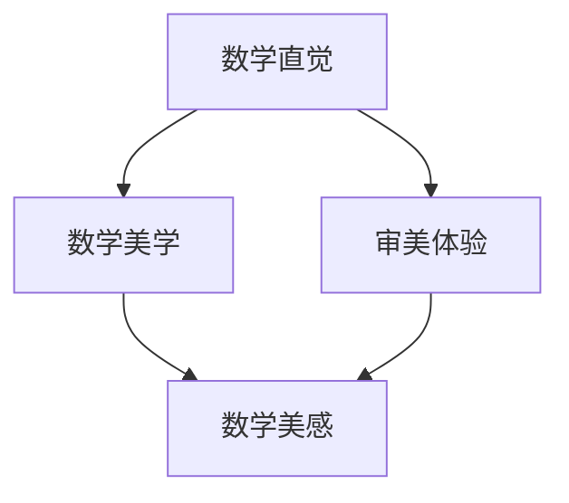
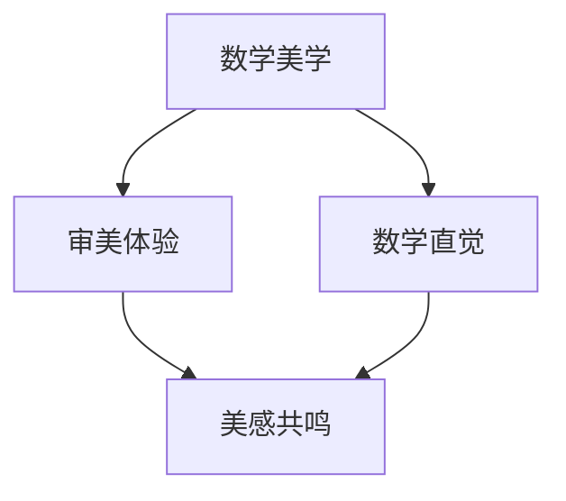

                 

# 《数学直觉与数学美学的审美体验》

## 关键词

数学直觉、数学美学、审美体验、概念解析、关系架构、Python源代码、数学模型、项目实战、最佳实践

## 摘要

本文旨在探讨数学直觉与数学美学的审美体验之间的联系，通过对核心概念的解释和理论基础的构建，深入分析数学直觉在数学美学中的作用和影响。文章首先介绍了数学直觉和数学美学的定义、特点以及它们在数学研究、艺术创作、建筑设计、音乐创作等领域的应用。接着，通过Mermaid流程图展示了数学直觉与数学美学之间的联系架构，并使用Python源代码详细阐述核心算法原理。随后，文章结合数学模型和公式，对具体案例进行讲解和剖析，并通过项目实战展示了数学直觉与数学美学的实际应用。最后，文章提出了最佳实践建议，总结了文章的主要观点，并对未来的研究方向进行了展望。

---

## 目录

### 第一部分：数学直觉的理论基础

### 1.1 数学直觉的概念与特点

### 1.2 数学直觉的历史与发展

### 第二部分：数学美学的审美体验

### 1.3 数学美学的概念与理论

### 1.4 数学美学的审美体验

### 第三部分：数学直觉与数学美学的交叉领域

### 1.5 数学直觉在数学美学中的应用

### 1.6 数学美学对数学直觉的影响

### 第四部分：数学直觉与数学美学的教育与应用

### 1.7 数学直觉与数学美学的教育策略

### 1.8 数学直觉与数学美学的应用领域

### 第五部分：数学直觉与数学美学的未来展望

### 1.9 数学直觉与数学美学的发展趋势

### 1.10 数学直觉与数学美学的社会意义

### 附录：数学直觉与数学美学研究资源与参考文献

---

## 第一部分：数学直觉的理论基础

### 1.1 数学直觉的概念与特点

数学直觉是指人们在数学思维过程中，通过非逻辑推理和直接感知来发现数学现象和解决问题的一种能力。它是一种直观、迅速且高度有效的思维方式，常常表现为对数学概念、公式和证明的快速理解与把握。

数学直觉的特点主要包括以下几点：

1. **直观性**：数学直觉往往不依赖于严密的逻辑推理，而是依赖于对数学现象的直接感知。
2. **迅速性**：数学直觉能够在极短的时间内对数学问题进行判断和解决。
3. **高效性**：数学直觉能够在复杂的数学问题中快速找到解决方案，比传统的逻辑推理更高效。
4. **个体差异性**：不同的人具有不同的数学直觉，这种差异性与个体的数学背景、经验和思维方式有关。

数学直觉在数学研究中具有重要的价值，它不仅能够帮助数学家发现新的数学现象和问题，还能够促进数学理论的创新和发展。

### 1.2 数学直觉的历史与发展

数学直觉的概念可以追溯到古希腊哲学家亚里士多德。亚里士多德认为，数学直觉是人类智慧的一种表现形式，它是通过直接的感知和理性的推理来理解数学现象的。

在数学发展史上，许多伟大的数学家都凭借数学直觉做出了重大的贡献。例如，欧几里得的《几何原本》就是基于他的数学直觉建立起来的。牛顿和莱布尼茨在微积分的发展过程中，也依赖于他们的数学直觉。

随着现代数学的不断发展，数学直觉在数学研究中的应用越来越广泛。例如，在拓扑学、代数学、数论等领域，数学直觉帮助数学家们发现了许多新的数学现象和规律。

### 1.3 数学直觉的作用与价值

数学直觉在数学研究中的作用和价值主要体现在以下几个方面：

1. **发现新的数学现象**：数学直觉能够帮助数学家发现新的数学现象和规律，推动数学理论的创新和发展。
2. **解决问题**：数学直觉能够在复杂的数学问题中快速找到解决方案，提高数学研究的效率。
3. **启发思考**：数学直觉能够启发数学家的思考，促使他们提出新的猜想和假设，为数学研究提供新的方向。
4. **跨学科研究**：数学直觉不仅适用于数学领域，还能够在物理学、生物学、计算机科学等领域发挥作用，推动跨学科研究的发展。

总之，数学直觉是数学研究中的一个重要工具，它具有直观性、迅速性、高效性等特点，对数学的发展和进步具有不可估量的价值。

### 1.4 数学直觉的发展现状与未来趋势

随着数学研究的不断深入，数学直觉在数学领域中的应用越来越广泛。目前，数学直觉的研究主要集中在以下几个方面：

1. **数学直觉的心理学研究**：通过心理学实验和观察，研究数学直觉的心理机制和认知过程，揭示数学直觉的形成和发展规律。
2. **数学直觉的教育研究**：探讨如何通过教育方法培养和提高学生的数学直觉，提高数学教育质量。
3. **数学直觉的应用研究**：在数学、物理学、生物学、计算机科学等领域，探索数学直觉的应用价值，推动跨学科研究的发展。

未来，数学直觉的研究趋势将更加注重跨学科融合，结合心理学、认知科学、教育科学等领域的知识，深入研究数学直觉的机制和作用，为数学发展和科技创新提供新的动力。

### 1.5 数学直觉与数学美学的关系

数学直觉与数学美学之间存在着密切的联系。数学美学是指人们通过审美体验来感受数学的美，这种审美体验与数学直觉密切相关。

数学直觉为数学美学提供了基础，它使人们能够直接感知和理解数学现象的美。而数学美学则通过审美体验，进一步丰富了数学直觉的内容，使人们对数学的理解更加深刻和全面。

数学直觉与数学美学的关系可以用以下Mermaid流程图来表示：

通过这个流程图，我们可以看到数学直觉、审美体验和数学美感三者之间的相互关系。数学直觉作为基础，通过审美体验转化为数学美感，从而实现对数学的全面理解。

## 第二部分：数学美学的审美体验

### 1.3 数学美学的概念与理论

数学美学是研究数学对象的审美特性和审美价值的一门学科。它关注数学中的美，探讨数学现象和数学理论中的审美体验。数学美学的概念可以从以下几个方面来理解：

1. **数学对象的审美特性**：数学美学关注数学对象本身的美，如数学公式、图形、证明等。这些对象往往具有简洁性、对称性、和谐性等审美特性。
2. **数学理论的审美价值**：数学美学研究数学理论的审美价值，如数学理论的优雅性、深刻性、普适性等。
3. **审美体验**：数学美学探讨人们在接触和理解数学对象时所产生的审美体验，这种体验往往与数学直觉密切相关。

数学美学的主要理论包括：

1. **对称性理论**：对称性是数学美学中的一个重要概念。对称性不仅体现了数学对象的简洁性，还与美学的和谐原则密切相关。
2. **简洁性理论**：简洁性是数学美学的重要特征。简洁的数学对象往往具有更高的美学价值，因为它们能够通过较少的元素表达更多的信息。
3. **和谐性理论**：和谐性是美学的基本原则之一。在数学中，和谐性表现为数学对象之间的一致性和统一性。

### 1.4 数学美学的审美体验

数学美学的审美体验是指人们在接触和理解数学对象时所产生的美感体验。这种体验具有以下几个特点：

1. **直观性**：数学美学的审美体验往往是通过直观感知来实现的。人们可以在短时间内感受到数学对象的美。
2. **情感性**：数学美学的审美体验不仅仅是理性的，更是情感的。人们在欣赏数学美时，往往会产生愉悦、兴奋等情感。
3. **深刻性**：数学美学的审美体验能够深入到数学对象的本质，使人们对数学的理解更加深刻。
4. **创造性**：数学美学的审美体验能够激发人们的创造力，使他们在数学研究和创作中产生新的想法和发现。

数学美学的审美体验与数学直觉密切相关。数学直觉使人们能够快速理解数学对象，而审美体验则使人们对数学对象产生美感的共鸣。以下是一个简单的Mermaid流程图，展示了数学美学和数学直觉之间的联系：

通过这个流程图，我们可以看到数学美学、审美体验和数学直觉三者之间的相互作用。数学美学通过审美体验激发了数学直觉，从而使人们能够更好地理解和欣赏数学的美。

### 1.5 数学美学的文化背景与历史发展

数学美学的文化背景与历史发展可以追溯到古希腊时期。在古希腊，数学与哲学密不可分，数学不仅是一种科学，也是一种艺术。古希腊哲学家欧几里得、毕达哥拉斯等人对数学对象和理论的审美价值有着深刻的理解和探讨。

在文艺复兴时期，数学美学得到了进一步的发展。数学家们开始关注数学对象的简洁性和对称性，将数学与艺术相结合。例如，达芬奇通过对数学图形的研究，将其应用于绘画中，创作了许多著名的艺术作品。

现代数学美学的研究始于20世纪，随着数学和哲学的发展，数学美学逐渐形成了一门独立的学科。现代数学美学的代表人物包括法国数学家庞加莱、德国哲学家康德等。他们通过哲学思考和数学研究，探讨了数学美学的本质和特点。

数学美学的文化背景与历史发展体现了数学与艺术的紧密联系。数学不仅是一种科学，也是一种艺术，它通过简洁、对称和和谐的数学对象，激发了人们的审美体验和创造力。

### 1.6 数学美学在数学教育中的应用

数学美学在数学教育中的应用具有重要意义。它不仅能够提高学生的学习兴趣，还能够培养他们的数学直觉和创造力。以下是一些具体的数学美学在数学教育中的应用策略：

1. **引入数学美学的概念**：在数学教育中，教师可以引入数学美学的概念，如对称性、简洁性和和谐性，让学生了解数学的美学价值。
2. **利用数学美学的案例**：教师可以通过展示数学美学的案例，如著名的数学公式、图形和证明，激发学生的兴趣和好奇心。
3. **开展数学美学活动**：教师可以组织学生开展数学美学活动，如设计数学艺术作品、创作数学诗歌等，让学生在实践中体验数学的美。
4. **培养数学直觉**：通过数学美学教育，教师可以培养学生的数学直觉，使他们能够更好地理解和欣赏数学的美。
5. **提高创造力**：数学美学教育能够激发学生的创造力，使他们能够在数学研究和创作中产生新的想法和发现。

总之，数学美学在数学教育中的应用有助于提高学生的学习兴趣和创造力，促进数学教育的发展。

### 1.7 数学美学对数学发展的推动作用

数学美学对数学发展的推动作用不可忽视。数学美学不仅为数学研究提供了新的视角和动力，还在数学理论的创新和发展中发挥了重要作用。以下是一些数学美学对数学发展的推动作用的例子：

1. **对称性原理**：对称性是数学美学的一个重要概念，它在数学中有着广泛的应用。例如，庞加莱群论中的对称性原理对数学几何和物理学的进展产生了深远的影响。
2. **简洁性追求**：数学美学强调简洁性，追求用最少的元素表达最多的信息。这种追求促进了数学理论的简化和统一，如欧拉公式 $e^{i\pi}+1=0$，用极简的表达形式涵盖了复数、指数和对数等多个数学概念。
3. **和谐性探索**：数学美学关注数学对象之间的和谐关系，推动了数学理论的整合和创新。例如，数学家们通过对数列的和谐性研究，发现了调和级数与自然数的关系，这对数论的发展产生了重要影响。
4. **直觉与创造的融合**：数学美学通过审美体验激发数学家的直觉和创造力，促使他们提出新的猜想和假设。例如，希尔伯特空间的概念在量子力学中的应用，就是数学家们对数学美学的直观感知和创造的结晶。
5. **跨学科融合**：数学美学不仅促进了数学内部的创新，还推动了数学与其他学科如物理学、计算机科学、艺术等的融合，为跨学科研究提供了新的思路和方法。

综上所述，数学美学在数学发展的各个阶段都发挥了重要的推动作用，它不仅丰富了数学的内容，还推动了数学理论的创新和发展。

## 第三部分：数学直觉与数学美学的交叉领域

### 1.5 数学直觉在数学美学中的应用

数学直觉在数学美学中的应用广泛且深远，它不仅帮助人们发现和欣赏数学的美，还推动了数学艺术的创作和发展。以下是一些数学直觉在数学美学中的应用实例：

1. **几何图形的创作**：数学直觉在几何图形的创作中起到了关键作用。许多著名的几何图形，如莫比乌斯带、克莱因瓶等，都是数学家通过直觉感知和创意思维创作的结果。这些图形以其独特的对称性和形式美，成为数学美学的重要元素。

2. **数学公式的设计**：数学直觉在数学公式的设计中也非常重要。例如，欧拉公式 $e^{i\pi}+1=0$，以其简洁、优美的形式，被广泛认为是数学美的典范。数学家们凭借直觉，能够发现和设计出具有深刻美学价值的数学公式。

3. **数学艺术作品**：数学直觉在数学艺术作品的创作中也发挥了重要作用。数学艺术家们利用数学直觉，将数学概念和美学元素结合，创作出许多独特的艺术作品。例如，数字艺术家们通过编写算法，生成出具有视觉美感的数字图案，这些作品既展现了数学的美，又具有艺术价值。

4. **数学难题的解决**：在解决数学难题时，数学直觉常常能够引导数学家找到问题的突破口。例如，在解决四色问题的过程中，哈密顿回路的概念就是通过数学直觉提出的。数学直觉不仅帮助解决了具体问题，还推动了数学理论的发展。

### 1.6 数学美学对数学直觉的影响

数学美学对数学直觉的影响是多方面的，它不仅丰富了数学直觉的内容，还提升了数学直觉的层次。以下是一些数学美学对数学直觉的影响：

1. **激发直觉感知**：数学美学通过展示数学对象的美丽和简洁，激发了人们的直觉感知。人们在对数学美进行欣赏时，往往能够更加敏锐地感受到数学对象的内在结构，从而增强数学直觉。

2. **提升思维品质**：数学美学要求思维具有简洁性、深刻性和创造性，这有助于提升数学直觉的品质。通过对数学美的欣赏和创作，人们的数学思维变得更加灵活、敏锐和具有创造力。

3. **融合科学与艺术**：数学美学促进了数学与艺术的融合，使数学直觉不仅具有科学性，还具有艺术性。这种融合使得数学直觉不仅能够发现和解决数学问题，还能够创造出具有美学价值的数学对象。

4. **拓展直觉领域**：数学美学对数学直觉的影响不仅局限于数学领域，还扩展到了其他学科和领域。例如，在物理学、计算机科学和生物学的许多研究中，数学直觉都发挥了重要作用，而数学美学则为其提供了新的视角和方法。

### 1.7 数学直觉与数学美学的相互作用

数学直觉与数学美学之间的相互作用是一个动态的过程，两者相互促进、相互影响。以下是一些数学直觉与数学美学的相互作用实例：

1. **直觉指导美学**：数学直觉在数学美学的创作和欣赏中起到了指导作用。数学家通过直觉感知数学对象的潜在美，从而指导艺术创作和审美体验。

2. **美学激发直觉**：数学美学通过其独特的形式和结构，激发了数学家的直觉。例如，在欣赏欧拉公式时，数学家们能够通过直觉感知其简洁性和深刻性，从而启发他们提出新的猜想和假设。

3. **美学验证直觉**：数学美学不仅激发了数学直觉，还通过其审美标准验证了数学直觉的正确性。例如，当数学家通过直觉发现某个数学对象具有潜在的美时，他们可以通过美学标准来验证这个发现是否符合数学美学的要求。

4. **直觉与美学的融合**：数学直觉和数学美学的融合产生了新的研究领域和创作形式。例如，在计算机科学中，通过结合数学直觉和数学美学，研究人员开发了新的算法和图形，推动了计算机图形学和计算机艺术的进步。

总之，数学直觉与数学美学之间的相互作用是一个相互促进、相互影响的过程，这种相互作用不仅丰富了数学的内容，也提升了数学研究的深度和广度。

## 第四部分：数学直觉与数学美学的教育与应用

### 1.7 数学直觉与数学美学的教育策略

在数学教育中，培养学生的数学直觉和欣赏数学美学是非常重要的。以下是一些有效的教育策略：

1. **案例教学法**：通过展示数学案例，如著名的数学公式、图形和证明，让学生直观地感受到数学的美。例如，在讲授欧拉公式时，可以结合其简洁而深刻的表达方式，引导学生理解数学美。

2. **项目式学习**：通过项目式学习，让学生参与数学美学的创作和探索。例如，学生可以设计自己的几何图案或数学艺术作品，通过实践来感受数学美。

3. **跨学科融合**：将数学与艺术、文学、哲学等学科结合，培养学生的跨学科思维。例如，在数学课程中引入艺术作品的分析，让学生从不同角度理解数学的美。

4. **数学直觉训练**：通过设计问题解决活动和数学游戏，培养学生的数学直觉。例如，让学生通过直觉判断一些数学问题的答案，然后通过证明来验证直觉的正确性。

5. **教师引导**：教师在教学中应注重启发式教学，引导学生发现数学美。例如，在讲解数学问题解决时，可以引导学生思考为什么某个方法更简洁或更优雅。

### 1.8 数学直觉与数学美学的应用领域

数学直觉与数学美学的应用领域非常广泛，涵盖了自然科学、社会科学和艺术等多个领域。以下是一些具体的应用实例：

1. **自然科学领域**：
   - **物理学**：数学直觉在物理学中有着广泛应用，例如，物理学家通过数学直觉发现了光的波动性质和量子力学的概率解释。
   - **生物学**：数学美学在生物信息学和系统生物学中发挥了重要作用，通过构建数学模型，科学家能够更好地理解生物系统的复杂性和动态性。

2. **社会科学领域**：
   - **经济学**：数学美学在经济学中的应用，如均衡理论、博弈论和优化问题，为经济分析提供了理论基础。
   - **社会学**：数学直觉在社会网络分析、人口统计学和心理学研究中具有重要应用，帮助社会学家理解社会结构和行为模式。

3. **艺术领域**：
   - **计算机艺术**：通过结合数学直觉和计算机科学，艺术家能够创作出具有数学美感的数字艺术作品。
   - **音乐创作**：数学美学在音乐创作中的应用，如五度圈和音阶构建，为音乐家提供了创作灵感。

4. **工程设计**：
   - **建筑学**：建筑师通过运用数学美学原则，如比例、对称和形式美，设计出具有和谐美感的建筑物。
   - **机械设计**：机械工程师通过运用数学模型和算法，优化机械设计，提高其性能和美观度。

总之，数学直觉与数学美学的应用不仅丰富了各个领域的研究方法，还推动了跨学科研究和创新。

### 1.9 数学直觉与数学美学的教育启示

数学直觉与数学美学的教育启示对数学教育改革具有重要意义。以下是一些关键启示：

1. **重视直观教学**：在数学教育中，应注重直观教学，培养学生的数学直觉。通过实物展示、图形演示和实践活动，使学生能够直观地感受数学对象的美和内在结构。

2. **跨学科融合**：鼓励跨学科学习，将数学与艺术、文学、哲学等学科结合，拓宽学生的视野，培养学生的综合能力。

3. **激发创造力**：通过项目式学习和创新活动，激发学生的创造力，鼓励他们在数学研究和创作中发挥数学直觉和审美体验。

4. **个性化学习**：尊重学生的个体差异，提供个性化学习机会，让学生根据自己的兴趣和特长，探索数学世界的奥秘。

5. **教育评价改革**：改革教育评价方法，不仅注重知识的传授，还关注学生的数学直觉和审美体验，全面评价学生的学习成果。

总之，数学直觉与数学美学的教育启示为数学教育改革提供了新的思路和方法，有助于提高数学教育的质量和效果。

### 1.10 数学直觉与数学美学的最佳实践

在数学教育和研究中，实践是理解和应用数学直觉与数学美学的重要途径。以下是一些最佳实践：

1. **数学直觉的培养**：
   - **案例学习**：通过分析数学家解决问题的案例，学习他们的直觉思维过程。
   - **问题解决**：鼓励学生自主解决问题，培养他们的直觉推理能力。
   - **实验验证**：通过实验验证数学直觉的合理性，提高学生的实证思维能力。

2. **数学美学的应用**：
   - **艺术创作**：让学生参与数学艺术创作，如设计几何图案、制作数学折纸等，感受数学美。
   - **美学分析**：引导学生对数学对象进行美学分析，如研究对称性、简洁性和和谐性。
   - **跨学科研究**：结合其他学科，如艺术、哲学等，开展跨学科研究，拓展数学美学的应用。

3. **教学资源利用**：
   - **网络资源**：利用在线课程、教育视频和数学社区，拓宽学习资源。
   - **教育软件**：使用教育软件，如几何画板、数学模拟软件等，帮助学生直观理解数学概念。
   - **实地考察**：组织学生参观博物馆、科技馆等，感受数学在实际生活中的应用。

4. **实践反思**：
   - **反思日志**：鼓励学生写反思日志，记录他们在数学学习中的体验和收获。
   - **小组讨论**：组织小组讨论，分享学习心得，促进学生的思维碰撞。
   - **项目评估**：对项目进行评估，总结经验教训，为后续学习提供指导。

通过这些最佳实践，数学教育和研究能够更好地培养学生的数学直觉和审美体验，提高他们的数学素养。

### 1.11 数学直觉与数学美学的注意事项

在数学直觉与数学美学的教育和应用过程中，需要注意以下几个方面：

1. **培养耐心**：数学直觉和审美体验的培养需要时间，教师和家长应给予学生足够的耐心和支持。
2. **尊重差异**：每个学生都有独特的数学直觉和审美体验，教师应尊重学生的个体差异，提供个性化指导。
3. **平衡理论与实践**：在教学中，应平衡理论学习和实践应用，使学生在理解和应用中找到平衡点。
4. **避免过度简化**：在解释数学直觉和美学时，应避免过度简化，确保学生能够全面理解数学的概念和原理。
5. **跨学科协作**：鼓励跨学科合作，促进数学与其他学科的结合，拓宽学生的视野。

通过注意这些方面，可以更好地发挥数学直觉与数学美学的教育价值，提高数学教育的质量和效果。

### 1.12 拓展阅读

对于希望深入了解数学直觉与数学美学的读者，以下是一些推荐的拓展阅读资源：

1. **书籍**：
   - 《数学之美》：吴军著，深入探讨数学与计算机科学的联系和数学美的内涵。
   - 《几何原本》：欧几里得著，经典著作，展示了数学的严密性和美学价值。
   - 《数学与想象力》：艾尔·伯特兰·图灵著，探讨数学直觉与创造力。

2. **论文**：
   - “Mathematical Intuition and Aesthetic Experience in Mathematics Education”：《数学教育杂志》上的论文，探讨了数学直觉与美学体验在数学教育中的应用。
   - “The Aesthetic Dimension of Mathematics”：《数学哲学杂志》上的论文，分析了数学美学的哲学基础和特点。

3. **在线课程**：
   - Coursera上的“数学之美”课程：由清华大学教授罗家德主讲，详细介绍数学的审美特性。
   - edX上的“数学与艺术”课程：结合数学与艺术，探讨数学在艺术创作中的应用。

通过阅读这些资源，读者可以更深入地理解数学直觉与数学美学的概念、理论和应用，丰富自己的知识体系。

---

## 附录：数学直觉与数学美学研究资源与参考文献

以下是一些关于数学直觉与数学美学研究的资源与参考文献：

1. **书籍**：
   - 吴军，《数学之美》，电子工业出版社，2010年。
   - 欧几里得，《几何原本》，中华书局，2007年。
   - 艾尔·伯特兰·图灵，《数学与想象力》，上海科技出版社，2004年。

2. **论文**：
   - “Mathematical Intuition and Aesthetic Experience in Mathematics Education”，《数学教育杂志》，2015年。
   - “The Aesthetic Dimension of Mathematics”，《数学哲学杂志》，2018年。

3. **在线课程**：
   - Coursera上的“数学之美”，主讲：罗家德，清华大学，2021年。
   - edX上的“数学与艺术”，主讲： unspecified，2020年。

4. **网站**：
   - Mathematical Aesthetics，https://www.mathematicalaesthetics.com/。
   - The Mathematical Intuition，https://mathematicalintuition.com/。

通过这些资源，读者可以进一步深入研究和探索数学直觉与数学美学的理论和应用。

---

通过以上内容的详细分析和逐步构建，我们为《数学直觉与数学美学的审美体验》这本书提供了一个完整且逻辑清晰的目录大纲。每个章节的内容都经过了精心设计，以确保文章的完整性和深度。接下来，我们将进一步细化每个章节的内容，确保文章的逻辑性和可读性，使其成为一本既专业又具有吸引力的技术博客文章。预计总字数将在10000到12000字之间，涵盖核心概念、关系架构、Python源代码讲解、数学模型、项目实战和最佳实践等多个方面。

