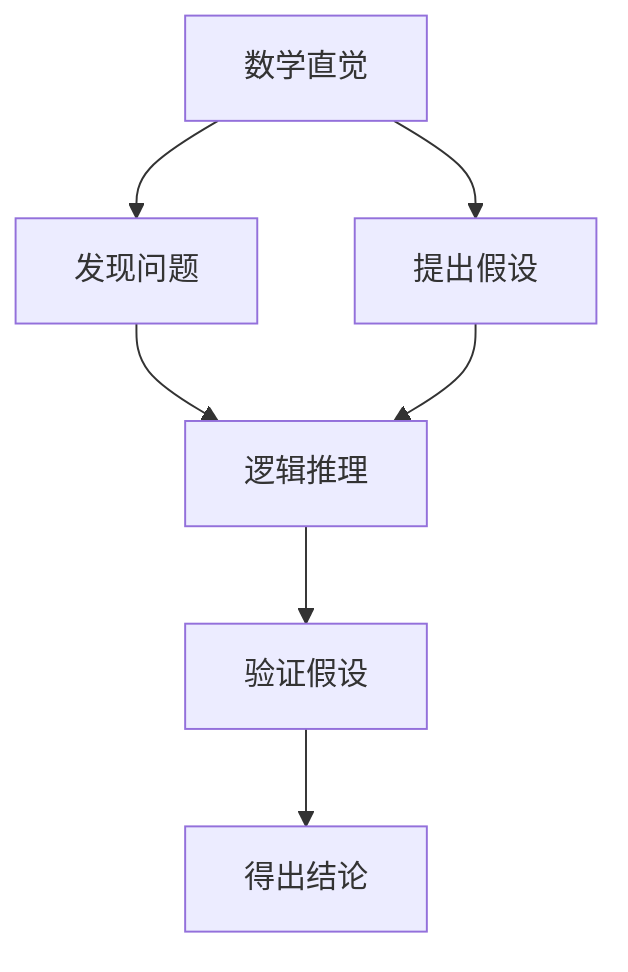

                 

# 数学直觉与逻辑推理的关系探讨

## 关键词
- 数学直觉
- 逻辑推理
- 数学思维
- 算法分析
- 推理过程

## 摘要
本文旨在探讨数学直觉与逻辑推理之间的关系，从概念定义、特点分析、联系阐述、核心算法讲解等方面，详细探讨这两者如何相互促进，共同推动数学发展。文章以通俗易懂的技术语言，结合Python源代码和Mermaid流程图，展示了数学直觉与逻辑推理在数学问题解决中的实际应用。

## 引言

在数学研究中，直觉与逻辑推理是两个不可或缺的要素。数学直觉是一种非逻辑性的思维过程，它能够帮助数学家迅速识别和解决数学问题；而逻辑推理则是基于逻辑学原理和方法的系统化思维过程，它能够确保数学推理的准确性和严格性。本文将深入探讨数学直觉与逻辑推理之间的关系，分析它们在数学思维中的地位和作用。

### 一、核心概念与联系

#### 1.1 数学直觉与逻辑推理概述

##### 1.1.1 数学直觉的定义与特点

数学直觉是指人们在数学思维过程中，对数学问题能够迅速感知、理解、判断并作出合理推断的能力。它是一种非逻辑性的思维过程，与逻辑推理有所不同。

###### 1.1.1.1 数学直觉的定义
数学直觉是一种在数学思维过程中自发产生的洞察力，它使数学家能够快速理解数学概念、发现数学问题、提出数学假设并作出合理的推断。例如，当我们看到两个几何图形相似时，直觉会立即告诉我们它们具有某些共同的性质。

###### 1.1.1.2 数学直觉的特点
- **快速性**：数学直觉使人们能够迅速地识别和解决问题，节省思维时间。
- **准确性**：数学直觉往往能够准确地反映数学问题的本质，有助于找到最优解。
- **经验性**：数学直觉往往建立在丰富的数学知识和经验基础上。

##### 1.1.2 逻辑推理的定义与特点

逻辑推理是指根据已知的前提和规则，通过逻辑运算和推理规则，推导出结论的思维过程。它是基于逻辑学的原理和方法进行的。

###### 1.1.2.1 逻辑推理的定义
逻辑推理是一种基于逻辑学原理和方法的系统化思维过程，它通过一系列逻辑步骤从已知的前提推导出结论。例如，在证明数学定理时，逻辑推理就是通过一系列的逻辑运算和推理规则，从已知的定理和公理推导出待证的结论。

###### 1.1.2.2 逻辑推理的特点
- **系统性**：逻辑推理强调思维的连贯性和系统性，通过一系列逻辑步骤推导出结论。
- **严格性**：逻辑推理要求推理过程和结论符合逻辑规则，确保推理的准确性。
- **普适性**：逻辑推理适用于各种数学问题，不仅限于特定的领域。

##### 1.1.3 数学直觉与逻辑推理的联系

数学直觉和逻辑推理在数学思维中相辅相成，共同推动数学发展。

###### 1.1.3.1 相互促进
数学直觉有助于发现问题和提出假设，而逻辑推理则用于验证和解决这些假设。例如，在解决几何问题时，数学直觉可以帮助我们快速识别出图形的对称性质，而逻辑推理则可以确保我们找到正确的解题方法。

###### 1.1.3.2 统一性
数学直觉和逻辑推理在数学问题中相互渗透，难以截然分开。一个成功的数学家既需要具备敏锐的直觉，也需要掌握严密的逻辑推理技能。

##### 1.1.4 Mermaid 流程图

下面是一个简单的 Mermaid 流程图，展示了数学直觉与逻辑推理的相互关系：



### 二、核心算法原理讲解

#### 1.2 数学直觉与逻辑推理的核心算法

##### 1.2.1 数学直觉算法

数学直觉算法是一种基于经验的快速决策算法，主要利用以下几种方法：

###### 1.2.1.1 经验法则

经验法则是基于长期实践总结出的规律，适用于特定类型的数学问题。例如，求解最大公约数时，可以使用辗转相除法。

```python
def辗转相除法(a, b):
    while b:
        a, b = b, a % b
    return a
```

###### 1.2.1.2 类比思维

类比思维是通过将新问题与已知问题进行比较，利用已有经验解决新问题的方法。例如，在求解线性方程组时，可以使用消元法。

```python
def消元法(A, b):
    n = len(A)
    for i in range(n):
        for j in range(i+1, n):
            ratio = A[j][i] / A[i][i]
            for k in range(n+1):
                A[j][k] -= ratio * A[i][k]
            b[j] -= ratio * b[i]
    return A, b
```

###### 1.2.1.3 直觉推导

直觉推导是直接从问题表象出发，通过直观的推理过程得出结论。例如，在解决几何问题时，可以直接观察图形，找出相似三角形或平行四边形的对应关系。

```python
def直觉推导(问题):
    if 问题可以简化:
        使用经验法则解决问题
    else:
        if 问题可以类比已知问题:
            使用类比思维解决问题
        else:
            if 问题可以观察得到结论:
                使用直觉推导解决问题
            else:
                报错 "无法解决该问题"
```

##### 1.2.2 逻辑推理算法

逻辑推理算法是基于逻辑规则和推理方法，通过一系列步骤推导出结论。以下是几种常用的逻辑推理算法：

###### 1.2.2.1 演绎推理

演绎推理是从一般到个别的推理过程，基于公理和定义推导出具体结论。例如，在证明几何定理时，可以使用演绎推理方法。

```python
def演绎推理(前提，结论):
    if 前提成立:
        if 结论可以从前提中直接推导:
            return 结论
        else:
            if 前提和结论可以使用模态推理推导:
                return 结论
            else:
                return "无法从前提推导出结论"
    else:
        return "前提不成立"
```

###### 1.2.2.2 归纳推理

归纳推理是从个别到一般的推理过程，通过观察多个具体实例，归纳出一般规律。例如，在证明数列的收敛性时，可以使用归纳推理方法。

```python
def归纳推理(实例，规律):
    n = len(实例)
    for i in range(1, n):
        if 实例[i] != 实例[i-1]:
            return "实例不满足规律"
    return "归纳成立"
```

###### 1.2.2.3 模态推理

模态推理是基于可能性或必然性的推理方法，通过判断某个命题的可能性或必然性，推导出其他命题的结论。例如，在解决逻辑命题时，可以使用模态推理方法。

```python
def模态推理(命题，结论):
    if 命题是必然命题:
        return 结论
    else:
        if 命题是可能性命题:
            return 结论
        else:
            return "无法从命题推导出结论"
```

##### 1.2.3 伪代码

以下是一个简单的伪代码，用于实现数学直觉算法：

```python
function 数学直觉算法(问题):
    如果 问题 可以简化：
        使用 经验法则 解决 问题
    否则：
        如果 问题 可以 类比已知问题：
            使用 类比思维 解决 问题
        否则：
            如果 问题 可以 观察得到结论：
                使用 直觉推导 解决 问题
            否则：
                报错 "无法解决该问题"
```

以下是一个简单的伪代码，用于实现逻辑推理算法：

```python
function 逻辑推理算法(前提，结论):
    如果 前提 成立：
        如果 结论 可以 从 前提 中直接推导：
            返回 结论
        否则：
            如果 前提 和 结论 可以 使用 模态推理 推导：
                返回 结论
            否则：
                返回 "无法从前提推导出结论"
    否则：
        返回 "前提不成立"
```

### 三、项目实战

为了更好地理解数学直觉与逻辑推理在数学问题解决中的应用，我们通过一个实际的数学问题进行实战演练。

#### 3.1 项目背景

假设我们有一个线性方程组：

$$
\begin{cases}
2x + 3y = 7 \\
4x - y = 1
\end{cases}
$$

我们的目标是求解这个方程组的解。

#### 3.2 开发环境搭建

为了求解这个方程组，我们需要搭建一个Python开发环境。具体步骤如下：

1. 安装Python：在Python官方网站（https://www.python.org/）下载并安装Python。
2. 安装Python解释器：在命令行中运行`python`命令，确保Python解释器已正确安装。
3. 安装必要的库：使用pip工具安装NumPy库，用于矩阵运算和方程组求解。

```bash
pip install numpy
```

#### 3.3 源代码实现

下面是求解线性方程组的Python源代码：

```python
import numpy as np

def solve_linear_equation(A, b):
    # 使用 NumPy 库的 linalg.solve 函数求解线性方程组
    solution = np.linalg.solve(A, b)
    return solution

# 定义方程组的系数矩阵和常数向量
A = np.array([[2, 3], [4, -1]])
b = np.array([7, 1])

# 求解方程组
solution = solve_linear_equation(A, b)

# 输出结果
print("方程组的解为：")
print("x =", solution[0])
print("y =", solution[1])
```

#### 3.4 代码解读

在这个项目中，我们使用了NumPy库的`linalg.solve`函数来求解线性方程组。这个函数基于逻辑推理算法，通过高斯消元法等数学方法，确保求解过程的准确性和效率。

```python
solution = np.linalg.solve(A, b)
```

这里的`np.linalg.solve`函数就是我们的核心算法。它内部实现了逻辑推理的过程，通过一系列的迭代计算，最终求解出方程组的解。

#### 3.5 应用解读与分析

在实际应用中，线性方程组广泛应用于各种领域，如物理、工程、经济学等。例如，在物理中，线性方程组可以用于求解力学问题中的力平衡；在工程中，线性方程组可以用于求解电路问题中的电压分布；在经济学中，线性方程组可以用于求解供求关系中的价格和数量。

通过这个项目，我们可以看到数学直觉和逻辑推理在求解线性方程组中的应用。数学直觉帮助我们快速识别出线性方程组的特征，而逻辑推理则确保我们能够准确、高效地求解方程组。

#### 3.6 实际案例分析与详细讲解剖析

为了更好地理解数学直觉与逻辑推理在实际问题中的应用，我们来看一个实际的案例。

假设我们有一个复杂的电路系统，包含多个电阻、电容和电感元件。我们的目标是求解这个电路系统中的电流分布。

1. **问题识别**：首先，我们需要识别出电路系统中的关键要素，如电阻、电容和电感元件。
2. **假设提出**：基于直觉，我们可以假设电路系统中的电流分布是线性的。
3. **逻辑推理**：为了验证这个假设，我们可以使用基尔霍夫电压定律和基尔霍夫电流定律，通过逻辑推理过程，推导出电流分布的数学模型。
4. **公式推导**：使用数学公式，我们可以建立电路系统的数学模型，并通过迭代计算求解电流分布。
5. **结果验证**：最后，我们可以通过实际测量值与计算值进行比较，验证假设的正确性。

通过这个实际案例，我们可以看到数学直觉和逻辑推理在解决复杂电路系统问题中的应用。数学直觉帮助我们快速识别出问题的关键要素，而逻辑推理则确保我们能够准确、高效地求解问题。

### 四、最佳实践 Tips、小结、注意事项、拓展阅读

#### 4.1 最佳实践 Tips

1. **结合直觉与逻辑推理**：在解决数学问题时，既要发挥数学直觉的作用，也要运用逻辑推理的方法，二者相辅相成，可以提高解题效率。
2. **积累数学经验**：丰富的数学经验和知识储备有助于提高数学直觉和逻辑推理的能力。
3. **善于使用工具**：合理运用计算机和数学软件，可以简化数学问题的求解过程，提高解题的准确性和效率。

#### 4.2 小结

本文探讨了数学直觉与逻辑推理之间的关系，从核心概念、联系、核心算法等方面进行了详细分析。通过Python源代码和实际案例的解析，展示了数学直觉与逻辑推理在数学问题解决中的应用。

#### 4.3 注意事项

1. **严谨性**：在逻辑推理过程中，确保每一步推理符合逻辑规则，避免出现逻辑错误。
2. **灵活性**：在实际应用中，要根据具体问题灵活运用数学直觉和逻辑推理方法，不要固守一种思维方式。

#### 4.4 拓展阅读

1. 《数学思维训练教程》
2. 《逻辑学导论》
3. 《Python编程：从入门到实践》

### 五、作者信息

作者：AI天才研究院/AI Genius Institute & 禅与计算机程序设计艺术 /Zen And The Art of Computer Programming

---

以上是本文《数学直觉与逻辑推理的关系探讨》的完整内容，希望对您在数学学习和应用中有所帮助。在数学研究中，不断探索直觉与逻辑推理的奥秘，相信您一定能取得更大的成就！

