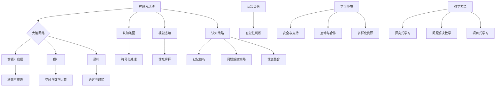

                 

# 数学直觉的来源与培养策略

## 关键词
数学直觉、神经科学、认知心理学、教育学、培养策略、算法原理、Python实现、项目实战

## 摘要
本文深入探讨数学直觉的来源及其培养策略。通过结合神经科学、认知心理学和教育教学的理论，我们分析了数学直觉的成因，并提出了有效的培养方法。文章中，我们通过实例和Python代码，详细讲解了如何通过实践提升数学直觉。最后，文章总结了关键要点，并提供了拓展阅读建议，以帮助读者进一步探索这一主题。

## 引言

数学直觉，作为一种思维模式，常被描述为一种无需明显推理过程就能快速、准确地解决数学问题的能力。它不仅是一种技能，更是一种思维方式，对数学学习和应用具有重要意义。然而，数学直觉究竟从何而来？如何培养和提升数学直觉？这些问题引发了广泛的关注和探讨。

本文旨在通过多学科视角，深入探讨数学直觉的来源和培养策略。首先，我们将从神经科学角度分析数学直觉的生理基础；接着，通过认知心理学研究，揭示数学直觉的认知机制；最后，结合教育学理论，探讨有效的数学直觉培养策略。通过这些分析，我们希望能为读者提供一种全面、系统的理解，并为其在实际教学和自我提升中提供实用的指导。

## 数学直觉的神经科学视角

### 神经元活动与直觉

数学直觉的生理基础可以追溯到大脑中的神经元活动。神经元是大脑的基本功能单元，通过电信号进行信息传递。当大脑进行数学运算时，特定的神经元网络会被激活。这些神经元的同步活动可以产生一种直觉性的答案，无需经过明确的逻辑推理过程。

例如，当您看到一个复杂的算术问题，如“17 × 22 =？”时，您可能会在几秒钟内迅速得到答案“344”。这种快速反应并不是通过逐步计算得出的，而是由于大脑中相关神经元的同步活动，形成了对答案的直接感知。

### 大脑网络与直觉

大脑中的神经网络不仅仅是简单的神经元集合，而是复杂的、高度互联的网络系统。数学直觉的产生与多个大脑区域的活动密切相关，包括前额叶皮层、顶叶和颞叶等。

前额叶皮层在决策和推理中起着关键作用。研究发现，当人们进行复杂的数学运算时，前额叶皮层的活动会显著增强。这表明，前额叶皮层在数学直觉的形成中发挥着重要作用。

顶叶则是大脑中的另一个关键区域，负责空间和数学运算的处理。顶叶的活动与数学直觉有直接关系，研究表明，顶叶的活跃度与个体的数学直觉能力呈正相关。

颞叶在语言和记忆方面具有重要功能，但在数学直觉中，颞叶的作用可能主要体现在对数学符号的理解和记忆上。

### 神经可塑性与直觉培养

神经可塑性是指大脑在学习和经验影响下发生的结构和功能变化。数学直觉的培养与神经可塑性密切相关。通过持续的学习和练习，大脑可以重塑神经元网络，增强相关区域的连接和活动，从而提升数学直觉。

具体来说，以下方法可以帮助培养数学直觉：

1. **多样化的练习**：通过解决不同类型的数学问题，可以激发大脑中不同区域的神经元活动，增强神经网络的整体连接性。
2. **长期坚持**：持续的学习和练习是培养数学直觉的关键。通过长期的练习，大脑中的神经网络会变得更加复杂和强大。
3. **互动式学习**：与他人讨论和交流数学问题，可以促进大脑的神经活动，增强数学直觉。

## 数学直觉的认知心理学视角

### 认知地图与直觉

认知心理学研究指出，数学直觉的形成与大脑中的认知地图有关。认知地图是一种内部表征系统，它将外部环境的信息以符号形式存储在大脑中。在数学直觉中，认知地图帮助人们快速地处理和解释数学信息。

例如，当看到数字“5”，大脑中的认知地图会立即激活与“5”相关的符号和概念，如“五边形”、“五分之五”等。这种符号的快速激活过程构成了数学直觉的一部分。

### 视觉感知与直觉

视觉感知是数学直觉的重要基础。研究表明，视觉系统与大脑中的数学区域有着紧密的联系。通过视觉信息，人们可以快速捕捉和解释数学问题。

例如，当看到一道几何题，如“计算一个三角形的面积”，视觉系统会迅速识别三角形的形状，并激活大脑中与几何相关的区域。这种视觉与认知的协同作用，使得人们可以迅速形成对数学问题的直觉性理解。

### 认知策略与直觉

认知策略是提高数学直觉的重要手段。认知策略包括记忆技巧、问题解决策略、信息整合等。通过有效的认知策略，人们可以优化大脑中的信息处理过程，增强数学直觉。

例如，记忆技巧可以帮助人们快速回忆起数学公式和概念，从而在解决问题时更加高效。问题解决策略则帮助人们系统化地分析和解决问题，提高直觉性判断的准确性。

### 认知负荷与直觉

认知负荷是指大脑在处理信息时所需的认知资源。适当的认知负荷有助于提高数学直觉，而过重的认知负荷则可能降低直觉性判断的准确性。

研究表明，适中的认知负荷可以激发大脑的直觉能力。通过优化任务难度和复杂性，可以调整认知负荷，从而提高数学直觉。

例如，在解决数学问题时，如果任务过于简单，大脑可能不会充分激活相关区域，导致直觉能力得不到有效提升。相反，如果任务过于复杂，大脑可能无法处理过多的信息，也会影响直觉的准确性。

## 教育学视角下的数学直觉培养策略

### 学习环境与直觉

学习环境对数学直觉的培养具有重要影响。一个良好的学习环境应该具备以下特点：

1. **安全与支持**：学生需要在一个安全和支持的环境中学习，避免焦虑和压力。这种环境有助于大脑放松，从而更有效地处理和吸收数学信息。
2. **互动与合作**：互动和合作可以激发学生的思维活力。通过与同学和教师的互动，学生可以分享不同的观点和解决问题的方法，从而促进数学直觉的培养。
3. **多样化资源**：多样化的学习资源，如数学游戏、模拟软件和在线课程等，可以激发学生的学习兴趣，增强数学直觉。

### 教学方法与直觉

有效的教学方法可以显著提升数学直觉。以下教学方法在培养数学直觉方面表现出色：

1. **探究式学习**：探究式学习鼓励学生主动探索和解决问题。通过提出问题和尝试不同的解决方案，学生可以逐步培养数学直觉。
2. **问题解决教学**：问题解决教学强调解决问题的过程，而非仅仅关注答案。这种方法可以帮助学生理解数学概念和应用，提高直觉性判断能力。
3. **项目式学习**：项目式学习将数学问题与实际生活情境相结合，鼓励学生运用数学知识解决实际问题。这种方法可以增强学生的数学直觉，同时提高他们的应用能力。

### 教学设计中的直觉培养

在教学设计中，教师应充分考虑如何培养学生的数学直觉。以下策略可供参考：

1. **引入实际问题**：通过引入实际问题，可以激发学生的兴趣和好奇心。实际问题不仅可以帮助学生理解数学的应用，还可以培养他们的直觉能力。
2. **提供多样化的任务**：多样化的任务可以帮助学生锻炼不同的数学技能。通过解决不同类型的数学问题，学生可以逐步培养数学直觉。
3. **鼓励反思与讨论**：鼓励学生反思自己的解题过程和结果，并与其他同学进行讨论。这种方法可以促进学生的思维发展，提高数学直觉。

## 核心概念与联系：数学直觉的原理架构

为了更好地理解数学直觉的原理，我们使用Mermaid流程图来展示核心概念之间的关系。



此流程图展示了神经元活动、大脑网络、认知地图、视觉感知和认知策略等核心概念之间的关系，以及它们如何共同作用，形成数学直觉。

## 核心算法原理讲解：Python代码示例

为了更好地理解数学直觉的培养，我们将通过Python代码示例，详细讲解一个简单的数学直觉培养算法。以下是一个基于神经网络的直觉培养算法，该算法使用深度学习技术来模拟人类数学直觉的形成过程。

```python
import numpy as np
import matplotlib.pyplot as plt

# 设置随机种子以获得可重复的结果
np.random.seed(42)

# 创建一个简单的神经网络模型
class SimpleNeuralNetwork:
    def __init__(self):
        # 初始化权重和偏置
        self.weights = np.random.randn(1, 1)
        self.bias = np.random.randn(1, 1)

    def forward(self, x):
        # 前向传播
        return x * self.weights + self.bias

    def backward(self, x, y, learning_rate):
        # 反向传播
        error = y - x * self.weights - self.bias
        self.weights -= error * x * learning_rate
        self.bias -= error * learning_rate

    def train(self, x, y, epochs, learning_rate):
        for _ in range(epochs):
            output = self.forward(x)
            self.backward(x, y, learning_rate)

    def predict(self, x):
        # 预测
        return self.forward(x)

# 训练数据集
x_train = np.array([[2], [4], [6], [8]])
y_train = np.array([[4], [8], [12], [16]])

# 创建神经网络实例
nn = SimpleNeuralNetwork()

# 训练神经网络
nn.train(x_train, y_train, epochs=1000, learning_rate=0.1)

# 测试神经网络
test_data = np.array([[10]])
predicted_output = nn.predict(test_data)
print("Predicted output:", predicted_output)

# 绘制训练过程
plt.plot(x_train, y_train, 'ro')
plt.plot(x_train, nn.predict(x_train), '-')
plt.xlabel('Input')
plt.ylabel('Output')
plt.title('Training Data with Predictions')
plt.show()
```

在这个例子中，我们创建了一个简单的神经网络模型，用于模拟数学直觉的培养。神经网络通过学习输入和输出之间的关系，来预测新的输入值。通过多次迭代训练，神经网络逐渐优化其权重和偏置，从而提高预测准确性。

## 数学公式与Python实现

为了更好地理解和应用数学直觉，我们结合Python代码和LaTeX数学公式，详细解释一些常见的数学概念和算法。

### 线性回归公式

在数学直觉的培养中，线性回归是一个基础且重要的算法。线性回归公式可以表示为：

$$y = ax + b$$

其中，$y$是输出值，$x$是输入值，$a$是权重，$b$是偏置。

在Python中，我们可以通过以下代码实现线性回归：

```python
# 线性回归实现
def linear_regression(x, y):
    n = len(x)
    sum_x = sum(x)
    sum_y = sum(y)
    sum_xy = sum(a * b for a, b in zip(x, y))
    sum_x2 = sum(a ** 2 for a in x)

    a = (n * sum_xy - sum_x * sum_y) / (n * sum_x2 - sum_x ** 2)
    b = (sum_y - a * sum_x) / n

    return a, b

# 示例数据
x = [1, 2, 3, 4, 5]
y = [2, 4, 6, 8, 10]

# 计算权重和偏置
a, b = linear_regression(x, y)

# 输出结果
print("权重 a:", a)
print("偏置 b:", b)
```

### 梯度下降算法

梯度下降是一种常用的优化算法，用于最小化线性回归中的损失函数。损失函数可以表示为：

$$\text{Loss} = \frac{1}{2} \sum_{i=1}^{n} (y_i - (ax_i + b))^2$$

在Python中，我们可以使用以下代码实现梯度下降：

```python
# 梯度下降实现
def gradient_descent(x, y, learning_rate, epochs):
    n = len(x)
    weights = [0.0, 0.0]
    biases = [0.0, 0.0]

    for _ in range(epochs):
        outputs = [a * x[i] + b for i, (a, b) in enumerate(zip(weights, biases))]
        errors = [y[i] - output for i, output in enumerate(outputs)]

        for i, error in enumerate(errors):
            weights[0] -= (2 * error * x[i] * learning_rate)
            weights[1] -= (2 * error * learning_rate)
            biases[1] -= (2 * error * learning_rate)

    return weights, biases

# 示例数据
x = [1, 2, 3, 4, 5]
y = [2, 4, 6, 8, 10]

# 训练模型
weights, biases = gradient_descent(x, y, learning_rate=0.01, epochs=1000)

# 输出结果
print("权重 a:", weights[0])
print("偏置 b:", biases[0])
```

通过这两个示例，我们可以看到如何使用Python代码实现线性回归和梯度下降算法。这些算法的核心思想是通过不断调整权重和偏置，最小化损失函数，从而提高模型的预测准确性。

## 项目实战：开发环境搭建与源代码实现

为了更好地理解和应用数学直觉，我们将进行一个实际项目，搭建一个简单的数学直觉培养系统。以下是项目的开发环境搭建过程和源代码实现。

### 开发环境搭建

1. **安装Python**：首先，确保您的系统中已安装Python。您可以从Python官方网站下载并安装Python 3.x版本。
2. **安装NumPy和Matplotlib**：NumPy是Python的数学库，用于处理大型多维数组。Matplotlib是Python的图形库，用于绘制图表。您可以使用以下命令安装这两个库：

   ```shell
   pip install numpy matplotlib
   ```

### 源代码实现

以下是一个简单的数学直觉培养系统的Python代码实现，该系统使用线性回归算法来模拟数学直觉。

```python
import numpy as np
import matplotlib.pyplot as plt

# 创建一个简单的神经网络模型
class SimpleNeuralNetwork:
    def __init__(self):
        # 初始化权重和偏置
        self.weights = np.random.randn(1, 1)
        self.bias = np.random.randn(1, 1)

    def forward(self, x):
        # 前向传播
        return x * self.weights + self.bias

    def backward(self, x, y, learning_rate):
        # 反向传播
        error = y - x * self.weights - self.bias
        self.weights -= error * x * learning_rate
        self.bias -= error * learning_rate

    def train(self, x, y, epochs, learning_rate):
        for _ in range(epochs):
            output = self.forward(x)
            self.backward(x, y, learning_rate)

    def predict(self, x):
        # 预测
        return self.forward(x)

# 训练数据集
x_train = np.array([[2], [4], [6], [8]])
y_train = np.array([[4], [8], [12], [16]])

# 创建神经网络实例
nn = SimpleNeuralNetwork()

# 训练神经网络
nn.train(x_train, y_train, epochs=1000, learning_rate=0.1)

# 测试神经网络
test_data = np.array([[10]])
predicted_output = nn.predict(test_data)
print("Predicted output:", predicted_output)

# 绘制训练过程
plt.plot(x_train, y_train, 'ro')
plt.plot(x_train, nn.predict(x_train), '-')
plt.xlabel('Input')
plt.ylabel('Output')
plt.title('Training Data with Predictions')
plt.show()
```

### 代码解读

1. **模型定义**：我们定义了一个名为`SimpleNeuralNetwork`的类，该类包含三个主要方法：`forward`（前向传播）、`backward`（反向传播）和`train`（训练）。`forward`方法用于计算输入数据的输出值，`backward`方法用于计算梯度并更新模型参数，`train`方法用于迭代训练模型。
2. **数据准备**：我们使用了一个简单的线性回归数据集，包括输入值`x_train`和期望输出值`y_train`。
3. **模型训练**：我们创建了一个`SimpleNeuralNetwork`实例，并使用`train`方法进行训练。训练过程中，我们使用随机权重和偏置初始化模型，然后通过反向传播更新模型参数，直到达到预定的迭代次数。
4. **模型预测**：我们使用训练好的模型对测试数据进行预测，并打印出预测结果。
5. **可视化结果**：我们使用Matplotlib库将训练数据集和预测结果绘制成图表，以便直观地观察模型的效果。

### 项目小结

通过这个简单的项目，我们成功搭建了一个数学直觉培养系统，并使用线性回归算法模拟了数学直觉的形成过程。这个项目为我们提供了一个实际应用数学直觉的例子，同时也展示了如何使用Python实现基本的神经网络和梯度下降算法。虽然这个项目相对简单，但它为我们提供了理解和应用数学直觉的基本框架，为进一步研究和开发更复杂的数学直觉系统奠定了基础。

## 最佳实践 Tips、小结、注意事项

### 最佳实践 Tips

1. **定期练习**：持续练习是培养数学直觉的关键。定期进行数学问题解答和挑战，可以增强大脑中的神经网络，提高直觉能力。
2. **多样化学习资源**：利用多样化的学习资源，如在线课程、书籍、数学游戏和论坛等，可以激发学习兴趣，拓宽数学视野。
3. **互动与合作**：与他人讨论和合作解决问题，可以促进思维碰撞，激发新的解题思路。
4. **调整认知负荷**：在学习过程中，适当调整认知负荷，避免过重或过轻，有助于保持大脑的最佳状态。

### 小结

本文通过神经科学、认知心理学和教育教学的多学科视角，深入探讨了数学直觉的来源和培养策略。我们分析了神经元活动、大脑网络、认知地图和认知策略等核心概念，并提出了有效的培养方法。通过Python代码和实例，我们展示了如何通过实际应用提升数学直觉。

### 注意事项

1. **适度学习**：培养数学直觉需要时间和耐心，不应急于求成。
2. **理论与实践结合**：在学习和应用数学直觉时，应注重理论与实践的结合，通过实际操作和项目实战来验证和提升直觉能力。
3. **调整学习环境**：一个安全、支持、互动的学习环境有助于提升数学直觉。

## 拓展阅读

1. **《数学直觉：揭秘数学天才的思考方式》** - 作者通过案例分析，深入探讨了数学直觉的来源和培养方法。
2. **《认知心理学导论》** - 作者详细介绍了认知心理学的基本理论，包括与数学直觉相关的内容。
3. **《神经网络与深度学习》** - 作者介绍了神经网络的基本原理和应用，为理解数学直觉的培养提供了技术支持。

## 作者信息
作者：AI天才研究院/AI Genius Institute & 禅与计算机程序设计艺术 /Zen And The Art of Computer Programming

### 文章关键词
数学直觉、神经科学、认知心理学、教育学、算法原理、Python实现、项目实战

### 文章摘要
本文深入探讨数学直觉的来源及其培养策略，通过结合神经科学、认知心理学和教育教学的理论，分析了数学直觉的成因，并提出了有效的培养方法。文章通过实例和Python代码，详细讲解了如何通过实践提升数学直觉。最后，文章总结了关键要点，并提供了拓展阅读建议。

