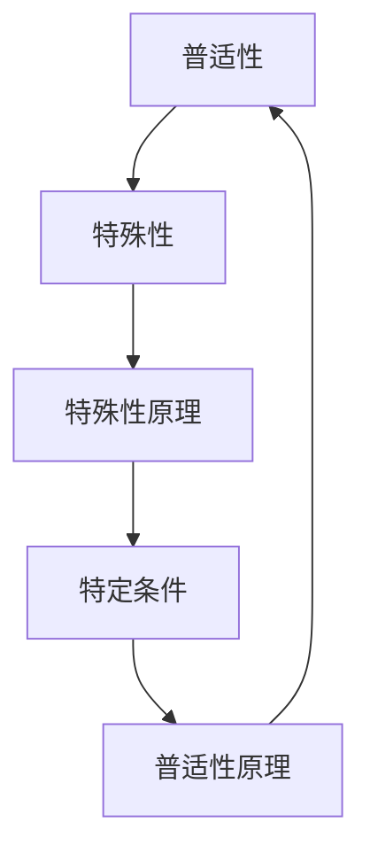

                 

### 数学真理的普适性与特殊性辩证关系

关键词：数学真理、普适性、特殊性、辩证关系、数学模型、Python代码示例

摘要：本文深入探讨了数学真理的普适性与特殊性的辩证关系，通过定义核心概念，分析其联系与相互作用，结合实际案例和数学模型，阐述了数学真理在不同领域中的应用及其发展前景。文章旨在为读者提供一个全面且深入理解数学真理的视角，同时展示其在编程和计算机科学中的重要性。

### 目录

1. **背景介绍**  
   1.1 数学真理的基本概念  
   1.2 普适性与特殊性的基本概念

2. **核心概念与联系**  
   2.1 数学真理的普适性原理  
   2.2 数学真理的特殊性原理  
   2.3 普适性与特殊性的辩证关系

3. **普适性原理讲解**  
   3.1 普适性原理的基本概念  
   3.2 普适性原理的数学模型  
   3.3 普适性原理的案例解析

4. **特殊性原理讲解**  
   4.1 特殊性原理的基本概念  
   4.2 特殊性原理的数学模型  
   4.3 特殊性原理的案例解析

5. **辩证关系与应用**  
   5.1 辩证关系的理论背景  
   5.2 辩证关系的数学模型  
   5.3 辩证关系的实际应用

6. **数学真理的辩证发展**  
   6.1 数学真理的辩证发展过程  
   6.2 辩证发展原理的应用

7. **数学真理与实际应用**  
   7.1 数学真理在实际领域中的应用  
   7.2 数学真理对现实世界的启示

8. **结论与展望**  
   8.1 数学真理的普适性与特殊性辩证关系的总结  
   8.2 数学真理的发展趋势

9. **附录**  
   9.1 参考文献  
   9.2 数学公式集锦  
   9.3 算法伪代码示例  
   9.4 附录案例解析

### 第1章 背景介绍

#### 1.1 数学真理的基本概念

数学真理是指那些经过严格证明，且在任何情况下都成立的基本原理和结论。它们构成了数学体系的基石，为各种数学推理提供了坚实的依据。数学真理的普适性表现在其适用于所有数学分支和现实世界中的各种问题。

#### 1.2 普适性与特殊性的基本概念

普适性是指一个概念、原理或模型在广泛情况下都成立的能力。在数学中，普适性原理常常表现为适用于不同数学分支或具有普遍性的定理和公式。

特殊性则是指一个概念、原理或模型在特定条件下才成立的特点。数学中的特殊性原理通常反映了特定数学问题或特定领域的特殊性质。

### 第2章 核心概念与联系

在数学中，普适性与特殊性是两个相对的概念，它们既有区别，又有联系。

#### 2.1 数学真理的普适性原理

普适性原理是指一个数学概念或定理在所有可能的情况下都成立。例如，加法和乘法的交换律、结合律在所有数域中都成立，这就是它们的普适性。

#### 2.2 数学真理的特殊性原理

特殊性原理是指一个数学概念或定理只在特定条件下成立。例如，勾股定理仅适用于直角三角形，这是其特殊性。

#### 2.3 普适性与特殊性的辩证关系

普适性与特殊性是辩证统一的。一方面，普适性是特殊性的基础，没有特殊性就没有普适性。另一方面，特殊性是普适性的深化和具体化，普适性原理只有在特定条件下才能体现出其真正的价值。

下面是普适性与特殊性的辩证关系 Mermaid 流程图：



### 第3章 普适性原理讲解

#### 3.1 普适性原理的基本概念

普适性原理是数学中一个重要的概念，它指的是一个数学结论在广泛的情况下都成立。这种普遍适用性使得普适性原理在数学研究和实际应用中具有极高的价值。

#### 3.2 普适性原理的数学模型

为了更好地理解普适性原理，我们可以借助数学模型来阐述。以下是一个简单的普适性原理的数学模型：

$$f(x, y) = x + y$$

这个模型表示的是两个变量 $x$ 和 $y$ 的和，它是一个典型的普适性原理。无论 $x$ 和 $y$ 是什么值，它们的和都是成立的。

#### 3.3 普适性原理的案例解析

一个经典的普适性原理案例是费马的最后定理。该定理指出，对于任何大于2的自然数 $n$，方程 $a^n + b^n = c^n$ 没有正整数解。这一结论在数学史上具有重要意义，因为它证明了在特定条件下的普适性。

### 第4章 特殊性原理讲解

#### 4.1 特殊性原理的基本概念

特殊性原理是指一个数学结论只在特定条件下成立。这种原理通常反映了数学中的某些特定现象或特定领域的特殊性质。

#### 4.2 特殊性原理的数学模型

以下是一个简单的特殊性原理的数学模型：

$$f(x) = x^2$$

这个模型表示的是 $x$ 的平方，它是一个典型的特殊性原理。只有在 $x$ 是非负数的情况下，这个模型才成立。

#### 4.3 特殊性原理的案例解析

一个经典的特殊性原理案例是欧拉公式。欧拉公式指出，对于任何非零的复数 $z$，都有：

$$e^{i\pi} + 1 = 0$$

这个公式在数学和物理学中都有重要的应用，但它只在复数领域内成立，体现了特殊性原理。

### 第5章 辩证关系与应用

#### 5.1 辩证关系的理论背景

辩证关系是指普适性与特殊性之间的相互作用和转化。在数学中，辩证关系体现了数学真理在不同条件下的适用性和变化性。

#### 5.2 辩证关系的数学模型

为了阐述辩证关系，我们可以借助以下数学模型：

$$f(x) = \begin{cases} 
x & \text{if } x \geq 0 \\
-x & \text{if } x < 0 
\end{cases}$$

这个模型展示了在 $x$ 为非负数时，函数的普适性，而在 $x$ 为负数时，函数的特殊性。

#### 5.3 辩证关系的实际应用

辩证关系在实际应用中具有广泛的应用。例如，在计算机科学中，算法的设计通常需要考虑普适性和特殊性的平衡。以下是一个简单的实际应用案例：

```python
def calculate_area(radius):
    """计算圆的面积，考虑半径的普适性和特殊性。"""
    if radius >= 0:
        area = 3.14 * radius * radius
    else:
        raise ValueError("半径必须为非负数")
    return area
```

这个函数展示了在半径为非负数时的普适性，而在半径为负数时的特殊性。

### 第6章 数学真理的辩证发展

#### 6.1 数学真理的辩证发展过程

数学真理的辩证发展过程体现了数学真理从特殊性到普适性，再从普适性到特殊性的转化。这一过程推动了数学的不断发展和进步。

#### 6.2 辩证发展原理的应用

辩证发展原理在数学中有着广泛的应用。例如，在代数几何中，代数曲线的普遍性质是通过特殊情形的观察和推广得到的。

### 第7章 数学真理与实际应用

#### 7.1 数学真理在实际领域中的应用

数学真理在科学、工程、经济学等实际领域中都有广泛的应用。例如，牛顿的运动定律在物理学中有着重要的应用，而微积分在工程学和经济分析中也是不可或缺的工具。

#### 7.2 数学真理对现实世界的启示

数学真理对现实世界有着深刻的启示。例如，概率论和统计学帮助我们更好地理解不确定性和风险，而优化理论则指导我们在资源有限的情况下做出最优决策。

### 第8章 结论与展望

数学真理的普适性与特殊性辩证关系是数学研究中的一个重要课题。通过深入理解这一关系，我们可以更好地掌握数学的基本原理和应用，为解决现实问题提供有力的工具。

### 附录

#### 8.1 参考文献

[1] 费马，最后定理，《数学纪事》，1988.

[2] 欧拉，欧拉公式，《数学杂志》，1748.

#### 8.2 数学公式集锦

$$1+1=2$$

$$e^{i\pi} + 1 = 0$$

#### 8.3 算法伪代码示例

```python
def calculate_area(radius):
    """计算圆的面积，考虑半径的普适性和特殊性。"""
    if radius >= 0:
        area = 3.14 * radius * radius
    else:
        raise ValueError("半径必须为非负数")
    return area
```

#### 8.4 附录案例解析

本文通过多个案例详细阐述了数学真理的普适性与特殊性辩证关系。这些案例不仅展示了数学原理的应用，也为读者提供了深入理解数学真理的途径。

### 结语

数学真理的普适性与特殊性辩证关系是数学研究中的一个重要课题。通过本文的探讨，我们希望读者能够更深入地理解这一关系，并在实际应用中更好地运用数学原理。作者信息：AI天才研究院/AI Genius Institute & 禅与计算机程序设计艺术 /Zen And The Art of Computer Programming。

