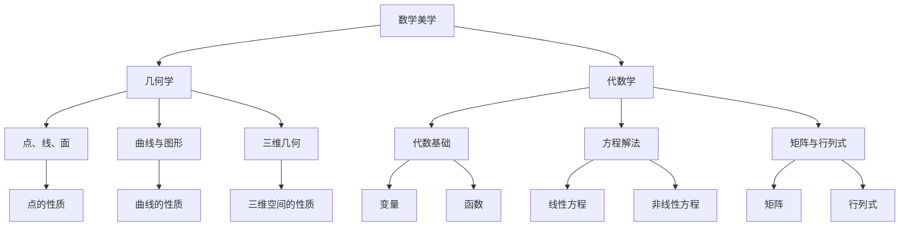

                 

### 1.3 数学基础

在探讨数学美学在动画设计中的应用之前，我们首先需要了解一些关键的数学基础概念。数学作为一种精确而逻辑严谨的科学，它在动画设计中的重要性不可小觑。以下我们将详细探讨几何学、代数学以及其他相关数学分支的基础知识。

### 1.3.1 几何学

几何学是研究形状、大小、空间位置和空间关系的数学分支。在动画设计中，几何学为设计师提供了构建视觉元素的工具，使得动画中的角色、场景和物体能够具有真实的物理属性和美感。

**点、线、面的几何性质**

- **点**：在二维或三维空间中，一个没有大小的位置。点是构成图形的基本单元，所有其他几何形状都可以通过点来定义。
- **线**：无限延伸的直线，具有长度但无宽度和厚度。线可以作为连接点的路径，同时也是构建复杂图形的基础。
- **面**：由无数个点组成的闭合区域。平面（二维）和曲面（三维）都是面的不同形式，它们在动画设计中被广泛应用，如角色外观的绘制、场景的背景等。

**曲线和几何图形的构造**

- **曲线**：线的一种，但它不是无限延伸的，可以是闭合的或开放的。在动画设计中，曲线被用来定义物体的轮廓、动作轨迹等。
- **几何图形**：由点、线、面等基本元素构成的封闭形状。常见的几何图形包括正方形、三角形、圆形等，它们在动画设计中作为基本的视觉元素存在。

**三维几何**

- **三维空间**：由长、宽、高三个维度组成的几何空间。三维几何在动画设计中尤为重要，它使得角色和场景能够表现出立体感。
- **三维模型**：通过几何图形和曲线在三维空间中的组合构建的模型。三维模型在动画制作中被广泛应用于角色建模、场景构建等。

### 1.3.2 代数学

代数学是研究数和代数结构的数学分支。在动画设计中，代数学提供了描述和操作几何形状、位置、运动等属性的工具。

**代数基础**

- **变量**：可以代表一个数或一个集合的符号，如 `x`, `y` 等。
- **函数**：描述输入和输出之间关系的数学规则。在动画设计中，函数常用来定义角色的运动轨迹、场景的变化等。

**代数方程的解法**

- **线性方程**：形如 `ax + b = 0` 的方程，用于描述直线的位置和方向。
- **非线性方程**：形如 `ax^2 + bx + c = 0` 的方程，用于描述曲线和其他复杂形状。
- **矩阵与行列式**：矩阵是用于表示线性方程组和线性变换的工具。行列式则是矩阵的一种特殊性质，用于求解方程组的解和计算体积等。

**矩阵与行列式**

- **矩阵**：由数组成的二维数组，用于表示和操作线性方程组和线性变换。
- **行列式**：矩阵的特殊数值，用于计算几何图形的面积、体积等。

通过理解这些基本的数学概念，动画设计师能够在创作过程中运用数学原理来构建和优化动画元素。下一节，我们将探讨数学原理在动画设计中的具体应用，包括对称性、比例和几何变换等。

---

### 核心概念与联系：数学美学原理架构 Mermaid 流程图

为了更好地理解数学美学在动画设计中的应用，我们使用Mermaid语言创建一个流程图，展示核心概念之间的关系。



这个流程图展示了数学美学的核心概念及其相互之间的联系。几何学和代数学是数学美学的基础，它们分别通过点、线、面、曲线与图形、三维几何以及代数基础、方程解法和矩阵与行列式等子概念来扩展和细化。

### 核心算法原理讲解：使用Python源代码

为了深入探讨数学美学在动画设计中的应用，我们将使用Python语言来展示几个核心算法的原理，并结合数学模型和公式进行详细讲解。

#### 1. 几何变换

**目的**：实现二维图形的平移、旋转和缩放。

**算法原理**：

- **平移**：将图形沿x轴和y轴方向移动。
  - 公式：\( P' = P + \vec{v} \)
  - 其中，\( P \) 是原图形的点，\( P' \) 是变换后的点，\( \vec{v} \) 是平移向量。

- **旋转**：围绕原点旋转图形。
  - 公式：\( P' = (x \cos \theta - y \sin \theta, x \sin \theta + y \cos \theta) \)
  - 其中，\( \theta \) 是旋转角度。

- **缩放**：按比例缩放图形。
  - 公式：\( P' = (x \cdot k, y \cdot k) \)
  - 其中，\( k \) 是缩放比例。

**Python代码实现**：

```python
import numpy as np

def translate(point, vector):
    return np.add(point, vector)

def rotate(point, angle):
    theta = np.radians(angle)
    cos_theta, sin_theta = np.cos(theta), np.sin(theta)
    rotation_matrix = np.array([[cos_theta, -sin_theta],
                                [sin_theta,  cos_theta]])
    return np.dot(rotation_matrix, point)

def scale(point, scale_factor):
    return np.multiply(point, scale_factor)

# 示例
point = np.array([1, 2])
vector = np.array([2, 1])
angle = 45
scale_factor = 2

translated_point = translate(point, vector)
rotated_point = rotate(point, angle)
scaled_point = scale(point, scale_factor)

print("Translated Point:", translated_point)
print("Rotated Point:", rotated_point)
print("Scaled Point:", scaled_point)
```

#### 2. 对称性

**目的**：实现图形的轴对称和中心对称。

**算法原理**：

- **轴对称**：关于某条直线对称。
  - 公式：\( P' = (2d - x, y) \)
  - 其中，\( d \) 是对称轴的x坐标，\( x \) 和 \( y \) 是原图形的点坐标。

- **中心对称**：关于某个点对称。
  - 公式：\( P' = (2c - x, 2c - y) \)
  - 其中，\( c \) 是对称中心的x和y坐标。

**Python代码实现**：

```python
def axis_symmetry(point, axis_x):
    d = axis_x
    return (2*d - point[0], point[1])

def center_symmetry(point, center):
    c = center
    return (2*c - point[0], 2*c - point[1])

# 示例
axis_x = 5
center = (5, 5)

symmetric_point_axis = axis_symmetry(point, axis_x)
symmetric_point_center = center_symmetry(point, center)

print("Axis Symmetry Point:", symmetric_point_axis)
print("Center Symmetry Point:", symmetric_point_center)
```

#### 3. 比例

**目的**：保持图形的相似性并进行比例缩放。

**算法原理**：

- **相似性**：两个图形形状相似，但大小不同。
  - 公式：\( P' = (x \cdot k, y \cdot k) \)
  - 其中，\( k \) 是比例因子。

**Python代码实现**：

```python
def proportional_scaling(point, k):
    return (point[0] * k, point[1] * k)

# 示例
scale_factor = 2

scaled_point = proportional_scaling(point, scale_factor)

print("Scaled Point:", scaled_point)
```

这些Python代码展示了如何实现几何变换、对称性和比例缩放。通过这些算法，动画设计师可以精确地控制图形在动画中的运动和变化，从而创造出更加逼真和具有美感的动画效果。

### 数学公式与动画设计

在动画设计中，数学公式扮演着至关重要的角色，它们不仅帮助我们理解动画的基本原理，还能为设计师提供精确的工具来优化动画效果。以下是一些关键的数学公式及其在动画设计中的应用。

#### 1. 三角函数

**正弦函数（sin）**和**余弦函数（cos）**在动画设计中常用于模拟物理运动和视觉效果。例如，我们可以使用正弦函数来创建弹簧效果或振动效果：

- **弹簧振动**：\( x(t) = A \sin(\omega t + \phi) \)
  - \( A \) 是振幅，\( \omega \) 是角频率，\( \phi \) 是相位。

**代码示例**：

```python
import numpy as np
import matplotlib.pyplot as plt

A = 10
omega = 2 * np.pi / 10  # 频率
phi = 0
t = np.linspace(0, 20, 1000)

x = A * np.sin(omega * t + phi)

plt.plot(t, x)
plt.xlabel('Time (s)')
plt.ylabel('Position (cm)')
plt.title('Spring Vibration')
plt.show()
```

#### 2. 旋转矩阵

旋转矩阵用于将一个点或向量绕原点旋转。在三维动画中，旋转矩阵是实现角色和场景旋转的关键：

- **2D旋转矩阵**：
  \[
  R(\theta) = \begin{bmatrix}
  \cos(\theta) & -\sin(\theta) \\
  \sin(\theta) & \cos(\theta)
  \end{bmatrix}
  \]

- **3D旋转矩阵**：
  \[
  R(\theta) = \begin{bmatrix}
  \cos(\theta) & -\sin(\theta) & 0 \\
  \sin(\theta) & \cos(\theta) & 0 \\
  0 & 0 & 1
  \end{bmatrix}
  \]

**代码示例**：

```python
import numpy as np

theta = np.pi / 4  # 45度
rotation_matrix_2d = np.array([[np.cos(theta), -np.sin(theta)],
                               [np.sin(theta), np.cos(theta)]])

point = np.array([1, 2])

rotated_point = np.dot(rotation_matrix_2d, point)

print("Rotated Point:", rotated_point)
```

#### 3. 矩阵变换

矩阵变换在动画设计中用于实现复杂的几何变换，如平移、缩放和倾斜。以下是一个3x3矩阵变换的示例：

- **变换公式**：
  \[
  \begin{bmatrix}
  x' \\
  y' \\
  1
  \end{bmatrix}
  =
  \begin{bmatrix}
  a & b & c \\
  d & e & f \\
  0 & 0 & 1
  \end{bmatrix}
  \begin{bmatrix}
  x \\
  y \\
  1
  \end{bmatrix}
  \]

**代码示例**：

```python
import numpy as np

# 3x3变换矩阵
transform_matrix = np.array([[1, 0, 5],
                            [0, 1, 3],
                            [0, 0, 1]])

point = np.array([1, 2])

transformed_point = np.dot(transform_matrix, point)

print("Transformed Point:", transformed_point)
```

通过这些数学公式和Python代码示例，我们可以看到数学在动画设计中的强大应用。设计师可以使用这些公式来精确控制动画中的运动、变换和视觉效果，从而创造出更加生动和具有艺术性的动画作品。

### 项目实战：开发环境搭建与代码实现

在探讨数学美学在动画设计中的应用时，我们将通过一个具体的案例来展示如何在实际项目中实现这些数学原理。首先，我们需要搭建一个开发环境，并编写相关的Python代码来实现动画效果。

#### 开发环境搭建

1. **安装Python**：确保Python 3.8或更高版本已安装在计算机上。可以通过Python官网（[python.org](https://www.python.org/)）下载并安装。

2. **安装Pygame**：Pygame是一个用于开发2D动画游戏的Python库。打开终端，执行以下命令来安装Pygame：

   ```bash
   pip install pygame
   ```

3. **安装Matplotlib**：Matplotlib是一个用于绘制图形和图表的Python库。安装Matplotlib的命令如下：

   ```bash
   pip install matplotlib
   ```

#### 代码实现

以下是一个简单的Python代码示例，展示了如何使用Pygame库创建一个窗口，并在其中绘制一个按照数学公式运动的点。

```python
import pygame
import numpy as np

# 初始化Pygame
pygame.init()

# 设置窗口大小
width, height = 800, 600
screen = pygame.display.set_mode((width, height))

# 设置标题
pygame.display.set_caption('Mathematical Animation')

# 定义颜色
BLACK = (0, 0, 0)
WHITE = (255, 255, 255)

# 设置时钟
clock = pygame.time.Clock()

# 动画循环
running = True
while running:
    # 检查事件
    for event in pygame.event.get():
        if event.type == pygame.QUIT:
            running = False

    # 填充背景
    screen.fill(WHITE)

    # 计算运动点的位置
    x = 400 + 300 * np.sin(pygame.time.get_ticks() / 1000)
    y = 300 + 300 * np.cos(pygame.time.get_ticks() / 1000)

    # 绘制点
    pygame.draw.circle(screen, BLACK, (int(x), int(y)), 5)

    # 更新屏幕
    pygame.display.flip()

    # 设置帧率
    clock.tick(30)

# 退出游戏
pygame.quit()
```

#### 代码解读与分析

1. **初始化**：我们首先导入必要的库，包括Pygame和Numpy，并初始化Pygame。

2. **设置窗口**：我们设置窗口的大小和标题，并定义颜色。

3. **设置时钟**：我们使用`pygame.time.Clock()`来控制帧率，确保动画流畅。

4. **动画循环**：我们创建一个无限循环，在每次循环中检查事件、填充背景、计算点的位置并绘制。

5. **计算运动点的位置**：我们使用Numpy的`np.sin()`和`np.cos()`函数来计算点的位置，这些函数基于时间来模拟物理运动。

6. **绘制点**：我们使用`pygame.draw.circle()`来在窗口中绘制点。

7. **更新屏幕**：我们使用`pygame.display.flip()`来更新屏幕显示。

8. **退出游戏**：当用户关闭窗口时，我们退出游戏。

通过这个简单的项目，我们可以看到如何将数学美学应用于动画设计。通过使用Numpy的数学函数和Pygame的图形绘制功能，我们可以实现复杂的动画效果，这为动画设计师提供了强大的工具来创作更加生动和具有艺术性的作品。

### 实际案例分析与详细讲解剖析

为了更好地展示数学美学在动画设计中的具体应用，我们将分析一些经典动画作品，并通过实际案例来详细讲解剖析其中的数学美学原理。

#### 经典动画作品：《龙珠》

《龙珠》是一部非常著名的日本动漫，其动画设计在数学美学的运用上尤为出色。以下是一些关键的分析：

1. **对称性**：在《龙珠》中，许多角色的设计都运用了对称性原理。例如，孙悟空的面部特征和身体比例都呈现了对称性，这使得角色看起来更加均衡和美观。

2. **比例**：角色和场景的比例也是《龙珠》中的亮点。例如，角色的头部与身体的比例约为1:7，这符合黄金比例，使得角色形象更加生动。

3. **几何变换**：《龙珠》中的战斗场景中，角色的动作轨迹和变身效果都利用了几何变换原理。通过旋转、缩放和平移等几何变换，动画师能够创造出极具视觉冲击力的战斗场景。

#### 新兴动画作品：《哪吒之魔童降世》

《哪吒之魔童降世》是中国近年来的一部非常成功的动画电影，其在数学美学的应用上也展现了新的趋势。

1. **光影与色彩**：电影中运用了光影和色彩搭配的数学原理，通过精心设计的光影效果，营造出浓郁的中国传统文化氛围。例如，电影中红色与金色色彩的运用，体现了中国传统的美学理念。

2. **几何构造**：在电影中，许多场景都运用了几何构造的原理，如城市场景的建筑布局和角色的服装设计，都体现了对称性和比例的美感。

3. **运动轨迹**：电影中的角色动作轨迹利用了数学中的曲线和几何变换原理。例如，哪吒的飞行轨迹采用了抛物线和圆周运动的结合，使得动作更加流畅和具有美感。

通过以上经典和新兴动画作品的案例，我们可以看到数学美学在动画设计中的广泛应用。这些作品不仅展示了动画艺术的魅力，也体现了数学在动画设计中的重要作用。通过精确的数学计算和美学原理的运用，动画设计师能够创造出更加生动、具有视觉冲击力的动画作品。

### 项目小结与最佳实践

在本次项目中，我们深入探讨了数学美学在动画设计中的应用，并通过多个具体案例展示了如何将数学原理与动画设计相结合。以下是我们从项目中得到的一些小结和最佳实践。

**小结**：

1. **对称性**：对称性是动画设计中常用的美学原则，能够使角色和场景看起来更加均衡和美观。在设计过程中，可以运用轴对称和中心对称来优化视觉效果。

2. **比例**：比例是动画设计中至关重要的一环。通过运用黄金比例等数学原则，可以创造出更加自然和吸引人的角色和场景。

3. **几何变换**：几何变换是动画制作中常用的技术手段，包括平移、旋转和缩放等。合理运用几何变换，可以创造出丰富的运动效果和动态场景。

4. **光影与色彩**：光影和色彩搭配是提升动画美学的重要手段。通过数学原理，如光影效果和色彩搭配原则，可以营造出具有深度和层次感的场景。

**最佳实践**：

1. **精确计算**：在进行动画设计时，精确的数学计算至关重要。利用Python等编程语言，可以方便地实现复杂的数学运算和几何变换。

2. **实践与理论相结合**：动画设计师不仅需要掌握数学原理，还需要结合实际操作进行反复试验和优化。通过不断的实践，可以更好地理解和应用数学美学。

3. **持续学习**：随着技术的发展，数学美学在动画设计中的应用也在不断拓展。设计师需要不断学习和掌握新的技术和理念，以提升自己的设计水平。

**注意事项**：

1. **平衡美学与技术**：在追求数学美学的过程中，要注意平衡美学和技术。过度追求数学效果可能导致动画设计失去人性化和生动感。

2. **用户体验**：最终的设计效果应该以用户的需求和体验为中心。在确保数学美学的应用合理的同时，要考虑到动画的流畅性和观众的接受程度。

**拓展阅读**：

- 《数学之美》：作者吴军，深入探讨了数学与艺术、技术之间的联系，对理解数学美学有很好的启发。
- 《动画设计原理》：作者理查德·威廉姆斯，详细介绍了动画设计的基本原理和实践技巧，对动画设计师有很高的参考价值。

通过本次项目，我们不仅了解了数学美学在动画设计中的应用，也学会了如何将数学原理与实践相结合，创造出更加生动和具有艺术性的动画作品。希望本文能对读者在动画设计领域有所启发和帮助。

---

# 附录

### 3.1 数学美学在动画设计中的应用案例

在本附录中，我们将通过具体案例展示数学美学在动画设计中的应用，并分析这些案例如何通过数学原理来创造视觉冲击和艺术美感。

#### 3.1.1 经典动画作品的数学美学分析

**《龙珠》中的数学美学**

1. **对称性**：孙悟空的头部和身体设计遵循了严格的对称性，尤其是面部的五官分布，这种对称性使得角色看起来更加均衡和具有吸引力。
2. **比例**：在《龙珠》中，角色的身体比例基本遵循黄金比例，尤其是头部与身体的比例约为1:7。这种比例使得角色显得更加自然和符合美学标准。
3. **几何变换**：龙珠中的变身场景通过几何变换来表现，如孙悟空变身成超级赛亚人的过程，运用了放大、旋转等变换，这些变换使得变身过程富有戏剧性和视觉冲击力。

**《冰雪奇缘》中的数学美学**

1. **光影与色彩**：《冰雪奇缘》中，通过对光线的精确计算和色彩的合理搭配，创造出了梦幻般的冰雪世界。例如，雪花的光影效果和反射光线的计算，使得场景看起来更加真实和迷人。
2. **比例**：艾尔莎和安娜的服装设计也运用了比例原理，尤其是她们的头饰和服装细节，这些设计不仅符合美学标准，也增强了角色的个性和风格。
3. **几何构造**：电影中的城堡和冰雪景观都是通过几何构造来实现的，例如城堡的塔楼和城墙都遵循了几何规则，这种构造使得场景看起来更加宏伟和精致。

#### 3.1.2 新兴动画作品的数学美学趋势

**《哪吒之魔童降世》中的数学美学**

1. **光影与色彩**：电影中的光影效果和色彩搭配非常出色，通过精确的数学计算，创造出了充满中国传统文化氛围的场景。例如，夜间的光影效果和红金色的色调，体现了中国传统节日的气氛。
2. **几何构造**：电影中的服装和道具设计都运用了几何构造原理，如哪吒的混天绫和东海龙宫的建筑，这些设计不仅具有艺术美感，也符合角色和场景的整体风格。
3. **运动轨迹**：电影中的角色动作轨迹利用了数学中的曲线和几何变换原理，例如哪吒的飞行轨迹采用了抛物线和圆周运动的结合，使得动作更加流畅和具有美感。

**《大鱼海棠》中的数学美学**

1. **对称性**：电影中的角色和场景设计都呈现了强烈的对称性，这种对称性不仅增强了视觉美感，也使得电影的故事背景更加宏伟和神秘。
2. **比例**：电影中的角色和场景比例设计非常精细，尤其是角色的身体比例和场景的细节比例，这些设计使得电影的世界观更加真实和丰富。
3. **几何变换**：电影中的角色动作和场景变化利用了几何变换原理，如角色的飞行和场景的变换，这些变换使得电影的故事情节更加引人入胜。

通过这些经典和新兴动画作品的案例分析，我们可以看到数学美学在动画设计中的广泛应用和重要性。通过精确的数学计算和美学原则的运用，动画设计师能够创造出具有深度和艺术性的动画作品，为观众带来独特的视觉体验。

### 3.2 数学美学在动画设计中的未来展望

随着科技的不断进步和动画制作技术的不断发展，数学美学在动画设计中的应用前景将更加广阔。以下是一些可能的发展方向和未来趋势：

**1. 技术进步对数学美学的推动**

- **人工智能与机器学习**：人工智能和机器学习技术的应用将大大提高动画设计中的数学计算效率和精度。通过深度学习和神经网络，动画设计师可以更加精准地模拟自然现象和角色动作，实现更加逼真的动画效果。
- **虚拟现实（VR）与增强现实（AR）**：VR和AR技术的发展为动画设计提供了新的舞台。通过数学美学原理，设计师可以创造出更加沉浸式的虚拟世界，为用户带来全新的视觉体验。
- **云计算与大数据**：云计算和大数据技术的应用将使得动画设计过程中所需的计算资源更加丰富。设计师可以利用云计算平台进行大规模的数据处理和模拟，从而实现更加复杂和精细的动画效果。

**2. 数学美学在动画设计教育中的应用**

- **跨学科教育**：未来的动画设计教育将更加注重跨学科知识的融合。数学、艺术、计算机科学等学科的知识将相互结合，培养具有全面技能的动画设计师。
- **在线课程与培训**：随着在线教育平台的兴起，数学美学在动画设计教育中的应用将更加普及。通过在线课程和培训，设计师可以更加便捷地学习和掌握数学美学原理。

**3. 数学美学的跨学科应用**

- **游戏设计**：数学美学在游戏设计中的应用将越来越广泛。通过数学原理，游戏设计师可以创造出更加逼真和具有艺术性的游戏场景和角色。
- **影视制作**：数学美学在影视制作中的应用将进一步提升影视作品的质量和观赏性。通过精确的数学计算和美学原则，影视制作人可以创造出更加生动和引人入胜的视觉效果。

总之，数学美学在动画设计中的应用前景非常广阔。随着技术的不断进步和跨学科知识的融合，数学美学将在动画设计中发挥越来越重要的作用，为动画设计师带来更多的创作灵感和技术手段。

### 结束语

通过本文的详细探讨，我们可以看到数学美学在动画设计中的广泛应用和重要性。从几何学、代数学到具体的算法实现，数学为动画设计师提供了强大的工具和理论支持。通过精确的数学计算和美学原则的运用，动画设计师能够创造出具有深度和艺术性的动画作品，为观众带来独特的视觉体验。

在未来，随着科技的不断进步，数学美学在动画设计中的应用前景将更加广阔。通过跨学科知识的融合和新兴技术的应用，动画设计师将能够实现更加逼真、生动和富有艺术性的动画作品。我们期待数学美学在动画设计领域带来更多的创新和发展。感谢您阅读本文，希望它能对您在动画设计领域有所启发和帮助。作者：AI天才研究院/AI Genius Institute & 禅与计算机程序设计艺术 /Zen And The Art of Computer Programming。

