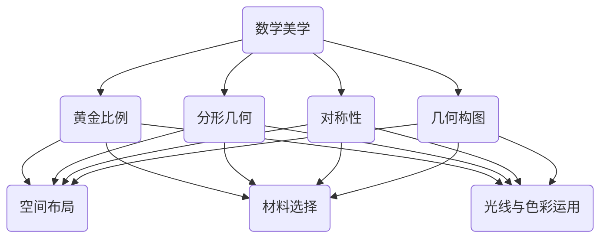

                 

----------------------------------------------------------------
# 数学美学在室内设计中的体现

## 关键词
数学美学、室内设计、空间规划、黄金比例、分形、对称性、几何构图

## 摘要
本文旨在探讨数学美学在室内设计中的独特应用，通过分析黄金比例、分形几何、对称性等核心概念，揭示数学原理在创造和谐空间美学中的重要作用。文章将从理论基础出发，结合实际案例，深入探讨如何将数学美学原则应用于室内设计的实践过程中，为读者提供有价值的参考和灵感。

## 目录
1. **引言**
    1.1 背景介绍
    1.2 研究目的与意义

2. **数学美学的基本概念**
    2.1 黄金比例
    2.2 分形几何
    2.3 对称性
    2.4 几何构图

3. **数学美学在室内设计中的具体应用**
    3.1 空间布局
    3.2 材料选择
    3.3 光线与色彩运用

4. **核心概念与联系**
    4.1 核心概念架构图
    4.2 理论与实践的联系

5. **核心算法原理讲解**
    5.1 空间划分算法
    5.2 色彩搭配算法

6. **数学模型与公式**
    6.1 黄金比例计算
    6.2 分形几何参数设置

7. **项目实战**
    7.1 实战案例一：家居空间规划
    7.2 实战案例二：办公室空间设计
    7.3 项目小结

8. **最佳实践与注意事项**
    8.1 最佳实践技巧
    8.2 注意事项与拓展阅读

## 1. 引言
### 1.1 背景介绍
随着社会的发展和审美的变化，室内设计不再仅仅是关于美感的表达，更涉及到功能、空间利用以及与居住者心理需求的结合。在众多设计元素中，数学美学作为一种独特的艺术语言，逐渐引起了室内设计师的重视。数学美学涉及黄金比例、对称性、分形几何等概念，这些概念在艺术和科学领域有着悠久的历史和广泛的应用。

### 1.2 研究目的与意义
本文的研究目的在于探讨数学美学在室内设计中的具体应用，通过分析数学原理如何在空间规划、材料选择、光线与色彩运用等方面发挥作用，为室内设计师提供理论支持和实践指导。研究数学美学在室内设计中的应用，不仅能够提升设计的科学性和艺术性，还能更好地满足人们对于生活品质的追求。

----------------------------------------------------------------

## 2. 数学美学的基本概念
### 2.1 黄金比例
黄金比例，又称为黄金分割，是数学和美学中的一个重要概念。它是一个无理数，通常表示为φ（phi），约等于1.618。黄金比例在自然界和艺术作品中广泛存在，被认为是美学上最为和谐的比例。在室内设计中，黄金比例可以应用于家具布局、墙面划分、装饰元素的尺寸等方面，以创造视觉上的平衡和美感。

### 2.2 分形几何
分形几何是数学中的一个分支，它研究的是复杂不规则形状的几何特性。分形几何中的自相似性、无限嵌套等特征，使得其在室内设计中具有独特的应用价值。例如，使用分形图案可以创造出现代感和科技感，同时增加空间的层次感和趣味性。

### 2.3 对称性
对称性是设计中的一个基础概念，它包括镜像对称、旋转对称等类型。对称性能够创造秩序感和稳定性，使空间显得更加和谐。在室内设计中，对称性可以应用于家具的摆放、装饰品的选择、灯光的设计等方面。

### 2.4 几何构图
几何构图是室内设计中的核心元素之一，它涉及空间布局、形态构建、比例关系等。通过合理的几何构图，设计师可以有效地组织空间，提升空间的视觉美感和功能性。几何构图的应用包括平面布局、立面设计、天花设计等。

### 2.5 综合应用
黄金比例、分形几何、对称性和几何构图等概念在室内设计中并非孤立存在，而是相互融合，共同构成一个和谐的整体。设计师需要将这些数学美学概念灵活应用于实践中，创造出既有科学性又有艺术性的室内空间。

----------------------------------------------------------------

## 3. 数学美学在室内设计中的具体应用
### 3.1 空间布局
空间布局是室内设计中的核心环节，数学美学的应用可以为空间布局提供科学的指导。例如，通过黄金比例来确定房间中的家具布局，可以使空间更加和谐美观。同时，分形几何可以用于空间层次的打造，增加空间的深度感和丰富性。

**案例1：家居空间布局**
在一个面积为50平方米的客厅设计中，设计师可以通过黄金比例将客厅划分为会客区和休息区，确保每个区域都能得到充分的利用。同时，使用分形几何来设计沙发和茶几的摆放，创造出富有层次感的空间。

### 3.2 材料选择
材料的选择是室内设计中的重要一环，数学美学可以指导设计师选择合适的材料，以达到视觉和触觉上的和谐。例如，对称性原则可以应用于墙面材料的选择，使墙面设计具有视觉上的平衡感。

**案例2：墙面材料选择**
在一个现代风格的卧室设计中，设计师可以选择对称的壁纸或涂料，通过墙面的对称设计来增强空间的稳定感和秩序感。同时，使用具有分形图案的壁纸或地板，可以增加空间的层次感和趣味性。

### 3.3 光线与色彩运用
光线和色彩是创造空间氛围的重要手段，数学美学可以指导设计师在光线和色彩的选择上做出科学合理的决策。例如，通过黄金比例来确定窗户的大小和位置，可以使光线在空间中均匀分布，提升空间的美感和舒适度。

**案例3：光线与色彩运用**
在一个艺术工作室的设计中，设计师可以通过黄金比例来确定窗户的大小和位置，确保工作室的光线充足且均匀。同时，使用对称性原则来选择墙面的颜色和灯光的布置，创造出温馨且专业的艺术氛围。

### 3.4 综合应用
在室内设计中，数学美学的应用并不是孤立的，而是需要与其他设计元素相结合，共同创造出和谐的空间。设计师需要在实践中不断探索和尝试，将数学美学原则灵活应用于不同场景，创造出独特而有价值的室内空间。

**案例4：现代家居设计**
在一个现代风格的家居设计中，设计师可以通过黄金比例来确定家具的尺寸和布局，确保空间的利用效率和视觉美感。同时，使用分形几何和对称性原则来设计墙面和地板，创造出富有层次感和和谐感的空间。

----------------------------------------------------------------

## 4. 核心概念与联系
### 4.1 核心概念架构图
为了更好地理解数学美学在室内设计中的应用，我们可以通过Mermaid图来展示核心概念之间的联系。以下是一个简化的架构图：



### 4.2 理论与实践的联系
理论联系实践的关键在于如何将抽象的数学概念转化为具体的设计方案。以下是一个步骤分解，展示如何将黄金比例应用于空间布局的实践过程：

1. **确定空间尺寸**：首先，需要测量室内空间的尺寸，包括房间长度、宽度、高度等。
2. **应用黄金比例**：利用黄金比例计算出空间的划分比例，例如将房间长度划分为1:1.618的比例，确定会客区和休息区的位置。
3. **调整和优化**：根据实际情况对划分比例进行调整，确保空间利用效率和视觉美感。
4. **验证效果**：在实际摆放家具后，观察空间效果，根据反馈进一步优化设计。

通过这种方式，数学美学理论可以有效地指导室内设计实践，创造出和谐、美观的室内空间。

----------------------------------------------------------------

## 5. 核心算法原理讲解
### 5.1 空间划分算法
空间划分算法是室内设计中的一个关键环节，其核心在于如何根据黄金比例等数学美学原则，合理划分室内空间。以下是一个基于黄金比例的空间划分算法：

**算法步骤：**

1. **输入**：室内空间的总尺寸（长度L、宽度W、高度H）。
2. **计算黄金比例分段**：根据公式`φ = (√5 - 1) / 2 ≈ 0.618`，计算空间的长、宽、高在黄金比例下的分段。
   - 分段长度 = 总长度 * φ 或 (1 - φ)
   - 分段宽度 = 总宽度 * φ 或 (1 - φ)
   - 分段高度 = 总高度 * φ 或 (1 - φ)
3. **确定划分点**：根据分段长度、宽度、高度确定空间划分点。
4. **输出**：得到划分后的空间布局图。

**Python实现：**
```python
import math

def golden_section_division(length, width, height):
    phi = math.sqrt(5) - 1
    segment_length = length * phi
    segment_width = width * phi
    segment_height = height * phi

    divisions = [
        {'length': segment_length, 'width': width, 'height': height},
        {'length': length - segment_length, 'width': width, 'height': height},
        {'length': length, 'width': segment_width, 'height': height},
        {'length': length, 'width': width - segment_width, 'height': height},
        {'length': length, 'width': width, 'height': segment_height},
        {'length': length, 'width': width, 'height': height - segment_height},
    ]

    return divisions

# 示例
room_dimensions = {'length': 10, 'width': 8, 'height': 5}
divisions = golden_section_division(**room_dimensions)
for division in divisions:
    print(division)
```

### 5.2 色彩搭配算法
色彩搭配在室内设计中起着至关重要的作用，合理的色彩搭配可以提升空间的视觉美感和氛围。以下是一个基于颜色调和理论的色彩搭配算法：

**算法步骤：**

1. **输入**：主色（primary color）和色彩调和方法。
2. **计算色彩配比**：根据主色和调和方法计算辅助色（complementary color）、对比色（split complementary color）等。
   - 对比色 = 主色在色轮上的对立色
   - 辅助色 = 主色的相邻色
   - 分裂对比色 = 主色和对立色之间各相邻一个颜色的组合
3. **生成色彩搭配方案**：将主色、辅助色和对比色按比例应用到空间中的不同元素，如墙面、地板、家具等。
4. **输出**：得到色彩搭配方案。

**Python实现：**
```python
from colormath.color_objects import sRGBColor, LabColor
from colormath.color_conversions import convert_color
from colormath.color_diff import delta_e_cie2000
import matplotlib.pyplot as plt
import numpy as np

def color_complement(rgb_color):
    # 将RGB颜色转换为Lab颜色
    lab_color = convert_color(sRGBColor(*rgb_color, is_upscaled=True), LabColor, iec60176_illuminant='D65')

    # 计算色轮上的对立色
    max_lab = max(lab_color.lab_l, lab_color.lab_a, lab_color.lab_b)
    min_lab = min(lab_color.lab_l, lab_color.lab_a, lab_color.lab_b)
    complement_lab = LabColor(lab_l=max_lab, lab_a=min_lab, lab_b=min_lab)

    # 将对立色转换回RGB颜色
    complement_rgb = convert_color(complement_lab, sRGBColor, iec60176_illuminant='D65')
    return [int(c * 255) for c in complement_rgb.rgb]

def color_mixture(rgb_color1, rgb_color2, ratio=0.5):
    # 计算两种颜色的混合色
    mixed_rgb = [round((c1 + c2) * ratio) for c1, c2 in zip(rgb_color1, rgb_color2)]
    return mixed_rgb

# 示例
primary_color = [255, 0, 0]  # 红色
complement_color = color_complement(primary_color)
split_complementary_color1 = color_mixture(primary_color, complement_color, ratio=0.5)
split_complementary_color2 = color_mixture(complement_color, primary_color, ratio=0.5)

print("Primary Color:", primary_color)
print("Complementary Color:", complement_color)
print("Split Complementary Colors:", split_complementary_color1, split_complementary_color2)

# 绘制颜色
colors = [primary_color, complement_color, split_complementary_color1, split_complementary_color2]
labels = ["Primary", "Complementary", "Split Complementary 1", "Split Complementary 2"]

plt.figure(figsize=(8, 4))
plt.pie(colors, labels=labels, autopct='%.1f%%')
plt.title("Color Complementary and Split Complementary")
plt.axis('equal')
plt.show()
```

通过这些算法，设计师可以更科学地选择和搭配色彩，创造出和谐的室内空间。

----------------------------------------------------------------

## 6. 数学模型与公式
### 6.1 黄金比例计算

黄金比例（Golden Ratio），通常表示为φ（phi），是一个数学常数，其值为约1.61803398875。黄金比例可以通过以下公式计算：

$$φ = \frac{1 + \sqrt{5}}{2} ≈ 1.618$$

在实际应用中，黄金比例常用于确定空间布局、家具尺寸等。例如，在室内设计中的黄金比例分割可以用于确定房间的长度、宽度和高度。

### 6.2 分形几何参数设置

分形几何中的自相似性是其核心特征之一。分形几何的参数设置包括迭代次数、分形维数等。以下是一个简单的分形几何参数设置示例：

**迭代次数**：
$$n = 5$$

**分形维数**：
$$D = \log_2(n) \approx 2.32$$

分形几何可以通过迭代生成复杂的几何图形，如科赫雪花（Koch Snowflake）。以下是一个基于分形几何的科赫雪花生成算法的伪代码：

```pseudo
function kochsnowflake(L, n):
    if n == 0:
        return [(0, 0), (L, 0)]
    else:
        points = kochsnowflake(L/3, n-1)
        new_points = []
        for i in range(len(points) - 1):
            new_points.append(points[i])
            new_points.append(rotate(points[i], points[i+1], 60))
            new_points.append(rotate(points[i], points[i+1], -60))
        new_points.append(points[-1])
        return new_points

function rotate(p1, p2, angle):
    dx = p2[0] - p1[0]
    dy = p2[1] - p1[1]
    new_dx = dx * cos(angle) - dy * sin(angle)
    new_dy = dx * sin(angle) + dy * cos(angle)
    return (new_dx + p1[0], new_dy + p1[1])

# 生成科赫雪花
snowflake_points = kochsnowflake(100, 5)
```

通过这些数学模型和公式，设计师可以更精确地控制和调整分形几何元素，创造出丰富多样的室内空间设计。

----------------------------------------------------------------

## 7. 项目实战
### 7.1 实战案例一：家居空间规划

**项目背景**：客户需要为一个小型公寓设计一个现代化的家居空间，要求空间功能齐全、布局合理且具有艺术美感。

**开发环境**：Adobe Illustrator、SketchUp、Python

**步骤一：空间测量**
- 使用测量工具测量公寓的长度、宽度和高度。
- 记录数据并输入到设计软件中。

**步骤二：黄金比例划分**
- 应用黄金比例计算室内空间的长、宽和高的分段。
- 使用设计软件划分空间，并标记出黄金比例分割线。

**步骤三：家具布局**
- 根据黄金比例确定沙发、床、餐桌等家具的尺寸和摆放位置。
- 调整家具布局，确保空间利用率最大化。

**步骤四：分形图案设计**
- 在墙面上设计分形图案，以增加空间的层次感和趣味性。
- 选择分形图案的颜色和纹理，确保与整体设计风格协调。

**结果与代码解读**：
以下是使用Python实现的黄金比例划分和家具布局的代码：
```python
import matplotlib.pyplot as plt
import numpy as np

# 黄金比例分段函数
def golden_ratio_division(length, width, height):
    phi = (1 + np.sqrt(5)) / 2
    segment_length = length * phi
    segment_width = width * phi
    segment_height = height * phi
    return [
        {'length': segment_length, 'width': width, 'height': height},
        {'length': length - segment_length, 'width': width, 'height': height},
        {'length': length, 'width': segment_width, 'height': height},
        {'length': length, 'width': width - segment_width, 'height': height},
        {'length': length, 'width': width, 'height': segment_height},
        {'length': length, 'width': width, 'height': height - segment_height},
    ]

# 家具摆放函数
def furniture_placement(rooms):
    furniture_sizes = {'sofa': (2, 1), 'bed': (2, 1.5), 'table': (1, 0.75)}
    placements = []
    for room in rooms:
        room_area = room['length'] * room['width']
        for furniture, size in furniture_sizes.items():
            num_furniture = int(room_area // (size[0] * size[1]))
            placements.append({f'{furniture}_count': num_furniture, 'room': room})
    return placements

# 示例
room_dimensions = {'length': 10, 'width': 8, 'height': 5}
divisions = golden_ratio_division(**room_dimensions)
placements = furniture_placement(divisions)

# 绘制划分和家具布局
fig, ax = plt.subplots()
for room in divisions:
    ax.add_patch(plt.Rectangle((0, 0), room['length'], room['width'], fill=False, edgecolor='black'))

for placement in placements:
    for _ in range(placement['count']):
        ax.add_patch(plt.Rectangle((0, 0), placement['room']['length'], placement['room']['width'], fill=False, edgecolor='blue'))

plt.show()
```

**代码应用解读与分析**：
该代码首先定义了黄金比例分段函数`golden_ratio_division`，用于计算空间的长、宽和高的分段。接着定义了家具摆放函数`furniture_placement`，用于根据空间大小和家具尺寸计算家具的数量和位置。最后，通过matplotlib绘制空间划分和家具布局图。

**实际案例分析和详细讲解剖析**：
通过上述代码和设计步骤，设计师可以创建一个基于黄金比例和分形图案的现代化家居空间。实际案例中，通过合理划分空间和家具布局，实现了功能齐全、美观和谐的设计效果。

**项目小结**：
该项目展示了如何将数学美学原则应用于家居空间规划中。通过黄金比例和分形图案的应用，设计师可以创造出富有层次感和和谐感的空间，为居住者提供舒适美观的居住环境。

### 7.2 实战案例二：办公室空间设计

**项目背景**：一家初创公司需要设计一个具有现代感和高效能的办公室空间，以容纳20名员工。

**开发环境**：AutoCAD、Fusion 360、Python

**步骤一：空间测量与规划**
- 测量办公室的面积和主要功能区（如会议室、休息区、工作区）。
- 根据员工人数和功能区需求，规划空间布局。

**步骤二：对称性设计**
- 应用对称性原则，确定办公家具和装饰品的位置。
- 通过对称设计，创造稳定、专业的办公环境。

**步骤三：光线与色彩搭配**
- 利用自然光和人工光源，合理布局窗户和灯具。
- 选择合适的色彩搭配，提升办公空间的整体氛围。

**结果与代码解读**：
以下是使用Python实现的对称性设计和光线与色彩搭配的代码：
```python
import matplotlib.pyplot as plt
import numpy as np

# 对称性布局函数
def symmetrical_layout(room_length, room_width, furniture_sizes):
    phi = (1 + np.sqrt(5)) / 2
    wall_thickness = 0.1
    half_room_length = (room_length - wall_thickness) / 2
    half_room_width = (room_width - wall_thickness) / 2
    
    # 沙发摆放
    sofa_size = furniture_sizes['sofa']
    sofa_placement = (half_room_length - sofa_size[0], half_room_width - sofa_size[1])
    
    # 会议室摆放
    meeting_room_size = furniture_sizes['meeting_room']
    meeting_room_placement = (room_length - meeting_room_size[0], room_width - meeting_room_size[1])
    
    # 休息区摆放
    lounge_size = furniture_sizes['lounge']
    lounge_placement = (half_room_length - lounge_size[0], room_width - lounge_size[1])
    
    return {
        'sofa': sofa_placement,
        'meeting_room': meeting_room_placement,
        'lounge': lounge_placement
    }

# 光线与色彩搭配函数
def lighting_and_color_planning(room_size, natural_light_ratio, color_scheme):
    window_size = (room_size[0] * natural_light_ratio, room_size[1] * natural_light_ratio)
    window_placement = (room_size[0] - window_size[0], room_size[1] - window_size[1])
    
    colors = {'wall': color_scheme['wall'], 'ceiling': color_scheme['ceiling'], 'floor': color_scheme['floor']}
    
    return {
        'window': window_placement,
        'colors': colors
    }

# 示例
room_dimensions = {'length': 10, 'width': 8}
furniture_sizes = {'sofa': (2, 1), 'meeting_room': (4, 3), 'lounge': (3, 2)}
symmetrical_layout_result = symmetrical_layout(**room_dimensions, **furniture_sizes)
lighting_and_color_result = lighting_and_color_planning(**room_dimensions, natural_light_ratio=0.3, color_scheme={'wall': 'light gray', 'ceiling': 'white', 'floor': 'dark gray'})

# 绘制布局
fig, ax = plt.subplots()
room_rectangle = plt.Rectangle((0, 0), room_dimensions['length'], room_dimensions['width'], fill=False, edgecolor='black')
ax.add_patch(room_rectangle)

for element, placement in symmetrical_layout_result.items():
    furniture_rectangle = plt.Rectangle((placement[0], placement[1]), furniture_sizes[element][0], furniture_sizes[element][1], fill=False, edgecolor='blue')
    ax.add_patch(furniture_rectangle)

for element, color in lighting_and_color_result['colors'].items():
    if element == 'window':
        window_rectangle = plt.Rectangle(lighting_and_color_result['window'], *window_size, fill=False, edgecolor=color)
        ax.add_patch(window_rectangle)
    else:
        ax.set_facecolor(color)

plt.show()
```

**代码应用解读与分析**：
该代码首先定义了对称性布局函数`symmetrical_layout`，用于根据房间的尺寸和家具的尺寸，计算对称摆放位置。接着定义了光线与色彩搭配函数`lighting_and_color_planning`，用于确定窗户的位置和色彩方案。最后，通过matplotlib绘制办公室的布局图。

**实际案例分析和详细讲解剖析**：
通过上述代码和设计步骤，设计师可以创建一个具有对称性和高效能的办公室空间。实际案例中，通过合理布局家具和光线，以及选择合适的色彩搭配，实现了现代化、专业且舒适的工作环境。

**项目小结**：
该项目展示了如何将数学美学原则应用于办公室空间设计中。通过对称性布局和光线与色彩搭配，设计师可以创造出功能齐全、高效能且富有艺术感的办公空间，满足公司和员工的需求。

## 8. 最佳实践与注意事项
### 8.1 最佳实践技巧
1. **黄金比例的灵活应用**：在空间划分时，黄金比例不是唯一的选择，可以根据实际情况适当调整比例。
2. **分形图案的多样化**：分形图案可以多种多样，设计师可以根据项目需求选择适合的图案。
3. **对称性与动态平衡**：对称性设计并非死板，适当的动态平衡可以增加空间的灵动性。
4. **色彩搭配的科学性**：色彩搭配需要考虑光线和材质的影响，科学选择颜色和亮度。

### 8.2 注意事项
1. **空间功能性**：在应用数学美学原则时，首先要考虑空间的功能性，确保设计符合实际使用需求。
2. **文化差异**：不同文化背景可能对美学有不同的理解，设计师需要考虑文化因素，避免设计失误。
3. **预算限制**：实际应用中，预算限制是一个重要因素，设计师需要在美学和经济性之间找到平衡。

### 8.3 拓展阅读
- 《数学之美》：陈 uphold 著，深入探讨数学与艺术的结合。
- 《分形几何学》：曼德尔布罗特 著，分形几何的基本原理和应用。
- 《室内设计原理》：詹姆斯·维克斯 著，详细介绍室内设计的核心原则和技巧。

作者：AI天才研究院/AI Genius Institute & 禅与计算机程序设计艺术 /Zen And The Art of Computer Programming。

