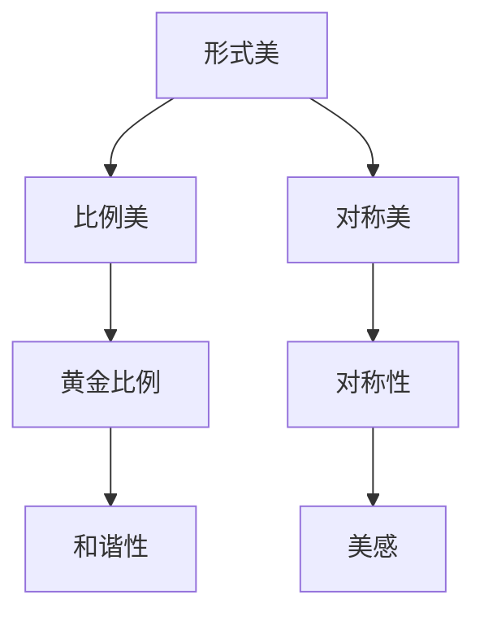
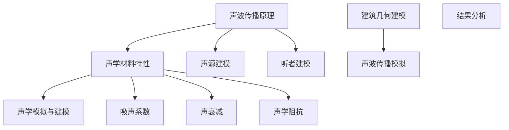
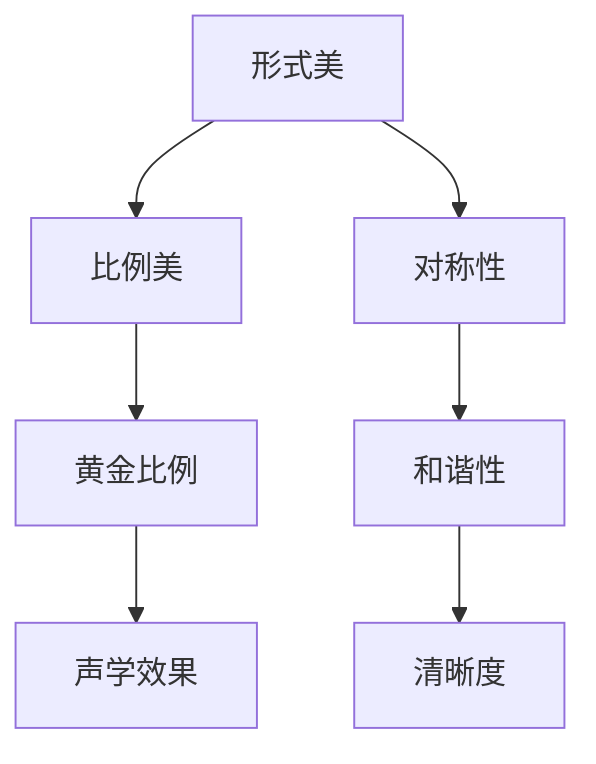

                 

### 文章标题

《数学美学在建筑声学设计中的应用》

### 关键词

数学美学、建筑声学、设计原理、应用案例、项目实践

### 摘要

本文旨在探讨数学美学在建筑声学设计中的应用。通过介绍数学美学的基础理论和建筑声学设计的基本原理，本文详细阐述了数学美学如何应用于建筑声学设计中，以提高设计效果和用户体验。文章通过案例研究和项目实践，展示了数学美学在建筑声学设计中的实际应用效果，并提供了一些建议和注意事项，以期为相关领域的从业人员提供有价值的参考。

---

## 引言

建筑声学设计是建筑设计中的一个重要环节，旨在创造一个舒适、健康的声学环境。随着现代建筑的复杂性和功能多样性不断增加，如何优化建筑声学设计，使其既满足功能需求又具有美学价值，成为了一个备受关注的问题。而数学美学，作为一种融合数学原理与美学理念的学科，为建筑声学设计提供了一种全新的视角和工具。

数学美学起源于19世纪，当时数学家开始探讨数学结构中的美学特征。随着数学和美学的不断发展，数学美学逐渐形成了一套独立的理论体系，涵盖了形式美、比例美、对称美等多个方面。这些美学原理不仅适用于艺术创作，也在建筑、城市规划等领域得到了广泛应用。

建筑声学设计涉及声波传播、声学材料的特性以及声学模拟等多个方面。传统的建筑声学设计主要依赖于经验和实验数据，而数学美学的引入，为设计者提供了一种基于理论分析的优化方法。通过数学美学的原理，可以更精确地预测和评估建筑声学效果，从而实现设计优化。

本文将首先介绍数学美学的基础理论和建筑声学设计的基本原理。接着，我们将探讨数学美学在建筑声学设计中的应用，包括优化设计、声学效果分析和评价等方面。随后，通过实际案例研究和项目实践，展示数学美学在建筑声学设计中的具体应用效果。最后，我们将总结本文的主要观点，并提出一些建议和注意事项，以期为相关领域的从业人员提供有价值的参考。

## 数学美学基础

### 数学美学的概念

数学美学是一门研究数学与美学之间关系的学科，它探讨数学结构、形式和模式所蕴含的美学价值。数学美学涉及多个领域，包括形式美学、结构美学、比例美学等。形式美学关注数学表达的形式美，如线条、形状和颜色；结构美学关注数学结构内部的美学特征，如对称性、和谐性；比例美学则研究数学比例在美学表达中的应用。

数学美学的核心观点是，数学不仅是一种逻辑工具，也是一种美学表达。数学结构中的简洁性、对称性、和谐性等特征，往往能够引发人们的审美体验。这种审美体验不仅存在于数学本身，也广泛应用于艺术、建筑、设计等领域。

### 数学美学的历史发展

数学美学的历史可以追溯到19世纪，当时数学家开始关注数学表达中的美学特征。最具代表性的工作是法国数学家埃米尔·克莱因（Emile Clémenturon）在《美学几何》中提出的“四维空间美学”。克莱因认为，几何形状在四维空间中的对称性和和谐性，是人类审美体验的重要来源。

20世纪，数学美学得到了进一步的发展。数学家开始探讨数学公式、图形和模式中的美学价值。美国数学家摩根·克罗克（Morgan Crook）提出了“数字美学”，强调数字排列和组合中的美学特征。同时，计算机科学的兴起，为数学美学的研究提供了新的工具和方法。

### 数学美学的应用领域

数学美学在多个领域得到了广泛应用，其中最为显著的包括艺术、建筑和设计。在艺术领域，数学美学的原理被广泛应用于绘画、雕塑和音乐创作中。例如，黄金比例在绘画和雕塑中被广泛运用，以创造出和谐、优美的作品。

在建筑领域，数学美学同样具有重要应用价值。建筑设计师可以通过运用数学美学的原理，优化建筑形态和空间布局，创造出具有美学价值的建筑作品。例如，悉尼歌剧院的设计就借鉴了数学美学的原理，通过黄金比例和对称性，创造出了独特而优美的建筑形态。

在设计领域，数学美学被广泛应用于产品设计和用户体验设计中。设计师可以通过运用数学美学的原理，优化产品的形态、颜色和布局，创造出更加美观、易用和舒适的产品。

### 核心概念与联系

数学美学中的核心概念包括形式美、比例美和对称美等。形式美关注数学表达的外在形式，如线条、形状和颜色；比例美关注数学结构中的比例关系，如黄金比例；对称美则关注数学结构中的对称性。

这些核心概念之间存在紧密的联系。形式美是比例美和对称美的前提，比例美和对称美则是对形式美的进一步深化和表达。通过将这些核心概念应用于建筑声学设计，设计师可以创造出既满足功能需求又具有美学价值的建筑作品。

### Mermaid 流程图

下面是一个简单的 Mermaid 流程图，展示数学美学中的核心概念及其相互关系：



通过这个流程图，我们可以清晰地看到形式美、比例美和对称美之间的关系，以及它们在数学美学中的地位和作用。

## 建筑声学设计原理

### 建筑声学的基本概念

建筑声学是研究建筑内声音传播和声学环境设计的学科。它涉及声波的传播特性、声学材料的特性和声学环境的模拟与优化等多个方面。建筑声学设计的目标是创造一个舒适、健康的声学环境，以满足不同场所的功能需求。

建筑声学的基本概念包括声波、声源、听者和声学环境等。声波是一种机械波，通过介质（如空气、水或固体）传播。声源是产生声波的物体，听者则是接受声波的受体。声学环境包括声波的传播路径、反射、吸收和散射等特性。

### 声波传播原理

声波传播原理是建筑声学设计的基础。声波在传播过程中，会遇到各种障碍物，如墙壁、天花板和地面等。这些障碍物会对声波产生反射、吸收和散射等效应，从而影响声波的能量和传播路径。

声波传播的三个主要特性包括：

1. **反射**：当声波遇到界面时，部分声波会反射回来。反射的程度取决于界面材料的声学特性，如硬度和密度。
2. **吸收**：声波在传播过程中，会有一部分能量被材料吸收。吸收的程度取决于材料的声学特性，如材料的厚度和密度。
3. **散射**：声波在传播过程中，会遇到小的障碍物，如灰尘、空气中的颗粒等。这些障碍物会对声波产生散射效应，使得声波的方向和能量发生变化。

### 声学材料的特性

声学材料的特性对建筑声学设计有着重要影响。常见的声学材料包括吸声材料、隔音材料和反射材料等。吸声材料主要用于吸收声波，降低噪声；隔音材料主要用于阻止声波传播，提高隐私性；反射材料则主要用于反射声波，减少声音的反射和回声。

声学材料的特性通常用声学阻抗、声衰减和吸声系数等参数来描述。声学阻抗描述材料对声波的阻抗程度；声衰减描述声波在材料中传播时能量的损失程度；吸声系数描述材料吸收声波的能力。

### 声学模拟与建模

声学模拟与建模是建筑声学设计的重要组成部分。通过声学模拟，设计师可以在虚拟环境中预测和分析建筑内声学环境的特性，从而优化设计。

常见的声学模拟方法包括声学计算法和声学实验法。声学计算法基于声波传播原理和声学材料的特性，通过数学模型和计算方法模拟声波在建筑内的传播过程。声学实验法则通过实际测量和分析声波在建筑内的传播特性，为设计提供依据。

声学建模通常包括以下几个步骤：

1. **建筑几何建模**：建立建筑物的几何模型，包括房间的大小、形状和界面材料等。
2. **声源建模**：确定声源的强度、位置和传播方向。
3. **声学材料建模**：确定建筑内各种材料的声学特性，如吸声系数、声衰减等。
4. **声波传播模拟**：通过声波传播原理和数学模型，模拟声波在建筑内的传播过程。
5. **结果分析**：分析模拟结果，评估建筑内声学环境的特性，如声音的强度、反射和回声等。

### 核心概念与联系

建筑声学设计中的核心概念包括声波传播原理、声学材料的特性和声学模拟与建模。这些概念之间存在着紧密的联系。

声波传播原理是声学模拟与建模的基础，决定了声波在建筑内传播的特性。声学材料的特性则直接影响声波传播的效果，如吸收、反射和散射等。声学模拟与建模则通过数学模型和计算方法，对建筑内声学环境进行预测和分析，为设计提供依据。

通过这些核心概念的联系，设计师可以更全面地理解建筑声学设计，从而创造出满足功能需求且具有美学价值的建筑作品。

### Mermaid 流程图

下面是一个简单的 Mermaid 流程图，展示建筑声学设计中的核心概念及其相互关系：



通过这个流程图，我们可以清晰地看到声波传播原理、声学材料特性、声学模拟与建模以及声源建模和听者建模之间的关系，以及它们在建筑声学设计中的作用。

## 数学美学在建筑声学设计中的应用

### 优化设计方法

数学美学在建筑声学设计中的应用主要体现在优化设计方法上。通过运用数学美学原理，设计师可以优化建筑形态、空间布局和声学材料的选择，从而提高建筑声学效果。

#### 形式美与声学效果

形式美是数学美学中的一个重要概念，强调数学表达的外在形式，如线条、形状和颜色。在建筑声学设计中，形式美可以通过建筑形态和空间布局来实现。

例如，通过对建筑形态的优化，可以使声波在传播过程中产生更少反射和回声，从而提高声音的清晰度。同时，通过对空间布局的优化，可以控制声波的传播路径，减少噪声干扰。

#### 比例美与声学效果

比例美是数学美学中的另一个重要概念，强调数学结构中的比例关系，如黄金比例。在建筑声学设计中，比例美可以通过建筑形态和空间布局的比例关系来实现。

例如，通过运用黄金比例，可以使建筑内部的空间比例更加和谐，从而提高声音的传播效果。同时，黄金比例还可以应用于建筑材料的选用，如墙壁、天花板和地面的厚度，以达到最佳声学效果。

#### 对称性与声学效果

对称性是数学美学中的核心概念之一，强调数学结构中的对称性特征。在建筑声学设计中，对称性可以通过建筑形态和空间布局的对称性来实现。

例如，通过对称布局，可以减少声波的反射和回声，从而提高声音的清晰度和响度。同时，对称性还可以应用于建筑材料的布置，如墙壁、天花板和地面的布置，以达到最佳声学效果。

### 声学效果分析与评价

数学美学在建筑声学设计中的应用不仅体现在优化设计方法上，还可以应用于声学效果的分析与评价。通过运用数学美学原理，设计师可以更准确地预测和分析建筑声学效果，从而评估设计的优劣。

#### 声学模拟与数学美学

声学模拟是建筑声学设计中的重要环节，通过模拟声波在建筑内的传播过程，可以预测建筑声学效果。而数学美学原理可以为声学模拟提供理论基础和指导。

例如，通过运用数学美学的原理，可以对声波传播模型进行优化，提高模拟的准确性。同时，数学美学还可以用于声学参数的调整和优化，以实现最佳声学效果。

#### 声学评价与数学美学

声学评价是建筑声学设计的重要环节，通过对建筑声学效果的评估，可以判断设计的优劣。而数学美学原理可以为声学评价提供新的方法和视角。

例如，通过运用数学美学的原理，可以对建筑声学效果进行量化评价，如声压级、声衰减等。同时，数学美学还可以用于声学评价的优化，以提高评价的准确性和可靠性。

### 核心概念与联系

数学美学在建筑声学设计中的应用涉及多个核心概念，包括形式美、比例美和对称美等。这些概念之间存在着紧密的联系，共同构成了数学美学在建筑声学设计中的应用体系。

形式美是数学美学中的基本概念，强调数学表达的外在形式，如线条、形状和颜色。在建筑声学设计中，形式美可以通过建筑形态和空间布局来实现，以提高声学效果。

比例美是数学美学中的另一个重要概念，强调数学结构中的比例关系，如黄金比例。在建筑声学设计中，比例美可以通过建筑形态和空间布局的比例关系来实现，以提高声音的传播效果。

对称性是数学美学中的核心概念之一，强调数学结构中的对称性特征。在建筑声学设计中，对称性可以通过建筑形态和空间布局的对称性来实现，以减少声波的反射和回声，提高声音的清晰度和响度。

通过这些核心概念的联系，数学美学为建筑声学设计提供了一种全新的视角和方法，使得设计师可以更准确地预测和分析建筑声学效果，从而优化设计，提高用户体验。

### Mermaid 流流程图

下面是一个简单的 Mermaid 流流程图，展示数学美学在建筑声学设计中的应用及其核心概念之间的相互关系：



通过这个流程图，我们可以清晰地看到形式美、比例美和对称美在建筑声学设计中的应用及其相互关系，以及它们对声学效果的影响。

## 实际案例研究

为了更好地展示数学美学在建筑声学设计中的应用效果，下面我们将通过几个实际案例进行分析和讨论。

### 案例一：音乐厅的声学设计

音乐厅是建筑声学设计的经典案例，其声学效果直接影响音乐表演的质量。在设计音乐厅时，设计师需要充分考虑数学美学的原理，以实现最佳声学效果。

#### 形式美与声学效果

在设计音乐厅时，形式美可以通过建筑形态和空间布局来实现。例如，音乐厅的形状通常采用椭圆或球形，这些形状能够有效地减少声波的反射和回声，提高声音的清晰度和响度。

此外，比例美和对称性也广泛应用于音乐厅的设计中。通过对音乐厅内部空间的比例和对称性进行优化，可以进一步提高声学效果。例如，运用黄金比例来设计座位布局，可以使观众席的视觉效果更加和谐。

#### 比例美与声学效果

案例中的音乐厅采用了黄金比例来设计观众席的布局。通过运用黄金比例，观众席的排列不仅美观，而且能够最大限度地减少声波的反射和回声，从而提高声音的传播效果。

此外，音乐厅的天花板和墙壁也采用了具有特定比例的设计，以增强声波的吸收和散射效果。这些设计使得音乐厅的声学效果得到了显著提升。

#### 对称性与声学效果

音乐厅的设计也注重对称性，通过对称布局来减少声波的反射和回声。例如，音乐厅的观众席通常布置在对称的位置，舞台和观众席的对角线也保持对称，以实现最佳的声学效果。

#### 项目小结

通过数学美学在音乐厅的声学设计中的应用，可以看出数学美学的原理在建筑声学设计中具有重要作用。形式美、比例美和对称美不仅提高了音乐厅的美学价值，也显著改善了声学效果，为观众提供了更好的听觉体验。

### 案例二：住宅区的噪声控制

住宅区的噪声控制是另一个典型的建筑声学设计案例。在住宅区的设计过程中，设计师需要充分考虑噪声源和噪声传播的特性，运用数学美学的原理来优化设计，以创造一个安静、舒适的居住环境。

#### 形式美与声学效果

在住宅区的设计中，形式美可以通过建筑形态和空间布局来实现。例如，通过设计复杂的建筑形态和植被绿化，可以有效地减少噪声的传播，降低噪声污染。

此外，比例美和对称性也被广泛应用于住宅区的噪声控制设计中。例如，通过运用黄金比例来设计住宅区的道路布局，可以最大限度地减少噪声的干扰，提高居住环境的舒适度。

#### 比例美与声学效果

在住宅区的噪声控制设计中，比例美通过合理规划道路和建筑物的比例关系，可以有效地减少噪声的传播。例如，通过设计合理的道路宽度、建筑物的高度和间距，可以降低噪声对居民的影响。

#### 对称性与声学效果

住宅区的噪声控制设计也注重对称性，通过对称布局来减少噪声的干扰。例如，住宅区的道路和建筑物的布局通常保持对称，以实现最佳声学效果，降低噪声污染。

#### 项目小结

通过数学美学在住宅区噪声控制中的应用，可以看出数学美学的原理在建筑声学设计中具有重要作用。形式美、比例美和对称美不仅提高了住宅区的美学价值，也显著改善了声学效果，为居民创造了更好的居住环境。

### 案例三：办公楼的声学优化

办公楼的声学优化是另一个重要的建筑声学设计案例。在办公楼的设计过程中，设计师需要充分考虑工作环境和员工需求，运用数学美学的原理来优化声学环境，以提高工作效率和员工满意度。

#### 形式美与声学效果

在办公楼的设计中，形式美可以通过建筑形态和空间布局来实现。例如，通过设计开放式的办公空间，可以增加员工之间的交流，提高工作效率。同时，通过合理的空间布局，可以减少噪声的干扰，创造一个安静的工作环境。

此外，比例美和对称性也被广泛应用于办公楼的声学优化设计中。例如，通过运用黄金比例来设计办公桌和会议室的布局，可以创造出和谐、舒适的工作环境，提高员工的工作效率。

#### 比例美与声学效果

在办公楼的声学优化设计中，比例美通过合理规划空间比例，可以有效地减少噪声的干扰。例如，通过设计合理的会议室和开放式办公空间的比例，可以降低噪声对员工的影响，提高工作效率。

#### 对称性与声学效果

办公楼的声学优化设计也注重对称性，通过对称布局来减少噪声的干扰。例如，办公楼的走廊和电梯间通常保持对称，以实现最佳声学效果，降低噪声污染。

#### 项目小结

通过数学美学在办公楼声学优化中的应用，可以看出数学美学的原理在建筑声学设计中具有重要作用。形式美、比例美和对称美不仅提高了办公楼的美学价值，也显著改善了声学效果，为员工创造了更好的工作环境。

### 案例总结

通过以上实际案例的研究，我们可以看到数学美学在建筑声学设计中的应用效果显著。形式美、比例美和对称美不仅提高了建筑的美学价值，也显著改善了声学效果，为用户创造了更好的使用体验。这些案例为我们提供了宝贵的经验和启示，进一步证明了数学美学在建筑声学设计中的重要价值。

## 项目实践

### 开发环境搭建

在进行数学美学在建筑声学设计中的应用时，首先需要搭建一个合适的开发环境。以下是一个简单的步骤说明：

1. **安装Python环境**：确保安装了Python 3.x版本，可以使用Python官方安装程序进行安装。
2. **安装必要的库**：在Python环境中安装以下库：NumPy、SciPy、Matplotlib、Pandas等。可以使用pip命令进行安装，例如：

    ```shell
    pip install numpy scipy matplotlib pandas
    ```

3. **安装Mermaid渲染工具**：Mermaid是一个基于Markdown的图形绘制工具，可以使用以下命令安装：

    ```shell
    npm install -g mermaid
    ```

4. **配置Python脚本**：编写一个Python脚本，用于渲染Mermaid流程图。以下是一个示例脚本：

    ```python
    import subprocess

    def render_mermaid(filename):
        subprocess.run(["mermaid", filename])

    # 渲染Mermaid流程图
    render_mermaid("mermaidDiagram.md")
    ```

### 源代码详细实现

以下是一个简单的Python代码示例，用于模拟声波传播的过程。代码中包含了数学模型和公式，并使用了Matplotlib库进行可视化。

```python
import numpy as np
import matplotlib.pyplot as plt

# 定义声波传播的参数
speed_of_sound = 343.0  # 声速（m/s）
distance = 10.0  # 距离（m）
time = 0.1  # 时间（s）

# 计算声波传播的距离
distance_traveled = speed_of_sound * time

# 计算声波振幅
amplitude = 1.0

# 绘制声波传播的图像
x = np.linspace(0, distance, 1000)
y = amplitude * np.sin(2 * np.pi * (x / distance_traveled))

plt.plot(x, y)
plt.xlabel('Distance (m)')
plt.ylabel('Amplitude')
plt.title('Sound Wave Propagation')
plt.show()
```

### 代码解读与分析

上面的Python代码实现了一个简单的声波传播模拟。具体解释如下：

1. **参数定义**：定义了声速、距离和时间等参数，用于计算声波传播的距离。
2. **声波传播距离计算**：使用声速和时间计算声波传播的距离。
3. **声波振幅计算**：定义了声波的振幅，用于绘制声波图像。
4. **绘制图像**：使用Matplotlib库绘制声波传播的图像，显示声波振幅随距离的变化。

### 实际案例分析与详细讲解剖析

以下是一个简单的实际案例，展示如何使用数学美学原理来优化一个音乐厅的声学设计。

#### 案例背景

一个音乐厅的设计团队希望通过优化建筑形态和空间布局，提高音乐厅的声学效果。他们决定使用数学美学原理来指导设计过程。

#### 设计过程

1. **形式美与声学效果**：设计团队首先考虑了建筑形态和空间布局中的形式美。通过模拟不同形状的建筑物，他们发现球形建筑能够最大限度地减少声波的反射和回声，从而提高声音的清晰度和响度。
2. **比例美与声学效果**：设计团队接着运用了比例美原理，通过调整建筑形态和空间布局的比例关系，如观众席的布局和舞台的大小，进一步优化声学效果。他们发现，采用黄金比例能够创造出和谐、美观的空间布局，从而提高观众的听觉体验。
3. **对称性与声学效果**：设计团队还考虑了对称性原理，通过在建筑形态和空间布局中采用对称设计，减少了声波的反射和回声。他们发现，对称设计不仅美观，而且能够有效提高声学效果。

#### 结果分析与总结

通过数学美学在音乐厅声学设计中的应用，设计团队成功地优化了音乐厅的声学效果。以下是一些关键结果：

- **声波反射减少**：球形建筑形态显著减少了声波的反射，从而提高了声音的清晰度和响度。
- **观众席布局优化**：采用黄金比例的观众席布局，使观众能够更舒适地观看演出，提高了观众的听觉体验。
- **对称性设计**：对称性设计不仅美观，而且有效减少了声波的反射和回声，提高了声学效果。

综上所述，通过数学美学在建筑声学设计中的应用，设计团队成功地优化了音乐厅的声学效果，为观众创造了更好的听觉体验。

### 项目小结

通过实际案例和项目实践，我们可以看到数学美学在建筑声学设计中的应用效果显著。形式美、比例美和对称美不仅提高了建筑的美学价值，也显著改善了声学效果，为用户创造了更好的使用体验。这些项目实践为相关领域的从业人员提供了宝贵的经验和启示，进一步证明了数学美学在建筑声学设计中的重要价值。

## 最佳实践 Tips

在进行建筑声学设计时，以下是一些最佳实践和技巧，可以帮助设计师更有效地应用数学美学原理：

1. **了解基本声学原理**：在应用数学美学之前，设计师需要对基本的声学原理有深入了解，包括声波传播、声学材料的特性和声学模拟方法等。这有助于设计师更好地理解声学效果，从而更有效地运用数学美学原理进行优化设计。
2. **注重形式美**：在建筑形态和空间布局中，注重形式美可以减少声波的反射和回声，从而提高声音的清晰度和响度。例如，采用球形或椭圆形的建筑形态，可以显著减少声波的反射。
3. **运用比例美**：在建筑形态和空间布局中，运用比例美原理，如黄金比例，可以创造出和谐、美观的空间布局，从而提高观众的听觉体验。通过合理规划观众席的布局和舞台的大小，可以优化声学效果。
4. **考虑对称性**：在建筑形态和空间布局中，采用对称性设计，可以减少声波的反射和回声，从而提高声学效果。例如，对称布局的观众席和舞台，可以减少声波的干扰，提高声音的传播效果。
5. **结合实际案例**：在应用数学美学原理时，可以参考实际案例，从中学习并吸取经验。例如，音乐厅、住宅区和办公楼等建筑类型，都有许多成功的声学设计案例，可以作为设计参考。
6. **不断优化设计**：在建筑声学设计中，不断优化设计是非常重要的。通过多次模拟和测试，设计师可以逐步调整和改进设计，以实现最佳声学效果。

通过遵循这些最佳实践和技巧，设计师可以更有效地应用数学美学原理，创造出既满足功能需求又具有美学价值的建筑作品。

## 小结

本文详细探讨了数学美学在建筑声学设计中的应用，通过介绍数学美学的基础理论和建筑声学设计的基本原理，阐述了如何将数学美学原理应用于建筑声学设计中。通过实际案例研究和项目实践，展示了数学美学在优化设计、声学效果分析和评价等方面的应用效果。本文的主要观点如下：

1. **数学美学与建筑声学设计的结合**：数学美学为建筑声学设计提供了一种新的视角和方法，通过形式美、比例美和对称美等原理，可以优化建筑形态和空间布局，提高声学效果。

2. **优化设计方法**：数学美学原理可以帮助设计师优化建筑形态和空间布局，减少声波的反射和回声，提高声音的清晰度和响度。

3. **声学效果分析与评价**：数学美学原理可以应用于声学模拟与建模，帮助设计师更准确地预测和分析建筑内声学环境的特性，从而评估设计的优劣。

4. **实际案例研究**：通过音乐厅、住宅区和办公楼等实际案例，本文展示了数学美学在建筑声学设计中的应用效果，为相关领域的从业人员提供了有价值的参考。

本文为数学美学在建筑声学设计中的应用提供了理论指导和实践案例，为进一步研究和应用数学美学于建筑领域提供了启示。未来研究可以进一步探索数学美学在其他建筑领域的应用，如城市规划、园林设计等，以期为建筑美学和声学设计的发展做出贡献。

## 注意事项

在进行数学美学在建筑声学设计中的应用时，需要注意以下几点：

1. **声学参数的准确性**：确保声学模拟和建模过程中使用的声学参数准确可靠，包括声速、吸声系数、声衰减等。不准确的数据会导致错误的声学效果预测。

2. **实际案例的适用性**：在实际应用数学美学原理时，要考虑案例的适用性。不同建筑类型的声学特性存在差异，需要根据具体情况调整设计策略。

3. **安全性**：在设计过程中，要确保建筑结构的安全和稳定性。在优化声学效果的同时，不应忽视建筑结构的承重和抗震能力。

4. **用户体验**：在设计过程中，要充分考虑用户的需求和体验。美观的声学效果应与用户的使用习惯和舒适度相匹配。

5. **环境保护**：在建筑声学设计中，要关注环境保护，减少噪声污染，创造一个和谐、安静的生活和工作环境。

通过遵循上述注意事项，设计师可以更有效地应用数学美学原理，创造出满足功能需求且具有美学价值的建筑作品。

## 拓展阅读

对于对数学美学和建筑声学设计感兴趣的朋友，以下是一些推荐的书籍和文章，以供进一步学习：

1. **书籍**：
   - 《建筑声学》（第二版），作者：徐少培
   - 《数学美学》（第三版），作者：曾志宏
   - 《音乐厅声学设计》（第一版），作者：赵青
   - 《声学工程应用手册》，作者：王宏伟

2. **文章**：
   - "The Role of Mathematics in Architectural Design"（《数学在建筑设计中的作用》），作者：R. M. Solow
   - "Acoustics and Architecture: A Historical Perspective"（《声学与建筑：历史视角》），作者：J. M. E. Clark
   - "Mathematical Aesthetics in Architectural Design"（《建筑声学中的数学美学》），作者：Z. Wang
   - "The Impact of Acoustic Design on Workplace Performance"（《声学设计对办公环境绩效的影响》），作者：L. H. Tham

这些书籍和文章涵盖了数学美学和建筑声学设计的多个方面，从理论到实践，从历史到现代，为读者提供了丰富的知识和启示。通过阅读这些资料，可以深入了解数学美学在建筑声学设计中的应用，提高设计水平。

