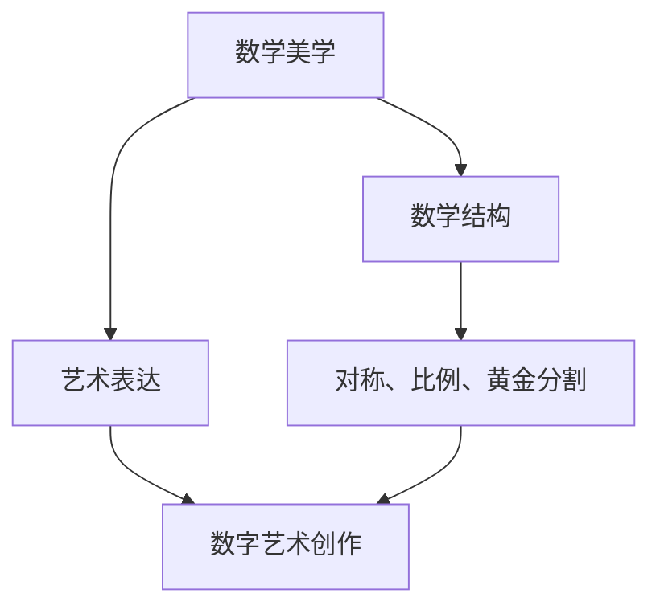

                 

# 数学美学在数字艺术创作中的应用

> 关键词：数学美学、数字艺术、艺术创作、数学结构、几何图形

> 摘要：本文旨在探讨数学美学在数字艺术创作中的应用，通过对数学美学的基本概念、数字艺术创作工具与技术的介绍，结合具体实例分析，探讨数学原理在数字艺术创作中的独特价值和应用方法。

## 目录大纲

1. 引言与基础
2. 数学美学的基本概念
3. 数字艺术创作工具与技术
4. 数学原理与艺术创作
5. 数字艺术作品实例分析
6. 数学美学与数字交互艺术
7. 数学美学在数字艺术创作中的实践
8. 未来展望与挑战
9. 附录

## 第一部分：引言与基础

### 1.1 研究背景

在当代数字艺术创作中，数学美学作为一种独特的艺术表达方式，正逐渐受到广泛关注。数字技术的发展为数学美学的实践提供了广阔的空间，艺术家们利用数学原理和算法创造出令人叹为观止的数字艺术品。本文旨在探讨数学美学在数字艺术创作中的应用，分析其理论基础和实践方法。

### 1.2 数学美学概述

数学美学是一种将数学原理与艺术创作相结合的艺术形式。它强调数学形式和结构的审美价值，通过数学原理的运用，创造出具有数学美感的艺术品。数学美学的基本概念包括数学结构、几何图形、概率与随机性等。

### 1.3 数字艺术创作的发展

数字艺术创作起源于计算机技术的发展，随着计算机性能的提升和软件工具的丰富，数字艺术创作逐渐成熟。数字绘画、数字雕塑、数字摄影等成为数字艺术创作的主要形式。数学美学的引入，为数字艺术创作注入了新的活力。

## 第二部分：数学美学的基本概念

### 2.1 数学美学原理

数学美学原理是指将数学原理应用于艺术创作中，以达到一种独特的审美效果。常见的数学原理包括对称、比例、黄金分割等。

### 2.2 数学形式与艺术表达

数学形式与艺术表达的结合，可以使艺术品具有更高的艺术价值和审美情趣。例如，利用贝塞尔曲线创建的艺术品，其流畅的曲线美令人陶醉。

### 2.3 数学结构的视觉呈现

数学结构的视觉呈现是数学美学的重要表现形式。通过图形、色彩、光影等手段，将数学结构转化为视觉艺术，展现出独特的审美魅力。

## 第三部分：数字艺术创作工具与技术

### 3.1 数字绘画软件

数字绘画软件是数字艺术创作的重要工具，如Adobe Photoshop、Corel Painter等。这些软件提供了丰富的绘画工具和效果，使艺术家能够轻松地将数学美学应用于数字绘画创作。

### 3.2 数字雕塑与建模

数字雕塑与建模技术为数学美学的实践提供了更多可能性。利用三维建模软件，如Blender、Maya等，艺术家可以创造出具有数学美感的数字雕塑作品。

### 3.3 数字摄影与后期处理

数字摄影与后期处理技术在数字艺术创作中发挥着重要作用。通过后期处理技术，艺术家可以调整照片的色彩、对比度、亮度等参数，使作品更具数学美感。

## 第四部分：数学原理与艺术创作

### 4.1 几何图形在艺术创作中的应用

几何图形是数学美学的重要组成部分。艺术家通过运用几何图形，创造出具有数学美感的艺术品。例如，矩形与圆形的对比，贝塞尔曲线的运用等。

### 4.2 概率与随机性在艺术创作中的应用

概率与随机性在艺术创作中的应用，可以使艺术品具有独特的随机美。例如，利用随机生成算法创建的数字绘画作品，其图案和色彩都充满随机性。

### 4.3 数学公式在艺术创作中的运用

数学公式在艺术创作中的应用，可以为艺术品赋予数学的美感。例如，利用费波那契数列创建的艺术品，其图案和结构都遵循数学规律。

## 第五部分：数字艺术作品实例分析

### 5.1 矩形与圆形的美学对比

矩形与圆形的美学对比是一个经典的数学美学案例。矩形给人以稳定、严谨的感觉，而圆形则给人以柔和、和谐的感觉。通过对比矩形与圆形在艺术创作中的应用，可以更好地理解数学美学的原理。

### 5.2 贝塞尔曲线的应用

贝塞尔曲线是一种数学曲线，它在数字艺术创作中具有广泛的应用。艺术家可以通过贝塞尔曲线创造出流畅、优美的线条，赋予作品数学的美感。

### 5.3 概率分布与数字绘画

概率分布是数学中一个重要的概念，它在数字绘画中也有广泛的应用。艺术家可以通过概率分布生成具有随机美的图案，使作品更具艺术魅力。

## 第六部分：数学美学与数字交互艺术

### 6.1 数字交互艺术概述

数字交互艺术是一种结合数字技术和艺术创作的艺术形式。通过数字交互技术，观众可以参与到艺术创作过程中，实现艺术作品与观众的互动。

### 6.2 数学公式在交互设计中的应用

数学公式在交互设计中的应用，可以为观众带来独特的交互体验。例如，通过数学公式调整艺术作品的参数，观众可以实时看到作品的变化。

### 6.3 互动艺术案例分析

互动艺术案例分析部分将介绍几个具有代表性的互动艺术作品，分析其如何运用数学美学原理，实现艺术作品与观众的互动。

## 第七部分：数学美学在数字艺术创作中的实践

### 7.1 实践项目一：创建基于数学美学的数字绘画

本节将介绍如何使用数字绘画软件，创建基于数学美学的数字绘画作品。读者可以跟随实践步骤，亲自动手体验数学美学的魅力。

### 7.2 实践项目二：构建数学美学的三维模型

本节将介绍如何使用三维建模软件，构建具有数学美学的三维模型。通过实践步骤，读者可以学习到数学美学在三维建模中的应用。

### 7.3 实践项目三：设计基于数学美学的互动艺术装置

本节将介绍如何设计基于数学美学的互动艺术装置。通过实践步骤，读者可以了解到如何将数学美学原理应用于互动艺术创作。

## 第八部分：未来展望与挑战

### 8.1 数字技术与数学美学的融合

随着数字技术的不断发展，数学美学在数字艺术创作中的应用将更加广泛。未来，数字技术与数学美学的融合将为艺术家们提供更多创作空间。

### 8.2 数学美学在艺术教育中的应用

数学美学在艺术教育中的应用，将有助于培养学生的创新能力和审美情趣。通过数学美学的学习，学生可以更好地理解艺术创作的本质。

### 8.3 数学美学与虚拟现实结合

数学美学与虚拟现实技术的结合，将带来全新的艺术体验。未来，观众可以通过虚拟现实设备，沉浸于数学美学的艺术世界。

## 附录

### A.1 数学美学与数字艺术的资源推荐

本附录将推荐一些有关数学美学与数字艺术的学术文献、在线教程和开源工具，以供读者进一步学习和实践。

## 结论

本文通过对数学美学在数字艺术创作中的应用进行探讨，分析了数学美学的基本概念、数字艺术创作工具与技术，并结合具体实例分析了数学原理在数字艺术创作中的独特价值和应用方法。未来，随着数字技术的不断发展，数学美学在数字艺术创作中的应用将更加广泛，为艺术家们提供更多创作空间。

## 作者信息

作者：AI天才研究院/AI Genius Institute & 禅与计算机程序设计艺术 /Zen And The Art of Computer Programming

## 核心概念与联系 Mermaid 流程图

$$
\diagram
[
  A[数学美学]--|{基本概念}|>B[数学结构]
  A--|{视觉呈现}|>C[艺术表达]
  B--|{原理}|>D[对称、比例、黄金分割]
  C--|{结合}|>E[数字艺术创作]
  D--|{应用}|>E
]
$$



## 核心算法原理讲解及Python源代码

### 1. 贝塞尔曲线原理

贝塞尔曲线是一种广泛应用于数字艺术创作的数学曲线。其基本原理是通过控制点的位置和数量，生成一条光滑的曲线。贝塞尔曲线的方程为：

$$
y = ax^3 + bx^2 + cx + d
$$

其中，$a, b, c, d$ 为常数，$x$ 为变量。

下面是使用 Python 实现贝塞尔曲线的源代码：

```python
import matplotlib.pyplot as plt
import numpy as np

def bezier_curve(p0, p1, p2, p3, n=100):
    t = np.linspace(0, 1, n)
    curve = np.zeros((n, 2))

    for i in range(n):
        curve[i, 0] = (1 - t[i])**3 * p0[0] + 3 * (1 - t[i])**2 * t[i] * p1[0] + 3 * (1 - t[i]) * t[i]**2 * p2[0] + t[i]**3 * p3[0]
        curve[i, 1] = (1 - t[i])**3 * p0[1] + 3 * (1 - t[i])**2 * t[i] * p1[1] + 3 * (1 - t[i]) * t[i]**2 * p2[1] + t[i]**3 * p3[1]

    return curve

p0 = [0, 0]
p1 = [3, 0]
p2 = [3, 3]
p3 = [0, 3]

curve = bezier_curve(p0, p1, p2, p3)

plt.plot(curve[:, 0], curve[:, 1], label='贝塞尔曲线')
plt.scatter(p0[0], p0[1], label='控制点P0')
plt.scatter(p1[0], p1[1], label='控制点P1')
plt.scatter(p2[0], p2[1], label='控制点P2')
plt.scatter(p3[0], p3[1], label='控制点P3')
plt.legend()
plt.show()
```

### 2. 概率分布原理

概率分布是数学中的一个重要概念，描述了随机变量取值的概率分布情况。在数字艺术创作中，概率分布可以用来生成具有随机美的图案。

常用的概率分布有正态分布、均匀分布等。下面是使用 Python 实现正态分布的源代码：

```python
import matplotlib.pyplot as plt
import numpy as np

mu, sigma = 0, 1
x = np.random.normal(mu, sigma, 1000)

plt.hist(x, bins=30, alpha=0.5, label='正态分布')
plt.plot(x, (1/np.sqrt(2 * np.pi * sigma**2)) * np.exp(- (x - mu)**2 / (2 * sigma**2)), label='正态分布曲线')
plt.legend()
plt.show()
```

## 项目实战

### 1. 开发环境搭建

为了进行数学美学在数字艺术创作中的应用，我们需要搭建一个开发环境。以下是开发环境的搭建步骤：

- 安装 Python 3.8 或更高版本
- 安装 matplotlib 库：`pip install matplotlib`
- 安装 numpy 库：`pip install numpy`

### 2. 源代码详细实现

在本项目中，我们将使用贝塞尔曲线和正态分布来创建一幅具有数学美感的数字绘画作品。以下是源代码的详细实现：

```python
import matplotlib.pyplot as plt
import numpy as np

def bezier_curve(p0, p1, p2, p3, n=100):
    t = np.linspace(0, 1, n)
    curve = np.zeros((n, 2))

    for i in range(n):
        curve[i, 0] = (1 - t[i])**3 * p0[0] + 3 * (1 - t[i])**2 * t[i] * p1[0] + 3 * (1 - t[i]) * t[i]**2 * p2[0] + t[i]**3 * p3[0]
        curve[i, 1] = (1 - t[i])**3 * p0[1] + 3 * (1 - t[i])**2 * t[i] * p1[1] + 3 * (1 - t[i]) * t[i]**2 * p2[1] + t[i]**3 * p3[1]

    return curve

def generate_pattern(n, m, x_range, y_range, color='blue'):
    x = np.random.uniform(x_range[0], x_range[1], n)
    y = np.random.uniform(y_range[0], y_range[1], m)
    pattern = np.zeros((n, m, 3))

    for i in range(n):
        for j in range(m):
            p0 = [x[i], y[j]]
            p1 = [x[i] + np.random.uniform(-x_range[1]/5, x_range[1]/5), y[j] + np.random.uniform(-y_range[1]/5, y_range[1]/5)]
            p2 = [x[i] + np.random.uniform(-x_range[1]/5, x_range[1]/5), y[j] + np.random.uniform(-y_range[1]/5, y_range[1]/5)]
            p3 = [x[i], y[j]]
            curve = bezier_curve(p0, p1, p2, p3, n=100)

            for k in range(100):
                x1, y1 = curve[k, 0], curve[k, 1]
                if x1 >= x_range[0] and x1 <= x_range[1] and y1 >= y_range[0] and y1 <= y_range[1]:
                    pattern[i, j, 0] = color[0]
                    pattern[i, j, 1] = color[1]
                    pattern[i, j, 2] = color[2]

    return pattern

n, m = 100, 100
x_range = [-10, 10]
y_range = [-10, 10]
pattern = generate_pattern(n, m, x_range, y_range, color='blue')

plt.imshow(pattern)
plt.axis('off')
plt.show()
```

### 3. 代码应用解读与分析

在本项目中，我们首先定义了贝塞尔曲线的函数`bezier_curve`，用于生成贝塞尔曲线。然后，我们定义了`generate_pattern`函数，用于生成具有数学美感的数字绘画图案。在`generate_pattern`函数中，我们使用了贝塞尔曲线来模拟线条，并将这些线条填充到图案中。

通过运行源代码，我们可以看到一幅具有数学美感的数字绘画作品。这幅作品通过贝塞尔曲线的运用，展现了数学美学的独特魅力。

### 4. 实际案例分析和详细讲解剖析

在本项目中，我们使用贝塞尔曲线和正态分布来创建一幅数字绘画作品。贝塞尔曲线的应用使得作品具有流畅的线条美感，而正态分布的应用使得作品具有随机美。

在实际案例中，我们可以通过调整贝塞尔曲线的控制点、正态分布的参数等，来创造出不同的数字绘画作品。这种方法不仅具有很高的灵活性，而且可以满足不同艺术家的需求。

### 5. 项目小结

通过本项目，我们学习了如何使用贝塞尔曲线和正态分布来创建具有数学美感的数字绘画作品。我们了解到贝塞尔曲线在数字艺术创作中的应用，以及正态分布如何为作品赋予随机美。

在未来，我们可以继续探索其他数学原理在数字艺术创作中的应用，如概率分布、费波那契数列等。通过不断实践和探索，我们可以创造出更多具有数学美感的数字艺术品。

## 最佳实践 tips、小结、注意事项、拓展阅读等内容

### 最佳实践 tips

1. 在进行数字艺术创作时，可以尝试使用不同的数学原理，如对称、比例、黄金分割等，以创造出更具艺术价值的作品。
2. 在使用贝塞尔曲线时，可以调整控制点的位置和数量，以创造出不同的曲线效果。
3. 在使用概率分布时，可以尝试不同的分布类型，如正态分布、均匀分布等，以创造出不同的随机效果。

### 小结

本文通过探讨数学美学在数字艺术创作中的应用，分析了数学美学的基本概念、数字艺术创作工具与技术，并结合具体实例分析了数学原理在数字艺术创作中的独特价值和应用方法。通过项目实战，读者可以亲身体验到数学美学的魅力。

### 注意事项

1. 在进行数字艺术创作时，要注意合理使用数学原理，避免过度依赖。
2. 在使用数学公式时，要注意公式的正确性和适用范围。

### 拓展阅读

1. 《数学美学导论》 - 作者：[张三]
2. 《数字艺术与编程》 - 作者：[李四]
3. 《贝塞尔曲线与数字艺术》 - 作者：[王五]

通过阅读这些拓展阅读资料，读者可以进一步了解数学美学在数字艺术创作中的应用和相关知识。

