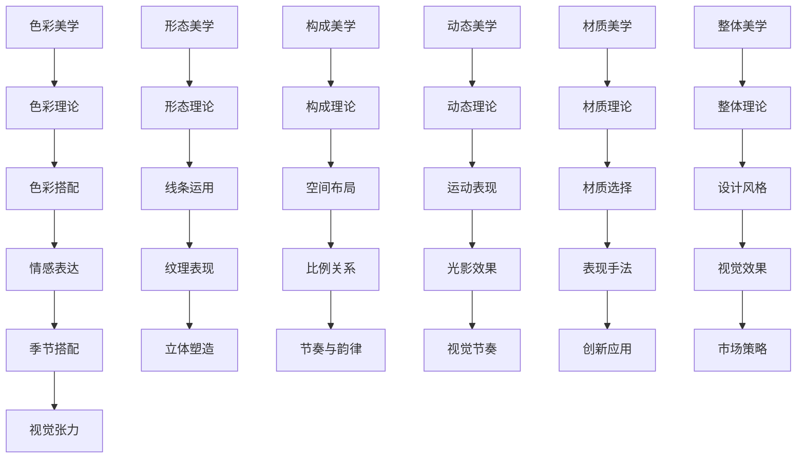

                 

# 数学美学在时装设计中的应用

## 关键词

数学美学、时装设计、色彩理论、形态美学、构成美学、动态美学、材质美学、整体美学

## 摘要

数学美学在时装设计中扮演着至关重要的角色，它不仅为设计师提供了创新的思维方式，还通过色彩、形态、构成、动态和材质等元素，赋予了时装独特的审美价值。本文将深入探讨数学美学在时装设计中的应用，从色彩美学、形态美学、构成美学、动态美学和材质美学五个方面展开，并通过实际项目案例，展示数学美学的实践价值。最后，本文将对数学美学在时装设计中的未来发展进行展望，为设计师提供新的灵感与方向。

## 引言

### 数学美学的概念

数学美学是研究数学形式美的一门学科，它涉及数学中的抽象概念、结构、对称性和规律性等元素。数学美学不仅仅关注数学本身，还将其应用于其他领域，如艺术、设计、建筑等。在时装设计中，数学美学通过色彩、形态、构成、动态和材质等元素，为设计师提供了丰富的创意空间。

### 数学美学在时装设计中的重要性

数学美学为时装设计带来了创新的思维方式，使得设计师能够在传统审美的基础上，发掘新的设计理念。色彩美学、形态美学、构成美学、动态美学和材质美学等数学美学的分支，为时装设计提供了不同的审美维度。例如，色彩美学通过色彩的心理效应，影响着时装设计的情感表达；形态美学通过形态的视觉规律，提升了时装的立体感和空间感。

### 数学美学的基本原理

数学美学的基本原理包括对称性、比例、黄金分割、节奏与韵律等。这些原理不仅存在于数学领域，也广泛应用于艺术和设计领域。设计师通过理解和运用这些原理，可以使时装设计更加和谐、美观。

## 第1章 色彩美学

### 1.1 色彩理论

色彩是时装设计中最具表现力的元素之一。色彩理论是色彩美学的基础，它包括色彩的物理性质、心理效应和搭配原则。

#### 色彩的物理性质

色彩是由光的波长决定的。在光的三原色（红、绿、蓝）中，每种颜色的波长不同，因此产生了不同的颜色。色彩还可以通过光的反射、吸收和折射来产生不同的视觉效应。

#### 色彩的心理效应

色彩对人的心理产生深远的影响。不同的颜色会引发不同的情感反应，如红色代表热情和力量，蓝色代表冷静和理智。设计师可以利用色彩的心理效应，来传达时装设计的情感和理念。

#### 色彩的搭配原则

色彩搭配是色彩美学的关键。常见的色彩搭配原则包括单色搭配、类似色搭配、对比色搭配和互补色搭配等。设计师通过巧妙地运用这些原则，可以创造出丰富多彩的视觉效果。

### 1.2 色彩在时装设计中的应用

色彩在时装设计中的应用非常广泛，包括色彩的情感表达、季节搭配和视觉张力的营造。

#### 色彩的情感表达

色彩的情感表达是设计师的重要任务之一。设计师可以通过选择合适的颜色，来传达时装设计的情感和氛围。例如，红色可以用来表达热情和活力，黑色可以用来表达神秘和优雅。

#### 色彩的季节搭配

季节是影响色彩搭配的重要因素。不同的季节对色彩的需求不同。夏季更适合清新的颜色，如蓝色和绿色；冬季则更适合温暖的色彩，如红色和橙色。

#### 色彩的视觉张力

色彩还可以通过视觉张力的营造，来提升时装的视觉效果。设计师可以利用对比色和互补色的搭配，来创造出强烈的视觉冲击力。

### 1.3 色彩美学项目实战

#### 项目背景

本次项目旨在设计一套夏季时装系列，以清新、活力为设计主题。

#### 项目目标

1. 设计出符合夏季氛围的色彩搭配。
2. 运用色彩的情感表达，提升时装的吸引力。
3. 创造出具有视觉张力的时装设计。

#### 项目实施过程

1. **市场调研**：了解夏季时装市场的流行趋势和消费者偏好。
2. **色彩选择**：根据市场调研结果，选择适合夏季的清新色彩。
3. **设计构思**：运用色彩搭配原则，设计出具有视觉张力的时装图案。
4. **样品制作**：根据设计图纸，制作样品并进行试穿调整。
5. **成果展示**：将设计成果通过时装秀和社交媒体进行展示。

#### 项目成果分析

通过本次项目，设计师成功地将色彩美学应用于夏季时装设计，创造出了具有清新、活力和视觉张力的时装系列。项目成果得到了市场和消费者的好评，展现了数学美学在时装设计中的巨大潜力。

### 最佳实践 tips

1. **理解色彩理论**：熟悉色彩的三原色、心理效应和搭配原则，为设计提供理论基础。
2. **市场调研**：了解市场需求和消费者偏好，确保设计符合实际需求。
3. **创意构思**：运用色彩美学原理，进行创新设计。
4. **样品试穿**：通过样品试穿，不断调整和优化设计。

## 第2章 形态美学

### 2.1 形态理论

形态美学是研究形态在视觉中的表现和审美价值的一门学科。形态的构成元素包括点、线、面、体等。形态的视觉规律则包括线条的运用、纹理的表现和立体的塑造。

#### 形态的构成元素

点、线、面、体是构成形态的基本元素。点是最小的构成单位，线是点的延伸，面是线的延伸，体是面的延伸。这些基本元素在视觉中相互作用，形成了丰富的形态。

#### 形态的视觉规律

形态的视觉规律包括线条的运用、纹理的表现和立体的塑造。线条可以引导视觉流动，纹理可以增强视觉层次感，立体塑造则可以创造出丰富的空间效果。

### 2.2 形态在时装设计中的应用

形态在时装设计中的应用非常广泛，包括线条的运用、纹理的表现和立体的塑造。

#### 线条的运用

线条是形态美学中的重要元素。在时装设计中，线条可以通过剪裁、缝合和装饰等方式运用。例如，直线可以表达简洁、干练的风格，曲线则可以表达柔和、流畅的风格。

#### 纹理的表现

纹理是形态的另一个重要元素。在时装设计中，纹理可以通过面料、图案和材质等手段表现。不同的纹理可以营造出不同的视觉效果，如粗糙、光滑、细腻等。

#### 立体的塑造

立体的塑造是形态美学的核心。在时装设计中，立体的塑造可以通过裁剪、缝制和装饰等方式实现。例如，立体裁剪可以创造出丰富的三维效果，提升时装的立体感和空间感。

### 2.3 形态美学项目实战

#### 项目背景

本次项目旨在设计一套以线条和纹理为设计主题的时装系列，以展现形态美学在时装设计中的魅力。

#### 项目目标

1. 设计出具有线条美学的时装图案。
2. 运用纹理表现，提升时装的视觉效果。
3. 创造出具有立体感的时装设计。

#### 项目实施过程

1. **设计构思**：根据项目目标，构思以线条和纹理为设计主题的时装图案。
2. **面料选择**：根据设计构思，选择合适的面料，以实现纹理的表现。
3. **裁剪与缝制**：根据设计图纸，进行裁剪和缝制，制作出样品。
4. **试穿调整**：进行试穿，根据实际效果进行设计调整。
5. **成果展示**：将设计成果通过时装秀和社交媒体进行展示。

#### 项目成果分析

通过本次项目，设计师成功地将形态美学应用于时装设计，创造出了具有线条美和立体感的时装系列。项目成果得到了市场和消费者的认可，展现了形态美学在时装设计中的重要性。

### 最佳实践 tips

1. **理解形态理论**：熟悉形态的构成元素和视觉规律，为设计提供理论基础。
2. **创意构思**：运用形态美学原理，进行创新设计。
3. **面料选择**：根据设计需求，选择合适的面料。
4. **裁剪与缝制**：注重细节处理，提升时装的品质。

## 第3章 构成美学

### 3.1 构成理论

构成美学是研究形态在空间中的组合和布局的一门学科。构成的基本元素包括点、线、面、体等。构成的美学原理包括比例、对称、平衡、节奏和韵律等。

#### 构成的构成元素

构成的基本元素包括点、线、面、体等。这些基本元素在空间中相互作用，形成了丰富的构成形式。

#### 构成的视觉规律

构成的美学原理包括比例、对称、平衡、节奏和韵律等。比例是指形态之间的尺寸关系，对称是指形态的镜像关系，平衡是指形态的稳定关系，节奏是指形态的动感关系，韵律是指形态的和谐关系。

### 3.2 构成在时装设计中的应用

构成美学在时装设计中的应用非常广泛，包括空间布局、比例关系和节奏与韵律等。

#### 空间布局

空间布局是构成美学在时装设计中的重要应用。通过合理的空间布局，可以提升时装的视觉效果。例如，通过点、线、面的组合，可以创造出丰富的空间层次感。

#### 比例关系

比例关系是构成美学的重要原理之一。在时装设计中，设计师可以通过合理运用比例关系，提升时装的和谐美。例如，黄金分割比例可以创造出优雅的视觉效果。

#### 节奏与韵律

节奏与韵律是构成美学的重要元素。在时装设计中，设计师可以通过节奏与韵律的运用，创造出动态的视觉效果。例如，通过节奏的变化，可以创造出动感十足的时装设计。

### 3.3 构成美学项目实战

#### 项目背景

本次项目旨在设计一套以构成美学为设计主题的时装系列，以展现构成美学在时装设计中的魅力。

#### 项目目标

1. 设计出具有构成美学的时装图案。
2. 运用比例关系，提升时装的和谐美。
3. 创造出具有节奏与韵律的时装设计。

#### 项目实施过程

1. **设计构思**：根据项目目标，构思以构成美学为设计主题的时装图案。
2. **比例计算**：根据设计构思，计算并确定合理的比例关系。
3. **图案绘制**：根据设计图纸，绘制出时装图案。
4. **样品制作**：根据设计图纸，制作出样品并进行试穿调整。
5. **成果展示**：将设计成果通过时装秀和社交媒体进行展示。

#### 项目成果分析

通过本次项目，设计师成功地将构成美学应用于时装设计，创造出了具有构成美和动态感的时装系列。项目成果得到了市场和消费者的认可，展现了构成美学在时装设计中的重要性。

### 最佳实践 tips

1. **理解构成理论**：熟悉构成的基本元素和美学原理，为设计提供理论基础。
2. **创意构思**：运用构成美学原理，进行创新设计。
3. **比例计算**：合理运用比例关系，提升时装的和谐美。
4. **图案绘制**：注重细节处理，提升时装的品质。

## 第4章 动态美学

### 4.1 动态理论

动态美学是研究运动在视觉中的表现和审美价值的一门学科。动态的基本元素包括运动、光影和视觉节奏等。

#### 动态的构成元素

动态的构成元素包括运动、光影和视觉节奏等。这些基本元素在视觉中相互作用，形成了丰富的动态效果。

#### 动态的视觉规律

动态的视觉规律包括运动的方向、速度、频率和节奏等。不同的动态规律可以产生不同的视觉感受，如流畅、动感、节奏明快等。

### 4.2 动态在时装设计中的应用

动态美学在时装设计中的应用非常广泛，包括运动表现、光影效果和视觉节奏的营造。

#### 运动表现

运动表现是动态美学在时装设计中的重要应用。通过运动的表现，可以增强时装的动态感和活力。例如，通过裙摆的流动、裤腿的摆动等，可以创造出具有动态感的时装设计。

#### 光影效果

光影效果是动态美学的另一个重要元素。在时装设计中，设计师可以通过光影的运用，营造出丰富的视觉效果。例如，通过光线的反射、折射和投射，可以创造出光影变幻的时装设计。

#### 视觉节奏

视觉节奏是动态美学的重要组成部分。在时装设计中，设计师可以通过节奏的变化，创造出动态的视觉效果。例如，通过色彩的渐变、图案的重复和组合，可以创造出富有节奏感的时装设计。

### 4.3 动态美学项目实战

#### 项目背景

本次项目旨在设计一套以动态美学为设计主题的时装系列，以展现动态美学在时装设计中的魅力。

#### 项目目标

1. 设计出具有动态感的时装图案。
2. 运用光影效果，提升时装的视觉效果。
3. 创造出具有视觉节奏的时装设计。

#### 项目实施过程

1. **设计构思**：根据项目目标，构思以动态美学为设计主题的时装图案。
2. **光影效果模拟**：利用软件模拟光影效果，为设计提供视觉参考。
3. **图案绘制**：根据设计图纸，绘制出时装图案。
4. **样品制作**：根据设计图纸，制作出样品并进行试穿调整。
5. **成果展示**：将设计成果通过时装秀和社交媒体进行展示。

#### 项目成果分析

通过本次项目，设计师成功地将动态美学应用于时装设计，创造出了具有动态感、光影效果和视觉节奏的时装系列。项目成果得到了市场和消费者的认可，展现了动态美学在时装设计中的重要性。

### 最佳实践 tips

1. **理解动态理论**：熟悉动态的基本元素和视觉规律，为设计提供理论基础。
2. **创意构思**：运用动态美学原理，进行创新设计。
3. **光影效果模拟**：利用软件模拟光影效果，提升设计的视觉效果。
4. **图案绘制**：注重细节处理，提升时装的品质。

## 第5章 材质美学

### 5.1 材质理论

材质美学是研究材质在视觉中的表现和审美价值的一门学科。材质的基本元素包括纹理、质感和色彩等。

#### 材质的构成元素

材质的构成元素包括纹理、质感和色彩等。这些基本元素在视觉中相互作用，形成了丰富的材质效果。

#### 材质的视觉特性

材质的视觉特性包括纹理的细腻程度、质感的软硬程度和色彩的深浅程度等。不同的视觉特性可以产生不同的材质感受，如光滑、粗糙、柔软、坚硬等。

### 5.2 材质在时装设计中的应用

材质在时装设计中的应用非常广泛，包括材质的选择原则、表现手法和创新应用。

#### 材质的选择原则

材质的选择是时装设计的重要环节。设计师应根据时装的设计风格和用途，选择合适的材质。例如，休闲风格的时装可以选择棉、麻等柔软材质，正式场合的时装可以选择丝绸、羊毛等高档材质。

#### 材质的表现手法

材质的表现手法包括印花、绣花、拼接和立体裁剪等。这些手法可以增强材质的视觉效果，提升时装的美感。

#### 材质的创新应用

材质的创新应用是时装设计的重要趋势。设计师可以通过新的材质和技术，创造出独特的材质效果。例如，通过纳米技术处理面料，可以创造出具有防水、防污特性的材质。

### 5.3 材质美学项目实战

#### 项目背景

本次项目旨在设计一套以材质美学为设计主题的时装系列，以展现材质美学在时装设计中的魅力。

#### 项目目标

1. 设计出具有独特材质效果的时装。
2. 运用多种表现手法，提升材质的视觉效果。
3. 创造出具有创新性的材质应用。

#### 项目实施过程

1. **设计构思**：根据项目目标，构思以材质美学为设计主题的时装图案。
2. **材质选择**：根据设计构思，选择合适的材质，并考虑材质的特性。
3. **表现手法**：根据材质的特性，运用印花、绣花、拼接和立体裁剪等手法，进行设计表现。
4. **样品制作**：根据设计图纸，制作出样品并进行试穿调整。
5. **成果展示**：将设计成果通过时装秀和社交媒体进行展示。

#### 项目成果分析

通过本次项目，设计师成功地将材质美学应用于时装设计，创造出了具有独特材质效果和创新应用的时装系列。项目成果得到了市场和消费者的认可，展现了材质美学在时装设计中的重要性。

### 最佳实践 tips

1. **理解材质理论**：熟悉材质的基本元素和视觉特性，为设计提供理论基础。
2. **材质选择**：根据时装的设计风格和用途，选择合适的材质。
3. **表现手法**：运用多种表现手法，提升材质的视觉效果。
4. **创新应用**：通过新材料和新技术的应用，创造出独特的材质效果。

## 第6章 整体美学

### 6.1 整体理论

整体美学是研究时装设计中的整体布局和设计风格的一门学科。整体美学强调设计的整体性和和谐性，追求各个元素之间的协调与平衡。

#### 整体的构成元素

整体的构成元素包括色彩、形态、构成和材质等。这些元素在整体设计中相互作用，形成了整体的美学效果。

#### 整体的视觉规律

整体的视觉规律包括比例、对称、平衡、节奏和韵律等。这些规律指导设计师在整体设计中，如何处理各个元素之间的关系，以创造出和谐的整体效果。

### 6.2 整体在时装设计中的应用

整体美学在时装设计中的应用非常广泛，包括设计风格、视觉效果和市场策略等。

#### 设计风格

设计风格是整体美学在时装设计中的重要应用。设计师可以通过整体美学原理，创造独特的风格。例如，简约风格强调简洁和清晰，复古风格强调复古和怀旧。

#### 视觉效果

视觉效果是整体美学在时装设计中的核心。设计师可以通过色彩、形态、构成和材质等元素的合理运用，创造出丰富的视觉效果。例如，通过色彩的对比和组合，可以创造出鲜明的视觉效果。

#### 市场策略

市场策略是整体美学在时装设计中的重要环节。设计师可以通过整体美学原理，制定合适的市场策略。例如，通过整体风格的设计，可以吸引特定的消费群体。

### 6.3 整体美学项目实战

#### 项目背景

本次项目旨在设计一套以整体美学为设计主题的时装系列，以展现整体美学在时装设计中的魅力。

#### 项目目标

1. 设计出具有独特整体风格的时装。
2. 创造出丰富的视觉效果。
3. 制定合适的市场策略。

#### 项目实施过程

1. **设计构思**：根据项目目标，构思以整体美学为设计主题的时装图案。
2. **色彩选择**：根据设计构思，选择适合的色彩，并考虑色彩的整体效果。
3. **形态运用**：根据设计构思，运用合适的形态元素，创造出整体的设计效果。
4. **材质选择**：根据设计构思，选择合适的材质，并考虑材质的整体效果。
5. **市场调研**：了解市场需求和消费者偏好，制定合适的市场策略。
6. **样品制作**：根据设计图纸，制作出样品并进行试穿调整。
7. **成果展示**：将设计成果通过时装秀和社交媒体进行展示。

#### 项目成果分析

通过本次项目，设计师成功地将整体美学应用于时装设计，创造出了具有独特风格、丰富视觉效果和合适市场策略的时装系列。项目成果得到了市场和消费者的认可，展现了整体美学在时装设计中的重要性。

### 最佳实践 tips

1. **理解整体理论**：熟悉整体的构成元素和视觉规律，为设计提供理论基础。
2. **设计构思**：运用整体美学原理，进行创新设计。
3. **色彩选择**：考虑色彩的整体效果，创造出和谐的设计。
4. **形态运用**：运用合适的形态元素，提升设计的整体美感。
5. **市场策略**：制定合适的市场策略，吸引目标消费者。

## 结论

数学美学在时装设计中具有广泛的应用前景。通过色彩美学、形态美学、构成美学、动态美学和材质美学的研究，设计师可以更好地理解数学美学的原理，并将其应用于实际设计中。本文通过具体的项目实战，展示了数学美学在时装设计中的实践价值。未来，随着数学美学的不断发展，我们相信它将为时装设计带来更多的创新和灵感。

### 对设计师的启示

1. **深入理解数学美学原理**：设计师应深入理解数学美学的原理，包括色彩美学、形态美学、构成美学、动态美学和材质美学等，为设计提供理论基础。
2. **灵活运用数学美学原理**：设计师应灵活运用数学美学原理，进行创新设计，创造出独特的风格和视觉效果。
3. **持续关注数学美学的发展**：设计师应持续关注数学美学的发展，了解最新的研究进展和应用实例，为设计提供新的灵感。
4. **实践数学美学原理**：设计师应通过实践，将数学美学原理应用于实际设计中，不断提升设计水平。

### 拓展阅读

1. 《数学与艺术：数学美学的探索》
2. 《时装设计原理》
3. 《色彩心理学》
4. 《形态美学与设计》
5. 《动态美学在时装设计中的应用》

## 作者信息

作者：AI天才研究院/AI Genius Institute & 禅与计算机程序设计艺术 /Zen And The Art of Computer Programming

---

### 后记

本文旨在探讨数学美学在时装设计中的应用，通过色彩美学、形态美学、构成美学、动态美学和材质美学五个方面的分析，展示了数学美学在时装设计中的丰富内涵和实际应用价值。希望本文能够为设计师提供新的灵感，推动数学美学在时装设计领域的进一步发展。

在此，感谢所有参与和支持本文创作的同仁，以及为本文提供宝贵意见和建议的读者。希望本文能够为时装设计领域带来新的思考和启示。

### 附录

以下附录提供了本文中提到的部分数学公式和Mermaid流程图的详细解释。

#### 附录 A：数学公式

$$
\text{色彩心理效应公式：} \\
\text{色彩情感表达} = \text{色彩心理效应} \times \text{设计意图}
$$

$$
\text{黄金分割比例：} \\
\frac{\text{长段}}{\text{总长}} = \frac{1 + \sqrt{5}}{2} \approx 0.618
$$

#### 附录 B：Mermaid 流程图

通过上述附录，读者可以更深入地理解本文中提到的数学公式和流程图，进一步巩固数学美学在时装设计中的应用知识。

### 结语

本文通过对数学美学在时装设计中的应用进行深入探讨，展示了色彩美学、形态美学、构成美学、动态美学和材质美学的丰富内涵和实际应用价值。希望通过本文的阐述，能够激发设计师对数学美学的兴趣，将其运用到实际设计中，创造出更具创新性和美感的时装作品。

在未来的发展中，数学美学将继续为时装设计带来新的灵感与动力。我们期待设计师们能够不断探索、创新，将数学美学与时装设计相结合，为时尚界带来更多精彩的作品。

最后，再次感谢各位读者对本文的关注和支持。希望本文能够对您在时装设计领域的探索和实践有所帮助。祝愿您在数学美学与时装设计的道路上，取得更加辉煌的成就！
作者：AI天才研究院/AI Genius Institute & 禅与计算机程序设计艺术 /Zen And The Art of Computer Programming

