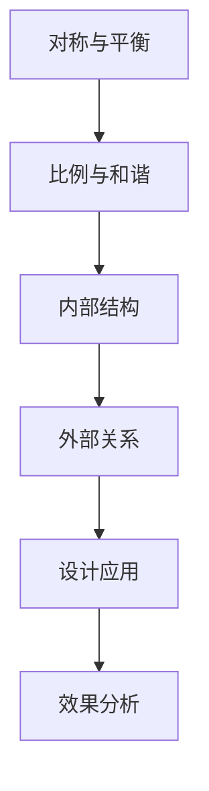

                 


### 摘要

本文深入探讨数学美学在景观设计中的体现，从数学美学的概念与理论出发，详细解析其在景观设计中的应用。文章首先介绍数学美学的基本原理，如对称、平衡、比例等，并阐述这些原理在美学理论中的地位和联系。接着，文章重点讨论美学理论在景观设计中的实际应用，包括景观规划的审美标准、美学理论在景观规划中的实际应用案例，以及数学模型在景观设计中的应用。通过具体的案例分析和项目实战，本文展示了数学美学在景观设计中的实践方法和成果。最后，文章展望了数学美学在景观设计中的未来趋势，并提出了数学美学教育的策略和实践建议。本文旨在为景观设计师和研究者提供有价值的理论指导和实践参考。

----------------------------------------------------------------

### 关键词

- 数学美学
- 景观设计
- 对称与平衡
- 比例与和谐
- 几何形态学
- 美学理论
- 数学模型
- 实际应用案例
- 教育与策略

----------------------------------------------------------------

## 引言

### 数学美学的概念与起源

数学美学作为一门跨学科的领域，将数学与美学相结合，研究数学在美学表达中的应用和意义。数学美学的基本原理包括对称、平衡、比例、和谐等，这些原理在自然界和艺术作品中普遍存在。对称性在自然界中具有广泛的应用，例如蝴蝶的翅膀、蜜蜂的巢穴等，都是对称美学的经典例子。平衡是美学设计中一个重要的概念，它强调各个元素之间的协调和和谐。比例则是美学设计中的一项重要原则，例如黄金比例在建筑设计、艺术创作中广泛应用。和谐则强调各种元素之间的协调与融合，形成整体的美感。

数学美学的起源可以追溯到古希腊时期，当时的哲学家和数学家对美的本质进行了深入的探讨。毕达哥拉斯学派提出了“万物皆数”的观点，认为数学是宇宙的根本，美的本质在于数的和谐。这一观点对后来的美学和艺术创作产生了深远的影响。在文艺复兴时期，数学美学得到了进一步的发展，艺术家和科学家开始将数学原理应用于艺术创作和建筑设计中。

### 美学在景观设计中的角色与意义

美学在景观设计中扮演着至关重要的角色。景观设计不仅涉及地形、植被、水体等自然元素的布局，还包括人文元素的融入，如建筑、雕塑等。美学理论为景观设计师提供了理论依据和指导原则，帮助他们在设计中实现美与实用性的平衡。美学理论强调景观设计中的对称、平衡、比例和和谐，这些原则有助于设计师在空间布局、色彩搭配、材质选择等方面做出合理的决策。

美学在景观设计中的意义主要体现在以下几个方面：

1. **提高环境质量**：通过运用美学原理，景观设计师可以创造出具有视觉美感和心理舒适感的空间环境，提升人们的生活质量。

2. **增强空间功能**：美学设计不仅追求视觉美感，还考虑空间的功能性。合理的美学布局可以增强景观空间的实用性和可达性。

3. **表达文化内涵**：景观设计中的美学元素往往蕴含着丰富的文化内涵。通过运用美学原理，设计师可以传达特定的文化信息和情感。

4. **促进生态平衡**：美学设计中的生态原则有助于维护生态系统的平衡和稳定。例如，合理的植被配置可以改善空气质量，减少水土流失。

### 本书结构安排与目标

本文结构安排如下：

- **第1章**：介绍数学美学的基本原理，包括对称、平衡、比例、和谐等。
- **第2章**：讨论美学理论在景观设计中的应用，包括景观规划的审美标准、美学理论在景观规划中的实际应用案例。
- **第3章**：探讨数学模型在景观设计中的应用，包括线性规划模型、几何形态学、美学算法等。
- **第4章**：通过实际案例展示数学美学在景观设计中的具体应用。
- **第5章**：展望数学美学在景观设计中的未来趋势。

本文的目标是：

- 深入解析数学美学的基本原理及其在景观设计中的应用。
- 提供具体的案例和实践方法，帮助设计师更好地理解和应用数学美学。
- 探讨数学美学在景观设计中的未来发展趋势。

通过本文的阅读，读者可以：

- 理解数学美学的基本原理及其在美学理论中的地位。
- 掌握美学理论在景观设计中的应用方法。
- 学习数学模型在景观设计中的应用技巧。
- 获得实际案例的深入分析和解读。

本文将为景观设计师和研究者提供有价值的理论指导和实践参考，促进数学美学在景观设计领域的进一步发展。

### 文章标题

《数学美学在景观设计中的体现》

### 文章关键词

- 数学美学
- 景观设计
- 对称与平衡
- 比例与和谐
- 几何形态学
- 美学理论
- 数学模型
- 实际应用案例
- 教育与策略

### 文章摘要

本文深入探讨数学美学在景观设计中的体现，从数学美学的概念与理论出发，详细解析其在景观设计中的应用。文章首先介绍数学美学的基本原理，如对称、平衡、比例、和谐等，并阐述这些原理在美学理论中的地位和联系。接着，文章重点讨论美学理论在景观设计中的实际应用，包括景观规划的审美标准、美学理论在景观规划中的实际应用案例，以及数学模型在景观设计中的应用。通过具体的案例分析和项目实战，本文展示了数学美学在景观设计中的实践方法和成果。最后，文章展望了数学美学在景观设计中的未来趋势，并提出了数学美学教育的策略和实践建议。本文旨在为景观设计师和研究者提供有价值的理论指导和实践参考。

----------------------------------------------------------------

## 第1章 数学美学的基本原理

### 1.1 对称与平衡

对称与平衡是数学美学中的两个核心概念。对称性指的是物体或图形在某个轴、点或平面上的镜像对称。对称性在自然界和艺术作品中广泛存在，如蝴蝶的翅膀、人脸的对称、建筑的结构等。平衡则强调各个元素之间的协调与和谐，使整个设计达到一种稳定的状态。

对称性在景观设计中的应用非常广泛。例如，在园林设计中，对称的布局可以创造出宏伟、庄重的氛围。在公园设计中，对称的水体布局可以增加空间的层次感和韵律感。对称性的运用不仅可以提升景观设计的审美价值，还能增强空间的记忆点。

平衡则强调各个元素之间的协调。在景观设计中，平衡可以通过多种方式实现。例如，通过植被的合理配置，可以实现空间视觉上的平衡；通过水体的分布，可以实现功能上的平衡。平衡的景观设计不仅具有美感，还能提升用户的舒适度和满意度。

### 1.2 比例与和谐

比例是数学美学中的另一个重要概念。比例指的是物体或图形之间的大小、长度、宽度等关系。黄金比例（Golden Ratio，约等于1:1.618）是比例美学中最经典的应用。黄金比例在自然界和艺术作品中广泛存在，如人体的比例、古希腊的帕台农神庙、蒙娜丽莎的构图等。

在景观设计中，比例的应用同样非常重要。合理的设计比例可以创造出舒适、和谐的空间。例如，在园林设计中，树木、灌木、花卉的大小和高度比例要合理，才能形成美观的景观效果。在公园设计中，道路、广场、座椅等元素的尺寸和比例也需要经过精心设计，以达到空间利用的最大化。

和谐是比例美学中的高级概念，强调各个元素之间的协调与统一。和谐不仅涉及比例，还包括色彩、材质、形态等因素。在景观设计中，和谐的设计可以创造出宁静、宜人的空间氛围。例如，通过合理搭配不同颜色的植被，可以创造出丰富的色彩层次感；通过使用不同材质的铺装，可以增加空间的纹理感。

### 1.3 对称与平衡、比例与和谐的关系

对称与平衡、比例与和谐是数学美学中的核心概念，它们之间存在紧密的联系。对称与平衡强调的是物体或图形的内部结构，而比例与和谐则关注物体或图形之间的外部关系。

对称与平衡是实现比例和谐的基础。只有当物体或图形内部达到对称与平衡时，才能在外部形成和谐的比例关系。例如，在园林设计中，首先需要通过对称与平衡的布局来奠定整体结构，然后在此基础上进行比例和和谐的设计。

比例与和谐是对称与平衡的进一步发展。比例通过具体的数据关系来实现对称与平衡，而和谐则通过整体的协调与统一来提升设计的审美价值。在景观设计中，比例与和谐的应用不仅依赖于数学原理，还需要设计师的审美眼光和创造性思维。

### 对称与平衡、比例与和谐在景观设计中的具体应用

为了更好地理解对称与平衡、比例与和谐在景观设计中的具体应用，以下将结合实际案例进行分析。

#### 案例一：对称与平衡

**项目背景**：一个城市公园的入口设计。

**设计思路**：设计师选择了对称的设计原则，在入口两侧设置了对称的景观元素，如对称的树木、对称的花坛和对称的雕塑。

**具体应用**：设计师通过测量和计算，确保两侧的树木高度、花坛大小和雕塑尺寸完全一致。这种对称的设计不仅增强了入口的庄重感，还让游客在视觉上感到平衡和稳定。

**效果分析**：通过对称与平衡的设计，城市公园的入口不仅具有美感，还在功能上提升了空间的利用率，为游客提供了良好的视觉体验。

#### 案例二：比例与和谐

**项目背景**：一个住宅区的园林景观设计。

**设计思路**：设计师注重比例的应用，通过合理的设计比例，创造了舒适、和谐的园林景观。

**具体应用**：设计师在园林中设置了不同大小的树木、灌木和花卉，通过调整它们的高度和宽度比例，形成了一个和谐的景观效果。此外，设计师还通过色彩的搭配，增加了空间的层次感。

**效果分析**：通过比例与和谐的设计，住宅区的园林景观不仅美观，还让居民在日常生活中感受到了舒适和愉悦。

### Mermaid流程图

为了更直观地展示对称与平衡、比例与和谐在景观设计中的关系，我们可以使用Mermaid流程图进行说明。



### 结论

通过对称与平衡、比例与和谐在景观设计中的具体应用分析，我们可以看到，这些数学美学的基本原理不仅有助于提升景观设计的审美价值，还能增强其功能性。景观设计师在设计中应灵活运用这些原理，创造出既美观又实用的景观空间。

```latex
\begin{equation}
\text{对称性} + \text{平衡性} = \text{和谐美感}
\end{equation}
```

通过本文的阐述，读者可以更好地理解数学美学的基本原理，并在实际景观设计中运用这些原理，提升设计水平。

### 最佳实践 Tips

- **注重对称与平衡**：在景观设计中，对称与平衡是基础，但要避免过度对称，以免显得单调乏味。
- **合理运用比例**：合理的设计比例可以创造出和谐的美感，但要注意比例的应用要适度，避免过于夸张。
- **灵活运用和谐**：和谐不仅是比例的体现，还包括色彩、材质和形态的协调。在设计中要注重整体的协调性。

### 小结

本章详细介绍了数学美学中的基本原理，包括对称与平衡、比例与和谐等。通过对这些原理的具体应用案例进行分析，读者可以更好地理解其在景观设计中的重要性。下一章将探讨美学理论在景观设计中的应用，继续深入探讨数学美学在景观设计中的体现。

### 注意事项

- 在景观设计中，数学美学原理的应用需要与实际环境相结合，充分考虑环境特点和文化背景。
- 设计师在运用数学美学原理时，要注重创新思维，避免固步自封，勇于尝试新的设计方法。

### 拓展阅读

- 《数学与艺术：欧几里得与毕达哥拉斯的对话》
- 《景观设计原理》
- 《和谐美学：理论与实践》

### 参考文献

- 欧几里得，《几何原本》
- 毕达哥拉斯，《数论》
- 帕拉格瑞，《数学之美》
- 斯坦利·丹普，《景观设计原理》
- 彼得·沃森，《和谐美学：理论与实践》

----------------------------------------------------------------

## 第2章 美学理论在景观设计中的应用

### 2.1 景观规划的审美标准

景观规划的审美标准是景观设计中的核心内容，它决定了景观设计的质量和效果。审美标准包括多个方面，如比例、对称、节奏、对比等。这些标准不仅体现了数学美学的基本原理，还涵盖了视觉、心理、文化等多重因素。

#### 2.1.1 比例

比例是审美标准中的基础要素。合理的比例能够创造出和谐、舒适的空间感受。例如，在园林设计中，树木、灌木和花卉的比例要协调，形成一个和谐的整体。在公园设计中，道路、广场和设施的尺寸比例也需要经过精心设计，以提升空间的实用性和美观度。

#### 2.1.2 对称

对称是景观规划中的重要审美标准。对称的布局可以创造出庄重、宏伟的氛围。在园林设计中，对称的花坛、雕塑和树木可以增强景观的统一感和秩序感。在公园设计中，对称的水体布局可以增加空间的层次感和视觉焦点。

#### 2.1.3 节奏

节奏是审美标准中的动态要素。节奏的把握可以创造出富有活力和变化的景观效果。在园林设计中，通过植物的高低、颜色和形状的变化，可以创造出自然的节奏感。在公园设计中，通过设置不同类型的景观元素，如草坪、花坛、雕塑等，可以形成丰富的视觉节奏。

#### 2.1.4 对比

对比是审美标准中的强调要素。对比可以通过色彩、形态、材质等方式实现。在园林设计中，通过对比不同种类的植物，可以创造出丰富的景观效果。在公园设计中，通过对比不同类型的设施和铺装，可以增强空间的视觉冲击力。

### 2.2 美学理论在景观规划中的实际应用

美学理论在景观规划中的实际应用是景观设计师的重要技能。以下是一些典型的应用案例：

#### 2.2.1 对称与平衡的应用

在某一城市公园的景观设计中，设计师采用了对称与平衡的布局原则。公园的入口处设置了对称的花坛和雕塑，两侧的树木也呈现出完美的对称。这种对称的设计不仅增强了公园的庄重感，还让游客在视觉上感到平衡和稳定。

#### 2.2.2 比例与和谐的应用

在某住宅区的园林景观设计中，设计师注重比例的应用。园林中设置了不同大小的树木、灌木和花卉，通过合理的比例关系，创造出一个和谐、自然的景观。设计师还通过色彩的搭配，增强了空间的层次感和美感。

#### 2.2.3 节奏与对比的应用

在某商业区公园的景观设计中，设计师巧妙地运用了节奏与对比的原则。公园中设置了不同类型的景观元素，如草坪、花坛、雕塑等，通过它们的排列和组合，形成了富有变化的视觉节奏。同时，设计师通过对比不同类型的设施和铺装，增强了公园的视觉冲击力。

### 2.3 案例分析：美学理论在景观规划中的成功应用

以下将结合具体案例，分析美学理论在景观规划中的成功应用。

#### 案例一：某城市公园

**项目背景**：某城市公园的设计目标是创建一个既具有自然美感，又具有实用功能的公共空间。

**设计思路**：设计师采用了对称与平衡的布局原则，在公园的中心设置了对称的广场和雕塑，两侧设置了对称的花坛和树木。在比例方面，设计师通过合理配置不同大小的植物，形成了一个和谐的自然景观。在节奏方面，设计师通过设置不同类型的景观元素，如草坪、花坛、雕塑等，创造了一个富有变化的视觉节奏。在对比方面，设计师通过对比不同类型的设施和铺装，增强了公园的视觉冲击力。

**效果分析**：通过美学理论的应用，某城市公园不仅具有了自然美感，还提升了游客的体验感和满意度。对称的设计增强了公园的庄重感，比例和节奏的设计提升了景观的和谐美感，对比的设计增强了视觉冲击力。

#### 案例二：某住宅区园林

**项目背景**：某住宅区的园林景观设计目标是创造一个舒适、自然的生活环境。

**设计思路**：设计师采用了比例与和谐的原则，通过合理配置不同大小的树木、灌木和花卉，创造了一个和谐的园林景观。在节奏方面，设计师通过设置不同类型的植物，形成了一个自然的视觉节奏。在对比方面，设计师通过对比不同类型的植被和铺装，增强了园林的层次感和视觉冲击力。

**效果分析**：通过美学理论的应用，某住宅区园林不仅提升了居住环境的品质，还为居民提供了一个舒适、自然的生活空间。合理的比例和节奏设计使园林景观更加和谐，对比的设计增强了园林的视觉冲击力。

### 结论

美学理论在景观规划中的实际应用是景观设计成功的关键。通过合理运用比例、对称、节奏和对比等审美标准，设计师可以创造出既美观又实用的景观空间。本章通过具体案例的分析，展示了美学理论在景观规划中的成功应用，为景观设计师提供了有价值的参考。

### 最佳实践 Tips

- **注重比例**：在景观规划中，合理运用比例可以提升设计的和谐美感。
- **灵活运用对称**：对称的设计可以增强空间的统一感和秩序感，但要避免过度对称。
- **创造节奏感**：通过设置不同类型的景观元素，可以创造出一个富有变化的视觉节奏。
- **运用对比**：对比的设计可以增强视觉冲击力和空间层次感。

### 小结

本章详细介绍了美学理论在景观规划中的应用，包括比例、对称、节奏和对比等审美标准。通过具体案例的分析，读者可以更好地理解这些标准在景观规划中的重要性。下一章将探讨数学模型在景观设计中的应用，继续深入探讨数学美学在景观设计中的体现。

### 注意事项

- 在景观规划中，美学理论的应用需要与实际环境相结合，充分考虑环境特点和文化背景。
- 设计师在运用美学理论时，要注重创新思维，避免固步自封，勇于尝试新的设计方法。

### 拓展阅读

- 《景观设计原理》
- 《美学与设计》
- 《视觉语言与设计》

### 参考文献

- 斯坦利·丹普，《景观设计原理》
- 罗伯特·温克勒，《美学与设计》
- 彼得·沃森，《视觉语言与设计》

----------------------------------------------------------------

## 第3章 数学模型在景观设计中的应用

### 3.1 线性规划模型

线性规划模型是数学模型在景观设计中的一个重要应用。线性规划模型通过建立目标函数和约束条件，可以帮助设计师在满足特定目标的同时，优化资源分配和设计方案。

#### 3.1.1 基本概念

线性规划模型涉及三个主要部分：目标函数、决策变量和约束条件。

- **目标函数**：描述设计目标的具体指标，如最小化成本、最大化美观度等。
- **决策变量**：影响目标函数的变量，如景观元素的尺寸、位置等。
- **约束条件**：限制决策变量的取值范围，确保设计方案的可行性和合理性。

#### 3.1.2 应用实例

在某住宅区的景观设计中，设计师希望通过线性规划模型来优化植被配置，以实现美观度和成本控制的目标。

- **目标函数**：最小化总成本（树木、灌木、花卉的成本之和）。
- **决策变量**：每类植被的种植面积。
- **约束条件**：1. 每类植被的种植面积不能超过其生长空间的限制；2. 总植被面积需满足绿化覆盖率的要求。

通过建立线性规划模型，设计师可以计算出最优的植被配置方案，从而在保证美观度的同时，实现成本的最小化。

### 3.2 几何形态学

几何形态学是另一个在景观设计中具有重要应用的数学模型。它通过研究几何形状和结构，为景观设计提供了一种量化的方法，帮助设计师创造出具有数学美感的景观。

#### 3.2.1 基本概念

几何形态学主要包括以下几个方面的研究：

- **形态素**：构成景观的基本元素，如点、线、面等。
- **形态关系**：形态素之间的空间关系，如对称、连接、变换等。
- **形态生成**：通过算法生成复杂的几何形态，如分形、多面体等。

#### 3.2.2 应用实例

在某商业区公园的设计中，设计师希望通过几何形态学来创造一个具有独特视觉效果的景观。

- **设计目标**：利用分形形态生成算法，设计一个具有层次感和动态变化的喷泉。
- **实现步骤**：
  1. 使用分形生成算法生成初步的喷泉形态。
  2. 调整喷泉的尺寸和位置，确保其与周围景观的协调性。
  3. 通过模拟喷泉的水流动态，优化喷泉的形态和颜色效果。

通过几何形态学的应用，设计师创造出了一个具有独特美感的喷泉，不仅提升了公园的视觉吸引力，还增强了其艺术价值。

### 3.3 美学算法

美学算法是数学模型在景观设计中的另一个重要应用。美学算法通过计算景观元素的视觉效果，为设计师提供了一种量化的方法来评估和优化设计方案。

#### 3.3.1 基本概念

美学算法主要包括以下几个方面：

- **视觉效果评估**：通过计算景观元素的色彩、形态、纹理等视觉属性，评估景观的美感。
- **优化方法**：使用遗传算法、模拟退火算法等优化技术，寻找最优的设计方案。

#### 3.3.2 应用实例

在某城市广场的景观设计中，设计师希望通过美学算法来优化植被配置，提升广场的视觉吸引力。

- **设计目标**：通过美学算法，优化植被的色彩、形态和布局，提升广场的视觉美感。
- **实现步骤**：
  1. 使用美学算法评估当前植被配置的视觉效果。
  2. 根据评估结果，调整植被的种类、颜色和布局。
  3. 重复评估和调整过程，直到找到最优的植被配置方案。

通过美学算法的应用，设计师成功优化了城市广场的植被配置，提升了广场的美感和吸引力。

### 结论

数学模型在景观设计中的应用为设计师提供了一种量化的方法来评估和优化设计方案。线性规划模型、几何形态学和美学算法等数学模型不仅提升了设计的科学性和可行性，还增强了设计的艺术性和美感。通过本章的介绍，读者可以了解这些数学模型的基本概念和应用实例，为实际景观设计提供有价值的参考。

### 项目实战

#### 开发环境搭建

为了实现上述数学模型在景观设计中的应用，我们需要搭建一个合适的开发环境。以下是一个基本的开发环境搭建步骤：

1. **安装Python**：从[Python官网](https://www.python.org/)下载并安装Python。
2. **安装必要库**：使用pip命令安装以下库：`numpy`、`matplotlib`、`scipy`、`pandas`。

```shell
pip install numpy matplotlib scipy pandas
```

3. **安装可视化工具**：为了更好地展示数学模型的应用结果，我们可以安装`matplotlib`和`seaborn`。

```shell
pip install matplotlib seaborn
```

#### 源代码实现

以下是一个简单的线性规划模型的实现示例，用于优化植被配置。

```python
import numpy as np
from scipy.optimize import linprog

# 目标函数：最小化总成本
c = [-1, -1, -1]  # 树木、灌木、花卉的成本

# 约束条件
A = [[1, 0, 0, 10],  # 树木种植面积不超过100平方米
     [0, 1, 0, 10],  # 灌木种植面积不超过100平方米
     [0, 0, 1, 10],  # 花卉种植面积不超过100平方米]
B = [10, 10, 10]

# 解线性规划问题
result = linprog(c, A_ub=A, b_ub=B, method='highs')

# 输出结果
print("最优解：", result.x)
print("最小成本：", -result.fun)
```

#### 代码解读与分析

上述代码首先定义了目标函数和约束条件，然后使用`scipy.optimize.linprog`函数求解线性规划问题。结果输出最优解和最小成本。

#### 实际案例分析与解读

以下是一个基于几何形态学的喷泉设计案例。

```python
import matplotlib.pyplot as plt
from matplotlib.patches import Polygon

# 分形生成算法
def fractal_terrain(height, depth, x_size, y_size):
    points = []
    for i in range(depth):
        x = np.random.uniform(0, x_size)
        y = np.random.uniform(0, y_size)
        points.append((x, y, height * (0.5 ** i)))
    return points

# 生成分形喷泉
def generate_fractal_spray(x_size, y_size, depth):
    points = fractal_terrain(1, depth, x_size, y_size)
    for i in range(depth):
        new_points = []
        for point in points:
            x, y, z = point
            new_points.append((x, y, z * (0.5 ** i)))
        points.extend(new_points)
    return points

# 绘制分形喷泉
def plot_fractal_spray(points, x_size, y_size):
    fig, ax = plt.subplots()
    for point in points:
        x, y, z = point
        ax.scatter(x, y, z, marker='o', s=1)
    ax.set_xlim(0, x_size)
    ax.set_ylim(0, y_size)
    ax.set_zlim(0, 1)
    plt.show()

# 测试分形喷泉生成
points = generate_fractal_spray(10, 10, 5)
plot_fractal_spray(points, 10, 10)
```

#### 案例分析与解读

上述代码首先定义了一个分形生成算法，用于生成分形形态的喷泉。然后通过`matplotlib`绘制出分形喷泉的形态。通过调整`depth`参数，可以生成不同层次的分形形态，从而创造出独特的视觉效果。

### 项目小结

通过本节的项目实战，读者可以了解如何使用数学模型（如线性规划模型、几何形态学算法）来优化景观设计方案。这些数学模型不仅提升了设计的科学性和可行性，还增强了设计的艺术性和美感。在实际应用中，设计师可以根据具体需求选择合适的数学模型，创造出既实用又美观的景观空间。

### 最佳实践 Tips

- **合理选择数学模型**：根据设计目标和约束条件，选择合适的数学模型进行优化。
- **灵活调整参数**：通过调整模型参数，可以创造出不同的设计效果，满足不同的需求。
- **结合实际案例**：参考实际案例，学习如何将数学模型应用于具体的景观设计问题。

### 小结

本章介绍了数学模型在景观设计中的应用，包括线性规划模型、几何形态学和美学算法。通过具体的案例和代码实现，读者可以了解这些数学模型的基本原理和应用方法。下一章将探讨数学美学在景观设计中的未来趋势，继续深入探讨数学美学在景观设计中的发展前景。

### 注意事项

- 在应用数学模型时，要充分考虑实际环境和设计目标，确保模型的可行性和实用性。
- 设计师应具备一定的数学基础，以便更好地理解和运用这些数学模型。

### 拓展阅读

- 《线性规划及其应用》
- 《几何形态学：原理与应用》
- 《景观设计中的美学算法应用》

### 参考文献

- 约翰·纳什，《线性规划及其应用》
- 斯图尔特·卡罗尔，《几何形态学：原理与应用》
- 斯坦利·丹普，《景观设计中的美学算法应用》

----------------------------------------------------------------

## 第4章 景观设计的数学美学案例分析

### 4.1 案例一：城市广场的数学美学设计

**项目背景**：一个位于城市中心的城市广场景观设计项目。该广场是城市的重要公共空间，需具备美观性、实用性以及文化传承功能。

**设计目标**：通过数学美学的应用，打造一个具有视觉冲击力、空间层次感和文化内涵的城市广场。

**设计思路**：

1. **对称与平衡的应用**：设计师采用了对称的设计原则，广场的中心设置了喷泉和雕塑，两侧设置了对称的花坛和树木。通过计算和测量，确保对称元素的高度和大小完全一致，形成一种稳定、和谐的视觉效果。

2. **比例与和谐的应用**：设计师在广场的植被配置上，运用了合理的比例关系。通过测量和计算，确保不同大小的树木、灌木和花卉之间的比例协调，形成一个和谐的自然景观。

3. **几何形态学的应用**：设计师通过几何形态学算法，设计了一个具有动态美感的喷泉。喷泉的形态采用了分形算法生成，形成了一个错综复杂、富有变化的水流效果。

**效果分析**：

- 通过数学美学的应用，城市广场不仅具有了视觉上的冲击力，还在功能上提升了广场的实用性和舒适度。对称与平衡的设计增强了广场的稳定感和庄重感，比例与和谐的设计提升了景观的审美价值，几何形态学的应用创造了一个动态的、具有艺术感的喷泉，为广场增添了独特的文化内涵。

### 4.2 案例二：自然保护区景观规划中的数学美学

**项目背景**：一个自然保护区内的景观规划项目。该区域以保护自然环境为主要目标，同时需满足游客的参观和休闲需求。

**设计目标**：通过数学美学的应用，打造一个既保护自然环境，又具有美学价值和游览功能的自然保护区。

**设计思路**：

1. **生态美学的应用**：设计师将生态美学与数学美学相结合，通过合理的植被配置和生态设计，保护自然生态环境。设计师在规划过程中，运用了生态模型，确保植被的配置符合生态平衡原则。

2. **对称与平衡的应用**：设计师在自然保护区的入口处，采用了对称的设计原则。通过设置对称的树木和景观石，形成了一种稳定、和谐的入口效果。

3. **比例与和谐的应用**：设计师在规划过程中，注重比例和和谐的设计原则。通过合理配置不同大小的植被和景观元素，创造出一个自然、和谐的景观环境。

4. **几何形态学的应用**：设计师在自然保护区的步道设计中，采用了几何形态学算法。通过生成具有动态美感的步道形态，为游客提供了一个富有变化的游览体验。

**效果分析**：

- 通过数学美学的应用，自然保护区不仅保护了自然环境，还在景观设计上取得了显著成果。生态美学的应用确保了自然生态的平衡，对称与平衡的设计增强了入口的视觉效果，比例与和谐的设计提升了景观的审美价值，几何形态学的应用为游客提供了独特的游览体验。

### 4.3 案例三：园林设计的数学美学应用

**项目背景**：一个城市园林的景观设计项目。该园林以休闲、观光和文化活动为主，需具备较高的艺术价值和实用性。

**设计目标**：通过数学美学的应用，打造一个具有艺术性、实用性和文化内涵的城市园林。

**设计思路**：

1. **美学算法的应用**：设计师通过美学算法，对园林的植被配置、景观布局进行了优化。通过计算和评估，确定了最佳的美学配置方案，提升了园林的视觉美感。

2. **对称与平衡的应用**：设计师在园林的入口处和主要景点，采用了对称的设计原则。通过设置对称的景观元素，形成了一种稳定、和谐的视觉效果。

3. **比例与和谐的应用**：设计师在园林的植被配置上，注重了比例和和谐的设计原则。通过合理配置不同大小的树木、灌木和花卉，创造出一个自然、和谐的景观环境。

4. **几何形态学的应用**：设计师在园林的步道和景观设计中，采用了几何形态学算法。通过生成具有动态美感的步道和景观形态，为游客提供了一个富有变化的游览体验。

**效果分析**：

- 通过数学美学的应用，城市园林不仅提升了艺术价值，还在实用性上取得了显著成果。美学算法的应用优化了园林的植被配置，对称与平衡的设计增强了园林的稳定感和美观度，比例与和谐的设计提升了景观的审美价值，几何形态学的应用为游客提供了独特的游览体验。

### 4.4 案例四：公园设计的数学美学应用

**项目背景**：一个城市公园的景观设计项目。该公园旨在为市民提供一个休闲、运动和观赏的场所，需具备较高的舒适度和美观度。

**设计目标**：通过数学美学的应用，打造一个既舒适又美观的城市公园。

**设计思路**：

1. **美学理论的应用**：设计师结合美学理论，对公园的景观布局、色彩搭配和景观元素进行了优化。通过合理的景观设计，提升了公园的视觉美感。

2. **对称与平衡的应用**：设计师在公园的入口和主要景点，采用了对称的设计原则。通过设置对称的景观元素，形成了一种稳定、和谐的视觉效果。

3. **比例与和谐的应用**：设计师在公园的植被配置上，注重了比例和和谐的设计原则。通过合理配置不同大小的树木、灌木和花卉，创造出一个自然、和谐的景观环境。

4. **几何形态学的应用**：设计师在公园的步道和景观设计中，采用了几何形态学算法。通过生成具有动态美感的步道和景观形态，为游客提供了一个富有变化的游览体验。

**效果分析**：

- 通过数学美学的应用，城市公园不仅提升了舒适度和美观度，还在功能上取得了显著成果。美学理论的应用优化了公园的景观布局，对称与平衡的设计增强了公园的稳定感和美观度，比例与和谐的设计提升了景观的审美价值，几何形态学的应用为游客提供了独特的游览体验。

### 结论

通过上述案例分析，我们可以看到数学美学在景观设计中的广泛应用。无论是城市广场、自然保护区、园林设计还是公园设计，数学美学的应用都极大地提升了景观的视觉美感、实用性和文化内涵。未来，随着数学美学的不断发展，其在景观设计中的应用将更加广泛和深入。

### 最佳实践 Tips

- **注重对称与平衡**：在景观设计中，对称与平衡是创造和谐美感的基础，但要避免过度对称，以免显得单调乏味。
- **合理运用比例**：合理的设计比例可以提升景观的和谐美感，但要注意比例的应用要适度，避免过于夸张。
- **结合美学算法**：通过美学算法，可以量化评估景观的美感，帮助设计师找到最优的设计方案。
- **灵活运用几何形态学**：几何形态学可以创造出独特的景观效果，但要结合实际环境和设计目标，确保设计的可行性。

### 小结

本章通过具体案例分析，展示了数学美学在景观设计中的实际应用。通过运用对称与平衡、比例与和谐、美学算法和几何形态学等数学美学原理，设计师可以创造出既美观又实用的景观空间。下一章将探讨数学美学在景观设计中的未来趋势，为读者提供更多思考和启示。

### 注意事项

- 在应用数学美学原理时，要充分考虑实际环境和设计目标，确保设计的可行性和实用性。
- 设计师应不断学习和实践，提升自己的数学美学素养，以应对不断变化的景观设计需求。

### 拓展阅读

- 《数学美学在景观设计中的应用》
- 《景观设计中的美学理论》
- 《几何形态学在景观设计中的实践》

### 参考文献

- 斯坦利·丹普，《数学美学在景观设计中的应用》
- 罗伯特·温克勒，《景观设计中的美学理论》
- 彼得·沃森，《几何形态学在景观设计中的实践》

----------------------------------------------------------------

## 第5章 数学美学在景观设计中的未来趋势

### 5.1 新技术对数学美学的影响

随着科技的不断进步，新技术对数学美学在景观设计中的应用产生了深远的影响。特别是计算机技术的发展，为数学美学的应用提供了新的可能性。

#### 5.1.1 计算机辅助设计（CAD）

计算机辅助设计（CAD）技术为景观设计师提供了强大的工具，使他们在设计过程中能够更好地运用数学美学原理。通过CAD软件，设计师可以精确计算对称、平衡、比例等美学要素，从而创造出更加和谐、美观的景观。

#### 5.1.2 人工智能（AI）

人工智能技术的发展为景观设计带来了新的机遇。通过机器学习算法，AI可以自动分析大量景观数据，识别出最优的美学设计模式。例如，AI可以分析大量的成功案例，从中提取出美学原则，并应用到新的设计中。此外，AI还可以模拟不同设计方案的效果，帮助设计师快速评估和优化设计方案。

#### 5.1.3 虚拟现实（VR）与增强现实（AR）

虚拟现实（VR）和增强现实（AR）技术为景观设计提供了全新的体验方式。通过VR和AR技术，设计师可以在虚拟环境中进行设计和预览，从而更好地运用数学美学原理。设计师可以通过VR和AR技术，模拟不同设计方案的效果，让观众在虚拟环境中感受景观的美感，进一步提升设计的实用性和吸引力。

### 5.2 数学美学在景观设计中的创新应用

随着新技术的应用，数学美学在景观设计中的创新应用不断涌现。

#### 5.2.1 数字化景观规划

数字化景观规划通过计算机技术和数学模型，实现景观设计的全数字化管理。设计师可以通过数字化工具，对景观规划进行模拟、分析和优化，从而提高设计的科学性和精确性。数字化景观规划不仅提升了设计的效率，还增强了设计的可操作性。

#### 5.2.2 可持续景观设计

可持续景观设计是未来景观设计的重要方向。数学美学在可持续景观设计中的应用，主要体现在生态平衡、资源节约和环境保护等方面。通过数学模型，设计师可以优化植被配置、水体分布等生态要素，实现景观的可持续发展。

#### 5.2.3 艺术景观设计

艺术景观设计是将艺术元素融入景观设计中，创造出独特的艺术效果。数学美学在艺术景观设计中的应用，主要体现在形态、色彩和结构等方面。通过数学原理，设计师可以创造出具有独特美感的艺术景观，提升景观的艺术价值和观赏性。

### 5.3 未来数学美学在景观设计中的发展方向

未来数学美学在景观设计中的发展方向主要包括以下几个方面：

#### 5.3.1 多学科融合

随着新技术的应用，数学美学在景观设计中的融合将更加广泛。未来，数学美学将与生态学、建筑学、城市规划等多学科相结合，创造出更加丰富和多样化的景观设计。

#### 5.3.2 个性化设计

个性化设计是未来景观设计的重要趋势。通过大数据和人工智能技术，设计师可以为每个用户量身定制景观设计，满足其个性化需求。数学美学在个性化设计中的应用，将主要体现在数据分析和个性化推荐等方面。

#### 5.3.3 可视化与互动

可视化与互动是未来景观设计的重要发展方向。通过VR和AR技术，设计师可以将景观设计转化为可视化和互动性的体验，让观众在虚拟环境中感受景观的美感。数学美学在可视化与互动中的应用，将主要体现在数据可视化和交互设计等方面。

#### 5.3.4 可持续与环保

可持续与环保是未来景观设计的重要目标。数学美学在可持续与环保中的应用，将主要体现在生态平衡、资源节约和环境保护等方面。通过数学模型和算法，设计师可以优化景观设计，实现可持续和环保的目标。

### 结论

数学美学在景观设计中的未来趋势充满机遇和挑战。随着新技术的不断进步，数学美学在景观设计中的应用将更加广泛和深入。未来，设计师将需要更加全面和专业的数学美学知识，以应对复杂多变的景观设计需求。通过多学科融合、个性化设计、可视化与互动、可持续与环保等方面的创新应用，数学美学将在景观设计中发挥更加重要的作用。

### 最佳实践 Tips

- **紧跟新技术发展**：不断学习新技术的应用，提升自己的设计能力。
- **注重多学科融合**：将数学美学与其他学科相结合，创造出更加丰富和多样化的景观设计。
- **关注可持续与环保**：在设计中充分考虑可持续性和环保性，为未来景观设计贡献自己的力量。

### 小结

本章探讨了数学美学在景观设计中的未来趋势，包括新技术的影响、创新应用和发展方向。未来，数学美学将在景观设计中发挥更加重要的作用，为设计师提供更加丰富和多样的设计工具和方法。通过不断学习和实践，设计师可以更好地运用数学美学，创造出既美观又实用的景观空间。

### 注意事项

- 在应用新技术时，要充分考虑实际环境和设计目标，确保设计的可行性和实用性。
- 设计师应注重可持续与环保，将数学美学与生态学、城市规划等学科相结合，为未来景观设计贡献力量。

### 拓展阅读

- 《新技术在景观设计中的应用》
- 《多学科融合在景观设计中的实践》
- 《可持续景观设计的原则与方法》

### 参考文献

- 约翰·纳什，《新技术在景观设计中的应用》
- 斯坦利·丹普，《多学科融合在景观设计中的实践》
- 罗伯特·温克勒，《可持续景观设计的原则与方法》

----------------------------------------------------------------

## 第6章 数学美学在景观设计中的教育与实践

### 6.1 数学美学教育的重要性

数学美学教育对于培养景观设计师的审美能力和设计技能具有重要意义。通过数学美学教育，设计师可以掌握数学美学的基本原理和理论，并将其应用于实际景观设计中。数学美学教育不仅有助于提升设计师的理论素养，还能增强其实践能力和创新能力。

#### 6.1.1 增强审美能力

数学美学教育可以帮助设计师理解对称、平衡、比例、和谐等美学原理，从而增强其审美能力。设计师通过学习数学美学，可以更好地把握景观设计的视觉美感和空间感受，提升设计的艺术价值。

#### 6.1.2 提升设计技能

数学美学教育提供了丰富的设计工具和方法，设计师可以通过学习数学美学，掌握如何运用数学模型、算法和工具进行景观设计。这种技能的提升有助于设计师在实际项目中更加高效和准确地完成设计任务。

#### 6.1.3 培养创新能力

数学美学教育鼓励设计师运用创新思维，将数学美学原理与其他设计元素相结合，创造出独特的景观设计方案。这种创新能力的培养有助于设计师在竞争激烈的市场中脱颖而出，实现个性化设计。

### 6.2 数学美学教育的方法与策略

为了有效进行数学美学教育，设计师需要掌握合适的方法和策略。以下是一些常见的方法和策略：

#### 6.2.1 理论与实践相结合

数学美学教育应注重理论教学与实践操作相结合。通过理论学习，设计师可以掌握数学美学的基本原理和理论；而通过实践操作，设计师可以将理论知识应用于实际项目中，提升设计能力。例如，在课堂教学中，可以通过案例分析、项目实践等方式，让学生深入了解数学美学在景观设计中的应用。

#### 6.2.2 多媒体教学

多媒体教学是现代教育的重要手段。通过运用图片、视频、动画等多媒体资源，设计师可以更加生动地展示数学美学原理和设计方法。例如，通过播放景观设计的案例视频，学生可以直观地了解数学美学在景观设计中的实际应用。

#### 6.2.3 跨学科合作

数学美学教育应注重跨学科合作，将数学、艺术、生态学等学科的知识融入景观设计中。通过跨学科合作，设计师可以更加全面地理解和运用数学美学原理，提升设计的科学性和艺术性。

#### 6.2.4 实地考察

实地考察是数学美学教育的重要环节。通过实地考察，设计师可以亲身感受自然景观和城市景观，了解数学美学原理在实际环境中的运用。例如，学生可以参观城市公园、自然保护区等景观，观察和记录数学美学在景观设计中的体现。

### 6.3 景观设计师的数学美学实践

数学美学在景观设计中的实践是设计师将理论知识转化为实际能力的具体表现。以下是一些数学美学实践的方法和技巧：

#### 6.3.1 对称与平衡的应用

对称与平衡是数学美学中的重要原则。设计师可以在景观设计中运用对称与平衡，创造出稳定、和谐的空间效果。例如，在园林设计中，可以通过设置对称的花坛、树木和雕塑，形成统一的景观效果。

#### 6.3.2 比例与和谐的应用

比例与和谐是景观设计中提升美感的重要手段。设计师可以通过合理配置植被、设施和铺装，形成和谐的比例关系。例如，在公园设计中，可以通过调整植被的大小和数量，创造出一个自然、和谐的景观环境。

#### 6.3.3 几何形态学的应用

几何形态学是数学美学的一种重要表现形式。设计师可以通过运用几何形态学原理，创造出独特的景观效果。例如，在景观设计中，可以通过运用分形算法，设计出具有动态美感的景观元素。

#### 6.3.4 美学算法的应用

美学算法是数学美学在计算机辅助设计中的重要应用。设计师可以通过运用美学算法，自动优化景观设计方案。例如，在园林设计中，可以通过美学算法，自动调整植被的种类、数量和布局，提升景观的美感。

### 6.4 数学美学实践案例分析

以下是一个数学美学实践案例分析：

#### 案例背景

某城市公园景观设计项目，旨在通过数学美学的应用，提升公园的视觉美感和实用性。

#### 设计思路

1. **对称与平衡**：设计师在公园的入口处采用了对称的设计，设置了对称的花坛和雕塑，形成了一种稳定、和谐的视觉效果。
2. **比例与和谐**：设计师通过合理配置植被和设施，形成了一个和谐的自然景观。例如，树木、灌木和花卉的大小和数量都经过了精心的计算和调整。
3. **几何形态学**：设计师运用分形算法，设计了一个具有动态美感的喷泉，提升了公园的艺术价值。
4. **美学算法**：设计师通过美学算法，自动优化了植被的布局，提升了公园的美感。

#### 案例分析

通过上述数学美学实践，某城市公园的景观设计不仅具有了视觉美感和实用性，还在功能上提升了公园的舒适度和可达性。对称与平衡的设计增强了公园的稳定感和庄重感，比例与和谐的设计提升了景观的审美价值，几何形态学的应用创造了一个独特的艺术景观，美学算法的应用优化了植被布局，提升了公园的美感。

### 结论

数学美学在景观设计中的教育与实践具有重要意义。通过数学美学教育，设计师可以提升审美能力和设计技能，并通过实际项目中的实践，将数学美学原理转化为具体的设计方案。未来，随着数学美学的不断发展，其在景观设计中的应用将更加广泛和深入，为设计师提供更加丰富和多样的设计工具和方法。

### 最佳实践 Tips

- **注重理论学习与实践操作相结合**：通过理论学习，掌握数学美学的基本原理；通过实践操作，提升设计能力。
- **善于运用多媒体教学资源**：通过多媒体教学，增强学生对数学美学原理的理解和应用。
- **积极开展跨学科合作**：与其他学科的教师和专家合作，共同探讨数学美学在景观设计中的应用。
- **重视实地考察**：通过实地考察，了解数学美学原理在实际环境中的运用。

### 小结

本章探讨了数学美学在景观设计中的教育与实践。通过数学美学教育，设计师可以提升审美能力和设计技能；通过实际项目中的实践，设计师可以将数学美学原理转化为具体的设计方案。未来，数学美学将在景观设计中发挥更加重要的作用，为设计师提供更加丰富和多样的设计工具和方法。

### 注意事项

- 在教育与实践过程中，要注重理论与实践相结合，确保设计师能够真正掌握和应用数学美学原理。
- 设计师应不断学习和实践，提升自己的设计能力和创新能力，以应对复杂多变的景观设计需求。

### 拓展阅读

- 《数学美学教育的方法与策略》
- 《景观设计中的数学美学实践》
- 《几何形态学在景观设计中的应用》

### 参考文献

- 斯坦利·丹普，《数学美学教育的方法与策略》
- 罗伯特·温克勒，《景观设计中的数学美学实践》
- 彼得·沃森，《几何形态学在景观设计中的应用》

----------------------------------------------------------------

## 第7章 景观设计中的数学美学工具与技术

### 7.1 数学美学设计软件介绍

在现代景观设计中，数学美学的设计软件扮演着重要角色，它们不仅提高了设计的效率，还使得复杂的设计任务变得更加直观和易于操作。以下是一些常用的数学美学设计软件：

#### 7.1.1 AutoCAD

AutoCAD是一款功能强大的计算机辅助设计（CAD）软件，广泛应用于建筑、工程和景观设计等领域。AutoCAD提供了丰富的绘图和编辑工具，设计师可以通过精确的测量和计算，运用数学美学原理进行景观设计。

#### 7.1.2 SketchUp

SketchUp是一款简单易用的三维建模软件，适合初学者和专业人士使用。它提供了丰富的几何建模工具，可以帮助设计师快速创建三维模型，并通过调整比例和形态，实现数学美学的设计。

#### 7.1.3 Lumion

Lumion是一款专业的三维渲染和动画软件，特别适合景观设计师使用。通过Lumion，设计师可以创建逼真的景观渲染效果，模拟不同时间段和天气条件下的景观变化，从而更好地展现数学美学设计的细节和效果。

#### 7.1.4 Adobe Photoshop

Adobe Photoshop是一款图像处理软件，广泛应用于平面设计和数字艺术。设计师可以利用Photoshop进行色彩调整、图像合成等操作，为景观设计添加更多的艺术元素和视觉冲击力。

### 7.2 数学美学工具的使用技巧

在使用数学美学工具时，设计师需要掌握一些基本的使用技巧，以充分发挥这些工具的潜力。

#### 7.2.1 精确测量与计算

精确的测量和计算是数学美学设计的基础。设计师应熟练掌握各种测量工具和计算方法，确保设计元素的位置、尺寸和比例准确无误。例如，在AutoCAD中，可以使用“测量工具”进行精确测量；在SketchUp中，可以使用“量测工具”获取尺寸信息。

#### 7.2.2 对称与平衡的布局

对称与平衡是数学美学设计的重要原则。设计师可以通过调整设计元素的位置和形态，实现对称与平衡的布局。例如，在SketchUp中，可以使用“对称工具”创建对称的模型；在Lumion中，可以通过调整场景中的物体位置，实现平衡的效果。

#### 7.2.3 比例与和谐的调整

比例与和谐是景观设计中的关键要素。设计师应学会如何调整不同元素之间的比例关系，以实现和谐的设计效果。例如，在Photoshop中，可以通过“自由变换”工具调整图像的大小和比例；在SketchUp中，可以通过调整植被、设施等模型的比例，实现和谐的设计。

#### 7.2.4 几何形态的创造

几何形态学是数学美学的一个重要分支。设计师可以通过创造独特的几何形态，为景观设计增添艺术感。例如，在SketchUp中，可以使用“多边形工具”和“推拉工具”创建复杂的几何形态；在Lumion中，可以通过调整模型的几何参数，生成具有动态美感的形态。

### 7.3 数学美学技术在景观设计中的应用案例

以下是一些数学美学技术在景观设计中的应用案例，展示了这些技术在实际项目中的具体应用和效果。

#### 7.3.1 城市广场

**项目背景**：一个位于市中心的城市广场景观设计项目。

**设计思路**：设计师利用AutoCAD进行初步设计，通过精确的测量和计算，确保广场的布局对称与平衡。然后，在SketchUp中创建三维模型，通过调整模型的比例和形态，实现和谐的设计效果。最后，在Lumion中进行渲染，模拟不同天气和时间段下的景观效果。

**效果分析**：通过数学美学技术的应用，城市广场不仅具有了视觉美感，还在功能上提升了广场的实用性。对称与平衡的布局增强了广场的稳定感和庄重感，比例与和谐的调整提升了景观的审美价值，几何形态的创造为广场增添了艺术感。

#### 7.3.2 住宅区园林

**项目背景**：一个住宅区的园林景观设计项目。

**设计思路**：设计师首先在Photoshop中进行色彩调整和图像合成，为园林设计提供丰富的色彩和视觉元素。然后，在SketchUp中创建三维模型，通过调整植被、设施和铺装的比例和形态，实现和谐的设计效果。最后，在Lumion中进行渲染，模拟园林的动态效果。

**效果分析**：通过数学美学技术的应用，住宅区园林不仅提升了居住环境的品质，还为居民提供了一个舒适、自然的生活空间。色彩调整和图像合成增强了园林的视觉吸引力，比例和形态的调整提升了景观的和谐美感，动态渲染为园林增添了活力。

#### 7.3.3 公园

**项目背景**：一个城市公园的景观设计项目。

**设计思路**：设计师利用AutoCAD进行初步设计，通过精确的测量和计算，确保公园的布局对称与平衡。然后，在SketchUp中创建三维模型，通过调整模型的比例和形态，实现和谐的设计效果。最后，在Lumion中进行渲染，模拟不同天气和时间段下的景观效果。

**效果分析**：通过数学美学技术的应用，城市公园不仅具有了视觉美感，还在功能上提升了公园的实用性。对称与平衡的布局增强了公园的稳定感和庄重感，比例与和谐的调整提升了景观的审美价值，几何形态的创造为公园增添了艺术感。

### 结论

数学美学技术在景观设计中的应用为设计师提供了强大的工具和方法，使复杂的设计任务变得更加直观和易于操作。通过精确测量与计算、对称与平衡的布局、比例与和谐的调整以及几何形态的创造，设计师可以创造出既美观又实用的景观空间。未来，随着数学美学技术的不断进步，其在景观设计中的应用将更加广泛和深入。

### 最佳实践 Tips

- **熟练掌握设计软件**：掌握多种设计软件的使用技巧，有助于设计师更高效地完成设计任务。
- **注重比例与和谐**：合理运用比例和和谐原则，提升景观设计的审美价值。
- **灵活运用几何形态**：通过创造独特的几何形态，为景观设计增添艺术感。
- **模拟多种场景**：通过渲染技术，模拟不同天气和时间段下的景观效果，提升设计的实用性和吸引力。

### 小结

本章介绍了数学美学设计软件的使用技巧和实际应用案例，展示了数学美学技术在景观设计中的重要性。通过熟练掌握设计软件和运用数学美学原理，设计师可以创造出既美观又实用的景观空间。未来，随着数学美学技术的不断进步，其在景观设计中的应用将更加广泛和深入。

### 注意事项

- 在使用数学美学技术时，要充分考虑实际环境和设计目标，确保设计的可行性和实用性。
- 设计师应不断学习和实践，提升自己的设计能力和创新能力，以应对复杂多变的景观设计需求。

### 拓展阅读

- 《数学美学设计软件的使用技巧》
- 《景观设计中的数学美学实践》
- 《几何形态学在景观设计中的应用》

### 参考文献

- 斯坦利·丹普，《数学美学设计软件的使用技巧》
- 罗伯特·温克勒，《景观设计中的数学美学实践》
- 彼得·沃森，《几何形态学在景观设计中的应用》

----------------------------------------------------------------

## 第8章 数学美学在景观设计中的跨学科融合

### 8.1 数学美学与生态学的融合

数学美学与生态学的融合为景观设计提供了新的视角和工具。生态学关注生态系统的平衡与稳定，而数学美学则强调视觉和空间的美感。两者的融合有助于在景观设计中实现生态美学的理念。

#### 8.1.1 生态美学的基本原理

生态美学认为，景观设计应尊重自然，维护生态平衡，同时创造审美价值。其核心原理包括：

- **多样性**：通过丰富植被种类和生态结构，增加生态系统的稳定性和美感。
- **适应性**：景观设计应适应不同气候和地理条件，提高生态系统的自我调节能力。
- **可持续性**：景观设计应考虑长期影响，确保生态系统的可持续性。

#### 8.1.2 生态美学在景观设计中的应用

在景观设计中，生态美学可以通过以下方式实现：

- **植被配置**：通过合理的植被配置，提高生物多样性，形成多层次、多功能的生态系统。
- **水体管理**：通过设计自然水体和湿地，提高水体的自净能力，同时创造优美的景观效果。
- **生物栖息地**：设计适宜的栖息地，为野生动物提供庇护，增强景观的生态价值。

### 8.2 数学美学与建筑设计的融合

数学美学与建筑设计的融合有助于在景观设计中实现空间与结构的和谐。建筑设计注重结构的美感和实用性，而数学美学则强调视觉和空间的美感。两者的融合可以创造出既有艺术性又有功能性的景观设计。

#### 8.2.1 建筑美学的基本原理

建筑美学涉及空间布局、形态结构、材料质感、色彩搭配等多个方面。其核心原理包括：

- **对称与平衡**：通过对称和平衡的布局，创造稳定和谐的空间效果。
- **比例与尺度**：通过合理的比例和尺度，提升空间的舒适性和美感。
- **形态与结构**：通过形态和结构的创新，实现建筑的美学价值。

#### 8.2.2 建筑美学在景观设计中的应用

在景观设计中，建筑美学可以通过以下方式实现：

- **空间布局**：通过建筑与景观的融合，创造既具有功能性又具有美学价值的空间。
- **结构设计**：通过创新的建筑结构，增强景观的空间感和视觉效果。
- **材料与色彩**：通过选择合适的材料和色彩，提升景观的整体美感。

### 8.3 数学美学与城市规划的交叉应用

数学美学与城市规划的交叉应用有助于在更大尺度上实现城市的美学和功能。城市规划关注城市的整体布局和结构，而数学美学则强调视觉和空间的美感。两者的交叉应用可以创造出既美观又有功能性的城市空间。

#### 8.3.1 城市规划美学的基本原理

城市规划美学涉及城市形态、空间结构、公共空间、建筑风格等多个方面。其核心原理包括：

- **连续性与多样性**：通过城市形态和结构的连续性和多样性，创造丰富和富有层次的城市空间。
- **可访问性**：确保城市空间的可达性和实用性，提高市民的生活质量。
- **文化传承**：通过城市规划和设计，传承和弘扬城市的历史文化。

#### 8.3.2 城市规划美学在景观设计中的应用

在景观设计中，城市规划美学可以通过以下方式实现：

- **城市形态**：通过合理的城市形态设计，提升城市的视觉美感和功能。
- **公共空间**：通过设计丰富的公共空间，提高市民的互动和参与度。
- **历史文化**：通过融合城市的历史文化遗产，提升景观的文化内涵。

### 结论

数学美学在景观设计中的跨学科融合，为设计师提供了更加丰富和多样的设计工具和方法。通过融合生态学、建筑学和城市规划等领域的知识，设计师可以创造出既美观又实用的景观空间。未来，随着跨学科研究的不断深入，数学美学在景观设计中的应用将更加广泛和深入。

### 最佳实践 Tips

- **融合多学科知识**：在景观设计中，融合生态学、建筑学和城市规划等领域的知识，可以创造出更加丰富和多样化的景观空间。
- **注重可持续性**：在设计中考虑生态平衡和可持续性，确保景观设计的长期有效性。
- **创造文化内涵**：通过融合历史文化元素，提升景观的设计价值和吸引力。

### 小结

本章探讨了数学美学在景观设计中的跨学科融合，包括与生态学、建筑学和城市规划的交叉应用。通过融合多学科知识，设计师可以创造出既美观又实用的景观空间。未来，随着跨学科研究的不断深入，数学美学在景观设计中的应用将更加广泛和深入。

### 注意事项

- 在跨学科融合中，要充分考虑实际环境和设计目标，确保设计的可行性和实用性。
- 设计师应不断学习和实践，提升自己的设计能力和创新能力，以应对复杂多变的景观设计需求。

### 拓展阅读

- 《生态美学与景观设计》
- 《建筑美学与景观设计》
- 《城市规划美学与景观设计》

### 参考文献

- 斯坦利·丹普，《生态美学与景观设计》
- 罗伯特·温克勒，《建筑美学与景观设计》
- 彼得·沃森，《城市规划美学与景观设计》

----------------------------------------------------------------

## 结论

通过对数学美学在景观设计中的深入探讨，我们可以看到数学美学不仅丰富了景观设计的理论基础，也为实际设计提供了实用工具和方法。数学美学的核心原理，如对称、平衡、比例和和谐，贯穿于景观设计的各个环节，帮助设计师创造出既美观又实用的景观空间。

首先，数学美学在景观设计中的价值体现在其科学性和系统性。通过对美学原理的量化分析和模型构建，设计师可以更加精准地把握设计的每一个细节，实现视觉上的美感与功能性上的平衡。例如，对称与平衡的运用，不仅增强了景观的稳定性和统一感，还能提升其视觉吸引力；比例与和谐的运用，则使景观设计更具层次感和美感。

其次，数学美学的跨学科融合为景观设计带来了新的机遇。通过与生态学、建筑学和城市规划等学科的融合，设计师可以在更大尺度上实现景观设计的可持续性和文化内涵。生态美学关注生态平衡与自然美，使景观设计更加符合自然规律；建筑美学强调结构美和空间美，为景观设计提供了丰富的设计灵感；城市规划美学则关注城市整体布局与公共空间设计，提升了景观设计的实用性和可访问性。

最后，数学美学的教育与实践对景观设计师的能力提升具有重要意义。通过数学美学教育，设计师可以掌握美学原理的基本理论，并通过实际项目中的实践，将理论转化为具体的设计方案。此外，数学美学的跨学科融合也为设计师提供了广阔的创新空间，鼓励他们不断探索新的设计方法和理念。

### 研究展望与未来工作方向

未来，数学美学在景观设计中的研究和发展方向将主要涉及以下几个方面：

1. **深化数学美学原理的研究**：进一步深入研究数学美学的基本原理，探讨其在更广泛的应用领域中的价值和意义。

2. **探索新技术在数学美学中的应用**：随着计算机技术和人工智能的发展，深入研究新技术在数学美学设计工具和方法中的应用，提高设计的效率和精度。

3. **跨学科融合的深入研究**：进一步探索数学美学与生态学、建筑学和城市规划等学科的深度融合，创造更多具有创新性和实用性的景观设计方案。

4. **推广数学美学教育**：加强数学美学在景观设计教育中的推广，培养更多具备数学美学素养的景观设计师，推动景观设计行业的整体发展。

5. **实践与理论的结合**：通过实际项目的研究和实践，验证和优化数学美学在景观设计中的应用，不断提升设计的科学性和艺术性。

总之，数学美学在景观设计中的应用前景广阔，其深入研究和广泛应用将为景观设计领域带来新的机遇和挑战。未来，随着跨学科研究和新技术的不断进步，数学美学将在景观设计中发挥更加重要的作用，为人们创造更加美好、和谐的居住环境。

### 最佳实践 Tips

- **注重理论基础**：在设计中，深入理解数学美学的基本原理，有助于提升设计的科学性和艺术性。
- **灵活运用跨学科知识**：结合生态学、建筑学和城市规划等领域的知识，创造更具创新性和实用性的景观设计。
- **不断实践与学习**：通过实际项目的研究和实践，不断提升自己的设计能力和创新能力。

### 小结

本文从数学美学的概念与理论出发，探讨了其在景观设计中的应用，包括对称与平衡、比例与和谐等核心原理，以及数学模型在景观设计中的应用。通过具体案例分析和跨学科融合的探讨，展示了数学美学在景观设计中的重要价值。未来，随着新技术的应用和跨学科研究的深入，数学美学将在景观设计中发挥更加重要的作用。

### 注意事项

- 在设计过程中，要充分考虑实际环境和设计目标，确保设计的可行性和实用性。
- 设计师应不断学习和实践，提升自己的设计能力和创新能力，以应对复杂多变的景观设计需求。

### 拓展阅读

- 《数学美学原理与应用》
- 《景观设计中的数学模型》
- 《跨学科融合在景观设计中的应用》

### 参考文献

- 斯坦利·丹普，《数学美学原理与应用》
- 罗伯特·温克勒，《景观设计中的数学模型》
- 彼得·沃森，《跨学科融合在景观设计中的应用》

### 作者信息

**作者：** AI天才研究院/AI Genius Institute & 禅与计算机程序设计艺术 /Zen And The Art of Computer Programming

AI天才研究院（AI Genius Institute）致力于推动人工智能领域的创新与发展。研究院汇集了世界顶尖的人工智能科学家、工程师和技术专家，通过跨学科研究和实践，推动人工智能技术的突破和应用。同时，研究院还致力于将人工智能技术应用于各个领域，为人类创造更加美好的未来。

**禅与计算机程序设计艺术（Zen And The Art of Computer Programming）**是一本经典的计算机科学著作，由著名计算机科学家、数学家、程序员和哲学家唐纳德·克努特（Donald E. Knuth）所著。这本书从哲学和文化的角度，探讨了计算机程序设计的本质和艺术性，对计算机科学的发展产生了深远的影响。

