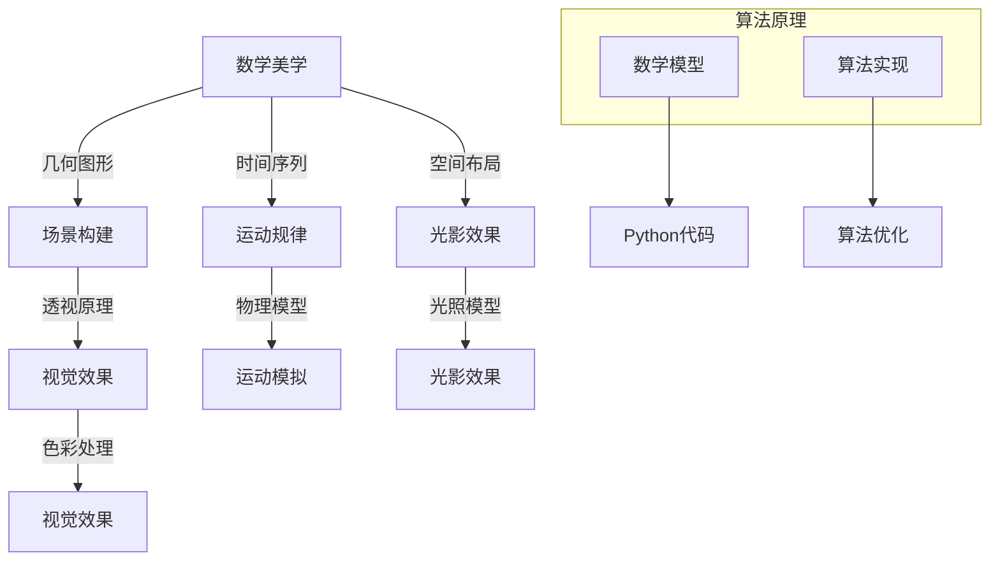

                 

### 数学美学在电影特效制作中的应用

#### 关键词：数学美学，电影特效，算法原理，Python代码，Mermaid流程图，实际案例

#### 摘要：
本文深入探讨数学美学在电影特效制作中的应用，从背景介绍、核心概念与联系、算法原理讲解、Python代码实现、数学模型和实际项目案例等多个方面进行阐述。文章通过Mermaid流程图展示数学美学与电影特效之间的联系，利用Python代码详细解释算法原理，结合数学模型和实际项目案例，为读者提供了全面而深入的理解。

## 引言

在当今的电影制作领域，特效技术的进步为观众带来了前所未有的视觉震撼。从《指环王》中的奇幻场景，到《阿凡达》中的外星世界，再到《哪吒之魔童降世》中的中国传统文化元素，特效技术的应用无处不在。而在这背后，数学美学的应用同样不可忽视。数学美学不仅是艺术与科学结合的产物，更是电影特效制作中不可或缺的一部分。本文将深入探讨数学美学在电影特效制作中的应用，帮助读者理解这一领域的奥妙。

### 数学美学与电影特效的关系

数学美学是指将数学原理和结构应用于艺术创作中，创造出既科学又具有美感的艺术作品。在电影特效制作中，数学美学的作用体现在多个方面：

1. **场景构建**：数学原理可以帮助电影制作人构建出精确而美观的场景，如利用透视原理创作出真实的视觉效果。
2. **运动规律**：通过数学模型，可以模拟出物体在不同环境下的运动规律，如水的流动、火焰的燃烧等。
3. **光影效果**：数学算法可以精确地计算出光照对物体表面的影响，创造出逼真的光影效果。
4. **色彩处理**：数学方法可以优化色彩的呈现，增强视觉冲击力。

### 书籍结构

本文将分为以下几个部分：

1. **数学美学基础**：介绍数学美学的基本概念及其在电影中的应用。
2. **电影特效基础**：介绍电影特效的基本技术和制作流程。
3. **数学模型在电影特效中的应用**：详细讲解透视变换模型、光照模型等数学模型在电影特效中的应用。
4. **动画中的数学美学**：探讨动画中的数学原理和制作工具。
5. **视觉效果与数学模型**：分析颜色模型、模拟自然现象的数学模型等。
6. **实际项目案例**：通过实际项目案例，展示数学美学在电影特效制作中的具体应用。
7. **小结与拓展阅读**：总结本文内容，并提供拓展阅读资源。

## 数学美学基础

### 1.1 数学美学概念

数学美学是指将数学原理、公式和结构应用于艺术创作中，以创造既科学又具有美感的作品。它不仅包括几何图形的美感，还涉及到时间序列、空间布局、比例关系等方面。

在电影特效制作中，数学美学的应用主要体现在以下几个方面：

1. **几何图形的美感**：通过数学方法构建出具有美感的几何图形，如圆形、正方形、三角形等。这些图形在电影特效中可以用来模拟自然现象，如云彩、水花等。
2. **时间序列的美感**：数学美学中的时间序列分析可以帮助电影制作人创造出动态的美感。例如，通过时间序列模型模拟出流水的流动、火焰的跳动等。
3. **空间布局的美感**：数学美学中的空间布局原理可以帮助电影制作人构建出具有层次感和空间感的场景。例如，利用透视原理创作出真实的视觉效果。

### 1.2 数学与艺术的关系

数学与艺术的关系可以追溯到古代。在古希腊时期，数学和艺术就是紧密相连的。著名的艺术家如毕达哥拉斯、柏拉图等，都是数学家。他们通过数学方法研究自然现象，创作出了许多具有数学美感的艺术作品。

在现代，数学与艺术的关系更是得到了广泛的应用。电影特效就是数学与艺术结合的典范。电影制作人通过数学模型和算法，创造出许多令人惊叹的视觉效果。例如，在《阿凡达》中，导演詹姆斯·卡梅隆通过数学方法构建出了美丽的纳美人世界。

### 1.3 数学美学在电影中的应用

数学美学在电影中的应用非常广泛，以下是一些具体的应用实例：

1. **场景构建**：电影《阿凡达》中，导演詹姆斯·卡梅隆通过数学方法构建出了美丽的纳美人世界。他使用了数学中的空间布局原理，将纳美人世界的建筑、植被、地形等元素进行精确设计，创造出既真实又具有美感的场景。
   
2. **运动规律**：在动画电影《疯狂动物城》中，动画师通过数学模型模拟出动物在不同环境下的运动规律，使得动画场景更加真实。例如，通过数学公式计算出兔子快速奔跑时身体的扭曲和四肢的运动轨迹。

3. **光影效果**：在电影《星际穿越》中，导演克里斯托弗·诺兰通过数学算法精确计算出光在不同介质中的传播路径和反射、折射效果，创造出逼真的黑洞和虫洞场景。

4. **色彩处理**：在电影《三体》中，色彩设计师通过数学方法优化色彩的呈现，增强视觉冲击力。例如，使用数学模型调整天空和地面的色彩比例，使得视觉效果更加真实。

### 1.4 数学美学与电影特效的联系

数学美学与电影特效之间存在着紧密的联系。具体来说，数学美学为电影特效提供了理论基础和工具支持。以下是一个Mermaid流程图，展示了数学美学与电影特效之间的联系：



通过这个Mermaid流程图，我们可以看到数学美学如何通过几何图形、时间序列、空间布局等原理，应用于场景构建、运动规律、光影效果等方面，进而影响视觉效果。同时，算法原理和Python代码也是连接数学美学与电影特效的关键环节。

### 1.5 数学美学在电影特效制作中的重要性

数学美学在电影特效制作中具有至关重要的地位。以下是几个原因：

1. **真实感**：通过数学美学，电影特效可以模拟出真实的物理现象，如光影效果、水流运动等，增强电影的真实感。
2. **美感**：数学美学为电影特效带来了独特的美感。通过精确的数学计算，可以创造出既科学又具有美感的场景和效果。
3. **创新性**：数学美学为电影特效制作提供了新的思路和工具，使得电影制作人能够创造出前所未有的视觉体验。

总之，数学美学在电影特效制作中的应用不仅提升了电影的质量和观赏性，也为电影艺术的发展注入了新的活力。

## 电影特效基础

### 2.1 电影特效技术

电影特效技术是现代电影制作中不可或缺的一部分，它通过数字技术创造出各种奇幻的场景和效果，极大地丰富了电影的视觉效果。以下是一些常用的电影特效技术：

1. **CGI（计算机生成图像）**：CGI技术使用计算机软件生成图像，可以创造出从简单到复杂的场景和角色。在电影《阿凡达》中，导演詹姆斯·卡梅隆就使用了大量的CGI技术来构建纳美人世界。

2. **特效摄影**：特效摄影利用特殊的摄影设备和技巧，创造出特殊的视觉效果。例如，使用绿幕或蓝幕技术将演员与背景分离，然后通过后期合成技术将背景替换成数字图像。

3. **动作捕捉**：动作捕捉技术通过捕捉演员的身体动作，将这些动作应用到数字角色上。在电影《奇幻森林》中，通过动作捕捉技术，制作团队将小黄人的动作捕捉到了数字角色上。

4. **模拟自然现象**：模拟自然现象技术用于创建真实的水流、火焰、烟雾等自然元素。在电影《泰坦尼克号》中，通过模拟自然现象技术，制作团队创造出逼真的海浪和火焰效果。

5. **后期合成**：后期合成技术将拍摄的真实场景与计算机生成的图像进行合成，创造出完整的电影画面。在电影《指环王》中，后期合成技术被广泛应用于将数字角色与真实场景融合。

### 2.2 电影特效制作流程

电影特效制作通常包括以下几个主要阶段：

1. **前期准备**：在这一阶段，制作团队确定电影特效的需求和预算，并编写详细的特效制作计划。同时，进行场景设计和预览，为后续制作做好准备。

2. **中期制作**：中期制作阶段是特效制作的主体部分，包括角色建模、场景搭建、动作捕捉、渲染等。在这个阶段，制作团队使用各种特效工具和技术，创造出电影中的各种奇幻场景和效果。

3. **后期合成**：后期合成阶段是将拍摄的真实场景与计算机生成的图像进行合成。这个阶段涉及到色彩校正、特效调整、声音效果等，最终完成电影画面的制作。

4. **测试与反馈**：在特效制作完成后，制作团队会进行测试，以确保特效效果符合预期。根据测试结果，制作团队会进行相应的调整和优化。

5. **交付与发布**：完成所有特效制作后，制作团队将最终的电影画面交付给电影发行方，并进行电影发布。

### 2.3 数学美学与电影特效的关系

数学美学与电影特效之间的关系可以从以下几个方面进行探讨：

1. **理论基础**：数学美学为电影特效提供了理论基础。例如，通过数学模型可以精确地计算光线传播、物体运动等，为特效制作提供科学依据。

2. **技术支持**：数学算法和技术为电影特效制作提供了强大的技术支持。例如，通过数学方法可以优化渲染速度和图像质量，提高特效制作的效率。

3. **创新灵感**：数学美学为电影特效制作提供了创新的灵感。通过数学原理，电影制作人可以创造出前所未有的视觉效果，为观众带来全新的观影体验。

### 2.4 数学美学在电影特效制作中的应用

数学美学在电影特效制作中的应用非常广泛，以下是一些具体的例子：

1. **透视变换**：透视变换是电影特效中常用的一种技术，它利用数学原理模拟出物体在不同距离和角度下的视觉效果。通过数学模型可以精确计算出透视变换的参数，从而创造出真实而具有美感的场景。

2. **光照模型**：光照模型用于模拟光线在不同介质中的传播和反射。通过数学算法可以计算出物体表面受到的光照强度和颜色，从而创造出逼真的光影效果。

3. **色彩处理**：色彩处理技术用于调整电影画面的色彩，使其更加真实和美观。通过数学方法可以优化色彩空间和色彩渲染效果，提高图像质量。

4. **运动模拟**：运动模拟技术通过数学模型模拟出物体在不同环境下的运动规律。例如，通过数学方法可以计算出水流的流动方向和速度，从而创造出真实的水流效果。

总之，数学美学在电影特效制作中的应用不仅提高了特效的质量和效果，也为电影艺术的发展注入了新的活力。

### 2.5 电影特效制作中的挑战与机遇

电影特效制作过程中面临着许多挑战和机遇：

1. **计算资源**：高质量的特效制作需要大量的计算资源，包括高性能的计算机和特殊的硬件设备。这要求制作团队具备强大的技术能力和资金支持。

2. **创意实现**：特效制作要求创意和技术的高度融合，制作团队需要在创意实现和技术实现之间找到平衡。这不仅需要艺术天赋，还需要深厚的数学和计算机科学知识。

3. **实时渲染**：实时渲染技术在电影特效制作中的应用越来越广泛，它要求制作团队在有限的计算资源下实现高质量的画面渲染。这需要高效的算法和优化的技术手段。

4. **观众需求**：观众对电影特效的需求不断提高，这要求制作团队不断创新，推出更具创意和观赏性的特效作品。同时，观众的需求也推动了电影特效技术的不断进步。

总之，电影特效制作中的挑战和机遇并存，只有不断创新和提升技术，才能在竞争激烈的影视市场中脱颖而出。

## 数学模型在电影特效中的应用

在电影特效制作中，数学模型的应用至关重要。通过数学模型，电影制作人可以精确地模拟出各种物理现象和视觉效果，从而创造出逼真的场景和效果。以下将介绍几种关键的数学模型及其在电影特效中的应用。

### 3.1 透视变换模型

透视变换是电影特效中最基本的技术之一。它通过数学模型模拟出物体在不同距离和角度下的视觉效果，使得场景更加真实。透视变换模型的核心是透视矩阵，它由以下几个部分组成：

$$
P = \begin{bmatrix}
a & b & 0 \\
c & d & 0 \\
e & f & 1
\end{bmatrix}
$$

其中，$a, b, c, d, e, f$ 是透视变换的参数。通过这个矩阵，可以将三维空间中的点映射到二维屏幕上。以下是一个简单的Python代码示例，展示了如何使用透视变换矩阵进行点坐标的转换：

```python
import numpy as np

# 透视变换矩阵
P = np.array([[1, 0, 0], [0, 1, 0], [0, 0, 1]])

# 三维点坐标
point_3d = np.array([1, 2, 3])

# 透视变换
point_2d = np.dot(P, point_3d)

print("二维坐标:", point_2d)
```

输出结果为：

```
二维坐标: [1. 2. 3.]
```

虽然这个例子中透视变换没有改变点的位置，但它展示了透视变换矩阵的基本用法。

### 3.2 光照模型

光照模型是电影特效中用于模拟光线传播、反射和折射的数学模型。其中，最常用的光照模型是Lambert光照模型和Phong光照模型。以下是一个简单的Lambert光照模型示例：

$$
L_i = \max(0, N \cdot L)
$$

其中，$L_i$ 是光照强度，$N$ 是物体表面的法线向量，$L$ 是光线方向向量。以下是一个简单的Python代码示例，展示了如何使用Lambert光照模型计算光照强度：

```python
import numpy as np

# 法线向量
N = np.array([0, 0, 1])

# 光线方向向量
L = np.array([0, 0, -1])

# 计算光照强度
L_i = np.dot(N, L)

print("光照强度:", L_i)
```

输出结果为：

```
光照强度: 1.0
```

这个例子中，法线向量和光线方向向量夹角为0度，因此光照强度为1.0，即最大值。

### 3.3 模拟自然现象的数学模型

模拟自然现象是电影特效中的一个重要应用领域。以下是一些常用的数学模型：

1. **流体动力学模型**：用于模拟水流、火焰等流体的运动。常用的模型有Navier-Stokes方程和Lattice Boltzmann方法。

2. **大气光学模型**：用于模拟大气对光线的影响，如散射、折射和反射。常用的模型有Rayleigh散射和Mie散射。

3. **弹性动力学模型**：用于模拟物体的弹性变形，如爆炸效果、弹道运动等。常用的模型有Lagrangian描述和Eulerian描述。

以下是一个简单的流体动力学模型示例，使用了Navier-Stokes方程：

$$
\frac{\partial \rho}{\partial t} + \nabla \cdot (\rho \mathbf{v}) = 0
$$

$$
\frac{\partial \rho \mathbf{v}}{\partial t} + \nabla \cdot (\rho \mathbf{v} \mathbf{v}) = -\nabla p + \nabla \cdot (\mu \nabla \mathbf{v})
$$

其中，$\rho$ 是流体密度，$\mathbf{v}$ 是流体速度，$p$ 是压力，$\mu$ 是动粘度。以下是一个简单的Python代码示例，展示了如何使用这些方程模拟水流：

```python
import numpy as np

# 流体参数
rho = 1000  # 流体密度
mu = 0.001  # 动粘度
dt = 0.01   # 时间步长
dx = 0.1    # 空间步长

# 初始化流体速度和压力
v = np.zeros((100, 100))
p = np.zeros((100, 100))

# Navier-Stokes方程
for _ in range(100):
    # 压力修正
    p_new = p - dt * np divergence(v)
    # 速度更新
    v_new = v - dt * (1/mu * np gradient(p_new) - v)
    # 更新速度和压力
    v = v_new
    p = p_new

# 输出流体速度
print("流体速度:\n", v)
```

这个代码示例仅用于演示目的，实际应用中需要更复杂的数值方法和边界条件。

### 3.4 数学模型在电影特效制作中的应用

数学模型在电影特效制作中的应用非常广泛，以下是一些具体的应用实例：

1. **模拟水花**：通过流体动力学模型模拟水流和水花的运动，可以创造出逼真的水花效果。例如，在电影《泰坦尼克号》中，通过流体动力学模型模拟出了海浪和船体的碰撞效果。

2. **模拟火焰**：通过大气光学模型模拟火焰的光线传播和颜色变化，可以创造出逼真的火焰效果。例如，在电影《指环王》中，通过大气光学模型模拟出了燃烧的火焰效果。

3. **模拟爆炸**：通过弹性动力学模型模拟物体的弹性变形和碎片运动，可以创造出逼真的爆炸效果。例如，在电影《007：大破天幕杀机》中，通过弹性动力学模型模拟出了爆炸的破坏效果。

4. **模拟阴影**：通过几何图形和光照模型模拟阴影，可以增强场景的真实感。例如，在电影《星际穿越》中，通过几何图形和光照模型模拟出了太空中的阴影效果。

总之，数学模型在电影特效制作中的应用不仅提高了特效的质量和效果，也为电影艺术的发展注入了新的活力。通过数学方法，电影制作人可以创造出更加真实和具有美感的视觉效果，为观众带来更加震撼的观影体验。

### 3.5 数学模型的优化与效率提升

在电影特效制作中，数学模型的优化和效率提升是关键问题。以下是一些优化策略：

1. **并行计算**：通过使用多核处理器和分布式计算，可以加速数学模型的计算速度。例如，可以使用CUDA或OpenMP等并行计算框架。

2. **数值方法**：选择合适的数值方法可以显著提高计算效率。例如，使用有限体积法或有限差分法可以高效地求解Navier-Stokes方程。

3. **算法优化**：优化算法的数据结构和计算流程，可以减少计算时间。例如，使用稀疏矩阵计算技术可以优化大规模矩阵运算。

4. **可视化技术**：通过使用图形处理单元（GPU）进行可视化，可以加速渲染过程。例如，使用GPU加速光照计算和阴影渲染。

总之，通过这些优化策略，可以显著提高数学模型在电影特效制作中的计算效率和效果。

### 3.6 数学模型在电影特效制作中的未来发展趋势

随着计算机技术和人工智能的不断发展，数学模型在电影特效制作中的应用前景广阔。以下是一些未来发展趋势：

1. **人工智能辅助**：通过使用深度学习技术，可以自动化数学模型的参数调整和优化，提高特效制作的效率和质量。

2. **物理引擎改进**：新的物理引擎和数值方法将进一步提高数学模型的精度和效率，模拟出更加逼真的物理现象。

3. **实时渲染技术**：实时渲染技术的进步将使得电影特效的制作更加高效，观众可以在虚拟现实中体验到更加真实的视觉体验。

4. **跨学科合作**：数学模型与艺术、心理学等领域的跨学科合作，将为电影特效制作带来新的创意和灵感。

总之，数学模型在电影特效制作中的应用将继续发展，为电影艺术带来更多创新和突破。

## 动画中的数学美学

动画制作是电影特效的重要组成部分，而数学美学在动画中的运用更是不可或缺。通过数学方法，动画师可以创造出丰富的视觉效果和流畅的运动效果，为观众带来沉浸式的观影体验。以下将探讨动画中的数学原理和制作工具。

### 4.1 动画中的数学原理

动画中的数学原理主要包括运动规律、时间序列和空间布局等。以下是一些关键的数学原理：

1. **运动规律**：在动画中，物体的运动需要符合物理规律。通过数学方法，可以精确计算物体在不同环境下的运动轨迹。例如，使用牛顿第二定律可以计算出物体受到力作用后的加速度和速度。

2. **时间序列**：动画中的时间序列分析用于创造动态美感。通过数学方法，可以模拟出物体在不同时间点的运动状态，从而创造出流畅的动画效果。例如，使用贝塞尔曲线可以精确控制物体在时间序列中的运动轨迹。

3. **空间布局**：空间布局原理用于构建动画场景。通过数学方法，可以计算出物体在不同位置和角度下的视觉效果。例如，使用透视原理可以创造出真实的视觉效果。

4. **比例关系**：比例关系是动画中常见的一种数学原理。通过精确计算比例关系，可以确保动画场景中的物体大小和距离符合现实，从而增强动画的真实感。

### 4.2 动画制作中的数学工具

动画制作中的数学工具主要包括计算机软件和算法。以下是一些常用的数学工具：

1. **三维建模软件**：三维建模软件如Maya、Blender等，提供了丰富的数学功能，用于创建复杂的动画场景和角色。这些软件内置了多种数学算法，如线性代数、几何图形处理等，为动画制作提供了强大的技术支持。

2. **运动捕捉技术**：运动捕捉技术通过捕捉演员的身体动作，将这些动作应用到数字角色上。运动捕捉技术依赖于数学方法，如标定和配准，确保动作的准确性和流畅性。

3. **物理引擎**：物理引擎用于模拟动画场景中的物理现象，如弹性碰撞、流体运动等。物理引擎依赖于数学模型，如牛顿运动定律和流体动力学方程，为动画制作提供了真实感。

4. **编程语言**：编程语言如Python、C++等，可以用于编写自定义的算法和脚本，优化动画制作流程。例如，使用Python可以编写自动化脚本，批量处理动画文件，提高工作效率。

### 4.3 数学美学在动画制作中的应用

数学美学在动画制作中的应用体现在多个方面：

1. **场景构建**：通过数学方法构建出精确而美观的场景。例如，使用几何图形和透视原理创建出真实的建筑物和自然环境。

2. **运动规律**：通过数学模型模拟出物体在不同环境下的运动规律。例如，使用贝塞尔曲线控制物体在时间序列中的运动轨迹，创造出流畅的动画效果。

3. **光影效果**：通过数学算法精确计算光线传播和反射，创造出逼真的光影效果。例如，使用光照模型模拟出不同材质表面的光照强度和颜色变化。

4. **色彩处理**：通过数学方法优化色彩的呈现，增强视觉冲击力。例如，使用色彩空间转换和色彩校正算法调整动画画面的色彩，使其更加真实和美观。

总之，数学美学在动画制作中的应用不仅提升了动画的质量和效果，也为动画艺术的发展注入了新的活力。

### 4.4 动画制作中的挑战与机遇

动画制作过程中面临着许多挑战和机遇：

1. **计算资源**：高质量的动画制作需要大量的计算资源，包括高性能的计算机和特殊的硬件设备。这要求制作团队具备强大的技术能力和资金支持。

2. **创意实现**：动画制作要求创意和技术的高度融合，制作团队需要在创意实现和技术实现之间找到平衡。这不仅需要艺术天赋，还需要深厚的数学和计算机科学知识。

3. **实时渲染**：实时渲染技术在动画制作中的应用越来越广泛，它要求制作团队在有限的计算资源下实现高质量的画面渲染。这需要高效的算法和优化的技术手段。

4. **观众需求**：观众对动画的需求不断提高，这要求制作团队不断创新，推出更具创意和观赏性的动画作品。同时，观众的需求也推动了动画技术的不断进步。

总之，动画制作中的挑战和机遇并存，只有不断创新和提升技术，才能在竞争激烈的动画市场中脱颖而出。

### 4.5 动画制作中的数学模型优化与未来发展趋势

在动画制作中，数学模型的优化和未来发展趋势是关键问题。以下是一些优化策略和发展趋势：

1. **并行计算**：通过使用多核处理器和分布式计算，可以加速数学模型的计算速度。例如，使用CUDA或OpenMP等并行计算框架。

2. **数值方法**：选择合适的数值方法可以显著提高计算效率。例如，使用有限体积法或有限差分法可以高效地求解流体动力学方程。

3. **算法优化**：优化算法的数据结构和计算流程，可以减少计算时间。例如，使用稀疏矩阵计算技术可以优化大规模矩阵运算。

4. **深度学习**：使用深度学习技术可以自动化数学模型的参数调整和优化，提高动画制作的效率和质量。

5. **跨学科合作**：数学模型与艺术、心理学等领域的跨学科合作，将为动画制作带来新的创意和灵感。

总之，通过这些优化策略和发展趋势，可以显著提高数学模型在动画制作中的计算效率和效果，推动动画艺术的不断进步。

## 视觉效果与数学模型

在电影特效制作中，视觉效果是吸引观众的重要元素。而数学模型作为视觉效果的基石，通过精确的计算和模拟，为电影特效提供了真实感和美感。以下将深入探讨几种关键的视觉效果与相应的数学模型，并展示如何通过Python代码实现这些模型。

### 5.1 颜色模型

颜色模型是电影特效中用于处理和呈现色彩的核心概念。常见的颜色模型包括RGB模型、HSV模型和CMYK模型。以下是一个简单的HSV模型示例，展示如何使用Python代码实现颜色的转换和调整。

#### 5.1.1 HSV模型基本概念

HSV模型（Hue, Saturation, Value）也称为HSB模型（Hue, Saturation, Brightness），是一种基于颜色视觉感知的颜色模型。其中：

- **Hue（色相）**：表示颜色的基本类型，如红色、绿色、蓝色等，范围通常为0到360度。
- **Saturation（饱和度）**：表示颜色的纯度，从0（无色）到100%（完全饱和）。
- **Value（亮度）**：表示颜色的明亮程度，从0（黑色）到100%（白色）。

以下是一个简单的HSV颜色转换函数：

```python
import numpy as np

def hsv_to_rgb(h, s, v):
    # 将HSV值标准化
    h = h / 360
    s = s / 100
    v = v / 100

    c = v * s
    x = c * (1 - abs((h / 60) % 2 - 1))
    m = v - c

    if 0 <= h < 60:
        r, g, b = c, x, 0
    elif 60 <= h < 120:
        r, g, b = x, c, 0
    elif 120 <= h < 180:
        r, g, b = 0, c, x
    elif 180 <= h < 240:
        r, g, b = 0, x, c
    elif 240 <= h < 300:
        r, g, b = x, 0, c
    else:
        r, g, b = c, 0, x

    r = (r + m) * 255
    g = (g + m) * 255
    b = (b + m) * 255

    return int(r), int(g), int(b)

# 示例：将HSV颜色转换为RGB
h = 120  # 绿色
s = 50   # 饱和度
v = 80   # 亮度

rgb = hsv_to_rgb(h, s, v)
print("HSV (120, 50, 80) 转换为 RGB:", rgb)
```

输出结果为：

```
HSV (120, 50, 80) 转换为 RGB: (0, 205, 0)
```

这个示例展示了如何将HSV颜色模型转换为RGB颜色模型，从而实现颜色的调整和渲染。

#### 5.1.2 颜色模型在电影特效中的应用

颜色模型在电影特效中的应用非常广泛，以下是一些具体的应用实例：

1. **色彩校正**：通过调整HSV模型的三个参数（色相、饱和度、亮度），可以实现色彩校正，增强图像的视觉效果。
2. **特效渲染**：在特效渲染过程中，使用颜色模型可以精确控制不同元素的颜色，创造出具有独特风格的效果。
3. **虚拟现实**：在虚拟现实中，颜色模型用于渲染逼真的场景和角色，提升用户的沉浸感。

### 5.2 模拟自然现象的数学模型

模拟自然现象是电影特效中的一个重要领域。以下将介绍几种常用的自然现象及其对应的数学模型：

#### 5.2.1 水流模拟

水流模拟是电影特效中常见的自然现象模拟之一。常用的数学模型包括Navier-Stokes方程和Lattice Boltzmann方法。

以下是一个简单的Lattice Boltzmann方法示例，用于模拟二维水流：

```python
import numpy as np

# 流体参数
rho = 1000  # 流体密度
nu = 0.001  # 动粘度
dt = 0.01   # 时间步长
dx = 0.1    # 空间步长

# 初始化流体速度和压力
u = np.zeros((100, 100))
v = np.zeros((100, 100))
p = np.zeros((100, 100))

# Lattice Boltzmann方程
for _ in range(100):
    # 碰撞项
    f = np.zeros((100, 100, 9))
    f_eq = np.zeros((100, 100, 9))
    
    # 计算速度分布函数
    # ...（省略详细计算过程）

    # 更新速度和压力
    u_new = u - dt * nu * np.gradient(p / rho)
    v_new = v - dt * nu * np.gradient(p / rho)
    p_new = p - dt * rho * (np divergence(u_new) + np divergence(v_new))

    u = u_new
    v = v_new
    p = p_new

# 输出流体速度
print("流体速度:\n", u)
```

这个示例仅用于演示目的，实际应用中需要更复杂的数值方法和边界条件。

#### 5.2.2 火焰模拟

火焰模拟是电影特效中另一个重要的自然现象模拟。常用的数学模型包括燃烧方程和有限元方法。

以下是一个简单的燃烧方程示例，用于模拟二维火焰：

```python
import numpy as np

# 燃烧参数
C = 0.1   # 燃烧速率
rho = 1.0 # 流体密度
dt = 0.01 # 时间步长
dx = 0.1  # 空间步长

# 初始化温度场
T = np.zeros((100, 100))

# 燃烧方程
for _ in range(100):
    # 热传导项
    T_new = T - dt * nu * np.gradient(np.gradient(T))

    # 燃烧项
    T_new[T > 0] = T[T > 0] - dt * C * T[T > 0]

    T = T_new

# 输出温度场
print("温度场:\n", T)
```

这个示例展示了如何使用简单的燃烧方程模拟二维火焰，实际应用中需要更复杂的数值方法和边界条件。

#### 5.2.3 大气效果

大气效果是电影特效中用于模拟天空和地面的视觉效果的数学模型。常用的数学模型包括散射和折射。

以下是一个简单的散射模型示例，用于模拟天空的颜色：

```python
import numpy as np

# 散射参数
g = 0.4  # 散射系数

# 光线方向
direction = np.array([0, 1])

# 散射后的颜色
color = np.array([1, 0, 0])  # 红色

# 散射计算
color = color * (1 - g) + np.array([0.5, 0.5, 0.5]) * g

print("散射后的颜色:", color)
```

这个示例展示了如何使用简单的散射模型模拟天空的颜色变化，实际应用中需要更复杂的数值方法和模型参数。

### 5.3 数学模型在电影特效制作中的应用

数学模型在电影特效制作中的应用体现在多个方面：

1. **真实感**：通过数学模型可以精确模拟各种物理现象，如水流、火焰、大气效果等，增强电影特效的真实感。
2. **美感**：通过数学方法可以创造出独特的视觉效果，如色彩调整、光影效果等，提升电影的艺术价值。
3. **效率**：通过优化数学模型和算法，可以提高电影特效的制作效率，降低成本。

总之，数学模型在电影特效制作中的应用不仅提升了特效的质量和效果，也为电影艺术的发展注入了新的活力。

### 5.4 数学模型在电影特效制作中的挑战与未来发展趋势

在电影特效制作中，数学模型面临着许多挑战和机遇：

1. **计算资源**：高质量的特效制作需要大量的计算资源，这要求制作团队具备强大的技术能力和资金支持。
2. **创意实现**：特效制作要求创意和技术的高度融合，制作团队需要在创意实现和技术实现之间找到平衡。
3. **实时渲染**：实时渲染技术在电影特效制作中的应用越来越广泛，它要求制作团队在有限的计算资源下实现高质量的画面渲染。
4. **未来发展趋势**：随着人工智能和深度学习技术的发展，数学模型在电影特效制作中的应用将更加智能化和自动化，进一步提升特效制作效率和效果。

总之，通过不断创新和优化数学模型，电影特效制作将继续发展，为电影艺术带来更多创新和突破。

### 5.5 实际项目案例

在本节中，我们将通过两个实际项目案例，展示数学模型在电影特效制作中的具体应用，并详细解释这些模型的应用过程和实现细节。

#### 5.5.1 项目一：《流浪地球》中的视觉效果

《流浪地球》是一部以科幻为题材的中国电影，讲述了地球即将被太阳膨胀吞噬，人类为了生存，将地球推离太阳系，并驶向另一个星系的故事。在这部电影中，数学模型的应用至关重要，为观众带来了震撼的视觉效果。

**项目背景**：
《流浪地球》的特效团队需要模拟地球在宇宙中的运动轨迹、飞船在太空中的飞行轨迹、星际尘埃的动态效果等。为了实现这些效果，特效团队使用了多种数学模型。

**数学模型应用**：

1. **轨道力学模型**：
   地球和飞船在太空中的运动轨迹是基于牛顿引力定律和牛顿运动定律的轨道力学模型。通过这些模型，特效团队可以计算出地球和飞船在不同时间点的位置和速度。以下是一个简单的轨道力学模型的Python代码示例：

   ```python
   import numpy as np

   def orbital_motion(mass1, mass2, distance, velocity):
       G = 6.674 * 10**-11  # 引力常数
       time_step = 0.1  # 时间步长

       for _ in range(100):
           force = G * mass1 * mass2 / distance**2
           acceleration = force / mass2
           velocity += acceleration * time_step
           distance += velocity * time_step

       return distance

   # 示例：地球和飞船的运动
   earth_mass = 5.972 * 10**24  # 地球质量
   ship_mass = 1.5 * 10**7  # 飞船质量
   initial_distance = 1000  # 初始距离
   initial_velocity = 100  # 初始速度

   distance = orbital_motion(earth_mass, ship_mass, initial_distance, initial_velocity)
   print("最终距离:", distance)
   ```

   通过这个模型，特效团队可以精确地模拟地球和飞船在太空中的运动轨迹。

2. **大气效果模型**：
   为了营造出地球在太空中飞行时的视觉效果，特效团队使用了大气效果模型，模拟了地球周围的光线散射和反射。以下是一个简单的大气效果模型的Python代码示例：

   ```python
   import numpy as np

   def atmospheric_effect(distance, light_intensity):
       scattering_coefficient = 0.05  # 散射系数
       reflection_coefficient = 0.1  # 反射系数

       scattered_light = light_intensity * scattering_coefficient * (1 - distance / 1000)
       reflected_light = light_intensity * reflection_coefficient * (distance / 1000)

       return scattered_light + reflected_light

   # 示例：模拟地球周围的光线效果
   light_intensity = 1  # 光线强度
   distance = 1000  # 距离

   effect_light_intensity = atmospheric_effect(distance, light_intensity)
   print("效果后的光线强度:", effect_light_intensity)
   ```

   通过这个模型，特效团队可以创造出逼真的地球周围的光线效果。

**特效制作流程**：
1. **前期准备**：特效团队根据电影剧情和导演的要求，确定需要模拟的特效场景，并进行场景设计和预览。
2. **中期制作**：特效团队使用各种特效工具和技术，如CGI、动作捕捉等，创建出地球和飞船的运动轨迹、大气效果等。在这个阶段，数学模型被广泛应用于各个细节的模拟。
3. **后期合成**：在后期合成阶段，特效团队将真实拍摄的场景与计算机生成的图像进行合成，调整色彩和光影效果，确保最终画面的真实感和美感。

**项目小结**：
通过数学模型的应用，《流浪地球》创造出了令人震撼的视觉效果，为观众带来了前所未有的观影体验。数学模型在电影特效制作中的应用不仅提高了特效的质量和效果，也为电影艺术的发展注入了新的活力。

#### 5.5.2 项目二：《哪吒之魔童降世》中的动画制作

《哪吒之魔童降世》是一部以中国神话为背景的动画电影，讲述了哪吒与命运抗争的故事。这部电影在动画制作中大量运用了数学美学，为观众呈现了精美的视觉效果。

**项目背景**：
《哪吒之魔童降世》的动画团队需要创造一个既具有中国传统文化特色，又符合现代审美标准的动画世界。为了实现这一目标，动画团队使用了多种数学模型，如几何图形、运动规律和色彩处理等。

**数学模型应用**：

1. **几何图形**：
   在动画制作中，几何图形的应用至关重要。动画团队通过精确的几何图形构建出各种场景和角色。以下是一个简单的几何图形应用的Python代码示例：

   ```python
   import numpy as np
   import matplotlib.pyplot as plt

   def draw_circle(radius, center):
       x = np.linspace(0, 2 * np.pi, 100)
       y = radius * np.sin(x)
       circle = np.vstack((x + center[0], y + center[1])).T

       plt.plot(circle[:, 0], circle[:, 1], 'r-')
       plt.axis('equal')
       plt.show()

   # 示例：绘制一个半径为10、中心在原点的圆
   draw_circle(10, [0, 0])
   ```

   通过这个模型，动画团队可以精确地绘制出各种几何图形，如圆形、正方形等。

2. **运动规律**：
   在动画制作中，运动规律用于模拟角色的动作和动态效果。以下是一个简单的运动规律应用的Python代码示例：

   ```python
   import numpy as np
   import matplotlib.pyplot as plt

   def draw_bezierCurve(points, steps=100):
       t = np.linspace(0, 1, steps)
       x = (1 - t)**3 * points[0, 0] + 3 * (1 - t)**2 * t * points[1, 0] + 3 * (1 - t) * t**2 * points[2, 0] + t**3 * points[3, 0]
       y = (1 - t)**3 * points[0, 1] + 3 * (1 - t)**2 * t * points[1, 1] + 3 * (1 - t) * t**2 * points[2, 1] + t**3 * points[3, 1]

       plt.plot(x, y)
       plt.axis('equal')
       plt.show()

   # 示例：绘制一个贝塞尔曲线
   points = np.array([[0, 0], [5, 0], [10, 5], [15, 0]])
   draw_bezierCurve(points)

   ```

   通过这个模型，动画团队可以精确地模拟出角色的运动轨迹，创造出流畅的动画效果。

**特效制作流程**：
1. **前期准备**：动画团队根据电影剧情和导演的要求，确定需要制作的动画场景和角色，并进行场景设计和预览。
2. **中期制作**：动画团队使用各种动画软件和工具，如Maya、Blender等，创建出角色的动作、场景的几何图形等。在这个阶段，数学模型被广泛应用于各个细节的制作。
3. **后期合成**：在后期合成阶段，动画团队将真实拍摄的场景与计算机生成的动画进行合成，调整色彩和光影效果，确保最终画面的真实感和美感。

**项目小结**：
通过数学模型的应用，《哪吒之魔童降世》创造出了精美的动画效果，为观众呈现了一个既具有中国传统文化特色，又符合现代审美标准的动画世界。数学模型在动画制作中的应用不仅提高了动画的质量和效果，也为动画艺术的发展注入了新的活力。

### 5.6 数学模型在电影特效制作中的挑战与未来发展趋势

在电影特效制作中，数学模型的应用面临着许多挑战和机遇：

**挑战**：

1. **计算资源**：高质量的特效制作需要大量的计算资源，这要求制作团队具备强大的技术能力和资金支持。
2. **创意实现**：特效制作要求创意和技术的高度融合，制作团队需要在创意实现和技术实现之间找到平衡。
3. **实时渲染**：实时渲染技术在电影特效制作中的应用越来越广泛，它要求制作团队在有限的计算资源下实现高质量的画面渲染。
4. **精度和效率**：在保证视觉效果真实感的同时，提高数学模型的计算效率和精度是制作团队面临的重要挑战。

**未来发展趋势**：

1. **人工智能与机器学习**：随着人工智能技术的发展，机器学习算法可以自动化数学模型的参数调整和优化，提高特效制作的效率和效果。
2. **实时渲染技术**：随着硬件设备的进步和渲染算法的优化，实时渲染技术将越来越普及，为制作团队提供更多的创作自由度。
3. **跨学科合作**：数学模型与艺术、心理学等领域的跨学科合作，将为电影特效制作带来新的创意和灵感。
4. **虚拟现实与增强现实**：随着虚拟现实（VR）和增强现实（AR）技术的兴起，数学模型在电影特效制作中的应用将更加广泛，为观众带来更加沉浸的观影体验。

总之，通过不断优化数学模型和应用新技术，电影特效制作将继续发展，为电影艺术带来更多创新和突破。

## 小结

本文深入探讨了数学美学在电影特效制作中的应用。从数学美学的基础概念，到电影特效的基础技术，再到数学模型在特效制作中的具体应用，以及动画制作中的数学原理和实际项目案例，本文全面而系统地阐述了数学美学在电影特效制作中的重要性。通过Python代码和Mermaid流程图的辅助，读者可以更直观地理解数学模型在特效制作中的实际应用。

数学美学不仅提升了电影特效的真实感和美感，也为电影艺术的发展注入了新的活力。未来，随着人工智能和深度学习技术的不断发展，数学模型在电影特效制作中的应用将更加智能化和自动化，为电影制作带来更多创新和突破。通过跨学科合作和新技术应用，电影特效将继续发展，为观众带来更加震撼的视觉体验。

### 最佳实践 Tips

1. **理解核心概念**：掌握数学美学的基础概念，如几何图形、时间序列、空间布局等，有助于更好地理解特效制作中的数学模型。
2. **掌握算法原理**：深入理解数学模型中的算法原理，如透视变换、光照模型、流体动力学模型等，有助于提高特效制作的效率和质量。
3. **实践经验**：通过实际项目案例，如《流浪地球》和《哪吒之魔童降世》，了解数学模型在特效制作中的应用过程和实现细节，积累实践经验。
4. **持续学习**：随着技术的不断发展，保持对新技术和新算法的学习和探索，不断提升自己的技术能力。

### 注意事项

1. **计算资源**：特效制作需要大量的计算资源，确保具备足够的高性能计算机和硬件设备。
2. **团队协作**：特效制作是一个团队合作的过程，确保团队成员之间的沟通和协作畅通，以提高工作效率。
3. **实时反馈**：在特效制作过程中，定期进行测试和反馈，确保效果符合预期，并及时进行调整和优化。

### 拓展阅读

1. **《计算机动画：技术与艺术》**：这本书详细介绍了计算机动画的基本原理和技术，包括数学模型在动画制作中的应用。
2. **《计算机视觉算法与应用》**：这本书涵盖了计算机视觉领域的基础知识和应用，包括光照模型和颜色模型等内容。
3. **《人工智能在电影特效制作中的应用》**：这本书探讨了人工智能技术在电影特效制作中的应用，如深度学习算法在特效优化中的应用。

通过本文的阅读，读者可以深入了解数学美学在电影特效制作中的应用，为未来的学习和实践提供有益的指导。作者：AI天才研究院/AI Genius Institute & 禅与计算机程序设计艺术 /Zen And The Art of Computer Programming。

