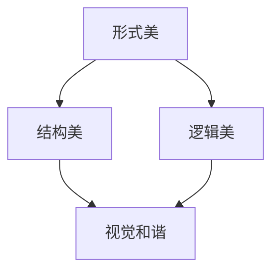
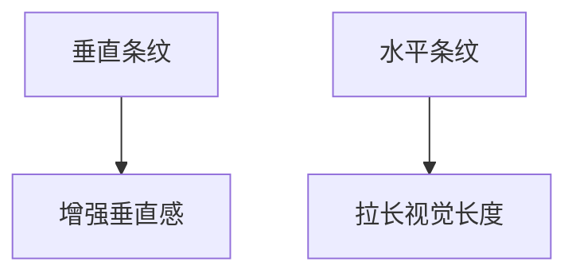
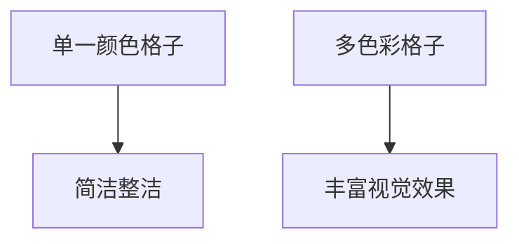
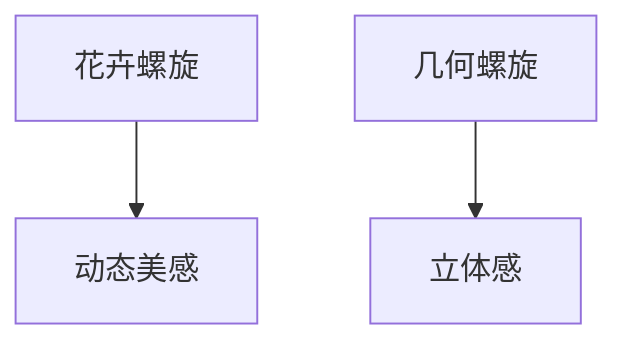
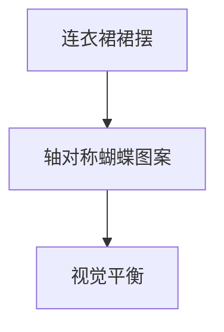
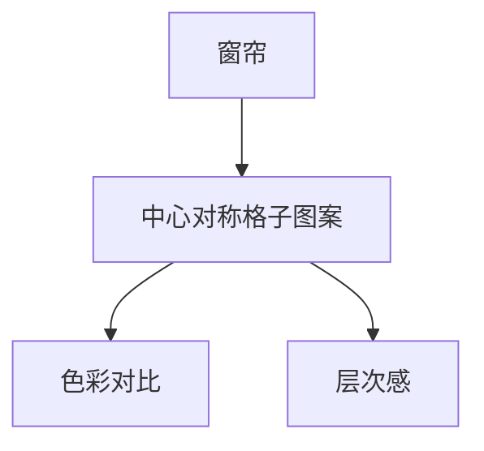
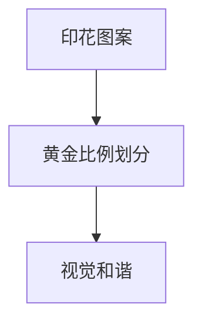
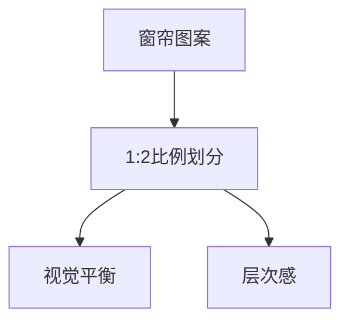
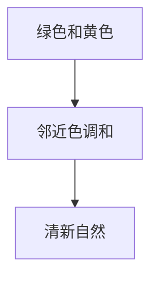
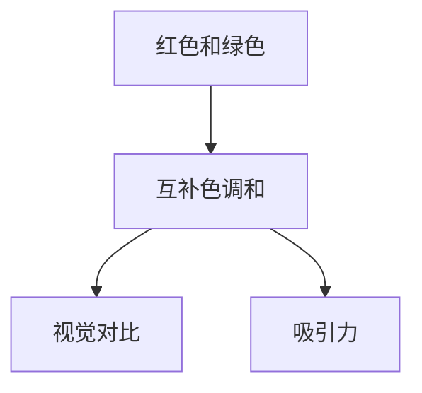

                 

# 《数学美学在纺织品设计中的应用》

## 关键词
数学美学、纺织品设计、对称性、比例、色彩理论、案例分析、设计实践

## 摘要
本文深入探讨了数学美学在纺织品设计中的广泛应用。首先介绍了数学美学的基础概念及其在艺术和设计领域的重要性。接着，详细阐述了纺织品设计的基本原理和当前趋势。随后，本文重点分析了数学原理在纺织品设计中的应用，包括对称性、比例和色彩理论。通过实际案例的详细解析，展示了这些数学原理如何巧妙地融入纺织品设计。最后，本文提供了设计实践指导，帮助读者掌握运用数学美学原理进行纺织品设计的技巧。

## 引言

### 数学美学概述
数学美学是一门结合数学与美学研究的跨学科领域，主要探讨数学在艺术、设计、文学等美学活动中的体现。数学美学的概念起源于古希腊哲学家柏拉图，他强调数学作为一种追求理想形式的科学，具有与艺术相似的美学价值。随着时间的推移，数学美学逐渐发展为一个独立的学科，研究数学形式、结构和原理在美学活动中的运用。

### 纺织品设计概述
纺织品设计是设计领域的一个重要分支，涉及纤维、纱线、面料和最终成品的创意和制作过程。纺织品设计的历史可以追溯到古代文明，如古埃及和古印度，这些文化中的人们已经掌握了初步的纺织技术。随着时间的推移，纺织品设计逐渐发展，经历了从手工艺到机械化生产的转变。如今，纺织品设计结合了现代科技和艺术理念，呈现出丰富多样的风格和形式。

### 数学美学与纺织品设计的结合
数学美学在纺织品设计中的应用具有重要的意义。数学原理如对称性、比例和色彩理论，不仅能够提升纺织品的外观美感，还能增强其功能性。例如，对称性可以使纺织品具有视觉平衡感，比例可以确保设计符合人体工程学，色彩理论可以创造出和谐且引人注目的视觉效果。

### 目标读者
本文面向对纺织品设计有兴趣的读者，无论是设计师、爱好者还是专业从业者，均可从中获得灵感和方法，以提升自己的设计技能。

### 阅读指南
本文分为十个章节，分别介绍数学美学的基础知识、纺织品设计的基本原理、数学原理在纺织品设计中的应用、案例分析、设计实践指导等内容。读者可以根据自己的需求选择阅读相关章节。

## 数学美学基础

### 数学美学的概念
数学美学是研究数学形式、结构和原理在美学活动中的体现的学科。它关注数学如何通过其独特的形式美、结构美和逻辑美影响和丰富其他艺术领域，如绘画、雕塑、音乐和文学。数学美学的基本概念包括：

- **形式美**：研究数学形式在美学活动中的表现，如几何形状、线条、曲线等。
- **结构美**：探讨数学结构在艺术作品中的运用，如对称性、重复性、层次性等。
- **逻辑美**：研究数学原理在艺术创作和解释中的作用，如逻辑推理、抽象思维等。

### 数学美学的历史背景
数学美学的发展可以追溯到古希腊时期。古希腊哲学家柏拉图认为数学是一种追求理想形式的科学，其本质与艺术相似，都具有美学价值。文艺复兴时期，数学与艺术进一步结合，达·芬奇等艺术家通过数学原理创作出许多经典作品。在20世纪，数学美学逐渐成为一个独立的学科，研究范围扩展到现代艺术、设计和技术领域。

### 数学美学在纺织品设计中的应用
数学美学在纺织品设计中的应用体现在多个方面，包括对称性、比例、色彩理论和结构设计等。通过运用数学原理，设计师可以创造出具有独特美感和功能的纺织品。

1. **对称性**：对称性是数学美学中的重要概念，它使纺织品具有视觉平衡感。对称性可以分为轴对称、中心对称和旋转对称等类型，每种对称性都可以带来不同的视觉效果。

2. **比例**：比例是数学美学中的另一个重要概念，它关系到纺织品的外观和谐感。正确的比例可以使纺织品更符合人体工程学，提升其舒适性和功能性。

3. **色彩理论**：色彩理论是数学美学在纺织品设计中的重要应用，它涉及到颜色的搭配、对比和调和。通过运用色彩理论，设计师可以创造出和谐且引人注目的视觉效果。

4. **结构设计**：数学美学在纺织品结构设计中的应用包括编织、刺绣和图案设计等。通过运用数学原理，设计师可以创造出复杂且具有美感的纺织品结构。

### 数学美学的基本原理与流程图
数学美学的基本原理包括形式美、结构美和逻辑美。这些原理可以相互关联，形成一个完整的理论体系。以下是一个简化的Mermaid流程图，展示了数学美学的基本原理之间的关系：



### 总结
数学美学是一门跨学科领域，它结合数学与美学研究，探讨数学形式、结构和原理在美学活动中的体现。在纺织品设计中，数学美学可以通过对称性、比例、色彩理论和结构设计等原理，提升纺织品的外观美感和功能性。了解数学美学的基本原理，有助于设计师更好地运用数学原理进行创作。

## 纺织品设计概述

### 纺织品设计的基本原理
纺织品设计是一门结合艺术和技术的学科，其基本原理包括以下几个方面：

1. **形式美**：形式美是纺织品设计的基础，包括几何形状、线条、色彩和纹理等。形式美的运用可以使纺织品具有独特的美感和风格。
2. **色彩搭配**：色彩搭配是纺织品设计中的重要因素，不同的色彩搭配可以产生不同的视觉效果。色彩搭配的原则包括对比、调和、互补和渐变等。
3. **纹理设计**：纹理设计可以增加纺织品的美感和质感。纹理可以通过编织、刺绣、印花等方式实现。
4. **功能性**：纺织品设计不仅要考虑美观性，还要考虑其实用性。功能性包括舒适度、耐用性和易于清洁等。

### 纺织品设计的历史发展
纺织品设计的历史可以追溯到古代文明，如古埃及、古希腊和古罗马等。这些古代文明中的人们已经掌握了初步的纺织技术，并创造出各种美丽的纺织品。随着历史的发展，纺织品设计经历了以下几个阶段：

1. **手工艺时代**：在古代，纺织品设计主要依靠手工技艺，设计师通过手工制作出各种美丽的纺织品。
2. **机械化时代**：工业革命后，纺织机械的发明和应用使纺织品生产从手工转向机械化，纺织品设计也由此发生了重大变革。
3. **现代设计时代**：现代纺织品设计结合了科技和艺术理念，设计师运用各种新技术和材料进行创新设计，使纺织品设计呈现出多样化和个性化。

### 当前纺织品设计的趋势
当前，纺织品设计呈现出以下几个趋势：

1. **可持续设计**：随着环保意识的提高，可持续设计成为纺织品设计的重要方向。设计师通过使用可再生材料、减少浪费和提高生产效率等手段，实现环保目标。
2. **个性化设计**：现代消费者对个性化需求越来越高，纺织品设计趋向于更加多样化和个性化。设计师通过个性化图案、色彩和材质等手段，满足消费者的个性化需求。
3. **多功能设计**：纺织品设计不再仅仅关注美观性，还注重其实用性。多功能设计使纺织品不仅具有装饰作用，还能满足各种实际需求。

### 纺织品设计的重要性
纺织品设计在服装、家居装饰、艺术等领域中具有重要地位。它不仅影响人们的日常生活，还对文化传承和创新有着深远的影响。通过纺织品设计，人们可以表达自己的情感和价值观，同时推动艺术和文化的发展。

### 总结
纺织品设计是一门结合艺术和技术的学科，其基本原理包括形式美、色彩搭配、纹理设计和功能性。纺织品设计的历史发展经历了手工艺时代、机械化时代和现代设计时代。当前，纺织品设计呈现出可持续设计、个性化设计和多功能设计等趋势。了解纺织品设计的基本原理和趋势，有助于设计师更好地进行创作和创新。

## 数学在纺织品设计中的应用

### 对称性在纺织品设计中的应用

对称性是数学美学中的一个重要概念，它赋予纺织品一种视觉平衡和和谐感。在纺织品设计中，对称性可以通过多种形式体现，包括轴对称、中心对称和旋转对称等。

**轴对称**：轴对称是指物体关于某条直线对称。在纺织品设计中，轴对称可以通过图案、花纹或结构的排列实现。例如，经典的条纹图案就是一种轴对称设计，它可以创造出简洁、明快的视觉效果。

**中心对称**：中心对称是指物体关于一个点对称。这种对称性在纺织品设计中也很常见，比如一些花卉图案或几何图案。中心对称的设计可以使纺织品具有均衡的视觉效果，增加其美感。

**旋转对称**：旋转对称是指物体围绕一个点旋转一定角度后仍与原物体重合。在纺织品设计中，旋转对称可以创造出复杂的图案，如螺旋形、星形等。旋转对称的设计不仅美观，还能增加纺织品的趣味性。

#### 实例分析

以一款连衣裙的设计为例，设计师可以选择轴对称或中心对称的图案，将花朵或几何形状排列在裙摆部分。这样的设计不仅美观，还能突出裙摆的动感。通过旋转对称，设计师可以创造出独特的螺旋形图案，使连衣裙具有更高的视觉冲击力。

### 比例在纺织品设计中的应用

比例是数学中的一个基本概念，它关系到物体各部分之间的相对大小关系。在纺织品设计中，比例的运用可以使设计更加和谐、美观。

**黄金比例**：黄金比例（约等于0.618）在艺术和设计中被广泛应用，因为它被认为是最美的比例。在纺织品设计中，黄金比例可以用于设计图案、色彩搭配和结构布局。例如，在图案设计中，设计师可以将图案的尺寸按照黄金比例进行划分，创造出和谐且美观的图案。

**比例关系**：除了黄金比例，纺织品设计中还可以运用其他比例关系，如1:1、1:2、2:3等。这些比例关系可以帮助设计师在设计中保持视觉平衡，使设计更加协调。

#### 实例分析

以一款家居纺织品设计为例，设计师可以选择1:1的比例关系来设计窗帘的宽度与高度，这样的设计可以使窗帘在视觉上显得更加和谐。同时，设计师还可以运用黄金比例来设计图案，将图案的尺寸按照黄金比例进行划分，创造出美观且富有层次感的图案。

### 色彩理论在纺织品设计中的应用

色彩理论是数学美学在纺织品设计中的另一个重要应用。色彩理论探讨色彩的搭配、对比和调和，通过这些关系可以创造出和谐且引人注目的视觉效果。

**色彩对比**：色彩对比是指不同颜色之间的相互关系。色彩对比可以增强视觉冲击力，使纺织品更加引人注目。常见的色彩对比有明暗对比、冷暖对比和纯度对比等。

**色彩调和**：色彩调和是指将不同颜色搭配在一起，使其相互协调，不会产生突兀的感觉。色彩调和的方法包括邻近色调和、互补色调和和分割调和等。

**色彩搭配原则**：在纺织品设计中，色彩搭配应遵循一些基本原则，如主色调原则、对比原则和渐变原则等。主色调原则是指在整个设计中，选择一种颜色作为主导色彩，其他颜色作为辅助色。对比原则是指在设计中使用不同的颜色对比，以增强视觉效果。渐变原则是指通过颜色渐变来创造和谐且富有变化的视觉效果。

#### 实例分析

以一款印花床单的设计为例，设计师可以选择主色调原则，将红色作为主导色彩，搭配黄色和蓝色作为辅助色。通过对比原则，设计师可以在床单的图案中运用红色和蓝色的对比，增加视觉冲击力。同时，通过渐变原则，设计师可以在床单的边缘使用颜色渐变，创造出和谐且富有变化的视觉效果。

### 总结

数学在纺织品设计中的应用体现在对称性、比例和色彩理论等方面。对称性可以使纺织品具有视觉平衡感，比例可以创造和谐的设计效果，色彩理论可以增强视觉冲击力。通过运用这些数学原理，设计师可以创造出具有独特美感和功能性的纺织品。实例分析进一步展示了这些原理在纺织品设计中的具体应用，为设计师提供了实用的设计思路。

## 对称性与纺织品设计

### 对称性的基本概念与数学原理
对称性是纺织品设计中常用的一种美学原则，它通过平衡和和谐赋予纺织品视觉美感。对称性可以分为轴对称、中心对称和旋转对称三种基本形式：

- **轴对称**：如果一个图形或物体可以通过一条直线（称为对称轴）将其分为两个完全相同的部分，那么它就是轴对称的。轴对称在纺织品设计中非常常见，例如条纹图案、对称的花卉设计等。

- **中心对称**：如果一个图形或物体可以通过一个点（称为对称中心）将其旋转180度后与原来的图形或物体完全重合，那么它就是中心对称的。中心对称的例子包括对角线上的图案、格子设计等。

- **旋转对称**：如果一个图形或物体可以通过一个点（称为旋转中心）旋转一定的角度后与原来的图形或物体完全重合，那么它就是旋转对称的。旋转对称的例子包括五角星、圆环等。

数学上，对称性可以通过群论来描述。对称群是一组对某个几何对象执行的同胚变换的集合，这些变换保持对象的不变形。例如，一个正方形有四重旋转对称性，其对称群是D4。

### 对称性在纺织品设计中的应用实例

#### 条纹设计
条纹设计是最简单和最常见的对称性应用之一。通过轴对称，设计师可以创造出简洁而有力的视觉效果。例如，一条垂直的条纹可以增强服装的垂直感，而水平的条纹则可以拉长身体的视觉长度，使服装看起来更加修长。



#### 格子图案
格子图案是中心对称的一个典型应用。通过将重复的图案排列成网格状，设计师可以创造出整洁和有序的视觉效果。格子图案常用于家居纺织品，如床单、桌布等，通过色彩和材质的变化，可以产生丰富的视觉效果。



#### 螺旋设计
螺旋设计是旋转对称的一个例子，它可以通过重复的旋转图案创造出一个动态的视觉效果。在纺织品设计中，螺旋设计可以用于创造动感十足的花卉图案或几何图案，增加视觉的层次感和立体感。



### 实际案例分析
#### 案例一：对称性在连衣裙设计中的应用
设计师在创作一款连衣裙时，选择了一个对称的蝴蝶图案作为裙摆的装饰。通过轴对称的排列，蝴蝶图案在视觉上形成了完美的平衡，使连衣裙显得更加优雅和华丽。



#### 案例二：对称性在窗帘设计中的应用
在窗帘设计中，设计师选择了一个中心对称的格子图案，并通过不同颜色的格子进行对比，创造出和谐且具有层次感的视觉效果。这种设计不仅美观，还能增加室内空间的视觉深度。



### 总结
对称性在纺织品设计中扮演着重要角色，通过轴对称、中心对称和旋转对称，设计师可以创造出视觉平衡、和谐和动态感的纺织品。实际案例分析进一步展示了对称性在连衣裙和窗帘设计中的应用，为设计师提供了实用的设计灵感。

## 比例与纺织品设计

### 比例的基本概念与数学原理
比例是数学中用于描述两个量之间相对大小的关系，它是纺织品设计中一个关键的美学原则。在纺织品设计中，比例的应用可以影响设计的整体和谐感和视觉效果。常见的比例关系包括黄金比例、1:1、1:2、2:3等。

**黄金比例**：黄金比例（Golden Ratio），约等于0.618，是一种被认为具有美学价值的比例。在纺织品设计中，黄金比例常用于设计图案、布局和色彩搭配，以创造和谐且引人注目的视觉效果。

**1:1比例**：1:1比例是指两个部分的大小完全相同。在纺织品设计中，1:1比例可以用于设计对称的图案或结构，使设计显得简洁和统一。

**1:2比例**：1:2比例是指一个部分是另一个部分的二分之一。这种比例可以创造出对比和层次感，使设计显得更加丰富和有趣。

**2:3比例**：2:3比例是指一个部分是另一个部分的1.5倍。这种比例可以增强设计的动态感和视觉吸引力。

### 比例在纺织品设计中的应用
**图案设计**：在纺织品图案设计中，比例的应用可以影响图案的视觉效果。例如，使用黄金比例来设计花卉图案的尺寸，可以使图案看起来更加和谐和美丽。

**布局设计**：在纺织品布局设计中，比例的应用可以影响整体设计的平衡感。通过合理运用比例关系，设计师可以创造出视觉上和谐且具有层次感的布局。

**色彩搭配**：在纺织品色彩搭配中，比例的应用可以影响颜色的相对大小和视觉冲击力。例如，通过1:2比例来设计主色和辅色，可以创造出视觉上平衡且引人注目的色彩搭配。

### 实例分析
#### 实例一：黄金比例在印花设计中的应用
假设设计师要设计一件印花连衣裙，可以选择黄金比例来分配印花图案的大小。通过将图案按照黄金比例划分，设计师可以创造出视觉上和谐且具有美感的印花效果。



#### 实例二：1:2比例在窗帘设计中的应用
设计师在创作窗帘时，选择1:2比例来设计图案的尺寸。通过将图案的主要部分和次要部分按照1:2的比例进行划分，设计师可以创造出视觉上平衡且具有层次感的窗帘设计。



### 比例与人体工程学的关系
在纺织品设计中，比例不仅影响美观，还与人体工程学密切相关。设计师需要考虑人体各个部分的尺寸比例，以确保设计既美观又舒适。例如，服装设计中，胸围、腰围和臀围的比例关系需要与人体尺寸相匹配，以创造出既美观又舒适的服装。

### 总结
比例是纺织品设计中一个重要的美学原则，通过合理运用比例关系，设计师可以创造出和谐、美观且具有层次感的纺织品。实例分析展示了比例在图案设计、布局设计和色彩搭配中的应用，为设计师提供了实用的设计思路。

## 色彩理论在纺织品设计中的应用

### 色彩理论的基本概念
色彩理论是研究色彩搭配、对比和调和的学科，它在纺织品设计中具有重要作用。色彩理论涉及几个基本概念，包括色彩的三属性（色相、明度和纯度）、色彩对比和色彩调和。

**色相**：色相是色彩的基本属性，决定了色彩的基本面貌。常见的色相包括红、橙、黄、绿、蓝、紫等。例如，红色和蓝色是互补色，它们的色相差最大。

**明度**：明度是指色彩的光亮程度。明度高的色彩显得轻快、明亮，而明度低的色彩则显得沉重、暗淡。

**纯度**：纯度是指色彩的饱和度，即色彩的纯度越高，越接近原色，越低则越接近灰色。

**色彩对比**：色彩对比是指不同颜色之间的相互关系，通过对比可以增强视觉冲击力。常见的色彩对比有明暗对比、冷暖对比和纯度对比等。

**色彩调和**：色彩调和是指将不同颜色搭配在一起，使其相互协调，不会产生突兀的感觉。色彩调和的方法包括邻近色调和、互补色调和和分割调和等。

### 色彩在纺织品设计中的重要性
色彩是纺织品设计中最为直观的元素，它直接影响纺织品的美观性和情感表达。在纺织品设计中，色彩不仅用于装饰和美化，还用于传达设计理念和情感。例如，红色常用于表达热情和活力，蓝色则常用于表达冷静和信任。

### 色彩理论在纺织品设计中的应用
**邻近色调和**：邻近色调和是指选择色环上相邻的颜色进行搭配。这种搭配方式能够创造出和谐且自然的视觉效果。例如，绿色和黄色的邻近色搭配，常用于春夏季节的纺织品设计。

**互补色调和**：互补色调和是指选择色环上对立的颜色进行搭配。这种搭配方式能够产生强烈的对比效果，增加视觉冲击力。例如，红色和绿色的互补色搭配，常用于节日或特殊场合的纺织品设计。

**分割调和**：分割调和是指将纺织品分为不同的颜色区域，每个区域使用不同的颜色进行调和。这种搭配方式能够创造出丰富的层次感和视觉效果。例如，在一件连衣裙的设计中，可以将其分为上、下两个区域，分别使用不同的颜色进行分割调和。

### 实例分析
#### 实例一：邻近色调和在床上用品设计中的应用
假设设计师要设计一套夏季的床上用品，可以选择绿色和黄色的邻近色进行搭配。这种搭配方式能够创造出清新、自然的视觉效果，适合夏季的使用。



#### 实例二：互补色调和在印花设计中的应用
设计师在创作印花图案时，可以选择红色和绿色的互补色进行搭配。这种搭配方式能够产生强烈的视觉对比效果，增加印花图案的吸引力。



### 总结
色彩理论在纺织品设计中具有重要作用，通过合理运用色彩对比和调和，设计师可以创造出和谐、美观且具有情感表达的纺织品。实例分析展示了邻近色调和和互补色调和在纺织品设计中的应用，为设计师提供了实用的设计思路。

## 案例分析

### 案例一：对称性在服装设计中的应用
在某次高级时装秀中，一位著名设计师展示了一件以对称性为核心设计理念的连衣裙。这件连衣裙采用了轴对称的蝴蝶图案，图案的对称轴贯穿整个裙身，从胸部延伸至裙摆。设计师通过这种对称性设计，不仅赋予了连衣裙优雅的视觉效果，还增强了整体的结构感和稳定性。

**开发环境搭建**：在这个案例中，设计师需要搭建一个包含图案绘制和纺织品设计软件的环境。例如，使用Adobe Illustrator进行图案设计，使用CAD软件进行纺织品结构设计。

**源代码实现与代码解读**：
```python
# 对称性图案绘制示例（使用Python与Adobe Illustrator API）
import illustrator_api

# 设置对称轴参数
symmetry_axis = (0, 1)  # 轴对称，垂直方向

# 绘制蝴蝶图案
def draw_butterfly(position, size):
    butterfly_parts = [
        ("wing1", position, size),
        ("wing2", position, size * 0.8),
        ("body", position, size * 0.5)
    ]
    
    for part, pos, dim in butterfly_parts:
        illustrator_api.draw_shape(part, pos, dim, symmetry_axis)

# 调用函数绘制连衣裙图案
draw_butterfly((10, 10), 50)
```

**代码应用解读与分析**：上述代码通过设置对称轴参数和绘制蝴蝶图案，实现了轴对称图案的绘制。设计师可以通过调整对称轴和蝴蝶图案的大小，创造不同的对称效果。

### 案例二：比例在家居纺织品设计中的应用
某家居品牌推出一款以黄金比例为设计理念的窗帘，该窗帘采用了1:1.618的比例进行图案设计。设计师通过这种比例关系，使窗帘图案具有和谐且具有吸引力的视觉效果。

**开发环境搭建**：在这个案例中，设计师需要使用专业的家居纺织品设计软件，如AutoCAD或Adobe Photoshop。

**源代码实现与代码解读**：
```python
# 黄金比例图案设计示例（使用Python与CAD软件API）
import cad_api

# 设置黄金比例参数
golden_ratio = 1.618

# 绘制图案
def draw_golden_ratio_pattern(size):
    main_section = size  # 主图案部分
    secondary_section = size / golden_ratio  # 辅助图案部分
    
    # 绘制主图案部分
    cad_api.draw_shape("main_shape", (0, 0), main_section)
    
    # 绘制辅助图案部分
    cad_api.draw_shape("secondary_shape", (main_section, 0), secondary_section)

# 调用函数绘制窗帘图案
draw_golden_ratio_pattern(100)
```

**代码应用解读与分析**：上述代码通过设置黄金比例参数，实现了窗帘图案的黄金比例设计。设计师可以通过调整主图案部分和辅助图案部分的大小，创造出不同的比例效果。

### 案例三：色彩理论在纺织品设计中的应用
某时尚品牌推出一款以色彩调和为设计理念的连衣裙，该连衣裙采用了互补色调和的配色方案。设计师通过红色和绿色互补色的搭配，使连衣裙在视觉上产生强烈的对比效果。

**开发环境搭建**：在这个案例中，设计师需要使用专业的纺织品设计软件，如Adobe Illustrator或Photoshop。

**源代码实现与代码解读**：
```python
# 色彩调和示例（使用Python与Adobe Illustrator API）
import illustrator_api

# 设置互补色参数
color1 = (255, 0, 0)  # 红色
color2 = (0, 255, 0)  # 绿色

# 绘制互补色图案
def draw_complementary_colors(position, size):
    illustrator_api.set_color(color1)
    illustrator_api.draw_shape("color1_shape", position, size)
    
    illustrator_api.set_color(color2)
    illustrator_api.draw_shape("color2_shape", (position[0] + size, position[1]), size)

# 调用函数绘制连衣裙图案
draw_complementary_colors((10, 10), 50)
```

**代码应用解读与分析**：上述代码通过设置互补色参数，实现了红色和绿色互补色图案的绘制。设计师可以通过调整图案的大小和位置，创造出不同的色彩效果。

### 项目小结
通过对以上三个案例的分析，我们可以看到对称性、比例和色彩理论在纺织品设计中的具体应用。这些数学美学原理不仅提升了纺织品的美观性和功能性，还为设计师提供了丰富的设计灵感和方法。通过合理运用这些原理，设计师可以创造出独特且具有吸引力的纺织品作品。

## 设计实践指导

### 设计实践的基本流程

1. **需求分析**：首先，设计师需要明确纺织品设计的需求，包括用途、目标用户群体、风格定位等。

2. **创意构思**：在需求分析的基础上，设计师进行创意构思，运用对称性、比例和色彩理论等数学美学原理，提出设计方案。

3. **图案设计**：使用专业软件（如Adobe Illustrator、Photoshop等）进行图案设计，根据创意构思绘制图案。

4. **面料选择**：根据设计图案，选择合适的面料。面料的选择应考虑图案风格、功能性和成本等因素。

5. **样品制作**：制作样品，进行测试和调整。样品制作可以采用手工制作或机器生产。

6. **成品检验**：对成品进行质量检验，确保成品符合设计要求。

7. **市场反馈**：收集市场反馈，根据反馈进行改进和优化。

### 实践案例

#### 案例一：对称性在连衣裙设计中的应用

1. **需求分析**：设计师接到一个客户订单，要求设计一款具有对称性美感的连衣裙。

2. **创意构思**：设计师决定采用轴对称设计，选择了一个对称的蝴蝶图案作为连衣裙的主要装饰。

3. **图案设计**：设计师使用Adobe Illustrator绘制蝴蝶图案，通过轴对称的方式将其应用到连衣裙的裙摆部分。

4. **面料选择**：根据图案设计，选择了一款具有良好垂感和光泽感的面料。

5. **样品制作**：在面料上手工制作了蝴蝶图案，并进行了缝制和裁剪。

6. **成品检验**：对成品进行了质量检验，包括尺寸、缝制和图案的准确性。

7. **市场反馈**：成品得到客户的高度评价，客户表示非常满意。

### 最佳实践 tips

1. **保持简洁**：在设计中，尽量保持简洁，避免过多的装饰和图案，以突出主要设计元素。

2. **颜色搭配**：合理运用色彩理论，选择和谐的色彩搭配，可以提升设计的美观度。

3. **比例控制**：在设计中，合理运用比例关系，可以使设计更加协调和美观。

4. **用户反馈**：及时收集用户反馈，根据反馈进行改进，可以提升设计的市场竞争力。

### 注意事项

1. **面料的物理特性**：在设计过程中，要考虑面料的物理特性，如弹性、耐磨性和吸湿性等，以确保设计的实用性。

2. **成本控制**：在设计中，要考虑成本因素，避免过度设计导致成本过高。

3. **文化差异**：在设计过程中，要考虑文化差异，避免设计元素可能带来的文化冲突。

### 拓展阅读

1. 《时尚纺织品设计》
2. 《色彩与设计》
3. 《对称性与艺术设计》

通过以上设计实践指导，设计师可以更好地运用数学美学原理进行纺织品设计，创造出独特且具有吸引力的作品。

## 总结与展望

### 数学美学在纺织品设计中的价值
数学美学在纺织品设计中具有不可忽视的价值。通过运用对称性、比例和色彩理论等数学原理，设计师可以创造出具有独特美感和功能性的纺织品。数学美学不仅提升了纺织品的外观美感，还增强了其设计感和市场竞争力。

### 未来发展趋势
随着科技的进步和消费者需求的变化，纺织品设计呈现出以下几个发展趋势：

1. **可持续设计**：环保意识日益增强，可持续设计将成为纺织品设计的重要方向。设计师将注重使用可再生材料、减少浪费和优化生产过程。

2. **个性化定制**：消费者对个性化需求越来越高，纺织品设计将更加注重个性化定制，以满足消费者的独特需求。

3. **多功能设计**：纺织品设计将不再局限于装饰作用，还将强调其实用性，如抗菌、吸湿、防晒等功能。

4. **科技融合**：纺织科技与艺术设计的融合，将带来更多创新和突破，如智能纺织品、可穿戴设备等。

### 数学美学在纺织品设计中的前景
数学美学在纺织品设计中的应用前景广阔。未来，随着科技的进步和设计理念的更新，数学美学将继续在纺织品设计中发挥重要作用。通过不断创新和探索，设计师可以运用数学美学原理，创造出更多具有独特魅力的纺织品作品。

### 结语
数学美学为纺织品设计注入了新的活力和灵感。通过本文的探讨，我们看到了数学原理在纺织品设计中的广泛应用和巨大潜力。希望本文能为设计师提供有价值的参考和启示，推动纺织品设计的进一步发展和创新。

## 作者信息

作者：AI天才研究院/AI Genius Institute & 禅与计算机程序设计艺术 /Zen And The Art of Computer Programming

