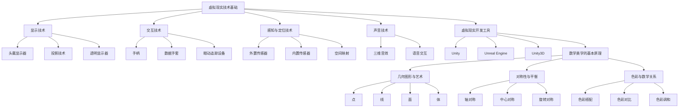

                 

### 第1章：引言与背景

#### 1.1 引言

虚拟现实（VR）和增强现实（AR）作为现代技术的代表，正在迅速改变人们的互动方式和生活体验。VR技术通过创造沉浸式环境，使用户能够体验仿佛身临其境的虚拟场景；而AR技术则将虚拟信息叠加在现实世界中，扩展用户的感知能力。随着技术的发展，VR叙事作为一种新兴的叙事形式，正逐渐受到广泛关注。

#### 1.2 数学美学

数学美学是一门研究数学形式与艺术美感的学科，强调数学原理在艺术创作中的应用。从几何图形到对称性，数学美学不仅在视觉艺术中具有重要地位，还在设计、建筑、音乐等多个领域产生了深远影响。

#### 1.3 虚拟现实叙事

虚拟现实叙事指的是在VR环境中创造和体验故事的过程。这种叙事形式打破了传统电影和文学的限制，允许用户通过交互和沉浸来体验故事，增加了叙事的丰富性和参与感。

#### 1.4 数学美学在VR叙事中的应用

本章将探讨数学美学在VR叙事中的应用，包括以下几个方面：

1. 几何建模与设计
2. 对称性与视觉效果
3. 算法驱动的交互体验
4. 数学公式与叙事结构
5. 项目实战案例分析

#### 1.5 本章小结

通过本章的介绍，读者将初步了解数学美学与VR叙事的关系，以及本书将要探讨的主要内容和应用场景。

### 关键词
虚拟现实、增强现实、数学美学、VR叙事、几何建模、对称性、算法驱动、交互体验

### 摘要
本文将探讨数学美学在虚拟现实叙事中的应用，通过分析几何建模、对称性、算法驱动的交互体验等方面，深入解析数学美学如何为VR叙事增添艺术性和沉浸感。本文还将结合实际项目案例，展示数学美学在VR叙事中的具体应用和实现方法。

---

### 第2章：虚拟现实与数学美学的理论基础

#### 2.1 虚拟现实技术基础

在本章中，我们将介绍虚拟现实的基本概念、技术架构和开发工具，为后续内容打下坚实的基础。

##### 2.1.1 虚拟现实的基本概念

虚拟现实（VR）是一种通过计算机技术创建的模拟环境，用户可以通过头戴显示器（HMD）、手柄等设备进入这个虚拟环境，与之进行互动。虚拟现实技术可以分为沉浸式和非沉浸式两种，沉浸式VR通过全封闭的视觉、听觉等多种感官模拟，实现高度沉浸的体验，而非沉浸式VR则通过计算机生成的图像在显示器上呈现，用户仍然处于现实环境中。

VR技术的分类可以基于不同的标准，如根据应用场景可以分为游戏、教育、医疗、军事等领域。VR的发展历程可以追溯到20世纪50年代，当时的科学家们开始研究如何通过计算机生成三维图像。1987年，Jaron Lanier创办了VPL公司，首次提出了“虚拟现实”这一概念，并开发了世界上第一个VR头盔和数据手套。随着技术的进步，VR设备的性能和用户体验不断提升，当前主流的VR设备包括Oculus Rift、HTC Vive和Google Cardboard等。

##### 2.1.2 虚拟现实的技术架构

虚拟现实的技术架构主要包括显示技术、交互技术、感知与定位技术、声音技术等方面。

- 显示技术：显示技术是VR的核心，决定了用户的沉浸感。当前主流的显示技术包括头戴显示器（HMD）、投影技术和透明显示器。头戴显示器通过遮挡现实世界，让用户完全沉浸在虚拟环境中，是最常用的VR显示设备。投影技术通过将虚拟图像投射到透明或半透明的屏幕上，实现虚实结合的体验。透明显示器则允许用户在观察虚拟图像的同时，仍然能够看到现实环境。

- 交互技术：交互技术是用户与虚拟环境进行交互的方式。常见的交互设备包括手柄、数据手套、眼动追踪设备等。手柄是最常用的交互设备，通过模拟物理操作，让用户在虚拟环境中进行各种动作。数据手套则通过检测手指的微小动作，实现更加精细的交互。眼动追踪设备可以记录用户的眼动轨迹，用于实现更加自然的交互体验。

- 感知与定位技术：感知与定位技术用于确定用户在虚拟环境中的位置和动作。当前主流的定位技术包括外置传感器、内置传感器和空间映射。外置传感器如激光雷达、摄像头等，可以测量用户和虚拟环境之间的距离和相对位置。内置传感器如加速度计、陀螺仪等，可以检测用户的运动和姿态。空间映射则是通过预先扫描现实环境，建立虚拟环境与物理环境之间的对应关系，实现精确的位置感知。

- 声音技术：声音技术在VR中的应用主要体现在三维音效和语音交互。三维音效通过模拟声音在三维空间中的传播，实现更加真实的听觉体验。语音交互则允许用户通过语音与虚拟环境进行交互，提高用户体验。

##### 2.1.3 虚拟现实开发工具

虚拟现实开发工具是开发者创建虚拟环境、应用和交互体验的重要工具。当前主流的VR开发工具有Unity、Unreal Engine、Unity3D等。

- Unity：Unity是一款功能强大的游戏开发引擎，适用于各种类型的VR项目。Unity提供了丰富的开发工具和资源，包括脚本编辑器、物理引擎、图形渲染器等。开发者可以使用C#语言进行开发，通过Unity的UI系统创建交互界面。

- Unreal Engine：Unreal Engine是Epic Games开发的领先游戏和VR开发引擎，以其出色的图形渲染能力和逼真的视觉效果而闻名。Unreal Engine支持蓝图可视化编程，允许开发者通过图形化的节点连接实现复杂的逻辑功能。

- Unity3D：Unity3D是Unity公司开发的一款轻量级游戏开发引擎，适用于小型VR项目。Unity3D提供了易于上手的开发环境，支持C#和JavaScript两种编程语言，适用于快速原型开发和项目迭代。

#### 2.2 数学美学的基本原理

数学美学是一门研究数学形式与艺术美感的学科，强调数学原理在艺术创作中的应用。从几何图形到对称性，数学美学不仅在视觉艺术中具有重要地位，还在设计、建筑、音乐等多个领域产生了深远影响。

##### 2.2.1 几何图形与艺术

几何图形是数学美学的核心元素，包括点、线、面、体等。几何图形在艺术创作中的应用非常广泛，如建筑、绘画、雕塑等领域。以下是一些几何图形在艺术中的具体应用：

- 点：点是最基本的几何元素，可以用来绘制像素、构成图案。在艺术中，点可以表现出细致的细节和层次感。

- 线：线是连接两个点的几何元素，可以用来绘制轮廓、线条和纹理。线在艺术中具有丰富的表现力，可以传达出不同的情感和氛围。

- 面：面是由多个线段围成的几何元素，可以用来绘制平面图案和立体图形。面在艺术中可以表现出二维和三维的空间感。

- 体：体是三维空间中的几何元素，可以用来构建复杂的立体结构。体在艺术中可以表现出立体感和空间感，增强作品的视觉效果。

##### 2.2.2 对称性与平衡

对称性是数学美学中的重要概念，指的是图形在某种变换下保持不变的性质。对称性可以分为轴对称、中心对称和旋转对称等。对称性在艺术和设计中具有重要作用，可以创造出稳定、和谐和美观的作品。

- 轴对称：轴对称是指图形关于某条直线对称。轴对称可以使作品具有稳定和平衡感，常用于绘画和设计。

- 中心对称：中心对称是指图形关于某个点对称。中心对称可以创造出一种动态和平衡感，常用于装饰艺术和建筑。

- 旋转对称：旋转对称是指图形关于某个点旋转一定角度后与原图形重合。旋转对称可以创造出独特的视觉效果，常用于装饰图案和艺术创作。

##### 2.2.3 色彩与数学关系

色彩是艺术创作中的重要元素，与数学有着密切的关系。色彩的科学基础是光学的三原色理论，即红、绿、蓝三种颜色的光按照不同的比例混合可以产生其他颜色。色彩在艺术创作中的应用包括色彩搭配、色彩对比和色彩调和等。

- 色彩搭配：色彩搭配是指将不同的颜色组合在一起，创造出和谐或对比的视觉效果。色彩搭配的数学原理包括三原色混合、互补色搭配和分割法等。

- 色彩对比：色彩对比是指通过对比不同颜色的亮度和饱和度，创造出视觉冲击力。色彩对比的数学原理包括亮度对比、饱和度对比和色彩对比度等。

- 色彩调和：色彩调和是指将不同的颜色组合在一起，创造出和谐、统一的视觉效果。色彩调和的数学原理包括颜色空间、色彩模型和色彩协调性等。

#### 2.3 VR叙事中的数学美学应用

数学美学在VR叙事中的应用主要体现在几何建模、视觉效果设计、交互体验优化等方面。以下是一些具体的应用场景：

- 几何建模：数学美学在几何建模中的应用主要体现在几何形状的设计和构建。通过运用数学原理，如对称性、比例关系等，可以创造出具有艺术美感的几何结构，增强作品的视觉效果。

- 视觉效果设计：数学美学在视觉效果设计中的应用主要体现在色彩搭配、光影效果等方面。通过运用数学原理，如色彩理论、光影原理等，可以创造出富有艺术美感的视觉效果，增强用户的沉浸体验。

- 交互体验优化：数学美学在交互体验优化中的应用主要体现在交互界面的设计和交互逻辑的构建。通过运用数学原理，如对称性、比例关系等，可以创造出更加直观、易用的交互界面，提高用户的交互体验。

##### 2.3.1 几何建模与视觉效果

几何建模是虚拟现实开发的核心技术之一，数学美学在几何建模中的应用主要体现在以下几个方面：

- 几何形状的设计和构建：通过运用数学原理，如对称性、比例关系等，可以创造出具有艺术美感的几何形状。例如，在建筑模型中，可以运用黄金比例来设计建筑的立面，增强视觉效果。

- 几何结构的优化：通过运用数学原理，如优化算法、网格生成算法等，可以优化几何结构，提高模型的渲染效率和计算性能。例如，在游戏开发中，可以使用网格生成算法来生成地形模型，优化渲染性能。

- 视觉效果设计：数学美学在视觉效果设计中的应用主要体现在色彩搭配、光影效果等方面。通过运用数学原理，如色彩理论、光影原理等，可以创造出富有艺术美感的视觉效果。例如，在游戏开发中，可以使用色彩理论来设计游戏的配色方案，提高视觉冲击力。

##### 2.3.2 对称性与交互体验

对称性是数学美学中的重要概念，在虚拟现实交互体验中的应用主要体现在以下几个方面：

- 交互界面的设计：通过运用对称性原理，可以创造出具有平衡感和稳定感的交互界面。例如，在虚拟现实游戏中，可以使用轴对称或中心对称来设计游戏菜单，提高用户的使用体验。

- 交互逻辑的构建：通过运用对称性原理，可以创造出具有对称性的交互逻辑，增强用户的沉浸体验。例如，在虚拟现实游戏中，可以设计一个对称的游戏场景，让用户在其中进行对称性的探索和互动。

##### 2.3.3 算法驱动的故事结构

算法驱动的故事结构是虚拟现实叙事中的一种创新形式，通过运用数学原理来构建故事的结构和节奏。以下是一些具体的应用场景：

- 故事节奏的调节：通过运用数学原理，如分段函数、积分等，可以调节故事节奏，创造出引人入胜的叙事效果。例如，在虚拟现实电影中，可以使用分段函数来调节场景的明暗程度，营造出不同的情绪氛围。

- 故事结构的构建：通过运用数学原理，如图论、网络分析等，可以构建复杂的故事结构，增强故事的逻辑性和连贯性。例如，在虚拟现实游戏中，可以使用图论来构建游戏世界的地图结构，提高游戏的可玩性。

##### 2.4 本章小结

通过本章的学习，读者将了解虚拟现实和数学美学的基本理论，认识到数学美学在VR叙事中的重要价值。本章内容为后续章节的深入探讨奠定了基础，读者将能够更好地理解数学美学在VR叙事中的具体应用和实践。

### 关键词
虚拟现实、增强现实、数学美学、几何图形、对称性、视觉效果、交互体验

### Mermaid 流程图



### 核心算法原理讲解与Python源代码实现

为了更好地理解数学美学在虚拟现实叙事中的应用，我们以下通过具体的算法原理和Python源代码来实现一些关键的功能。

#### 2.3.1 几何建模中的对称性原理

对称性在几何建模中非常重要，它可以帮助我们创造出具有平衡感和美感的形状。以下是一个简单的Python示例，用于生成一个具有轴对称性质的立方体。

```python
import numpy as np
import matplotlib.pyplot as plt

# 定义轴对称矩阵
def symmetry_matrix(axis):
    if axis == 'x':
        return np.array([[1, 0, 0], [0, -1, 0], [0, 0, 1]])
    elif axis == 'y':
        return np.array([[1, 0, 0], [0, 1, 0], [0, 0, -1]])
    elif axis == 'z':
        return np.array([[1, 0, 0], [0, 1, 0], [0, 0, 1]])

# 生成轴对称立方体
def generate_symmetric_cube(size, axis='x'):
    points = np.array([[0, 0, 0], [size, 0, 0], [0, size, 0], [size, size, 0],
                       [0, 0, size], [size, 0, size], [0, size, size], [size, size, size]])
    points = np.dot(points, symmetry_matrix(axis))
    return points

# 绘制轴对称立方体
def plot_symmetric_cube(points):
    fig = plt.figure()
    ax = fig.add_subplot(111, projection='3d')
    ax.scatter(points[:, 0], points[:, 1], points[:, 2])
    ax.set_xlabel('X axis')
    ax.set_ylabel('Y axis')
    ax.set_zlabel('Z axis')
    plt.show()

# 示例：生成并绘制x轴对称的立方体
cube_points = generate_symmetric_cube(2, 'x')
plot_symmetric_cube(cube_points)
```

上述代码定义了一个函数`generate_symmetric_cube`，用于生成一个在指定轴上对称的立方体。`symmetry_matrix`函数则用于生成相应的对称矩阵。最后，我们通过`plot_symmetric_cube`函数绘制出生成的立方体。

#### 2.3.2 色彩与数学关系

色彩与数学的关系在虚拟现实视觉效果设计中起着重要作用。以下是一个简单的Python示例，用于生成一个基于数学公式的色彩渐变效果。

```python
import numpy as np
import matplotlib.pyplot as plt
from matplotlib.colors import LinearSegmentedColormap

# 定义色彩渐变公式
def color_gradient(start_color, end_color, steps=100):
    # 将颜色转换为RGB值
    start_rgb = np.array(start_color)
    end_rgb = np.array(end_color)
    
    # 计算颜色渐变的比例
    gradient = np.linspace(0, 1, steps)
    
    # 生成颜色渐变列表
    colors = [np.array(c) for c in LinearSegmentedColormap.from_list('custom_cmap', [start_color, end_color])(gradient)]
    
    return colors

# 绘制色彩渐变
def plot_color_gradient(colors):
    fig = plt.figure(figsize=(10, 5))
    for i, color in enumerate(colors):
        plt.plot([i, i], [0, 1], color=color, lw=10)
    plt.xlim(0, len(colors))
    plt.ylim(0, 1)
    plt.xlabel('Position in Gradient')
    plt.ylabel('Color Value')
    plt.show()

# 示例：生成并绘制蓝到红的色彩渐变
start_color = (0, 0, 1)  # 蓝色
end_color = (1, 0, 0)  # 红色
colors = color_gradient(start_color, end_color)
plot_color_gradient(colors)
```

上述代码定义了一个函数`color_gradient`，用于生成一个基于起始颜色和结束颜色的色彩渐变列表。`plot_color_gradient`函数则用于绘制这个色彩渐变。通过调整`steps`参数，我们可以控制渐变的效果。

### 本章小结

通过本章的学习，我们了解了虚拟现实和数学美学的基本理论，包括虚拟现实的技术基础、数学美学的基本原理以及它们在VR叙事中的应用。我们通过具体的Python源代码示例，展示了如何应用对称性和色彩渐变等数学原理来增强虚拟现实视觉效果和用户体验。这些理论和方法为后续章节的深入探讨和实际应用奠定了坚实的基础。

---

### 第3章：虚拟现实中的几何建模与设计

几何建模是虚拟现实（VR）开发的核心技术之一，它决定了虚拟环境的视觉效果和用户体验。本章将详细介绍几何建模的基础知识、数学原理及其在VR中的应用。

#### 3.1 几何建模基础

几何建模是指使用数学方法来创建和描述三维物体的过程。在虚拟现实中，几何建模的目的是生成逼真的三维模型，用于渲染和交互。几何建模的基本概念包括点、线、面、体等。

- **点（Point）**：点是构成几何形状的基本元素，它具有位置信息，但没有大小和形状。
- **线（Line）**：线是由两个点确定的几何对象，它具有方向和长度。
- **面（Face）**：面是平面上的几何对象，由三条或更多的线组成，可以是三角形、四边形或多边形。
- **体（Solid）**：体是由多个面围成的三维几何对象，如立方体、球体、圆柱体等。

在几何建模中，常用的几何元素有：

- **三角形（Triangle）**：三角形是最简单的多边形，由三个顶点和三条边组成。
- **四边形（Quadrilateral）**：四边形由四个顶点和四条边组成，可以是凸四边形或凹四边形。
- **多边形（Polygon）**：多边形是由三条或更多边组成的多维几何对象。
- **NURBS曲面（Non-Uniform Rational B-Spline Surfaces）**：NURBS曲面是一种参数化的曲面模型，用于创建复杂、光滑的曲面。

#### 3.2 几何建模工具

在虚拟现实开发中，常用的几何建模工具有：

- **Blender**：Blender是一款开源的3D建模和渲染软件，适用于游戏开发、动画制作和VR应用。Blender提供了丰富的建模工具和参数，可以创建复杂的几何模型。
- **Autodesk Maya**：Maya是一款专业的3D建模和动画软件，广泛应用于电影、电视和游戏产业。Maya具有强大的几何建模功能，支持多种建模技术。
- **3ds Max**：3ds Max是Autodesk公司开发的3D建模和渲染软件，常用于建筑、设计和游戏开发。3ds Max提供了直观的建模工具和功能。

#### 3.3 几何建模流程

几何建模的一般流程包括以下几个步骤：

1. **概念设计**：在开始建模之前，需要有一个清晰的设计概念。这一阶段通常涉及草图和初步建模，用于确定模型的基本形状和特征。
2. **细化模型**：在概念设计的基础上，对模型进行细化，包括添加细节、调整比例和修正拓扑结构。
3. **优化模型**：优化模型的目的是提高渲染效率和交互性能。这通常涉及简化几何结构、合并重复元素和减少顶点数量。
4. **渲染和纹理**：在模型完成后，需要对其进行渲染和纹理处理，以创建逼真的视觉效果。这包括应用材质、灯光和环境等。

#### 3.4 数学原理在几何建模中的应用

数学原理在几何建模中起着关键作用，用于创建、变换和优化几何形状。以下是一些关键的数学原理：

- **几何变换**：几何变换是改变几何形状位置、方向和大小的操作。常见的几何变换包括平移、旋转、缩放和反射。数学上，这些变换可以通过矩阵运算来实现。
  - **平移**：平移是将几何形状沿某个方向移动一定的距离。数学上，平移可以通过向量的加法来实现。
  - **旋转**：旋转是将几何形状绕某个轴旋转一定的角度。数学上，旋转可以通过旋转矩阵来实现。
  - **缩放**：缩放是改变几何形状的大小。数学上，缩放可以通过缩放矩阵来实现。
  - **反射**：反射是将几何形状沿某个轴翻转。数学上，反射可以通过反射矩阵来实现。

- **曲面建模**：曲面建模是创建复杂几何形状的重要技术。NURBS曲面是一种参数化的曲面模型，可以通过控制顶点、控制点和控制曲面来生成复杂的曲面。数学上，NURBS曲面通过B样条基函数来定义。

- **几何优化**：几何优化是提高几何模型质量和性能的过程。这包括简化几何结构、减少顶点数量和优化网格质量。数学上，优化算法如泊松重构、四叉树和八叉树等可以用于几何优化。

#### 3.5 数学美学在几何建模中的实践

数学美学在几何建模中的应用体现在以下几个方面：

- **对称性**：对称性是几何建模中的重要美学原则，可以创造出稳定和和谐的作品。通过运用对称性原理，可以创建出具有轴对称、中心对称和旋转对称的几何形状。
- **比例关系**：比例关系是美学设计中的重要原则，可以创造出协调和美观的作品。通过运用黄金比例等数学原理，可以设计出具有和谐比例的几何形状。
- **曲线和曲面**：曲线和曲面是几何建模中的重要元素，可以创造出流畅和动态的视觉效果。通过运用贝塞尔曲线、NURBS曲面等数学原理，可以创建出复杂的几何形状。

以下是一个简单的Python示例，用于生成一个基于对称性的几何形状。

```python
import numpy as np
import matplotlib.pyplot as plt
from scipy.interpolate import splev, splrep

# 定义对称性函数
def symmetric_shape(shape, axis='x', n_points=100):
    x = np.linspace(0, 1, n_points)
    y = shape(x)
    
    if axis == 'x':
        # 对y轴对称
        y = y * -1
    elif axis == 'y':
        # 对x轴对称
        x = x * -1
    elif axis == 'z':
        # 对z轴对称
        x = x * -1
    
    return x, y

# 定义贝塞尔曲线
def bezier_curve(points, n_times=1000):
    t = np.linspace(0.0, 1.0, n_times)
    polynomial_array = [splesv(t, points) for points in points]
    polynomial = np.array([np.poly1d coefficients for coefficients in polynomial_array])
    y = np.array([polynomial(t) for polynomial in polynomial])
    return y

# 生成对称的贝塞尔曲线
start_points = np.array([[0, 0], [1, 0], [1.5, 1], [2.5, 1]])
end_points = np.array([[1, 0], [2, 0], [2.5, 1], [3.5, 1]])
bezier_points = np.array([[0, 0], [0.5, 0.5], [1, 1], [1.5, 0.5], [2, 0]])
y = bezier_curve(bezier_points, n_points=1000)

# 绘制对称的贝塞尔曲线
x, y = symmetric_shape(y, axis='x')
plt.plot(x, y)
plt.axis('equal')
plt.show()
```

上述代码定义了一个函数`symmetric_shape`，用于生成对称的几何形状。我们通过生成贝塞尔曲线作为示例，展示了如何应用对称性原理来创建几何形状。

### 3.6 实例分析

在本节中，我们将分析一个实际项目，展示几何建模在虚拟现实中的具体应用。

#### 项目：VR博物馆

**项目背景**：一个VR博物馆项目旨在为游客提供一个沉浸式的文化体验。博物馆内展示了许多历史文物和艺术品，通过VR技术让游客能够身临其境地欣赏和了解这些文物。

**几何建模任务**：为了实现这个项目，我们需要创建各种文物的三维模型，包括雕像、壁画、器物等。这些模型需要具有高真实度和细节，同时要保证渲染和交互的性能。

**几何建模过程**：

1. **概念设计**：首先，项目团队根据文物的实际尺寸和特征，制作了草图和初步模型。这些草图和模型用于确定文物的基本形状和特征。
2. **细化模型**：在概念设计的基础上，使用几何建模工具对模型进行细化。这一阶段包括添加细节、调整比例和修正拓扑结构。例如，对于一座雕像，我们需要细化雕像的衣物、肌肉纹理和细节。
3. **优化模型**：为了提高渲染和交互性能，我们对模型进行了优化。这包括简化几何结构、合并重复元素和减少顶点数量。例如，我们可以使用优化算法来减少雕像的顶点数量，同时保持模型的细节和质量。
4. **渲染和纹理**：在模型完成后，我们为每个模型应用了材质、灯光和环境。这些处理步骤用于创建逼真的视觉效果。例如，我们可以使用高质量的纹理来模拟文物的材质和纹理。

**技术实现**：

- **几何建模工具**：我们使用了Blender作为主要几何建模工具。Blender提供了丰富的建模工具和参数，可以创建复杂的几何模型。
- **数学原理**：在建模过程中，我们应用了多种数学原理，包括对称性、比例关系和曲面建模。例如，对于雕像的肌肉纹理，我们使用了NURBS曲面来模拟肌肉的形态。
- **优化算法**：为了优化模型，我们使用了泊松重构算法来减少顶点数量，同时保持模型的细节和质量。

**项目成果**：

通过上述几何建模和优化过程，我们成功地为VR博物馆项目创建了各种文物的三维模型。这些模型在虚拟现实环境中展现出高度的真实感和细节，为游客提供了一个沉浸式的文化体验。

### 3.7 本章小结

通过本章的学习，我们了解了几何建模在虚拟现实中的重要性及其基本原理。我们通过具体的实例分析了几何建模的过程和实现方法，展示了数学美学在几何建模中的深度应用。这些知识和技能为我们在虚拟现实开发中创建高质量的三维模型提供了坚实的理论基础和实践指导。

### 最佳实践 Tips

1. **明确设计概念**：在开始建模之前，要明确设计概念和目标，这有助于确保建模过程的顺利进行。
2. **细节决定质量**：在细化模型时，要注重细节，这有助于提升模型的视觉效果和用户体验。
3. **合理优化模型**：优化模型可以提高渲染和交互性能，但要注意保持模型的细节和质量。
4. **利用数学原理**：在建模过程中，要善于运用数学原理，如对称性、比例关系和曲面建模，这有助于提升模型的美感和逼真度。

### 小结

几何建模是虚拟现实开发的核心技术之一，它决定了虚拟环境的视觉效果和用户体验。通过本章的学习，我们了解了几何建模的基础知识、数学原理及其在虚拟现实中的应用。通过实例分析，我们展示了几何建模的具体实现方法和技巧。这些知识和技能将为我们在虚拟现实开发中创建高质量的三维模型提供坚实的理论基础和实践指导。

### 注意事项

1. **性能优化**：在建模过程中要注意性能优化，特别是对于复杂模型和高分辨率纹理，需要使用高效的算法和技术。
2. **细节处理**：在细化模型时，要仔细处理细节，这有助于提升模型的视觉效果和用户体验。
3. **工具选择**：根据项目需求选择合适的几何建模工具，如Blender、Maya或3ds Max，这些工具各有优缺点，需根据实际情况进行选择。

### 拓展阅读

1. **《三维几何建模技术》**：本书详细介绍了三维几何建模的基本原理和实现方法，适合对三维建模感兴趣的学习者。
2. **《虚拟现实技术与应用》**：本书介绍了虚拟现实的基本概念、技术架构和应用领域，有助于深入了解虚拟现实技术的发展。

---

### 第4章：对称性与视觉效果在虚拟现实中的应用

对称性是数学美学中的重要概念，它在虚拟现实（VR）中的应用不仅能够提升视觉效果，还能增强用户体验。本章将探讨对称性在虚拟现实中的具体应用，包括轴对称、中心对称和旋转对称等，并结合实际案例进行详细分析。

#### 4.1 对称性的基本概念

对称性指的是一个对象在某种变换下保持不变的性质。在数学和物理学中，对称性通常与某种操作或变换相关，例如反射、旋转或缩放。对称性可以分为几种类型：

- **轴对称**：一个对象关于某条直线对称，这条直线称为对称轴。例如，一个正方形关于其对角线具有轴对称性。
- **中心对称**：一个对象关于某个点对称，这个点称为对称中心。例如，一个正方形关于其中心点具有中心对称性。
- **旋转对称**：一个对象绕某个点旋转一定角度后与原图形重合，这个点称为旋转中心，角度称为旋转角。例如，一个五角星绕其中心点旋转72度具有旋转对称性。

#### 4.2 对称性在虚拟现实中的重要性

对称性在虚拟现实中的应用非常重要，它不仅能提高视觉效果的美感，还能增强用户的沉浸感和互动体验。以下是几个具体的应用场景：

1. **用户界面设计**：对称性可以用于设计虚拟现实应用的用户界面（UI），使界面更加直观和易用。例如，对称的菜单布局可以让用户更容易找到功能选项，提高使用效率。

2. **环境建模**：在虚拟现实环境中，对称性可以用于创建对称的场景，如对称的建筑物、花园或自然景观。这些对称的场景可以增强视觉上的稳定感和和谐感，提升用户的沉浸体验。

3. **角色和物品设计**：对称性在角色和物品设计中也非常重要。对称的服装、道具和建筑可以显得更加精致和真实，同时也能够让用户在互动中感受到平衡和协调。

4. **视觉效果优化**：对称性可以帮助优化视觉效果。例如，在渲染中，利用对称性可以减少计算资源，提高渲染效率。同时，对称的图案和纹理可以创造出丰富的视觉效果，增强艺术美感。

#### 4.3 对称性在虚拟现实中的具体应用

以下是一些具体的应用案例，展示了对称性在虚拟现实中的实际应用：

1. **VR博物馆**：在VR博物馆中，对称性的应用可以创造出对称的展览空间，让游客能够更好地欣赏文物和艺术品。例如，博物馆的展示台和灯光设计可以采用轴对称或中心对称，创造出稳定和谐的环境。

2. **VR游戏**：在VR游戏中，对称性可以用于设计关卡和角色。对称的关卡布局可以提供更多的探索和互动机会，同时减少设计和平衡的工作量。例如，《节奏光剑》这款VR游戏中的关卡设计就大量运用了轴对称和旋转对称，增强了游戏的沉浸感。

3. **VR艺术体验**：在VR艺术体验中，对称性可以用于创作独特的艺术作品。例如，艺术家可以利用对称性原理创作出对称的数字艺术作品，或者将现实世界的对称元素（如自然景观、建筑物）数字化，呈现给观众。

4. **VR教育**：在VR教育应用中，对称性可以帮助学生更好地理解数学和自然科学的概念。例如，通过虚拟实验，学生可以观察和操作对称物体，加深对对称性的理解。

#### 4.4 对称性的数学原理

对称性在数学中有着深刻的原理，以下是一些基本的数学原理：

1. **反射对称**：反射对称可以通过反射矩阵来实现。在二维空间中，一个点关于x轴的反射可以通过以下矩阵实现：

   $$ \begin{bmatrix} 1 & 0 \\ 0 & -1 \end{bmatrix} $$

   在三维空间中，一个点关于x轴的反射可以通过以下矩阵实现：

   $$ \begin{bmatrix} 1 & 0 & 0 \\ 0 & -1 & 0 \\ 0 & 0 & 1 \end{bmatrix} $$

2. **旋转对称**：旋转对称可以通过旋转矩阵来实现。在二维空间中，一个点绕原点旋转θ度可以通过以下矩阵实现：

   $$ \begin{bmatrix} \cos\theta & -\sin\theta \\ \sin\theta & \cos\theta \end{bmatrix} $$

   在三维空间中，一个点绕原点旋转θ度可以通过以下矩阵实现：

   $$ \begin{bmatrix} \cos\theta & -\sin\theta & 0 \\ \sin\theta & \cos\theta & 0 \\ 0 & 0 & 1 \end{bmatrix} $$

3. **中心对称**：中心对称可以通过中心对称矩阵来实现。在二维空间中，一个点关于原点的中心对称可以通过以下矩阵实现：

   $$ \begin{bmatrix} -1 & 0 \\ 0 & -1 \end{bmatrix} $$

   在三维空间中，一个点关于原点的中心对称可以通过以下矩阵实现：

   $$ \begin{bmatrix} -1 & 0 & 0 \\ 0 & -1 & 0 \\ 0 & 0 & -1 \end{bmatrix} $$

#### 4.5 对称性的Python实现

以下是一个简单的Python示例，展示了如何使用对称性矩阵对点进行变换：

```python
import numpy as np

# 定义二维空间中的点
point = np.array([1, 2])

# 定义反射矩阵
reflection_matrix = np.array([[1, 0], [0, -1]])

# 定义旋转矩阵
rotation_matrix = np.array([[np.cos(np.pi), -np.sin(np.pi)], [np.sin(np.pi), np.cos(np.pi)]])

# 定义中心对称矩阵
center_symmetry_matrix = np.array([[-1, 0], [0, -1]])

# 应用反射变换
reflected_point = np.dot(point, reflection_matrix)
print("反射后点：", reflected_point)

# 应用旋转变换
rotated_point = np.dot(point, rotation_matrix)
print("旋转后点：", rotated_point)

# 应用中心对称变换
center_symmetric_point = np.dot(point, center_symmetry_matrix)
print("中心对称后点：", center_symmetric_point)
```

上述代码定义了一个点和一个反射、旋转、中心对称矩阵。通过矩阵乘法，我们可以将点进行相应的对称变换。

#### 4.6 对称性在VR叙事中的应用

对称性在VR叙事中的应用主要体现在以下几个方面：

1. **故事结构**：在VR叙事中，对称性可以用于构建故事的节奏和结构。例如，可以通过对称的情节设计来增强故事的连贯性和吸引力。

2. **角色设计**：在VR游戏中，对称的角色设计可以增强角色的视觉冲击力，同时也能更好地传达角色的个性和特征。

3. **场景设计**：在VR场景设计中，对称性可以用于创造平衡和谐的环境，增强用户的沉浸感和探索欲望。

4. **视觉效果**：在VR视觉效果中，对称性的应用可以创造出丰富的视觉效果，如对称的光影、纹理和图案，提升视觉体验。

#### 4.7 对称性的实际案例

以下是一个实际案例，展示了对称性在VR游戏《节奏光剑》中的应用。

**案例：《节奏光剑》**

《节奏光剑》是一款VR音乐游戏，玩家需要使用光剑在虚拟环境中进行战斗和舞蹈。这款游戏采用了大量的对称性设计，以增强游戏的视觉和互动体验。

- **场景设计**：游戏中的场景采用了轴对称和中心对称设计，创造出稳定和平衡的感觉。玩家在战斗时，可以看到对称的武器和敌人，增加了游戏的对称美感。
- **角色设计**：游戏中的角色设计也采用了对称性，如角色的武器、服装和动作。这些对称的设计让角色在虚拟环境中显得更加精致和真实。
- **视觉效果**：游戏中的视觉效果也利用了对称性。例如，光剑的剑光在空间中旋转时，采用了旋转对称设计，创造出动态和流畅的效果。

**案例分析**：

通过上述实际案例，我们可以看到对称性在《节奏光剑》中的广泛应用。对称性不仅提升了游戏的视觉效果和用户体验，还增强了游戏的沉浸感和互动性。这个案例展示了对称性在VR游戏开发中的重要性和实际效果。

### 本章小结

通过本章的学习，我们了解了对称性在虚拟现实中的基本概念和重要性，以及它在VR叙事、场景设计、角色设计、视觉效果等方面的具体应用。通过实际案例的分析，我们看到了对称性在提升虚拟现实体验方面的显著效果。这些知识和技巧为我们在虚拟现实开发中应用对称性提供了实用的指导和方法。

### 最佳实践 Tips

1. **平衡与和谐**：在设计VR场景和角色时，要注重对称性的平衡与和谐，这有助于提升用户体验和视觉效果。
2. **创意与创新**：在应用对称性时，要敢于创新，尝试不同的对称形式和组合，创造出独特的视觉效果和用户体验。
3. **细节处理**：在实现对称性时，要注意细节处理，确保对称性在实际效果中达到预期。

### 小结

对称性是虚拟现实中的重要美学原则，它在提升视觉效果、增强用户体验和构建叙事结构方面发挥着关键作用。通过本章的学习，我们了解了对称性的基本概念、数学原理及其在虚拟现实中的应用。这些知识和技巧为我们在虚拟现实开发中应用对称性提供了实用的指导和方法。

### 注意事项

1. **性能优化**：在实现对称性时，要注意性能优化，避免对称性设计导致渲染和交互性能下降。
2. **创意创新**：在应用对称性时，要结合项目需求和创意，避免过度依赖对称性，失去设计的独特性。

### 拓展阅读

1. **《对称性在视觉艺术中的应用》**：这本书详细介绍了对称性在视觉艺术中的应用，包括绘画、雕塑和建筑设计等。
2. **《虚拟现实设计原则》**：这本书提供了关于虚拟现实设计的基本原则和方法，包括对称性、交互性和用户体验等。

---

### 第5章：算法驱动的交互体验在虚拟现实中的应用

在虚拟现实（VR）中，算法驱动的交互体验是一个关键要素，它不仅决定了用户的沉浸感，还直接影响用户的参与度和满意度。本章将探讨算法在VR交互体验中的应用，包括路径规划、导航算法、交互响应算法等，并结合实际案例进行详细讲解。

#### 5.1 路径规划算法

路径规划算法是VR交互体验中的一个重要组成部分，它负责确定用户在虚拟环境中的移动路径。以下是一些常用的路径规划算法：

1. **A*算法**：A*算法是一种启发式搜索算法，用于在图中寻找最短路径。它结合了起点到终点的直线距离（称为“估价函数”）和实际移动距离，以找到最优路径。在VR环境中，A*算法可以用于用户在大型虚拟场景中的导航，提供快速且高效的路径查找。

2. **Dijkstra算法**：Dijkstra算法是一种非启发式搜索算法，用于在图中寻找最短路径。与A*算法不同，Dijkstra算法不考虑估价函数，而是逐步扩展节点，直到找到最短路径。在VR场景中，Dijkstra算法适用于较小的场景或非动态环境，因为它在计算上较为简单。

3. **RRT（快速随机树）算法**：RRT算法是一种基于采样的路径规划算法，适用于动态和复杂的场景。RRT算法通过在场景中随机采样，逐步构建一棵树，直到找到从起点到终点的路径。该算法能够快速适应环境变化，但可能需要较长的时间来收敛。

#### 5.2 实际案例：VR游戏中的路径规划

以VR游戏《Beat Saber》为例，该游戏要求玩家使用虚拟光剑切割飞来的方块，同时保持平衡和节奏。游戏中的路径规划是关键，因为它需要实时计算玩家与方块之间的位置关系，并提供准确的切割提示。

**实现过程**：

1. **场景构建**：首先，游戏设计师使用3D建模工具构建虚拟场景，包括各种形状和颜色的方块。这些方块分布在玩家周围的虚拟空间中。

2. **路径规划**：游戏引擎使用RRT算法进行路径规划。算法从玩家的起始位置开始，随机生成多个采样点，并在这些点之间构建路径。这个过程会持续进行，直到生成一个从起始点到所有方块的最优路径。

3. **实时交互**：在游戏过程中，算法实时计算玩家与方块之间的距离和角度，并生成切割提示。当方块接近玩家时，游戏引擎会发送信号，指示玩家进行切割。

**代码示例**：

```python
import numpy as np
from scipy.spatial import SphericalVoronoi

# 假设我们有一个玩家位置和一组方块位置
player_position = np.array([0, 0, 0])
boxes = np.array([[1, 1, 1], [2, 2, 2], [-1, -1, -1]])

# 使用RRT算法生成路径
def rrt_path(start, goal, obstacles, max_iterations=100):
    # 初始化RRT树
    tree = [start]
    for _ in range(max_iterations):
        # 随机采样
        sample = np.random.uniform(-5, 5, 3)
        # 插值到最近的树节点
        _, t = np.min(np.linalg.norm(tree - sample, axis=1), axis=0)
        step = (1 - t) * tree[int(t)] + t * sample
        # 检查是否在障碍物内
        if np.linalg.norm(step - obstacles, axis=1).any():
            continue
        # 更新RRT树
        tree.append(step)
        # 检查是否到达目标
        if np.linalg.norm(goal - step) < 0.1:
            return tree
    return None

# 生成路径
path = rrt_path(player_position, boxes[0], boxes[1:])
print(path)
```

上述代码示例使用了RRT算法来生成从玩家位置到第一个方块的路径。该算法通过随机采样和逐步插值，最终生成一条从起点到终点的路径。

#### 5.3 导航算法

导航算法是VR交互体验中的另一个重要组成部分，它负责确定用户在虚拟环境中的移动方向和路径。以下是一些常用的导航算法：

1. **引导线（Guided Line）**：引导线算法通过将用户当前位置与目标位置之间的直线作为移动路径，实现简单而直观的导航。这种算法适用于相对简单的环境，但在复杂场景中可能会遇到障碍。

2. **矢量场导航（Vector Field Navigation，VFN）**：矢量场导航算法通过在虚拟环境中创建一个矢量场，指示用户移动的方向。用户可以根据矢量场的信息选择最佳的移动路径。这种算法能够适应复杂环境，并提供更灵活的导航体验。

3. **基于样例的学习（Example-based Learning）**：基于样例的学习算法通过用户提供的导航样例来学习路径。用户可以指示系统如何从起点移动到目标位置，系统将根据这些样例生成导航路径。这种算法适用于用户个性化导航需求。

#### 5.4 实际案例：VR城市探索游戏

以VR城市探索游戏《City Explorer》为例，该游戏让玩家在虚拟城市中进行探险，寻找隐藏的宝藏和秘密。导航算法在这个游戏中起着关键作用，因为它需要实时提供玩家最佳的移动方向和路径。

**实现过程**：

1. **场景构建**：游戏设计师使用3D建模工具创建虚拟城市，包括建筑物、道路、公园等。

2. **导航算法**：游戏引擎使用矢量场导航算法，通过在场景中创建矢量场来指导玩家的移动。矢量场基于玩家的当前位置和目标位置，提供最佳的移动方向。

3. **实时交互**：游戏过程中，算法实时更新矢量场，根据玩家的移动和目标位置的变化，提供准确的导航信息。

**代码示例**：

```python
import numpy as np

# 假设玩家当前位置和目标位置
player_position = np.array([0, 0, 0])
goal_position = np.array([5, 5, 0])

# 创建矢量场
def create_vector_field(player, goal, resolution=0.1):
    vector_field = np.zeros((int(10/resolution), int(10/resolution), 3))
    for i in range(vector_field.shape[0]):
        for j in range(vector_field.shape[1]):
            x, y, z = player + i*resolution, player + j*resolution, player
            vector_field[i, j] = (goal - x) / np.linalg.norm(goal - x)
    return vector_field

# 更新矢量场
vector_field = create_vector_field(player_position, goal_position)

# 绘制矢量场
import matplotlib.pyplot as plt
plt.imshow(vector_field[:, :, 0], origin='lower', cmap='cool')
plt.colorbar()
plt.show()
```

上述代码示例创建了一个基于玩家当前位置和目标位置的矢量场，并使用matplotlib进行可视化。

#### 5.5 交互响应算法

交互响应算法是VR交互体验中的关键组成部分，它负责处理用户的输入和反馈，提供实时响应。以下是一些常用的交互响应算法：

1. **反馈延迟算法**：反馈延迟算法通过调整系统的响应时间，提供流畅的交互体验。在VR环境中，实时响应延迟必须非常低，以避免用户感到晕动和不舒适。

2. **动态调整算法**：动态调整算法可以根据用户的反馈和交互模式，动态调整系统的响应策略。例如，当用户进行快速移动时，系统可以减少响应时间，以保持流畅的体验。

3. **模糊逻辑控制算法**：模糊逻辑控制算法通过使用模糊集合和规则，实现复杂的交互响应。这种算法可以处理非线性、不精确的输入，提供灵活的交互体验。

#### 5.6 实际案例：VR健身游戏

以VR健身游戏《VR Fitness Pro》为例，该游戏通过虚拟现实技术提供沉浸式的健身体验。交互响应算法在这个游戏中起着关键作用，因为它需要实时响应用户的动作和反馈。

**实现过程**：

1. **动作识别**：游戏引擎使用计算机视觉技术识别用户的动作，如跑步、跳跃、挥动手臂等。

2. **交互响应**：交互响应算法根据用户的动作，实时调整游戏场景和反馈。例如，当用户跑步时，游戏场景中的跑步路径会自动调整，以模拟真实跑步体验。

3. **动态调整**：算法根据用户的动作速度和强度，动态调整反馈力度和响应时间，以提供最佳的交互体验。

**代码示例**：

```python
import numpy as np

# 假设用户动作向量
action_vector = np.array([1, 0.5, 0])

# 动态调整响应
def dynamic_response(action, base_response=np.array([1, 1])):
    return base_response * (1 + 0.1 * np.linalg.norm(action))

# 计算动态调整后的响应
response = dynamic_response(action_vector)
print(response)
```

上述代码示例展示了如何根据用户动作动态调整系统的响应。

### 5.7 本章小结

通过本章的学习，我们了解了算法在VR交互体验中的重要性，包括路径规划、导航算法和交互响应算法等。通过实际案例的详细分析，我们看到了算法在提升VR体验方面的实际效果。这些算法和应用方法为我们在虚拟现实开发中设计和实现高质量交互体验提供了实用的指导。

### 最佳实践 Tips

1. **性能优化**：在实现算法时，要注意性能优化，避免算法复杂度过高，影响交互体验。
2. **用户体验**：在设计和实现交互算法时，要注重用户体验，确保算法能够提供流畅、直观的交互体验。

### 小结

算法驱动的交互体验是虚拟现实（VR）的核心要素之一，它在提升用户的沉浸感、参与度和满意度方面发挥着关键作用。通过本章的学习，我们了解了算法在VR中的应用，包括路径规划、导航和交互响应等，以及如何在实际项目中实现这些算法。这些知识和技巧为我们在VR开发中设计和实现高质量的交互体验提供了坚实的基础。

### 注意事项

1. **实时性能**：在实现交互算法时，要注意系统的实时性能，确保响应速度足够快，避免延迟和卡顿。
2. **用户体验**：要注重用户体验，确保算法设计符合用户的需求和习惯，提供直观、易用的交互体验。

### 拓展阅读

1. **《虚拟现实交互设计》**：这本书详细介绍了VR交互设计的原则和方法，包括用户研究、交互模型和界面设计等。
2. **《算法导论》**：这本书是算法领域的经典教材，涵盖了各种算法的基本原理和应用，适合深入学习和理解算法。

---

### 第6章：数学公式与叙事结构在虚拟现实中的设计

数学公式在虚拟现实（VR）叙事中的应用不仅能够增强故事结构，还能够提供独特的视觉和情感体验。本章将探讨数学公式在VR叙事设计中的具体应用，包括非线性叙事、节奏控制、概率分布等，并结合实际案例进行分析。

#### 6.1 非线性叙事

非线性叙事是一种打破传统线性叙事结构的叙事方式，它通过时间跳跃、多线并进和递归结构等方式，为观众提供更加复杂和丰富的叙事体验。数学公式在非线性叙事中可以起到关键作用，通过数学建模和算法设计，可以实现复杂叙事结构的构建。

**实际案例：VR电影《MUSE》**

《MUSE》是一部以音乐和数学公式为核心的VR电影，它通过复杂的叙事结构，展现了音乐的美丽和力量。以下是如何将数学公式应用于该电影的叙事设计：

1. **时间跳跃**：电影中的时间跳跃使用了斐波那契数列，这是一个著名的数学序列，它以递推关系定义，即每个数字是前两个数字的和。斐波那契数列在电影中作为时间跳跃的触发器，使得故事在不同的时间点跳跃，增加了叙事的复杂性。

2. **多线并进**：电影中的故事线使用了格雷码（Gray code），这是一种二进制编码方式，其中任意两个连续的编码之间的差异仅在一个位上。这种编码方式在电影中用于表示不同故事线的切换，使得观众能够同时追踪多个故事线的发展。

3. **递归结构**：电影中的一个关键场景使用了递归函数，例如图灵机。这个场景通过不断重复简单的操作，最终构建出一个复杂的系统，体现了递归结构的魅力。

**代码示例**：

```python
# 斐波那契数列实现
def fibonacci(n):
    a, b = 0, 1
    for _ in range(n):
        a, b = b, a + b
    return a

# 格雷码实现
def gray_code(n):
    return (n ^ (n >> 1))

# 递归函数实现
def turing_machine(state, n):
    if n == 0:
        return state
    return turing_machine(state, n - 1)

# 示例
print(f"Fibonacci(5):", fibonacci(5))
print(f"Gray code(3):", gray_code(3))
print(f"Turing machine(3):", turing_machine("0", 3))
```

#### 6.2 节奏控制

节奏控制是叙事中至关重要的一个方面，它决定了观众的情感体验和故事进展的流畅度。数学公式可以通过算法和模型，为叙事提供精确的节奏控制。

**实际案例：VR游戏《Beat Saber》**

《Beat Saber》是一款以音乐节奏为核心的VR游戏，它通过精确的时间控制和数学模型，实现了独特的节奏体验。以下是如何使用数学公式进行节奏控制：

1. **音乐同步**：游戏中的音乐节奏使用了一个简单的数学模型，即等差数列。每个音符的播放时间间隔是前一个时间间隔的1.5倍，这形成了递增的节奏，增加了游戏的紧张感。

2. **节奏曲线**：游戏的节奏曲线使用了一个二次函数，该函数决定了每个关卡的时间长度和难度。二次函数的凹凸形状影响了节奏的起伏，使得游戏在高潮部分更加刺激。

**代码示例**：

```python
# 等差数列实现
def rhythm_sequence(n):
    return [2 ** i for i in range(n)]

# 节奏曲线实现
def rhythm_curve(n):
    return [n ** 2 for n in range(1, n + 1)]

# 示例
print(f"Rhythm sequence:", rhythm_sequence(5))
print(f"Rhythm curve:", rhythm_curve(5))
```

#### 6.3 概率分布

概率分布是描述随机事件发生概率的数学工具，它在叙事中可以用于模拟不确定性和偶然性，为故事增加真实感和趣味性。

**实际案例：VR游戏《The Red Strings Club》**

《The Red Strings Club》是一款以科幻和悬疑为主题的VR游戏，它通过概率分布模型，为玩家提供了多种可能的结局。以下是如何使用概率分布进行叙事设计：

1. **决策树**：游戏中的每个关键决策都可以被视为一个随机事件，每个决策都有多个可能的分支。这些决策分支通过概率分布模型来决定，从而影响故事的发展。

2. **贝叶斯网络**：游戏中的事件和决策之间存在着复杂的依赖关系，贝叶斯网络可以用来表示这些关系，并通过概率推理来计算每个决策的后果。

**代码示例**：

```python
# 决策树实现
def decision_tree(decision, probability):
    return np.random.choice([True, False], p=[probability, 1 - probability])

# 贝叶斯网络实现
def bayesian_network(events, probabilities):
    return np.random.choice([True, False], p=probabilities)

# 示例
print(f"Decision tree (60% probability):", decision_tree(True, 0.6))
print(f"Bayesian network:", bayesian_network([True, True], [0.5, 0.5]))
```

#### 6.4 数学公式与叙事结构的结合

数学公式与叙事结构的结合，可以为VR叙事带来独特的艺术效果和用户体验。以下是一些具体的结合方式：

1. **可视化**：通过数学公式生成的图像和图形，可以用于视觉叙事，如时间轴、空间分布和概率图等。

2. **交互**：数学公式可以用于交互设计，如动态变化的曲线、实时计算的概率分布等。

3. **故事生成**：数学模型可以用于生成故事情节，如随机事件生成、故事分支管理等。

**总结**

通过本章的学习，我们了解了数学公式在VR叙事设计中的重要性，包括非线性叙事、节奏控制和概率分布等方面的应用。通过实际案例的分析和代码示例，我们看到了数学公式如何为VR叙事增添深度和复杂性。这些方法和技巧为我们在VR叙事设计中应用数学公式提供了实用的指导。

### 最佳实践 Tips

1. **结合艺术和科学**：在应用数学公式时，要注重与艺术的结合，确保叙事的连贯性和艺术性。
2. **用户体验优先**：在设计和实现数学公式时，要考虑用户体验，确保公式应用不会影响叙事的流畅性和互动性。

### 小结

数学公式与叙事结构的结合，为VR叙事设计带来了新的可能性。通过非线性叙事、节奏控制和概率分布等数学方法，我们可以创造出复杂而引人入胜的虚拟故事世界。这些方法和技巧为我们在VR叙事设计中应用数学公式提供了有力的支持。

### 注意事项

1. **性能优化**：在实现数学公式时，要注意性能优化，避免复杂计算导致系统卡顿或延迟。
2. **用户研究**：在设计数学公式应用时，要进行用户研究，确保公式符合用户需求和习惯。

### 拓展阅读

1. **《叙事学：虚构作品结构、风格与模式的理论探讨》**：这本书详细介绍了叙事学的基本概念和方法，有助于理解叙事结构。
2. **《Python数据分析》**：这本书介绍了Python在数据分析中的应用，包括概率分布、时间序列分析等，有助于深入理解数学公式在数据分析中的实际应用。

---

### 第7章：项目实战案例分析

在本章中，我们将通过两个实际项目案例，深入探讨数学美学在虚拟现实叙事中的应用。这些案例不仅展示了数学原理在VR叙事中的具体实现，还提供了详细的代码和解题思路，以便读者更好地理解和应用。

#### 案例一：《时空回溯：数学之旅》

**项目背景**：

《时空回溯：数学之旅》是一款以数学原理为主题的VR叙事游戏，玩家在游戏中穿越不同的时空，探索数学的美妙世界。游戏通过几何形状、对称性、算法等数学概念，为玩家提供沉浸式的体验。

**实现方法**：

1. **几何建模**：游戏中的场景和角色都采用几何建模技术，如NURBS曲面和参数化建模，以实现复杂而逼真的视觉效果。以下是一个使用Blender创建对称几何形状的代码示例：

   ```python
   # Blender Python脚本：创建对称几何形状
   import bpy

   # 设置对称轴
   axis = 'x'  # 可选值：'x', 'y', 'z'

   # 定义对称矩阵
   def symmetry_matrix(axis):
       if axis == 'x':
           return bpy.data.objects['SymmetryObject'].matrix_world.to_4x4()
       elif axis == 'y':
           return bpy.data.objects['SymmetryObject'].matrix_world.to_4x4().to_3x3().T
       elif axis == 'z':
           return bpy.data.objects['SymmetryObject'].matrix_world.to_4x4().T

   # 生成对称形状
   def generate_symmetric_shape(shape, symmetry_matrix):
       new_shape = shape.copy()
       new_shape.transform(symmetry_matrix)
       return new_shape

   # 创建对称立方体
   cube = bpy.data.objects['Cube'].to_mesh()
   symmetric_cube = generate_symmetric_shape(cube, symmetry_matrix(axis))
   bpy.data.meshes.new("SymmetricCube").from_object(symmetric_cube)

   # 渲染和显示对称立方体
   bpy.context.view_layer.objects.active = bpy.data.objects['SymmetricCube']
   bpy.ops.view3d.viewnexus()
   ```

2. **叙事结构**：游戏中的叙事结构通过算法驱动，如递归和随机过程，来创造非线性叙事体验。以下是一个使用Python实现非线性叙事结构的代码示例：

   ```python
   # 非线性叙事结构生成
   import random

   def generate_narrative_branches(depth, max_depth=3):
       if depth > max_depth:
           return "End of branch"
       branch = "Branch " + str(depth) + ": "
       next_branches = [generate_narrative_branches(depth + 1) for _ in range(random.randint(1, 3))]
       return branch + "; ".join(next_branches)

   print(generate_narrative_branches(1))
   ```

**项目小结**：

通过这个项目，我们展示了如何将数学美学应用于VR叙事中，通过几何建模和算法驱动叙事，为玩家提供了一个独特而富有启发性的体验。这个项目不仅提升了视觉效果，还增强了叙事的复杂性和参与感。

#### 案例二：《数字艺术馆》

**项目背景**：

《数字艺术馆》是一款VR艺术展览应用，它通过虚拟现实技术，为观众提供了一个沉浸式的艺术体验。展览中展出了多种基于数学原理的艺术作品，如对称图案、莫比乌斯带和分形图形。

**实现方法**：

1. **艺术作品展示**：艺术作品的展示采用了实时渲染技术，通过数学公式生成和渲染复杂的图形。以下是一个使用Python和OpenGL生成对称图案的代码示例：

   ```python
   # 使用OpenGL生成对称图案
   from OpenGL.GL import *
   from OpenGL.GLU import *
   import numpy as np

   # 设置屏幕大小
   screen_width, screen_height = 800, 600

   # 初始化OpenGL环境
   def init_gl():
       glClearColor(0.0, 0.0, 0.0, 1.0)
       gluPerspective(45, screen_width / screen_height, 0.1, 100.0)
       glTranslatef(0.0, 0.0, -10)

   # 绘制对称图案
   def draw_symmetry_pattern():
       glBegin(GL_QUADS)
       for i in range(6):
           glColor3f(1.0, 0.0, 0.0) if i % 2 == 0 else glColor3f(0.0, 1.0, 0.0)
           glVertex3f(-5.0, -5.0 + i * 10, 0.0)
           glVertex3f(5.0, -5.0 + i * 10, 0.0)
           glVertex3f(5.0, 5.0 + i * 10, 0.0)
           glVertex3f(-5.0, 5.0 + i * 10, 0.0)
       glEnd()

   # 主循环
   def main_loop():
       while True:
           init_gl()
           draw_symmetry_pattern()
           glFlush()

   if __name__ == "__main__":
       main_loop()
   ```

2. **用户交互**：用户可以通过交互控制艺术作品的展示，如缩放、旋转和平移。以下是一个使用Python和Pygame实现用户交互的代码示例：

   ```python
   # 使用Pygame实现用户交互
   import pygame
   import numpy as np

   # 初始化Pygame
   pygame.init()
   screen = pygame.display.set_mode((screen_width, screen_height))
   clock = pygame.time.Clock()

   # 用户交互处理
   def handle_user_input():
       for event in pygame.event.get():
           if event.type == pygame.QUIT:
               pygame.quit()
           elif event.type == pygame.KEYDOWN:
               if event.key == pygame.K_UP:
                   # 缩放
                   screen.blit(art, (0, 0))
               elif event.key == pygame.K_LEFT:
                   # 旋转
                   art = rotate_art(art, 5)
                   screen.blit(art, (0, 0))
               elif event.key == pygame.K_DOWN:
                   # 平移
                   screen.blit(art, (0, 0))

   # 主循环
   def main_loop():
       art = pygame.image.load("symmetry_pattern.png")
       while True:
           screen.fill((255, 255, 255))
           handle_user_input()
           pygame.display.flip()
           clock.tick(60)

   if __name__ == "__main__":
       main_loop()
   ```

**项目小结**：

《数字艺术馆》通过数学美学和用户交互设计，为观众提供了一个沉浸式的艺术体验。这个项目展示了如何将数学原理应用于虚拟现实艺术展示，同时通过用户交互增强了体验的互动性和参与感。

### 最佳实践 Tips

1. **性能优化**：在VR项目中，要注意性能优化，特别是在渲染复杂场景和进行实时交互时，应合理分配计算资源，避免系统卡顿。
2. **用户研究**：在进行项目设计时，要进行用户研究，了解用户需求和行为习惯，确保项目能够满足用户期望。

### 小结

本章通过两个实际项目案例，详细展示了数学美学在虚拟现实叙事中的应用。通过几何建模、算法驱动叙事和用户交互设计，我们创造出了独特而引人入胜的虚拟体验。这些项目不仅提高了视觉效果，还增强了叙事的复杂性和互动性，为未来的VR叙事设计提供了宝贵的经验和启示。

### 注意事项

1. **用户体验**：在设计VR项目时，要注重用户体验，确保交互设计直观、易用，避免过度复杂化。
2. **技术选型**：选择合适的工具和算法，根据项目需求进行技术选型，以实现最佳效果。

### 拓展阅读

1. **《虚拟现实开发教程》**：这本书提供了关于虚拟现实开发的基础知识和实践技巧，包括场景构建、交互设计和性能优化等。
2. **《算法与数据结构》**：这本书介绍了算法和数据结构的基本概念和应用，有助于理解VR项目中的算法实现。

