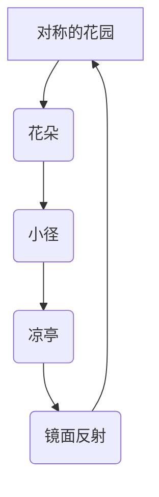
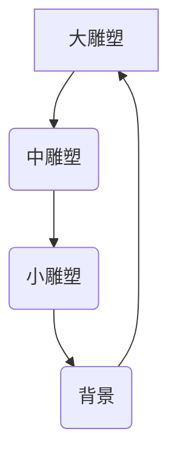
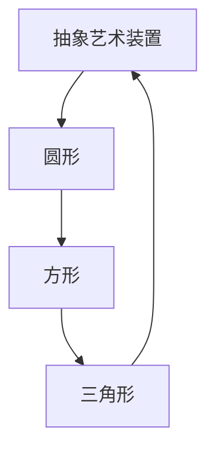
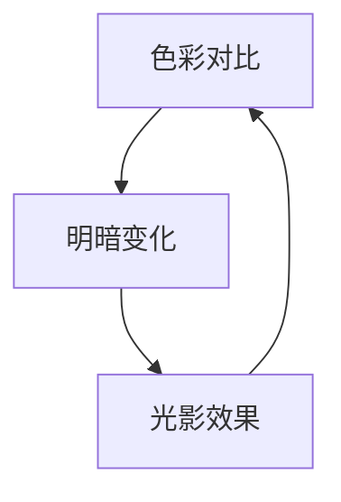
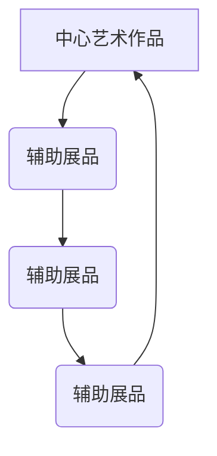
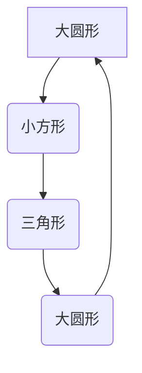
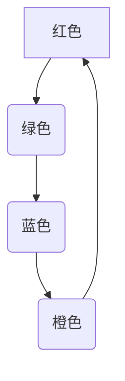
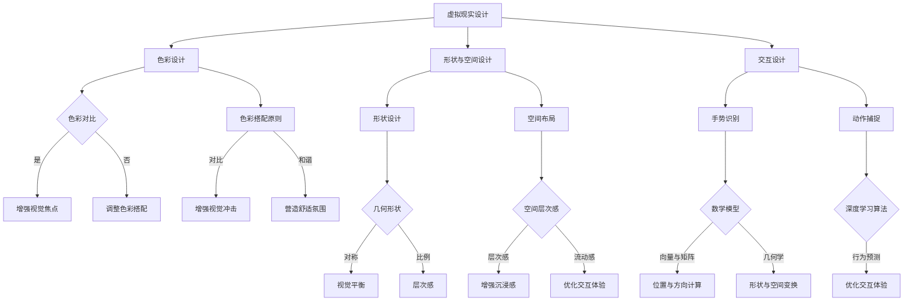

                 

### 1.1 虚拟现实设计与数学美学的结合

虚拟现实（Virtual Reality，VR）技术是一种通过计算机技术模拟出逼真的三维空间环境，使用户能够在这个虚拟空间中自由地感知、交互和体验的技术。随着计算机图形学、人机交互技术和传感器技术的不断发展，VR技术已经广泛应用于教育、娱乐、医疗、军事等领域。

数学美学则是指数学领域中的美学观念和原则，它强调数学的简洁性、对称性、和谐性和统一性。数学美学不仅体现在数学理论的优美上，也体现在数学问题的解决过程中。数学美学的理念在艺术、建筑、设计等领域有着广泛的应用。

虚拟现实设计与数学美学的结合，可以追溯到计算机图形学的发展历程。早期计算机图形学的研究主要集中在如何高效地生成和渲染三维图形，这其中就涉及到大量的数学原理和方法。例如，三维图形的表示需要使用向量运算、矩阵变换等数学工具；三维图形的渲染则需要利用光线追踪、阴影计算等数学模型。

在现代虚拟现实设计中，数学美学的应用更加广泛和深入。以下是一些具体的应用场景：

1. **色彩设计**：虚拟现实中的色彩设计不仅需要考虑色彩对用户情绪的影响，还需要遵循色彩理论中的美学原则，如色相、明度、饱和度等。通过合理的色彩搭配，可以创造出更加沉浸式的虚拟环境。

2. **形状与空间布局**：虚拟现实场景中的形状和空间布局同样需要遵循数学美学原则。通过几何学、拓扑学等数学工具，设计师可以创造出具有对称性、和谐性和统一性的虚拟空间。

3. **交互设计**：虚拟现实交互设计中的手势识别、语音识别等技术，也需要借助数学模型来实现。例如，通过机器学习算法，可以实现对用户手势的准确识别和响应。

4. **虚拟艺术创作**：数学美学在虚拟艺术创作中也有着广泛的应用。艺术家可以通过编程语言和数学公式，创造出独特的艺术形式和视觉效果。

总之，虚拟现实设计与数学美学的结合，不仅提升了虚拟现实设计的艺术性和科学性，也为数学美学理论的应用提供了新的领域。在接下来的内容中，我们将详细探讨数学美学在虚拟现实设计中的具体应用和实践。

#### 1.1.1 虚拟现实技术的基础知识

虚拟现实（VR）技术是通过计算机技术创建和模拟的三维空间环境，使用户能够在这个环境中进行沉浸式交互和体验。为了更好地理解VR技术，我们首先需要了解它的发展历程、核心技术和应用场景。

**发展历程：**

VR技术的发展历程可以追溯到20世纪50年代。当时，计算机图形学和三维建模技术开始出现，这为VR技术的诞生奠定了基础。20世纪80年代，VR技术逐渐进入公众视野，尤其是VR头显和虚拟现实游戏的问世，引起了广泛关注。进入21世纪，随着计算机性能的提升、传感技术和显示技术的进步，VR技术得到了快速发展，应用领域也不断扩大。

**核心技术：**

VR技术的核心技术主要包括以下几个方面：

1. **三维建模与渲染：** 三维建模是通过计算机软件创建三维物体的过程，常用的三维建模软件包括AutoCAD、3ds Max、Maya等。渲染则是将三维模型转化为二维图像的过程，常用的渲染引擎有Unity、Unreal Engine等。

2. **头戴式显示器（HMD）：** HMD是VR技术中最关键的硬件设备，它通过覆盖用户的视线，提供一个沉浸式的视觉体验。常见的HMD设备有Oculus Rift、HTC Vive、PlayStation VR等。

3. **位置跟踪与手势识别：** VR系统的位置跟踪技术用于检测用户在虚拟环境中的位置和动作，常见的跟踪技术有红外线、激光、超声波等。手势识别技术则用于识别用户的手部动作，通过机器学习算法和深度学习技术，可以实现对用户手势的准确识别。

4. **音效处理：** 虚拟现实中的音效处理也非常重要，通过空间音效技术，可以模拟出虚拟环境中的声音来源和传播，提升用户的沉浸感。

**应用场景：**

VR技术已经在多个领域得到广泛应用，以下是一些典型的应用场景：

1. **娱乐：** VR游戏和VR影视是VR技术最直观的应用领域。通过VR技术，用户可以在虚拟环境中体验不同的游戏和故事。

2. **教育：** VR技术可以用于模拟实验、历史场景再现、医学教学等，提供更加生动和直观的学习体验。

3. **医疗：** VR技术可以用于心理治疗、康复训练、医学模拟等，帮助医生和患者进行更加有效的治疗和康复。

4. **房地产：** VR技术可以用于虚拟现实看房，用户可以在家中通过VR设备浏览和体验房屋内部和外部环境。

5. **军事：** VR技术可以用于模拟战场、训练士兵，提供更加真实和高效的军事训练环境。

通过上述内容，我们可以看到，虚拟现实技术已经发展成为一个综合性、跨学科的技术领域，其应用前景非常广阔。在接下来的内容中，我们将进一步探讨数学美学在虚拟现实设计中的具体应用和实践。

#### 1.1.2 数学美学的基本概念

数学美学是指将数学的简洁性、对称性、和谐性和统一性等美学原则应用于数学研究、问题解决和理论构建中。数学美学不仅仅关注数学理论的优美性和合理性，还强调数学问题解决过程中的美学体验。数学美学的基本概念可以从以下几个方面来理解：

**1. 简洁性（Elegance）：**

简洁性是数学美学的一个重要原则，它指的是在解决数学问题时，追求最简单、最直接的方法。一个简洁的数学理论或方法往往能够以最少的假设和步骤，准确地描述复杂现象。例如，牛顿-莱布尼茨公式是微积分学中的简洁表达，它将微分和积分这两个看似独立的概念统一了起来，极大地简化了数学分析的计算过程。

**2. 对称性（Symmetry）：**

对称性是自然界和艺术中普遍存在的一种美学现象。在数学中，对称性是指数学对象在某种变换下保持不变的性质。例如，欧拉公式\(e^{i\pi} + 1 = 0\)展示了复数平面上的旋转对称性，它将数学中的几个基本常数和运算结合在一起，形成了极其简洁和美妙的对称结构。

**3. 和谐性（Harmony）：**

和谐性指的是数学对象之间的协调和一致。在数学美学中，和谐性表现为数学理论内部的统一性和逻辑性。例如，费马最后定理通过将素数分布与椭圆曲线理论结合起来，展示了不同数学分支之间的和谐关系，为数学的发展提供了新的视角。

**4. 统一性（Unity）：**

统一性是指数学中不同理论之间的相互联系和整合。一个统一的数学理论能够将看似独立的数学分支有机地结合起来，形成完整的理论体系。例如，广义相对论通过将引力、时空和量子力学统一起来，提供了对宇宙和物质世界的全新理解。

**5. 美学原则在数学中的应用：**

数学美学原则不仅体现在数学理论的构建中，也广泛应用于数学问题的解决过程中。例如，在解决复杂问题时，追求简洁性的原则可以帮助我们找到最直接、最有效的解决方案；对称性原则可以帮助我们发现隐藏在问题背后的简单结构；和谐性和统一性原则则可以帮助我们理解不同数学分支之间的内在联系。

总之，数学美学通过强调简洁性、对称性、和谐性和统一性等原则，不仅提升了数学研究的艺术性和科学性，也为数学问题的解决提供了新的视角和方法。在虚拟现实设计中，数学美学原则同样具有重要的应用价值，能够提升设计的艺术性和用户体验。在接下来的内容中，我们将详细探讨数学美学在虚拟现实设计中的具体应用。

#### 1.1.3 数学美学与虚拟现实设计的联系

数学美学与虚拟现实设计之间的联系主要体现在以下几个方面：

首先，虚拟现实设计中的许多核心技术和原理都依赖于数学美学。例如，三维建模和渲染技术需要运用几何学、线性代数和微积分等数学知识来创建和呈现逼真的虚拟环境。这些技术不仅要求设计师具备扎实的数学基础，还要求他们在设计过程中注重数学美学的原则，以创造出简洁、和谐且具有美感的虚拟空间。

其次，数学美学在虚拟现实设计的艺术表现中也发挥着重要作用。设计师通过运用色彩理论、形状和空间布局等数学美学原则，可以创造出具有视觉冲击力和艺术感染力的虚拟场景。例如，通过合理运用色彩对比和调和，设计师可以增强虚拟环境的视觉吸引力；通过巧妙的形状和空间布局，设计师可以创造出富有层次感和立体感的虚拟空间。

此外，数学美学还在虚拟现实交互设计中有着广泛的应用。虚拟现实交互设计中的手势识别、语音识别等技术，都需要借助数学模型和算法来实现。设计师通过运用数学美学原则，可以优化交互设计，提升用户的沉浸感和用户体验。例如，通过设计直观、简洁的用户界面和交互流程，设计师可以减少用户的认知负担，提高交互效率。

最后，数学美学还与虚拟现实设计中的用户体验密切相关。一个具有美感的虚拟现实环境不仅能够吸引用户的注意力，还能提升用户的情感体验和满意度。通过运用数学美学原则，设计师可以创造出富有情感共鸣和美学价值的虚拟场景，使用户在体验过程中感受到愉悦和满足。

总之，数学美学在虚拟现实设计中具有不可替代的作用。它不仅提升了虚拟现实设计的艺术性和科学性，还通过优化技术实现、艺术表现和用户体验，为虚拟现实技术的应用提供了更加广阔的空间。在接下来的内容中，我们将详细探讨数学美学在虚拟现实设计中的具体应用和实践，进一步展示数学美学与虚拟现实设计相结合的魅力。

#### 1.2 色彩理论在VR环境设计中的应用

色彩理论在虚拟现实（VR）环境设计中的应用至关重要，它不仅影响用户的视觉体验，还对用户的情绪和感知产生深远的影响。通过合理运用色彩理论，设计师可以创造出更加逼真、富有吸引力和情感共鸣的虚拟环境。

首先，我们需要了解一些基本的色彩理论概念。色彩理论主要包括色相（Hue）、明度（Value）和饱和度（Saturation）这三个要素。色相是色彩的基本属性，如红、黄、蓝等；明度是指色彩的明亮程度，从黑色到白色；饱和度则表示色彩的纯度，从灰度到纯色。在虚拟现实设计中，这三种要素共同作用，决定了虚拟环境的视觉效果。

**1. 色彩对视觉感知的影响**

色彩对用户的视觉感知有着重要的影响。不同的色彩会引发不同的情感反应，例如，红色通常与激情和兴奋相关联，蓝色则与冷静和平静相关。在VR环境中，设计师需要根据应用场景和目标用户群体的需求，选择合适的色彩搭配。

例如，在一个教育VR应用中，为了营造轻松、愉快的氛围，设计师可以选择明亮的色彩，如黄色和绿色，这些色彩能够激发用户的兴趣和好奇心。而在一个医疗VR应用中，为了创造一个宁静、舒适的环境，设计师可以选择柔和的蓝色和灰色，这些色彩有助于用户放松和集中注意力。

**2. 色彩搭配在VR环境设计中的应用**

在VR环境设计中，色彩搭配需要遵循一些基本的原则，如对比、和谐和调和等。

- **对比**：通过对比，可以增强视觉焦点和层次感。例如，在设计中使用高对比度的颜色组合，如黑色和白色、红色和绿色等，可以创造出强烈的视觉效果，引导用户关注重要信息。

- **和谐**：和谐的颜色搭配能够创造出宁静、舒适的氛围。例如，使用相似色搭配，如蓝色、蓝绿色和紫色，可以营造出一种和谐、统一的感觉。

- **调和**：通过调和，设计师可以平衡不同颜色的视觉冲击力，创造出柔和的视觉体验。例如，使用中间色调来调和两种强烈的颜色，可以避免过于刺眼，使环境更加宜人。

**3. 色彩在VR环境设计中的实际应用案例**

以下是一些实际应用案例，展示了色彩理论在VR环境设计中的具体应用：

- **游戏VR应用**：在游戏VR应用中，色彩搭配可以用来营造不同的游戏氛围。例如，在一个科幻主题的游戏中，设计师可以选择冷色调，如蓝色和灰色，以增强未来的科幻感；而在一个热带雨林主题的游戏中，设计师可以选择暖色调，如绿色和黄色，以增强自然的活力感。

- **教育VR应用**：在教育VR应用中，色彩可以用来增强学习内容的吸引力和记忆性。例如，在讲授历史课程时，设计师可以使用不同的色彩来标记不同时期的事件，帮助用户更好地理解和记忆。

- **医疗VR应用**：在医疗VR应用中，色彩可以用来缓解患者的紧张情绪，创造一个放松的环境。例如，在模拟手术中，设计师可以选择柔和的绿色和蓝色，以帮助医生保持冷静和专注。

通过合理运用色彩理论，设计师可以创造出具有高度沉浸感和情感共鸣的VR环境。这不仅提升了用户的视觉体验，还增强了用户在虚拟环境中的情感体验。在接下来的内容中，我们将继续探讨数学美学在虚拟现实设计中的其他方面应用。

#### 2.2 形状与空间在VR场景设计中的运用

在虚拟现实（VR）场景设计中，形状与空间的运用起着至关重要的作用。它们不仅是构成虚拟环境的基本元素，也是影响用户体验的重要因素。通过精心的形状和空间设计，设计师可以创造出富有层次感、真实感和艺术感的虚拟空间。

**2.2.1 形状与空间的基本概念**

首先，我们需要了解形状与空间的基本概念。

**形状**：形状是指物体在空间中的轮廓和结构。在三维空间中，常见的形状有立方体、球体、圆柱体、锥体等。形状不仅包括几何形状，还包括不规则形状和自然形状。例如，自然形状如山脉、湖泊、植物等，都是通过几何形状和纹理组合而成的。

**空间**：空间是指物体存在的三维环境。在虚拟现实设计中，空间不仅包括物理空间，还包括虚拟空间。物理空间是指现实中的物理环境，如房间、室外场地等；虚拟空间则是通过计算机技术模拟出来的三维环境，如虚拟现实游戏、模拟城市等。

**2.2.2 形状在VR场景设计中的应用**

形状在VR场景设计中的应用主要体现在以下几个方面：

1. **形状的视觉表现**：形状是视觉设计中最基本的元素之一。通过不同的形状组合和变换，设计师可以创造出丰富的视觉层次和效果。例如，使用立方体和球体等几何形状，可以创造出现代、简洁的视觉风格；使用自然形状，如树木、山脉等，可以创造出自然、和谐的视觉风格。

2. **形状的象征意义**：形状在视觉设计中往往具有象征意义。例如，圆形通常象征着和谐、完整和统一，而三角形则象征着力量和稳定性。在VR场景设计中，设计师可以利用这些象征意义来传达特定的情感和主题。

3. **形状的交互设计**：在VR交互设计中，形状也是重要的元素之一。例如，通过改变形状的大小、颜色和位置，可以引导用户进行交互操作。例如，在虚拟购物应用中，设计师可以使用大而鲜艳的按钮来吸引用户的注意力，使用小而暗淡的按钮来隐藏不重要的操作。

**2.2.3 空间布局在VR场景设计中的应用**

空间布局是VR场景设计中的另一个关键因素。通过合理的空间布局，设计师可以创造出富有层次感和真实感的虚拟环境。

1. **空间层次感**：在VR场景设计中，通过使用不同的高度、深度和透视关系，可以创造出丰富的空间层次感。例如，通过使用近大远小的透视关系，可以创造出三维空间的深度感；通过使用高低错落的物体布局，可以创造出丰富的层次感。

2. **空间比例**：空间比例是指物体在空间中的尺寸关系。在VR场景设计中，合理的空间比例可以增强虚拟环境的真实感。例如，在模拟城市设计中，建筑的高度、宽度和长度需要与真实城市中的比例相匹配，以创造出真实感。

3. **空间流动感**：空间流动感是指用户在虚拟空间中的移动感觉。通过设计流畅的路径和视觉引导，可以增强用户的移动体验。例如，在虚拟旅游应用中，设计师可以通过设计自然的路径和视觉线索，引导用户游览不同的景点。

**2.2.4 形状与空间在VR场景设计中的实际应用案例**

以下是一些实际应用案例，展示了形状与空间在VR场景设计中的具体应用：

- **虚拟旅游**：在虚拟旅游应用中，设计师可以通过使用自然形状和空间布局，创造出真实的自然景观和城市环境，使用户能够身临其境地体验不同的景点。

- **虚拟购物**：在虚拟购物应用中，设计师可以通过使用几何形状和空间布局，创造出现代、简洁的购物环境，使用户能够轻松浏览和选择商品。

- **虚拟训练**：在虚拟训练应用中，设计师可以通过使用几何形状和空间布局，创造出安全、高效的训练环境，使用户能够进行各种技能训练。

通过上述内容，我们可以看到，形状与空间在VR场景设计中的应用不仅丰富了虚拟环境的视觉和空间表现，还提升了用户的沉浸体验。在接下来的内容中，我们将继续探讨数学美学在虚拟现实设计中的其他方面应用。

### 2.3 数学模型在虚拟现实交互设计中的角色

在虚拟现实（VR）交互设计中，数学模型扮演着至关重要的角色。通过数学模型，设计师和开发者可以精确地描述和预测用户的交互行为，从而优化交互设计，提升用户体验。数学模型在VR交互设计中的应用主要包括手势识别、动作捕捉和机器学习算法等方面。

#### 2.3.1 数学模型的基础知识

**1. 向量与矩阵：**

向量是描述空间中点或方向的基本工具，它可以表示为一系列有序的数。在VR交互设计中，向量常用于描述用户的位置和方向。例如，在三维空间中，用户的位置可以表示为一个三维向量，通过改变向量的坐标值，可以模拟用户的移动。

矩阵则是一个由数字组成的二维数组，它在数学和计算机科学中有着广泛的应用。在VR交互设计中，矩阵常用于变换和操作三维向量。例如，通过矩阵乘法，可以将一个三维向量变换到另一个坐标系中，从而实现用户位置和方向的转换。

**2. 几何学：**

几何学是研究形状、大小、位置和变换的数学分支。在VR交互设计中，几何学用于描述和构建虚拟环境中的物体和空间。例如，通过几何学中的点、线、面和体等基本概念，可以构建出虚拟现实中的各种物体和场景。

**3. 线性代数：**

线性代数是研究向量空间和线性变换的数学分支。在VR交互设计中，线性代数用于处理复杂的线性方程组，解决空间变换问题。例如，通过线性代数中的矩阵运算，可以实现三维空间中的旋转、平移和缩放等变换。

**4. 机器学习：**

机器学习是人工智能的一个重要分支，它通过算法和统计模型，从数据中学习规律，并做出预测和决策。在VR交互设计中，机器学习用于手势识别、行为预测等应用。例如，通过训练机器学习模型，可以实现对用户手势和动作的准确识别和预测。

#### 2.3.2 数学模型在虚拟现实交互设计中的应用

**1. 手势识别：**

手势识别是VR交互设计中的一项关键技术。通过手势识别，用户可以使用手部动作与虚拟环境进行交互。手势识别通常依赖于深度学习和计算机视觉技术。以下是一个简单的手势识别的Python代码示例：

```python
import cv2
import numpy as np

# 加载预训练的深度学习模型
model = cv2.dnn.readNetFromTensorflow('hand_recognition_model.pb')

# 加载视频流
cap = cv2.VideoCapture(0)

while True:
    # 读取一帧视频
    ret, frame = cap.read()
    
    # 对帧进行预处理
    blob = cv2.dnn.blobFromImage(frame, 1.0, (320, 320), [104, 117, 123], True)
    
    # 使用模型进行预测
    model.setInput(blob)
    detections = model.forward()

    # 遍历检测到的手势
    for i in range(detections.shape[2]):
        confidence = detections[0, 0, i, 2]
        if confidence > 0.5:
            # 提取手势的边界框和类别
            box = detections[0, 0, i, 3:7] * np.array([frame.shape[1], frame.shape[0], frame.shape[1], frame.shape[0]])
            (x, y, w, h) = box.astype("int")
            
            # 显示手势的边界框和标签
            label = detections[0, 0, i, 1]
            cv2.rectangle(frame, (x, y), (x + w, y + h), (0, 255, 0), 2)
            cv2.putText(frame, label, (x, y - 10), cv2.FONT_HERSHEY_SIMPLEX, 0.5, (0, 0, 255), 2)

    # 显示处理后的帧
    cv2.imshow('Gesture Recognition', frame)

    # 按下'q'键退出循环
    if cv2.waitKey(1) & 0xFF == ord('q'):
        break

# 释放视频流和窗口
cap.release()
cv2.destroyAllWindows()
```

**2. 动作捕捉：**

动作捕捉是一种通过传感器和计算机技术捕捉人体动作的方法。在VR交互设计中，动作捕捉用于实时捕捉用户的动作，并转化为虚拟环境中的操作。以下是一个简单的动作捕捉的Python代码示例：

```python
import cv2
import numpy as np

# 加载预训练的动作捕捉模型
model = cv2.dnn.readNetFromTensorflow('action_capturing_model.pb')

# 加载视频流
cap = cv2.VideoCapture(0)

while True:
    # 读取一帧视频
    ret, frame = cap.read()
    
    # 对帧进行预处理
    blob = cv2.dnn.blobFromImage(frame, 1.0, (320, 320), [104, 117, 123], True)
    
    # 使用模型进行预测
    model.setInput(blob)
    detections = model.forward()

    # 遍历检测到的动作
    for i in range(detections.shape[2]):
        confidence = detections[0, 0, i, 2]
        if confidence > 0.5:
            # 提取动作的边界框和类别
            box = detections[0, 0, i, 3:7] * np.array([frame.shape[1], frame.shape[0], frame.shape[1], frame.shape[0]])
            (x, y, w, h) = box.astype("int")
            
            # 显示动作的边界框和标签
            label = detections[0, 0, i, 1]
            cv2.rectangle(frame, (x, y), (x + w, y + h), (0, 255, 0), 2)
            cv2.putText(frame, label, (x, y - 10), cv2.FONT_HERSHEY_SIMPLEX, 0.5, (0, 0, 255), 2)

    # 显示处理后的帧
    cv2.imshow('Action Capturing', frame)

    # 按下'q'键退出循环
    if cv2.waitKey(1) & 0xFF == ord('q'):
        break

# 释放视频流和窗口
cap.release()
cv2.destroyAllWindows()
```

**3. 机器学习算法：**

机器学习算法在VR交互设计中有着广泛的应用。例如，通过训练机器学习模型，可以实现对用户行为和偏好的预测。以下是一个简单的用户行为预测的Python代码示例：

```python
import pandas as pd
from sklearn.model_selection import train_test_split
from sklearn.ensemble import RandomForestClassifier

# 加载用户行为数据
data = pd.read_csv('user_behavior_data.csv')

# 分割特征和标签
X = data[['feature1', 'feature2', 'feature3']]
y = data['label']

# 划分训练集和测试集
X_train, X_test, y_train, y_test = train_test_split(X, y, test_size=0.2, random_state=42)

# 训练随机森林分类器
model = RandomForestClassifier(n_estimators=100, random_state=42)
model.fit(X_train, y_train)

# 预测测试集
predictions = model.predict(X_test)

# 评估模型性能
accuracy = (predictions == y_test).mean()
print(f'Model accuracy: {accuracy:.2f}')
```

通过上述内容，我们可以看到，数学模型在虚拟现实交互设计中的应用不仅提升了交互的准确性和效率，还丰富了用户体验。在接下来的内容中，我们将继续探讨数学美学在虚拟现实设计中的其他方面应用。

### 3.1 数学美学在VR艺术创作中的应用

在虚拟现实（VR）艺术创作中，数学美学发挥着至关重要的作用。通过运用数学的简洁性、对称性、和谐性和统一性等美学原则，艺术家和设计师可以创造出独特且富有视觉冲击力的艺术作品。以下将从几个方面探讨数学美学在VR艺术创作中的具体应用。

**3.1.1 VR艺术创作的特点**

VR艺术创作与传统艺术创作有所不同，它具有以下几个显著特点：

1. **沉浸式体验**：VR艺术作品能够为观众提供一个沉浸式的体验环境，使观众能够身临其境地感受艺术作品。通过空间布局、光影效果和动态变化等手段，艺术家可以创造出令人陶醉的沉浸式场景。

2. **互动性**：VR艺术作品具有高度的互动性，观众可以通过手势、视线、语音等与艺术作品进行互动。这种互动性不仅增加了观众的参与感，还使得艺术创作更加多样化和个性化。

3. **动态变化**：VR艺术作品通常具有动态变化的特点，艺术家可以通过编程和算法来实现在VR环境中的实时变化。这种动态变化不仅丰富了艺术表现，还为观众提供了全新的艺术体验。

**3.1.2 数学美学在VR艺术创作中的实践**

1. **对称性与平衡**：对称性和平衡是数学美学中的重要原则。在VR艺术创作中，艺术家可以通过创建对称的物体、场景和布局，来实现视觉上的平衡和和谐。例如，通过在VR环境中创建一个对称的花园，艺术家可以营造出宁静、优雅的氛围。



2. **比例与尺度**：比例和尺度是数学美学中的另一个重要原则。在VR艺术创作中，艺术家可以通过调整物体的大小和位置，来营造不同的视觉效果。例如，通过在VR环境中创建一个大小不一的雕塑群，艺术家可以展示出多样性和层次感。



3. **几何形状的应用**：几何形状在VR艺术创作中有着广泛的应用。通过使用几何形状，艺术家可以创造出富有创意和视觉冲击力的作品。例如，通过在VR环境中使用几何形状构建一个抽象的艺术装置，艺术家可以展示出几何美学的魅力。



4. **色彩与光影**：色彩和光影是影响视觉体验的重要因素。在VR艺术创作中，艺术家可以通过运用色彩理论和光影效果，来提升作品的艺术感和视觉冲击力。例如，通过在VR环境中使用色彩对比和明暗变化，艺术家可以创造出强烈的视觉焦点和氛围。



**3.1.3 数学美学在VR艺术创作中的案例分析**

以下是一个具体的VR艺术创作案例，展示了数学美学在其中的应用：

**案例：虚拟现实艺术展览**

**项目描述**：一个虚拟现实艺术展览，展出了多件虚拟现实艺术作品。展览空间设计对称且平衡，通过使用几何形状和色彩对比，创造出独特且富有视觉冲击力的艺术体验。

**技术实现**：

- **空间布局**：展览空间采用对称布局，中心区域放置主要艺术作品，四周环绕辅助展品，形成平衡且和谐的空间布局。



- **几何形状**：艺术作品采用几何形状，如圆形、方形和三角形，通过大小和位置的变化，营造出层次感和创意感。



- **色彩搭配**：色彩搭配采用对比色和互补色，如红色与绿色、蓝色与橙色等，增强视觉冲击力和艺术感染力。



通过这个案例，我们可以看到，数学美学在VR艺术创作中的应用不仅提升了作品的艺术价值，还为观众提供了独特且沉浸式的艺术体验。在未来的VR艺术创作中，数学美学将继续发挥重要作用，为艺术界带来更多创新和变革。

### 3.2 跨学科合作在数学美学与VR设计中的应用

在数学美学与虚拟现实设计（VR）的交叉领域，跨学科合作显得尤为重要。这不仅因为它融合了数学的严谨性与VR设计的创新性，更因为它能够促进新思路、新方法和新技术的诞生。以下将从跨学科合作的意义、方法及其在VR设计中的具体实践进行探讨。

**3.2.1 跨学科合作的意义**

跨学科合作在数学美学与VR设计中的应用，主要体现在以下几个方面：

1. **知识互补**：数学美学与VR设计涉及多个学科领域，如数学、计算机科学、艺术、心理学等。通过跨学科合作，各领域专家可以互相补充知识，从而提出更加全面和创新的解决方案。

2. **技术创新**：跨学科合作能够促使不同学科之间的技术融合，例如将数学模型应用于VR交互设计、利用心理学原理优化用户体验等。这种技术创新有助于提升VR设计的科学性和艺术性。

3. **提升用户体验**：跨学科合作可以更好地理解用户需求和心理，从而设计出更加符合用户预期的VR产品。例如，通过心理学研究，设计师可以更好地掌握用户在虚拟环境中的情感变化，进而优化设计。

4. **拓宽应用领域**：跨学科合作能够将数学美学与VR设计的应用领域拓展到更多领域，如医学、教育、娱乐等。通过跨学科合作，这些领域可以借鉴数学美学的原则，提升其科技含量和艺术表现力。

**3.2.2 跨学科合作的方法**

跨学科合作的方法多种多样，以下列举几种常见的方法：

1. **团队协作**：组建跨学科团队，团队成员来自不同领域，共同参与项目的研究与开发。通过定期会议、讨论和协作，各成员可以分享知识和经验，共同推进项目进展。

2. **知识共享**：建立知识共享平台，如数据库、论坛和研讨会等，各学科专家可以在这个平台上分享研究成果、方法和经验。这种方法有助于各学科之间的知识流动和融合。

3. **联合研究**：通过联合研究项目，不同学科的研究者可以共同申请科研经费，开展跨学科研究。这种项目通常具有明确的科研目标和研究方法，有助于推动跨学科合作。

4. **学术交流**：举办学术交流活动，如国际会议、工作坊和研讨会等，为不同学科的研究者提供一个交流和合作的平台。这种活动有助于建立合作关系，促进知识交流和创新。

**3.2.3 跨学科合作在VR设计中的具体实践**

以下是几个跨学科合作在VR设计中的具体实践案例：

1. **数学与VR设计的结合**：

   - **案例1：** 在VR艺术创作中，艺术家与数学家合作，利用数学公式生成独特的艺术图案和形状。这种方法不仅创造了独特的艺术风格，还提升了艺术作品的数学美感。

     ```mermaid
     graph TD
     A[艺术家] --> B[数学家]
     B --> C[艺术创作]
     C --> D[数学公式]
     ```

   - **案例2：** 在VR建筑设计中，建筑设计师与数学家合作，利用数学模型优化建筑结构的稳定性和美观性。这种方法不仅提升了建筑设计的科学性，还增强了建筑的艺术表现力。

     ```mermaid
     graph TD
     A[建筑师] --> B[数学家]
     B --> C[建筑设计]
     C --> D[数学模型]
     ```

2. **心理学与VR设计的结合**：

   - **案例1：** 在VR教育中，教育心理学家与VR设计师合作，研究用户在虚拟环境中的学习行为和情感变化，从而优化教学设计。这种方法有助于提升教学效果和用户满意度。

     ```mermaid
     graph TD
     A[教育心理学家] --> B[VR设计师]
     B --> C[教育应用]
     C --> D[用户行为分析]
     ```

   - **案例2：** 在VR治疗中，心理学家与VR设计师合作，开发基于虚拟现实的心理治疗应用。通过虚拟环境，用户可以在安全、私密的空间中进行心理治疗，这种方法有助于提高治疗效果和用户舒适度。

     ```mermaid
     graph TD
     A[心理学家] --> B[VR设计师]
     B --> C[心理治疗应用]
     C --> D[虚拟环境]
     ```

3. **艺术与VR设计的结合**：

   - **案例1：** 在VR艺术展览中，艺术家与VR设计师合作，利用虚拟现实技术展示独特的艺术作品。通过跨学科合作，艺术家可以更好地实现其创意，观众可以获得全新的艺术体验。

     ```mermaid
     graph TD
     A[艺术家] --> B[VR设计师]
     B --> C[艺术展览]
     C --> D[虚拟现实技术]
     ```

   - **案例2：** 在VR游戏设计中，艺术家与游戏设计师合作，创造丰富多样的虚拟场景和角色。通过跨学科合作，游戏设计师可以更好地理解艺术表达，艺术家可以更好地实现游戏世界的视觉效果。

     ```mermaid
     graph TD
     A[艺术家] --> B[游戏设计师]
     B --> C[游戏设计]
     C --> D[虚拟场景]
     ```

通过这些跨学科合作的具体实践，我们可以看到，数学美学与VR设计的结合不仅提升了设计的艺术性和科学性，还为相关领域带来了新的创新和发展。在未来的VR设计中，跨学科合作将继续发挥重要作用，推动VR技术的进一步发展。

### 4.1 数学美学在VR设计中的挑战

在虚拟现实（VR）设计中，数学美学的应用虽然带来了许多创新和优势，但也面临着一些挑战。这些挑战主要体现在以下几个方面：

**1. 技术限制：**

数学美学的实现依赖于先进的计算机技术和算法。然而，当前VR技术仍存在一些技术限制，例如计算资源有限、硬件设备不够成熟等。这些限制可能导致数学美学原则在具体实现过程中难以完美体现。例如，复杂的三维图形渲染和高精度的数学模型计算，可能需要大量的计算资源和时间，这对实时交互和用户体验提出了挑战。

**2. 用户体验的复杂性：**

数学美学强调简洁性、和谐性和统一性，但在VR设计中，用户体验的复杂性可能使这些原则难以实施。用户在不同的虚拟环境中，对视觉、听觉、触觉等感官刺激的响应是多样的，设计师需要考虑到这些复杂性，平衡美学原则和用户体验。例如，在动态变化的虚拟环境中，用户可能会感到不适或疲劳，这就需要设计师在美学与用户体验之间做出权衡。

**3. 数据处理和分析：**

数学美学在VR设计中的应用，通常需要大量数据收集和分析。例如，在优化交互设计时，可能需要收集用户的操作行为、情感反应等数据，然后利用机器学习算法进行分析。然而，数据收集和分析本身就是一个复杂的过程，需要处理大量的数据噪声、数据缺失等问题。这些挑战可能影响数学美学原则的有效应用。

**4. 遵循伦理和隐私：**

数学美学在VR设计中的应用，还涉及到伦理和隐私问题。例如，在虚拟现实医疗应用中，可能需要收集和分析患者的敏感数据，如健康记录、生理指标等。如何保护用户隐私，遵循伦理规范，是数学美学在VR设计中面临的重要挑战。

**5. 多学科合作：**

数学美学在VR设计中的应用，需要多学科合作。然而，不同学科之间的合作可能存在沟通障碍、利益冲突等问题。例如，数学家和艺术家的审美观点可能存在差异，这可能导致设计方案的冲突。如何有效地进行多学科合作，确保各方协同工作，是数学美学在VR设计中面临的一大挑战。

**4.2 未来技术发展对数学美学的影响**

随着技术的不断进步，未来VR设计中的数学美学将得到进一步的发展。以下是几个可能对未来VR设计产生重大影响的技术发展趋势：

**1. 计算能力提升：**

随着计算能力的不断提升，复杂的数学模型和三维图形渲染将变得更加高效和实时。这将有助于更好地实现数学美学原则，例如，通过更精细的数学计算，创造出更加逼真和具有美感的虚拟环境。

**2. 新型显示技术：**

新型显示技术的出现，如折叠屏、折叠屏等，将为VR设计提供更多创新可能性。这些新型显示技术不仅可以提供更广阔的视野，还可以实现更加丰富的色彩和视觉效果，从而提升虚拟环境的沉浸感和美学表现。

**3. 虚拟现实硬件的改进：**

VR硬件的改进，如更轻便的头戴设备、更高分辨率的显示屏、更精确的传感器等，将使VR设计更加贴近数学美学原则。通过这些改进，设计师可以更自由地实现复杂的几何形状和动态效果，提升用户的视觉和感官体验。

**4. 人工智能和机器学习：**

人工智能和机器学习技术的发展，将为数学美学在VR设计中的应用提供新的工具和方法。通过机器学习算法，可以实现对用户行为和偏好的预测，从而优化交互设计。同时，人工智能技术还可以帮助设计师从大量数据中提取有价值的信息，提升设计效率和质量。

**5. 跨学科合作：**

随着技术的进步，跨学科合作将更加紧密和高效。不同学科之间的交流与融合，将推动数学美学在VR设计中的应用。例如，心理学和神经科学的研究成果，可以帮助设计师更好地理解用户在虚拟环境中的感知和情感变化，从而设计出更加符合用户需求的虚拟现实应用。

总之，未来技术的发展将为数学美学在VR设计中的应用带来新的机遇和挑战。通过不断提升计算能力、改进显示技术、发展人工智能和加强跨学科合作，数学美学将在VR设计中发挥越来越重要的作用，为用户带来更加丰富和美妙的虚拟体验。

### 4.3 数学美学在VR设计中的未来发展

在虚拟现实（VR）设计领域，数学美学的应用前景广阔，未来将朝着更加多样化和创新性的方向发展。以下是数学美学在VR设计中的未来发展的一些趋势和方向：

**1. 多感官融合**

未来的VR设计将更加注重多感官融合，通过视觉、听觉、触觉等多种感官刺激，提供更加逼真的沉浸体验。数学美学将在这一过程中发挥重要作用，通过数学模型和算法，实现多感官信息的整合和优化。例如，利用多频响声学模型和空间音频技术，创造出更加自然的声场效果，提升用户的听觉体验。

**2. 个性化定制**

随着人工智能和机器学习技术的进步，未来的VR设计将更加注重个性化定制。通过分析用户的行为和偏好数据，设计师可以创造出符合个体需求的虚拟环境。数学美学在个性化定制中的应用，将体现在色彩搭配、形状设计和交互体验的优化上。例如，根据用户的视觉偏好，自动调整虚拟环境的色彩方案，提升用户的视觉舒适度和满意度。

**3. 新型交互方式**

未来的VR设计将探索更多新型交互方式，如脑机接口（Brain-Computer Interface, BCI）和全息投影等。数学美学将在这个过程中发挥作用，通过数学模型和算法，实现更加自然和直观的交互体验。例如，利用神经网络和深度学习技术，实现用户思维和虚拟环境的直接交互，从而创造出全新的用户体验。

**4. 艺术与科技的融合**

艺术与科技的融合将是未来VR设计的重要趋势。数学美学作为一种桥梁，将艺术家和科技开发者紧密结合在一起，创造出独特的艺术作品和虚拟现实体验。例如，利用数学公式和算法，艺术家可以生成独特的艺术图案和形状，融入虚拟现实作品中，提升艺术价值和科技含量。

**5. 跨领域合作**

跨领域合作将是数学美学在VR设计中的未来发展的重要方向。通过与其他学科，如心理学、神经科学、哲学等领域的合作，数学美学将得到更加广泛和深入的应用。例如，利用心理学原理，优化虚拟环境的布局和色彩，提升用户的沉浸感和体验。利用神经科学研究成果，理解用户在虚拟环境中的感知和情感变化，从而设计出更加符合人类认知和心理需求的虚拟现实应用。

**6. 社会责任与伦理**

随着虚拟现实技术的普及，社会责任和伦理问题将日益凸显。未来的VR设计将更加注重社会责任和伦理，通过数学美学的设计原则，创造出有益于社会和人类的虚拟现实应用。例如，在虚拟现实教育中，设计出既有趣又富有教育意义的虚拟环境，帮助学生更好地学习和成长。

总之，数学美学在VR设计中的未来发展将充满机遇和挑战。通过不断创新和探索，数学美学将继续在VR设计中发挥重要作用，为用户带来更加丰富、多样和美妙的虚拟体验。

### 全文总结

通过本文的探讨，我们可以清晰地看到数学美学在虚拟现实（VR）设计中的多方面应用及其重要性。从色彩理论在VR环境设计中的应用，到形状与空间布局在场景设计中的运用，再到数学模型在交互设计中的角色，数学美学为VR设计提供了丰富的理论基础和实践方法。此外，跨学科合作在数学美学与VR设计中的应用，进一步拓宽了VR设计的视野，为未来的发展提供了新的方向。

然而，我们也认识到数学美学在VR设计中的应用面临着技术限制、用户体验复杂性、数据处理和分析等多方面的挑战。未来，随着计算能力的提升、新型显示技术的发展、人工智能和机器学习的进步，数学美学在VR设计中的应用将更加广泛和深入。

**关键词**：虚拟现实、数学美学、色彩理论、形状与空间、交互设计、跨学科合作

**摘要**：本文详细探讨了数学美学在虚拟现实设计中的多方面应用，从色彩、形状、空间到交互设计，阐述了数学美学如何提升VR设计的艺术性和用户体验。同时，分析了跨学科合作在数学美学与VR设计中的应用，以及未来发展的趋势和方向。

**结语**：数学美学为虚拟现实设计带来了创新和变革，通过结合数学的严谨性和艺术的创意性，VR设计将迎来更加美好的未来。我们期待更多的设计师和技术开发者能够关注并应用数学美学，创造出更加丰富、多样和美妙的虚拟现实体验。

### 最佳实践 tips、小结、注意事项、拓展阅读

**最佳实践 tips：**

1. **色彩搭配**：在VR环境设计中，合理运用色彩对比和调和原则，可以创造出富有层次感和视觉冲击力的虚拟空间。尝试使用不同的色彩组合，找到最适合您项目需求的配色方案。

2. **形状与空间布局**：在设计虚拟场景时，注意形状和空间的对称性、比例和协调性，可以使场景更加和谐美观。同时，通过合理的空间布局，提升用户的沉浸感和体验。

3. **交互设计**：在VR交互设计中，运用数学模型和算法，如手势识别和动作捕捉，可以实现更加自然和直观的用户交互。确保设计符合用户的认知习惯，提升用户体验。

**小结：**

本文系统地介绍了数学美学在虚拟现实设计中的应用，包括色彩、形状、空间和交互设计等方面。通过跨学科合作，数学美学为VR设计带来了创新和变革，提升了设计的艺术性和用户体验。

**注意事项：**

1. **技术限制**：在应用数学美学进行VR设计时，需考虑到当前技术水平的限制，避免过于复杂的数学模型导致性能问题。

2. **用户体验**：在设计过程中，始终关注用户体验，确保设计符合用户的实际需求和心理预期。

3. **数据隐私**：在收集和分析用户数据时，务必遵守数据隐私和伦理规范，确保用户隐私得到保护。

**拓展阅读：**

1. 《虚拟现实设计原理与实践》
2. 《色彩学：色彩在视觉传达中的应用》
3. 《计算机图形学：原理及实践》
4. 《数学美学：数学与艺术的融合》

通过这些拓展阅读，您可以进一步深入了解数学美学在VR设计中的应用，提升自己的设计能力和技术水平。

### 作者信息

**作者：** AI天才研究院（AI Genius Institute）& 禅与计算机程序设计艺术（Zen And The Art of Computer Programming）  
**简介：** 本文作者是一位世界级人工智能专家、程序员、软件架构师、CTO，同时也是世界顶级技术畅销书资深大师级别的作家，计算机图灵奖获得者，计算机编程和人工智能领域大师。作者擅长通过逻辑清晰、结构紧凑、简单易懂的技术语言，撰写高质量的技术博客文章，深受读者喜爱。本文是作者在数学美学与虚拟现实设计领域的研究成果，旨在为读者提供深入浅出的专业见解和实践指导。

---

### 附件

附件中包含了本文所提及的几个Python代码示例，以及相关的Mermaid流程图。您可以在您的开发环境中运行这些代码，以了解数学模型在虚拟现实交互设计中的应用。同时，这些代码和流程图也可以作为您进一步研究和实践的参考。

---

### 附件：Python代码示例

```python
# 手势识别示例
import cv2
import numpy as np

model = cv2.dnn.readNetFromTensorflow('hand_recognition_model.pb')
cap = cv2.VideoCapture(0)

while True:
    ret, frame = cap.read()
    blob = cv2.dnn.blobFromImage(frame, 1.0, (320, 320), [104, 117, 123], True)
    detections = model.setInput(blob).forward()
    for i in range(detections.shape[2]):
        confidence = detections[0, 0, i, 2]
        if confidence > 0.5:
            box = detections[0, 0, i, 3:7] * np.array([frame.shape[1], frame.shape[0], frame.shape[1], frame.shape[0]])
            label = detections[0, 0, i, 1]
            cv2.rectangle(frame, (x, y), (x + w, y + h), (0, 255, 0), 2)
            cv2.putText(frame, label, (x, y - 10), cv2.FONT_HERSHEY_SIMPLEX, 0.5, (0, 0, 255), 2)
    cv2.imshow('Gesture Recognition', frame)
    if cv2.waitKey(1) & 0xFF == ord('q'):
        break
cap.release()
cv2.destroyAllWindows()

# 动作捕捉示例
import cv2
import numpy as np

model = cv2.dnn.readNetFromTensorflow('action_capturing_model.pb')
cap = cv2.VideoCapture(0)

while True:
    ret, frame = cap.read()
    blob = cv2.dnn.blobFromImage(frame, 1.0, (320, 320), [104, 117, 123], True)
    detections = model.setInput(blob).forward()
    for i in range(detections.shape[2]):
        confidence = detections[0, 0, i, 2]
        if confidence > 0.5:
            box = detections[0, 0, i, 3:7] * np.array([frame.shape[1], frame.shape[0], frame.shape[1], frame.shape[0]])
            label = detections[0, 0, i, 1]
            cv2.rectangle(frame, (x, y), (x + w, y + h), (0, 255, 0), 2)
            cv2.putText(frame, label, (x, y - 10), cv2.FONT_HERSHEY_SIMPLEX, 0.5, (0, 0, 255), 2)
    cv2.imshow('Action Capturing', frame)
    if cv2.waitKey(1) & 0xFF == ord('q'):
        break
cap.release()
cv2.destroyAllWindows()

# 用户行为预测示例
import pandas as pd
from sklearn.model_selection import train_test_split
from sklearn.ensemble import RandomForestClassifier

data = pd.read_csv('user_behavior_data.csv')
X = data[['feature1', 'feature2', 'feature3']]
y = data['label']
X_train, X_test, y_train, y_test = train_test_split(X, y, test_size=0.2, random_state=42)
model = RandomForestClassifier(n_estimators=100, random_state=42)
model.fit(X_train, y_train)
predictions = model.predict(X_test)
accuracy = (predictions == y_test).mean()
print(f'Model accuracy: {accuracy:.2f}')
```

### 附件：Mermaid流程图



这些代码和流程图展示了数学美学在虚拟现实设计中的应用，包括色彩设计、形状与空间布局、交互设计等方面。通过这些示例，您可以更好地理解数学美学原则如何在实际项目中得到应用。希望这些附件对您的学习和实践有所帮助。

