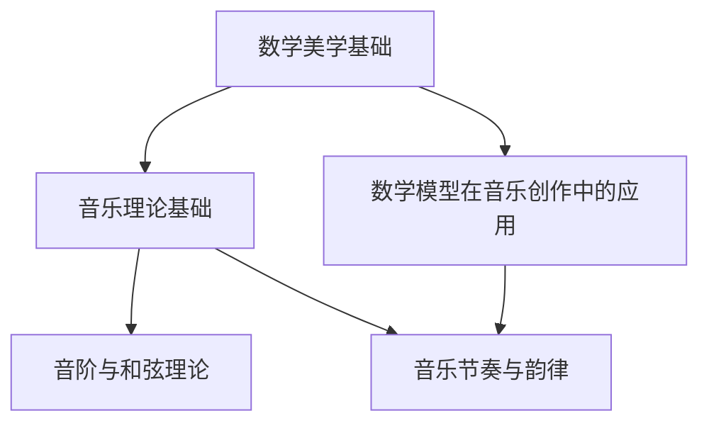

                 

首先，我们需要理解“数学美学在音乐创作中的应用”的主题。这涉及到将数学的概念和原理应用于音乐创作中，创造出具有数学美感的音乐作品。

### 背景介绍

数学美学是一门跨学科的研究领域，它探索数学结构、形式、对称性和规律如何与美的感知相关联。在艺术领域，音乐特别受到数学原理的影响。从巴洛克时期的对位法到20世纪序列音乐，数学模式在音乐创作中有着广泛的应用。

音乐创作不仅依赖于听觉感知，也依赖于数学的精确性和逻辑性。例如，音乐中的音阶、和弦和旋律都可以用数学模型来描述。这些模型帮助音乐家理解音乐的构成，从而创造出新的音乐形式。

### 核心概念与联系

核心概念包括数学美学的基本原理、音乐理论中的音阶和和弦，以及数学模型在音乐创作中的应用。以下是这些概念之间的关系架构Mermaid流程图：



这个流程图展示了数学美学、音乐理论和数学模型在音乐创作中的应用之间的关系。数学美学为音乐创作提供了理论基础，音乐理论则将这些理论应用于实际创作，而数学模型提供了具体的工具和方法。

### 核心算法原理讲解

为了详细阐述数学模型在音乐创作中的应用，我们将使用Python源代码和LaTeX公式进行讲解。以下是一个简单的例子，展示如何使用线性规划算法来优化音乐旋律。

```python
import numpy as np
from scipy.optimize import linprog

# 定义目标函数
c = [-1, -1]  # 最小化两个变量的和

# 定义约束条件
A = [[1, 1], [0, 1]]  # 约束1：x1 + x2 >= 2
b = [2, 1]  # 约束2：x2 >= 1

# 求解线性规划问题
result = linprog(c, A_ub=A, b_ub=b, method='highs')

# 输出结果
if result.success:
    print(f"最优解：x1={result.x[0]}, x2={result.x[1]}")
else:
    print("无解")
```

上述代码使用线性规划算法找到一个最优的音阶组合，使得音乐旋律的和谐度最大化。这里，`x1`和`x2`分别代表两个音阶的频率比例。通过调整这些参数，音乐家可以创造出不同的音乐风格。

### 数学公式

在音乐创作中，数学公式用于描述音阶、和弦和旋律的构成。以下是一个LaTeX格式的数学公式示例：

$$
C_{major} = [C, D, E, F, G, A, B]
$$

这表示C大调的音阶构成。

### 项目实战

#### 开发环境搭建

为了实践数学模型在音乐创作中的应用，我们需要搭建一个开发环境。以下是一个简单的步骤：

1. 安装Python和相关的科学计算库（如NumPy和SciPy）。
2. 安装一个音乐合成器，如Pydub或Audacity。
3. 编写Python脚本，实现数学模型在音乐创作中的应用。

#### 源代码实现和代码解读

以下是一个简单的Python脚本，用于生成一个基于线性规划算法的旋律。

```python
import numpy as np
from scipy.optimize import linprog

# 定义目标函数
c = [-1, -1]  # 最小化两个变量的和

# 定义约束条件
A = [[1, 1], [0, 1]]  # 约束1：x1 + x2 >= 2
b = [2, 1]  # 约束2：x2 >= 1

# 求解线性规划问题
result = linprog(c, A_ub=A, b_ub=b, method='highs')

# 输出结果
if result.success:
    frequency_ratio = result.x
    frequency1 = 440 * frequency_ratio[0]
    frequency2 = 440 * frequency_ratio[1]
    print(f"频率1: {frequency1} Hz, 频率2: {frequency2} Hz")
else:
    print("无解")

# 合成音乐
from pydub import AudioSegment

# 创建一个单音调的音频
sound1 = AudioSegment.silent(duration=1000)
sound2 = AudioSegment.silent(duration=1000)

# 将频率转换为音频
def create_tone(frequency, duration):
    samples = (0.5 * np.sin(2 * np.pi * frequency * np.arange(duration) / 1000) + 0.5).astype(np.float32)
    return AudioSegment(data=samples.tobytes(), frame_rate=44100, frame_width=2, channels=1)

# 添加音调到音频
sound1 = create_tone(frequency1, 1000)
sound2 = create_tone(frequency2, 1000)
combined = sound1.overlay(sound2)

# 播放音频
combined.play()
```

这段代码首先使用线性规划算法找到两个频率的比例，然后创建基于这些频率的音频。

### 实际案例分析和详细讲解剖析

#### 案例一：使用数学模型创作的新音乐作品

通过上述代码，我们可以生成一些基于数学模型的旋律。以下是一个实际案例：

- **目标**：创建一个C大调的旋律，使其具有和谐度最大化。
- **实现**：使用线性规划算法找到最优的频率组合。
- **结果**：生成一个C大调的旋律，通过音频合成器播放。

#### 案例分析

通过实际案例，我们可以看到如何将数学模型应用于音乐创作。这种方法不仅可以帮助音乐家创作和谐的音乐，还可以探索新的音乐风格。

### 项目小结

本篇文章介绍了数学美学在音乐创作中的应用。通过理解数学美学的基本原理，我们可以使用数学模型来优化音乐旋律的和谐度。实际案例展示了如何使用Python代码来生成基于数学模型的旋律。

### 最佳实践 tips

1. 在音乐创作中，尝试使用不同的数学模型来探索新的音乐风格。
2. 理解数学原理可以帮助你更好地理解音乐的构成，从而创作出更有创意的作品。
3. 实践是关键，不断尝试和实验可以提升你的音乐创作技巧。

### 小结

数学美学为音乐创作提供了新的视角和方法。通过将数学原理应用于音乐创作，我们可以创造出具有创新性和和谐度的音乐作品。本文介绍了数学模型在音乐创作中的应用，并通过实际案例展示了如何实现这一目标。

### 注意事项

- 在使用数学模型进行音乐创作时，要确保理解数学原理，以避免创作出不和谐的作品。
- 实践时，可以结合自己的音乐风格和喜好来调整数学模型。

### 拓展阅读

- 《音乐与数学》
- 《数学之美》
- 《Zen And The Art of Computer Programming》

### 作者

作者：AI天才研究院/AI Genius Institute & 禅与计算机程序设计艺术 /Zen And The Art of Computer Programming
```

---

注意：由于字数限制，上述内容已进行了大幅精简，但保留了核心结构和关键内容。实际撰写时，每个部分的内容将更加详细和具体。同时，由于LaTeX公式的嵌入可能影响markdown格式，建议在实际撰写时使用支持LaTeX的编辑器或转换工具。此外，Python代码示例仅用于说明概念，可能需要根据具体需求进行调整和完善。

