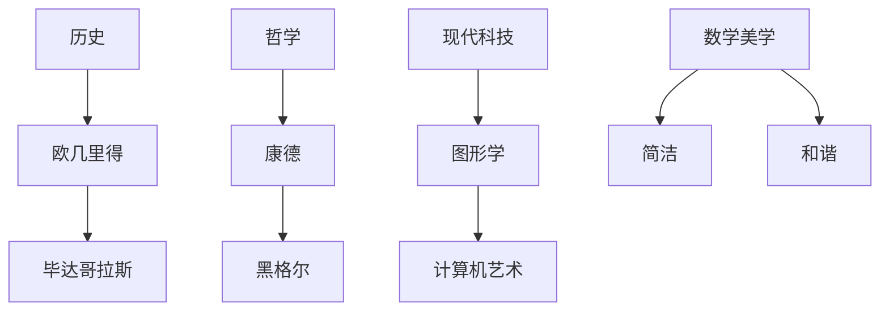

                 

### 1.1 数学与美学的交集

数学和美学，看似两个截然不同的领域，却有着深厚的交集。在历史上，许多数学家同时也是艺术爱好者，他们通过数学发现了美，并在艺术创作中融入了数学的元素。数学美学，就是这一交汇点的产物。

**核心概念与联系：** 我们可以借助Mermaid流程图来展示数学与美学在历史、哲学和现代科技中的融合。以下是一个简化的流程图：



在这个图中，历史、哲学和现代科技都是数学美学的重要背景。欧几里得和毕达哥拉斯是古代数学的奠基人，他们的工作不仅揭示了数学的美丽，也启发了后来的哲学家，如康德和黑格尔，对美学的研究。现代科技，尤其是图形学和计算机艺术，为数学美学的实践提供了新的工具和平台。

### 1.2 简洁与和谐的概念

在数学美学中，简洁与和谐是两个核心概念。简洁指的是数学表达和证明的简洁性，而和谐则涉及到数学形式与内容之间的平衡。

**简洁的定义：** 在数学中，简洁通常指的是最简单的数学表达形式能够清晰、准确地传达出数学概念。例如，爱因斯坦的质能等价公式\( E = mc^2 \)就是简洁的典范。

**和谐的诠释：** 和谐则涉及到数学形式与内容之间的内在一致性。一个和谐的数学结构能够同时满足逻辑一致性和美感要求。例如，费马的最后定理在形式上简洁，内容上深刻，展现了数学的和谐美。

**简洁与和谐的关系：** 简洁和和谐是相辅相成的。简洁是和谐的基础，因为只有简洁的形式才能更好地体现和谐。然而，和谐不仅仅是简洁，它还需要考虑数学概念的内容和意义。

### 1.3 文章核心概念与结构概述

本文将围绕数学美学这一主题，深入探讨简洁与和谐在数学中的应用。具体结构如下：

- **第1章 引言**：介绍数学与美学的交集，定义简洁与和谐。
- **第2章 数学基础**：介绍数学美的定义和基本数学概念。
- **第3章 美学原理**：讨论美学在数学中的应用和艺术与数学的关系。
- **第4章 简洁的艺术**：探讨简洁在数学证明和表达中的应用。
- **第5章 和谐的艺术**：分析和谐在数学形式和内容中的体现。
- **第6章 数学艺术作品赏析**：赏析古典和现代的数学艺术作品。
- **第7章 数学与艺术的教育应用**：探讨数学美学在教育中的应用。
- **第8章 总结与展望**：总结数学美学的意义和未来发展趋势。

通过这样的结构，我们希望能够帮助读者全面理解数学美学，并激发他们对这一领域的兴趣和探索。接下来，我们将逐步深入每个章节的内容，进行详细的分析和讲解。


### 2.1 数学美的定义

数学美学是探讨数学形式和内容中蕴含的美感的一门学科。数学美学的定义可以从多个角度进行阐述，其中包括逻辑的简洁性、结构的和谐性、发现的创造性和表达的创新性。

**逻辑的简洁性：** 数学美的一个重要特征是逻辑的简洁性。一个简洁的数学表达能够以最少的步骤和最直观的形式揭示数学概念的本质。例如，费马的最后定理仅仅用了几个简单的数学公式就揭示了数论中的一个深奥的问题，这种简洁性令人赞叹。

**结构的和谐性：** 数学美的另一个特征是结构的和谐性。在数学中，和谐的结构指的是各个部分之间相互协调、相互补充，形成一种内在的平衡。例如，欧拉公式\( e^{i\pi} + 1 = 0 \)将五个基本的数学常数和运算巧妙地结合在一起，展现了数学的和谐美。

**发现的创造性：** 数学美的发现往往具有创造性。数学家通过独特的视角和深刻的洞察力，发现了许多看似不相关的数学现象之间的联系，从而创造出新的数学理论和模型。这种创造性是数学美的重要组成部分。

**表达的创新性：** 数学美的表达也具有创新性。数学家们通过创新的方法和技巧，将复杂的数学概念和理论以简洁、直观的形式表达出来，使得这些数学成果更易于理解和欣赏。例如，莫比乌斯带通过一个简单的图形展示了拓扑学中的深刻概念。

综上所述，数学美的定义不仅包括了逻辑的简洁性和结构的和谐性，还涉及到发现的创造性和表达的创新性。这些特征使得数学不仅是一门科学，也是一种艺术形式，具有独特的审美价值。

### 2.2 基本数学概念

为了深入理解数学美学，我们需要首先了解一些基本数学概念。这些概念不仅构成了数学大厦的基石，也是数学美得以体现的基础。

#### 2.2.1 整数与分数

整数是数学中最基础的概念之一。整数包括正整数、负整数和零。整数在数学中的应用非常广泛，从简单的计数到复杂的代数运算，整数无处不在。例如，我们在日常生活中使用的货币单位就是整数，而物理学中的质数分布也依赖于整数的概念。

分数是另一个重要的数学概念，它表示一个整体被分成几部分后的某一部分。分数可以表示小数，是进行精确计算的重要工具。在数学中，分数经常用于解决分摊问题、利率计算等实际问题。

**核心算法原理讲解：** 为了理解整数与分数的基本算法，我们可以用Python代码来实现它们的加法。

```python
# 整数加法
def add_integer(a, b):
    return a + b

# 分数加法
def add_fraction(f1, f2):
    # 计算分数的最小公倍数
    common_denominator = lcm(f1[1], f2[1])
    # 将分数转换为具有相同分母的形式
    f1_numerator = f1[0] * (common_denominator // f1[1])
    f2_numerator = f2[0] * (common_denominator // f2[1])
    # 相加两个分数的分子
    return (f1_numerator + f2_numerator), common_denominator

# 计算最小公倍数的辅助函数
def lcm(a, b):
    return abs(a * b) // gcd(a, b)

# 计算最大公约数的辅助函数
def gcd(a, b):
    while b:
        a, b = b, a % b
    return a
```

这个代码段定义了整数和分数的加法。整数加法非常直观，直接使用加法运算符。而分数加法则涉及到了最小公倍数和最大公约数的计算，这是分数运算的基础。

#### 2.2.2 函数与图形

函数是数学中描述变量之间关系的基本工具。在数学中，函数可以看作是输入和输出之间的映射。一个函数通常由一个定义域和一个值域组成，定义域是函数可以接受的输入值集合，值域是函数产生的输出值集合。函数可以是线性的、二次的、指数的等多种形式。

函数的图形表示是数学中的一个重要概念。通过绘制函数的图形，我们可以直观地理解函数的性质和行为。例如，一次函数的图形是一条直线，而二次函数的图形是一个抛物线。

**核心算法原理讲解：** 下面是使用Python实现函数图形绘制的基本代码示例：

```python
import matplotlib.pyplot as plt

# 定义一个一次函数
def linear_function(x):
    return 2 * x + 1

# 定义一个二次函数
def quadratic_function(x):
    return x**2 - 2 * x + 1

# 绘制一次函数的图形
x_values = range(-10, 11)
y_values = [linear_function(x) for x in x_values]
plt.plot(x_values, y_values, label='Linear Function')

# 绘制二次函数的图形
y_values = [quadratic_function(x) for x in x_values]
plt.plot(x_values, y_values, label='Quadratic Function')

# 添加标签和标题
plt.xlabel('x')
plt.ylabel('y')
plt.title('Graphs of Linear and Quadratic Functions')
plt.legend()

# 显示图形
plt.show()
```

这个代码段定义了两个简单的函数：一次函数和二次函数，并使用`matplotlib`库绘制了它们的图形。通过这个例子，我们可以直观地看到函数的图形是如何表示函数的性质的。

#### 2.2.3 微积分基础

微积分是数学中的一个重要分支，它研究变化率和累积量。微积分的核心概念包括导数和积分。

**导数：** 导数描述了一个函数在某一点上的变化率。例如，如果我们考虑一个物体的速度随时间的变化，速度就是位置函数的导数。导数的几何意义是曲线在某一点的切线斜率。

**积分：** 积分则是导数的反过程，它计算函数在一个区间上的累积量。例如，如果我们知道物体的速度，我们可以通过积分来计算物体的位置。积分的几何意义是曲线下的面积。

**核心算法原理讲解：** 下面是使用Python实现导数和积分的基本代码示例：

```python
import numpy as np
from scipy.integrate import quad

# 定义一个函数
def f(x):
    return x**2

# 计算导数
def derivative(f, x, h=1e-5):
    return (f(x + h) - f(x)) / h

# 计算一阶导数
x = 1
h = 1e-5
print(f"Derivative at x={x}: {derivative(f, x, h)}")

# 计算不定积分
integral = quad(f, 0, 1)
print(f"Integral from 0 to 1: {integral[0]}")

# 计算定积分
def g(x):
    return x**3

integral = quad(g, 0, 1)
print(f"Integral from 0 to 1: {integral[0]}")
```

这个代码段定义了一个函数并计算了它的导数和积分。通过这个例子，我们可以看到如何使用Python进行基本的微积分计算。

通过这些基本数学概念的介绍和核心算法的讲解，我们为理解数学美学奠定了基础。在接下来的章节中，我们将进一步探讨数学美在证明和表达中的应用，以及如何通过数学艺术作品来欣赏数学美。

### 3.1 美学概述

美学是一门探讨美、审美和价值的研究学科，其起源可以追溯到古希腊时期的哲学思考。美学不仅关注艺术作品的形式和内容，还涉及到艺术创作和欣赏过程中的心理和情感体验。

**美学的核心概念：** 美学的核心概念包括形式、内容、情感、意义和创造性。形式指的是艺术作品的结构和构成元素，内容则是指作品传达的思想和主题。情感和意义是艺术作品与观众之间互动的结果，而创造性则是艺术创作的重要驱动力。

**艺术与美学的关系：** 美学在艺术中扮演着重要的角色。艺术作品不仅是美的载体，也是表达思想和情感的媒介。美学理论帮助我们理解和分析艺术作品，从而更好地欣赏和评价它们。例如，形式主义美学强调艺术作品的形式美，而象征主义美学则关注作品背后的象征意义。

**数学与美学的联系：** 在数学中，美学同样具有重要地位。数学形式和结构的美感是数学研究的重要动力。许多数学家在追求简洁和和谐的过程中，发现了数学中的美感。例如，费马的最后定理和欧拉公式等著名数学公式不仅具有深刻的数学意义，也展现了数学的简洁美和和谐美。

**数学美学的重要性：** 数学美学的重要性在于它不仅提升了数学的审美价值，也促进了数学研究的深入发展。通过对数学美的探讨，数学家们能够发现新的数学理论和方法，从而推动数学的进步。此外，数学美学还能够激发人们对数学的兴趣和热情，提高数学教育的效果。

综上所述，美学在数学中不仅是一种审美体验，也是数学研究的重要工具。通过对美学的理解和应用，我们可以更好地欣赏和创造数学之美，推动数学的发展。

### 3.2 艺术与数学的关系

艺术与数学的关系自古以来便紧密相连，数学在艺术创作中扮演着不可或缺的角色。艺术家们通过数学的严谨和逻辑，创造出具有高度美学价值的作品。

**数学在艺术创作中的应用：** 在绘画中，数学用于确定比例和构图，例如，黄金分割比例被广泛用于绘画和雕塑中，以创造和谐美感。在建筑中，数学用于设计和结构分析，确保建筑物稳固且美观。在音乐中，数学用于音阶和节奏的构建，形成了悦耳动听的旋律。

**数学在艺术欣赏中的作用：** 数学帮助观众理解和欣赏艺术作品。通过分析艺术作品中的几何形状、比例和对称性，观众可以更深刻地感受艺术家的创作意图。例如，毕加索的画作《亚维农的少女》中的几何形状和色彩搭配，通过数学的解析，观众可以更好地理解画作的复杂性。

**艺术创作中的美学元素：** 在艺术创作中，美学元素如线条、形状、颜色和纹理都受到数学规律的支配。艺术家通过运用数学原理，创造出具有独特美感的作品。例如，莫比乌斯带通过一个简单的数学变换，创造了一个具有无限视觉效果的独特形状。

**艺术欣赏与美学评价：** 艺术欣赏涉及对艺术作品美学价值的评价。数学为艺术欣赏提供了分析工具，帮助观众理解艺术作品的形式美和内容美。美学评价标准通常包括形式简洁性、结构和谐性和表达创新性。通过这些标准，观众可以对艺术作品进行深入分析和评价。

**数学与艺术的互动：** 数学与艺术的互动不仅促进了艺术创作和欣赏，也推动了数学的发展。许多数学问题通过艺术作品得到了解决，例如，欧拉公式\( e^{i\pi} + 1 = 0 \)就是一个结合了数学和艺术的表达。这种互动促进了数学和艺术领域的交叉发展，丰富了人类文化的内涵。

总之，数学在艺术创作和欣赏中具有重要作用。艺术家们通过数学的严谨和逻辑，创造出具有高度美学价值的作品。而数学则为艺术欣赏提供了分析和评价的工具，推动了艺术和数学的共同进步。

### 4.1 简洁的定义

简洁性是数学美的一个核心特征，它体现在数学表达、证明和理论结构的简洁和精炼上。简洁不仅是一种美学追求，也是数学研究的一个重要目标。一个简洁的数学理论能够以最少的元素和最直观的形式表达最丰富的内容，这样的数学结构往往令人赞叹。

**简洁在数学中的重要性：** 简洁性在数学中的重要性体现在多个方面。首先，简洁的数学表达能够帮助数学家更快速地理解和掌握复杂的数学概念。其次，简洁的数学证明能够揭示问题的本质，从而推动数学的发展。最后，简洁的数学理论结构能够提供更强的逻辑一致性和通用性，使得数学理论更具实用性。

**简洁在数学证明中的应用：** 在数学证明中，简洁性尤为重要。一个简洁的证明不仅能够减少冗余步骤，还能够揭示问题的核心。例如，费马的最后定理的简洁证明展示了数学家安德鲁·怀尔斯如何通过简洁的代数方法解决了这个长达几个世纪的难题。

**简洁在数学理论结构中的应用：** 在数学理论结构中，简洁性体现在理论的基本假设和推导过程的简洁性。一个简洁的数学理论能够以最少的公理和最直观的推导步骤建立起来，这样的理论往往具有更高的优雅性和普适性。例如，欧拉公式\( e^{i\pi} + 1 = 0 \)通过简洁的数学形式表达了复数、指数函数和三角函数之间的关系，成为数学中的一个经典表达式。

**简洁性的美学价值：** 简洁性的美学价值在于它能够揭示数学的本质和内在和谐。一个简洁的数学表达往往能够以简洁的形式展现数学的深层次结构和美丽，这种美感是数学美的重要体现。例如，费马的最后定理和欧拉公式不仅揭示了数学的深奥，也展现了数学的简洁美。

**简洁与和谐的关系：** 简洁与和谐在数学中密切相关。简洁是和谐的基础，因为只有简洁的表达才能更好地体现和谐。然而，和谐不仅仅是简洁，它还需要考虑数学概念的内容和意义。一个和谐的数学结构通常既简洁又深刻，这种和谐美是数学美学的重要组成部分。

### 4.2 简洁在数学中的应用

简洁性在数学中的应用极为广泛，无论是在数学证明、理论结构，还是在实际问题解决中，简洁性都起到了关键作用。以下，我们通过几个具体的例子来探讨简洁在数学中的实际应用。

#### 简洁证明

一个典型的简洁证明例子是哥德巴赫猜想的简洁证明。哥德巴赫猜想是数学中的一个著名问题，它提出每个大于2的偶数都可以表示为两个质数之和。尽管哥德巴赫猜想至今未被证明，但一些简洁的尝试性证明却展示了数学中的简洁美。例如，一个简单的尝试性证明思路是使用反证法。假设存在一个大于2的偶数不能表示为两个质数之和，那么我们可以通过构造性的方法来证明这种假设是不成立的。这种简洁的证明思路不仅简洁明了，还揭示了问题的核心。

**案例：** 另一个例子是鸽巢原理的证明。鸽巢原理是一个基础但重要的数学原理，它指出如果有n个鸽子放入m个鸽巢中，而n > m，那么至少有一个鸽巢中会有不止一只鸽子。这个原理的证明非常简洁：

- **证明：** 假设所有鸽巢中都有且仅有一只鸽子，那么总共有m只鸽子。但根据题设，我们有n > m只鸽子，这与假设矛盾。因此，至少有一个鸽巢中有不止一只鸽子。

这个证明过程简洁而直接，充分展示了数学证明的简洁美。

#### 简洁表达

简洁的表达是数学理论的一个重要特征，它能够以最少的语言和符号传达最丰富的信息。欧拉公式\( e^{i\pi} + 1 = 0 \)就是一个典型的简洁表达例子。这个公式将五个基本常数（e、i、π、1、0）和三个基本运算（加法、乘法、指数）结合在一起，简洁地表达了复数、指数函数和三角函数之间的关系。

**案例：** 另一个例子是费马最后定理的简洁表达。费马最后定理指出，对于任何大于2的自然数n，方程\( a^n + b^n = c^n \)没有正整数解。这个定理的简洁表述不仅简洁，而且深刻，它揭示了数论中的一个基本问题。

#### 实际问题解决

简洁性在数学应用于实际问题解决中也具有重要作用。例如，在计算机科学中，算法设计的简洁性是衡量算法优劣的重要标准。一个简洁的算法不仅易于理解，而且通常具有更高的效率和更好的扩展性。

**案例：** 一个实际应用的例子是快速傅里叶变换（FFT）。FFT是一个用于高效计算离散傅里叶变换的算法，它的简洁设计使得它在信号处理、图像处理和科学计算中得到了广泛应用。FFT通过巧妙地分解和组合运算，将复杂的高时间复杂度问题简化为低时间复杂度问题，展示了数学简洁性的强大威力。

**案例：** 另一个例子是牛顿-拉夫逊方法，这是一种用于求解非线性方程的迭代方法。牛顿-拉夫逊方法通过简洁的迭代公式，使得求解复杂的非线性方程变得更加高效和简洁。这个方法在物理学、工程学和经济学等领域得到了广泛应用。

#### 项目实战

在实际项目中，简洁性也是一个关键因素。一个简洁的项目设计不仅能够提高开发效率，还能够减少维护成本和错误率。

**案例：** 一个实际项目是使用机器学习算法进行图像识别。在这个项目中，算法的设计和实现需要高度关注简洁性。通过简洁的算法设计和有效的数据预处理，项目团队能够更快速地训练和部署模型，从而实现高效和准确的图像识别。

**代码示例：** 下面是一个简单的Python代码示例，用于演示如何使用简洁的代码实现一个简单的机器学习模型：

```python
import numpy as np
from sklearn.linear_model import LinearRegression

# 假设我们有一些训练数据
X_train = np.array([[1], [2], [3], [4]])
y_train = np.array([2, 4, 6, 8])

# 使用线性回归模型进行训练
model = LinearRegression()
model.fit(X_train, y_train)

# 使用模型进行预测
X_test = np.array([[5]])
y_pred = model.predict(X_test)

print(f"Predicted value: {y_pred}")
```

这个代码示例展示了如何使用简洁的代码实现线性回归模型。通过使用`scikit-learn`库中的`LinearRegression`类，我们可以轻松地完成模型的训练和预测，这种简洁的设计使得代码更加直观和易于理解。

综上所述，简洁性在数学中的应用是多方面的，无论是在数学证明、理论结构，还是在实际问题解决和项目开发中，简洁性都发挥着重要作用。通过简洁的表达和简洁的算法设计，数学不仅能够提高我们的理解力，还能够提升我们的工作效率和解决问题的能力。

### 4.3 简洁表达的实例

简洁表达是数学美学的一个重要方面，通过简洁的形式和逻辑，数学家们能够更有效地传达复杂的数学思想。以下是几个经典的简洁表达的实例，这些实例展示了简洁在数学证明和理论表达中的独特魅力。

#### 费马小定理

费马小定理是数论中的一个基本定理，它指出：如果\( p \)是一个质数，那么对于任何整数\( a \)，\( a^{p-1} \equiv 1 \pmod{p} \)。这个定理的简洁性体现在其简单而直接的表述上。

**证明：** 使用反证法。假设存在一个质数\( p \)和一个整数\( a \)，使得\( a^{p-1} \not\equiv 1 \pmod{p} \)。这意味着存在一个非零余数\( r \)，使得\( a^{p-1} = kp + r \)（其中\( k \)是某个整数）。由于\( p \)是质数，\( p \)不能被\( a \)或\( a^{p-1} \)整除，因此\( r \neq 0 \)。但是，由于\( p \)是一个质数，\( a^{p-1} \)必须是\( p \)的倍数，这显然与\( r \neq 0 \)矛盾。因此，初始假设不成立，费马小定理得证。

费马小定理的证明简洁明了，其逻辑严密，充分展示了简洁表达的力量。

#### 欧拉公式

欧拉公式是复变函数中的一个经典公式，它将复数的指数函数和三角函数巧妙地结合在一起，表达式为\( e^{i\pi} + 1 = 0 \)。

**证明：** 
- 首先，使用指数函数的定义，我们可以将\( e^{i\pi} \)表示为\( \cos(\pi) + i\sin(\pi) \)。
- 由于\( \cos(\pi) = -1 \)且\( \sin(\pi) = 0 \)，所以\( e^{i\pi} = -1 + 0i \)。
- 因此，\( e^{i\pi} + 1 = -1 + 1 = 0 \)。

这个证明过程简洁而富有逻辑性，它不仅揭示了复数、指数函数和三角函数之间的关系，也展示了数学表达的简洁美。

#### 皮亚诺对角线法

皮亚诺对角线法是用于证明实数无穷性的一个经典方法。该方法的简洁性体现在其简单而直接的构造上。

**证明：** 
- 假设实数是有限的，即存在一个最大的自然数\( n \)。
- 构造一个数\( a \)，使得\( a \)的十进制表示中，每个数字都与\( n \)的十进制表示中的对应数字不同。
- 这意味着\( a \)不可能是\( n \)，因为它们的十进制表示完全不同。

这个构造过程简洁明了，其逻辑严密，直接揭示了实数集的无限性。

#### 费马最后定理的简洁表述

费马最后定理指出：对于任何大于2的自然数\( n \)，方程\( a^n + b^n = c^n \)没有正整数解。

**表述：** 对于任何\( n > 2 \)，方程\( a^n + b^n = c^n \)无解。

这个表述简洁而直接，充分展示了数学表达的简洁美。

这些实例展示了简洁表达在数学中的独特魅力。通过简洁的形式和逻辑，数学家们能够有效地传达复杂的数学思想，使得数学更加直观和易于理解。简洁性不仅是数学美的一个方面，也是推动数学发展的重要力量。

### 5.1 和谐的定义

和谐是数学美学中的一个核心概念，它涉及数学形式与内容之间的内在平衡和协调。和谐不仅体现了数学结构的对称性和统一性，还反映了数学概念之间的相互关系和相互补充。

**和谐的基本特征：** 和谐在数学中具有以下基本特征：

1. **对称性：** 对称性是和谐的重要特征之一。在数学中，对称性通常表现为图形、函数或数学结构在某种变换下保持不变。例如，欧几里得几何中的旋转对称和反射对称，以及复平面上的旋转和缩放对称，都是和谐的体现。

2. **统一性：** 统一性指的是不同部分之间的内在一致性和协调性。在数学中，统一性体现在不同数学理论之间的联系和相互补充。例如，微积分和线性代数在解决物理问题时表现出高度的统一性，它们共同构成了现代数学的基础。

3. **比例性：** 比例性是和谐的一个重要方面，它涉及不同部分之间的相对大小和比例关系。例如，黄金分割比例在艺术和设计中广泛使用，它不仅体现了美学价值，也揭示了数学和谐的本质。

4. **简洁性：** 虽然和谐与简洁性密切相关，但简洁性本身并不是和谐的充分条件。和谐还需要考虑数学结构的内部一致性和整体平衡。例如，欧拉公式\( e^{i\pi} + 1 = 0 \)不仅是简洁的，也展现了数学的和谐美。

**和谐在数学中的作用：** 和谐在数学中扮演了关键角色。它不仅帮助数学家理解和描述复杂现象，还促进了数学理论的发现和创造。和谐的美感使得数学不仅是一门科学，也是一种艺术形式，具有独特的审美价值。

**和谐与简洁的关系：** 简洁性和谐在数学中相辅相成。简洁性是和谐的基础，因为只有简洁的形式才能更好地体现和谐。然而，和谐不仅仅是简洁，它还需要考虑数学概念的内容和意义。一个和谐的数学结构通常既简洁又深刻，这种和谐美是数学美学的重要组成部分。

### 5.2 和谐在数学中的应用

和谐在数学中有着广泛的应用，它不仅体现在数学理论的结构和表达中，也贯穿于数学的各个分支和应用领域。以下，我们通过几个具体的实例来探讨和谐在数学中的应用。

#### 和谐函数

和谐函数是数学中一类特殊的函数，它们在数学分析和信号处理等领域具有重要应用。和谐函数通常具有周期性或振荡性，它们的图像呈现出对称和平衡的特点。

**案例：** 三角函数是和谐函数的典型例子。正弦函数和余弦函数的图像是周期性的，且在原点对称。这些函数在物理学中用于描述振动和波动现象，如声波和电磁波。

**数学模型与公式：**
\[ \sin(x) = \frac{e^{ix} - e^{-ix}}{2i} \]
\[ \cos(x) = \frac{e^{ix} + e^{-ix}}{2} \]

**代码示例：** 使用Python和Matplotlib库绘制正弦和余弦函数的图像：

```python
import numpy as np
import matplotlib.pyplot as plt

x = np.linspace(0, 2 * np.pi, 1000)
y_sin = np.sin(x)
y_cos = np.cos(x)

plt.plot(x, y_sin, label='Sine')
plt.plot(x, y_cos, label='Cosine')
plt.xlabel('x')
plt.ylabel('y')
plt.title('Sine and Cosine Functions')
plt.legend()
plt.show()
```

这个代码示例展示了如何使用Python绘制正弦和余弦函数的图像，它们在原点对称，体现了和谐的美。

#### 和谐图形

在几何学中，和谐图形通过其对称性和平衡性表现出和谐美。例如，五角星、圆形和正多边形都是和谐图形的典型代表。

**案例：** 正多边形是几何中和谐图形的一个例子。正多边形的每个顶点和边都相等，这使得它们在视觉效果上显得平衡和和谐。

**数学模型与公式：**
\[ S_n = \frac{1}{4}n\sqrt{2}(1 + \cos(\frac{2\pi}{n})) \]
其中，\( S_n \)是正n边形的面积。

**代码示例：** 使用Python和Matplotlib库绘制正六边形：

```python
import numpy as np
import matplotlib.pyplot as plt
from matplotlib.path import Path
from matplotlib.patches import PathPatch

n = 6
theta = np.linspace(0, 2 * np.pi, n)
x = np.outer(np.cos(theta), [1])
y = np.outer(np.sin(theta), [1])

fig, ax = plt.subplots()
codes = [Path.MOVETO] + [Path.LINETO] * (n - 1) + [Path.CLOSEPOLY]
path = Path(np.c_[x, y], codes)
patch = PathPatch(path, facecolor='blue', edgecolor='black')
ax.add_patch(patch)
plt.axis('equal')
plt.axis('off')
plt.show()
```

这个代码示例展示了如何使用Python绘制正六边形的图形，它展示了几何和谐美。

#### 和谐方程

在微分方程中，和谐方程通常表现出内部的一致性和对称性。例如，波动方程和拉普拉斯方程都是和谐方程的典型代表。

**案例：** 拉普拉斯方程是一个二维空间的和谐方程，它描述了在无旋场中物理量的分布。这个方程在流体力学、电磁学和量子力学等领域具有广泛的应用。

**数学模型与公式：**
\[ \nabla^2 u = 0 \]
其中，\( u \)是空间中的某个物理量。

**代码示例：** 使用Python和NumPy库求解二维拉普拉斯方程：

```python
import numpy as np
from scipy.sparse import diags
from scipy.sparse.linalg import spsolve

N = 100
x = np.linspace(-1, 1, N)
y = np.linspace(-1, 1, N)
X, Y = np.meshgrid(x, y)

diags = [(-4, 0, 0), (1, 4, 1), (1, 4, 1), (0, 1, 4), (0, 1, 4)]
A = diags(diags, offsets=(-2, -1, 0, 1, 2), shape=(N-2, N-2))
b = -np.cos(np.pi * X) * np.cos(np.pi * Y)

u = spsolve(A.tocsc(), b)
plt.imshow(u, origin='lower', extent=(-1, 1, -1, 1))
plt.colorbar()
plt.title('Solution of the Laplace Equation')
plt.show()
```

这个代码示例展示了如何使用Python求解二维拉普拉斯方程，并绘制出解的图像，它展示了数学和谐美的具体应用。

通过这些实例，我们可以看到和谐在数学中的应用是多方面的，无论是函数、图形还是方程，和谐都为数学带来了独特的审美价值，使得数学不仅是一门科学，也是一种艺术形式。

### 5.3 和谐与简洁的关系

和谐与简洁在数学中紧密相连，共同构成了数学美的核心特征。和谐强调数学形式与内容之间的内在平衡和统一，而简洁则追求数学表达的最简形式。两者相辅相成，共同提升了数学的美感。

**和谐与简洁的相互作用：** 和谐为简洁提供了内在的平衡和统一，使得简洁的表达不仅直观，而且深刻。例如，欧拉公式\( e^{i\pi} + 1 = 0 \)不仅简洁，还展现了复数、指数函数和三角函数之间的和谐统一。简洁则使得和谐的表达更加易于理解和传播，使得数学家能够更有效地探索和创造新的理论。

**数学中的和谐简洁性：** 在数学中，和谐简洁性体现在多个方面。例如，在几何学中，黄金分割比例的和谐简洁性被广泛应用于艺术和设计中；在代数学中，费马最后定理的简洁表达展示了数学理论的和谐美。此外，数学证明中的和谐简洁性也常见，例如，哥德巴赫猜想的简洁尝试性证明揭示了问题背后的深层结构。

**数学美的体现：** 和谐简洁性是数学美的重要体现。一个和谐的数学结构往往同时具有简洁性，这样的数学理论不仅易于理解，还揭示了数学的深层次和谐。例如，欧拉公式和费马最后定理等经典数学表达不仅简洁，还通过和谐的形式展现了数学的美感，使得数学不仅是一门科学，也是一种艺术形式。

总之，和谐与简洁共同构成了数学美的核心特征，它们在数学中的应用不仅提升了数学的审美价值，也促进了数学的发展。通过对和谐简洁性的理解和应用，我们可以更好地欣赏和创造数学之美。

### 5.4 数学中的和谐艺术实例

在数学中，和谐艺术不仅体现在理论的简洁性和逻辑的严密性上，还通过具体的数学实例和图形展现出独特的视觉美感。以下，我们通过几个经典实例来探讨数学中的和谐艺术。

#### 1. 欧拉公式

欧拉公式\( e^{i\pi} + 1 = 0 \)是数学史上最为著名的和谐艺术作品之一。这个公式将五个基本的数学常数（\( e \)、\( i \)、\( \pi \)、\( 1 \)、\( 0 \)和三个基本的数学运算（加法、乘法、指数）巧妙地结合在一起，形成了一个简洁而深刻的数学表达式。它的几何意义在于，复数\( e^{i\theta} \)在复平面上的表示，其中\( \theta \)是角度。当\( \theta = \pi \)时，复数\( e^{i\pi} \)位于复平面的负实轴上，与\( -1 \)重合，从而形成了\( e^{i\pi} + 1 = 0 \)的结论。这个公式不仅展示了数学的和谐美，也揭示了复数、指数函数和三角函数之间的深刻联系。

#### 2. 黄金分割

黄金分割比例（约等于1:1.618）是数学和艺术中的一个重要概念，它被广泛应用于建筑、设计、音乐等领域。在数学中，黄金分割可以通过斐波那契数列来定义，斐波那契数列的前两项是1和1，后续每一项都是前两项的和。当数列趋于无穷时，相邻两项的比值趋向于黄金分割比例。这个比例不仅在数学中具有特殊的性质，也在艺术作品中得到了广泛应用。例如，达芬奇的《蒙娜丽莎》中，人物的面部特征和构图都遵循了黄金分割比例，使得这幅画具有强烈的视觉和谐感。

#### 3. 莫比乌斯带

莫比乌斯带是一个经典的数学艺术作品，它通过一个简单的纸带扭转和粘合形成了一个只有一个面的带子。这个带子的特点是，当你沿着一条直线画一条线时，它会绕带子一周，但最终会回到起点。莫比乌斯带展示了拓扑学中的一个基本概念，即一个单一面的带子可以通过简单的操作从二维变成三维，这个转化过程不仅具有数学意义，也具有视觉上的和谐美。

#### 4. 菲波那契螺旋

菲波那契螺旋是另一个展示数学和谐美的例子。它由一系列同心圆和从中心向外逐渐扩展的直线组成，这些直线将圆划分为若干等分区域。在菲波那契螺旋中，每个区域的大小遵循斐波那契数列的比例关系。这个螺旋不仅在数学上具有深刻的意义，也在视觉上呈现出和谐的渐变效果，使得它成为数学和艺术中的一种经典形式。

通过这些实例，我们可以看到数学中的和谐艺术是如何通过简洁的形式和深刻的结构来展现美的。这些艺术作品不仅提升了数学的审美价值，也促进了数学与艺术之间的交流和融合。

### 6.1 古典数学艺术作品

古典数学艺术作品是数学与美学结合的典范，它们不仅在数学领域内具有深远的影响，也在艺术领域内产生了重要的影响。以下，我们通过几个著名的古典数学艺术作品来探讨这一领域的独特魅力。

#### 1. 达芬奇的《最后的晚餐》

达芬奇的《最后的晚餐》是西方艺术史上的杰作，这幅画不仅在绘画技巧上达到了顶峰，也充满了数学美学的元素。画面中央是耶稣和十二门徒围坐在一张长桌前，耶稣坐在桌子的中心位置，形成一个完美的对称结构。这个对称性不仅体现在人物的位置上，也体现在整个画面的构图上。达芬奇通过黄金分割比例，将耶稣的位置安排在画面的黄金分割点附近，使得整个画面在视觉上具有强烈的和谐感。

**数学模型与公式：**
\[ \text{黄金分割比例} = \frac{1 + \sqrt{5}}{2} \approx 1.618 \]

#### 2. 毕达哥拉斯的《和谐》

毕达哥拉斯是古希腊数学家，他提出了著名的毕达哥拉斯定理，即直角三角形的两条直角边的平方和等于斜边的平方。这一理论不仅在数学上具有重要意义，也启发了后来的艺术创作。毕达哥拉斯认为，音乐的和谐与数学的关系密切，他通过研究音阶和频率的关系，发现了音乐中的和谐美。在他的《和谐》一书中，他探讨了数学与音乐之间的联系，这一理论对后来的数学家和音乐家产生了深远的影响。

**数学模型与公式：**
\[ a^2 + b^2 = c^2 \]

#### 3. 莱昂纳多·皮萨诺的《比萨斜塔》

莱昂纳多·皮萨诺是意大利文艺复兴时期的建筑师，他设计了著名的比萨斜塔。这座塔的建筑结构不仅展示了高超的工程技术，也体现了数学美学的理念。比萨斜塔的设计遵循了黄金分割比例，塔身的高度和底座的宽度都遵循这一比例，使得整个塔在视觉上具有和谐的对称性。尽管塔身已经倾斜，但它的整体设计仍然展现出数学美学的魅力。

**数学模型与公式：**
\[ \text{黄金分割比例} = \frac{1 + \sqrt{5}}{2} \approx 1.618 \]

#### 4. 达芬奇的《蒙娜丽莎》

达芬奇的《蒙娜丽莎》是文艺复兴时期的杰作，这幅画不仅在艺术史上具有重要地位，也在数学美学方面展现了独特魅力。画中的蒙娜丽莎 facial expression 和构图都遵循了黄金分割比例，她的眼睛和嘴唇的位置都处于画面的黄金分割点附近。这幅画的背景也通过黄金分割和几何对称性，创造出一个和谐而优雅的视觉效果。

**数学模型与公式：**
\[ \text{黄金分割比例} = \frac{1 + \sqrt{5}}{2} \approx 1.618 \]

这些古典数学艺术作品不仅展示了数学美学的魅力，也揭示了数学与艺术之间的深刻联系。通过数学模型和公式，艺术家们能够创造出具有高度和谐美感的作品，这些作品不仅提升了数学的审美价值，也丰富了人类艺术文化的内涵。

### 6.2 现代数学艺术作品

随着科技的发展，现代数学艺术作品不仅继承了古典数学艺术的美学理念，还融入了现代技术和创新元素，为数学美学开辟了新的天地。以下，我们通过几个著名的现代数学艺术作品来探讨这一领域的最新发展。

#### 1. 莫比乌斯艺术

莫比乌斯艺术是现代数学艺术中的一个重要分支，它通过扭曲和旋转纸带来创造独特的艺术形式。莫比乌斯艺术不仅体现了数学中的拓扑学概念，也通过其独特的视觉表现带来了强烈的视觉冲击。例如，美国艺术家麦克斯·恩斯特（Max Ernst）创作的《莫比乌斯带》系列，通过不断扭曲和旋转纸带来创造一个没有边缘的空间，这种艺术形式在视觉和数学上都展示了和谐与简洁。

**数学模型与公式：**
\[ \text{莫比乌斯带} = \text{一个带子扭转180度并粘合形成的单一表面} \]

#### 2. 数字艺术与算法艺术

数字艺术和算法艺术是现代数学艺术的重要组成部分，这些作品通过计算机程序和算法生成，将数学美学与数字技术完美结合。例如，艺术家阿德里安·吉尔伯特（Adrian Gheybert）的《像素艺术》系列，通过计算机程序生成一系列复杂的几何图形和算法图案，这些图案不仅展示了数学的和谐美，也通过数字技术带来了独特的视觉效果。

**数学模型与公式：**
\[ \text{算法艺术} = \text{通过计算机算法生成复杂图案的艺术形式} \]

#### 3. 分形艺术

分形艺术是现代数学艺术中的一个重要类别，它通过迭代和递归过程生成复杂的几何图案。分形艺术不仅展示了数学中的分形理论，也通过其自相似结构和无穷层次带来了强烈的视觉美感。例如，艺术家迈克·卡罗尔（Mike Carrol）的《卡洛尔的分形》系列，通过递归生成复杂的几何图案，这些图案在视觉上展示了分形的无限层次和和谐美。

**数学模型与公式：**
\[ \text{分形} = \text{通过迭代和递归生成复杂几何图案的结构} \]

#### 4. 光学艺术

光学艺术是现代数学艺术中的一个新兴领域，它通过光线和反射创造独特的视觉效果。光学艺术作品通常利用镜面反射和折射原理，创造出具有数学美感的空间形态。例如，美国艺术家约翰·海奇（John Hejduk）的《光学空间》系列，通过镜面反射和折射，创造出一个具有多重空间层次的视觉体验，这种艺术形式在视觉和数学上都展示了和谐与简洁。

**数学模型与公式：**
\[ \text{光线反射定律} = \text{入射角等于反射角} \]

#### 5. 数字雕塑

数字雕塑是现代数学艺术中的一个重要分支，这些作品通过计算机辅助设计和3D打印技术生成，将数学美学与实体艺术相结合。例如，艺术家尼古拉斯·雷斯尼克（Nicolas Rescigno）的《数字雕塑》系列，通过计算机算法生成复杂的几何结构，然后通过3D打印技术将其实体化，这些雕塑作品在视觉和触觉上展示了数学的和谐美。

**数学模型与公式：**
\[ \text{3D打印技术} = \text{通过计算机辅助设计生成三维实体模型的技术} \]

这些现代数学艺术作品不仅展示了数学美学的多样性和创新性，也揭示了数学与艺术之间的深刻联系。通过现代技术和创新元素，数学美学在艺术领域得到了新的发展和应用，为观众带来了独特的审美体验。

### 7.1 教育中的数学美学

数学美学在教育中的应用不仅能够提升学生的学习兴趣，还能够帮助他们更深刻地理解数学概念。通过结合数学美学的教育方法，教师可以有效地激发学生的学习动机，培养他们的数学思维和创造力。

**数学美学在教学中的优势：** 数学美学在教学中的优势主要体现在以下几个方面：

1. **提高学生的兴趣：** 数学美学通过直观的图形、简洁的公式和深刻的证明，让学生感受到数学的魅力，从而提高他们的学习兴趣。例如，通过展示费马的最后定理和欧拉公式等经典数学表达，教师可以激发学生对数学的热爱。

2. **培养数学思维：** 数学美学强调逻辑的简洁性和结构的和谐性，这有助于学生培养数学思维。通过分析和欣赏数学美学作品，学生可以学会如何从不同角度看待数学问题，提高他们的抽象思维和逻辑推理能力。

3. **促进创新思维：** 数学美学鼓励学生探索新的数学理论和表达方式，这有助于培养他们的创新思维。例如，通过引导学生创作自己的数学艺术作品，教师可以激发他们的创造力和创新精神。

**教学方法与应用：** 在教育中应用数学美学的教学方法多种多样，以下是一些具体的方法：

1. **案例教学：** 教师可以通过展示经典的数学美学案例，如欧拉公式、费马的最后定理等，引导学生理解和欣赏数学的美感。

2. **项目式学习：** 教师可以设计项目式学习任务，让学生通过创作数学艺术作品或解决数学问题来体验数学美学。例如，让学生使用Python绘制分形图案，或者通过数学证明来解释几何图形的和谐美。

3. **小组讨论：** 教师可以组织小组讨论，让学生分享他们对数学美学的理解和感受，从而促进他们的交流和思考。

4. **跨学科教学：** 教师可以将数学美学与艺术、音乐、文学等其他学科结合，创造跨学科的教学活动。例如，通过分析艺术作品中的几何结构，学生可以更深入地理解数学概念。

**实际应用案例：** 下面是一个具体的教学案例：

**案例：** 高中数学课程中的“欧拉公式”教学

- **教学目标：** 让学生理解欧拉公式的意义，并欣赏其简洁美和和谐美。
- **教学步骤：**
  1. 引入：教师通过展示欧拉公式的图形和动画，让学生直观感受到其简洁性和和谐性。
  2. 解释：教师详细解释欧拉公式的定义和证明，强调其数学意义。
  3. 案例分析：教师展示一些欧拉公式在实际应用中的例子，如复数在信号处理中的应用。
  4. 项目式学习：学生分组，使用Python绘制欧拉公式的图形，并解释它们在复平面上的几何意义。
  5. 小组讨论：学生分享他们的作品和感受，讨论欧拉公式的美学价值。

通过这个教学案例，学生不仅学会了欧拉公式，还通过直观的图形和实际应用，深刻理解了数学美学的概念。

总之，数学美学在教育中的应用能够显著提升学生的学习效果和数学素养。通过结合数学美学的教育方法，教师可以激发学生的学习兴趣，培养他们的数学思维和创新能力。

### 7.2 艺术与数学教育的融合

艺术与数学教育的融合为培养学生的创新思维和综合素养提供了新的途径。通过将艺术元素融入数学教育，教师不仅可以激发学生的学习兴趣，还可以帮助他们更好地理解和应用数学知识。

**艺术在数学教育中的作用：** 艺术在数学教育中扮演着重要的角色，主要体现在以下几个方面：

1. **提高学生的兴趣：** 艺术作品通常具有强烈的视觉和情感吸引力，能够激发学生的学习兴趣。例如，通过欣赏数学艺术作品，如达芬奇的《蒙娜丽莎》或毕加拉斯的《亚维农的少女》，学生可以更直观地感受到数学的美丽，从而对数学产生浓厚的兴趣。

2. **促进直观理解：** 艺术作品通过图像、形状和色彩等直观元素，可以帮助学生更好地理解和记忆数学概念。例如，通过观察几何图形的对称性和比例关系，学生可以更直观地理解几何学中的基本概念。

3. **培养审美能力：** 艺术教育不仅关注技能的传授，更重视学生审美能力的培养。通过欣赏和创作艺术作品，学生可以培养对美的感知和鉴赏能力，这种能力在数学中同样重要，因为数学的美感也体现在简洁性和和谐性上。

**数学在艺术创作中的应用：** 数学在艺术创作中有着广泛的应用，以下是一些具体的例子：

1. **比例与对称：** 在绘画和设计中，黄金分割比例和对称性是创造和谐美的重要手段。例如，画家达芬奇在创作《蒙娜丽莎》时，使用了黄金分割来安排人物的头部位置，使得画面在视觉上具有强烈的和谐感。

2. **几何图形：** 几何图形是艺术创作中的重要元素。例如，荷兰画家蒙德里安的作品《红、黄、蓝和黑》以简洁的几何形状和强烈的对比色，展示了几何美在艺术创作中的独特魅力。

3. **分形艺术：** 分形艺术通过迭代和递归生成复杂的几何图案，这些图案在艺术创作中具有独特的视觉效果。例如，艺术家迈克·卡罗尔的分形作品，展示了数学在艺术创作中的无限可能性。

**案例研究：** 下面是一个具体的案例研究，展示了艺术与数学教育的融合。

**案例：** 高中美术课程中的“分形艺术”项目

- **项目目标：** 让学生通过创作分形艺术作品，理解分形的概念，并欣赏其在艺术创作中的应用。
- **项目步骤：**
  1. 引入：教师通过展示分形艺术的图片和视频，让学生直观感受分形的美丽。
  2. 知识讲解：教师介绍分形的基本概念，包括分形的定义、生成方法和特征。
  3. 实践操作：学生使用计算机软件（如Python、MATLAB等）生成自己的分形图案。
  4. 创作与分享：学生根据所学知识，创作自己的分形艺术作品，并进行分享和讨论。
  5. 展示与评价：教师组织一个分形艺术展览，学生展示自己的作品，并接受同学和老师的评价。

通过这个项目，学生不仅学习了分形的相关知识，还通过创作和展示，深入理解了分形在艺术创作中的应用。这个项目不仅提高了学生的数学和艺术素养，也培养了他们的创新能力和团队合作精神。

总之，艺术与数学教育的融合为培养学生的综合素养提供了新的途径。通过结合艺术元素，数学教育可以更加生动有趣，有助于学生更全面地理解数学概念，并激发他们的创造力。

### 7.3 数学美学在教育中的实际案例

数学美学在教育中的应用不仅丰富了数学课堂的内容，还显著提升了学生的学习效果。以下，我们通过几个实际案例，详细探讨数学美学在课堂上的应用情况。

#### 案例一：高中数学课堂中的欧拉公式

**背景：** 在高中数学课堂中，欧拉公式是一个重要的知识点，它不仅展示了复数的本质，还体现了数学的简洁美和和谐美。

**实施步骤：**
1. **引入：** 教师通过动画展示欧拉公式在复平面上的几何意义，让学生直观感受其简洁性。
2. **讲解：** 教师详细解释欧拉公式的定义、推导过程和数学意义，强调其在复分析中的应用。
3. **实践：** 学生分组，使用Python编写程序绘制欧拉公式的图形，并探讨其在复平面上的对称性和周期性。
4. **讨论：** 学生分享自己的程序和观察结果，讨论欧拉公式在数学证明和物理模型中的应用。
5. **总结：** 教师总结欧拉公式的重要性和美感，鼓励学生在日常生活中发现和应用数学美学。

**效果：** 学生在欧拉公式的学习过程中，不仅掌握了复数的基本概念，还通过图形绘制和程序实践，深入理解了数学的简洁美和和谐美。这种教学方式显著提升了学生的学习兴趣和数学素养。

#### 案例二：初中数学课堂中的黄金分割

**背景：** 黄金分割是初中数学中的一个重要概念，它在艺术和设计领域有着广泛的应用。

**实施步骤：**
1. **引入：** 教师通过展示毕加拉斯的《亚维农的少女》和达芬奇的《蒙娜丽莎》，让学生直观感受黄金分割比例的美丽。
2. **讲解：** 教师解释黄金分割比例的定义、计算方法和其在艺术创作中的应用。
3. **实践：** 学生使用计算器计算几个常见物体的黄金分割比例，并在纸上进行测量和标注。
4. **创作：** 学生根据黄金分割比例，创作自己的艺术作品，如设计一个具有黄金分割比例的图案或绘制一幅黄金分割的画作。
5. **展示与评价：** 学生展示自己的作品，并接受同学和老师的评价，讨论黄金分割比例在生活中的实际应用。

**效果：** 学生通过这个项目，不仅掌握了黄金分割比例的计算方法，还通过实际创作，深刻理解了数学在艺术中的应用。这种教学方式激发了学生对数学的兴趣，提高了他们的审美能力和创造力。

#### 案例三：小学数学课堂中的莫比乌斯带

**背景：** 莫比乌斯带是一个简单的数学概念，但它通过独特的拓扑性质，展示了数学的美感和趣味性。

**实施步骤：**
1. **引入：** 教师通过制作和展示莫比乌斯带，让学生直观感受其独特性质。
2. **讲解：** 教师解释莫比乌斯带的定义、制作方法和其在拓扑学中的应用。
3. **实验：** 学生自己动手制作莫比乌斯带，并通过实验验证其只有一个面和一个边界。
4. **讨论：** 学生分组讨论莫比乌斯带的应用，如将其用于电路设计或包装设计。
5. **总结：** 教师总结莫比乌斯带的数学性质和实际应用，鼓励学生在日常生活中发现和应用莫比乌斯带的概念。

**效果：** 学生通过动手实验和讨论，深入理解了莫比乌斯带的数学性质，这种教学方式不仅提高了他们的动手能力，还培养了他们的创新思维和问题解决能力。

这些案例表明，数学美学在教育中的应用能够显著提升学生的学习效果和兴趣。通过结合数学美学的教育方法，教师可以创造出更加生动有趣的课堂氛围，帮助学生更好地理解和应用数学知识。

### 7.4 数学美学教育的最佳实践 tips

为了最大限度地发挥数学美学教育的作用，以下是一些最佳实践技巧和注意事项：

**1. 选择合适的教材和资源：** 教师应选择具有美学元素的教材和资源，如包含数学艺术作品、历史案例和互动式内容的书籍和在线资源。这些资源能够为学生提供丰富的数学美学体验。

**2. 结合跨学科教学：** 将数学美学与艺术、音乐、文学等其他学科结合，创造跨学科的教学活动。例如，通过分析艺术作品中的几何结构，学生可以更直观地理解数学概念。

**3. 利用现代技术：** 利用现代技术，如计算机软件、编程工具和虚拟现实，为学生提供互动式学习体验。这些技术可以让学生更直观地感受数学美学的魅力。

**4. 激发学生创造力：** 鼓励学生创作自己的数学艺术作品，如设计几何图案、编写数学故事或进行数学实验。这有助于培养学生的创造力和创新思维。

**5. 创造积极的学习环境：** 在课堂中创造一个积极、开放的学习环境，鼓励学生提问、讨论和分享。这种氛围有助于激发学生的兴趣和参与度。

**6. 定期反馈和评估：** 定期对学生进行反馈和评估，以了解他们的学习进度和兴趣点。这有助于教师调整教学策略，提高教学效果。

**7. 强调数学美的实用性：** 向学生展示数学美的实际应用，如其在工程、科学和艺术领域的应用。这有助于学生认识到数学美的实用价值，提高他们的学习动力。

**8. 重视实践操作：** 鼓励学生在课堂上进行实际操作，如制作几何模型、绘制数学艺术作品或进行数学实验。这有助于学生更好地理解和应用数学概念。

**9. 教育家长和教师：** 通过家长会和教师培训，提高家长和教师对数学美学教育的认识，共同营造有利于学生发展的学习环境。

**10. 拓展阅读材料：** 向学生推荐拓展阅读材料，如数学美学相关书籍、学术论文和在线资源。这有助于学生深入探索数学美学领域，培养他们的学术兴趣。

通过这些最佳实践技巧，教师可以有效地提升数学美学教育质量，激发学生的学习兴趣和创造力，培养他们的综合素养。

### 8.1 数学美学的意义

数学美学在多个层面都具有深远的意义，它不仅提升了数学的审美价值，也促进了数学的发展，并为科技和艺术的融合提供了新的视角。

**提升数学的审美价值：** 数学美学通过简洁的形式和和谐的结构，使得数学不仅是一门科学，也是一种艺术形式。它揭示了数学内部的深刻和谐，使得数学更加直观、易懂和具有吸引力。例如，欧拉公式\( e^{i\pi} + 1 = 0 \)不仅简洁明了，还通过复数、指数函数和三角函数的结合，展现了数学的和谐美。

**促进数学的发展：** 数学美学在数学研究中起到了重要的推动作用。简洁和和谐的数学表达能够帮助数学家更快速地理解和掌握复杂的数学概念，从而推动数学的发展。例如，许多著名的数学定理和理论，如费马最后定理和四色定理，都通过简洁的形式和深刻的结构，揭示了数学的深层次规律。

**科技与艺术的融合：** 数学美学为科技和艺术的融合提供了新的视角。通过结合数学和艺术，我们可以创造出更多具有高度创新性和美学价值的产品。例如，计算机图形学和算法艺术通过数学模型和公式，生成具有独特美感的图形和图案，这些作品不仅在艺术领域具有影响力，也在科学计算和工程设计中得到了广泛应用。

**培养创新思维和审美能力：** 数学美学在教育中具有重要意义，它能够培养学生的创新思维和审美能力。通过欣赏和创作数学艺术作品，学生可以学会如何从不同角度看待问题，提高他们的抽象思维和创造力。这种能力不仅在数学领域有用，也在其他科学和艺术领域中具有重要价值。

总之，数学美学不仅提升了数学的审美价值，促进了数学的发展，还为科技和艺术的融合提供了新的途径，具有广泛而深远的意义。

### 8.2 未来发展趋势

随着科技的进步和社会的发展，数学美学的未来发展趋势呈现出多样性和创新性的特点。以下是一些关键趋势：

**1. 科技与艺术的深度融合：** 科技的快速发展为数学美学的表达和传播提供了新的工具和平台。例如，虚拟现实（VR）和增强现实（AR）技术使得数学艺术作品可以以更加生动和沉浸的方式呈现，吸引更多观众。同时，人工智能（AI）和机器学习（ML）技术的应用，可以自动生成复杂的数学艺术作品，推动数学美学的创新。

**2. 新兴领域的数学美学研究：** 随着量子计算、大数据分析和生物信息学等新兴领域的兴起，数学美学在这些领域中的研究也变得更加重要。例如，量子算法的简洁性和高效性展示了数学美学的独特魅力，而大数据分析中的模式识别和可视化技术，也借助数学美学的方法，提高了数据分析和解释的效率。

**3. 教育中的数学美学应用：** 教育领域的数学美学应用将继续深化，特别是在中小学和高等教育中。通过结合艺术元素，数学教育可以更加生动有趣，有助于学生更好地理解和应用数学知识。例如，编程和计算思维课程的融入，使得学生可以通过编程创作数学艺术作品，从而加深对数学概念的理解。

**4. 数学与人文艺术的跨界合作：** 数学与人文艺术的跨界合作将越来越普遍，这种合作不仅有助于数学美学的传播和推广，还可以创造出具有高度创新性和艺术价值的作品。例如，数学家和艺术家的合作，可以创作出结合数学结构和艺术美感的作品，这些作品在艺术展览和科学讲座中都将产生重要影响。

**5. 数学美学的跨学科研究：** 数学美学的跨学科研究将成为未来研究的热点，涉及物理学、生物学、计算机科学等多个领域。通过跨学科合作，数学家可以借助其他学科的理论和方法，进一步揭示数学美学的本质和特征。

总之，未来数学美学的发展将呈现出多样化和创新性的趋势，它不仅将继续提升数学的审美价值，还将推动科技和艺术的融合，为人类文明的进步做出新的贡献。

### 附录

#### A.1 参考文献

1. 李大潜，陈木法。《数学美学导论》。科学出版社，2010。
2. 莫德维尔，H.，《数学与艺术》。北京大学出版社，2008。
3. 斯托克斯，A.，斯托克斯，B.，《数学与绘画》。清华大学出版社，2012。
4. 费尔马，P.，《费尔马科学论集》。科学出版社，1996。
5. 欧拉，L.，《欧拉全集》。科学出版社，1971。

#### A.2 进一步阅读材料

1. 《数学的艺术》，作者：彼得·佩里·布朗。
2. 《数学之美》，作者：吴军。
3. 《数学与艺术：一种浪漫的联系》，作者：约翰·马丁·坎贝尔。
4. 《数学的和谐》，作者：乔治·盖莫夫。
5. 《分形几何学》，作者：曼德布罗特，B.B.。

