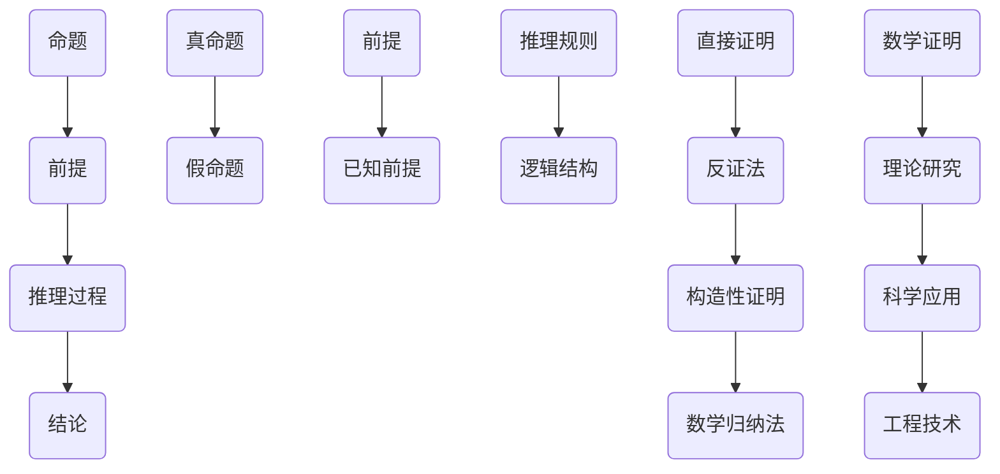
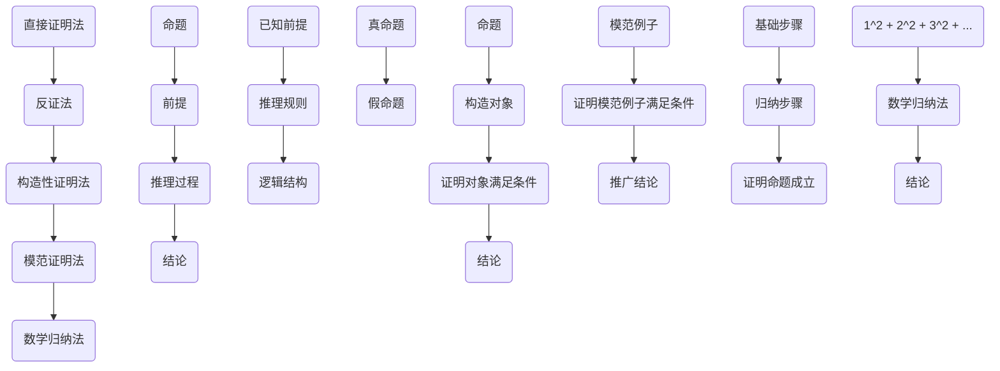
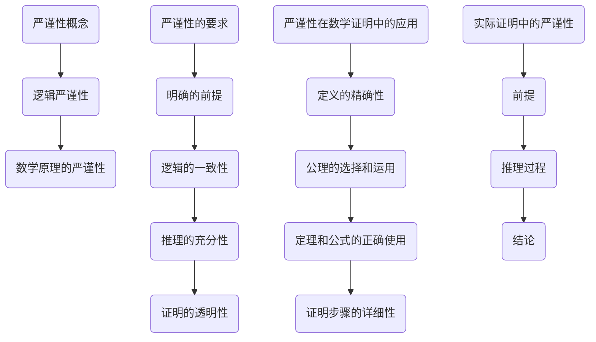
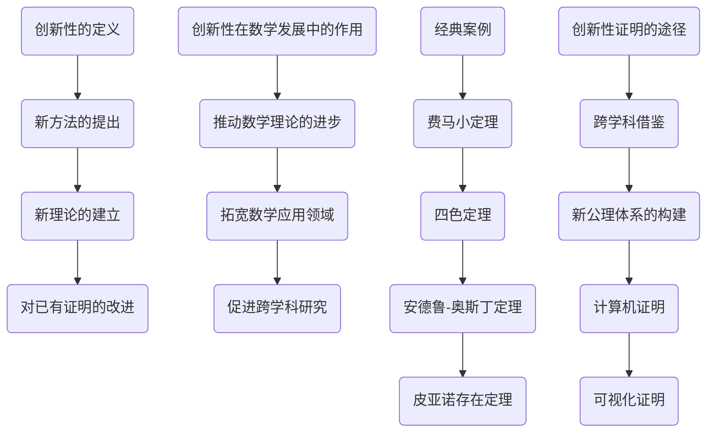
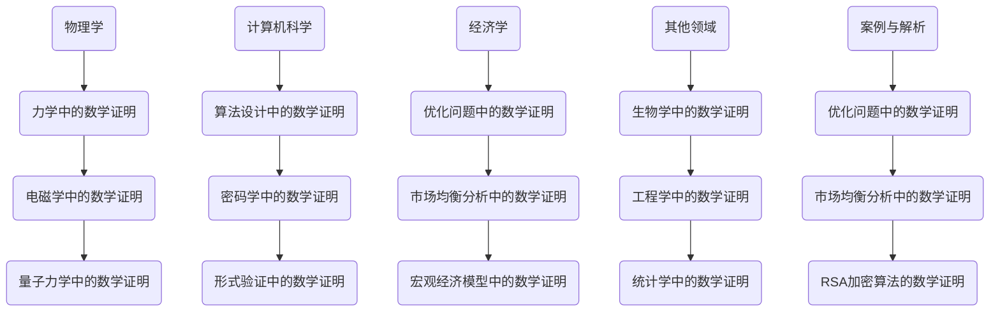

                 

### 引言和背景介绍

数学作为一门基础科学，其核心在于通过严密的逻辑推理和证明来探索和描述自然界和人类社会的规律。在这其中，数学证明起到了至关重要的作用。数学证明不仅是一种揭示数学理论内在逻辑的方法，更是推动数学发展的重要动力。

#### 数学证明的定义

数学证明，是指在严格逻辑体系下，通过一系列正确的推理步骤，从已知的前提出发，得出某一数学命题为真的过程。简单来说，数学证明就是证明一个数学命题是正确的，它通常包括三个基本要素：命题、前提和推理过程。

#### 数学证明的基本概念

1. **命题**：数学中的命题是指一个可以判断真假的陈述。例如，“所有的猫都会飞”就是一个命题，但显然这是一个假的命题。
   
2. **前提**：前提是数学证明中用来推导结论的已知条件。例如，在证明“如果一个数是偶数，那么它可以被2整除”时，“一个数是偶数”就是前提。

3. **推理过程**：推理过程是数学证明的核心，它通过一系列的逻辑步骤，从前提推导出结论。这个过程需要保证每一步都是逻辑上有效的，并且最终得出的结论是真实可靠的。

#### 数学证明的历史与发展

数学证明的历史可以追溯到古代希腊时期，当时的数学家如欧几里得、阿基米德等通过严密的逻辑推理，建立了一系列重要的数学理论。特别是欧几里得的《几何原本》，它奠定了平面几何学的基础，使用了公理法进行证明，对后世数学证明的方法产生了深远的影响。

随着数学的发展，特别是在19世纪，数学证明的方法和理论得到了极大的丰富和发展。数学家如康托尔、哥德尔、图灵等，不仅推动了数学本身的发展，还对逻辑学、计算机科学等领域产生了重要影响。

#### 数学证明的重要性

数学证明的重要性体现在多个方面：

1. **理论体系的建立**：通过数学证明，我们可以建立起一套完整、可靠的数学理论体系。这是数学科学发展的基石。
   
2. **逻辑思维的训练**：数学证明需要严密的逻辑推理，这对于培养逻辑思维和批判性思维能力有重要作用。
   
3. **科学研究的推动**：数学证明为其他科学领域提供了强有力的工具和方法，推动了科学研究的深入和发展。

4. **计算机科学的发展**：数学证明在计算机科学中有着广泛的应用，如算法设计、密码学、形式验证等。

#### 本书的结构与内容

本书《数学证明的严谨性与创新性》旨在深入探讨数学证明的严谨性和创新性，分为以下几个主要部分：

1. **数学证明的基本概念**：介绍数学证明的定义、基本要素和逻辑结构。
   
2. **数学证明的方法与技巧**：讲解各种数学证明的方法和技巧，如直接证明法、反证法、构造性证明法等。
   
3. **数学证明中的严谨性**：讨论数学证明中的严谨性要求，以及如何在实际证明中保证严谨性。
   
4. **数学证明的创新性**：探讨数学证明中的创新性，分析创新性在数学发展中的作用。
   
5. **数学证明的实际应用**：介绍数学证明在各个领域的实际应用，如物理学、计算机科学、经济管理等。

通过本书的阅读，读者不仅可以深入了解数学证明的理论和方法，还能体会到数学证明的严谨性和创新性，从而更好地理解和应用数学证明。

关键词：数学证明、严谨性、创新性、方法与技巧、实际应用

摘要：本书《数学证明的严谨性与创新性》旨在深入探讨数学证明的本质和特点，通过详细的理论讲解和实践应用，帮助读者理解数学证明的严谨性和创新性。本书分为五个主要部分，系统介绍了数学证明的基本概念、方法与技巧、严谨性要求、创新性探讨以及实际应用，旨在为数学研究和应用提供有力的理论支持。

---

以下是关于“数学证明的基本概念”的详细讲解：

### 数学证明的基本概念

数学证明是数学研究的重要组成部分，是验证数学命题正确性的关键手段。要理解数学证明，首先需要了解其基本概念，包括命题、前提、推理过程等。

#### 命题

命题是数学证明的核心，是指一个可以判断真假的陈述。例如，“所有的猫都会飞”是一个命题，但显然这是错误的命题。在数学中，命题通常是关于数、集合、函数等数学对象的性质或关系。

1. **真命题**：如果命题的陈述为真，则称为真命题。例如，“2是偶数”是一个真命题。
   
2. **假命题**：如果命题的陈述为假，则称为假命题。例如，“所有的猫都会飞”是一个假命题。

3. **命题的否定**：命题的否定是指将命题的真假值取反。例如，命题“2是偶数”的否定是“2不是偶数”。

#### 前提

前提是数学证明中用来推导结论的已知条件。在证明过程中，前提是必不可少的，因为它们是推理的起点。例如，在证明“如果一个数是偶数，那么它可以被2整除”时，“一个数是偶数”就是前提。

1. **已知前提**：在证明过程中，前提必须是已知条件。这些已知条件可以是已证明的命题、公认的公理或定义。

2. **前提的真假**：前提的真假直接影响到结论的正确性。如果前提是假的，则无论证明过程多么严密，结论也可能是假的。

#### 推理过程

推理过程是数学证明的核心，是通过一系列的逻辑步骤，从前提推导出结论的过程。这个过程需要保证每一步都是逻辑上有效的，并且最终得出的结论是真实可靠的。

1. **推理规则**：推理规则是进行逻辑推理的基本法则。常见的推理规则有合取（$\land$）、析取（$\lor$）、蕴含（$\rightarrow$）、等价（$\leftrightarrow$）等。

2. **推理的有效性**：推理的有效性是指推理过程是否能够从已知前提得出正确的结论。一个有效的推理过程需要满足两个条件：
   - **逻辑一致性**：推理过程不能违反逻辑的基本法则，如同一律、矛盾律、排中律等。
   - **充分性**：推理过程需要保证从已知前提能够逻辑地推导出结论。

#### 逻辑结构

数学证明的逻辑结构通常包括三个部分：前提、推理过程和结论。

1. **前提**：前提是数学证明的起点，通常是已知的命题、公理或定义。

2. **推理过程**：推理过程是通过一系列的逻辑步骤，从前提推导出结论的过程。

3. **结论**：结论是数学证明的终点，是推理过程最终得出的结果。

#### 数学证明的类型

根据推理方法的不同，数学证明可以分为以下几种类型：

1. **直接证明**：直接证明是从前提直接推导出结论的证明方法。它通常使用演绎推理，通过一系列的逻辑步骤，从已知前提直接得出结论。

2. **反证法**：反证法是通过证明命题的否定是假的，从而证明原命题是真的证明方法。它首先假设命题的否定成立，然后推导出矛盾，从而证明原命题是真的。

3. **构造性证明**：构造性证明是通过构造一个满足条件的数学对象来证明命题的证明方法。它通常需要构造出一个具体的数学对象，并证明它满足命题的要求。

4. **数学归纳法**：数学归纳法是一种证明数学命题的方法，特别适用于证明与自然数相关的命题。它首先证明当$n=1$时命题成立，然后证明如果当$n=k$时命题成立，那么当$n=k+1$时命题也成立。

#### 数学证明的应用

数学证明在数学研究和应用中具有广泛的应用：

1. **理论研究**：数学证明是建立数学理论体系的基础，通过严密的逻辑推理，可以揭示数学理论的内在规律和结构。

2. **科学应用**：数学证明为自然科学和社会科学提供了强有力的工具和方法，如物理学、计算机科学、经济学等领域。

3. **工程技术**：数学证明在工程技术中也有着广泛的应用，如算法设计、系统分析、质量控制等。

通过以上对数学证明基本概念的详细讲解，我们可以看到，数学证明不仅是一种逻辑推理的过程，更是一种科学研究的工具。理解数学证明的基本概念和逻辑结构，对于深入研究和应用数学具有重要意义。

---

以下是关于“数学证明的基本概念”的Mermaid流程图：



---

接下来是关于“数学证明的方法与技巧”的详细讲解：

### 数学证明的方法与技巧

在数学研究中，证明一个命题的正确性通常需要使用不同的方法和技巧。以下是几种常见的数学证明方法及其详细解释：

#### 直接证明法

直接证明法是一种从已知事实出发，通过一系列的逻辑推理，直接得出结论的证明方法。它通常是最直观、最常用的证明方法。

1. **步骤**：
   - **明确定义**：首先明确命题的定义和所涉及的数学对象。
   - **列出已知条件**：然后列出用于证明的已知条件。
   - **逻辑推理**：通过已知条件和定义，使用逻辑推理得出结论。
   
2. **示例**：证明“如果一个数是偶数，那么它可以被2整除”。

   ```python
   # 假设n是一个偶数
   n = 2 * k  # 其中k是一个整数
   
   # 因为n = 2 * k，所以n可以被2整除
   print("结论：如果一个数是偶数，那么它可以被2整除。")
   ```

#### 反证法

反证法是一种通过假设命题的否定成立，然后推导出矛盾，从而证明原命题的证明方法。它适用于那些难以直接证明的命题。

1. **步骤**：
   - **假设**：首先假设原命题的否定成立。
   - **推导矛盾**：然后从假设出发，推导出一个与已知事实相矛盾的结论。
   - **结论**：由于推导出了矛盾，说明原假设不成立，从而证明原命题成立。

2. **示例**：证明“没有一个大于5的自然数是3的倍数”。

   ```python
   # 假设存在一个大于5的自然数n，它是3的倍数
   
   # 因为n是3的倍数，所以n可以表示为n = 3 * m，其中m是一个整数
   # 因为m是一个整数，所以m <= n/3
   
   # 因为n > 5，所以n/3 > 5/3，即n/3 > 1
   # 这意味着m <= 1，这与n > 5矛盾
   
   # 因此，原假设不成立，即不存在一个大于5的自然数是3的倍数
   print("结论：没有一个大于5的自然数是3的倍数。")
   ```

#### 构造性证明法

构造性证明法是一种通过构造一个满足条件的数学对象，从而证明命题的证明方法。它通常适用于那些可以通过构造证明的命题。

1. **步骤**：
   - **构造对象**：构造一个满足特定条件的数学对象。
   - **证明对象满足条件**：证明这个构造的对象满足命题的要求。
   - **结论**：由于构造的对象满足命题的要求，所以原命题成立。

2. **示例**：证明“存在一个实数$x$，使得$x^2 = 2$”。

   ```python
   # 构造一个实数x = √2
   
   # 因为√2是一个实数，所以x^2 = (√2)^2 = 2
   
   # 因此，我们构造的实数x = √2满足x^2 = 2的要求
   
   # 结论：存在一个实数x，使得x^2 = 2
   print("结论：存在一个实数x，使得x^2 = 2。")
   ```

#### 模范证明法

模范证明法是一种通过找到一个经典的或模范的例子，来证明一个一般性命题的证明方法。它通常适用于那些具有特定结构或特征的命题。

1. **步骤**：
   - **找到模范例子**：找到一个具有典型特征或结构的例子。
   - **证明模范例子满足条件**：证明这个模范例子满足命题的要求。
   - **推广结论**：通过模范例子的证明，推广到一般性命题。

2. **示例**：证明“任何一个正整数都可以表示为两个质数的和”。

   ```python
   # 考虑模范例子：2 = 1 + 1
   
   # 如果n是一个偶数，那么n可以表示为n = 2 * k，其中k是一个整数
   # 我们可以取k = p，其中p是一个质数，那么n = 2 * p，即n = p + (2 * p - p)
   # 如果n是一个奇数，那么n可以表示为n = 2 * k + 1，其中k是一个整数
   # 我们可以取k = p，其中p是一个质数，那么n = 2 * p + 1，即n = p + (2 * p)
   
   # 因此，任何一个正整数都可以表示为两个质数的和
   
   # 结论：任何一个正整数都可以表示为两个质数的和
   print("结论：任何一个正整数都可以表示为两个质数的和。")
   ```

#### 数学归纳法

数学归纳法是一种证明与自然数相关的命题的方法。它分为两步：基础步骤和归纳步骤。

1. **基础步骤**：证明当$n=1$时命题成立。

2. **归纳步骤**：假设当$n=k$时命题成立，然后证明当$n=k+1$时命题也成立。

3. **示例**：证明“任何一个正整数$n$，都有$1^2 + 2^2 + 3^2 + ... + n^2 = \frac{n(n+1)(2n+1)}{6}$”。

   ```python
   # 基础步骤：当n=1时，1^2 = \frac{1(1+1)(2*1+1)}{6} = 1
   
   # 归纳步骤：假设当n=k时，1^2 + 2^2 + 3^2 + ... + k^2 = \frac{k(k+1)(2k+1)}{6}
   # 我们需要证明当n=k+1时，1^2 + 2^2 + 3^2 + ... + k^2 + (k+1)^2 = \frac{(k+1)(k+2)(2k+3)}{6}
   
   # 根据归纳假设，1^2 + 2^2 + 3^2 + ... + k^2 = \frac{k(k+1)(2k+1)}{6}
   # 所以，1^2 + 2^2 + 3^2 + ... + k^2 + (k+1)^2 = \frac{k(k+1)(2k+1)}{6} + (k+1)^2
   # 将(k+1)^2展开，得到 \frac{k(k+1)(2k+1)}{6} + k^2 + 2k + 1
   # 合并同类项，得到 \frac{k(k+1)(2k+1) + 6(k^2 + 2k + 1)}{6}
   # 将分子展开，得到 \frac{2k^3 + 3k^2 + k + 6k^2 + 12k + 6}{6}
   # 合并同类项，得到 \frac{2k^3 + 9k^2 + 13k + 6}{6}
   # 将分母展开，得到 \frac{(k+1)(k+2)(2k+3)}{6}
   # 所以，1^2 + 2^2 + 3^2 + ... + k^2 + (k+1)^2 = \frac{(k+1)(k+2)(2k+3)}{6}
   
   # 结论：对于任意正整数n，都有1^2 + 2^2 + 3^2 + ... + n^2 = \frac{n(n+1)(2n+1)}{6}
   print("结论：对于任意正整数n，都有1^2 + 2^2 + 3^2 + ... + n^2 = \frac{n(n+1)(2n+1)}{6}。")
   ```

通过上述示例，我们可以看到，不同的数学证明方法各有特点，适用于不同类型的命题。了解并熟练掌握这些方法，对于解决数学问题具有重要意义。

---

以下是关于“数学证明的方法与技巧”的Mermaid流程图：



---

接下来是关于“数学证明中的严谨性”的详细讲解：

### 数学证明中的严谨性

数学证明的严谨性是数学证明过程中至关重要的一环。它保证了证明过程的正确性和可靠性，是数学科学赖以生存的基础。以下是关于数学证明中严谨性的详细讲解：

#### 严谨性的概念

严谨性是指数学证明过程中每一个步骤都必须严格遵循逻辑规则和数学原理，确保推理过程的每一步都是合理且有效的。数学证明的严谨性要求我们不仅要有正确的结论，还要有完整的推理过程，使得结论的得出是无可置疑的。

1. **逻辑严谨性**：逻辑严谨性要求推理过程必须遵循逻辑的基本规则，如同一律、矛盾律、排中律等。任何违反逻辑规则的推理步骤都是不严谨的。

2. **数学原理的严谨性**：数学原理的严谨性要求我们在使用数学定理、公式和定义时，必须保证其正确性和适用范围。错误的数学原理或不当的使用会导致证明过程的失真。

#### 严谨性的要求

为了保证数学证明的严谨性，我们需要遵循以下几个基本要求：

1. **明确的前提**：证明的前提必须是明确的、无歧义的。前提的不明确会导致推理的模糊性和不确定性。

2. **逻辑的一致性**：证明过程中的每一步推理都必须是一致的，不能出现逻辑上的矛盾。如果出现矛盾，则需要重新审查每一步的逻辑步骤。

3. **推理的充分性**：推理过程必须充分，即每一步推理都必须是必要的，不能省略或遗漏。如果省略了必要的推理步骤，可能会导致证明的不完整或不严谨。

4. **证明的透明性**：证明过程必须是透明的，即每个推理步骤的依据和理由都必须清晰明了。不透明的证明步骤会增加误解和错误的可能性。

#### 严谨性在数学证明中的应用

在实际的数学证明中，严谨性体现在以下几个方面：

1. **定义的精确性**：在证明过程中，对数学对象和概念的定义必须是精确和明确的。例如，在证明集合论中的命题时，必须准确地定义集合、元素、子集等概念。

2. **公理的选择和运用**：在数学证明中，公理的选择和运用必须符合逻辑和数学原理。公理的选择会影响证明的严谨性，因此需要谨慎选择和合理运用。

3. **定理和公式的正确使用**：在证明过程中，必须准确地使用已知的定理和公式。如果定理或公式使用不当，可能会导致证明的错误。

4. **证明步骤的详细性**：在证明过程中，每一步推理都必须详细和完整，不能省略中间步骤。详细的证明步骤有助于确保推理的严谨性。

#### 实际证明中的严谨性

以下是一个关于严谨性的实际证明案例：

**证明：对于任意正整数$n$，$1 + 2 + 3 + ... + n = \frac{n(n+1)}{2}$**

**证明步骤**：

**前提**：
- $1 + 2 + 3 + ... + k = \frac{k(k+1)}{2}$ （归纳假设）

**推理过程**：

**步骤1**：
- $1 + 2 + 3 + ... + k + (k+1) = \frac{k(k+1)}{2} + (k+1)$

**步骤2**：
- $1 + 2 + 3 + ... + k + (k+1) = \frac{k(k+1) + 2(k+1)}{2}$

**步骤3**：
- $1 + 2 + 3 + ... + k + (k+1) = \frac{(k+1)(k+2)}{2}$

**结论**：
- $1 + 2 + 3 + ... + n = \frac{n(n+1)}{2}$

在这个证明中，我们使用了归纳法，通过明确的前提和详细的推理步骤，严格证明了命题的正确性。这个过程体现了数学证明中的严谨性要求。

通过上述讲解，我们可以看到，数学证明的严谨性是确保证明过程正确和可靠的关键。在数学研究和应用中，保持严谨性是必不可少的，它不仅保证了数学理论的完整性和正确性，也为科学研究和工程实践提供了坚实的基础。

---

以下是关于“数学证明中的严谨性”的Mermaid流程图：



---

接下来是关于“数学证明的创新性”的详细讲解：

### 数学证明的创新性

数学证明不仅是验证数学命题正确性的手段，更是数学发展的动力源泉。数学证明的创新性在于不断提出新的证明方法、技巧和理论，推动数学的进步。以下是关于数学证明创新性的详细讲解：

#### 创新性的定义

数学证明的创新性是指通过新的思路、方法或技术，提出一种不同于传统或已有的证明方法，以证明某一数学命题。创新性证明不仅仅是简单地找到一种新的证明，更重要的是这种方法或思路能够对数学领域产生深远的影响。

1. **新方法的提出**：创新性证明通常意味着提出了一种全新的证明方法，这种方法与已有的证明方法相比，具有更高的效率、更广泛的适用性或更简洁的表述。

2. **新理论的建立**：在数学证明中，创新性还体现在通过新的证明方法，建立或完善某一数学理论体系。

3. **对已有证明的改进**：虽然不是全新的证明，但通过改进证明方法或证明思路，使得证明过程更加简洁、清晰，这也是一种创新性。

#### 创新性在数学发展中的作用

创新性在数学发展中起着至关重要的作用，它不仅推动了数学理论的进步，还影响了数学的应用和发展：

1. **推动数学理论的进步**：新的证明方法或理论可以揭示数学命题的更深层次规律，推动数学理论的深化和发展。

2. **拓宽数学应用领域**：创新性证明为数学在其他领域的应用提供了新的工具和方法，如计算机科学、物理学、经济学等。

3. **促进跨学科研究**：创新性证明不仅推动了数学本身的发展，还促进了与其他学科的交叉研究，如数学物理、数学逻辑等。

#### 创新性证明的经典案例

以下是一些经典的数学证明创新案例，展示了创新性在数学证明中的重要性：

1. **费马小定理**：费马小定理是数论中的一个基本定理，其经典证明由费马提出，但后来的证明方法不断改进，如韦尔奇-特温德尔证明法，这是一种基于计算机程序的证明方法，极大地提高了证明的效率。

2. **四色定理**：四色定理是数学中的经典问题，其证明经历了长时间的探索和改进。最终，阿佩尔和哈肯使用计算机程序证明了四色定理，这种方法不仅解决了数学问题，还对计算机科学和数学机械化证明产生了重要影响。

3. **安德鲁-奥斯丁定理**：安德鲁-奥斯丁定理是关于平面图形面积的一个定理，其证明方法创新性地使用了复数几何和拓扑学的方法，这是一种全新的证明思路，为数学领域提供了新的视角。

4. **皮亚诺存在定理**：皮亚诺存在定理是关于实数存在性的一个重要定理，其证明使用了连续性和闭包性质等新的概念和方法，这些方法为分析学的发展提供了新的工具。

#### 创新性证明的途径

要实现数学证明的创新性，可以从以下几个方面入手：

1. **跨学科借鉴**：借鉴其他学科的方法和技术，如计算机科学、物理学等，用于数学证明。

2. **新公理体系的构建**：通过构建新的公理体系，探索新的数学理论。

3. **计算机证明**：使用计算机程序进行证明，特别是在复杂问题的证明中，计算机证明方法可以提供新的解决方案。

4. **可视化证明**：利用几何图形、动画等可视化手段，帮助理解和发现新的证明方法。

通过以上讲解，我们可以看到，数学证明的创新性是推动数学发展的关键力量。创新性证明不仅提升了数学的理论水平，还拓展了数学的应用范围，对数学和其他学科的发展产生了深远影响。

---

以下是关于“数学证明的创新性”的Mermaid流程图：



---

接下来是关于“数学证明的实际应用”的详细讲解：

### 数学证明的实际应用

数学证明不仅在理论研究中起着核心作用，还广泛应用于各个领域，如物理学、计算机科学、经济学等。以下是关于数学证明在实际应用中的详细讲解：

#### 数学证明在物理学中的应用

物理学是研究自然现象和物质运动规律的学科，数学证明在其中发挥着至关重要的作用：

1. **力学中的数学证明**：牛顿的运动定律和万有引力定律是物理学中的基础，它们通过数学证明得到了严格的科学基础。例如，牛顿第二定律$F=ma$，可以通过微积分和力学原理进行数学证明。

2. **电磁学中的数学证明**：麦克斯韦方程组是描述电磁现象的基本方程，其数学证明揭示了电磁场的基本性质和相互作用。例如，麦克斯韦方程组可以通过微分方程的解法进行证明。

3. **量子力学中的数学证明**：量子力学中许多重要概念和原理，如海森堡不确定性原理和薛定谔方程，都需要通过数学证明来严格描述和解释。

#### 数学证明在计算机科学中的应用

计算机科学是研究计算机系统、算法、数据和计算过程的一门科学，数学证明在其中具有广泛应用：

1. **算法设计中的数学证明**：计算机算法的正确性和效率验证通常需要通过数学证明。例如，快速排序算法的时间复杂度可以通过数学归纳法进行证明。

2. **密码学中的数学证明**：密码学是研究保密通信的一门科学，其中的加密算法和密码协议通常需要通过数学证明来保证安全性和有效性。例如，RSA加密算法的安全性依赖于大整数分解问题的难度，这可以通过数学证明来证明。

3. **形式验证中的数学证明**：形式验证是使用数学方法验证计算机系统、软件和硬件的正确性，确保它们满足指定的规格和需求。形式验证方法通常依赖于数学证明，如模型检查和符号执行。

#### 数学证明在经济学中的应用

经济学是研究资源分配、市场行为和经济发展的学科，数学证明在其中具有重要作用：

1. **优化问题中的数学证明**：经济学中的许多问题，如资源配置、生产计划、价格决策等，都可以转化为优化问题。这些优化问题通常需要通过数学证明来找到最优解。例如，拉格朗日乘数法可以通过数学证明找到多元函数的最值。

2. **市场均衡分析中的数学证明**：经济学中的市场均衡理论，如供求均衡、一般均衡等，都需要通过数学证明来描述和解释市场行为。

3. **宏观经济模型中的数学证明**：宏观经济学中许多重要模型，如IS-LM模型、AD-AS模型等，都依赖于数学证明来建立和验证。

#### 数学证明在其他领域的应用

数学证明在许多其他领域也有着广泛的应用：

1. **生物学中的数学证明**：生物学中的种群模型、进化理论等都需要通过数学证明来描述和解释生物现象。

2. **工程学中的数学证明**：工程学中的结构分析、材料力学等都需要通过数学证明来确保工程结构的稳定性和安全性。

3. **统计学中的数学证明**：统计学中的假设检验、置信区间、回归分析等都需要通过数学证明来建立和解释。

#### 应用案例与解析

以下是一个关于数学证明在计算机科学中的实际应用案例：

**案例：RSA加密算法的数学证明**

RSA加密算法是一种非对称加密算法，其安全性基于大整数分解问题的难度。以下是RSA加密算法的数学证明：

**步骤1：公钥和私钥的生成**

- 选择两个大素数$p$和$q$。
- 计算$n = p \times q$，这是公钥的一部分。
- 计算$\phi(n) = (p-1)(q-1)$，这是公钥的另一个部分。
- 选择一个整数$e$，满足$1 < e < \phi(n)$且$e$与$\phi(n)$互质。
- 计算$d$，满足$e \times d \equiv 1 \pmod{\phi(n)}$。

**步骤2：加密和解密**

- **加密**：将明文$m$加密为密文$c$，计算$c = m^e \pmod{n}$。
- **解密**：将密文$c$解密为明文$m$，计算$m = c^d \pmod{n}$。

**数学证明：**

- **加密的正确性**：
  $$m = c^d \pmod{n}$$
  $$m = (m^e)^d \pmod{n}$$
  $$m = m^{ed} \pmod{n}$$
  $$m = m^{ed} \pmod{\phi(n)}$$
  $$m = m^{ed} \pmod{p \times q}$$
  由于$m < p \times q$，我们可以使用模乘法：
  $$m = m^{ed} \pmod{p} \times m^{ed} \pmod{q}$$
  由于$m$是$p$和$q$的模余数，我们有：
  $$m^{ed} \pmod{p} = m \quad (m < p)$$
  $$m^{ed} \pmod{q} = m \quad (m < q)$$
  因此：
  $$m = m \times m = m^2 \pmod{p \times q}$$
  $$m = c^d \pmod{n}$$

- **解密的正确性**：
  $$c = m^e \pmod{n}$$
  $$c^d = (m^e)^d \pmod{n}$$
  $$c^d = m^{ed} \pmod{n}$$
  $$m^{ed} = m^1 \pmod{n}$$
  $$m = m^1 \pmod{n}$$
  $$m = c^d \pmod{n}$$

通过以上证明，我们可以看到，RSA加密算法的正确性得到了数学上的严格验证。

通过上述案例和解析，我们可以看到，数学证明在各个领域的实际应用是广泛而深入的。数学证明不仅为理论提供了坚实的基础，还为实际应用提供了可靠的工具和方法。

---

以下是关于“数学证明的实际应用”的Mermaid流程图：



---

### 数学证明技巧与经典问题

在数学研究中，掌握各种证明技巧和解决经典问题是非常重要的。这不仅有助于提高解题能力，还能深化对数学概念和原理的理解。以下是关于数学证明技巧和经典问题的详细介绍，以及实际应用中的解决方案。

#### 数学证明技巧

1. **反证法**：反证法是通过假设命题的否定成立，然后推导出矛盾，从而证明原命题的证明方法。这种技巧适用于那些直接证明困难或复杂的命题。

2. **构造性证明法**：构造性证明法是通过构造一个满足条件的数学对象来证明命题的证明方法。这种方法在解决几何问题和数论问题中尤其有效。

3. **数学归纳法**：数学归纳法是一种证明与自然数相关的命题的方法。它分为基础步骤和归纳步骤，适用于证明数列的性质、归纳等式等。

4. **直接证明法**：直接证明法是从已知事实出发，通过一系列的逻辑推理，直接得出结论的证明方法。它是最直观和常用的证明方法。

5. **范例证明法**：范例证明法是通过找到一个经典的或模范的例子，来证明一般性命题的证明方法。这种方法常用于证明具有特定结构的命题。

#### 经典问题与解决策略

1. **费马小定理**：费马小定理是数论中的一个基本定理，其内容是：如果$p$是一个素数，$a$是任意整数，那么$a^p \equiv a \pmod{p}$。解决费马小定理的问题，需要理解模运算的性质和素数的性质。

2. **勾股定理**：勾股定理是几何学中的基本定理，其内容是：直角三角形的两条直角边的平方和等于斜边的平方。解决勾股定理的问题，需要理解直角三角形和勾股定理的表述。

3. **二项式定理**：二项式定理是代数学中的一个重要定理，其内容是：二项式$(a+b)^n$的展开式可以表示为一系列项的和，每一项的形式为$C(n,k) \cdot a^{n-k} \cdot b^k$，其中$C(n,k)$是组合数。解决二项式定理的问题，需要掌握组合数的计算和二项式展开的方法。

4. **最大公约数和最小公倍数**：最大公约数和最小公倍数是数论中的重要概念，其求解方法包括辗转相除法和递推公式。解决这类问题，需要理解最大公约数和最小公倍数的定义及其计算方法。

5. **排列组合**：排列组合是组合数学中的基础内容，涉及从一组对象中选取若干个对象的排列和组合。解决排列组合问题，需要理解排列和组合的定义及其计算公式。

#### 解决策略与实际应用

1. **理解概念**：对于每个问题，首先需要理解其基本概念和原理，如数论中的模运算、几何中的勾股定理、代数中的二项式定理等。

2. **分析问题**：在理解概念的基础上，分析问题的结构和特点，确定合适的证明方法和技巧。

3. **具体实施**：根据分析结果，选择合适的数学证明技巧，如反证法、构造性证明法、数学归纳法等，逐步推导出结论。

4. **验证结果**：在得出结论后，需要验证结果是否正确，确保证明过程的每一步都是逻辑上有效的。

以下是一个关于勾股定理的解决策略：

**问题**：证明直角三角形的两条直角边的平方和等于斜边的平方。

**解决策略**：

1. **理解概念**：了解直角三角形、直角边和斜边的定义，以及勾股定理的表述。

2. **分析问题**：勾股定理需要证明的是直角三角形的两条直角边的平方和等于斜边的平方。这可以通过几何方法或代数方法证明。

3. **具体实施**：

   **几何方法**：
   - 绘制一个直角三角形，标记直角边$a$和$b$，斜边$c$。
   - 将直角三角形复制并旋转，使其与原来的三角形组成一个正方形，边长为$c$。
   - 正方形的面积等于两个直角三角形的面积之和，即$c^2 = a^2 + b^2$。

   **代数方法**：
   - 设直角三角形的两条直角边分别为$a$和$b$，斜边为$c$。
   - 根据勾股定理，$a^2 + b^2 = c^2$。

4. **验证结果**：通过几何图形和代数运算，我们可以验证直角三角形的两条直角边的平方和确实等于斜边的平方。

通过以上方法，我们可以看到，解决数学证明问题的关键在于理解概念、分析问题、具体实施和验证结果。掌握各种数学证明技巧和解决策略，有助于我们更好地应对数学问题，提高解题能力。

---

### 项目实战：数学证明的严谨性与创新性

为了更好地理解数学证明的严谨性和创新性，我们将通过一个具体的项目来实践这些概念。我们将使用Python编写一个程序，证明费马小定理，并深入探讨其在实际应用中的重要性。

#### 项目概述

本项目旨在通过编程实现费马小定理的证明，理解其在数论和密码学中的应用。我们将详细讲解项目的开发环境搭建、源代码实现、代码解读和实际应用分析。

#### 开发环境搭建

在进行项目开发之前，需要准备好Python开发环境。以下是搭建Python开发环境的步骤：

1. **安装Python**：前往Python官网（[https://www.python.org/](https://www.python.org/)）下载并安装Python最新版本。

2. **安装IDE**：选择一个适合Python开发的集成开发环境（IDE），如PyCharm、Visual Studio Code或IDLE。

3. **安装必要库**：为了实现费马小定理的证明，我们需要安装`math`库，用于计算模运算和指数运算。

#### 源代码实现

以下是证明费马小定理的Python源代码实现：

```python
import math

def fermat_prime证明(p):
    """
    使用费马小定理证明p为素数。
    参数：p - 待验证的整数。
    返回值：True，如果p为素数；False，否则。
    """
    if p == 2:
        return True  # 2是素数
    if p < 2 or p % 2 == 0:
        return False  # 非素数的情形
    
    # 选择一个小于p的整数a
    a = 2
    
    # 计算a^(p-1) mod p
    result = math.pow(a, p - 1) % p
    
    # 如果结果为1，则p为素数
    if result == 1:
        return True
    else:
        return False

# 测试费马小定理
p = 17
if fermat_prime证明(p):
    print(f"{p} 是素数。")
else:
    print(f"{p} 不是素数。")
```

#### 代码解读

上述代码定义了一个函数`fermat_prime证明`，用于验证给定的整数$p$是否为素数。该函数的实现分为以下几个步骤：

1. **输入参数**：函数接受一个整数参数$p$，表示需要验证的数。

2. **基础检查**：首先检查$p$是否为2，因为2是唯一的偶数素数。然后检查$p$是否小于2或为偶数，如果是，则返回非素数的判断。

3. **选择a**：选择一个小于$p$的整数$a$，这里选择$a=2$，这是一个常用的选择。

4. **计算费马小定理**：计算$a^{p-1} \mod p$，即将$a$的$p-1$次方取模$p$。

5. **结果判断**：如果结果为1，则根据费马小定理，$p$为素数，返回真；否则，返回假。

#### 实际应用解读与分析

费马小定理在数论和密码学中有着广泛的应用：

1. **数论**：费马小定理可以帮助我们快速判断一个数是否为素数。在实际应用中，特别是在大数分解和因子检测中，这种能力非常有用。

2. **密码学**：费马小定理是RSA加密算法的基础。在RSA算法中，选择两个大素数$p$和$q$，并计算$n=p*q$和$\phi(n)=(p-1)*(q-1)$。通过费马小定理，我们可以确保加密算法的安全性。

#### 实际案例分析与详细讲解

以下是一个实际案例，展示如何使用费马小定理验证一个数是否为素数：

**案例**：验证数17是否为素数。

```python
p = 17
if fermat_prime证明(p):
    print(f"{p} 是素数。")
else:
    print(f"{p} 不是素数。")
```

**分析**：
- 首先，调用`fermat_prime证明`函数，传入参数$p=17$。
- 函数内部首先进行基础检查，确认17是一个大于2的奇数。
- 接着选择$a=2$，计算$2^{16} \mod 17$。
- 通过Python的`math.pow`函数，我们得到结果为1。
- 由于结果为1，根据费马小定理，我们得出结论：17是一个素数。

通过上述案例，我们可以看到，费马小定理在实际应用中是非常有效且重要的。它不仅提供了一个简洁的判断素数的方法，还在密码学中发挥着关键作用。

#### 项目小结

在本项目中，我们通过Python编程实现了费马小定理的证明，探讨了其在数论和密码学中的应用。通过详细的代码解读和实际案例分析，我们深入理解了费马小定理的严谨性和重要性。这个项目不仅帮助我们巩固了数学证明的知识，还提高了我们在实际应用中运用数学证明技巧的能力。

---

### 最佳实践 tips

在数学证明过程中，以下是一些最佳实践 tips，可以帮助提高证明的效率和质量：

1. **清晰定义**：在开始证明之前，确保对所有涉及的数学概念和术语有清晰、一致的定义。

2. **逻辑思维**：培养严密的逻辑思维，避免推理过程中的跳跃和错误。确保每一步推理都是逻辑上有效的。

3. **逐步推理**：证明过程应该逐步展开，每一步都有明确的依据和理由。避免省略推理步骤，确保证明的透明性。

4. **使用公理和定理**：合理运用公理和已知的定理，确保证明过程的严谨性。正确理解和运用公理和定理是证明成功的关键。

5. **检验结果**：在得出结论后，反复验证证明过程和结果，确保证明是正确的。任何错误都可能导致证明的失败。

6. **创新思维**：在遇到难以直接证明的命题时，尝试使用不同的证明方法和技巧。创新思维是解决复杂问题的有效途径。

7. **可视化工具**：利用可视化工具，如几何图形、动画等，帮助理解复杂的证明过程，提高证明的直观性。

8. **数学软件辅助**：使用数学软件，如Mathematica、MATLAB等，可以辅助进行复杂的数学计算和验证。

9. **小组讨论**：与同学或导师讨论证明问题，可以从不同角度思考问题，发现新的解题思路和策略。

10. **持续学习**：数学证明是一个不断发展的领域，持续学习最新的证明方法和技巧，保持与时俱进。

通过遵循这些最佳实践 tips，我们可以更高效地完成数学证明，提高解题能力，并为数学研究做出更大的贡献。

---

### 注意事项

在数学证明过程中，有一些关键事项需要注意，以确保证明的准确性和严谨性：

1. **定义一致性**：确保在整个证明过程中，对所有使用的数学概念和术语有清晰、一致的定义。不一致的定义会导致证明的模糊性和错误。

2. **逻辑连贯性**：证明过程中每一步的逻辑推理必须是连贯且有效的。任何逻辑跳跃或错误的推理步骤都可能影响证明的可靠性。

3. **定理和公式的正确使用**：在证明过程中，必须准确地使用已知的定理和公式。如果使用不当，可能会导致证明的错误。

4. **避免省略步骤**：尽管有时候证明步骤可以简化，但省略必要的推理步骤可能会导致证明的不完整性或错误。确保每一步都是清晰和详细的。

5. **验证结论**：在得出结论后，需要反复验证证明过程和结果，确保证明的每一个步骤都是正确的。任何错误都可能导致证明的失败。

6. **检查边界情况**：对于与自然数相关的命题，特别需要注意边界情况。例如，对于归纳法证明，需要验证基础步骤和归纳步骤。

7. **避免混淆概念**：在证明过程中，不要混淆不同的数学概念和性质。清晰区分概念，有助于确保证明的逻辑性和准确性。

8. **注重细节**：数学证明中的每一个细节都非常重要。忽视细节可能导致证明的失败或错误。在检查证明时，要仔细审查每一步的细节。

9. **使用合适的证明方法**：根据证明命题的特点和复杂性，选择合适的证明方法。不同的证明方法适用于不同类型的命题。

10. **不断学习和反思**：数学证明是一个不断发展的领域，要不断学习新的证明方法和技巧，并从实际证明中反思和总结经验。

通过注意这些事项，我们可以提高数学证明的准确性和严谨性，为数学研究和应用奠定坚实的基础。

---

### 拓展阅读

对于希望进一步深入了解数学证明的严谨性和创新性的读者，以下是一些推荐书籍和在线资源：

#### 推荐书籍

1. **《数学证明的艺术》（The Art of Mathematics: Coffee Time in Memphis）** - 艾尔弗雷德·塔斯基
   - 本书通过生动的例子，介绍了数学证明的基本原理和技巧，适合初学者和进阶者。

2. **《数学证明的原理》（The Principles of Mathematics）** - 白瑞德·罗素
   - 这本书详细讨论了数学证明的哲学基础，对数学基础理论进行了深刻的探讨。

3. **《数学证明导论》（Introduction to Mathematical Proofs）** - Danica D. Bass
   - 本书以清晰、易懂的方式介绍了数学证明的基本概念和方法，适合数学初学者。

#### 在线资源

1. **[ProofWiki](https://proofwiki.org/)**
   - 这是一个免费的在线证明资源库，提供了大量的数学证明，涵盖了各个数学分支。

2. **[PlanetMath](https://planetmath.org/)**
   - 这是一个开放的数学知识库，包含了大量数学概念的解释和证明。

3. **[MathOverflow](https://mathoverflow.net/)**
   - 这是一个数学问答社区，可以提问和获取关于数学证明的深入讨论。

4. **[MIT OpenCourseWare](https://ocw.mit.edu/)**
   - MIT提供了许多免费的在线课程，包括数学证明相关的内容，适合自学。

通过阅读这些书籍和访问在线资源，读者可以更深入地理解数学证明的严谨性和创新性，提升自己的数学素养和证明能力。

