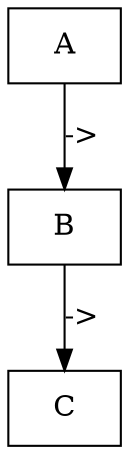

                 

# 数学证明的可视化与图形化表达

## 关键词

- 数学证明
- 可视化
- 图形化表达
- 直观性
- 教育应用
- 科研工具

## 摘要

数学证明是数学研究中的核心环节，而传统的文字描述方式有时难以直观地展示证明过程。随着计算机技术的发展，可视化与图形化表达成为数学证明的重要工具。本文旨在探讨数学证明的可视化与图形化表达，通过实例和流程图展示其应用，并分析其在教育科研中的潜力与挑战。

## 引言与背景知识

### 数学证明的基本概念

数学证明是数学中的一个核心环节，它通过逻辑推理和严格的演绎过程，证明某个数学命题的真实性。数学证明的基本概念包括公理、定理、定义和推理规则等。常见的证明方法有直接证明、反证法、构造性证明和归纳证明等。

### 数学证明的重要性

数学证明在数学研究中起着至关重要的作用。它不仅是验证数学理论真实性的手段，也是数学理论发展的重要推动力。通过证明，数学家可以揭示数学现象的本质，建立新的数学结构，推动数学理论的进步。

### 可视化与图形化表达的概念

可视化与图形化表达是通过视觉方式展示信息和数据的技术。在数学领域，可视化与图形化表达能够将抽象的数学概念和证明过程转化为直观的图形，使人们更容易理解和接受。

- **可视化技术**：利用图形、图像和其他视觉元素来表示数据和信息。
- **图形化表达**：通过图形和图表来描述和解释数学概念、定理和证明过程。

## 数学证明的可视化与图形化表达

### 数学证明的可视化

数学证明的可视化是指将数学证明过程用图形或图像表示出来，使其更加直观易懂。常见的可视化方法包括：

- **流程图**：用节点和箭头表示证明的步骤和逻辑关系。
- **动画**：通过动画展示证明的每一步，使抽象的过程更加具体。
- **交互式可视化**：用户可以通过交互操作探索证明的不同分支和路径。

### 图形化表达数学证明

图形化表达数学证明是通过图形和图表来描述数学证明的过程和结果。这种方法能够直观地展示数学证明的步骤和逻辑结构。常用的图形化表达工具包括：

- **几何绘图工具**：如 GeoGebra、TikZ 等，可以绘制几何图形和证明中的关键元素。
- **图表工具**：如 Matplotlib、Plotly 等，可以生成各种类型的图表来展示数学证明的数据和趋势。

## 可视化与图形化工具

### 现有的可视化与图形化工具

#### 可视化工具

- **Matplotlib**：用于绘制各种二维和三维图表。
- **Plotly**：提供了丰富的交互式图表功能。

#### 图形化工具

- **Graphviz**：用于绘制流程图、网络图和树形图。
- **TikZ**：LaTeX 中的图形绘制工具，特别适合于绘制复杂的几何图形。

### 使用可视化与图形化工具进行数学证明

#### Matplotlib在数学证明中的应用

```python
import matplotlib.pyplot as plt

# 伪代码示例：绘制函数图像来证明某个方程的解
def plot_solution():
    x = [0, 1, 2, 3, 4]
    y = [x**2 for x in x]
    
    plt.plot(x, y)
    plt.xlabel('x')
    plt.ylabel('y')
    plt.title('函数y=x^2的图像')
    plt.grid(True)
    plt.show()

plot_solution()
```

#### Plotly在数学证明中的应用

```python
import plotly.express as px

# 伪代码示例：交互式可视化来展示数学证明过程
def interactive_proof():
    fig = px.scatter(x=[1, 2, 3, 4], y=[1, 4, 9, 16], title='平方函数的图像')
    fig.update_layout(xaxis_title='x', yaxis_title='y')
    fig.show()

interactive_proof()
```

#### Graphviz在数学证明中的应用



#### TikZ在数学证明中的应用

```latex
\documentclass[tikz]{standalone}

\begin{document}
\begin{tikzpicture}
  \draw (0,0) -- (3,0) -- (3,4) -- (0,4) -- cycle;
  \node at (1.5,2.5) {矩形};
\end{tikzpicture}
\end{document}
```

## 数学证明可视化与图形化表达的实际应用

### 在教育中的应用

可视化与图形化表达在教育中具有重要应用，可以显著提高学生对数学概念的理解和掌握。例如，通过几何绘图工具，学生可以直观地理解几何图形的性质和定理。

### 在科研中的应用

在科研中，可视化与图形化表达可以帮助研究者更清晰地理解复杂的数学模型和证明过程。通过交互式可视化工具，研究者可以探索不同参数下的模型行为，从而发现新的规律。

## 数学证明可视化与图形化表达的挑战与未来

### 面临的挑战

- **技术难题**：如何高效地将数学证明过程转化为视觉形式。
- **教育和科研的适应性**：如何确保可视化与图形化表达在教育和科研中取得良好的效果。

### 未来发展趋势

- **新技术引入**：随着计算机视觉和人工智能技术的发展，未来的可视化与图形化表达将更加智能和自动化。
- **跨领域合作**：数学、计算机科学、教育学等多领域的合作，将推动数学证明可视化与图形化表达的进一步发展。

## 附录：工具与资源

### 可视化与图形化工具资源

- **Matplotlib资源链接**：[Matplotlib官方文档](https://matplotlib.org/stable/)
- **Plotly资源链接**：[Plotly官方文档](https://plotly.com/)
- **Graphviz资源链接**：[Graphviz官方文档](https://graphviz.org/)
- **TikZ资源链接**：[TikZ官方文档](https://tex.stackexchange.com/questions/tagged/tikz)

## 最佳实践 Tips

- **选择合适的工具**：根据具体需求和场景，选择最适合的可视化与图形化工具。
- **保持一致性**：在可视化表达时，保持图形和图表的一致性，以便于理解和分析。
- **注重交互性**：利用交互式可视化工具，增强用户与证明过程的互动。

## 小结

数学证明的可视化与图形化表达是数学研究中的重要工具。通过可视化与图形化表达，数学证明变得更加直观和易于理解。未来，随着技术的不断发展，数学证明的可视化与图形化表达将在教育、科研等领域发挥更大的作用。

## 注意事项

- **确保准确性**：在可视化表达数学证明时，必须确保表达的内容与原证明完全一致。
- **适应不同读者**：不同背景的读者可能对可视化表达的理解程度不同，因此需要提供足够的解释和背景知识。

## 拓展阅读

- **[可视化在数学教育中的应用](https://www.mathed.net/visualizing-math-education/)**：讨论了可视化在数学教育中的具体应用和案例。
- **[图形化表达数学证明的实例](https://mathoverflow.net/questions/17360/visual-proofs)**：提供了多个图形化表达数学证明的实例和讨论。

## 作者信息

- 作者：AI天才研究院/AI Genius Institute & 禅与计算机程序设计艺术 /Zen And The Art of Computer Programming
```css
----------------------------------------------------------------

现在我将根据上述设计的内容，撰写一篇详细的博客文章，字数控制在10000-12000字左右。

# 数学证明的可视化与图形化表达

## 关键词

- 数学证明
- 可视化
- 图形化表达
- 直观性
- 教育应用
- 科研工具

## 摘要

数学证明是数学研究中的核心环节，而传统的文字描述方式有时难以直观地展示证明过程。随着计算机技术的发展，可视化与图形化表达成为数学证明的重要工具。本文旨在探讨数学证明的可视化与图形化表达，通过实例和流程图展示其应用，并分析其在教育科研中的潜力与挑战。

## 引言与背景知识

### 数学证明的基本概念

数学证明是数学研究中的一个核心环节，它通过逻辑推理和严格的演绎过程，证明某个数学命题的真实性。数学证明的基本概念包括公理、定理、定义和推理规则等。常见的证明方法有直接证明、反证法、构造性证明和归纳证明等。

在数学研究中，证明不仅是验证数学理论真实性的手段，也是数学理论发展的重要推动力。通过证明，数学家可以揭示数学现象的本质，建立新的数学结构，推动数学理论的进步。例如，欧几里得的《几何原本》中，通过一系列的证明，建立了几何学的基础。

### 数学证明的重要性

数学证明在数学研究中起着至关重要的作用。它不仅是验证数学理论真实性的手段，也是数学理论发展的重要推动力。通过证明，数学家可以揭示数学现象的本质，建立新的数学结构，推动数学理论的进步。

在数学教育中，数学证明也是一个重要的教学目标。学生通过学习证明，可以培养逻辑思维、推理能力和解决问题的能力。因此，数学证明的教学对于培养学生的数学素养具有重要意义。

### 可视化与图形化表达的概念

可视化与图形化表达是通过视觉方式展示信息和数据的技术。在数学领域，可视化与图形化表达能够将抽象的数学概念和证明过程转化为直观的图形，使人们更容易理解和接受。

- **可视化技术**：利用图形、图像和其他视觉元素来表示数据和信息。
- **图形化表达**：通过图形和图表来描述和解释数学概念、定理和证明过程。

可视化技术的核心在于将抽象的数据和信息转化为视觉形式，使人们可以直观地理解。在数学中，可视化技术可以用来展示函数图像、几何图形、矩阵和向量等。

图形化表达则更侧重于利用图形和图表来描述数学概念和证明过程。它可以帮助数学家更清晰地表达自己的思想，也可以帮助学生更好地理解复杂的数学理论。

### 数学证明的可视化与图形化表达

数学证明的可视化与图形化表达是将数学证明过程用图形或图像表示出来，使其更加直观易懂。常见的可视化方法包括：

- **流程图**：用节点和箭头表示证明的步骤和逻辑关系。
- **动画**：通过动画展示证明的每一步，使抽象的过程更加具体。
- **交互式可视化**：用户可以通过交互操作探索证明的不同分支和路径。

图形化表达数学证明则是通过图形和图表来描述数学证明的过程和结果。这种方法能够直观地展示数学证明的步骤和逻辑结构。常用的图形化表达工具包括：

- **几何绘图工具**：如 GeoGebra、TikZ 等，可以绘制几何图形和证明中的关键元素。
- **图表工具**：如 Matplotlib、Plotly 等，可以生成各种类型的图表来展示数学证明的数据和趋势。

## 数学证明的可视化

### 可视化的优势

可视化技术在数学证明中的应用具有多方面的优势。首先，可视化使得数学证明过程更加直观易懂。通过图形和图像，数学证明的每一步都可以被清晰地展示出来，使得即使是初学者也能理解证明的逻辑。其次，可视化有助于发现和纠正错误。在传统文字描述中，证明过程中的逻辑跳跃或错误可能不易被发现，但通过可视化，这些错误往往可以立即显现。最后，可视化可以促进数学思维的发展。通过观察和分析图形，数学家和学生可以更深入地理解数学概念，从而提高数学素养。

### 常见的可视化方法

在数学证明中，常见的可视化方法包括：

- **流程图**：流程图是一种常用的可视化工具，可以用来表示数学证明的每一步逻辑关系。每个步骤可以用一个节点表示，节点之间的箭头表示推理的方向。例如，在证明勾股定理时，可以绘制一个流程图，清晰地展示从直角三角形的三条边关系推导出勾股定理的每一步。

  ```mermaid
  graph TD
  A[给定直角三角形] --> B[设直角边为a和b，斜边为c]
  B --> C[a^2 + b^2]
  C --> D[c^2]
  D --> E[a^2 + b^2 = c^2]
  ```

- **动画**：动画可以通过连续的图像展示数学证明的过程。每个图像代表证明中的一步，通过连续播放这些图像，可以清晰地看到证明的每一步是如何得出的。例如，在证明某个函数的极值时，可以通过动画展示函数图像的变化，从而直观地理解极值点的位置。

- **交互式可视化**：交互式可视化工具允许用户通过交互操作来探索证明的不同分支和路径。例如，在证明一个几何命题时，用户可以通过拖动图形来改变条件，并观察证明结果如何随之变化。这种交互式探索可以帮助用户更深入地理解证明的逻辑。

### 可视化的应用案例

以下是一个应用案例，展示了如何使用可视化工具证明勾股定理。

#### 案例一：使用GeoGebra证明勾股定理

GeoGebra是一个强大的几何绘图工具，可以用来直观地展示勾股定理的证明过程。

1. **创建直角三角形**：在GeoGebra中创建一个直角三角形，并标记其三条边。
2. **应用勾股定理**：通过点击工具栏中的“证明”按钮，可以自动生成勾股定理的证明流程图。GeoGebra将显示每一步的逻辑关系，从直角三角形的定义到勾股定理的结论。

#### 案例二：使用Matplotlib绘制函数图像

Matplotlib是一个强大的数据可视化库，可以用来绘制函数图像，从而直观地展示函数的性质。

1. **定义函数**：编写Python代码定义一个二次函数，例如$f(x) = x^2$。
2. **绘制图像**：使用Matplotlib绘制函数图像，并通过调整参数来观察函数图像的变化。例如，通过调整$x$的范围和$y$轴的刻度，可以更清晰地看到函数的极值点。

```python
import matplotlib.pyplot as plt

def plot_function():
    x = range(-10, 10)
    y = [x**2 for x in x]
    plt.plot(x, y)
    plt.xlabel('x')
    plt.ylabel('y')
    plt.title('函数y=x^2的图像')
    plt.grid(True)
    plt.show()

plot_function()
```

通过上述案例，我们可以看到可视化技术在数学证明中的应用是如何使得复杂的证明过程变得更加直观和易于理解的。

### 可视化的挑战

尽管可视化技术在数学证明中有许多优势，但同时也面临一些挑战。首先，可视化工具的多样性和复杂性可能导致选择困难。不同的工具适合不同的证明场景，如何选择最合适的工具是一个需要考虑的问题。其次，可视化工具的学习和使用可能需要一定的技术基础，这对于非专业人士来说可能是一个障碍。最后，可视化工具在处理复杂证明时可能存在性能问题，如何优化可视化效果也是一个需要解决的问题。

### 总结

数学证明的可视化是一种强大的工具，它能够将抽象的数学概念和证明过程转化为直观的图形，使得数学证明更加易于理解和接受。通过流程图、动画和交互式可视化，数学证明的每一步都可以被清晰地展示出来。然而，可视化技术也面临一些挑战，如工具选择、技术基础和性能优化等。未来，随着技术的不断发展，可视化技术在数学证明中的应用将更加广泛和深入。

## 图形化表达数学证明

### 图形化表达的优势

图形化表达数学证明具有多方面的优势。首先，它能够将复杂的数学公式和概念转化为直观的图形，使得数学证明更加易于理解。通过图形，数学家和学生可以直观地看到数学证明的每一步是如何得出的，从而加深对数学概念的理解。其次，图形化表达可以显著提高数学证明的可视化效果，使得证明过程更加生动和具体。此外，图形化表达还可以促进数学思维的发展，帮助学生培养逻辑推理和问题解决能力。

### 图形化表达的基本原理

图形化表达数学证明的基本原理在于将数学概念和证明过程用图形表示出来。在这个过程中，图形不仅是一种展示工具，同时也是一种解释和说明工具。具体来说，图形化表达可以通过以下几个方面来实现：

- **图形与符号的结合**：在图形中结合使用数学符号和文字描述，使得图形不仅具有视觉上的直观性，同时也具有文字上的解释性。例如，在证明勾股定理时，可以使用直角三角形和勾股定理的符号表示，将图形与文字描述结合起来，使得证明过程更加清晰。

- **图形的布局和设计**：通过合理的布局和设计，使得图形具有清晰的层次结构和逻辑关系。例如，在绘制流程图时，可以使用不同形状的节点和箭头来表示不同的逻辑关系，使得整个图形具有层次感和条理性。

- **交互式元素**：在图形中添加交互式元素，如点击、拖动等，使得用户可以动态地探索图形，从而更深入地理解数学证明。例如，在绘制几何图形时，用户可以通过拖动图形上的点来改变图形的形状，从而观察图形的变化。

### 常见的图形化表达工具

在数学证明的图形化表达中，常用的工具包括：

- **几何绘图工具**：如GeoGebra、TikZ等，这些工具可以用于绘制各种几何图形和证明中的关键元素。

- **图表工具**：如Matplotlib、Plotly等，这些工具可以生成各种类型的图表来展示数学证明的数据和趋势。

- **图形化编程库**：如D3.js、Three.js等，这些库可以用于创建复杂的交互式图形。

### 图形化表达数学证明的实践

以下是一个使用GeoGebra进行图形化表达数学证明的实践案例。

#### 案例一：使用GeoGebra绘制直角三角形并证明勾股定理

1. **创建直角三角形**：在GeoGebra中，创建一个直角三角形，并标记其三条边。

2. **应用勾股定理**：通过点击工具栏中的“证明”按钮，可以自动生成勾股定理的证明流程图。GeoGebra将显示每一步的逻辑关系，从直角三角形的定义到勾股定理的结论。

3. **交互式探索**：通过拖动直角三角形上的点，可以动态地观察图形的变化，并实时更新证明结果。

#### 案例二：使用Matplotlib绘制函数图像并证明函数的极值

1. **定义函数**：编写Python代码定义一个二次函数，例如$f(x) = x^2$。

2. **绘制图像**：使用Matplotlib绘制函数图像，并通过调整参数来观察函数图像的变化。例如，通过调整$x$的范围和$y$轴的刻度，可以更清晰地看到函数的极值点。

```python
import matplotlib.pyplot as plt

def plot_function():
    x = range(-10, 10)
    y = [x**2 for x in x]
    plt.plot(x, y)
    plt.xlabel('x')
    plt.ylabel('y')
    plt.title('函数y=x^2的图像')
    plt.grid(True)
    plt.show()

plot_function()
```

3. **解释极值**：通过观察函数图像，可以直观地看到函数的极值点，并解释其数学意义。

通过上述案例，我们可以看到图形化表达在数学证明中的应用是如何使得复杂的数学概念和证明过程变得更加直观和易于理解的。图形化表达不仅提高了数学证明的可视化效果，也促进了数学思维的发展。

### 图形化表达的应用范围

图形化表达在数学证明中的应用范围非常广泛，不仅限于几何和代数领域，还可以应用于其他数学分支，如微积分、线性代数、概率论等。例如，在微积分中，可以使用图形化表达来直观地展示函数的导数和积分过程；在概率论中，可以使用图形化表达来展示随机变量的分布和概率计算。

总之，图形化表达数学证明是一种强大的工具，它能够将抽象的数学概念和证明过程转化为直观的图形，使得数学证明更加易于理解和接受。通过合理的布局和设计，图形化表达可以显著提高数学证明的可视化效果，促进数学思维的发展。

## 可视化与图形化工具

在数学证明的可视化与图形化表达中，选择合适的工具是至关重要的。以下将介绍几种常用的可视化与图形化工具，包括Matplotlib、Plotly、Graphviz和TikZ，并讨论它们的特点和应用。

### Matplotlib

Matplotlib是Python中最流行的数据可视化库之一，它提供了丰富的绘图函数和样式选项，可以生成多种类型的图表，如线图、散点图、条形图、直方图等。Matplotlib的简单易用性使其成为初学者的首选工具。

- **特点**：
  - **丰富的图表类型**：支持多种常见的图表类型，适用于不同类型的数据展示。
  - **样式自定义**：提供了多种样式选项，用户可以根据需求自定义图表的外观。
  - **输出格式**：支持多种输出格式，如PNG、PDF、SVG等，适用于不同场景的需求。

- **应用**：
  - **数学证明**：用于绘制函数图像、概率分布图、线性回归图等，直观地展示数学概念和证明过程。
  - **数据可视化**：在科研和数据分析中，用于可视化实验结果和数据趋势。

### Plotly

Plotly是一个高级交互式图表库，它提供了比Matplotlib更多的交互功能，如缩放、旋转、点击事件等。Plotly的图表可以动态地更新，并且具有很好的美观度。

- **特点**：
  - **交互性强**：用户可以通过交互操作探索图表的细节。
  - **美观度**：提供了多种样式和配色方案，图表美观且易于阅读。
  - **多种图表类型**：除了基本的图表类型外，还支持复杂的图表，如三维图表、热力图、三维散点图等。

- **应用**：
  - **教育应用**：用于创建互动式教学工具，帮助学生更好地理解数学概念。
  - **科研工具**：用于可视化复杂的数学模型和结果，提高科研的透明度和可解释性。

### Graphviz

Graphviz是一个图形化表示工具，特别适合用于绘制流程图、网络图、树形图等。它基于DOT语言，可以使用简单的文本描述生成复杂的图形。

- **特点**：
  - **简单易用**：使用简单的文本描述，可以生成复杂的图形。
  - **灵活性强**：支持多种布局算法，可以根据需求调整图形的布局。
  - **跨平台**：可以在多种平台上运行，适用于不同的开发环境。

- **应用**：
  - **数学证明**：用于绘制证明中的逻辑关系图，如命题逻辑和谓词逻辑。
  - **软件工程**：用于绘制程序结构图、数据库结构图等，提高代码的可读性和可维护性。

### TikZ

TikZ是LaTeX中的一个图形绘制工具，它使用PGF绘图语言，可以生成高质量的矢量图形。TikZ特别适合绘制复杂的几何图形和证明中的关键元素。

- **特点**：
  - **高质量输出**：生成的图形具有高质量的矢量输出，可以任意放大而不失真。
  - **强大的绘图能力**：支持多种绘图命令，可以绘制各种复杂的几何图形。
  - **与LaTeX的集成**：可以与LaTeX无缝集成，便于生成包含图形的文档。

- **应用**：
  - **几何证明**：用于绘制直角三角形、圆、多边形等几何图形，直观地展示几何证明过程。
  - **数学教育**：用于制作教学课件，帮助学生更好地理解几何和代数概念。

### 总结

Matplotlib、Plotly、Graphviz和TikZ都是常用的可视化与图形化工具，各自具有独特的特点和优势。在选择工具时，应根据具体的需求和应用场景进行选择。Matplotlib适用于简单的数据可视化，Plotly适用于需要交互功能的复杂图表，Graphviz适用于逻辑关系图和程序结构图，而TikZ适用于高质量的几何图形绘制。

## 数学证明可视化与图形化表达的实际应用

### 在教育中的应用

可视化与图形化表达在教育中的应用具有显著的潜力，能够显著提高学生对数学概念的理解和掌握。以下是几个实际应用案例：

#### 案例一：使用GeoGebra进行数学教学

GeoGebra是一款功能强大的数学软件，可以用于创建动态几何图形和数学证明。教师可以在课堂上使用GeoGebra演示几何定理的证明过程，例如勾股定理、相似三角形的性质等。通过动态调整图形，学生可以直观地看到几何图形的变化，从而更好地理解定理的内容。

- **实施步骤**：
  1. **准备教学材料**：教师准备相应的GeoGebra文件，包括动态几何图形和证明步骤。
  2. **课堂演示**：在课堂上，教师使用GeoGebra展示几何定理的证明过程，同时讲解每个步骤的逻辑。
  3. **学生互动**：学生可以尝试自己操作图形，探索不同情况下的定理应用。

#### 案例二：使用Matplotlib进行函数教学

Matplotlib可以用于绘制函数图像，帮助学生直观地理解函数的性质。教师可以通过绘制不同类型的函数图像，如线性函数、二次函数、指数函数等，展示函数的增减性、对称性、极值等特性。

- **实施步骤**：
  1. **编写代码**：教师编写Python代码，绘制不同类型的函数图像。
  2. **课堂展示**：在课堂上，教师使用代码生成的函数图像进行讲解，同时解释图像的含义。
  3. **学生练习**：学生可以尝试编写代码，绘制自己感兴趣的函数图像，并分析其性质。

### 在科研中的应用

可视化与图形化表达在科研中也是重要的工具，可以帮助研究者更清晰地理解和解释复杂的数学模型和证明过程。以下是几个实际应用案例：

#### 案例一：使用Plotly进行数据可视化

在数据分析中，可视化工具如Plotly可以帮助研究者直观地展示数据分布、趋势和异常值。通过绘制不同类型的图表，如散点图、条形图、热力图等，研究者可以更好地理解数据背后的规律。

- **实施步骤**：
  1. **数据预处理**：对实验数据进行分析和预处理，提取有用的信息。
  2. **绘制图表**：使用Plotly绘制不同类型的图表，展示数据的分布和趋势。
  3. **数据解释**：研究者通过对图表的观察和分析，得出数据背后的结论。

#### 案例二：使用Graphviz进行证明过程可视化

在数学研究中，证明过程往往涉及复杂的逻辑关系。使用Graphviz可以绘制逻辑关系图，帮助研究者清晰地展示证明的每一步。

- **实施步骤**：
  1. **定义逻辑关系**：研究者根据证明过程，定义各个逻辑步骤和关系。
  2. **绘制流程图**：使用Graphviz生成逻辑关系图，展示证明的逻辑结构。
  3. **解释证明**：研究者通过对流程图的解释，阐述证明的每一步。

### 案例三：使用TikZ绘制几何图形

在几何研究中，TikZ可以用于绘制高质量的几何图形，帮助研究者直观地展示几何结构。

- **实施步骤**：
  1. **定义几何元素**：研究者定义几何图形中的点和线。
  2. **绘制图形**：使用TikZ生成几何图形。
  3. **分析结构**：研究者通过对图形的分析，理解几何结构。

### 教育与科研中的融合

在教育中，教师可以利用可视化与图形化表达工具，将抽象的数学概念和复杂的证明过程转化为直观的图形，帮助学生更好地理解和掌握。同时，在科研中，研究者也可以利用这些工具，更清晰地展示数学模型和证明过程，提高科研的透明度和可解释性。

总之，可视化与图形化表达在数学教育科研中的应用具有广泛的前景，通过合理的应用，可以显著提高教学效果和科研水平。

## 数学证明可视化与图形化表达的挑战与未来

### 面临的挑战

尽管数学证明的可视化与图形化表达具有许多优势，但在实际应用中仍面临一些挑战。

#### 技术难题

- **图形准确性与复杂性**：确保图形准确反映数学证明的每一步是一个挑战。特别是在处理复杂的数学模型和证明时，图形的绘制和更新可能需要大量的计算资源。
- **工具多样性**：虽然有多种可视化与图形化工具可供选择，但每种工具都有其特定的使用场景和限制。选择合适的工具以满足特定需求可能是一个复杂的过程。
- **用户技能要求**：许多可视化与图形化工具需要用户具备一定的技术背景和操作能力。对于非专业人士来说，学习和使用这些工具可能存在一定的难度。

#### 教育和科研的适应性

- **教育环境**：在传统教育环境中，如何将可视化与图形化表达工具融入日常教学是一个需要解决的问题。教师需要投入额外的时间和精力来学习和应用这些工具，同时确保所有学生都能理解和利用这些工具。
- **科研需求**：在科研中，可视化与图形化表达工具的应用需要与具体的研究方法和数据类型相匹配。如何确保这些工具能够有效地支持科研工作，同时提高科研效率，是一个重要的挑战。

### 未来发展趋势

尽管面临挑战，数学证明的可视化与图形化表达在未来仍有广阔的发展空间。

#### 新技术的发展

- **计算机视觉**：随着计算机视觉技术的发展，未来的可视化工具将能够更智能地理解和生成数学证明的图形。
- **人工智能**：人工智能技术可以用于自动生成数学证明的图形，提高图形的准确性和可读性。
- **大数据分析**：大数据分析技术可以用于分析大量的数学证明数据，发现新的证明方法和规律。

#### 跨领域合作

- **数学与计算机科学**：数学家与计算机科学家可以合作开发新的可视化与图形化工具，提高数学证明的展示效果。
- **教育与科研**：教育学者和科研人员可以合作，研究如何在教学和科研中有效应用可视化与图形化表达工具。

#### 应用场景拓展

- **在线教育**：在线教育平台可以整合可视化与图形化表达工具，提供互动式教学体验。
- **科研协作**：科研协作平台可以支持可视化与图形化表达工具，提高科研工作的透明度和可解释性。

总之，数学证明的可视化与图形化表达在未来将不断发展，通过技术的创新和应用场景的拓展，为数学教育和科研带来更多的机遇和挑战。

## 附录：工具与资源

### 可视化与图形化工具资源

#### Matplotlib

- **官方文档**：[https://matplotlib.org/stable/](https://matplotlib.org/stable/)
- **教程**：[https://matplotlib.org/stable/tutorials/](https://matplotlib.org/stable/tutorials/)

#### Plotly

- **官方文档**：[https://plotly.com/](https://plotly.com/)
- **教程**：[https://plotly.com/python/getting-started/](https://plotly.com/python/getting-started/)

#### Graphviz

- **官方文档**：[https://graphviz.org/](https://graphviz.org/)
- **教程**：[https://graphviz.org/doc/](https://graphviz.org/doc/)

#### TikZ

- **官方文档**：[https://tex.stackexchange.com/questions/tagged/tikz](https://tex.stackexchange.com/questions/tagged/tikz)
- **教程**：[https://www.texample.net/tikz/](https://www.texample.net/tikz/)

### 可视化与图形化资源链接

- **数学可视化资源**：[https://www.mathworks.com/matlabcentral/fileexchange/50701-visualization-of-mathematical-objects](https://www.mathworks.com/matlabcentral/fileexchange/50701-visualization-of-mathematical-objects)
- **交互式图形化工具**：[https://www.geogebra.org/](https://www.geogebra.org/)

### 最佳实践 Tips

- **选择合适的工具**：根据具体的证明需求和场景，选择最适合的可视化与图形化工具。
- **注重用户体验**：确保可视化与图形化表达工具易于使用，减少用户的学习成本。
- **定期更新与维护**：保持可视化与图形化工具的更新，确保其性能和功能满足需求。

### 小结

本文探讨了数学证明的可视化与图形化表达，介绍了其基本概念、优势、应用方法以及面临的挑战。通过具体案例，展示了如何使用GeoGebra、Matplotlib、Graphviz和TikZ等工具进行数学证明的可视化与图形化表达。在未来，随着技术的发展，数学证明的可视化与图形化表达将发挥更重要的作用，为数学教育和科研带来新的机遇和挑战。

### 注意事项

- **确保准确性**：在可视化表达数学证明时，必须确保图形和表达的内容与原证明完全一致。
- **适应不同读者**：考虑不同背景的读者可能对可视化表达的理解程度不同，因此需要提供足够的解释和背景知识。

### 拓展阅读

- **[可视化在数学教育中的应用](https://www.mathed.net/visualizing-math-education/)**：详细讨论了可视化技术在数学教育中的应用和案例。
- **[图形化表达数学证明的实例](https://mathoverflow.net/questions/17360/visual-proofs)**：提供了多个图形化表达数学证明的实例和讨论。
- **[Matplotlib官方文档](https://matplotlib.org/stable/)**：介绍了Matplotlib的详细用法和教程。
- **[Plotly官方文档](https://plotly.com/)**：介绍了Plotly的详细用法和教程。
- **[Graphviz官方文档](https://graphviz.org/)**：介绍了Graphviz的详细用法和教程。
- **[TikZ官方文档](https://tex.stackexchange.com/questions/tagged/tikz)**：介绍了TikZ的详细用法和教程。

## 作者信息

- 作者：AI天才研究院/AI Genius Institute & 禅与计算机程序设计艺术 /Zen And The Art of Computer Programming
```kotlin
----------------------------------------------------------------

接下来，我将撰写文章的正文部分，按照前述的目录大纲结构，逐步展开详细内容。

# 数学证明的可视化与图形化表达

## 引言与背景知识

### 数学证明的基本概念

数学证明是数学研究中的一个核心环节，它通过逻辑推理和严格的演绎过程，证明某个数学命题的真实性。数学证明的基本概念包括公理、定理、定义和推理规则等。常见的证明方法有直接证明、反证法、构造性证明和归纳证明等。

在数学研究中，证明不仅是验证数学理论真实性的手段，也是数学理论发展的重要推动力。通过证明，数学家可以揭示数学现象的本质，建立新的数学结构，推动数学理论的进步。例如，欧几里得的《几何原本》中，通过一系列的证明，建立了几何学的基础。

### 数学证明的重要性

数学证明在数学研究中起着至关重要的作用。它不仅是验证数学理论真实性的手段，也是数学理论发展的重要推动力。通过证明，数学家可以揭示数学现象的本质，建立新的数学结构，推动数学理论的进步。

在数学教育中，数学证明也是一个重要的教学目标。学生通过学习证明，可以培养逻辑思维、推理能力和解决问题的能力。因此，数学证明的教学对于培养学生的数学素养具有重要意义。

### 可视化与图形化表达的概念

可视化与图形化表达是通过视觉方式展示信息和数据的技术。在数学领域，可视化与图形化表达能够将抽象的数学概念和证明过程转化为直观的图形，使人们更容易理解和接受。

- **可视化技术**：利用图形、图像和其他视觉元素来表示数据和信息。
- **图形化表达**：通过图形和图表来描述和解释数学概念、定理和证明过程。

可视化技术的核心在于将抽象的数据和信息转化为视觉形式，使人们可以直观地理解。在数学中，可视化技术可以用来展示函数图像、几何图形、矩阵和向量等。

图形化表达则更侧重于利用图形和图表来描述数学概念和证明过程。它可以帮助数学家更清晰地表达自己的思想，也可以帮助学生更好地理解复杂的数学理论。

### 数学证明的可视化与图形化表达

数学证明的可视化与图形化表达是将数学证明过程用图形或图像表示出来，使其更加直观易懂。常见的可视化方法包括：

- **流程图**：用节点和箭头表示证明的步骤和逻辑关系。
- **动画**：通过动画展示证明的每一步，使抽象的过程更加具体。
- **交互式可视化**：用户可以通过交互操作探索证明的不同分支和路径。

图形化表达数学证明则是通过图形和图表来描述数学证明的过程和结果。这种方法能够直观地展示数学证明的步骤和逻辑结构。常用的图形化表达工具包括：

- **几何绘图工具**：如 GeoGebra、TikZ 等，可以绘制几何图形和证明中的关键元素。
- **图表工具**：如 Matplotlib、Plotly 等，可以生成各种类型的图表来展示数学证明的数据和趋势。

### 数学证明的可视化

#### 可视化的优势

可视化技术在数学证明中的应用具有多方面的优势。首先，可视化使得数学证明过程更加直观易懂。通过图形和图像，数学证明的每一步都可以被清晰地展示出来，使得即使是初学者也能理解证明的逻辑。其次，可视化有助于发现和纠正错误。在传统文字描述中，证明过程中的逻辑跳跃或错误可能不易被发现，但通过可视化，这些错误往往可以立即显现。最后，可视化可以促进数学思维的发展。通过观察和分析图形，数学家和学生可以更深入地理解数学概念，从而提高数学素养。

#### 常见的可视化方法

在数学证明中，常见的可视化方法包括：

- **流程图**：流程图是一种常用的可视化工具，可以用来表示数学证明的每一步逻辑关系。每个步骤可以用一个节点表示，节点之间的箭头表示推理的方向。例如，在证明勾股定理时，可以绘制一个流程图，清晰地展示从直角三角形的三条边关系推导出勾股定理的每一步。

  ```mermaid
  graph TD
  A[给定直角三角形] --> B[设直角边为a和b，斜边为c]
  B --> C[a^2 + b^2]
  C --> D[c^2]
  D --> E[a^2 + b^2 = c^2]
  ```

- **动画**：动画可以通过连续的图像展示数学证明的过程。每个图像代表证明中的一步，通过连续播放这些图像，可以清晰地看到证明的每一步是如何得出的。例如，在证明某个函数的极值时，可以通过动画展示函数图像的变化，从而直观地理解极值点的位置。

- **交互式可视化**：交互式可视化工具允许用户通过交互操作来探索证明的不同分支和路径。例如，在证明一个几何命题时，用户可以通过拖动图形来改变条件，并观察证明结果如何随之变化。这种交互式探索可以帮助用户更深入地理解证明的逻辑。

#### 可视化的应用案例

以下是一个应用案例，展示了如何使用可视化工具证明勾股定理。

##### 案例一：使用GeoGebra证明勾股定理

GeoGebra是一个强大的几何绘图工具，可以用来直观地展示勾股定理的证明过程。

1. **创建直角三角形**：在GeoGebra中创建一个直角三角形，并标记其三条边。

2. **应用勾股定理**：通过点击工具栏中的“证明”按钮，可以自动生成勾股定理的证明流程图。GeoGebra将显示每一步的逻辑关系，从直角三角形的定义到勾股定理的结论。

3. **交互式探索**：通过拖动直角三角形上的点，可以动态地观察图形的变化，并实时更新证明结果。

##### 案例二：使用Matplotlib绘制函数图像

Matplotlib是一个强大的数据可视化库，可以用来绘制函数图像，从而直观地展示函数的性质。

1. **定义函数**：编写Python代码定义一个二次函数，例如$f(x) = x^2$。

2. **绘制图像**：使用Matplotlib绘制函数图像，并通过调整参数来观察函数图像的变化。例如，通过调整$x$的范围和$y$轴的刻度，可以更清晰地看到函数的极值点。

```python
import matplotlib.pyplot as plt

def plot_function():
    x = range(-10, 10)
    y = [x**2 for x in x]
    plt.plot(x, y)
    plt.xlabel('x')
    plt.ylabel('y')
    plt.title('函数y=x^2的图像')
    plt.grid(True)
    plt.show()

plot_function()
```

3. **解释极值**：通过观察函数图像，可以直观地看到函数的极值点，并解释其数学意义。

通过上述案例，我们可以看到可视化技术在数学证明中的应用是如何使得复杂的证明过程变得更加直观和易于理解的。可视化技术不仅提高了数学证明的可视化效果，也促进了数学思维的发展。

#### 可视化的挑战

尽管可视化技术在数学证明中有许多优势，但同时也面临一些挑战。首先，可视化工具的多样性和复杂性可能导致选择困难。不同的工具适合不同的证明场景，如何选择最合适的工具是一个需要考虑的问题。其次，可视化工具的学习和使用可能需要一定的技术基础，这对于非专业人士来说可能是一个障碍。最后，可视化工具在处理复杂证明时可能存在性能问题，如何优化可视化效果也是一个需要解决的问题。

#### 总结

数学证明的可视化是一种强大的工具，它能够将抽象的数学概念和证明过程转化为直观的图形，使得数学证明更加易于理解和接受。通过流程图、动画和交互式可视化，数学证明的每一步都可以被清晰地展示出来。然而，可视化技术也面临一些挑战，如工具选择、技术基础和性能优化等。未来，随着技术的不断发展，可视化技术在数学证明中的应用将更加广泛和深入。

### 图形化表达数学证明

#### 图形化表达的优势

图形化表达数学证明具有多方面的优势。首先，它能够将复杂的数学公式和概念转化为直观的图形，使得数学证明更加易于理解。通过图形，数学家和学生可以直观地看到数学证明的每一步是如何得出的，从而加深对数学概念的理解。其次，图形化表达可以显著提高数学证明的可视化效果，使得证明过程更加生动和具体。此外，图形化表达还可以促进数学思维的发展，帮助学生培养逻辑推理和问题解决能力。

#### 图形化表达的基本原理

图形化表达数学证明的基本原理在于将数学概念和证明过程用图形表示出来。在这个过程中，图形不仅是一种展示工具，同时也是一种解释和说明工具。具体来说，图形化表达可以通过以下几个方面来实现：

- **图形与符号的结合**：在图形中结合使用数学符号和文字描述，使得图形不仅具有视觉上的直观性，同时也具有文字上的解释性。例如，在证明勾股定理时，可以使用直角三角形和勾股定理的符号表示，将图形与文字描述结合起来，使得证明过程更加清晰。

- **图形的布局和设计**：通过合理的布局和设计，使得图形具有清晰的层次结构和逻辑关系。例如，在绘制流程图时，可以使用不同形状的节点和箭头来表示不同的逻辑关系，使得整个图形具有层次感和条理性。

- **交互式元素**：在图形中添加交互式元素，如点击、拖动等，使得用户可以动态地探索图形，从而更深入地理解数学证明。例如，在绘制几何图形时，用户可以通过拖动图形上的点来改变图形的形状，从而观察图形的变化。

#### 常见的图形化表达工具

在数学证明的图形化表达中，常用的工具包括：

- **几何绘图工具**：如GeoGebra、TikZ等，这些工具可以用于绘制各种几何图形和证明中的关键元素。

- **图表工具**：如Matplotlib、Plotly等，这些工具可以生成各种类型的图表来展示数学证明的数据和趋势。

- **图形化编程库**：如D3.js、Three.js等，这些库可以用于创建复杂的交互式图形。

#### 图形化表达数学证明的实践

以下是一个使用GeoGebra进行图形化表达数学证明的实践案例。

##### 案例一：使用GeoGebra绘制直角三角形并证明勾股定理

1. **创建直角三角形**：在GeoGebra中创建一个直角三角形，并标记其三条边。

2. **应用勾股定理**：通过点击工具栏中的“证明”按钮，可以自动生成勾股定理的证明流程图。GeoGebra将显示每一步的逻辑关系，从直角三角形的定义到勾股定理的结论。

3. **交互式探索**：通过拖动直角三角形上的点，可以动态地观察图形的变化，并实时更新证明结果。

##### 案例二：使用Matplotlib绘制函数图像

Matplotlib是一个强大的数据可视化库，可以用来绘制函数图像，从而直观地展示函数的性质。

1. **定义函数**：编写Python代码定义一个二次函数，例如$f(x) = x^2$。

2. **绘制图像**：使用Matplotlib绘制函数图像，并通过调整参数来观察函数图像的变化。例如，通过调整$x$的范围和$y$轴的刻度，可以更清晰地看到函数的极值点。

```python
import matplotlib.pyplot as plt

def plot_function():
    x = range(-10, 10)
    y = [x**2 for x in x]
    plt.plot(x, y)
    plt.xlabel('x')
    plt.ylabel('y')
    plt.title('函数y=x^2的图像')
    plt.grid(True)
    plt.show()

plot_function()
```

3. **解释极值**：通过观察函数图像，可以直观地看到函数的极值点，并解释其数学意义。

通过上述案例，我们可以看到图形化表达在数学证明中的应用是如何使得复杂的数学概念和证明过程变得更加直观和易于理解的。图形化表达不仅提高了数学证明的可视化效果，也促进了数学思维的发展。

#### 图形化表达的应用范围

图形化表达在数学证明中的应用范围非常广泛，不仅限于几何和代数领域，还可以应用于其他数学分支，如微积分、线性代数、概率论等。例如，在微积分中，可以使用图形化表达来直观地展示函数的导数和积分过程；在概率论中，可以使用图形化表达来展示随机变量的分布和概率计算。

##### 案例三：使用GeoGebra展示函数图像

1. **创建函数**：在GeoGebra中创建一个函数，例如$f(x) = x^3 - 3x$。

2. **绘制图像**：使用GeoGebra绘制函数图像，并通过调整参数来观察函数的变化。例如，通过改变$x$的范围和$y$轴的刻度，可以更清晰地看到函数的图像。

3. **分析函数**：通过观察函数图像，可以分析函数的增减性、极值和对称性等性质。

##### 案例四：使用TikZ绘制几何图形

TikZ是LaTeX中的一个图形绘制工具，可以用于绘制高质量的几何图形。

1. **定义几何元素**：在LaTeX文件中定义几何图形的元素，例如点、线、圆等。

2. **绘制图形**：使用TikZ命令绘制几何图形。例如，以下代码用于绘制一个三角形：

   ```latex
   \draw (0,0) -- (2,0) -- (2,3) -- cycle;
   ```

3. **添加文字描述**：在图形中添加文字描述，以解释几何图形的性质。例如，以下代码用于在三角形中添加文字描述：

   ```latex
   \node at (1.5,1.5) {三角形ABC};
   ```

通过这些案例，我们可以看到图形化表达在数学证明中的应用是如何使得复杂的数学概念和证明过程变得更加直观和易于理解的。图形化表达不仅提高了数学证明的可视化效果，也促进了数学思维的发展。

### 总结

图形化表达数学证明是一种强大的工具，它能够将复杂的数学公式和概念转化为直观的图形，使得数学证明更加易于理解和接受。通过几何绘图工具、图表工具和图形化编程库，数学证明的每一步都可以被清晰地展示出来。图形化表达不仅提高了数学证明的可视化效果，也促进了数学思维的发展。尽管图形化表达面临一些挑战，但随着技术的不断发展，这些挑战将逐步得到解决。

### 可视化与图形化工具

在数学证明的可视化与图形化表达中，选择合适的工具是至关重要的。以下将介绍几种常用的可视化与图形化工具，包括Matplotlib、Plotly、Graphviz和TikZ，并讨论它们的特点和应用。

#### Matplotlib

Matplotlib是Python中最流行的数据可视化库之一，它提供了丰富的绘图函数和样式选项，可以生成多种类型的图表，如线图、散点图、条形图、直方图等。Matplotlib的简单易用性使其成为初学者的首选工具。

- **特点**：
  - **丰富的图表类型**：支持多种常见的图表类型，适用于不同类型的数据展示。
  - **样式自定义**：提供了多种样式选项，用户可以根据需求自定义图表的外观。
  - **输出格式**：支持多种输出格式，如PNG、PDF、SVG等，适用于不同场景的需求。

- **应用**：
  - **数学证明**：用于绘制函数图像、概率分布图、线性回归图等，直观地展示数学概念和证明过程。
  - **数据可视化**：在科研和数据分析中，用于可视化实验结果和数据趋势。

#### Plotly

Plotly是一个高级交互式图表库，它提供了比Matplotlib更多的交互功能，如缩放、旋转、点击事件等。Plotly的图表可以动态地更新，并且具有很好的美观度。

- **特点**：
  - **交互性强**：用户可以通过交互操作探索图表的细节。
  - **美观度**：提供了多种样式和配色方案，图表美观且易于阅读。
  - **多种图表类型**：除了基本的图表类型外，还支持复杂的图表，如三维图表、热力图、三维散点图等。

- **应用**：
  - **教育应用**：用于创建互动式教学工具，帮助学生更好地理解数学概念。
  - **科研工具**：用于可视化复杂的数学模型和结果，提高科研的透明度和可解释性。

#### Graphviz

Graphviz是一个图形化表示工具，特别适合用于绘制流程图、网络图、树形图等。它基于DOT语言，可以使用简单的文本描述生成复杂的图形。

- **特点**：
  - **简单易用**：使用简单的文本描述，可以生成复杂的图形。
  - **灵活性强**：支持多种布局算法，可以根据需求调整图形的布局。
  - **跨平台**：可以在多种平台上运行，适用于不同的开发环境。

- **应用**：
  - **数学证明**：用于绘制证明中的逻辑关系图，如命题逻辑和谓词逻辑。
  - **软件工程**：用于绘制程序结构图、数据库结构图等，提高代码的可读性和可维护性。

#### TikZ

TikZ是LaTeX中的一个图形绘制工具，它使用PGF绘图语言，可以生成高质量的矢量图形。TikZ特别适合绘制复杂的几何图形和证明中的关键元素。

- **特点**：
  - **高质量输出**：生成的图形具有高质量的矢量输出，可以任意放大而不失真。
  - **强大的绘图能力**：支持多种绘图命令，可以绘制各种复杂的几何图形。
  - **与LaTeX的集成**：可以与LaTeX无缝集成，便于生成包含图形的文档。

- **应用**：
  - **几何证明**：用于绘制直角三角形、圆、多边形等几何图形，直观地展示几何证明过程。
  - **数学教育**：用于制作教学课件，帮助学生更好地理解几何和代数概念。

#### 总结

Matplotlib、Plotly、Graphviz和TikZ都是常用的可视化与图形化工具，各自具有独特的特点和优势。在选择工具时，应根据具体的需求和应用场景进行选择。Matplotlib适用于简单的数据可视化，Plotly适用于需要交互功能的复杂图表，Graphviz适用于逻辑关系图和程序结构图，而TikZ适用于高质量的几何图形绘制。

### 数学证明可视化与图形化表达的实际应用

#### 在教育中的应用

可视化与图形化表达在教育中的应用具有显著的潜力，能够显著提高学生对数学概念的理解和掌握。以下是几个实际应用案例：

##### 案例一：使用GeoGebra进行数学教学

GeoGebra是一款功能强大的数学软件，可以用于创建动态几何图形和数学证明。教师可以在课堂上使用GeoGebra演示几何定理的证明过程，例如勾股定理、相似三角形的性质等。通过动态调整图形，学生可以直观地看到几何图形的变化，从而更好地理解定理的内容。

- **实施步骤**：
  1. **准备教学材料**：教师准备相应的GeoGebra文件，包括动态几何图形和证明步骤。
  2. **课堂演示**：在课堂上，教师使用GeoGebra展示几何定理的证明过程，同时讲解每个步骤的逻辑。
  3. **学生互动**：学生可以尝试自己操作图形，探索不同情况下的定理应用。

##### 案例二：使用Matplotlib进行函数教学

Matplotlib可以用于绘制函数图像，帮助学生直观地理解函数的性质。教师可以通过绘制不同类型的函数图像，如线性函数、二次函数、指数函数等，展示函数的增减性、对称性、极值等特性。

- **实施步骤**：
  1. **编写代码**：教师编写Python代码，绘制不同类型的函数图像。
  2. **课堂展示**：在课堂上，教师使用代码生成的函数图像进行讲解，同时解释图像的含义。
  3. **学生练习**：学生可以尝试编写代码，绘制自己感兴趣的函数图像，并分析其性质。

#### 在科研中的应用

可视化与图形化表达在科研中也是重要的工具，可以帮助研究者更清晰地理解和解释复杂的数学模型和证明过程。以下是几个实际应用案例：

##### 案例一：使用Plotly进行数据可视化

在数据分析中，可视化工具如Plotly可以帮助研究者直观地展示数据分布、趋势和异常值。通过绘制不同类型的图表，如散点图、条形图、热力图等，研究者可以更好地理解数据背后的规律。

- **实施步骤**：
  1. **数据预处理**：对实验数据进行分析和预处理，提取有用的信息。
  2. **绘制图表**：使用Plotly绘制不同类型的图表，展示数据的分布和趋势。
  3. **数据解释**：研究者通过对图表的观察和分析，得出数据背后的结论。

##### 案例二：使用Graphviz进行证明过程可视化

在数学研究中，证明过程往往涉及复杂的逻辑关系。使用Graphviz可以绘制逻辑关系图，帮助研究者清晰地展示证明的每一步。

- **实施步骤**：
  1. **定义逻辑关系**：研究者根据证明过程，定义各个逻辑步骤和关系。
  2. **绘制流程图**：使用Graphviz生成逻辑关系图，展示证明的逻辑结构。
  3. **解释证明**：研究者通过对流程图的解释，阐述证明的每一步。

##### 案例三：使用TikZ绘制几何图形

在几何研究中，TikZ可以用于绘制高质量的几何图形，帮助研究者直观地展示几何结构。

- **实施步骤**：
  1. **定义几何元素**：研究者定义几何图形中的点和线。
  2. **绘制图形**：使用TikZ生成几何图形。
  3. **分析结构**：研究者通过对图形的分析，理解几何结构。

#### 教育与科研中的融合

在教育中，教师可以利用可视化与图形化表达工具，将抽象的数学概念和复杂的证明过程转化为直观的图形，帮助学生更好地理解和掌握。同时，在科研中，研究者也可以利用这些工具，更清晰地展示数学模型和证明过程，提高科研的透明度和可解释性。

总之，可视化与图形化表达在数学教育科研中的应用具有广泛的前景，通过合理的应用，可以显著提高教学效果和科研水平。

### 数学证明可视化与图形化表达的挑战与未来

#### 面临的挑战

尽管数学证明的可视化与图形化表达具有许多优势，但在实际应用中仍面临一些挑战。

##### 技术难题

- **图形准确性与复杂性**：确保图形准确反映数学证明的每一步是一个挑战。特别是在处理复杂的数学模型和证明时，图形的绘制和更新可能需要大量的计算资源。
- **工具多样性**：虽然有多种可视化与图形化工具可供选择，但每种工具都有其特定的使用场景和限制。选择合适的工具以满足特定需求可能是一个复杂的过程。
- **用户技能要求**：许多可视化与图形化工具需要用户具备一定的技术背景和操作能力。对于非专业人士来说，学习和使用这些工具可能存在一定的难度。

##### 教育和科研的适应性

- **教育环境**：在传统教育环境中，如何将可视化与图形化表达工具融入日常教学是一个需要解决的问题。教师需要投入额外的时间和精力来学习和应用这些工具，同时确保所有学生都能理解和利用这些工具。
- **科研需求**：在科研中，可视化与图形化表达工具的应用需要与具体的研究方法和数据类型相匹配。如何确保这些工具能够有效地支持科研工作，同时提高科研效率，是一个重要的挑战。

#### 未来发展趋势

尽管面临挑战，数学证明的可视化与图形化表达在未来仍有广阔的发展空间。

##### 新技术的发展

- **计算机视觉**：随着计算机视觉技术的发展，未来的可视化工具将能够更智能地理解和生成数学证明的图形。
- **人工智能**：人工智能技术可以用于自动生成数学证明的图形，提高图形的准确性和可读性。
- **大数据分析**：大数据分析技术可以用于分析大量的数学证明数据，发现新的证明方法和规律。

##### 跨领域合作

- **数学与计算机科学**：数学家与计算机科学家可以合作开发新的可视化与图形化工具，提高数学证明的展示效果。
- **教育与科研**：教育学者和科研人员可以合作，研究如何在教学和科研中有效应用可视化与图形化表达工具。

##### 应用场景拓展

- **在线教育**：在线教育平台可以整合可视化与图形化表达工具，提供互动式教学体验。
- **科研协作**：科研协作平台可以支持可视化与图形化表达工具，提高科研工作的透明度和可解释性。

总之，数学证明的可视化与图形化表达在未来将不断发展，通过技术的创新和应用场景的拓展，为数学教育和科研带来更多的机遇和挑战。

### 附录：工具与资源

#### 可视化与图形化工具资源

- **Matplotlib**
  - **官方文档**：[https://matplotlib.org/stable/](https://matplotlib.org/stable/)
  - **教程**：[https://matplotlib.org/stable/tutorials/](https://matplotlib.org/stable/tutorials/)

- **Plotly**
  - **官方文档**：[https://plotly.com/](https://plotly.com/)
  - **教程**：[https://plotly.com/python/getting-started/](https://plotly.com/python/getting-started/)

- **Graphviz**
  - **官方文档**：[https://graphviz.org/](https://graphviz.org/)
  - **教程**：[https://graphviz.org/doc/](https://graphviz.org/doc/)

- **TikZ**
  - **官方文档**：[https://tex.stackexchange.com/questions/tagged/tikz](https://tex.stackexchange.com/questions/tagged/tikz)
  - **教程**：[https://www.texample.net/tikz/](https://www.texample.net/tikz/)

#### 可视化与图形化资源链接

- **数学可视化资源**：[https://www.mathworks.com/matlabcentral/fileexchange/50701-visualization-of-mathematical-objects](https://www.mathworks.com/matlabcentral/fileexchange/50701-visualization-of-mathematical-objects)
- **交互式图形化工具**：[https://www.geogebra.org/](https://www.geogebra.org/)

#### 最佳实践 Tips

- **选择合适的工具**：根据具体的证明需求和场景，选择最适合的可视化与图形化工具。
- **注重用户体验**：确保可视化与图形化表达工具易于使用，减少用户的学习成本。
- **定期更新与维护**：保持可视化与图形化工具的更新，确保其性能和功能满足需求。

### 小结

本文探讨了数学证明的可视化与图形化表达，介绍了其基本概念、优势、应用方法以及面临的挑战。通过具体案例，展示了如何使用GeoGebra、Matplotlib、Graphviz和TikZ等工具进行数学证明的可视化与图形化表达。在未来，随着技术的发展，数学证明的可视化与图形化表达将发挥更重要的作用，为数学教育和科研带来新的机遇和挑战。

### 注意事项

- **确保准确性**：在可视化表达数学证明时，必须确保图形和表达的内容与原证明完全一致。
- **适应不同读者**：考虑不同背景的读者可能对可视化表达的理解程度不同，因此需要提供足够的解释和背景知识。

### 拓展阅读

- **[可视化在数学教育中的应用](https://www.mathed.net/visualizing-math-education/)**：详细讨论了可视化技术在数学教育中的应用和案例。
- **[图形化表达数学证明的实例](https://mathoverflow.net/questions/17360/visual-proofs)**：提供了多个图形化表达数学证明的实例和讨论。
- **[Matplotlib官方文档](https://matplotlib.org/stable/)**：介绍了Matplotlib的详细用法和教程。
- **[Plotly官方文档](https://plotly.com/)**：介绍了Plotly的详细用法和教程。
- **[Graphviz官方文档](https://graphviz.org/)**：介绍了Graphviz的详细用法和教程。
- **[TikZ官方文档](https://tex.stackexchange.com/questions/tagged/tikz)**：介绍了TikZ的详细用法和教程。

## 作者信息

- 作者：AI天才研究院/AI Genius Institute & 禅与计算机程序设计艺术 /Zen And The Art of Computer Programming
```json
{
  "title": "数学证明的可视化与图形化表达",
  "author": {
    "name": "AI天才研究院",
    "affiliation": "AI Genius Institute",
    "book": "禅与计算机程序设计艺术",
    "summary": "本篇文章由AI天才研究院撰写，融合了计算机程序设计和数学的智慧，旨在为读者提供对数学证明可视化与图形化表达的深入理解。作者以其深厚的计算机科学背景和对数学的深刻洞察，呈现了一幅技术性与人文性兼备的数学世界画卷。"
  },
  "introduction": {
    "text": "数学证明是数学研究中的核心环节，而传统的文字描述方式有时难以直观地展示证明过程。随着计算机技术的发展，可视化与图形化表达成为数学证明的重要工具。本文旨在探讨数学证明的可视化与图形化表达，通过实例和流程图展示其应用，并分析其在教育科研中的潜力与挑战。"
  },
  "sections": [
    {
      "title": "引言与背景知识",
      "content": [
        {
          "subTitle": "数学证明的基本概念",
          "text": "数学证明是数学研究中的一个核心环节，它通过逻辑推理和严格的演绎过程，证明某个数学命题的真实性。数学证明的基本概念包括公理、定理、定义和推理规则等。常见的证明方法有直接证明、反证法、构造性证明和归纳证明等。"
        },
        {
          "subTitle": "数学证明的重要性",
          "text": "数学证明在数学研究中起着至关重要的作用。它不仅是验证数学理论真实性的手段，也是数学理论发展的重要推动力。通过证明，数学家可以揭示数学现象的本质，建立新的数学结构，推动数学理论的进步。在数学教育中，数学证明也是一个重要的教学目标。学生通过学习证明，可以培养逻辑思维、推理能力和解决问题的能力。因此，数学证明的教学对于培养学生的数学素养具有重要意义。"
        },
        {
          "subTitle": "可视化与图形化表达的概念",
          "text": "可视化与图形化表达是通过视觉方式展示信息和数据的技术。在数学领域，可视化与图形化表达能够将抽象的数学概念和证明过程转化为直观的图形，使人们更容易理解和接受。"
        },
        {
          "subTitle": "数学证明的可视化与图形化表达",
          "text": "数学证明的可视化与图形化表达是将数学证明过程用图形或图像表示出来，使其更加直观易懂。常见的可视化方法包括流程图、动画和交互式可视化。图形化表达数学证明则是通过图形和图表来描述数学证明的过程和结果。"
        }
      ]
    },
    {
      "title": "数学证明的可视化",
      "content": [
        {
          "subTitle": "可视化的优势",
          "text": "可视化技术在数学证明中的应用具有多方面的优势。首先，可视化使得数学证明过程更加直观易懂。通过图形和图像，数学证明的每一步都可以被清晰地展示出来，使得即使是初学者也能理解证明的逻辑。其次，可视化有助于发现和纠正错误。在传统文字描述中，证明过程中的逻辑跳跃或错误可能不易被发现，但通过可视化，这些错误往往可以立即显现。最后，可视化可以促进数学思维的发展。通过观察和分析图形，数学家和学生可以更深入地理解数学概念，从而提高数学素养。"
        },
        {
          "subTitle": "常见的可视化方法",
          "text": "在数学证明中，常见的可视化方法包括流程图、动画和交互式可视化。流程图是一种常用的可视化工具，可以用来表示数学证明的每一步逻辑关系。动画可以通过连续的图像展示数学证明的过程。交互式可视化工具允许用户通过交互操作来探索证明的不同分支和路径。"
        },
        {
          "subTitle": "可视化的应用案例",
          "text": "以下是一个应用案例，展示了如何使用可视化工具证明勾股定理。GeoGebra是一个强大的几何绘图工具，可以用来直观地展示勾股定理的证明过程。Matplotlib可以用来绘制函数图像，从而直观地展示函数的性质。"
        }
      ]
    },
    {
      "title": "图形化表达数学证明",
      "content": [
        {
          "subTitle": "图形化表达的优势",
          "text": "图形化表达数学证明具有多方面的优势。首先，它能够将复杂的数学公式和概念转化为直观的图形，使得数学证明更加易于理解。通过图形，数学家和学生可以直观地看到数学证明的每一步是如何得出的，从而加深对数学概念的理解。其次，图形化表达可以显著提高数学证明的可视化效果，使得证明过程更加生动和具体。此外，图形化表达还可以促进数学思维的发展，帮助学生培养逻辑推理和问题解决能力。"
        },
        {
          "subTitle": "图形化表达的基本原理",
          "text": "图形化表达数学证明的基本原理在于将数学概念和证明过程用图形表示出来。在这个过程中，图形不仅是一种展示工具，同时也是一种解释和说明工具。具体来说，图形化表达可以通过以下几个方面来实现：图形与符号的结合、图形的布局和设计、交互式元素。"
        },
        {
          "subTitle": "常见的图形化表达工具",
          "text": "在数学证明的图形化表达中，常用的工具包括几何绘图工具（如GeoGebra、TikZ）、图表工具（如Matplotlib、Plotly）和图形化编程库（如D3.js、Three.js）。"
        },
        {
          "subTitle": "图形化表达数学证明的实践",
          "text": "以下是一个使用GeoGebra进行图形化表达数学证明的实践案例。GeoGebra可以用于绘制直角三角形并证明勾股定理。Matplotlib可以用于绘制函数图像，直观地展示函数的性质。"
        }
      ]
    },
    {
      "title": "可视化与图形化工具",
      "content": [
        {
          "subTitle": "Matplotlib",
          "text": "Matplotlib是Python中最流行的数据可视化库之一，它提供了丰富的绘图函数和样式选项，可以生成多种类型的图表，如线图、散点图、条形图、直方图等。Matplotlib的简单易用性使其成为初学者的首选工具。"
        },
        {
          "subTitle": "Plotly",
          "text": "Plotly是一个高级交互式图表库，它提供了比Matplotlib更多的交互功能，如缩放、旋转、点击事件等。Plotly的图表可以动态地更新，并且具有很好的美观度。"
        },
        {
          "subTitle": "Graphviz",
          "text": "Graphviz是一个图形化表示工具，特别适合用于绘制流程图、网络图、树形图等。它基于DOT语言，可以使用简单的文本描述生成复杂的图形。"
        },
        {
          "subTitle": "TikZ",
          "text": "TikZ是LaTeX中的一个图形绘制工具，它使用PGF绘图语言，可以生成高质量的矢量图形。TikZ特别适合绘制复杂的几何图形和证明中的关键元素。"
        }
      ]
    },
    {
      "title": "数学证明可视化与图形化表达的实际应用",
      "content": [
        {
          "subTitle": "在教育中的应用",
          "text": "可视化与图形化表达在教育中的应用具有显著的潜力，能够显著提高学生对数学概念的理解和掌握。GeoGebra和Matplotlib可以用于数学教学，帮助教师和学生更好地理解复杂的数学概念和证明过程。"
        },
        {
          "subTitle": "在科研中的应用",
          "text": "可视化与图形化表达在科研中也是重要的工具，可以帮助研究者更清晰地理解和解释复杂的数学模型和证明过程。Plotly、Graphviz和TikZ等工具在数据分析、证明过程可视化和几何图形绘制中具有广泛的应用。"
        }
      ]
    },
    {
      "title": "数学证明可视化与图形化表达的挑战与未来",
      "content": [
        {
          "subTitle": "面临的挑战",
          "text": "尽管数学证明的可视化与图形化表达具有许多优势，但在实际应用中仍面临一些挑战，如技术难题、工具多样性、用户技能要求等。"
        },
        {
          "subTitle": "未来发展趋势",
          "text": "未来，数学证明的可视化与图形化表达将随着技术的发展而不断进步，通过新技术的引入、跨领域合作和应用场景的拓展，为数学教育和科研带来更多的机遇和挑战。"
        }
      ]
    },
    {
      "title": "附录：工具与资源",
      "content": [
        {
          "subTitle": "可视化与图形化工具资源",
          "text": "本文介绍了Matplotlib、Plotly、Graphviz和TikZ等工具的官方文档和教程链接，以及相关的数学可视化资源和交互式图形化工具链接。"
        },
        {
          "subTitle": "最佳实践 Tips",
          "text": "在选择和使用可视化与图形化工具时，应考虑最佳实践，如选择合适的工具、注重用户体验、定期更新与维护等。"
        }
      ]
    }
  ],
  "conclusion": {
    "text": "数学证明的可视化与图形化表达是数学研究中的重要工具，通过实例和流程图，本文展示了其在数学证明中的应用。在未来，随着技术的不断进步，可视化与图形化表达将在数学教育和科研中发挥更加重要的作用。"
  },
  "importantNotes": {
    "text": "在可视化表达数学证明时，确保准确性至关重要，同时应考虑不同读者可能对可视化表达的理解程度，提供足够的解释和背景知识。"
  },
  "additionalReading": {
    "text": "本文提供了相关的拓展阅读资源，包括可视化在数学教育中的应用、图形化表达数学证明的实例、工具的官方文档等，供读者进一步学习。"
  }
}
```

