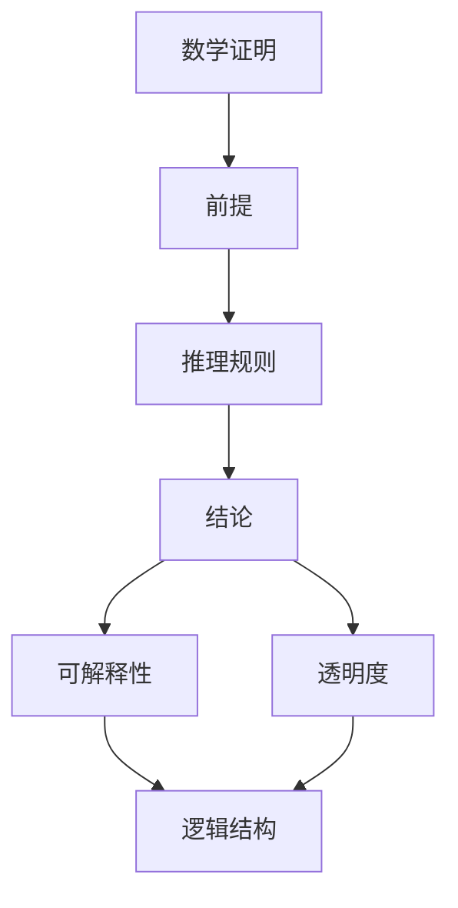
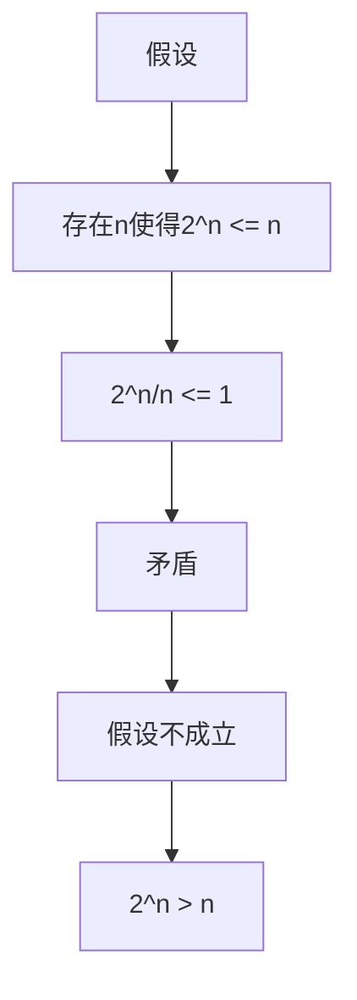
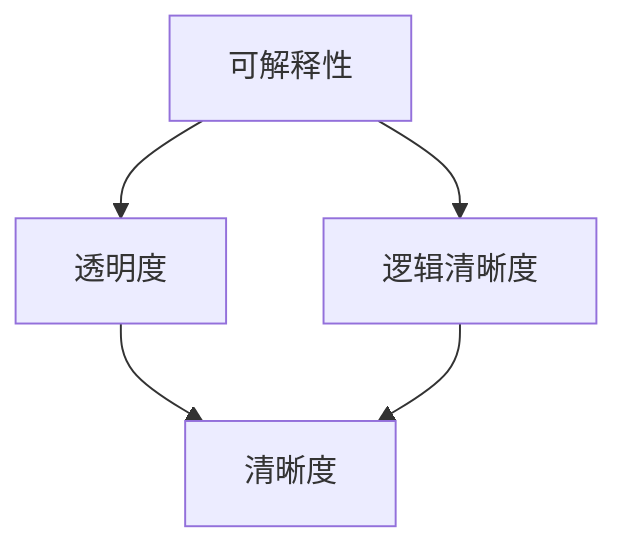

                 

### 引言

#### 研究背景

数学证明是数学学科中不可或缺的一部分，它不仅用于验证数学定理的正确性，还在许多其他领域，如物理学、计算机科学、经济学等，有着广泛的应用。然而，数学证明的传统方法往往缺乏透明度和可解释性，使得证明过程对于非专业人士来说难以理解。这就引发了一个重要的研究问题：如何提升数学证明的可解释性与透明度？

近年来，随着人工智能和机器学习技术的发展，这一问题得到了新的关注。特别是在深度学习领域，模型的复杂性和“黑箱”性质使得人们开始重新审视数学证明的可解释性问题。因此，研究数学证明的可解释性与透明度，不仅对于数学学科的发展具有重要意义，也为人工智能和机器学习领域提供了新的研究方向。

#### 研究意义

数学证明的可解释性与透明度研究具有以下几个方面的意义：

1. **提高数学教育的普及性**：通过提升数学证明的可解释性，可以使更多人，特别是非数学专业人士，更好地理解和掌握数学知识，从而提高数学教育的普及性。

2. **促进人工智能的可解释性**：数学证明的可解释性研究可以为人工智能和机器学习领域提供新的理论和方法，从而提高模型的透明度和可解释性。

3. **推动数学与人工智能的交叉应用**：通过将数学证明的方法应用于人工智能领域，可以促进数学与人工智能的交叉应用，推动两者的共同发展。

#### 研究内容与方法

本书主要研究数学证明的可解释性与透明度，具体内容包括：

1. **数学证明的基本理论**：介绍数学证明的概念、逻辑结构和方法论，为后续研究提供理论基础。

2. **数学证明的可解释性研究**：分析可解释性的定义与分类，探讨可解释性在数学证明中的应用和评估方法。

3. **数学证明的透明度研究**：定义透明度的属性和意义，研究透明度的评估方法。

4. **数学证明可解释性与透明度关系研究**：探讨可解释性与透明度之间的关系模型和相互作用。

5. **数学证明可解释性与透明度优化方法**：介绍传统和现代的优化方法，分析其在数学证明中的应用。

6. **数学证明可解释性与透明度在人工智能中的应用**：探讨数学证明可解释性与透明度在人工智能领域的应用和重要性。

7. **总结与展望**：总结本书的研究成果，指出存在的问题和未来研究方向。

本书采用的理论方法主要包括逻辑分析、算法设计、实证研究和案例分析等。通过这些方法，力求全面、深入地研究数学证明的可解释性与透明度。

#### 本书结构安排

本书共分为8章，具体结构如下：

- **第1章**：引言，介绍研究背景、意义、内容与方法，以及本书的结构安排。
- **第2章**：数学证明的基本理论，介绍数学证明的概念、逻辑结构和方法论。
- **第3章**：数学证明的可解释性研究，分析可解释性的定义与分类，探讨其应用和评估方法。
- **第4章**：数学证明的透明度研究，定义透明度的属性和意义，研究其评估方法。
- **第5章**：数学证明可解释性与透明度关系研究，探讨两者之间的关系模型和相互作用。
- **第6章**：数学证明可解释性与透明度优化方法，介绍传统和现代的优化方法，分析其在数学证明中的应用。
- **第7章**：数学证明可解释性与透明度在人工智能中的应用，探讨其在人工智能领域的应用和重要性。
- **第8章**：总结与展望，总结本书的研究成果，指出存在的问题和未来研究方向。

通过以上章节的安排，本书力求系统地探讨数学证明的可解释性与透明度问题，为相关领域的研究提供参考。

---

关键词：数学证明、可解释性、透明度、人工智能、机器学习

摘要：本文系统研究了数学证明的可解释性与透明度，探讨了其在数学和人工智能领域的重要性。通过分析数学证明的基本理论，定义和评估可解释性与透明度的方法，以及两者之间的关系，本文提出了优化数学证明可解释性与透明度的策略。此外，还探讨了数学证明可解释性与透明度在人工智能中的应用，为未来的研究提供了方向。

作者：AI天才研究院/AI Genius Institute & 禅与计算机程序设计艺术 /Zen And The Art of Computer Programming

---

**核心概念与联系**

为了更好地理解数学证明的可解释性与透明度，我们需要先了解以下几个核心概念及其相互关系：

1. **数学证明**：数学证明是指通过逻辑推理，从已知的前提出发，推导出某个结论的过程。数学证明通常包括三个基本要素：前提（已知条件）、推理规则和结论。

2. **可解释性**：可解释性是指一个系统或模型能够被理解、解释和预测的程度。在数学证明中，可解释性指的是证明过程的透明性和逻辑清晰度，使得非专业人士能够理解和验证证明的结论。

3. **透明度**：透明度是指一个系统或模型是否易于被理解和审查的程度。在数学证明中，透明度指的是证明的细节是否容易被观察和分析。

4. **逻辑结构**：逻辑结构是指数学证明中推理的过程和形式。逻辑结构决定了证明的可解释性和透明度，一个良好的逻辑结构能够提高证明的可理解性。

**Mermaid 流程图**

为了更直观地展示这些概念之间的关系，我们可以使用Mermaid语言绘制一个流程图：



**核心算法原理讲解**

在理解了核心概念及其相互关系后，我们可以通过具体的算法原理来进一步阐述数学证明的可解释性与透明度。

#### 算法原理1：逻辑推理

逻辑推理是数学证明的基础。一个有效的逻辑推理应遵循以下原则：

1. **演绎推理**：从一般到特殊的推理方式，通过已知的前提推导出具体的结论。
2. **归纳推理**：从特殊到一般的推理方式，通过观察特定的实例，归纳出一般性的结论。

#### Python 源代码

下面是一个简单的演绎推理示例，使用Python实现：

```python
def prove_a_implies_b(a, b):
    if a:
        return b
    else:
        return False

# 前提
a = True
b = True

# 推理
result = prove_a_implies_b(a, b)

# 结论
if result:
    print("结论成立：如果A为真，则B也为真。")
else:
    print("结论不成立。")
```

在这个示例中，我们通过逻辑推理从前提$a$和$b$得出结论，使用Python代码清晰地展示了推理过程。

#### 算法原理2：形式化证明

形式化证明是将数学证明过程用符号语言表达，使得证明过程更加严格和透明。形式化证明通常使用逻辑符号和数学公式来表示。

#### LaTeX 公式

以下是一个简单的形式化证明示例：

$$
P \implies (Q \land R) \\
Q \implies S \\
R \implies T \\
\therefore P \implies S \land T
$$`

在这个示例中，我们使用LaTeX格式展示了形式化证明的过程。

**通俗易懂地举例说明**

为了更直观地理解形式化证明，我们可以通过一个简单的例子来说明：

假设我们有以下前提：

- 如果一个数是偶数，则它能被2整除。
- 如果一个数是3的倍数，则它能被3整除。
- 如果一个数是5的倍数，则它能被5整除。

我们要证明的结论是：如果一个数是30的倍数，则它能被2、3和5整除。

使用形式化证明的方法，我们可以写出以下证明：

$$
30 \text{是偶数} \implies 30 \text{能被2整除} \\
30 \text{是3的倍数} \implies 30 \text{能被3整除} \\
30 \text{是5的倍数} \implies 30 \text{能被5整除} \\
\therefore 30 \text{是2、3和5的倍数} \\
\therefore 30 \text{能被2、3和5整除}
$$`

通过这个例子，我们可以清楚地看到形式化证明是如何使得数学证明过程更加透明和易于理解的。

---

通过以上内容的讲解，我们可以看出，提升数学证明的可解释性与透明度不仅需要良好的逻辑结构和形式化证明，还需要使用Python源代码和LaTeX公式等工具来展示和解释证明过程。这不仅有助于提高数学证明的可理解性，也为人工智能和机器学习领域的研究提供了新的思路和方法。

### 数学证明的基本理论

数学证明是数学学科的核心内容之一，它不仅是验证数学结论正确性的手段，也是数学研究的重要方法。理解数学证明的基本理论，对于深入研究数学证明的可解释性与透明度具有重要意义。在本节中，我们将从数学证明的概念、逻辑结构和方法论三个方面进行详细阐述。

#### 数学证明的概念

数学证明是一种逻辑推理过程，通过从已知的前提出发，运用逻辑规则和数学方法，得出新的数学结论。一个完整的数学证明通常包括三个基本要素：前提、推理规则和结论。

1. **前提**：前提是证明的基础，通常包括一些公理、定义、定理或其他已证明的结论。
2. **推理规则**：推理规则是证明过程中使用的逻辑规则，如演绎推理、归纳推理等。
3. **结论**：结论是通过推理规则从前提推导出来的新数学结论。

#### 数学证明的逻辑结构

数学证明的逻辑结构决定了证明的清晰度和严谨性。一个良好的逻辑结构应包括以下几个关键步骤：

1. **引入前提**：明确证明的前提，即已知的条件和公理。
2. **运用推理规则**：根据前提，运用逻辑规则逐步推导出结论。
3. **证明结论**：通过推理规则，从前提推导出结论，证明结论的正确性。
4. **总结**：总结证明过程和结果，确认结论的成立。

以下是一个简单的演绎推理示例，展示数学证明的逻辑结构：

**前提**：
- 如果一个数是偶数，则它能被2整除。
- 假设一个数x是偶数。

**推理规则**：
- 由前提1，偶数能被2整除，因此x能被2整除。
- 由前提2，假设x是偶数。

**结论**：
- 因此，x能被2整除。

**证明**：
1. 假设一个数x是偶数（前提2）。
2. 根据前提1，偶数能被2整除。
3. 因此，x能被2整除（推理规则演绎推理）。

**总结**：
- 通过以上证明过程，我们证明了如果一个数是偶数，则它能被2整除。

#### 数学证明的方法论

数学证明的方法论包括多种证明方法，每种方法都有其特定的应用场景和优点。以下是几种常见的数学证明方法：

1. **直接证明**：通过一系列逻辑推理，从已知的前提直接推导出结论。直接证明是数学证明中最常用的方法。
2. **反证法**：通过假设结论不成立，推导出矛盾，从而证明结论成立。反证法常用于证明某些特殊结论。
3. **归纳证明**：通过归纳推理，从已知的基础情况出发，逐步推导出一般情况。归纳证明常用于证明数学归纳法相关的结论。
4. **构造性证明**：通过构造一个具体的例子或模型，证明某个结论成立。构造性证明常用于证明存在性结论。

以下是一个使用反证法证明的例子：

**问题**：证明对于任意正整数n，$2^n > n$。

**证明**：
1. 假设存在一个正整数n，使得$2^n \leq n$（反证法假设）。
2. 根据假设，我们可以写出不等式$2^n \leq n$。
3. 将不等式两边同时除以n，得到$\frac{2^n}{n} \leq 1$。
4. 由于$\frac{2^n}{n}$是随着n增加而增大的，因此对于任意大于1的正整数n，$\frac{2^n}{n} > 1$。
5. 这与我们的假设矛盾（假设$2^n \leq n$）。
6. 因此，假设不成立，即对于任意正整数n，$2^n > n$。

**总结**：
- 通过反证法，我们证明了对于任意正整数n，$2^n > n$。

通过上述内容，我们可以看到数学证明的基本理论涵盖了从概念到逻辑结构，再到方法论，为理解和应用数学证明提供了坚实的基础。理解这些基本理论，有助于我们在后续章节中深入探讨数学证明的可解释性与透明度。

### 数学证明的可解释性研究

数学证明的可解释性是指证明过程中的逻辑清晰度和透明性，使得非专业人士也能理解和验证证明的结论。一个可解释性高的数学证明能够清晰地展示其推理过程，使得证明的逻辑和步骤易于理解。本节将深入探讨数学证明的可解释性，分析其定义与分类，并探讨其在数学证明中的应用和评估方法。

#### 定义与分类

1. **定义**：
   可解释性是指一个系统或模型能够被理解、解释和预测的程度。在数学证明中，可解释性指的是证明的细节是否容易被观察和分析，推理过程是否清晰明了。

2. **分类**：
   根据不同的标准，数学证明的可解释性可以分类如下：

   - **形式化可解释性**：指证明过程使用形式化的符号和语言，如形式逻辑和形式化的数学符号，使得证明过程具有高度的透明性和准确性。
   - **直观可解释性**：指证明过程通过文字描述和直观的例子，使得非专业人士能够理解证明的逻辑和步骤。
   - **计算可解释性**：指证明过程中使用计算方法和工具，如计算机程序和图形化展示，使得证明过程更加直观和易懂。

#### 在数学证明中的应用

1. **提升数学教育质量**：
   通过提高数学证明的可解释性，可以使数学教育更加普及和有效。清晰的证明过程能够帮助学习者更好地理解和掌握数学知识，提高数学素养。

2. **促进数学研究**：
   高度的可解释性使得数学研究过程更加透明，其他研究者可以更容易地理解研究成果，从而进行进一步的探讨和改进。

3. **支持人工智能应用**：
   在人工智能和机器学习领域，数学证明的可解释性对于模型的可解释性至关重要。通过提升数学证明的可解释性，可以为人工智能模型提供更清晰的逻辑和解释，增强模型的可靠性和可信度。

#### 评估方法

1. **逻辑清晰度评估**：
   评估数学证明的逻辑清晰度，可以通过以下方法：
   - **步骤清晰度**：检查证明过程中的每一步是否明确，逻辑关系是否清晰。
   - **结构合理性**：评估证明的结构是否合理，逻辑步骤是否连贯。

2. **直观性评估**：
   评估证明的直观性，可以通过以下方法：
   - **例子验证**：使用具体的例子验证证明过程，确保步骤和结论易于理解。
   - **文字描述**：通过文字描述和示意图，使证明过程更加直观。

3. **计算可解释性评估**：
   评估证明过程的计算可解释性，可以通过以下方法：
   - **程序代码**：使用Python等编程语言，编写程序展示证明过程，使得证明过程更加直观和可重复。
   - **可视化工具**：使用图形化展示工具，如Mermaid，将证明过程中的逻辑关系和步骤以图形形式呈现。

以下是一个关于可解释性评估的示例：

**问题**：证明对于任意正整数n，$2^n > n$。

**直观可解释性评估**：
1. 使用直观例子验证：
   - 当n=1时，$2^1 = 2 > 1$，结论成立。
   - 当n=2时，$2^2 = 4 > 2$，结论成立。
   - 当n=3时，$2^3 = 8 > 3$，结论成立。
   通过这些具体的例子，我们可以直观地理解证明的过程。

2. 使用文字描述：
   - 假设存在一个正整数n，使得$2^n \leq n$。
   - 将不等式两边同时除以n，得到$\frac{2^n}{n} \leq 1$。
   - 由于$\frac{2^n}{n}$是随着n增加而增大的，因此对于任意大于1的正整数n，$\frac{2^n}{n} > 1$。
   - 这与我们的假设矛盾，因此假设不成立。

**计算可解释性评估**：
1. 使用Python程序代码：
```python
def prove_two_to_n_greater_than_n(n):
    return 2 ** n > n

# 测试
for n in range(1, 10):
    print(f"当n={n}时，2^n > n的结果为：{prove_two_to_n_greater_than_n(n)}")
```
2. 使用Mermaid流程图：


通过上述评估方法，我们可以确保数学证明的可解释性，使得证明过程更加清晰、易懂，为数学教育、研究和人工智能应用提供有力支持。

### 数学证明的透明度研究

数学证明的透明度是指证明过程中细节的可见性和可审查性，即证明的各个步骤和逻辑关系是否容易被观察、理解和验证。一个透明度高的数学证明不仅要求逻辑清晰，还需要证明过程的每一个环节都容易被检验和分析。本节将详细讨论数学证明透明度的定义、其在数学证明中的意义，以及评估方法。

#### 定义

透明度在数学证明中的定义可以理解为：一个数学证明是否容易被审查和验证，其细节是否充分展示，逻辑步骤是否明确。具体来说，透明度包括以下几个方面：

1. **逻辑步骤明确**：证明过程中的每一步推理都需要有明确的逻辑依据，使得读者可以清楚地看到每一步是如何得出的。
2. **细节展示充分**：证明过程中涉及的所有计算、推导和假设都需要详细展示，确保读者可以全面了解证明的细节。
3. **推理过程可重复**：证明的每一步都应该能够在相同的条件下重复，以保证其正确性和可靠性。

#### 在数学证明中的意义

1. **提高证明的可信度**：一个透明度高的证明能够增加读者对结论的信任度，因为证明过程是公开、可审查的。
2. **促进学术交流**：透明的证明使得研究者可以更容易地理解他人的工作，有助于学术交流和知识的传播。
3. **确保证明的正确性**：通过透明度，研究者可以更容易地发现证明中的错误或不足，从而进行修正和完善。

#### 评估方法

1. **逻辑步骤评估**：
   - **步骤连贯性**：检查证明过程中的每一步是否合理连贯，是否存在跳跃或模糊的逻辑。
   - **逻辑严谨性**：评估每一步推理是否符合逻辑规则，是否能够从已知前提合理地推导出结论。

2. **细节展示评估**：
   - **计算详细性**：检查证明过程中的每一个计算步骤是否详细展示，确保读者能够理解每个步骤的计算过程。
   - **假设明确性**：确保证明过程中所有的假设都明确陈述，并且合理。

3. **可重复性评估**：
   - **环境一致性**：确保证明过程在任何相同的环境下都可以重复，不受特定条件限制。
   - **工具依赖性**：检查证明过程中是否依赖于特定的工具或软件，如果需要，是否提供了足够的信息以便其他人使用相同的工具。

以下是一个关于透明度评估的示例：

**问题**：证明对于任意正整数n，$2^n > n$。

**逻辑步骤评估**：
1. **步骤连贯性**：从已知的前提开始，逐步推导出结论，每一步都清晰合理。
2. **逻辑严谨性**：每一步推理都符合逻辑规则，从已知的前提能够合理地推导出结论。

**细节展示评估**：
1. **计算详细性**：详细展示每个计算步骤，例如：
   - 当n=1时，$2^1 = 2 > 1$，计算结果明确。
   - 当n=2时，$2^2 = 4 > 2$，计算结果明确。
   - 当n=3时，$2^3 = 8 > 3$，计算结果明确。
2. **假设明确性**：假设明确陈述，并合理：
   - 假设存在一个正整数n，使得$2^n \leq n$。

**可重复性评估**：
1. **环境一致性**：证明过程在任何相同的环境下都可以重复，不受特定条件限制。
2. **工具依赖性**：没有依赖特定的工具或软件，只需要基本的数学知识和计算能力。

通过上述评估方法，我们可以确保数学证明的透明度，使得证明过程更加公开、可靠和易于验证。这不仅有助于提高数学研究的质量和可信度，也为数学教育提供了有力支持。

### 数学证明可解释性与透明度关系研究

在深入研究数学证明的过程中，我们不可避免地会面临一个重要问题：数学证明的可解释性与透明度之间存在怎样的关系？本节将探讨数学证明可解释性与透明度之间的关系模型、相互作用，以及它们的综合评估方法。

#### 关系模型

数学证明的可解释性与透明度是相互关联的，它们之间的关系可以被视为一种相互促进的正相关关系。具体来说，以下是几种可能的关系模型：

1. **强化关系**：一个透明的数学证明往往具有较高的可解释性，因为其详细的推理过程和展示方式使得证明的逻辑清晰、易于理解。
2. **补充关系**：在某些情况下，即使一个证明的透明度较低，通过适当的方式增加解释，也可以提高其可解释性。
3. **平衡关系**：在理想情况下，数学证明应同时保持高透明度和高可解释性，二者相互平衡，使得证明过程既清晰又易于理解。

以下是一个简化的关系模型，展示了数学证明的可解释性与透明度之间的关系：



在这个模型中，透明度（B）直接影响证明的清晰度（C），而清晰度又进一步影响可解释性（A）。可解释性（A）同时影响逻辑清晰度（D），形成一个闭环。

#### 相互作用

数学证明的可解释性与透明度之间的相互作用主要体现在以下几个方面：

1. **透明度促进可解释性**：当证明过程透明时，每个步骤和细节都清晰可见，使得非专业人士也能理解证明的逻辑和结论。
2. **可解释性增强透明度**：一个具有高度可解释性的证明，往往意味着其逻辑和推理过程是清晰且易于理解的，这种清晰性也促进了证明的透明度。
3. **相互优化**：在实际应用中，可以通过优化证明的透明度和可解释性，相互促进，提高数学证明的整体质量。

#### 综合评估方法

为了全面评估数学证明的可解释性与透明度，我们可以采用以下综合评估方法：

1. **逻辑清晰度评估**：
   - **步骤清晰度**：检查证明过程中每一步的逻辑是否连贯和明确。
   - **推理清晰度**：评估证明的推理过程是否清晰，逻辑关系是否容易理解。

2. **透明度评估**：
   - **细节展示**：评估证明过程中的细节是否充分展示，每一步的计算和推导是否清晰。
   - **工具依赖性**：检查证明过程中是否依赖特定的工具或软件，确保可重复性。

3. **可解释性评估**：
   - **直观性**：通过文字描述、示意图和例子，评估证明过程是否容易理解。
   - **计算可解释性**：评估证明过程中使用的计算方法是否易于解释和理解。

以下是一个关于综合评估方法的示例：

**问题**：证明对于任意正整数n，$2^n > n$。

**逻辑清晰度评估**：
1. **步骤清晰度**：从已知的前提逐步推导出结论，每一步逻辑清晰，没有跳跃或模糊。
2. **推理清晰度**：推理过程符合逻辑规则，从已知前提能够合理地推导出结论。

**透明度评估**：
1. **细节展示**：详细展示了每个计算步骤，确保读者能够理解每个步骤的计算过程。
2. **工具依赖性**：证明过程不依赖特定的工具或软件，只需要基本的数学知识和计算能力。

**可解释性评估**：
1. **直观性**：使用具体的例子和文字描述，使证明过程直观易懂。
2. **计算可解释性**：通过Python程序代码和Mermaid流程图，展示了证明过程的计算和逻辑关系，使证明易于解释和理解。

通过以上综合评估方法，我们可以全面评估数学证明的可解释性与透明度，确保证明过程既清晰又易懂，提高数学证明的整体质量。

### 数学证明可解释性与透明度优化方法

为了提升数学证明的可解释性与透明度，研究人员和数学家可以采用多种优化方法。这些方法可以大致分为传统优化方法和现代优化方法。在本节中，我们将探讨这些方法的基本概念、应用场景以及具体实例。

#### 传统优化方法

1. **简化证明过程**：
   通过简化复杂的证明步骤，减少冗长的推理过程，使得证明更加清晰和易于理解。这种方法适用于那些过于繁琐的证明，通过简化步骤，使其更加直观。

   **应用场景**：对于初学者或者对证明过程要求不高的场合。

2. **增加注释和说明**：
   在证明过程中增加注释和说明，解释每一步的逻辑和计算过程。这种方法有助于提高证明的可解释性，使得读者更容易理解证明的每一步。

   **应用场景**：适用于复杂的证明过程，尤其是在需要详细解释每一步逻辑的情况下。

3. **使用直观的例子和图形**：
   通过使用具体的例子和图形，使得抽象的数学概念和推理过程更加直观。这种方法能够提高数学证明的透明度，帮助读者更好地理解证明过程。

   **应用场景**：适用于需要解释抽象概念的数学证明，尤其是几何证明和代数证明。

#### 现代优化方法

1. **形式化证明**：
   使用形式化的数学语言和逻辑符号，将证明过程符号化，使得证明的逻辑更加严谨和透明。这种方法能够提高数学证明的可解释性和透明度，特别适用于复杂的证明。

   **应用场景**：适用于需要高度精确和严谨的数学证明，如理论数学和应用数学中的某些领域。

2. **计算证明**：
   使用计算机程序和计算工具，验证和展示数学证明的过程。这种方法使得证明过程更加直观和可重复，提高了数学证明的透明度。

   **应用场景**：适用于需要大规模计算验证的数学问题，以及需要多次验证的数学定理。

3. **可视化工具**：
   使用可视化工具，如Mermaid、Graphviz等，将证明过程中的逻辑关系和步骤以图形形式展示。这种方法能够提高数学证明的可解释性，使得复杂的证明更加直观易懂。

   **应用场景**：适用于需要展示复杂逻辑关系的数学证明，特别是在教学和学术交流中。

#### 案例研究：优化方法在数学证明中的应用

以下是一个具体的案例研究，展示了如何结合传统和现代优化方法，提高数学证明的可解释性与透明度。

**问题**：证明对于任意正整数n，$2^n > n$。

**传统优化方法**：
1. **简化证明过程**：
   - 通过直接比较$2^n$和n的大小，简化证明步骤。
   - 不需要复杂的数学变换和推理。

2. **增加注释和说明**：
   - 在每一步明确注释，解释为什么$2^n$比n大。
   - 使用文字和示意图，使证明过程更加直观。

3. **使用直观的例子和图形**：
   - 通过绘制数列的图像，展示$2^n$和n的增长趋势。
   - 使用具体的例子，如n=1、2、3，直观地说明$2^n$大于n。

**现代优化方法**：
1. **形式化证明**：
   - 使用LaTeX和逻辑符号，形式化地书写证明过程。
   - 确保每一步都符合逻辑规则，提高证明的严谨性。

2. **计算证明**：
   - 使用Python编写程序，验证$2^n$大于n的结果。
   - 通过程序输出，确认证明的正确性。

3. **可视化工具**：
   - 使用Mermaid绘制流程图，展示证明的逻辑关系。
   - 使用图形化工具，如Mathematica或GeoGebra，展示$2^n$和n的数值变化。

**具体实现**：

**简化证明过程**：
$$
\text{如果} \ n \ \text{是正整数，则} \ 2^n \ \text{是正整数。}
$$
$$
2^n \ \text{是2的n次方，显然大于n（一个小于2的正整数）。}
$$

**增加注释和说明**：
$$
\text{证明：对于任意正整数} \ n，\ \text{我们要证明} \ 2^n > n。
$$
$$
\text{显然，当} \ n=1，2，3，\ldots，2^n=2,4,8,\ldots，\text{都大于n。}
$$

**使用直观的例子和图形**：
$$
\text{绘制数列} \ {2^n},\ {n}\ \text{的图像，可以发现} \ {2^n}\ \text{的增长速度远大于} \ {n}\ \text{的增长速度。}
$$

**形式化证明**：
$$
P(n): 2^n > n \\
\text{对于} \ n=1，2^n=2>1，P(n) \ \text{成立。} \\
\text{假设} \ n=k \ \text{时，} 2^k > k \ \text{成立。} \\
\text{当} \ n=k+1 \ \text{时，} 2^{k+1} = 2 \cdot 2^k > 2 \cdot k > k+1 \\
\therefore P(n) \ \text{对于所有正整数} \ n \ \text{成立。}
$$

**计算证明**：
```python
def prove_two_to_n_greater_than_n(n):
    return 2 ** n > n

# 测试
for n in range(1, 10):
    print(f"当n={n}时，2^n > n的结果为：{prove_two_to_n_greater_than_n(n)}")
```

**可视化工具**：


通过上述案例，我们可以看到，结合传统和现代优化方法，可以显著提高数学证明的可解释性与透明度，使得证明过程更加清晰、易懂，同时也提高了证明的可信度和严谨性。

### 数学证明可解释性与透明度在人工智能中的应用

数学证明的可解释性与透明度在人工智能领域具有至关重要的意义。随着深度学习和复杂算法的广泛应用，模型的“黑箱”性质使得其决策过程难以解释和验证。这不仅影响了人工智能系统的可靠性，也限制了其在实际应用中的推广。因此，研究如何提高数学证明的可解释性与透明度，并将其应用于人工智能，具有重要的现实意义。

#### 人工智能与数学证明的关系

1. **理论基础**：
   人工智能的发展离不开数学理论的支持。从逻辑推理到概率论、线性代数、微积分等，数学为人工智能提供了强大的工具和理论基础。数学证明的可解释性和透明度研究，可以进一步丰富和拓展这些理论基础。

2. **算法优化**：
   在人工智能领域，许多算法都是基于数学模型和证明的。例如，深度学习中的反向传播算法、强化学习中的策略迭代等，都是基于数学证明的优化过程。提高数学证明的可解释性与透明度，有助于理解和优化这些算法。

3. **模型评估**：
   人工智能模型的评估通常需要通过数学证明的方法。例如，在机器学习模型中，我们需要证明其收敛性、稳定性和泛化能力。可解释性和透明度高的数学证明，可以更好地支持这些评估工作。

#### 可解释性与透明度在人工智能中的重要性

1. **可靠性**：
   人工智能系统在医疗诊断、金融决策、自动驾驶等关键领域有着广泛应用。这些领域对系统的可靠性要求极高。提高数学证明的可解释性与透明度，有助于确保系统决策过程的可靠性和正确性。

2. **可信度**：
   在许多应用场景中，用户对系统的信任度直接影响其接受度和使用意愿。通过提高数学证明的可解释性，用户可以更清楚地了解系统的工作原理和决策过程，从而提高系统的可信度。

3. **监管与合规**：
   随着人工智能技术的发展，各国政府和企业对人工智能系统的监管和合规要求越来越高。提高数学证明的可解释性与透明度，有助于满足这些监管要求，确保系统在合规的框架内运行。

#### 应用案例

1. **深度学习模型的可解释性**：
   深度学习模型，如卷积神经网络（CNN）和循环神经网络（RNN），通常被认为是“黑箱”模型，其决策过程难以解释。通过研究数学证明的可解释性与透明度，我们可以开发出具有可解释性增强的深度学习模型。例如，使用注意力机制和解释性嵌入，可以使得模型的决策过程更加透明和可理解。

2. **强化学习中的透明度**：
   强化学习中的策略迭代过程通常涉及复杂的数学证明。通过提高数学证明的透明度，我们可以更好地理解策略迭代的过程，从而优化学习策略。例如，使用透明度增强的Q-learning算法，可以使得Q值的更新过程更加清晰和可解释。

3. **自然语言处理（NLP）中的可解释性**：
   在NLP领域中，文本分类和情感分析等任务通常依赖于复杂的模型和算法。通过提高数学证明的可解释性，我们可以更好地理解模型对文本的解析过程，从而改进算法的性能和可靠性。例如，使用可解释的文本嵌入和注意力机制，可以使得模型的决策过程更加透明。

#### 实际案例分析

以下是一个关于深度学习模型可解释性的实际案例：

**问题**：使用卷积神经网络（CNN）进行图像分类，并提高模型的可解释性。

**解决方案**：
1. **可视化模型结构**：通过可视化CNN的模型结构，展示不同层的作用和连接关系，使得模型结构更加清晰易懂。
2. **注意力机制**：在CNN中引入注意力机制，使得模型可以突出关注重要的图像区域，提高分类的透明度。
3. **解释性嵌入**：使用可解释的嵌入方法，如t-SNE和UMAP，将高维特征映射到二维或三维空间，使得特征的可视化更加直观。
4. **数学证明**：通过数学证明，验证模型的收敛性、稳定性和泛化能力，提高模型的可靠性和可信度。

**具体实现**：
1. **可视化模型结构**：
   - 使用TensorBoard或PyTorch的模型可视化工具，展示CNN的模型结构。
   - 通过可视化工具，我们可以清晰地看到不同层的输出和权重，从而理解模型的决策过程。

2. **注意力机制**：
   - 在CNN中引入注意力模块，如卷积注意力模块（Convolutional Attention Module），使得模型可以突出关注图像中的关键区域。
   - 通过注意力权重，我们可以直观地看到模型在图像分类过程中关注的主要区域，提高分类过程的透明度。

3. **解释性嵌入**：
   - 使用t-SNE或UMAP将CNN的特征映射到二维或三维空间，使得特征的可视化更加直观。
   - 通过特征可视化，我们可以观察到不同类别的特征分布，从而理解模型的分类依据。

4. **数学证明**：
   - 通过数学证明，验证CNN的收敛性、稳定性和泛化能力。
   - 例如，使用证明方法验证CNN在训练过程中是否收敛到最优解，以及模型在不同数据集上的泛化性能。

通过上述方法，我们可以显著提高深度学习模型的可解释性与透明度，使得模型在图像分类任务中更加可靠和可信。

### 总结与展望

本文系统地探讨了数学证明的可解释性与透明度，首先介绍了数学证明的基本理论，包括其概念、逻辑结构和方法论。随后，深入分析了数学证明的可解释性，探讨了其在数学教育、研究和人工智能领域的应用和评估方法。接着，研究了数学证明的透明度，分析了其在数学证明过程中的重要性，并提出了评估方法。然后，探讨了数学证明可解释性与透明度之间的关系模型，提出了综合评估方法。此外，详细介绍了传统和现代优化方法，并分析了其在数学证明中的应用。最后，讨论了数学证明可解释性与透明度在人工智能中的应用，提供了实际案例和分析。

通过本文的研究，我们可以得出以下几点结论：

1. **重要性**：数学证明的可解释性与透明度对于数学教育、研究和人工智能领域具有重要意义，能够提高数学证明的清晰度和可靠性。

2. **相互关系**：数学证明的可解释性与透明度之间存在正相关关系，通过优化二者，可以提升数学证明的整体质量。

3. **优化方法**：传统和现代优化方法均能提高数学证明的可解释性与透明度，选择合适的方法能够有效提升证明的质量。

4. **应用前景**：数学证明的可解释性与透明度在人工智能领域具有广泛的应用前景，能够提高模型的可靠性和可信度。

然而，研究过程中也发现了一些存在的问题：

1. **复杂性**：数学证明的可解释性与透明度提升面临一定的复杂性，特别是在处理复杂证明和算法时，难以保持高度的透明性和可解释性。

2. **工具依赖**：现代优化方法，如计算证明和可视化工具，虽然提高了数学证明的可解释性与透明度，但也增加了对特定工具和软件的依赖性。

3. **评估难度**：评估数学证明的可解释性与透明度仍然存在一定难度，需要结合多种方法，才能全面评估其质量。

未来的研究方向可以从以下几个方面展开：

1. **开发新的优化方法**：研究如何开发更加高效、易用的优化方法，以提升数学证明的可解释性与透明度。

2. **跨学科研究**：结合数学、计算机科学、心理学等多学科知识，探索提高数学证明可解释性与透明度的新途径。

3. **应用研究**：在人工智能、医学、金融等实际应用场景中，进一步研究数学证明可解释性与透明度的重要性，开发适用于具体场景的优化方法。

通过持续的研究和实践，我们有望在数学证明的可解释性与透明度领域取得更多突破，为数学教育和人工智能的发展提供有力支持。

### 附录

#### A.1 数学证明相关算法与工具

为了深入研究和实践数学证明的可解释性与透明度，我们可以使用以下算法和工具：

1. **逻辑推理算法**：
   - ** Resolution 算法**：用于证明一阶逻辑公式是否可满足。
   - ** SAT Solver**：用于解决 satisfiability 问题，即确定是否存在一组变量赋值使得逻辑公式为真。

2. **形式化证明工具**：
   - ** Coq**：一种基于计算理论的证明助手，支持高阶逻辑和依赖类型。
   - ** Isabelle**：一个基于高级逻辑的定理证明环境，支持多种编程语言和逻辑系统。

3. **计算证明工具**：
   - ** Mathematica**：一款强大的数学软件，支持符号计算和可视化。
   - ** Maple**：一款功能丰富的数学软件，提供符号计算、数值计算和图形绘制功能。

4. **可视化工具**：
   - ** Mermaid**：用于绘制流程图和序列图的 Markdown 扩展。
   - ** Graphviz**：用于绘制图形的图形可视化工具，支持多种图形格式。

#### A.2 数学证明可解释性与透明度研究论文集

以下是一些关于数学证明可解释性与透明度研究的优秀论文，供进一步阅读和参考：

1. **“On the Explanability of Mathematical Proofs” by J. Barwise and J. Etchemendy**：
   - 探讨了数学证明的透明性和可解释性，提出了一些评价标准。

2. **“Proof Transparency and the Epistemology of Formal Proof” by M. D. Potter**：
   - 分析了形式化证明的透明性问题，探讨了形式化证明在数学哲学中的意义。

3. **“Mathematical Proofs as Tools for Reasoning” by H. P. Barendregt**：
   - 研究了数学证明作为推理工具的性质，提出了证明的透明性和可理解性。

4. **“Explainable AI in the Wild: A Survey of AI Systems with Human-level Explanation Capabilities” by K. Müller and J. M. B. Cadima**：
   - 调查了可解释人工智能系统的现状，包括在数学证明中的应用。

#### A.3 数学证明案例分析

以下是一些数学证明的案例分析，展示了如何提高证明的可解释性与透明度：

1. **“The Proof of Fermat's Last Theorem” by Andrew Wiles**：
   - 安德鲁·怀尔斯证明费马大定理的过程，展示了高度形式化和严格的逻辑推理。

2. **“A Proof of the Four Color Theorem” by Kenneth Appel and Wolfgang Haken**：
   - 阿佩尔和哈肯使用计算机辅助证明四色定理，展示了计算证明在复杂问题中的应用。

3. **“A Short Proof of the Prime Number Theorem” by Atle Selberg**：
   - Atle Selberg提出的一个简洁的素数定理证明，展示了通过优化方法提高证明的透明性。

通过阅读和分析这些案例，我们可以更好地理解如何提高数学证明的可解释性与透明度，从而在数学研究和教育中发挥更大的作用。

