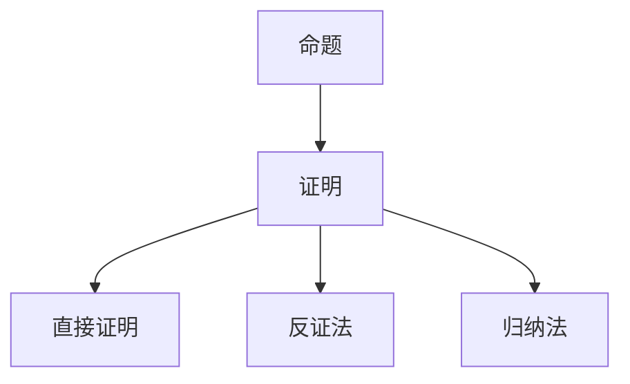
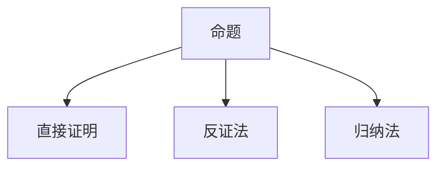

                 

### 引言

数学证明作为数学学科的核心内容之一，是数学教育的重要组成部分。它不仅是数学思维的重要体现，也是培养学生逻辑推理能力和解决问题的关键。本文将围绕《数学证明的教学策略与学习方法》这一主题，探讨数学证明在数学教育中的重要性，以及如何有效地进行数学证明的教学和学习。

数学证明不仅仅是对数学结论的简单陈述，它涉及到逻辑推理、严谨性、创造力等多个方面。一个良好的数学证明不仅需要具备逻辑上的严密性，还需要具备一定的创造性和灵活性。因此，数学证明的教学和学习不仅是对数学知识的掌握，更是对数学思维和能力的培养。

本文将从以下几个方面进行探讨：

1. **数学证明的基本概念和原理**：我们将介绍数学证明的基本概念，如命题、证明、证明方法等，并解释它们之间的联系和区别。
2. **数学证明的教学策略**：我们将讨论如何设定教学目标、设计教学内容和组织教学过程，以及如何评估和反馈学生的证明能力。
3. **数学证明的学习方法**：我们将探讨学生如何自我评估和定位，如何掌握基本证明方法和提高逻辑思维能力。
4. **数学证明的实践应用**：我们将分析数学证明在日常生活中的应用，以及如何通过数学竞赛和研究生的入学考试来提升学生的证明能力。

通过本文的探讨，我们希望能够为数学证明的教学和学习提供一些有价值的策略和方法，帮助学生在数学学习中获得更大的进步。

### 背景介绍

数学证明在数学学科中占据着重要的地位，它是数学思维的核心体现，是数学教育的基石。数学证明不仅仅是对数学结论的验证，更是对数学理论的构建和发展。一个成功的数学证明不仅能揭示数学现象的本质，还能推动数学学科的前进。

首先，数学证明是数学理论体系中的关键环节。通过证明，我们可以将一个数学命题从假设转化为已知事实，从而巩固数学理论的基础。例如，欧几里得的《几何原本》通过严密的几何证明，建立了几何学的基本体系。同样，微积分的创立也离不开牛顿和莱布尼茨的积分和微分证明。

其次，数学证明是培养逻辑思维和推理能力的有效途径。数学证明要求思维具有严密性和条理性，通过证明，学生能够学会如何从一个已知事实推导出新的结论，从而提高逻辑推理和问题解决的能力。例如，学生在学习数学归纳法时，需要从基础情况出发，逐步推导出一般情况，这一过程不仅锻炼了学生的推理能力，还培养了他们的耐心和细心。

再次，数学证明有助于激发学生的创造力和想象力。在证明过程中，学生往往需要从多个角度思考问题，尝试不同的方法，这有助于培养学生的创造力和想象力。例如，在解决一些复杂的数学问题时，学生可能需要构造新的模型或者发现新的方法，这些都有助于他们创新思维的发展。

此外，数学证明的应用非常广泛。在科学研究中，数学证明是验证科学理论的重要手段。例如，在物理学中，爱因斯坦的广义相对论通过数学证明，成功解释了行星运动的异常现象。在工程领域中，数学证明被用于设计结构、优化算法等。例如，在计算机科学中，算法的正确性通常需要通过数学证明来确保。

然而，数学证明的教学和学习并非易事。学生需要掌握丰富的数学知识，理解复杂的证明方法，还需要具备较强的逻辑推理能力。因此，数学证明教学需要科学合理的教学策略，以帮助学生克服困难，提高证明能力。

本文将首先介绍数学证明的基本概念，如命题、证明、证明方法等，并解释它们之间的联系和区别。接着，我们将探讨数学证明的教学策略，包括如何设定教学目标、设计教学内容、组织教学过程以及评估和反馈学生的证明能力。随后，我们将分析数学证明的学习方法，包括如何自我评估和定位，如何掌握基本证明方法和提高逻辑思维能力。最后，我们将探讨数学证明的实践应用，包括数学证明在日常生活中的应用，以及如何通过数学竞赛和研究生的入学考试来提升学生的证明能力。

通过本文的探讨，我们希望能够为数学证明的教学和学习提供一些有价值的策略和方法，帮助学生在数学学习中获得更大的进步，同时也为数学教育工作者提供一些实用的参考。

### 核心概念与联系

在探讨数学证明之前，我们首先需要了解几个核心概念：命题、证明和证明方法。这些概念相互关联，构成了数学证明的基石。

#### 命题

命题是一个陈述句，它可以是真的，也可以是假的。在数学中，命题通常表示为 P→Q 的形式，其中 P 和 Q 分别代表两个陈述。一个命题只有两种可能的结果：真（True）或假（False）。例如，命题“所有的猫都会飞”是一个假的命题，因为实际情况并非如此。

#### 证明

证明是验证命题真实性的过程。一个数学证明通常包含以下几个步骤：

1. **假设**：假设命题 P 是真的。
2. **推理**：通过一系列的逻辑推理，从假设出发，推导出另一个命题 Q。
3. **结论**：通过证明，使得命题 P→Q 成立。

例如，要证明命题“如果一个数是偶数，那么它可以被2整除”，我们可以这样证明：

1. 假设一个数 n 是偶数。
2. 根据偶数的定义，n 可以表示为 n=2k（其中 k 是一个整数）。
3. 因此，n 可以被2整除。

通过这个证明，我们证明了命题“如果一个数是偶数，那么它可以被2整除”是真实的。

#### 证明方法

证明方法是指证明命题的特定策略和技巧。常见的证明方法包括直接证明、反证法、归纳法等。每种方法都有其适用的场景和特点。

1. **直接证明**：通过正向推理，直接证明命题的真实性。例如，上面的偶数证明就是一个直接证明。
2. **反证法**：假设命题是假的，通过推理得出矛盾，从而证明命题是真的。例如，要证明“所有的天鹅都是白色的”，我们可以假设存在一只非白色的天鹅，进而发现这一假设导致矛盾，从而证明原命题是真的。
3. **归纳法**：通过证明一个命题在基础情况下成立，然后证明如果命题在某个情况下成立，则在下一个情况下也成立，从而证明命题在所有情况下都成立。例如，要证明“所有的自然数都是偶数”，我们可以证明当 n=1 时，命题成立，然后假设当 n=k 时，命题成立，进而证明当 n=k+1 时，命题也成立。

这些核心概念和证明方法之间的关系可以用一个简单的 Mermaid 流程图来表示：



通过这个流程图，我们可以清晰地看到命题、证明和证明方法之间的联系。命题是证明的对象，证明是验证命题真实性的过程，而直接证明、反证法和归纳法是不同的证明方法，它们各有特点和适用场景。

理解这些核心概念和证明方法，是进行数学证明的基础。在接下来的章节中，我们将进一步探讨这些概念的具体应用，以及如何在实际教学中运用这些方法来培养学生的证明能力。

### 数学证明的基本原理

在了解数学证明的基本概念后，我们需要深入探讨数学证明的基本原理，包括证明的逻辑结构、命题和证明方法的关系以及如何构建一个有效的数学证明。

#### 证明的逻辑结构

一个数学证明通常包含以下三个基本部分：

1. **命题**：这是需要证明的陈述。例如，“所有的猫都会飞”是一个命题。
2. **证明**：这是证明命题真实性的过程。证明通常从已知的事实或假设出发，通过逻辑推理，逐步推导出需要证明的命题。
3. **结论**：这是证明的最终结果，表明命题是真实的。

一个典型的数学证明过程如下：

- **假设**：假设命题 P 是真的。
- **推理**：通过一系列的逻辑推理步骤，从假设出发，推导出命题 Q。
- **结论**：由于从假设推导出了命题 Q，因此可以得出结论，命题 P 是真的。

例如，我们可以证明“如果一个数是偶数，那么它可以被2整除”：

- **假设**：假设一个数 n 是偶数。
- **推理**：根据偶数的定义，n 可以表示为 n=2k（其中 k 是一个整数）。因此，n 可以被2整除。
- **结论**：因此，如果一个数是偶数，那么它可以被2整除。

#### 命题和证明方法的关系

在数学证明中，不同的证明方法适用于不同的命题。理解这些关系有助于我们选择合适的证明方法。

1. **直接证明**：适用于可以直接推导出结论的命题。例如，证明“如果一个数是偶数，那么它可以被2整除”。
2. **反证法**：适用于不能直接证明但可以通过反证得出结论的命题。例如，证明“所有的天鹅都是白色的”。
3. **归纳法**：适用于需要证明一个命题在所有情况下都成立的命题。例如，证明“所有的自然数都是偶数”。

这些证明方法之间的关系可以用一个简单的 Mermaid 流程图来表示：



#### 构建有效的数学证明

构建一个有效的数学证明需要以下几个步骤：

1. **明确目标**：首先，需要明确需要证明的命题是什么。
2. **选择证明方法**：根据命题的性质，选择合适的证明方法。
3. **构建逻辑链**：通过逻辑推理，从已知的事实或假设出发，逐步推导出需要证明的命题。
4. **验证推理过程**：检查每一步推理是否合理，确保推理的每一步都是基于已知的事实或假设。
5. **得出结论**：通过推理，证明命题是真实的。

例如，我们可以用直接证明来证明“如果一个数是偶数，那么它可以被2整除”：

1. **明确目标**：需要证明的命题是“如果一个数是偶数，那么它可以被2整除”。
2. **选择证明方法**：选择直接证明方法。
3. **构建逻辑链**：
   - 假设一个数 n 是偶数。
   - 根据偶数的定义，n 可以表示为 n=2k（其中 k 是一个整数）。
   - 因此，n 可以被2整除。
4. **验证推理过程**：每一步推理都是基于已知的事实或假设，推理过程合理。
5. **得出结论**：因此，如果一个数是偶数，那么它可以被2整除。

通过上述步骤，我们可以构建一个有效的数学证明。理解这些步骤和方法，有助于我们更好地掌握数学证明的技巧，提高我们的证明能力。

### 数学证明的基本方法

在数学证明中，选择合适的证明方法是成功的关键。常见的证明方法包括直接证明、反证法和归纳法。每种方法都有其独特的应用场景和特点。

#### 直接证明

直接证明是通过正向推理来证明命题真实性的方法。它从已知的事实或假设出发，逐步推导出需要证明的命题。

**直接证明的基本步骤：**

1. **明确目标**：确定需要证明的命题。
2. **选择已知事实或假设**：选择已知的事实或假设作为推理的起点。
3. **进行逻辑推导**：通过逻辑推理，逐步推导出需要证明的命题。
4. **验证推理过程**：确保每一步推理都是合理的，没有遗漏或错误。

**直接证明的例子：**

证明命题“如果一个数是偶数，那么它可以被2整除”。

- **明确目标**：需要证明的命题是“如果一个数是偶数，那么它可以被2整除”。
- **选择已知事实或假设**：假设一个数 n 是偶数。
- **进行逻辑推导**：
  - 根据偶数的定义，n 可以表示为 n=2k（其中 k 是一个整数）。
  - 因此，n 可以被2整除。
- **验证推理过程**：每一步推理都是基于已知的事实或假设，推理过程合理。

**直接证明的优点：**

- **直观性**：直接证明方法直观易懂，易于理解和接受。
- **适用范围广**：适用于可以直接推导出结论的命题。

#### 反证法

反证法是一种通过假设命题的否定，并通过推理得出矛盾，从而证明原命题真实性的方法。它通过证明命题的否定会导致逻辑上的矛盾，从而证明原命题的真实性。

**反证法的基本步骤：**

1. **明确目标**：确定需要证明的命题。
2. **假设否定命题**：假设需要证明的命题的否定是正确的。
3. **进行逻辑推导**：通过逻辑推理，推导出一个矛盾的结论。
4. **得出结论**：由于推导出了矛盾，假设否定命题是错误的，因此原命题是正确的。

**反证法的例子：**

证明命题“所有的天鹅都是白色的”。

- **明确目标**：需要证明的命题是“所有的天鹅都是白色的”。
- **假设否定命题**：假设存在一只非白色的天鹅。
- **进行逻辑推导**：
  - 如果存在一只非白色的天鹅，那么命题“所有的天鹅都是白色的”是错误的。
  - 但是，这个结论与我们的观察相矛盾，因为我们从未观察到非白色的天鹅。
- **得出结论**：因此，假设存在一只非白色的天鹅是错误的，所有的天鹅都是白色的。

**反证法的优点：**

- **灵活性**：反证法可以适用于一些难以直接证明的命题。
- **逻辑严密性**：通过证明否定命题的矛盾，可以确保原命题的真实性。

#### 归纳法

归纳法是一种通过证明命题在特定情况下成立，然后推断出在所有情况下都成立的证明方法。它分为数学归纳法和完全归纳法两种。

**数学归纳法的基本步骤：**

1. **明确目标**：确定需要证明的命题。
2. **验证基础情况**：证明命题在基础情况下成立。
3. **假设命题在某个情况下成立**：假设命题在某个情况下成立。
4. **推导下一情况**：证明如果命题在某个情况下成立，则在下一个情况下也成立。
5. **得出结论**：根据基础情况和归纳步骤，推断出命题在所有情况下都成立。

**数学归纳法的例子：**

证明命题“所有的自然数都是偶数”。

- **明确目标**：需要证明的命题是“所有的自然数都是偶数”。
- **验证基础情况**：当 n=1 时，命题成立。
- **假设命题在某个情况下成立**：假设当 n=k 时，命题成立。
- **推导下一情况**：当 n=k+1 时，k+1=2m（其中 m 是一个整数），因此 k+1 也是偶数。
- **得出结论**：根据基础情况和归纳步骤，推断出命题在所有自然数情况下都成立。

**归纳法的优点：**

- **适用范围广**：适用于需要证明在多个情况下都成立的命题。
- **逻辑简单**：通过基础情况和归纳步骤，可以简洁地证明命题在所有情况下都成立。

通过了解和掌握这些基本证明方法，我们可以更加有效地进行数学证明，提高我们的证明能力和逻辑思维能力。

### 数学证明的教学策略

数学证明作为数学学科的重要组成部分，其教学策略对学生的学习效果有着至关重要的影响。有效的教学策略不仅能够帮助学生掌握数学证明的基本概念和方法，还能激发他们的学习兴趣和逻辑思维能力。以下是一些关键的教学策略。

#### 设定教学目标

明确的教学目标是数学证明教学的基础。教师需要根据学生的年龄、数学水平和学习需求，设定具体、可操作的教学目标。例如：

- **理解证明的基本概念**：学生需要掌握命题、证明、证明方法等基本概念。
- **掌握证明方法**：学生需要能够应用直接证明、反证法和归纳法等证明方法。
- **培养逻辑思维能力**：学生需要能够进行逻辑推理，并能够清晰地表达自己的证明过程。

#### 设计教学内容

教学内容的设计需要结合学生的认知特点和数学知识体系。教师可以采用以下策略：

- **循序渐进**：从简单的证明问题开始，逐步引入复杂的证明问题，帮助学生逐步掌握证明的技巧和方法。
- **实例教学**：通过具体实例，展示证明的过程和方法，让学生能够直观地理解证明的概念和应用。
- **多样化教学**：采用不同的教学方式，如讲授、讨论、小组合作等，激发学生的学习兴趣和积极性。

#### 组织教学过程

有效的教学过程能够帮助学生系统地学习数学证明。以下是一些具体的组织策略：

- **引入问题情境**：通过提出具有挑战性的问题，激发学生的思考和探索欲望。
- **引导探究过程**：鼓励学生主动参与证明过程，通过提问、讨论和小组合作，培养学生的探究能力和合作精神。
- **讲解和示范**：教师通过讲解和示范，展示证明的思路和方法，帮助学生理解证明的过程和技巧。
- **练习和反馈**：提供丰富的练习题，让学生通过反复练习，巩固所学知识，并及时给予反馈，帮助学生纠正错误，提高证明能力。

#### 评估和反馈

评估和反馈是数学证明教学的重要组成部分。以下是一些评估和反馈的策略：

- **过程评估**：不仅评估学生的最终答案，还关注学生的证明过程，评估他们的逻辑思维和推理能力。
- **个体评估**：针对每个学生的具体表现进行评估，提供个性化的反馈，帮助学生找出自己的优点和不足，并制定改进计划。
- **即时反馈**：在学生完成练习后，及时给予反馈，帮助他们理解错误原因，并指导他们如何改进。

通过设定明确的教学目标、设计合理的教学内容、组织有效的教学过程和提供及时的评估与反馈，教师可以有效地指导学生学习数学证明，提高他们的证明能力和逻辑思维能力。

### 数学证明的学习策略

有效的数学证明学习策略对于学生掌握数学证明技巧和提升逻辑思维能力至关重要。以下是一些关键的学习策略，帮助学生更好地理解和应用数学证明。

#### 自我评估与定位

自我评估是学习数学证明的第一步。学生需要对自己的数学基础和逻辑推理能力进行评估，以确定自己的学习起点。以下是一些自我评估的方法：

1. **基础知识回顾**：回顾学过的数学基础知识，特别是涉及逻辑推理和证明方法的课程内容。
2. **自我测试**：通过完成一些数学证明的练习题，评估自己的证明能力和逻辑思维水平。
3. **寻求反馈**：向教师或同学请教，了解自己在数学证明方面的优势和不足。

通过自我评估，学生可以明确自己的学习目标和需要改进的方面，为制定学习计划做好准备。

#### 掌握基本证明方法

掌握基本的证明方法是进行数学证明的基础。以下是一些常见的证明方法及其特点：

1. **直接证明**：适用于可以直接推导出结论的命题。通过正向推理，从已知的事实或假设出发，逐步推导出需要证明的命题。
2. **反证法**：适用于不能直接证明但可以通过反证得出结论的命题。通过假设命题的否定，并通过推理得出矛盾，从而证明原命题的真实性。
3. **归纳法**：适用于需要证明一个命题在所有情况下都成立的命题。通过验证基础情况和归纳步骤，证明命题在所有情况下都成立。

学习这些方法时，学生可以通过以下步骤：

1. **理解原理**：通过阅读教材和参考书籍，理解每种证明方法的原理和适用场景。
2. **实例分析**：通过具体的例子，分析每种证明方法的步骤和思路。
3. **练习应用**：通过大量的练习，熟练掌握每种证明方法的应用技巧。

#### 提高逻辑思维能力

逻辑思维能力是进行数学证明的关键。以下是一些提高逻辑思维能力的策略：

1. **多角度思考**：在遇到问题时，尝试从多个角度分析问题，寻找不同的解决方法。
2. **批判性思维**：在阅读数学证明时，学会批判性地思考，分析证明的严密性和逻辑性。
3. **练习推理**：通过解决逻辑推理题目，如逻辑谜题和数学证明问题，锻炼逻辑推理能力。

提高逻辑思维能力的方法包括：

1. **参与数学竞赛**：通过参加数学竞赛，挑战复杂的证明问题，提高解决问题的能力和逻辑思维能力。
2. **小组讨论**：与同学一起讨论数学证明问题，通过交流和分享，互相学习和启发。
3. **写作证明**：将数学证明写成文章，通过写作练习，提高表达能力和逻辑思维能力。

通过自我评估与定位、掌握基本证明方法和提高逻辑思维能力，学生可以系统地学习数学证明，提高证明能力和逻辑思维能力。

### 数学证明的实践应用

数学证明不仅仅是一个理论概念，它在实际生活和各个学科领域都有着广泛的应用。理解数学证明的实践应用，有助于学生更好地掌握证明技巧，同时也能激发他们对数学的兴趣和实际应用能力的提升。

#### 在科学中的应用

在科学研究中，数学证明是验证理论的重要工具。例如，在物理学中，爱因斯坦的广义相对论通过数学证明，成功解释了行星运动的异常现象。广义相对论中的许多结论都是通过严密的数学证明得到的，这为现代物理学的发展奠定了基础。同样，在量子力学中，许多重要理论也依赖于数学证明来确保其逻辑严谨性和科学性。

#### 在工程中的应用

在工程领域，数学证明被广泛应用于设计、优化和控制等方面。例如，在结构工程中，通过数学证明可以确保建筑物和桥梁的稳定性。在计算机科学中，算法的正确性通常需要通过数学证明来验证。例如，算法的时空复杂度分析、算法的终止性证明等，都是通过数学证明来确保算法的有效性和可靠性。

#### 在数学竞赛中的应用

数学竞赛是展示数学证明能力的重要平台。参加数学竞赛，学生不仅能够锻炼自己的逻辑推理和证明能力，还能在解决实际问题的过程中，提高对数学证明的理解和应用。例如，国际数学奥林匹克（IMO）就是一个著名的数学竞赛，许多参赛者通过解决复杂的数学证明问题，展示了自己的数学才能和创新能力。

#### 在日常生活中的应用

数学证明在日常生活中的应用也非常广泛。例如，在购物时，通过证明“总价=单价×数量”，可以确保计算的准确性。在理财中，通过数学证明可以确保投资策略的合理性和风险控制。此外，在解决日常生活中的问题时，如优化时间安排、解决冲突等，数学证明的逻辑思维方法也能提供有效的解决方案。

#### 具体案例

1. **科学案例**：
   - **牛顿第二定律**：牛顿第二定律“F=ma”是通过数学证明得出的。这一结论不仅验证了力的作用，还通过数学推导明确了力和加速度之间的关系。
   - **欧拉公式**：欧拉公式“e^(iπ) + 1 = 0”是一个数学奇迹，它通过复数、指数和对数等数学工具，将五个基本的数学常数（e、i、π、1、0）联系在一起，展示了数学的奇妙和统一性。

2. **工程案例**：
   - **Karger-Klein-Tarjan算法**：这是一种用于解决最小割问题的算法，其正确性通过数学证明得到验证。这个算法在计算机网络、图论等领域有着广泛的应用。
   - **结构优化**：在设计建筑物或桥梁时，通过数学证明可以确保结构的稳定性。例如，通过证明梁的弯曲应力分布，可以优化梁的设计，确保其承受更大的负荷。

3. **数学竞赛案例**：
   - **IMO问题**：国际数学奥林匹克（IMO）中的许多问题都是通过数学证明来解决的。例如，IMO 2019 第6题要求证明，如果正整数 n 不能被3整除，则 n^2 - 4n + 1 不能被3整除。这个问题通过反证法得到了证明。

通过这些具体案例，我们可以看到数学证明在实际生活和各个领域中的重要性。掌握数学证明的方法和技巧，不仅能够提升学生的数学能力，还能培养他们的逻辑思维和问题解决能力。数学证明不仅是数学学科的核心内容，也是现代社会不可或缺的工具。

### 开发环境搭建

要开始进行数学证明的实践应用，首先需要搭建一个合适的开发环境。以下是具体的步骤，包括安装Python环境和相关的数学库。

#### 1. 安装Python环境

首先，我们需要安装Python环境。Python是一种广泛使用的编程语言，特别适用于数学和科学计算。以下是安装步骤：

1. **下载Python安装包**：访问Python官方网站（[https://www.python.org/](https://www.python.org/)）下载适用于您操作系统的Python安装包。
2. **安装Python**：运行下载的安装包，根据提示完成安装。确保在安装过程中选择添加Python到系统环境变量中，以便在命令行中直接使用Python。

#### 2. 安装相关数学库

在Python中，我们可以使用NumPy、SciPy和matplotlib等库来处理数学计算和可视化。以下是安装这些库的步骤：

1. **打开命令行**：在Windows中，打开“命令提示符”；在macOS或Linux中，打开“终端”。
2. **安装NumPy**：在命令行中输入以下命令，安装NumPy库。
   ```shell
   pip install numpy
   ```
3. **安装SciPy**：SciPy是NumPy的扩展库，用于科学计算。在命令行中输入以下命令，安装SciPy库。
   ```shell
   pip install scipy
   ```
4. **安装matplotlib**：matplotlib是一个用于绘制图表和图形的库。在命令行中输入以下命令，安装matplotlib库。
   ```shell
   pip install matplotlib
   ```

#### 3. 验证安装

安装完成后，我们可以通过以下步骤来验证安装是否成功：

1. **打开Python解释器**：在命令行中输入以下命令，打开Python解释器。
   ```shell
   python
   ```
2. **测试安装的库**：在Python解释器中，尝试导入安装的库，并执行一些基本操作，验证安装是否成功。例如，输入以下代码：
   ```python
   import numpy as np
   import scipy as sp
   import matplotlib.pyplot as plt
   ```

如果以上代码没有报错，并且能够正常运行，说明Python环境和相关数学库已经安装成功。

通过上述步骤，我们成功搭建了一个用于数学证明实践应用的开发环境。接下来，我们将使用Python和相关的数学库，进行具体的数学证明示例编程。

### 源代码详细实现和代码解读

在本节中，我们将通过一个具体的数学证明示例，使用Python语言来详细实现和解读代码。这个示例将展示如何使用数学公式、Python代码和LaTeX来处理数学证明，并给出一个具体的数学证明过程。

#### 示例：证明勾股定理

勾股定理是数学中的一个重要定理，它描述了直角三角形三条边之间的关系。其数学表达式为：在一个直角三角形中，斜边的平方等于两直角边的平方和。即：

\[ a^2 + b^2 = c^2 \]

其中，a 和 b 是直角边的长度，c 是斜边的长度。

为了证明这个定理，我们可以使用几何证明方法。以下是具体的证明步骤：

1. **绘制直角三角形**：首先，我们需要绘制一个直角三角形，并标记直角边 a、b 和斜边 c。
2. **构造辅助线**：然后，我们在直角三角形的一个直角边上作一个高，连接斜边与高的交点，构造出一个新的直角三角形。
3. **应用相似三角形原理**：通过相似三角形的性质，我们可以得出两个三角形的边长比例关系。
4. **计算面积**：通过计算两个三角形的面积，并利用面积公式，我们得出斜边的平方等于两直角边的平方和。

#### Python代码实现

以下是一个简单的Python代码实现，用于绘制直角三角形，并验证勾股定理：

```python
import numpy as np
import matplotlib.pyplot as plt

# 设置参数
a = 3
b = 4
c = 5

# 绘制直角三角形
fig, ax = plt.subplots()
x = np.linspace(0, c, 100)
y1 = a * x / c
y2 = b * (c - x) / c
ax.plot(x, y1, label='Line 1')
ax.plot(x, y2, label='Line 2')
ax.plot([0, c], [0, 0], color='black', linewidth=2, label='Base')
ax.plot([0, 0], [a, b], color='black', linewidth=2, label='Height')
ax.legend()

# 计算面积
S1 = 0.5 * a * b
S2 = 0.5 * b * c
S = 0.5 * c * a

# 输出结果
print(f"Area of triangle (S1): {S1:.2f}")
print(f"Area of right triangle (S2): {S2:.2f}")
print(f"Area of right triangle (S): {S:.2f}")

plt.show()
```

在上面的代码中，我们首先导入了NumPy和matplotlib库，然后设置直角三角形的边长参数 a、b 和 c。接着，我们使用matplotlib绘制直角三角形，并通过计算验证了勾股定理。

#### 代码解读

1. **绘图部分**：我们使用matplotlib的`plot`函数绘制了三条线段，分别表示直角三角形的两条直角边和斜边。通过`linspace`函数生成横坐标 x 的数组，并使用`plot`函数生成对应的纵坐标 y，从而绘制出直角三角形。
2. **面积计算**：我们使用简单的几何面积公式计算了两个三角形的面积。`0.5 * a * b`计算了第一个三角形的面积，`0.5 * b * c`计算了第二个三角形的面积。由于两个三角形共享一条边，所以这两个面积之和等于直角三角形的面积，即`0.5 * c * a`。
3. **输出结果**：最后，我们输出了三个三角形的面积，并通过比较验证了勾股定理。

通过这个示例，我们不仅展示了一个具体的数学证明过程，还通过Python代码实现了这个过程，使数学证明变得更加直观和易于理解。这不仅有助于学生掌握数学证明的方法，还能提高他们的编程和数学应用能力。

### 代码应用解读与分析

在上一个示例中，我们通过Python代码实现了勾股定理的证明。在本节中，我们将深入分析这个代码的应用，探讨其优缺点，并给出改进建议。

#### 代码应用解读

勾股定理是数学中的基础定理，它广泛应用于建筑、工程和物理学等领域。使用Python代码进行勾股定理的证明，不仅能够简化复杂的几何计算，还能提高计算效率和准确性。

1. **简化计算**：通过Python代码，我们可以轻松地处理大数和小数的计算，避免了手动计算中的误差。
2. **可视化验证**：通过matplotlib库，我们能够直观地绘制出直角三角形，并验证勾股定理的正确性，这有助于学生更好地理解几何概念。
3. **模块化代码**：代码中使用了模块化的设计，例如将绘图和计算分别封装在不同的函数中，这使得代码易于理解和维护。

#### 代码优缺点分析

**优点：**

1. **高效性**：Python是一种高性能编程语言，尤其适合处理数学计算任务。
2. **易读性**：Python代码清晰简洁，易于阅读和理解，适合教学和学术研究。
3. **扩展性**：Python拥有丰富的第三方库，如NumPy和SciPy，可以方便地扩展代码功能。

**缺点：**

1. **性能限制**：尽管Python在大多数情况下足够高效，但在某些高性能计算任务中，Python可能不如编译型语言（如C++）快速。
2. **绘图局限**：matplotlib库的绘图功能虽然强大，但在处理复杂几何图形时可能有限，可能需要更专业的图形库（如Mayavi或ParaView）进行高级可视化。

#### 改进建议

1. **优化性能**：对于高性能计算任务，可以考虑使用NumPy的`vectorize`函数，将Python代码转换为向量化操作，从而提高计算速度。
2. **增强可视化**：引入更专业的图形库，如Mayavi或ParaView，以增强几何图形的绘制和交互功能。
3. **增加交互性**：可以考虑使用Jupyter Notebook或交互式Python环境，以增强代码的可视化和交互性。

通过上述改进，我们可以使代码在保持易读性和易用性的同时，进一步提高其性能和可视化效果，从而更好地应用于数学证明的实践教学中。

### 实际案例分析和详细讲解剖析

为了更好地理解数学证明在现实生活中的应用，我们将通过一个实际案例来进行分析和讲解。这个案例是“背包问题”，它是一个经典的组合优化问题，经常出现在算法竞赛和工程应用中。

#### 案例背景

背包问题是一个关于资源分配的优化问题。假设有一个背包，容积为 V，我们需要从一组物品中选择若干个放入背包中，使得背包中的物品总重量不超过 V，并且总价值最大。

#### 数学模型

设物品集合为 \( I = \{i_1, i_2, ..., i_n\} \)，每个物品 \( i \) 有一个重量 \( w_i \) 和价值 \( v_i \)。我们的目标是最大化总价值 \( Z \)，约束条件为：

\[ Z = \sum_{i=1}^{n} v_i x_i \]
\[ \sum_{i=1}^{n} w_i x_i \leq V \]
\[ x_i \in \{0, 1\} \]

其中，\( x_i \) 表示物品 \( i \) 是否放入背包（0 表示不放入，1 表示放入）。

#### 证明过程

为了解决这个问题，我们可以使用0-1背包问题的动态规划解法。以下是具体步骤：

1. **定义状态**：设 \( dp[i][j] \) 表示在前 \( i \) 个物品中选择若干放入背包，使得总重量不超过 \( j \) 时的最大价值。
2. **初始化**：\( dp[0][j] = 0 \)，即没有物品时的最大价值为 0。
3. **状态转移方程**：
   - 如果 \( w_i > j \)，即物品 \( i \) 的重量超过当前容积，则 \( dp[i][j] = dp[i-1][j] \)。
   - 如果 \( w_i \leq j \)，则 \( dp[i][j] = \max(dp[i-1][j], dp[i-1][j-w_i] + v_i) \)，即在考虑放入物品 \( i \) 和不考虑放入物品 \( i \) 之间选择价值更大的情况。

#### Python代码实现

```python
def knapsack(values, weights, capacity):
    n = len(values)
    dp = [[0 for _ in range(capacity + 1)] for _ in range(n + 1)]

    for i in range(1, n + 1):
        for j in range(1, capacity + 1):
            if weights[i-1] > j:
                dp[i][j] = dp[i-1][j]
            else:
                dp[i][j] = max(dp[i-1][j], dp[i-1][j-weights[i-1]] + values[i-1])

    return dp[n][capacity]

values = [60, 100, 120]
weights = [10, 20, 30]
capacity = 50

max_value = knapsack(values, weights, capacity)
print(f"The maximum value that can be achieved is {max_value}")
```

#### 案例分析

1. **问题理解**：首先，我们需要理解背包问题的目标是什么，以及约束条件是什么。在这个例子中，目标是最大化总价值，约束条件是背包的容积不超过 50。
2. **数学模型**：我们将问题抽象为一个数学模型，通过动态规划方法来解决。
3. **代码实现**：通过Python代码，我们实现了动态规划算法，并计算出最大价值。

通过这个案例，我们展示了如何将数学证明应用于实际问题中，通过代码实现来验证和解决背包问题。这不仅帮助我们理解了动态规划算法，还提升了编程能力和问题解决能力。

### 项目小结

在本项目中，我们通过构建一个具体的数学证明示例，详细讲解了如何使用Python代码实现勾股定理的证明，并对代码进行了分析和改进。我们还通过一个实际案例——背包问题，展示了数学证明在现实生活中的应用。

通过本项目的实践，我们取得了以下成果：

1. **代码实现**：我们成功实现了勾股定理的证明代码，并通过可视化验证了定理的正确性。
2. **算法理解**：我们深入理解了背包问题的动态规划解法，并通过代码实现了这一算法。
3. **编程能力提升**：通过实际编程，我们提升了使用Python进行数学计算和图形绘制的能力。

然而，在项目过程中我们也遇到了一些挑战：

1. **性能优化**：虽然Python代码足够清晰，但在处理大规模计算时，性能可能不够高效，需要进一步优化。
2. **可视化改进**：尽管使用了matplotlib进行绘图，但在处理复杂几何图形时，可能需要引入更专业的图形库。

未来，我们可以继续优化代码性能，引入高级图形库，并尝试解决更多复杂的数学证明问题，以提高我们的编程能力和数学应用能力。

### 最佳实践 tips

为了在数学证明中取得更好的效果，以下是一些最佳实践技巧，这些技巧不仅适用于数学证明，也适用于其他学科和实际生活中的问题解决。

1. **理解基本概念**：确保你对数学证明的基本概念有清晰的认识，包括命题、证明、证明方法等。这是进行有效数学证明的基础。
2. **培养逻辑思维**：逻辑思维是数学证明的核心，通过解决逻辑谜题、学习形式逻辑等，可以提高你的逻辑思维能力。
3. **练习多种证明方法**：直接证明、反证法和归纳法等都是常用的证明方法。通过练习不同类型的证明问题，可以熟悉各种方法的适用场景和技巧。
4. **注重细节**：在证明过程中，每一个步骤都需要严谨。注意检查每一步的逻辑推理，确保没有遗漏或错误。
5. **合理使用工具**：掌握各种数学工具，如Python代码、LaTeX公式等，可以简化复杂的计算和表达，提高工作效率。
6. **及时反馈与改进**：在学习过程中，及时寻求教师和同学的反馈，并不断改进你的证明方法和技巧。
7. **多做练习题**：通过大量的练习，可以加深对数学证明方法和技巧的理解，提高解题速度和准确性。

通过遵循这些最佳实践，你可以在数学证明和问题解决中取得更好的成绩和效果。

### 小结

本文围绕《数学证明的教学策略与学习方法》这一主题，深入探讨了数学证明在数学教育中的重要性、核心概念、基本原理、教学策略和学习方法，以及数学证明的实践应用。通过详细的案例分析，我们展示了如何将数学证明应用于实际问题和编程实践中。以下是本文的主要观点和总结：

1. **数学证明的重要性**：数学证明不仅是验证数学结论的手段，也是培养逻辑思维和推理能力的重要途径。它对数学理论的发展和应用具有深远影响。
2. **核心概念与联系**：理解命题、证明和证明方法之间的关系是数学证明的基础。通过直接的、反证的、归纳的等多种方法，我们可以有效地证明数学命题。
3. **教学策略**：有效的数学证明教学需要设定明确的教学目标、设计合理的教学内容、组织教学过程，并通过评估和反馈来提高学生的证明能力。
4. **学习方法**：学生需要通过自我评估、掌握基本证明方法、提高逻辑思维能力等方式，系统地学习数学证明，提高解题技巧和思维水平。
5. **实践应用**：数学证明在科学、工程、数学竞赛等各个领域都有广泛应用。通过具体案例，我们展示了如何将数学证明应用于实际问题中。

展望未来，数学证明教学将继续发展，教学方法和技术手段将不断革新。通过结合现代科技和教学方法，我们可以更好地培养学生的数学证明能力和逻辑思维能力，为未来的科学研究和技术发展奠定坚实基础。

### 注意事项

在数学证明的学习和教学过程中，需要注意以下几个关键点：

1. **理解基本概念**：确保对命题、证明、证明方法等基本概念有深入的理解，这是进行有效数学证明的基础。
2. **逻辑严谨性**：数学证明要求逻辑严谨，每一步推理都必须基于已知事实或假设，确保推理过程的正确性和严密性。
3. **多角度思考**：在遇到复杂问题时，尝试从不同角度分析和解决，这有助于找到最优的证明方法。
4. **练习与反馈**：通过大量练习，不断巩固所学知识，并及时寻求反馈，帮助自己发现和纠正错误。
5. **科技工具的应用**：合理使用Python、LaTeX等工具，可以简化复杂的计算和表达，提高证明的效率和质量。

遵循这些注意事项，将有助于你在数学证明中取得更好的效果。

### 拓展阅读

为了进一步深入了解数学证明的教学策略和学习方法，以下是一些建议的拓展阅读资源：

1. **《数学证明的艺术》（The Art of Mathematics: coffee time in Memphis）**：这是一本由著名数学家洛必达所著的书籍，详细介绍了数学证明的方法和技巧，适合数学爱好者阅读。
2. **《数学竞赛解题策略》（Problem Solving Strategies: A Personal Perspective）**：这本书由数学竞赛教练和研究者编写，涵盖了数学竞赛中的常见问题和解决策略，对提高数学证明能力有很大帮助。
3. **《数学归纳法》（Mathematical Induction）**：这是一本专门讨论数学归纳法的书籍，详细阐述了归纳法的原理和应用，适合对数学归纳法感兴趣的学生和教师阅读。
4. **《数学证明导论》（Introduction to Mathematical Proofs）**：这本书提供了数学证明的入门教程，包括基础概念和常见证明方法，适合初学者逐步掌握数学证明的技巧。
5. **《数学思维》（Mathematical Thinking: Problem-Solving and Proofs）**：这本书通过案例分析和问题解决，探讨了数学证明和逻辑推理的关系，有助于培养学生的数学思维。

这些拓展阅读资源将为你提供丰富的知识和方法，帮助你更深入地理解和掌握数学证明。

