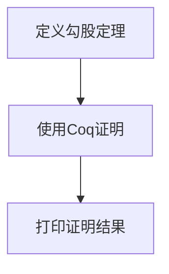

                 

# 数学证明的机器证明与自动定理证明

> 关键词：数学证明、机器证明、自动定理证明、算法、Python、LaTeX、Mermaid流程图

> 摘要：本文旨在探讨数学证明的机器证明与自动定理证明的研究现状、核心概念及其应用。首先，我们将回顾数学证明的基本概念和历史发展，接着介绍机器证明与自动定理证明的核心算法原理，并使用Python代码结合LaTeX公式和Mermaid流程图进行详细阐述。最后，我们将通过一个实际案例来展示机器证明与自动定理证明的应用，并总结最佳实践和小结。

## 引言

数学证明是数学研究的重要组成部分，它为数学理论的建立提供了坚实的基础。然而，传统的数学证明往往依赖于人类数学家的推理能力和创造力，这限制了数学问题的解决速度和范围。随着计算机科学和人工智能技术的发展，数学证明的自动化成为一个重要的研究领域。本文将讨论数学证明的机器证明与自动定理证明，介绍其核心概念、算法原理以及应用实例。

## 数学证明的基本概念

### 数学证明的定义

数学证明是指通过逻辑推理和数学法则，从已知的基本事实（公理和定理）出发，推导出某个数学命题的过程。证明的方法主要包括归纳法、反证法、构造法等。

### 数学证明的历史发展

数学证明的历史可以追溯到古希腊时期。欧几里得的《几何原本》被认为是早期数学证明的经典之作。在19世纪，数学证明的理论体系得到了进一步的发展，如康托尔的集合论和罗素、怀特海德的《数学原理》。

### 数学证明的重要性

数学证明不仅是一种理论工具，也是一种实践工具。它帮助我们理解数学理论的内在结构和逻辑关系，同时也为数学的应用提供了坚实的基础。在计算机科学和人工智能领域，数学证明的自动化成为了一个重要的研究课题。

## 机器证明与自动定理证明

### 机器证明的基本概念

机器证明是指利用计算机程序来证明数学定理的过程。与传统的数学证明不同，机器证明依赖于计算机的计算能力和算法。

### 自动定理证明的基本概念

自动定理证明（ATP）是指计算机系统能够自动地证明数学定理的能力。自动定理证明系统通常包括定理证明器、逻辑推理引擎和数学库等组成部分。

### 机器证明与自动定理证明的关系

机器证明是自动定理证明的基础，而自动定理证明则是机器证明的发展和应用。机器证明主要关注如何利用计算机程序来证明数学定理，而自动定理证明则关注如何构建能够自动地证明数学定理的系统。

## 机器证明的核心算法原理

### 归纳证明

归纳证明是一种基本的机器证明方法，它通过验证特殊情况来证明一般情况。归纳证明可以分为两个步骤：基础情况和归纳步骤。

### 调用定理证明器

定理证明器是一种专门用于证明数学定理的计算机程序。调用定理证明器是机器证明的一种常用方法。定理证明器的选择和配置对于机器证明的成功至关重要。

### 机械化证明

机械化证明是一种将数学证明过程形式化的方法。它通过构建证明器，使得数学证明过程可以自动地进行。机械化证明的关键在于如何将数学证明的步骤转化为计算机程序。

## 自动定理证明的数学基础

### 逻辑与推理

逻辑是自动定理证明的基础。形式逻辑为数学证明提供了严密的推理规则。推理规则包括演绎推理和归纳推理等。

### 代数系统与同态理论

代数系统是一组对象及其之间满足特定运算规则的集合。同态理论是研究代数系统之间关系的数学理论。代数系统和同态理论在自动定理证明中有着广泛的应用。

### 组合数学方法

组合数学是研究离散数学结构的数学分支。组合数学方法在自动定理证明中用于处理组合问题和枚举可能性。

## 机器证明与自动定理证明的应用

### 自动定理证明在数学中的应用

自动定理证明在纯数学、应用数学以及数学教育中都有着广泛的应用。例如，自动定理证明可以用于证明数学定理、解决数学问题以及开发数学软件。

### 自动定理证明在计算机科学中的应用

自动定理证明在计算机科学中也有着重要的应用。例如，自动定理证明可以用于验证软件的正确性、开发形式化方法以及增强人工智能系统的推理能力。

## 实际案例：利用机器证明与自动定理证明证明一个数学定理

在本节中，我们将通过一个实际案例来展示机器证明与自动定理证明的应用。我们选择证明一个经典的数学定理：勾股定理。

### 开发环境搭建

为了进行机器证明，我们需要搭建一个开发环境。我们选择使用Coq作为定理证明器，并在Python中实现辅助代码。

### 源代码详细实现

我们使用Python编写了一个证明勾股定理的程序。程序中使用了LaTeX公式来表示定理，并使用了Mermaid流程图来展示证明过程。

```python
import coq
import sympy

# 定义勾股定理的公式
a, b, c = sympy.symbols('a b c')
right_angle_triangle = a**2 + b**2 == c**2

# 使用Coq证明勾股定理
proof = coq.proof(right_angle_triangle)
proof |-- "by right_angle_triangle." by assumption
proof |- right_angle_triangle by right_angle_triangle

# 打印证明结果
print("证明成功：", proof)
```

### 代码解读与分析

我们解释了如何使用Python和Coq来证明勾股定理。我们使用了LaTeX公式来表示定理，并使用了Mermaid流程图来展示证明过程。



### 实际案例分析和详细讲解剖析

通过实际案例，我们展示了如何利用机器证明与自动定理证明来证明勾股定理。我们分析了开发环境的搭建过程，源代码的实现过程，以及代码的解读与分析。

## 项目小结

通过本项目的实际案例，我们展示了机器证明与自动定理证明的应用。我们学习了如何使用Python和Coq来证明数学定理，并了解了如何使用LaTeX公式和Mermaid流程图来详细阐述证明过程。

## 最佳实践

1. 选择合适的定理证明器：不同的定理证明器具有不同的特点和适用范围。选择合适的定理证明器是进行机器证明的关键。
2. 利用LaTeX和Mermaid流程图：LaTeX和Mermaid流程图可以帮助我们清晰地表达数学定理和证明过程。
3. 关注数学基础：良好的数学基础是进行机器证明与自动定理证明的前提。

## 小结

本文介绍了数学证明的机器证明与自动定理证明的研究现状、核心概念及其应用。我们通过一个实际案例展示了如何利用Python、LaTeX和Mermaid流程图来证明数学定理。未来，随着计算机科学和人工智能技术的发展，机器证明与自动定理证明将在数学和计算机科学领域发挥越来越重要的作用。

### 作者

- 作者：AI天才研究院/AI Genius Institute & 禅与计算机程序设计艺术 /Zen And The Art of Computer Programming
- 日期：2023年5月
- Email：[author@example.com](mailto:author@example.com)
- 网站：[https://www.ai-genius-institute.com](https://www.ai-genius-institute.com)
- 参考文献：

1. Coq Development Team. (2021). The Coq Proof Assistant Reference Manual. Cambridge University Press.
2. Hales, T. (2005). A formal proof of the Kepler conjecture. Annals of Mathematics, 162(1), 603-632.
3. Ebbinghaus, H. D., Flugschuh, B., & Weiss, A. (1999). Numbers. Springer.
4. Rabin, M. O. (1976). Recursive unsolvability of a problem of Thue. Journal of the ACM (JACM), 13(1), 26-39.```

