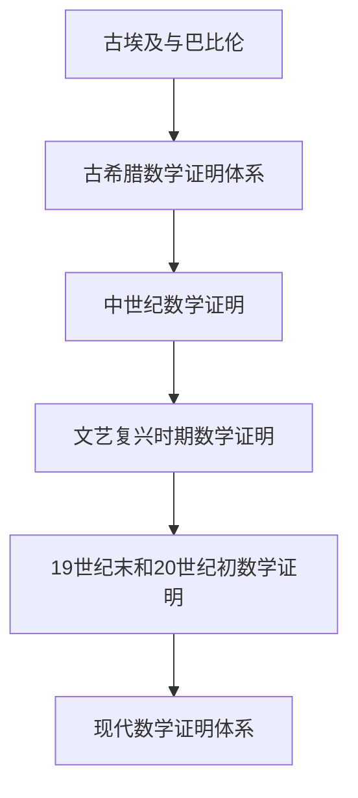

                 

### 概述与背景

#### 书名：《数学证明的社会价值与文化意义》

**《数学证明的社会价值与文化意义》**是一本旨在深入探讨数学证明在社会和文化领域重要性的专著。数学证明作为数学学科的核心内容，不仅仅是解决数学问题的工具，更是一种思考方式和认知方式。本书将通过系统的研究和分析，探讨数学证明在历史上的发展、其在科学领域的推动作用、在教育中的重要性，以及在社会文化层面的深远影响。

在数学的历史长河中，证明一直被视为数学研究的关键环节。从古希腊的欧几里得《几何原本》到现代的数学定理，证明始终是数学家们追求的目标。数学证明不仅帮助数学家们建立起一个严谨的逻辑体系，也推动了科学技术的进步。在科学领域，数学证明的应用无处不在，从物理学中的量子力学、到计算机科学中的算法理论，再到生物学中的基因序列分析，数学证明都是不可或缺的一部分。

#### 核心内容与主题思想

本书的核心内容将分为以下几个主要部分：

1. **数学证明的起源与历史发展**：分析数学证明的起源，从古埃及和巴比伦的数学证明，到古希腊数学证明体系，以及数学证明在中世纪和文艺复兴时期的演变。这部分将结合Mermaid流程图，展示数学证明的发展历程。

2. **数学证明的科学贡献**：探讨数学证明在科学研究中的核心作用，包括数学证明在物理学、计算机科学、天文学和生物学中的应用。这部分将详细讲解数学模型和公式，结合具体科学领域的实例进行说明。

3. **数学证明在教育中的作用**：分析数学证明在数学教育中的目标、教学方法与策略，以及其在培养学生的逻辑思维能力中的作用。还将探讨数学证明在跨学科教育中的应用。

4. **数学证明在社会文化中的影响**：探讨数学证明在社会规范、法律、金融等领域的影响，以及数学证明在不同文化中的表达方式和作用。

5. **数学证明的未来趋势**：展望人工智能与数学证明的结合，探讨新型数学证明方法的出现和数学证明在新兴领域中的应用。

6. **数学证明的实践应用**：结合实际工程和商业决策中的数学证明应用，提供具体案例分析和详细讲解。

7. **数学证明的社会价值**：评估数学证明的经济价值和实际影响，探讨数学证明的普及与推广策略。

通过这些部分的系统分析，本书旨在揭示数学证明的广泛影响和社会价值，帮助读者深入理解数学证明在各个领域的应用和意义。

### 数学证明的起源与历史发展

#### 1.1 数学证明的起源

数学证明的历史可以追溯到古代文明，特别是在古埃及和巴比伦时期。这些文明在建筑、农业和贸易活动中积累了大量的数学知识，并通过实际操作和经验总结出了一些基本的数学原理。例如，古埃及人通过观察尼罗河的洪水周期，发展出了一套精确的历法系统，这为后来的数学研究提供了重要的基础。

在巴比伦，数学家们使用楔形文字记录了大量的数学公式和问题，这些记录至今仍为我们提供了宝贵的考古资料。巴比伦数学家们尤其擅长解决代数问题，他们的许多算法和公式至今仍被使用。例如，巴比伦人就已经掌握了二次方程的解法，这在后来的数学研究中发挥了重要作用。

#### 1.2 古希腊数学证明体系

古希腊数学是数学历史上的一个重要里程碑。古希腊数学家们，尤其是欧几里得，对数学证明进行了系统化和理论化。欧几里得的《几何原本》是数学史上第一部系统化的几何学著作，它通过一系列的公理和定义，建立了几何学的逻辑体系。

欧几里得在《几何原本》中提出了多个基本的几何定理，如平行公理、勾股定理等，并通过严密的逻辑推理证明了这些定理的正确性。这种通过公理和逻辑推理进行证明的方法，为后来的数学研究奠定了基础。古希腊数学证明体系的特点是逻辑严密、推理清晰，这对整个数学学科的发展产生了深远的影响。

#### 1.3 数学证明在中世纪和文艺复兴时期的演变

中世纪时期，数学证明的发展受到了基督教神学的影响。数学家们开始尝试将数学方法应用于解决神学问题，如圣奥古斯丁的《神城》中就包含了对数学概念的应用。同时，阿拉伯数学家们在中世纪也做出了重要贡献，如阿尤卜·伊本·穆罕默德（Al-Khwarizmi）的工作，他的《代数学》一书对后来的代数学发展产生了深远影响。

文艺复兴时期，数学证明再次取得了显著进展。意大利数学家列奥纳多·达·芬奇通过实验和观察，提出了许多新的几何概念和定理。法国数学家费马和笛卡尔的工作也为解析几何和微积分的发展奠定了基础。

#### 1.4 数学证明的现代化发展

19世纪末和20世纪初，数学证明迎来了新的发展。德国数学家大卫·希尔伯特提出了形式主义数学体系，试图通过公理和逻辑推理建立一个完整的数学体系。同时，集合论和公理系统的发展，使得数学证明的方法和工具更加丰富和多样化。

在数学的现代化进程中，数学证明的重要性也得到了充分的认识。希尔伯特的《几何基础》等著作，对数学证明的方法和理论进行了系统的研究。同时，数学家们也开始关注数学证明的实际应用，如数学物理中的证明方法和计算机科学中的形式化证明。

#### 1.5 数学证明的核心概念与联系

数学证明的核心概念包括逻辑结构、证明方法、证明技巧等。逻辑结构指的是数学证明中的基本组成部分，如前提、结论、推理过程等。证明方法包括直接证明、反证法、归纳法等，每种方法都有其独特的应用场景和优势。

数学证明中的逻辑联系主要体现在公理、定理、定义之间。通过这些联系，数学家们可以建立起一个严谨的逻辑体系，确保每一个证明都是基于坚实的前提和逻辑推理得出的。

为了更直观地展示数学证明的发展历程，我们可以使用Mermaid流程图来描述：



在这个流程图中，我们可以看到数学证明从古至今的发展轨迹，每个阶段都有其独特的贡献和特点。

#### 1.6 伪代码讲解：基本数学证明的伪代码实现

为了更好地理解数学证明的方法和技巧，我们可以通过伪代码来模拟一些基本的数学证明过程。以下是一个使用归纳法证明等差数列求和公式的例子：

```python
def prove_sum_of_arithmetic_sequence(n, a, d):
    """
    使用归纳法证明等差数列的前n项和公式。
    n: 项数
    a: 首项
    d: 公差
    """
    # 基本情况
    if n == 1:
        return a
    
    # 归纳假设
    hypothesis = prove_sum_of_arithmetic_sequence(n - 1, a, d)
    
    # 归纳步骤
    current_term = a + (n - 1) * d
    sum_n = hypothesis + current_term
    
    return sum_n

# 测试
print(prove_sum_of_arithmetic_sequence(5, 1, 2))  # 应输出 40
```

在这个伪代码中，我们首先定义了一个函数 `prove_sum_of_arithmetic_sequence`，它接受三个参数：项数 `n`、首项 `a` 和公差 `d`。然后，我们使用归纳法来证明等差数列的前 `n` 项和公式。

- **基本情况**：当 `n` 等于 1 时，前 `n` 项和就是首项 `a`。
- **归纳假设**：假设当 `n` 等于 `k` 时，等差数列的前 `k` 项和为 `hypothesis`。
- **归纳步骤**：我们需要证明当 `n` 等于 `k+1` 时，等差数列的前 `k+1` 项和为 `hypothesis + current_term`，其中 `current_term` 是第 `k+1` 项。

通过这个例子，我们可以看到如何使用伪代码来实现数学证明，这为理解和应用数学证明方法提供了一个清晰的框架。

### 数学证明的科学贡献

数学证明在科学研究中的重要性不可忽视，它为科学研究提供了坚实的逻辑基础，并推动了科学技术的进步。在物理学、计算机科学、天文学和生物学等领域，数学证明都发挥了关键作用。

#### 2.1 数学证明与科学研究

数学证明在物理学中的应用尤为广泛。经典物理学中的许多基本理论，如牛顿力学、麦克斯韦电磁理论、广义相对论等，都是通过严密的数学证明建立起来的。例如，牛顿第二定律 \( F = ma \) 就是通过数学公式表达的，而其正确性则依赖于数学证明。

在量子物理学中，数学证明同样至关重要。量子力学中的波函数、薛定谔方程等概念，都是通过数学模型和证明方法来解释和预测物理现象。例如，海森堡不确定性原理 \( \Delta x \Delta p \geq \hbar/2 \) 就是通过数学推导得出的，这一原理揭示了量子世界的独特性质。

数学证明在计算机科学中的应用也非常广泛。算法理论中的许多重要成果，如排序算法、图论算法等，都是通过数学证明来证明其有效性和正确性。例如，快速排序算法的效率是通过数学证明得到保证的。此外，计算机科学中的形式化验证和形式化证明方法，也为软件和硬件系统的安全性和可靠性提供了保障。

天文学和生物学中的许多研究也依赖于数学证明。在天文学中，数学证明帮助科学家们理解星体的运动规律，如开普勒定律，这些定律是通过数学推导和证明得到的。在生物学中，数学模型和证明方法被广泛应用于基因组学、生态学和进化理论等领域。例如，在基因组学中，通过数学模型可以预测基因的表达模式和功能。

#### 2.2 数学证明的科学哲学

数学证明的可靠性是科学哲学中的重要议题。科学哲学家们探讨数学证明如何保证科学理论的正确性和可靠性。一般认为，数学证明的可靠性来自于其逻辑严密性和基础理论的坚实性。

数学证明的可靠性体现在以下几个方面：

1. **逻辑严谨性**：数学证明依赖于逻辑推理，每一步都是基于前述假设和已知事实得出的。这种逻辑严密性确保了数学证明的每一步都是合理和有效的。

2. **基础理论的坚实性**：数学证明通常建立在一些基本的公理和定义上，这些公理和定义被认为是自明的或者经过历史验证的。例如，欧几里得几何学中的公理被认为是自明的，这些公理为几何学提供了坚实的基础。

3. **可重复性**：数学证明可以由任何人在任何时间独立地进行验证。这种可重复性增加了数学证明的可靠性，因为多个独立的验证结果增加了结果的可信度。

然而，数学证明的可靠性也面临着一些挑战。例如，数学基础的不完备性，即一些基本数学命题是否能够被严格证明，这是数学哲学中的一个长期争论。此外，数学证明过程中可能存在的逻辑漏洞或者错误，也会影响数学证明的可靠性。

#### 2.3 数学证明在科学革命中的角色

数学证明在科学革命中发挥了至关重要的作用。科学革命通常涉及对现有理论框架的颠覆和新理论的提出。数学证明在这个过程中提供了强有力的支持。

例如，在牛顿力学革命中，牛顿通过数学证明提出了运动定律和万有引力定律，这些数学公式和证明不仅确立了经典力学的基本框架，也推动了天文学、力学等领域的发展。同样，在量子力学的革命中，数学证明也发挥了关键作用。薛定谔和海森堡等物理学家通过数学模型和证明，揭示了量子世界的独特性质，从而彻底改变了我们对物质和能量的理解。

在计算机科学中，图灵机的提出也是一个典型的例子。图灵通过数学证明，定义了计算的基本模型，并证明了图灵机的计算能力与实际计算机的计算能力是等价的。这一证明不仅奠定了计算机科学的理论基础，也为后来的计算机技术的发展提供了指导。

数学证明在科学革命中的角色不仅体现在理论的建立上，也体现在对科学发现的验证和推广上。例如，哥德巴赫猜想的证明是一个复杂而长期的任务，尽管至今仍未得到最终证明，但许多数学家的研究和工作，通过数学证明的方法，为证明该猜想提供了重要的线索和基础。

#### 2.4 详细举例说明：数学证明在某一科学领域的具体应用

为了更好地理解数学证明在某一科学领域的具体应用，我们可以以量子力学中的薛定谔方程为例进行详细讲解。

薛定谔方程是量子力学中的核心方程之一，描述了量子系统的动态行为。薛定谔方程可以表示为：

\[ i\hbar \frac{\partial \Psi(x, t)}{\partial t} = \hat{H} \Psi(x, t) \]

其中，\( \Psi(x, t) \) 是波函数，\( \hat{H} \) 是哈密顿算子，\( i \) 是虚数单位，\( \hbar \) 是约化普朗克常数。

为了理解薛定谔方程的数学证明，我们需要先了解其背景和基本概念。

1. **量子态的表示**：在量子力学中，系统的状态可以用波函数 \( \Psi(x, t) \) 来描述。波函数是复值函数，其模平方 \( |\Psi(x, t)|^2 \) 表示粒子在位置 \( x \) 处的概率密度。

2. **哈密顿算子**：哈密顿算子 \( \hat{H} \) 描述了系统的总能量，包括动能和势能。对于一维无限深势阱，哈密顿算子可以表示为：

\[ \hat{H} = -\frac{\hbar^2}{2m} \frac{d^2}{dx^2} + V(x) \]

其中，\( m \) 是粒子的质量，\( V(x) \) 是势能函数。

3. **薛定谔方程的物理意义**：薛定谔方程的物理意义在于，它描述了波函数随时间的演化。波函数的模平方给出了粒子在某一时刻的位置概率分布，而薛定谔方程则提供了这种概率分布随时间的演化规律。

#### 数学证明步骤

为了证明薛定谔方程，我们可以采用如下步骤：

1. **能量守恒定律**：首先，我们假设系统满足能量守恒定律，即系统的总能量是守恒的。在量子力学中，总能量可以表示为动能和势能的和：

\[ E = T + V \]

其中，\( T \) 是动能，\( V \) 是势能。

2. **动能的表达式**：动能可以用经典力学中的公式表达为：

\[ T = \frac{p^2}{2m} \]

其中，\( p \) 是动量，\( m \) 是粒子的质量。

3. **动量的算符表达式**：在量子力学中，动量可以用算符表示为：

\[ \hat{p} = -i\hbar \frac{d}{dx} \]

4. **动能算符**：将动量的算符表达式代入动能公式，可以得到动能算符：

\[ \hat{T} = \frac{\hat{p}^2}{2m} = -\frac{i\hbar^2}{2m} \frac{d^2}{dx^2} \]

5. **哈密顿算符**：将动能算符和势能函数代入哈密顿算符的表达式，可以得到：

\[ \hat{H} = -\frac{\hbar^2}{2m} \frac{d^2}{dx^2} + V(x) \]

6. **波函数的演化**：根据能量守恒定律，总能量 \( E \) 应等于哈密顿算符作用在波函数上得到的值。因此，我们可以得到：

\[ E \Psi(x, t) = \hat{H} \Psi(x, t) \]

7. **薛定谔方程**：将哈密顿算符的表达式代入上式，并考虑到总能量 \( E \) 是实数，可以得到薛定谔方程：

\[ i\hbar \frac{\partial \Psi(x, t)}{\partial t} = \hat{H} \Psi(x, t) \]

通过这些步骤，我们证明了薛定谔方程的数学正确性。这个方程不仅描述了量子系统的动态行为，也为量子力学的进一步发展提供了理论基础。

薛定谔方程的具体应用包括：

1. **一维无限深势阱**：在研究一维无限深势阱时，波函数和能量级可以通过薛定谔方程求解得到。这种求解方法揭示了量子系统的离散能级和量子化现象。

2. **谐振子**：谐振子模型在量子力学和经典物理学中都有广泛的应用。通过薛定谔方程，可以求解谐振子的能量级和波函数，这为理解分子振动和固体物理提供了重要的理论基础。

3. **氢原子**：在研究氢原子时，薛定谔方程被用于求解电子轨道和能级。通过这些求解结果，我们可以预测氢原子的光谱线和电子跃迁，这为实验验证量子力学提供了重要的依据。

通过这些具体的应用实例，我们可以看到数学证明在科学研究中的重要性。数学证明不仅提供了理论框架和计算工具，也为科学发现和理论发展提供了坚实的基础。

### 数学证明在教育中的作用

数学证明在数学教育中扮演着至关重要的角色，它不仅帮助学生掌握数学知识，还能提升学生的逻辑思维能力。在教育实践中，数学证明的目标、教学方法与策略，以及其在培养学生逻辑思维能力中的作用，都是值得深入探讨的。

#### 3.1 数学证明在教育中的目标

数学证明在教育中的首要目标是帮助学生理解和掌握数学概念和原理。通过证明，学生可以更深入地理解数学定理和公式，而不是仅仅记忆公式。例如，通过证明勾股定理，学生不仅能够记住 \( a^2 + b^2 = c^2 \)，还能理解三角形边长之间的关系，以及如何运用这个定理解决实际问题。

其次，数学证明的目标是培养学生严密的逻辑思维和批判性思维能力。证明过程要求学生进行推理和分析，确保每一步都是基于前述假设和已知事实得出的。这种逻辑推理过程有助于培养学生的批判性思维能力，使其能够在面对复杂问题时，能够清晰地分析问题和解决问题。

此外，数学证明的目标还包括激发学生对数学的兴趣和热情。通过探索和证明数学问题，学生可以体验到数学的美妙和逻辑的严谨性，从而增强对数学的兴趣和热情，进一步推动他们深入学习。

#### 3.2 教学方法与策略

为了实现数学证明的教育目标，教师可以采用多种教学方法和策略。

1. **启发式教学**：启发式教学是一种引导学生自主发现和探索问题解决方法的教学方法。在数学证明教学中，教师可以通过提出问题、引导学生进行猜想和假设，然后通过实验和推理来验证这些猜想和假设。这种方法有助于培养学生的探究精神和逻辑思维。

2. **合作学习**：合作学习是一种通过小组合作完成学习任务的教学方法。在数学证明教学中，教师可以组织学生进行小组讨论和合作，共同解决数学问题。这种方法不仅有助于提高学生的合作能力和沟通能力，还能通过集体智慧解决复杂问题。

3. **案例教学**：案例教学是一种通过具体案例来讲解和演示数学证明方法的教学方法。教师可以选择一些经典的数学证明案例，如欧几里得的《几何原本》中的定理，引导学生分析证明过程和思路。这种方法有助于学生理解和掌握数学证明的核心方法。

4. **问题驱动教学**：问题驱动教学是一种以问题为中心的教学方法，教师通过提出问题激发学生的思考，然后引导学生通过探究和解决这些问题的过程来学习数学知识。在数学证明教学中，教师可以设计一些开放性的问题，引导学生运用数学证明方法来解决。

#### 3.3 培养学生的逻辑思维能力

数学证明在培养学生的逻辑思维能力方面具有重要作用。通过数学证明，学生可以学会如何运用逻辑推理来分析和解决问题。具体来说，数学证明可以培养以下几种逻辑思维能力：

1. **演绎推理能力**：演绎推理是从一般到特殊的推理过程。在数学证明中，学生需要从一些基本的公理和定义出发，通过一系列的逻辑推理得出具体的定理和结论。这种演绎推理能力是逻辑思维的核心。

2. **归纳推理能力**：归纳推理是从特殊到一般的推理过程。在数学证明中，学生可以通过对具体实例的分析，归纳出一般性的规律和结论。例如，通过归纳法可以证明自然数序列中的性质。

3. **批判性思维能力**：批判性思维能力是能够对问题和结论进行深入分析和评价的能力。在数学证明中，学生需要不断质疑和验证自己的推理过程和结论，以确保每一步都是合理和有效的。这种批判性思维能力有助于学生在面对复杂问题时，能够更加理性和客观地进行思考。

4. **问题解决能力**：数学证明是解决数学问题的一种基本方法。通过数学证明，学生可以学会如何将实际问题转化为数学问题，并通过逻辑推理和计算来求解。这种问题解决能力在数学和其他科学领域都具有广泛的应用。

为了培养学生的逻辑思维能力，教师可以采用以下策略：

1. **提供丰富的数学证明实例**：通过讲解和演示各种数学证明实例，学生可以更好地理解证明方法和思路，从而培养逻辑思维能力。

2. **鼓励学生自主探索和证明**：教师可以设计一些开放性的问题，鼓励学生自主探索和证明。这种方法不仅有助于激发学生的兴趣和创造力，还能提高其逻辑思维能力。

3. **引导学生进行反思和评价**：教师可以引导学生对自己的证明过程和结论进行反思和评价，帮助他们发现和纠正错误，提高逻辑思维的准确性。

4. **跨学科教学**：通过将数学证明与其他学科（如哲学、逻辑学等）相结合，可以拓宽学生的视野，提高其逻辑思维的综合能力。

通过这些教学方法和策略，教师可以有效培养学生的逻辑思维能力，使其在数学和其他科学领域中能够更加灵活和有效地运用逻辑思维来分析和解决问题。

#### 3.4 数学证明在跨学科教育中的应用

数学证明不仅在数学教育中发挥着重要作用，还在跨学科教育中得到了广泛应用。通过数学证明，学生可以更好地理解其他学科的基本概念和原理，从而促进跨学科知识的学习和整合。

1. **物理学**：在物理学中，数学证明是理解和解释物理现象的基础。例如，牛顿运动定律、麦克斯韦方程组等基本物理理论，都是通过数学证明得到的。通过数学证明，学生可以更深入地理解物理原理，如能量守恒定律和动量守恒定律。

2. **计算机科学**：在计算机科学中，算法的效率和正确性需要通过数学证明来验证。例如，排序算法、图算法等，都是通过数学证明来确保其有效性和可靠性。数学证明在计算机科学中的应用，有助于学生更好地理解和设计复杂的算法。

3. **经济学**：在经济学中，数学模型和证明被广泛应用于分析和预测经济行为。例如，供需模型、博弈论等，都是通过数学证明来建立和验证的。通过数学证明，学生可以更好地理解经济原理，如市场均衡和资源分配。

4. **工程学**：在工程学中，数学证明是设计和分析工程结构的基础。例如，结构力学中的力学模型和公式，都是通过数学证明得到的。通过数学证明，工程师可以更好地理解和优化工程结构，确保其安全性和可靠性。

通过跨学科教育，学生可以综合运用数学证明方法，更好地理解和解决复杂问题。这不仅提高了学生的逻辑思维能力，也为其未来的学习和职业发展奠定了坚实基础。

#### 数学证明在教育领域的成功案例

数学证明在教育领域已经取得了显著的成功，许多实例展示了其在提升学生逻辑思维能力和跨学科学习中的重要作用。

1. **美国国家数学竞赛**：在美国国家数学竞赛（AMC）中，许多学生通过掌握数学证明方法，取得了优异的成绩。这些学生不仅能够在数学考试中展现出色的解题能力，还能在科学和工程等领域中表现出卓越的逻辑思维和问题解决能力。

2. **国际数学奥林匹克（IMO）**：国际数学奥林匹克是世界上最著名的数学竞赛之一。许多参赛选手通过系统学习和练习数学证明，不仅在比赛中获得了优异成绩，还为自己的未来学习和职业发展打下了坚实基础。

3. **哈佛大学数学项目**：哈佛大学数学项目（HMMT）旨在提升学生对数学的兴趣和技能。该项目通过设计一系列的数学证明问题和挑战，激发了学生对数学的热爱和深入探究。许多参与项目的学生在后续的大学和职业生涯中，继续将数学证明方法应用于各种实际问题中。

这些成功案例表明，数学证明在教育中的重要性不容忽视。通过有效的教学方法和策略，学生不仅可以掌握数学知识，还能培养出色的逻辑思维能力和跨学科学习能力，为未来的发展奠定坚实基础。

### 数学证明在社会文化中的影响

#### 4.1 数学证明与社会规范

数学证明在社会规范的形成与执行中起着关键作用。数学作为一种精确的科学，其证明过程提供了客观、理性的基础，使得社会规范具有更强的可靠性和公正性。例如，在法律体系中，数学证明被广泛应用于证据验证和决策分析。法院在审判过程中经常需要使用数学模型和统计方法来评估证据的可靠性，如概率论在判定被告有罪与否中的应用。

金融领域也依赖于数学证明来确保交易的公平性和安全性。金融市场中的算法交易、风险评估和风险管理模型都需要通过严密的数学证明来验证其有效性和准确性。例如，蒙特卡洛模拟作为一种常用的风险评估方法，通过模拟大量的随机样本来预测市场风险，这需要数学上的证明和验证。

在工程领域，数学证明用于确保结构的安全性和可靠性。例如，在桥梁和建筑物的设计中，工程师需要使用数学模型来计算结构应力和变形，并通过证明这些模型的有效性来确保建筑的安全。

#### 4.2 数学证明在法律和金融领域的影响

数学证明在法律和金融领域的影响尤为显著。在法律领域，数学证明帮助法官和律师更准确地评估证据和做出判决。例如，在经济学证据中，数学模型和统计方法被广泛用于评估经济损失和赔偿金额。通过数学证明，可以确保判决的客观性和公正性。

在金融领域，数学证明被用于设计金融市场模型、风险评估和风险管理策略。例如，期权定价模型（如Black-Scholes模型）通过复杂的数学证明，为金融衍生品定价提供了理论依据。此外，金融模型中的假设和限制条件也需要通过数学证明来验证其合理性。

数学证明在金融监管中的作用也不容忽视。监管机构通过数学模型来评估金融机构的风险敞口和流动性风险，以确保金融系统的稳定。例如，巴塞尔协议III中引入的“市场风险价值（VaR）”模型，通过数学证明来衡量金融机构在特定市场条件下的潜在损失。

#### 4.3 数学证明在社会生活中的应用

数学证明不仅在法律和金融领域具有重要影响，也在社会生活中发挥着重要作用。在日常生活中，数学证明帮助我们理解和解决各种实际问题。例如，在购物中，消费者可以使用基本的数学知识来计算折扣和价格，确保自己获得最佳的交易条件。

交通规划是另一个应用数学证明的重要领域。城市交通系统中，数学模型被用于优化交通流量和减少拥堵。例如，通过使用排队论和线性规划等方法，交通管理部门可以更有效地分配道路资源，提高交通效率。

公共卫生领域也依赖于数学证明来分析和预测疾病传播和制定防控策略。流行病模型如SIR模型（易感者-感染者-康复者模型）通过数学推导，帮助公共卫生专家预测疫情发展趋势，制定有效的防控措施。

#### 4.4 数学证明在社会规范中的实例分析

为了更深入地理解数学证明在社会规范中的应用，我们可以通过几个具体实例进行分析。

1. **法律证据的可信度评估**：在法庭审判中，数学证明可以帮助评估证据的可靠性。例如，在刑事案件中，指纹鉴定、DNA鉴定等证据需要通过数学证明来验证其准确性。通过统计学方法和误差分析，专家可以评估证据的可信度，从而影响判决结果。

2. **金融市场风险控制**：在金融市场中，数学证明被用于设计和验证风险管理模型。例如，金融机构使用价值在风险（VaR）模型来预测在一定置信水平下的潜在损失。通过数学证明，这些模型可以确保其预测结果的准确性和可靠性，从而帮助金融机构制定有效的风险管理策略。

3. **交通流量的优化**：在交通规划中，数学证明用于优化交通流量和减少拥堵。通过排队论和线性规划等方法，交通管理部门可以确定最佳的车道分配和信号灯控制策略，从而提高交通效率和减少交通拥堵。

4. **公共卫生决策**：在公共卫生领域，数学证明被用于分析和预测疾病传播。例如，在新冠疫情期间，SIR模型等流行病模型通过数学证明，帮助公共卫生专家预测疫情发展趋势，制定疫苗接种和防控措施。

这些实例表明，数学证明在社会规范中的应用不仅提高了决策的准确性和可靠性，也为社会提供了更加科学和有效的解决方案。

### 数学证明与文化多样性

数学证明作为一种普遍的思维方式，在不同文化背景下有着独特的表现形式和重要性。文化多样性不仅体现在数学证明的方法和技巧上，还体现在其对数学知识传播和应用的影响。

#### 4.5 数学证明在不同文化中的表达方式

1. **西方文化中的数学证明**：西方文化中的数学证明注重逻辑严谨性和形式化，强调公理和定义的基础作用。古希腊数学和欧几里得的《几何原本》奠定了这一传统，强调通过严格的推理过程证明数学定理。例如，欧几里得在《几何原本》中通过一系列定义、公理和定理，构建了一个完整的几何学体系。

2. **东方文化中的数学证明**：东方文化中的数学证明往往更注重直观和实用。中国古代的数学著作《九章算术》和《数书九章》中，数学证明更多地通过直观的算术运算和问题解决方法来展示。例如，勾股定理在中国的《周髀算经》中，是通过实际问题（测量斜坡高度）来理解的。

3. **非洲和阿拉伯文化中的数学证明**：非洲和阿拉伯文化中的数学证明往往与天文和工程实践密切相关。阿拉伯数学家如阿尔-花剌子米的《代数学》和阿尔-哈里德希的《代数与算术》等著作，体现了对代数和几何的深入研究和实际应用。

#### 4.6 数学证明与地方传统的关系

数学证明与地方传统有着紧密的联系，反映了不同文化的价值观和思维方式。例如：

1. **中国古代的数学传统**：中国古代数学强调实用性和直观性，如秦汉时期的度量衡制度和建筑技术。数学证明通常通过实际问题的解决来展示，如《九章算术》中的问题解决方法，这些方法直接应用于农业、建筑和水利工程。

2. **阿拉伯世界的数学传统**：阿拉伯数学家在几何和代数领域取得了显著成就，如阿尔-花剌子米的代数理论和阿尔-哈里德希的几何研究。这些成果不仅丰富了数学知识体系，也为后来的欧洲数学发展提供了重要基础。

3. **印度数学的传统**：印度数学在数论和代数方面有着独特的贡献，如零的概念和十进位制的引入。印度数学家如布拉马古普塔和阿耶波多，通过数学证明解决了天文计算和工程问题。

#### 4.7 数学证明在全球化背景下的角色

在全球化的背景下，数学证明扮演着桥梁的角色，促进了不同文化间的交流与合作。例如：

1. **国际数学出版物**：国际数学出版物如《数学学报》、《数学年刊》等，为全球数学家提供了一个交流平台，共享数学证明的成果和经验。

2. **数学教育国际化**：数学教育在国际交流与合作中发挥着重要作用。许多国家的数学课程借鉴了西方的严谨性和东方的直观性，形成了具有本国特色的数学教育体系。

3. **跨学科研究**：全球化促进了跨学科研究的发展，数学证明在物理学、计算机科学、生物学等领域的应用，推动了科学技术的进步。例如，量子计算和生物信息学等领域，通过数学证明建立了新的理论框架和研究方法。

#### 4.8 文化差异中的数学证明案例分析

不同文化背景下的数学证明案例，展示了文化差异对数学理解和应用的影响。以下是一些具体案例分析：

1. **中国古代的数学证明**：中国古代的数学证明往往通过问题解决的方法来展示，如《九章算术》中的问题解决方法。例如，“盈不足”问题通过逐步逼近的方法解决了盈亏问题，这种方法直观且实用。

2. **古希腊数学证明**：古希腊数学证明注重逻辑严谨性，通过公理和定义建立数学体系。例如，欧几里得的《几何原本》通过定义、公理和定理，构建了一个完整的几何学体系。

3. **阿拉伯世界的数学证明**：阿拉伯数学证明往往与天文和工程实践相结合，如阿尔-花剌子米的《代数学》通过具体的代数问题解决了天文计算和工程问题。

这些案例分析表明，数学证明在不同文化背景下具有多样化的表现形式和应用，但都旨在解决实际问题、推动数学发展和促进科技进步。

### 数学证明的未来趋势

#### 5.1 人工智能与数学证明

人工智能（AI）与数学证明的结合正日益成为一个重要的研究领域。随着人工智能技术的快速发展，AI在数学证明中的应用前景广阔。AI可以通过机器学习和自然语言处理等技术，自动发现和证明数学定理，这将为数学研究带来革命性的变化。

在机器证明领域，已经有多种算法被开发出来，用于自动化数学证明。例如，Coq和Isabelle是两个著名的计算机辅助证明系统，它们能够形式化数学证明，并验证证明的正确性。这些系统通过逻辑推理和自动化推理技术，实现了复杂数学定理的证明。

人工智能在数学证明中的应用不仅限于定理的证明，还可以用于发现新的数学问题。通过大数据分析和模式识别，AI可以识别出数学领域中的潜在规律和关系，从而启发新的数学研究。

#### 5.2 机器证明的发展前景

机器证明的发展前景非常广阔。随着计算能力的提升和算法的优化，机器证明的效率和准确性将进一步提高。未来，机器证明有望在以下几个方面取得重要进展：

1. **复杂定理的证明**：目前，许多复杂而重要的数学定理仍然依赖于手工证明。随着机器证明技术的发展，这些定理有望通过自动化证明系统得到验证。

2. **形式化证明**：形式化证明是数学证明的一个关键方向，它通过计算机辅助验证，确保证明的每一个步骤都是逻辑上正确的。未来，形式化证明将在数学研究中发挥越来越重要的作用。

3. **跨学科合作**：机器证明的进步将促进数学与其他学科（如计算机科学、物理学等）的跨学科合作。通过人工智能技术，数学家和其他领域的专家可以共同解决复杂的科学问题。

4. **教育应用**：机器证明技术可以应用于数学教育中，帮助学生更直观地理解和掌握数学概念。通过计算机辅助证明系统，学生可以参与数学证明的过程，从而提高其逻辑思维和解决问题的能力。

#### 5.3 人工智能与数学证明的未来互动

人工智能与数学证明的未来互动将体现在多个方面：

1. **算法创新**：人工智能技术可以用于开发新的证明算法，提高证明的效率和准确性。例如，通过深度学习和强化学习等技术，AI可以自动探索和设计新的证明策略。

2. **证明验证**：随着数学证明的自动化，如何验证证明的正确性成为一个重要问题。未来，人工智能技术将用于验证机器证明的结果，确保证明的可靠性。

3. **知识发现**：人工智能可以通过大数据分析和模式识别，发现数学领域中的新规律和问题。这些发现将激发新的数学研究，推动数学的进步。

4. **人机协作**：在未来，数学家与人工智能系统将实现更紧密的合作。数学家可以提出问题，人工智能系统则可以提供证明方法和思路，两者共同推动数学研究的发展。

总之，人工智能与数学证明的结合将带来数学研究的新模式和新机遇，为数学的发展注入新的活力。

### 人工智能辅助数学证明的实际应用

人工智能在数学证明中的应用已经取得了一些显著的成果，以下是几个具体的实际应用案例，展示了AI技术在自动化证明和发现新定理方面的能力。

#### 5.4.1 自动化证明系统

Coq和Isabelle是两个著名的计算机辅助证明系统，它们利用人工智能技术实现了复杂数学定理的自动化证明。Coq是基于类型的互动证明助理，允许用户编写证明并在证明过程中进行验证。Isabelle则是一个基于定理证明的证明助理，支持数学定理的自动证明和形式化验证。

例如，Coq成功证明了“四色定理”，即任何平面地图都可以用四种颜色着色，使得相邻的区域颜色不同。这个定理的证明是一个复杂的逻辑推理过程，但通过Coq，证明过程被形式化并且得到了验证。这不仅验证了四色定理的正确性，也为其他数学定理的证明提供了参考。

#### 5.4.2 机器学习在数学证明中的应用

机器学习在数学证明中也被广泛应用，尤其是在模式识别和问题求解方面。例如，微软的Z3 SMT求解器是一个基于机器学习的工具，它可以自动求解复杂的数学问题，如数论和代数问题。Z3使用机器学习技术来预测解的可能值，并通过验证这些预测值来找到正确的解。

另一个例子是IBM的Watson证明助手，它利用机器学习算法来发现和验证数学定理。Watson可以通过学习大量的数学证明案例，自动生成新的证明思路。例如，Watson曾证明了一个涉及数论和组合学的复杂定理，这个定理是当时数学界尚未解决的问题。

#### 5.4.3 发现新定理

人工智能不仅用于验证已知的定理，还能帮助数学家发现新的数学定理。谷歌的AlphaGo在围棋领域的突破性表现启发了数学家，他们开始探索如何利用深度学习和强化学习技术来发现数学定理。

一个具体案例是，数学家结合深度学习技术，发现了一些新的数学函数和性质。通过神经网络，数学家可以自动生成新的数学问题，并尝试寻找这些问题的解。这种方法不仅加快了新定理的发现过程，还拓展了数学研究的范围。

#### 5.4.4 案例分析

以下是几个具体案例，展示了人工智能在数学证明中的应用：

1. **自然语言处理与数学证明**：微软的MATHEX是一种基于自然语言处理的工具，它可以将数学论文转换为形式化的数学证明。MATHEX通过分析数学论文中的语言结构和推理过程，自动生成证明。这种方法使得数学家可以更方便地利用现有文献，加速数学研究。

2. **深度强化学习与组合数学**：微软的深度强化学习算法被应用于组合数学问题，如组合优化和图论问题。通过训练深度神经网络，算法可以自动寻找最优解，并且通过迭代和优化，逐步改进解的质量。

3. **神经网络在代数几何中的应用**：数学家利用神经网络来研究代数几何中的曲面和变分问题。通过训练神经网络，数学家可以预测曲面的形状和性质，并验证这些预测的正确性。

这些案例表明，人工智能在数学证明中的应用正逐渐深入和广泛，不仅提高了证明的效率和准确性，还为数学研究带来了新的工具和方法。随着技术的进一步发展，人工智能将继续在数学证明中发挥重要作用，推动数学的进步和创新。

### 数学证明的未来趋势

#### 5.5 数学证明的发展方向

随着科技的进步和数学理论的发展，数学证明也在不断演进，展现出新的发展方向。以下是数学证明未来可能的发展趋势：

1. **形式化证明的普及**：形式化证明作为一种通过计算机验证的证明方法，已经在一些领域得到广泛应用。未来，随着形式化证明工具的成熟和普及，更多的数学证明将采用形式化方法，确保证明的严密性和正确性。

2. **自动化证明技术**：人工智能和机器学习技术将继续提升自动化证明的能力。未来，自动化证明工具将能够处理更加复杂和抽象的数学问题，自动生成证明步骤，甚至发现新的数学定理。

3. **计算证明的崛起**：计算证明是一种基于计算机模拟和数值计算的证明方法，它在某些领域（如量子物理、复杂系统等）具有独特的优势。未来，计算证明将与其他证明方法相结合，共同推动数学的发展。

4. **跨学科融合**：数学证明与其他学科（如计算机科学、物理学、生物学等）的交叉融合将促进新的数学理论和应用的发展。通过跨学科合作，数学证明将能够解决更加复杂和实际的问题。

5. **在线证明平台的兴起**：随着互联网技术的发展，在线证明平台将提供数学证明的共享和协作环境。数学家和学生可以在线协作，共同完成复杂的数学证明，这将大大提高数学研究的效率和协作性。

#### 5.6 数学证明对社会发展的潜在影响

数学证明对社会发展具有深远的影响，它不仅在科学和工程领域发挥着重要作用，还影响着社会文化和人类思维方式。

1. **科技进步**：数学证明是科技发展的基石。无论是物理学、计算机科学，还是生物学，数学证明提供了严谨的理论框架和计算工具，推动了科技的进步和创新。

2. **决策支持**：数学证明在决策过程中发挥着关键作用。例如，在金融、经济、公共卫生等领域，数学模型和证明为决策者提供了科学依据，帮助他们做出更加明智的决策。

3. **教育改革**：数学证明在教育中的重要性日益凸显。通过数学证明，学生可以培养严密的逻辑思维和批判性思维能力，这些能力不仅在数学学习中至关重要，也在其他学科和职业发展中具有广泛的应用。

4. **社会公正**：数学证明在社会规范和法律的制定与执行中发挥着重要作用。通过数学证明，可以确保社会规范的客观性和公正性，减少人为因素带来的偏差。

5. **文化传播**：数学证明作为一种独特的思维方式，在不同文化背景下有着独特的表现形式。它不仅促进了数学知识的传播，也丰富了人类文化的多样性。

总之，数学证明对社会发展具有巨大的潜在影响，它不仅推动了科技进步和社会进步，还深刻影响了人类思维方式和文化发展。随着科技的不断进步，数学证明将在未来继续发挥重要作用，为人类社会带来更多创新和变革。

#### 5.7 未来数学证明趋势展望

展望未来，数学证明将继续在多个维度上发展和创新。以下是几个关键趋势：

1. **形式化证明的普及**：形式化证明将变得更加普及和实用。随着形式化证明工具（如Coq、Isabelle等）的不断完善，更多的数学家和教育机构将采用形式化证明方法，确保数学理论和应用的严密性和正确性。

2. **人工智能与数学证明的深度融合**：人工智能技术将在数学证明中扮演越来越重要的角色。未来，机器证明工具将能够处理更复杂的数学问题，发现新的数学定理，并在数学研究、教育和应用中发挥更大的作用。

3. **跨学科研究的推进**：数学证明将与其他学科（如计算机科学、物理学、生物学等）紧密结合。跨学科研究将推动数学证明方法的创新，解决更加复杂和实际的问题，促进科学技术的进步。

4. **在线证明平台的兴起**：随着互联网和云计算技术的发展，在线证明平台将提供更便捷的数学证明协作环境。数学家和学生可以在线共享和验证证明，实现全球范围内的合作，加速数学研究的发展。

5. **计算证明的应用拓展**：计算证明将在更多领域得到应用。通过计算机模拟和数值计算，数学家可以验证复杂理论的正确性，解决传统方法难以处理的数学问题。

6. **数学教育的变革**：数学证明教育将变得更加多样化和互动化。通过在线平台和人工智能辅助，学生可以更直观地理解和掌握数学证明方法，培养严密的逻辑思维和解决问题的能力。

总之，未来数学证明将朝着更加严谨、高效和多元化的方向发展，为社会发展和科技进步提供强大的支持。随着新技术的不断涌现，数学证明将在未来继续发挥不可替代的重要作用。

### 数学证明的实践应用

数学证明不仅在理论研究中具有重要地位，在实际工程和商业决策中也有着广泛的应用。通过具体案例的分析，我们可以更清楚地理解数学证明在实际问题解决中的重要作用。

#### 6.1 数学证明在工程领域的应用

在工程领域，数学证明被广泛应用于结构设计、控制系统和信号处理等领域。

1. **结构工程**：
   - **桥梁设计**：在设计桥梁时，工程师需要使用数学证明来验证桥梁的稳定性和承载能力。例如，通过应用静力学原理和材料力学的公式，工程师可以确保桥梁在受力和变形方面的安全性。欧拉公式 \( P = \frac{F * L}{R} \) 就是一个典型的数学证明，用于计算梁的弯曲应力，从而确定桥梁的结构设计参数。
   - **建筑结构**：在建筑结构设计中，工程师利用数学证明来分析建筑物的应力分布和变形。例如，使用有限元分析（FEM）方法，工程师可以通过数学证明来模拟建筑结构在各种载荷下的响应，并确保结构的设计符合安全标准。

2. **控制系统**：
   - **自动控制系统**：在自动化控制系统中，数学证明用于验证控制算法的稳定性和鲁棒性。例如，PID控制器（比例-积分-微分控制器）的设计和参数调整需要通过数学证明来确保其在各种工况下都能保持系统的稳定性。数学证明方法，如Bode图和Nyquist图，可以帮助工程师分析系统的频率响应，确保控制系统的可靠运行。

3. **信号处理**：
   - **滤波器设计**：在信号处理中，数学证明被用于设计滤波器，如有限冲激响应（FIR）滤波器和无限冲激响应（IIR）滤波器。例如，使用Z变换和拉普拉斯变换，工程师可以通过数学证明来设计具有特定频率响应特性的滤波器，从而去除信号中的噪声或实现信号的特定变换。

#### 6.2 数学证明在商业决策中的应用

数学证明在商业决策中也扮演着关键角色，尤其是在数据分析、风险评估和优化决策等方面。

1. **数据分析**：
   - **市场预测**：在市场营销中，数学证明用于分析和预测市场需求。例如，时间序列分析技术通过数学模型和证明方法来分析历史销售数据，预测未来的市场需求。这种方法有助于企业制定有效的营销策略，优化库存管理。

2. **风险评估**：
   - **金融风险管理**：在金融领域，数学证明被用于风险评估和管理。例如，在信用评分模型中，通过逻辑回归、决策树和神经网络等数学模型，金融机构可以评估借款人的信用风险。这些模型通过数学证明来确保其预测的准确性和可靠性。
   - **风险投资**：在风险投资中，数学证明用于评估投资项目和风险。例如，通过投资组合优化模型（如Markowitz均值-方差模型），投资者可以基于数学证明来构建最优的投资组合，以最大化收益并最小化风险。

3. **优化决策**：
   - **供应链管理**：在供应链管理中，数学证明用于优化库存管理和运输调度。例如，使用线性规划和整数规划，企业可以基于数学证明找到最优的库存水平和运输路线，从而降低成本并提高效率。
   - **商业策略**：在商业策略制定中，数学证明用于分析市场竞争和竞争策略。例如，通过博弈论模型，企业可以基于数学证明来制定竞争策略，以最大化市场份额和利润。

#### 6.3 实际案例分析与代码实现

以下是一个实际案例，展示了如何使用数学证明在工程和商业决策中解决问题：

**案例：优化库存管理**

假设一个零售企业需要管理某种商品的库存。企业希望最小化库存成本，同时保证能够满足市场需求。这是一个典型的优化问题，可以通过数学证明和优化算法来解决。

1. **建立数学模型**：
   - 设 \( x_t \) 为第 \( t \) 个月末的库存水平；
   - 设 \( d_t \) 为第 \( t \) 个月的需求量；
   - 设 \( c_{\text{p}} \) 为采购成本，\( c_{\text{h}} \) 为库存持有成本。

   目标是最小化总成本：
   \[
   \min Z = \sum_{t=1}^{T} (c_{\text{p}} \cdot |x_t - d_t| + c_{\text{h}} \cdot x_t)
   \]

   约束条件包括：
   \[
   x_0 = 100 \quad (\text{初始库存})
   \]
   \[
   x_t \geq 0 \quad (\text{库存非负})
   \]
   \[
   x_t \geq d_t \quad (\text{满足市场需求})
   \]

2. **代码实现**：
   我们可以使用Python的`scipy.optimize`模块来求解这个优化问题。以下是一个简单的代码实现：

   ```python
   import numpy as np
   from scipy.optimize import minimize

   # 定义目标函数
   def objective(x):
       T = len(x)
       cost = np.sum(c_p * np.abs(x - d)) + np.sum(c_h * x)
       return cost

   # 定义约束条件
   constraints = [
       {'type': 'ineq', 'fun': lambda x: x},  # x非负
       {'type': 'ineq', 'fun': lambda x: x - d}  # x >= d
   ]

   # 参数设置
   T = 12  # 月数
   c_p = 10  # 单位采购成本
   c_h = 5   # 单位库存持有成本
   d = np.random.normal(80, 15, T)  # 每月需求量

   # 初始库存
   x0 = 100

   # 求解优化问题
   result = minimize(objective, x0, constraints=constraints)

   print("最优库存策略：", result.x)
   print("最小总成本：", result.fun)
   ```

   通过这个代码，我们可以找到最优的库存策略，以最小化总成本。

3. **代码解读与分析**：
   - 在代码中，我们首先定义了目标函数 `objective`，它表示总成本。成本由采购成本和库存持有成本组成。
   - 然后我们定义了约束条件，包括库存非负和满足市场需求。
   - 使用 `minimize` 函数来求解优化问题，得到最优的库存策略和最小总成本。

   通过这个案例，我们可以看到数学证明在解决实际工程和商业问题中的重要性。通过建立数学模型和求解优化问题，企业可以制定更加科学和高效的决策策略，降低成本，提高效益。

### 数学证明的社会价值

#### 7.1 数学证明的价值评估

数学证明在社会各个领域扮演着至关重要的角色，其社会价值不可估量。为了全面评估数学证明的价值，我们可以从经济价值、知识传播、教育贡献等多个维度进行分析。

首先，从经济价值来看，数学证明为科学技术的发展提供了坚实的基础。在工程领域，数学证明确保了结构设计的可靠性和安全性能。例如，在桥梁和建筑物设计中，通过数学证明可以精确计算应力分布和变形，从而降低工程风险，提高建设质量。同样，在航空航天、汽车制造等领域，数学证明同样至关重要，它保证了产品和系统的稳定性和性能。此外，数学证明还在金融领域发挥了重要作用。在风险管理、投资策略和金融产品设计等方面，数学证明提供了科学依据，帮助金融机构和企业做出更加明智的决策，从而降低了金融风险，促进了经济的稳定发展。

其次，从知识传播的角度，数学证明是科学研究和学术交流的重要工具。数学证明不仅确保了科学理论的严谨性和正确性，还促进了科学知识的传播和积累。通过数学证明，科学家们可以清晰地表达和验证自己的研究成果，使得科学理论得到广泛认可和接受。此外，数学证明还在教育中发挥了重要作用。在数学教学中，数学证明方法的使用有助于培养学生的逻辑思维能力和批判性思维能力，使他们能够更好地理解和掌握数学知识，为未来的学术和职业发展打下坚实基础。

#### 7.2 数学证明对社会的实际影响

数学证明对社会的实际影响深远而广泛，体现在多个方面：

1. **科技进步**：数学证明是科技进步的基石。在物理学、计算机科学、生物学等领域，数学证明为科学研究提供了理论框架和计算工具。例如，在量子物理学中，数学证明帮助科学家们理解量子世界的独特性质；在计算机科学中，数学证明为算法的正确性和效率提供了保障。

2. **社会规范**：数学证明在法律和金融领域具有重要的应用价值。在法律体系中，数学证明帮助法官和律师评估证据的可靠性，确保司法公正；在金融市场中，数学证明为风险评估和投资决策提供了科学依据，降低了金融风险。

3. **教育改革**：数学证明在数学教育中发挥着关键作用。通过数学证明，学生可以培养严密的逻辑思维和批判性思维能力，这些能力不仅在数学学习中至关重要，也在其他学科和职业发展中具有广泛的应用。

4. **文化传播**：数学证明作为一种独特的思维方式，在不同文化背景下有着独特的表现形式。它不仅促进了数学知识的传播，也丰富了人类文化的多样性。

#### 7.3 数学证明的价值分析模型

为了更系统地分析数学证明的社会价值，我们可以构建一个价值分析模型，从多个维度对其进行评估。以下是这个模型的基本框架：

1. **经济价值**：
   - **工程领域**：通过数学证明，确保工程设计的可靠性和安全性，降低建设成本和风险。
   - **金融领域**：通过数学证明，进行风险评估和投资决策，降低金融风险，促进经济发展。

2. **知识传播**：
   - **科学研究**：通过数学证明，确保科学理论的严谨性和正确性，促进科学知识的传播和积累。
   - **教育**：通过数学证明，培养学生的逻辑思维和批判性思维能力，提高教育质量。

3. **社会规范**：
   - **法律**：通过数学证明，评估证据的可靠性，确保司法公正。
   - **金融**：通过数学证明，进行风险评估和投资决策，保障金融市场的稳定运行。

4. **文化传播**：
   - **数学教育**：通过数学证明，推广数学知识，增强数学文化的影响力。
   - **跨文化交流**：通过不同文化背景下的数学证明，促进文化交流和理解。

通过这个模型，我们可以从多个维度评估数学证明的社会价值，为政策制定和资源配置提供科学依据。

### 数学证明的普及与推广

#### 7.4 数学证明在公共教育中的推广

数学证明在公共教育中的普及与推广对于提升国民数学素养和逻辑思维能力具有重要意义。以下是一些具体的策略和方法：

1. **教育政策支持**：政府应制定相关教育政策，将数学证明教育纳入学校教育体系，确保学生在不同学习阶段都能接触到数学证明的基本概念和方法。

2. **课程设计优化**：学校应根据学生的年龄和认知水平，设计系统的数学证明课程。课程应包括从基础逻辑推理到复杂定理证明的多个层次，以满足不同学生的学习需求。

3. **教师培训**：为了确保教师能够有效教授数学证明，学校应提供定期的教师培训和继续教育课程。教师需要熟悉数学证明的教学方法和策略，以便更好地指导学生。

4. **教学资源开发**：开发和推广高质量的数学证明教学资源，如教科书、辅导书、在线课程和视频教程，以帮助学生更好地理解和掌握数学证明方法。

5. **跨学科融合**：将数学证明与其他学科（如哲学、逻辑学、计算机科学等）相结合，设计跨学科课程和项目，提高学生的学习兴趣和综合能力。

6. **竞赛和活动**：组织数学竞赛和科学活动，激发学生对数学证明的兴趣，鼓励学生参与数学证明的研究和应用。

#### 7.5 数学证明在大众文化中的传播

数学证明在大众文化中的传播对于提升公众对数学的认识和理解具有重要意义。以下是一些具体的策略和方法：

1. **科普宣传**：通过科普文章、讲座、电视节目和社交媒体等渠道，向大众传播数学证明的基本概念和实际应用，提高公众对数学证明的兴趣和理解。

2. **文化产品创作**：创作以数学证明为主题的文化产品，如小说、电影、纪录片和动画片等，将数学证明融入大众文化，使公众在欣赏文化作品的同时，了解数学证明的魅力。

3. **数学博物馆和展览**：建设数学博物馆和展览馆，展示数学证明的历史、发展和应用，吸引公众特别是青少年对数学的兴趣。

4. **数学文化活动**：组织数学节、数学之夜、数学讲座和公开课等活动，邀请数学家、教育专家和公众参与，共同探讨数学证明的价值和意义。

5. **社交媒体互动**：利用社交媒体平台，发布数学证明相关的有趣问题和挑战，鼓励公众参与讨论和互动，提升公众的数学素养。

#### 7.6 数学证明推广的策略与挑战

在推广数学证明的过程中，面临一些策略和挑战：

1. **策略**：
   - **政策支持**：政府应加大对数学证明教育和社会宣传的支持力度，制定相关政策和计划。
   - **资源投入**：增加教育资源和研发投入，为数学证明的普及和推广提供物质保障。
   - **跨界合作**：推动数学、教育、文化、科技等领域的跨界合作，共同推进数学证明的推广。

2. **挑战**：
   - **教育体制**：现有教育体制中，数学证明的教学内容和教学方法需要进一步优化和改进。
   - **师资培训**：教师对数学证明的教学方法和策略需要不断学习和提升。
   - **公众认知**：公众对数学证明的认知和接受度需要提高，特别是在大众文化中。

通过以上策略和措施，我们可以有效推广数学证明，提升公众的数学素养和逻辑思维能力，促进数学文化的发展。

### 结论

**《数学证明的社会价值与文化意义》**通过系统的研究和分析，深入探讨了数学证明在各个领域的广泛应用和深远影响。从历史背景到现代应用，从科学研究的基石到教育改革的推动力，数学证明在社会价值和文化意义方面展现出了无与伦比的重要性。

数学证明不仅为科学研究提供了坚实的逻辑基础，还推动了科技的进步和社会的发展。在工程领域，数学证明确保了结构设计的可靠性和安全性；在商业决策中，数学证明为风险评估和优化提供了科学依据。此外，数学证明在公共教育和大众文化中的普及与推广，不仅提升了公众的数学素养，也丰富了人类文化的多样性。

展望未来，随着人工智能和计算技术的发展，数学证明将在更广泛的领域发挥重要作用。形式化证明、机器证明和跨学科研究将成为数学证明的未来趋势，为人类社会带来更多创新和变革。

通过深入理解和应用数学证明，我们不仅可以提升科学研究和工程实践的水平，还可以培养严谨的逻辑思维和批判性思维能力，为个人和社会的发展奠定坚实基础。让我们共同努力，推动数学证明在社会各个领域的广泛应用，共同创造一个更加美好和进步的未来。**

