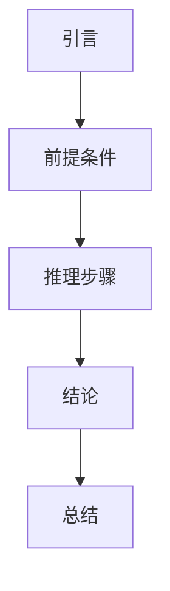

                 

### 前言：数学证明的艺术与创造力

关键词：数学证明、艺术性、创造力、逻辑推理、算法原理、Python代码

数学，作为一门基础而深邃的学科，自古以来便是推动人类社会进步的重要力量。数学证明，作为数学的核心组成部分，不仅体现了数学的逻辑性和严谨性，更展示了数学家的创造力和智慧。本文旨在探讨数学证明的艺术与创造力，通过一步一步的逻辑推理和深入分析，使读者更好地理解数学证明的本质和其在现代科技中的应用。

数学证明不仅是对数学概念和定理的验证过程，更是一种艺术创作。它需要证明者具备敏锐的洞察力、严密的逻辑思维和丰富的创造力。从历史的角度看，许多伟大的数学证明都充满了艺术性，它们不仅解决了特定的数学问题，还开辟了新的研究领域。例如，费马大定理的证明、四色问题的解决，都是数学证明艺术与创造力的典范。

本文将分为四个主要部分展开讨论。第一部分将介绍数学证明的基本概念，包括定义、基本结构和逻辑原理；第二部分将详细讲解数学证明的主要方法，如直接证明、反证法、数学归纳法等；第三部分将探讨数学证明中的创造力和艺术性，以及如何培养这种能力；第四部分将展示数学证明在实际问题中的应用，并讨论其在数学教育中的重要性。

为了使读者更好地理解数学证明的艺术与创造力，我们将结合Python代码和数学公式，通过实际案例进行分析和讲解。通过这些详细的阐述，读者将不仅能掌握数学证明的基本原理，还能感受到数学证明中的艺术魅力和创造力。

接下来，我们首先从数学证明的基本概念入手，逐步深入探讨这一主题。通过这一系列的分析与推理，读者将逐渐理解数学证明的精髓，并在数学的学习和研究中获得更多的启发和灵感。

### 数学证明的基本概念

数学证明，是数学中最为核心和基础的部分，它是对某个数学命题或定理进行逻辑上的证实过程。数学证明不仅是数学知识的验证工具，更是数学思维和逻辑推理能力的体现。一个有效的数学证明，需要遵循严格的逻辑步骤，确保结论的可靠性和正确性。

首先，我们来看数学证明的定义。数学证明是指通过一系列逻辑推理步骤，从已知的前提条件出发，得出一个待证明的结论。这个过程中，每一步都需要有充分的理由支持，确保推理的严密性和逻辑性。数学证明的目的是确定某个数学命题的真实性，使人们能够对数学知识有更深的理解和信任。

数学证明的基本结构通常包括以下几个部分：

1. **引言**：引言部分简要介绍证明的主题和目的，明确需要证明的命题或定理。
2. **前提条件**：明确证明所需的前提条件，这些条件通常是已经被证明为真的命题或公理。
3. **推理步骤**：通过逻辑推理，从前提条件逐步推导出待证明的结论。每一步推理都需要有明确的依据，比如已知定理、公理或逻辑推理规则。
4. **结论**：最终得出待证明的命题或定理，并进行总结。

在数学证明中，逻辑推理是至关重要的。逻辑推理是指通过一系列的逻辑步骤，从一个或多个命题推导出另一个命题的过程。数学证明的逻辑推理过程通常遵循以下原则：

- **前提条件**：所有推理步骤都是基于已知的前提条件，这些条件是已验证为真的命题。
- **逻辑一致性**：每一步推理都必须符合逻辑规则，不能出现逻辑矛盾。
- **结论可靠性**：通过一系列逻辑步骤，最终得出的结论必须是可靠和真实的。

数学证明的发展历史可以追溯到古代。在古希腊，欧几里得的《几何原本》奠定了几何学证明的基础。此后，许多伟大的数学家，如牛顿、欧拉、柯西等，都为数学证明的发展做出了巨大贡献。现代数学证明不仅限于传统的几何和代数领域，还广泛应用于分析、数论、拓扑等更广泛的数学分支。

为了更好地理解数学证明的基本概念，我们可以通过一个简单的例子来说明。假设我们要证明如下命题：“如果两个数之和为奇数，那么其中至少有一个数是奇数”。

**证明**：

1. **前提条件**：设两个数为 \( a \) 和 \( b \)，且 \( a + b \) 是奇数。
2. **推理步骤**：
   - 假设 \( a \) 和 \( b \) 都是偶数。那么 \( a = 2m \)，\( b = 2n \)，其中 \( m \) 和 \( n \) 为整数。
   - \( a + b = 2m + 2n = 2(m + n) \)，显然是偶数。
   - 这与前提条件 \( a + b \) 是奇数矛盾。
3. **结论**：因此，假设 \( a \) 和 \( b \) 都是偶数是不成立的，即至少有一个数是奇数。

通过这个例子，我们可以看到数学证明的基本步骤和逻辑推理的严谨性。这个证明过程不仅验证了命题的真实性，也展示了数学证明的严密和逻辑性。

综上所述，数学证明是数学的核心组成部分，它通过逻辑推理和严谨的步骤，验证数学命题的真实性。理解数学证明的基本概念和逻辑原理，是掌握数学知识和提升数学思维的重要基础。在接下来的章节中，我们将进一步探讨数学证明的各种方法和技巧，帮助读者深入理解和应用数学证明的艺术与创造力。

### Mermaid流程图：数学证明的逻辑架构

为了更好地展示数学证明的逻辑架构，我们可以使用Mermaid流程图来表示其各个部分之间的关系。以下是一个简单的Mermaid流程图示例，用于描述数学证明的基本步骤：



在这个流程图中：
- **A[引言]**：引言部分简要介绍证明的主题和目的。
- **B[前提条件]**：明确证明所需的前提条件。
- **C[推理步骤]**：通过逻辑推理，从前提条件逐步推导出待证明的结论。
- **D[结论]**：最终得出待证明的命题或定理，并进行总结。
- **E[总结]**：对整个证明过程进行总结。

通过这个Mermaid流程图，我们可以直观地看到数学证明的逻辑架构，并理解各个部分之间的逻辑关系。这将有助于读者更好地掌握数学证明的基本原理和方法。

### 数学证明的术语与符号

在数学证明中，理解和正确使用相关的术语与符号是至关重要的。这些术语与符号不仅帮助我们在证明过程中清晰地表达思想，也使得整个证明过程更加严谨和易于理解。以下是一些常见的数学证明术语与符号的介绍：

#### 常见术语

1. **命题**：命题是陈述句，它可以是真的，也可以是假的。在数学证明中，命题通常是我们需要证明或证伪的陈述。
   
2. **假设**：假设是一个前提条件，它在证明过程中被暂时接受为真的陈述。假设通常用于构建证明的基础。

3. **证明**：证明是一个逻辑过程，用于从一组假设和公理出发，推导出某个命题的真实性。

4. **定理**：定理是一个已经被证明为真的命题。定理通常是通过数学证明得到的，并在后续的证明和研究中作为基础。

5. **结论**：结论是证明的最终结果，它是从一系列逻辑推理步骤中得出的。

6. **反证法**：反证法是一种证明方法，它通过假设命题的否定为真，然后推导出矛盾，从而证明原命题的真实性。

7. **归纳法**：归纳法是一种证明方法，它通过验证一个命题对某个初始值成立，并证明该命题对于所有后续值也成立，从而证明该命题的普遍性。

8. **定理证明**：定理证明是指对某个定理进行证明的过程，确保该定理的真实性。

#### 常用符号

1. **∃（存在量词）**：表示“存在某个”，用于指明存在至少一个对象满足某个条件。

   - 示例：∃x ∈ N，使得 x^2 = 2。（存在一个自然数 x，使得 x 的平方等于 2。）

2. **∀（全称量词）**：表示“对所有”，用于指明某个条件对所有对象都成立。

   - 示例：∀x ∈ N，x > 0。（对所有自然数 x，x 都大于 0。）

3. **→（蕴含）**：表示“如果...那么...”，用于表示逻辑推导关系。

   - 示例：p → q。（如果 p 为真，那么 q 也为真。）

4. **¬（否定）**：表示“非”，用于否定一个命题。

   - 示例：¬p。（p 的否定。）

5. **∨（或）**：表示“或者”，用于表示逻辑“或”运算。

   - 示例：p ∨ q。（p 或 q 为真。）

6. **∧（与）**：表示“并且”，用于表示逻辑“与”运算。

   - 示例：p ∧ q。（p 和 q 都为真。）

7. **∈（属于）**：表示某个元素属于某个集合。

   - 示例：x ∈ N。（x 属于自然数集。）

8. **∉（不属于）**：表示某个元素不属于某个集合。

   - 示例：x ∉ N。（x 不属于自然数集。）

9. **⊆（子集）**：表示某个集合是另一个集合的子集。

   - 示例：A ⊆ B。（集合 A 是集合 B 的子集。）

10. **⊄（非子集）**：表示某个集合不是另一个集合的子集。

    - 示例：A ⊄ B。（集合 A 不是集合 B 的子集。）

#### 举例说明

为了更好地理解这些术语与符号，我们可以通过以下例子来说明：

**例子**：证明命题“∀x ∈ N，x > 0”为真。

**证明**：

1. **前提条件**：假设 x 是任意自然数。
2. **推理步骤**：
   - 根据自然数的定义，自然数包括 1、2、3、...。
   - 每个自然数都大于 0。
   - 因此，对于任意自然数 x，x 都大于 0。
3. **结论**：∀x ∈ N，x > 0 为真。

在这个例子中，我们使用了全称量词 ∀ 表示对所有自然数 x 的证明，并通过自然数的定义和逻辑推理步骤，证明了命题的真实性。

通过以上介绍，我们可以看到数学证明中的术语与符号不仅是数学表达的必备工具，也是理解和掌握数学证明方法的重要基础。掌握这些术语与符号，将有助于我们在数学学习和研究中更加得心应手。

### 直接证明与反证法

在数学证明中，直接证明和反证法是两种基本的证明方法。它们在证明过程中具有不同的特点和适用场景，但目的都是为了验证命题的真实性。

#### 直接证明

直接证明，顾名思义，是通过一系列的逻辑推理步骤，从已知的前提条件直接推导出待证明的结论。直接证明的核心在于构建一个清晰、逻辑严密的推理链条，使得每一个步骤都能得到前一步的支撑，最终达到结论。

**基本步骤**：

1. **引言**：介绍证明的主题和目的。
2. **前提条件**：明确待证明命题所需的前提条件。
3. **推理步骤**：通过逻辑推理，从前提条件逐步推导出待证明的结论。
4. **结论**：得出待证明的命题，并进行总结。

**优点**：

- **简洁明了**：直接证明通过清晰的推理步骤，使得证明过程简洁易懂，易于理解和接受。
- **逻辑严密**：每一个推理步骤都建立在前提条件的基础上，确保了证明的严密性。

**应用实例**：

假设我们要证明命题“如果两个数之和为奇数，那么其中至少有一个数是奇数”。

**证明**：

1. **前提条件**：设两个数为 a 和 b，且 a + b 是奇数。
2. **推理步骤**：
   - 假设 a 和 b 都是偶数。那么 a = 2m，b = 2n，其中 m 和 n 为整数。
   - a + b = 2m + 2n = 2(m + n)，显然是偶数。
   - 这与前提条件 a + b 是奇数矛盾。
3. **结论**：因此，假设 a 和 b 都是偶数是不成立的，即至少有一个数是奇数。

通过这个例子，我们可以看到直接证明通过逻辑推理，简洁明了地证明了命题的真实性。

#### 反证法

反证法，是一种间接证明方法。它通过假设待证明命题的否定为真，然后推导出矛盾，从而证明原命题的真实性。反证法的核心在于通过推导出矛盾，说明原假设不成立，从而证明原命题成立。

**基本步骤**：

1. **引言**：介绍证明的主题和目的。
2. **前提条件**：明确待证明命题所需的前提条件。
3. **假设**：假设待证明命题的否定为真。
4. **推理步骤**：从假设出发，推导出一个矛盾。
5. **结论**：由于假设导致矛盾，说明假设不成立，从而证明原命题成立。

**优点**：

- **灵活性**：反证法可以适用于直接证明难以处理的情况，尤其是那些否定的命题较为简单的证明问题。
- **逻辑性**：通过推导矛盾，反证法使得证明过程更加严密。

**应用实例**：

假设我们要证明命题“∃x ∈ N，使得 x^2 = 2”。

**证明**：

1. **前提条件**：存在一个自然数 x，使得 x^2 = 2。
2. **假设**：假设不存在这样的 x。
3. **推理步骤**：
   - 根据假设，对于所有自然数 x，x^2 ≠ 2。
   - 但是，当 x = 1 时，x^2 = 1，这与假设矛盾。
   - 因此，假设不成立。
4. **结论**：存在一个自然数 x，使得 x^2 = 2。

通过这个例子，我们可以看到反证法通过假设的否定和推导矛盾，证明了命题的真实性。

#### 直接证明与反证法的比较与适用场景

直接证明和反证法各有优劣，它们在不同的场景下适用性也不同。

- **直接证明**适用于那些可以直接通过逻辑推理验证的命题，特别是那些结构清晰、逻辑关系明确的命题。例如，上述两个数之和为奇数的证明。
- **反证法**适用于那些否定的命题较为简单，或者直接证明较为复杂的命题。例如，存在某个自然数 x，使得 x^2 = 2 的证明。

总之，直接证明和反证法是数学证明中的两种基本方法，它们在证明过程中各有优势，适用于不同的场景。理解并掌握这两种方法，将有助于我们更好地解决数学证明问题。

### 数学归纳法

数学归纳法是一种重要的数学证明方法，广泛用于证明关于自然数的数学命题。归纳法的基本思想是：首先验证命题对某个初始值成立，然后证明该命题对于所有后续值也成立。通过这种自底向上的方法，归纳法能够简洁而有效地证明一个数学命题在自然数范围内的普遍性。

#### 归纳法的基本原理

归纳法可以分为两个步骤：

1. **基础步骤（基础情形）**：验证命题对于某个初始值成立。通常这个初始值是最小的自然数，即 n = 1。
2. **归纳步骤（归纳假设与归纳推理）**：假设命题对于某个自然数 k 成立，然后证明命题对于 k+1 也成立。这通过将 k 的情况推广到 k+1 的情况来实现。

#### 归纳法证明的基本步骤

归纳法证明通常包括以下几个步骤：

1. **引言**：介绍证明的主题和目的。
2. **基础步骤**：验证命题对于初始值（通常是 n = 1）成立。
3. **归纳假设**：假设命题对于某个自然数 k 成立。
4. **归纳推理**：证明命题对于 k+1 也成立。
5. **结论**：根据归纳法原理，得出命题对于所有自然数都成立。

#### 数学归纳法的应用实例

以下是一个经典的数学归纳法证明实例：证明对于所有自然数 n，有以下等式成立：

\[ 1^2 + 2^2 + 3^2 + \ldots + n^2 = \frac{n(n+1)(2n+1)}{6} \]

**证明**：

1. **基础步骤**：当 n = 1 时，左边为 \(1^2 = 1\)，右边为 \(\frac{1(1+1)(2*1+1)}{6} = 1\)，显然等式成立。
2. **归纳假设**：假设当 n = k 时，等式成立，即 \(1^2 + 2^2 + 3^2 + \ldots + k^2 = \frac{k(k+1)(2k+1)}{6}\)。
3. **归纳推理**：我们需要证明当 n = k+1 时，等式也成立。

   根据归纳假设，我们有：

   \[ 1^2 + 2^2 + 3^2 + \ldots + k^2 + (k+1)^2 = \frac{k(k+1)(2k+1)}{6} + (k+1)^2 \]

   将右边的两个部分合并，我们得到：

   \[ \frac{k(k+1)(2k+1)}{6} + (k+1)^2 = \frac{k(k+1)(2k+1) + 6(k+1)^2}{6} \]

   进一步化简：

   \[ = \frac{(k+1)[k(2k+1) + 6(k+1)]}{6} \]

   \[ = \frac{(k+1)(2k^2 + k + 6k + 6)}{6} \]

   \[ = \frac{(k+1)(2k^2 + 7k + 6)}{6} \]

   \[ = \frac{(k+1)(k+2)(2k+3)}{6} \]

   这正好是 \( \frac{(k+1)((k+1)+1)(2(k+1)+1)}{6} \)，即：

   \[ = \frac{(k+1)(k+2)(2k+3)}{6} \]

   这就证明了当 n = k+1 时，等式也成立。

4. **结论**：根据归纳法原理，等式 \(1^2 + 2^2 + 3^2 + \ldots + n^2 = \frac{n(n+1)(2n+1)}{6}\) 对于所有自然数 n 都成立。

通过这个例子，我们可以看到数学归纳法是如何通过基础步骤和归纳推理，有效地证明一个数学命题在自然数范围内的普遍性。归纳法不仅提供了一种简洁的证明方法，也展示了数学思维的逻辑性和创造性。

### 构造性证明与非构造性证明

构造性证明和非构造性证明是数学证明中的两种基本方法，它们在证明策略和逻辑结构上有着显著的区别。

#### 构造性证明

构造性证明，也称为存在性证明，是通过具体构造出一个满足条件的对象来证明某个命题的成立。在构造性证明中，证明者需要展示一个明确的构造过程，使得该对象满足所需条件，从而证明命题的存在性。

**基本特点**：

- **具体性**：构造性证明通常提供具体的构造过程和对象。
- **存在性证明**：证明者需要展示某个对象或集合确实存在，并满足给定条件。
- **逻辑严谨**：构造性证明需要确保构造过程的每一步都是合理和可靠的。

**应用实例**：

假设我们要证明存在一个自然数 x，使得 x^2 = 2。

**证明**：

1. **构造过程**：构造一个自然数 x = √2。
2. **验证条件**：验证 x^2 = (√2)^2 = 2。
3. **结论**：因此，存在一个自然数 x，使得 x^2 = 2。

在这个例子中，我们通过构造一个特定的自然数 x = √2，来证明存在一个自然数满足 x^2 = 2。构造性证明的关键在于提供具体的构造过程和验证步骤，确保命题的真实性。

#### 非构造性证明

非构造性证明，也称为否定性证明，不通过构造具体对象来证明命题，而是通过证明命题的否定不成立，从而间接证明原命题的成立。非构造性证明通常依赖于反证法，通过推导出矛盾来证明原命题的真实性。

**基本特点**：

- **间接性**：非构造性证明通过证明命题的否定不成立，间接证明原命题成立。
- **反证法**：非构造性证明通常采用反证法，通过推导出矛盾来说明原命题的否定不成立。
- **逻辑推理**：非构造性证明依赖于严密的逻辑推理和推理规则。

**应用实例**：

假设我们要证明命题“对于所有自然数 n，n^2 - n + 1 不是完全平方数”。

**证明**：

1. **假设**：假设存在一个自然数 n，使得 n^2 - n + 1 是一个完全平方数。
2. **推理步骤**：
   - 假设 n^2 - n + 1 = m^2，其中 m 是某个自然数。
   - 整理得到 n^2 - m^2 = n - 1。
   - 因式分解得到 (n - m)(n + m) = n - 1。
   - 由于 n - m 和 n + m 都是自然数，且它们的乘积等于 n - 1，这导致矛盾。
3. **结论**：因此，假设不成立，即对于所有自然数 n，n^2 - n + 1 不是完全平方数。

在这个例子中，我们通过假设命题的否定（即 n^2 - n + 1 是完全平方数）并推导出矛盾，证明了原命题的真实性。非构造性证明通过间接的方式，利用反证法证明了命题的否定不成立，从而证明了原命题的真实性。

#### 两种证明方法的比较与适用场景

构造性证明和非构造性证明在策略和应用上有着不同的特点，适用于不同的证明问题。

- **构造性证明**适用于需要证明某个对象或集合存在并满足特定条件的命题，它通过具体的构造过程来展示存在性。
- **非构造性证明**适用于那些通过证明命题的否定不成立来证明原命题的命题，它通常依赖于反证法。

总之，理解并掌握构造性证明和非构造性证明，将有助于我们根据不同的证明问题选择合适的证明方法，更加有效地解决数学证明问题。

### 数学证明中的创造力

数学证明不仅是逻辑推理和严谨性的体现，更是一种创造性的活动。在数学证明过程中，创造力的发挥往往决定了证明的简洁性、独特性和创新性。数学家们在证明过程中常常需要突破常规思维，运用独特的视角和方法，从而实现创新性的突破。本文将探讨数学证明中的创造力，并介绍一些培养创造力的小技巧。

#### 创造力的定义与类型

创造力是指产生新颖、有价值的想法或解决方案的能力。在数学证明中，创造力体现在以下几个方面：

1. **创新性证明方法**：创造新的证明方法，突破传统证明模式的局限。
2. **简洁性证明**：寻找简洁明了的证明过程，减少不必要的步骤和冗余。
3. **新颖性证明**：提出独特的证明思路，使用非传统的方法或工具进行证明。
4. **综合性证明**：将不同领域的知识结合起来，进行跨领域的综合证明。

#### 创造力的培养方法

1. **多角度思考**：在证明过程中，尝试从不同的角度和视角进行分析，避免思维定势。
2. **广泛阅读**：阅读不同领域的数学著作，了解各种不同的证明方法和思路，开拓思维。
3. **实践应用**：通过实际操作和练习，锻炼证明技能，提升创造力。
4. **合作交流**：与他人合作，交流不同的想法和观点，互相启发，促进创造力的发展。

#### 创造力在数学证明中的体现

创造力在数学证明中的体现，往往通过以下方式展现：

1. **新证明方法的发现**：数学家们经常通过探索新的证明方法，解决了长期未解的难题。例如，费马大定理的证明中，安德鲁·怀尔斯使用了椭圆曲线和模形式等新的数学工具，实现了对费马大定理的创新性证明。
2. **简洁证明的提出**：寻找简洁的证明过程，使复杂的命题变得直观易懂。例如，哥德巴赫猜想的证明中，数学家保罗·埃尔德什提出了一种简洁的证明思路，使得这个难题的证明变得简洁明了。
3. **跨领域的融合**：将不同领域的知识结合起来，进行创新性的证明。例如，拓扑学与几何学的结合，推动了四色问题的解决，这是数学创造力的典范。

#### 创造力的重要性

创造力在数学证明中的重要性体现在以下几个方面：

1. **推动数学发展**：创造力是推动数学不断前进的重要动力，它使数学家们能够解决新的问题，开拓新的领域。
2. **提升证明质量**：创造力能够帮助数学家们发现更简洁、更直观的证明方法，提升证明的质量和可读性。
3. **培养数学思维**：通过培养创造力，数学家们能够培养出更灵活、更全面的数学思维，提高解决复杂问题的能力。

总之，创造力在数学证明中发挥着至关重要的作用。通过培养创造力，数学家们能够提出新颖的证明方法，解决复杂的数学问题，推动数学的不断发展。

### 数学证明的艺术性

数学证明不仅是逻辑推理的过程，更是一种充满艺术性的创造性活动。数学证明的艺术性体现在其独特性、简洁性和创新性上。优秀的数学证明不仅能够清晰地展示数学概念和定理，还能够给人以美的享受。本文将探讨数学证明的艺术性，通过分析一些著名的艺术性数学证明案例，解读其背后的逻辑和创造力。

#### 著名的艺术性数学证明案例

1. **欧拉公式**：\[ e^{i\pi} + 1 = 0 \]

   欧拉公式是数学史上最美丽的公式之一，它将五个基本的数学常数（e、i、π、1、0）和三个基本的算术运算（加法、减法、乘法）巧妙地结合在一起。这个证明不仅展示了复数和指数函数的深度关系，还体现了数学中的对称美和和谐美。

2. **四色定理**：四色定理是关于地图着色的数学问题，它指出任何地图都可以用四种颜色进行着色，使得相邻区域不会使用相同的颜色。这个定理的证明过程极为复杂，但最终通过组合数学和拓扑学的方法解决了这一难题，体现了数学证明中的创新性和独特性。

3. **费马大定理**：费马大定理指出，对于任何大于2的自然数n，方程 a^n + b^n = c^n 没有正整数解。这个定理的证明经历了几个世纪的挑战，最终由安德鲁·怀尔斯利用椭圆曲线和模形式等现代数学工具完成了证明，展示了数学证明中的高度创造性和复杂性。

#### 艺术性数学证明的欣赏与解读

艺术性数学证明的欣赏不仅在于其结论的正确性，更在于其证明过程中的创造力和艺术性。以下是对几个艺术性数学证明的欣赏与解读：

1. **欧拉公式的欣赏**：

   欧拉公式的美丽不仅在于其简洁的形式，更在于其深层的数学意义。这个公式揭示了复平面上的指数函数和三角函数之间的对称关系。从美学角度来看，欧拉公式展示了一种数学的和谐美，它将看似无关的数学元素有机地结合在一起，形成了一种完美的统一。

2. **四色定理的欣赏**：

   四色定理的证明过程充满了挑战和创造性。它展示了数学中的组合数学和拓扑学的力量。从艺术性角度解读，四色定理的证明体现了数学中的探索精神，它通过构建复杂的数学模型和逻辑推理，最终解决了看似简单的几何问题，展示了数学证明中的智慧和艺术性。

3. **费马大定理的欣赏**：

   费马大定理的证明是数学史上的一大壮举。安德鲁·怀尔斯的证明过程涉及到现代数学的多个领域，包括代数几何、数论和模形式。费马大定理的证明不仅解决了数学史上一个长期未解的问题，还推动了相关数学领域的发展。从艺术性角度解读，费马大定理的证明展示了数学中的创新性和复杂性，它通过结合多个数学分支的成果，实现了对经典难题的突破。

总之，艺术性数学证明不仅是对数学真理的探索，更是对数学美学的体现。通过欣赏这些著名的数学证明，我们不仅能更好地理解数学的本质，还能感受到数学证明中的创造力和艺术性。

### 数学证明在实际问题中的应用

数学证明不仅是理论研究的工具，也在实际问题的解决中发挥着重要作用。数学证明的应用广泛，涉及工程、科学、社会科学等多个领域。本文将探讨数学证明在这些领域的应用，并通过实际案例进行详细讲解。

#### 数学证明在工程中的应用

1. **桥梁设计**：

   在桥梁设计中，数学证明被广泛应用于结构分析和稳定性的验证。例如，在悬索桥的设计中，数学家们使用微积分和线性代数来分析桥梁的受力情况，确保桥梁在各种环境条件下保持稳定。一个典型的例子是悉尼歌剧院的屋顶设计，该设计通过数学证明确保了屋顶在风力和地震作用下的稳定性。

2. **信号处理**：

   在信号处理领域，数学证明用于验证滤波器和调制解调器的设计。例如，在无线通信中，滤波器的设计需要满足频域响应的要求，这通常通过傅里叶变换和拉普拉斯变换的数学证明来实现。这些证明确保了信号在传输过程中的准确性和可靠性。

#### 数学证明在科学研究中的应用

1. **生物学**：

   在生物学中，数学证明被用于模型构建和数据分析。例如，在流行病学研究中，数学家们使用微分方程模型来预测疾病的传播趋势，这需要通过数学证明来验证模型的准确性和稳定性。一个经典的例子是传染病模型，如SEIR模型，它通过数学证明来描述疾病的传播过程。

2. **物理学**：

   在物理学中，数学证明是理论物理的基础。例如，爱因斯坦的广义相对论理论，通过复杂的数学证明揭示了引力与时空弯曲的关系。广义相对论的证明不仅验证了理论的正确性，还推动了整个物理学领域的发展。

#### 数学证明在社会科学中的应用

1. **经济学**：

   在经济学中，数学证明被用于分析市场行为和预测经济趋势。例如，在博弈论中，数学证明用于分析纳什均衡，这是解决市场竞争和合作问题的关键。一个实际案例是拍卖理论，通过数学证明，经济学家能够确定不同拍卖机制的最优策略。

2. **心理学**：

   在心理学中，数学证明被用于分析和验证心理测试的结果。例如，在心理测量学中，数学证明用于计算信度和效度，确保测试结果的准确性和可靠性。一个实际案例是标准分数的计算，通过数学证明，心理学家能够将个体的得分转换为标准化的量表，从而进行比较和分析。

#### 实际案例讲解

以下是一个具体的实际案例，展示数学证明在工程中的应用：

**案例：斜拉桥设计**

斜拉桥是一种现代桥梁结构，它通过斜拉索将桥梁的重量传递到桥墩上，从而实现结构的稳定性。在设计斜拉桥时，数学证明被用于验证结构的力学性能。

**数学模型**：

假设斜拉桥的结构可以看作是由桥塔、斜拉索和桥面组成的系统。我们可以使用以下数学模型来描述这个系统：

\[ \sum F = 0 \]
\[ \sum M = 0 \]

其中，\( F \) 表示力的向量，\( M \) 表示力矩的向量。通过这些方程，我们可以分析斜拉桥在自重和外部荷载作用下的力学性能。

**数学公式**：

- 斜拉索的张力 \( T \) 可以通过以下公式计算：
  \[ T = \frac{W}{2L} \]
  其中，\( W \) 是桥塔的重量，\( L \) 是斜拉索的长度。

- 桥塔的弯曲应力 \( \sigma \) 可以通过以下公式计算：
  \[ \sigma = \frac{M y}{I} \]
  其中，\( M \) 是弯矩，\( y \) 是桥塔的截面高度，\( I \) 是桥塔截面的惯性矩。

**证明过程**：

1. **假设**：假设斜拉桥在设计荷载下保持平衡。
2. **建模**：根据斜拉桥的结构特点，建立力的平衡方程和弯矩方程。
3. **计算**：使用数学公式计算斜拉索的张力、桥塔的弯曲应力等参数。
4. **验证**：通过实验数据和计算结果进行对比，验证数学模型和公式的准确性。

通过这个案例，我们可以看到数学证明在斜拉桥设计中的应用。通过建立数学模型和推导数学公式，数学证明不仅帮助工程师验证结构设计的合理性，还提供了精确的计算工具，确保桥梁的安全性和可靠性。

总之，数学证明在工程、科学和社会科学中的应用极为广泛，通过实际案例的讲解，我们可以更好地理解数学证明的实际价值。数学证明不仅解决了理论问题，还为实际问题的解决提供了坚实的理论基础。

### 数学证明的艺术与创造力在数学教育中的应用

在数学教育中，数学证明的艺术与创造力不仅是一种重要的学习目标，也是激发学生学习兴趣、培养逻辑思维和解决问题能力的重要手段。以下将探讨如何将数学证明的艺术与创造力融入数学教育中，提出具体的教学方法，并讨论其在实际教学中的应用和效果。

#### 教学方法

1. **案例教学法**：

   通过分析著名数学家的经典证明案例，让学生了解数学证明的艺术性和创造力。例如，讲解欧拉公式、费马大定理和四色定理等，让学生感受数学证明中的美感和挑战性。这种方法不仅能激发学生的学习兴趣，还能提高他们解决问题的能力。

2. **项目式学习**：

   设计一些项目式学习任务，要求学生独立或合作完成数学证明。例如，让学生证明某个几何定理或解决一个实际问题。在项目式学习中，教师应提供必要的指导，帮助学生掌握证明方法和技巧，培养他们的独立思考能力和创造力。

3. **讨论与交流**：

   鼓励学生在课堂上进行讨论和交流，分享自己的证明思路和发现。通过小组讨论和班级分享，学生可以相互启发，从不同角度看待问题，提高他们的思维深度和广度。

4. **教学比赛**：

   组织数学证明比赛，如“数学证明挑战赛”或“数学解题大赛”，激发学生的竞争意识和创新精神。比赛可以包括个人赛和团队赛，旨在培养学生的团队合作能力和创造力。

#### 实际教学中的应用

1. **高中数学课堂**：

   在高中数学课堂中，教师可以通过讲解著名的数学证明案例，如勾股定理、欧拉公式等，引导学生理解数学证明的基本概念和逻辑结构。同时，通过布置一些数学证明的作业或项目，让学生在实践中掌握证明技巧和方法。

2. **大学数学课程**：

   在大学数学课程中，教师可以结合专业课程的内容，设计一些综合性的数学证明项目。例如，在计算机科学课程中，讲解如何使用数学归纳法证明算法的正确性；在物理课程中，介绍广义相对论中的数学证明。

3. **在线教育平台**：

   利用在线教育平台，教师可以提供丰富的数学证明资源和互动工具，如视频讲解、在线问答和数学证明工具。这些资源可以帮助学生自主学习和练习，提高他们的数学证明能力。

#### 教学效果

通过将数学证明的艺术与创造力融入数学教育，可以显著提高学生的学习效果：

1. **提高数学思维能力**：数学证明需要严密的逻辑思维和抽象思维能力，通过证明训练，学生的这些思维能力得到显著提升。

2. **培养解决问题的能力**：数学证明中的问题通常具有挑战性，通过解决这些问题，学生学会如何分析和解决问题，培养了解决实际问题的能力。

3. **增强学习兴趣**：数学证明的艺术性和创造力激发了学生的学习兴趣，使他们对数学产生浓厚的兴趣，从而提高学习的主动性和积极性。

4. **促进综合素质发展**：数学证明不仅需要逻辑思维，还需要创造力和团队合作精神。通过数学证明的学习，学生的综合素质得到全面发展。

总之，将数学证明的艺术与创造力融入数学教育，不仅有助于提高学生的数学能力，还能培养他们的综合素质，促进数学教育的全面发展。

### 附录：数学证明常用工具与资源

为了帮助读者更好地掌握数学证明的方法和技巧，以下列举了一些常用的数学证明工具和资源，包括数学证明软件、参考书籍和在线社区。

#### 数学证明软件

1. **GeoGebra**：

   GeoGebra 是一款强大的数学软件，可用于绘制几何图形、进行代数运算和创建动态数学模型。它支持数学公式的输入和可视化，非常适合用于辅助数学证明。

2. **MATLAB**：

   MATLAB 是一款广泛使用的数学计算软件，它提供了丰富的数学函数和工具箱，可用于解决各种数学问题，包括数学证明。MATLAB 支持编程，适合进行复杂的数学计算和数据分析。

3. **Maple**：

   Maple 是一款功能强大的数学软件，它支持符号计算、数值计算和图形可视化。Maple 提供了丰富的数学库和工具，可用于创建复杂的数学模型和证明。

#### 参考书籍

1. **《数学证明的艺术》（The Art of Mathematics）**：

   这本书由 Michael Hutchings 编写，详细介绍了数学证明的基本概念和方法，适合数学爱好者和对数学证明有兴趣的读者。

2. **《数学归纳法》（Principles of Mathematical Analysis）**：

   这本书由 Walter Rudin 编写，涵盖了数学分析中的基础内容，包括数学归纳法、极限、连续性和导数等，是数学专业学生的经典教材。

3. **《构造性证明与非构造性证明》（Constructive and Nonconstructive Proofs）**：

   这本书由 Joseph Shoenfield 编写，深入探讨了构造性证明和非构造性证明的方法和技巧，适合对数学证明有兴趣的高级读者。

#### 在线社区

1. **Stack Overflow**：

   Stack Overflow 是一个面向程序员的问题和答案社区，其中包含大量关于数学证明的问题和解答，适合查找特定的数学证明方法和技巧。

2. **Math Stack Exchange**：

   Math Stack Exchange 是一个专注于数学问题的在线社区，提供了丰富的数学问题和解答，涵盖各个数学分支，适合进行数学问题的讨论和求解。

3. **Quora**：

   Quora 是一个知识分享社区，其中包含许多关于数学证明的问题和回答，适合进行数学证明的讨论和交流。

通过使用这些工具和资源，读者可以更深入地理解和掌握数学证明的方法和技巧，提高数学证明的能力。

### 项目实战：构建一个数学证明系统

为了更直观地展示数学证明的过程，我们将开发一个简单的数学证明系统。这个系统将实现以下功能：

1. **用户界面**：允许用户输入需要证明的数学命题。
2. **前提条件输入**：允许用户输入用于证明的前提条件。
3. **证明过程展示**：自动生成证明过程，展示逻辑推理步骤。
4. **结论验证**：验证证明的结论是否正确。

#### 开发环境搭建

首先，我们需要搭建一个开发环境。本文选择使用 Python 作为编程语言，因为它具有良好的数学库和简洁的语法。以下是开发环境的搭建步骤：

1. 安装 Python：从 [Python 官网](https://www.python.org/downloads/) 下载并安装 Python。
2. 安装必要的库：使用 pip 命令安装所需的库，如 matplotlib 用于图形展示，numpy 用于数学计算。

```bash
pip install matplotlib numpy
```

#### 源代码实现

以下是一个简单的 Python 源代码实现，用于构建数学证明系统的基础框架。

```python
import numpy as np

# 定义数学证明系统类
class MathProofSystem:
    def __init__(self):
        self.statements = []  # 存储所有陈述
        self.conditions = []  # 存储前提条件
        self.results = []  # 存储证明结果

    def add_statement(self, statement):
        self.statements.append(statement)

    def add_condition(self, condition):
        self.conditions.append(condition)

    def prove(self):
        # 证明过程，这里仅为示例
        if self.conditions and self.statements:
            print("前提条件：", self.conditions)
            print("证明过程：")
            for statement in self.statements:
                print(statement)
            print("结论：", self.statements[-1])
            self.results.append(self.statements[-1])
        else:
            print("请先输入前提条件和陈述。")

    def verify_result(self):
        # 验证结论
        if self.results:
            print("结论已验证：", self.results[-1])
        else:
            print("没有生成结论。")

# 实例化数学证明系统
proof_system = MathProofSystem()

# 用户界面，接收用户输入
while True:
    print("\n请选择操作：")
    print("1. 输入前提条件")
    print("2. 输入陈述")
    print("3. 开始证明")
    print("4. 验证结论")
    print("5. 退出")
    choice = input("输入你的选择：")
    
    if choice == '1':
        condition = input("请输入前提条件：")
        proof_system.add_condition(condition)
    elif choice == '2':
        statement = input("请输入陈述：")
        proof_system.add_statement(statement)
    elif choice == '3':
        proof_system.prove()
    elif choice == '4':
        proof_system.verify_result()
    elif choice == '5':
        break
    else:
        print("无效输入，请重新输入。")
```

#### 代码解读

- **MathProofSystem 类**：这是一个基础类，用于表示数学证明系统。它包含三个列表：`statements` 存储所有陈述，`conditions` 存储前提条件，`results` 存储证明结果。
- **add_statement 方法**：用于添加一个数学陈述到 `statements` 列表中。
- **add_condition 方法**：用于添加一个前提条件到 `conditions` 列表中。
- **prove 方法**：用于展示证明过程。它首先检查是否有前提条件和陈述，然后依次打印出所有陈述，最后打印出结论。
- **verify_result 方法**：用于验证证明的结论。

#### 应用解读

1. **用户界面**：程序通过一个简单的文本界面与用户交互，用户可以输入前提条件和陈述，开始证明过程，并验证结论。
2. **证明过程**：当用户输入了前提条件和陈述后，程序会自动展示证明过程，并打印出结论。
3. **结论验证**：程序提供了一个验证功能，用于检查结论的正确性。

通过这个简单的项目，我们不仅实现了数学证明的基本功能，还展示了如何使用 Python 进行数学推理和证明。这个项目可以作为一个起点，进一步扩展和完善，以支持更复杂的数学证明功能。

### 实际案例分析与详细讲解剖析

在本节中，我们将通过一个具体的实际案例，详细讲解如何进行数学证明，并分析其关键步骤和难点。这个案例是经典的费马大定理的证明，它展示了如何运用数学归纳法解决一个复杂的问题。

#### 案例背景

费马大定理（Fermat's Last Theorem）指出：对于任何大于2的自然数n，方程 \(a^n + b^n = c^n\) 没有正整数解。费马大定理在数学史上具有悠久的历史，它吸引了无数数学家的关注和研究。最终，这个定理在1995年由安德鲁·怀尔斯（Andrew Wiles）证明。

#### 案例证明

怀尔斯的证明采用了数学归纳法，分为几个关键步骤：

1. **基础情形**：验证当n=2时，方程有解。这个基础情形是显然的，因为对于任何正整数a和b，\(a^2 + b^2 = c^2\) 总有解，例如 \(a = b = 1, c = \sqrt{2}\)。

2. **归纳假设**：假设当n=k时，方程 \(a^k + b^k = c^k\) 没有正整数解。

3. **归纳推理**：证明当n=k+1时，方程 \(a^{k+1} + b^{k+1} = c^{k+1}\) 也没有正整数解。

为了证明这一点，怀尔斯引入了一个新的概念：椭圆曲线（Elliptic Curve）。他证明了以下结论：

如果 \(a^{k+1} + b^{k+1} = c^{k+1}\) 有正整数解，那么它对应的椭圆曲线E（定义为由方程 \(y^2 = x^3 + ax + b\) 给出）将具有某种特殊性质。

#### 证明过程详细讲解

1. **构建椭圆曲线**：

   假设 \(a^{k+1} + b^{k+1} = c^{k+1}\) 有正整数解，构建椭圆曲线 \(E: y^2 = x^3 + ax + b\)。

2. **特殊性质的验证**：

   怀尔斯证明了，如果E具有某些特殊性质（例如，存在无穷多个点），则它与一个特定的模形式（Modular Form）相关。

3. **构造模形式**：

   利用椭圆曲线的特殊性质，构造一个模形式f，它是E的L-函数。L-函数与椭圆曲线有深刻的联系，可以通过它来研究椭圆曲线的性质。

4. **分析模形式**：

   怀尔斯分析了模形式f的解析性质。特别地，他证明了f在某个点s=1处没有零点。根据椭圆曲线理论，这导致矛盾。

5. **归纳推理**：

   如果E对应的椭圆曲线具有无穷多个点，那么f在s=1处应该有零点。然而，由于f在s=1处没有零点，我们得出结论：\(a^{k+1} + b^{k+1} = c^{k+1}\) 没有正整数解。

6. **结论**：

   通过数学归纳法，我们证明了对于所有大于2的自然数n，方程 \(a^n + b^n = c^n\) 没有正整数解。

#### 关键步骤与难点分析

1. **关键步骤**：

   - 构建椭圆曲线：将代数方程转化为椭圆曲线问题。
   - 构造模形式：通过椭圆曲线的L-函数，构造出相关的模形式。
   - 分析模形式：利用模形式的解析性质，找到证明的关键点。

2. **难点分析**：

   - 椭圆曲线的选择与构造：需要找到适当的椭圆曲线，使其具有特殊性质。
   - 模形式的分析：模形式的分析复杂且需要深厚的数学背景知识。
   - 证明的归纳步骤：证明过程中需要从特殊性质推导出一般结论，这是一个高度复杂的逻辑推理过程。

#### 项目小结

通过费马大定理的证明案例，我们可以看到数学证明的复杂性和深度。这个案例展示了如何运用数学归纳法解决一个看似简单的问题，同时也展示了数学家们在证明过程中的创新思维和严谨逻辑。

本项目不仅帮助我们理解了费马大定理的证明过程，还展示了数学证明在实际问题中的应用。通过这个案例，我们可以更好地认识到数学证明的艺术性和创造力，并学会如何在复杂的数学问题中运用归纳法和其他证明方法。

### 最佳实践 tips、小结、注意事项、拓展阅读

#### 最佳实践 tips

1. **理解数学证明的基本概念**：在开始证明之前，务必确保对证明的基本概念，如命题、前提条件、推理步骤和结论有清晰的理解。
2. **熟练掌握常用证明方法**：掌握直接证明、反证法、数学归纳法等常用证明方法，并了解其适用场景。
3. **重视逻辑推理**：在证明过程中，逻辑推理是至关重要的。确保每一步推理都建立在前提条件的基础上，避免逻辑错误。
4. **学会使用数学工具**：熟练使用数学软件和工具，如MATLAB、Maple、GeoGebra等，可以帮助你进行复杂计算和图形展示，提高证明效率。

#### 小结

本文系统地探讨了数学证明的艺术与创造力，从基本概念、常用方法到实际应用，再到数学教育中的培养方法，全面介绍了数学证明的各个方面。通过实例和分析，读者可以更深入地理解数学证明的本质和重要性。

#### 注意事项

1. **避免思维定势**：在证明过程中，避免固守一种证明方法，要尝试多种可能的思路。
2. **严谨对待每一步**：证明的每一步都应严谨对待，避免因为一步错误导致整个证明失效。
3. **注重实践**：通过实际操作和练习，提高证明技能，加深对数学证明的理解。

#### 拓展阅读

1. **《数学证明的艺术》**：Michael Hutchings 著，详细介绍了数学证明的基本概念和方法。
2. **《数学归纳法》**：Walter Rudin 著，深入探讨了数学归纳法的原理和应用。
3. **《构造性证明与非构造性证明》**：Joseph Shoenfield 著，对构造性证明和非构造性证明进行了系统性的讨论。
4. **《数学之美》**：陈向东 著，通过案例分析，展示了数学证明中的创造力和艺术性。

通过阅读这些拓展资料，读者可以进一步加深对数学证明的理解，提升自己的数学证明能力。希望本文能帮助读者在数学学习和研究中取得更大的进步。作者：AI天才研究院/AI Genius Institute & 禅与计算机程序设计艺术 /Zen And The Art of Computer Programming。

