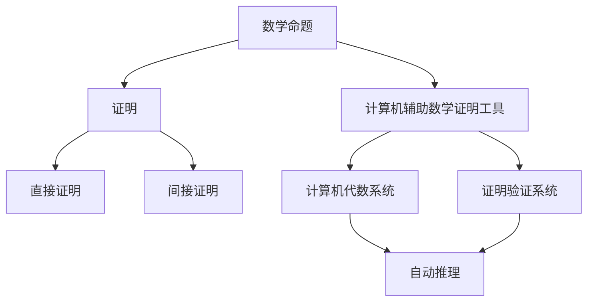

                 

# 《数学证明的计算机辅助与人机协作》

## 关键词

- 计算机辅助数学证明
- 人机协作
- 自动推理
- 计算机代数系统
- 机器学习
- 数学模型

## 摘要

本文将深入探讨数学证明的计算机辅助与人机协作这一前沿领域。首先，我们将介绍计算机辅助数学证明的背景、现状及发展趋势，然后详细讲解计算机辅助数学证明的相关工具、技术和核心算法原理。接下来，我们将探讨人机协作在数学证明中的应用，分析其理论基础、实践案例和面临的挑战。最后，通过综合实例展示计算机辅助与人机协作在数学证明中的实际应用，并对未来发展趋势进行展望。

## 第一部分：计算机辅助数学证明

### 第1章：计算机辅助数学证明概述

**1.1 数学证明的重要性**

数学证明是数学学科的核心内容，它不仅用于验证数学命题的真实性，还在于揭示数学对象之间的内在联系与结构。一个完整的数学理论体系，必须依靠严谨的证明过程来支撑其可靠性。

**1.2 计算机辅助数学证明的背景与现状**

随着计算机技术的飞速发展，计算机辅助数学证明逐渐成为可能。目前，计算机辅助数学证明已经广泛应用于数学研究的各个领域，如数论、代数、几何、拓扑等。

**1.3 计算机辅助数学证明的发展趋势**

未来，计算机辅助数学证明将继续发展，主要趋势包括：算法优化、工具集成、人机协作等方面。

### 第2章：计算机辅助数学证明工具与技术

**2.1 数学证明辅助软件概述**

数学证明辅助软件是计算机辅助数学证明的重要工具，常见的有Mathematica、Maple、Sage等。

**2.2 基于自动推理的数学证明**

自动推理是计算机辅助数学证明的核心技术之一，通过逻辑推理、模式匹配等方法，自动生成数学证明。

**2.3 计算机代数系统在数学证明中的应用**

计算机代数系统如SageMath、Maxima等，可以处理复杂的数学运算，辅助数学证明的推导与验证。

### 第3章：核心算法原理讲解

**3.1 逻辑推理算法**

逻辑推理算法是自动推理的基础，包括谓词逻辑、谓词演算等。

**3.2 机器学习算法在数学证明中的应用**

机器学习算法如深度学习、强化学习等，可以用于提高数学证明的自动化程度。

**3.3 图论算法与数学证明**

图论算法在数学证明中有着广泛的应用，如路径搜索、拓扑排序等。

### 第4章：数学模型与公式讲解

**4.1 数学证明中的基本公式**

介绍常用的数学证明公式，如等式、不等式、恒等式等。

**4.2 复杂数学证明模型解析**

分析复杂数学证明模型，如多变量函数、泛函分析等。

**4.3 数学证明公式的推导与验证**

讲解数学证明公式的推导过程和验证方法。

### 第5章：计算机辅助数学证明实战案例

**5.1 典型数学证明案例解析**

通过实际案例，解析计算机辅助数学证明的具体应用。

**5.2 计算机辅助数学证明的实际应用**

探讨计算机辅助数学证明在数学研究、教学等领域的实际应用。

**5.3 计算机辅助数学证明项目的开发与实现**

介绍计算机辅助数学证明项目的开发流程和实现细节。

## 第二部分：人机协作在数学证明中的应用

### 第6章：人机协作基础

**6.1 人机协作的概念与理论基础**

探讨人机协作的基本概念、理论基础和技术框架。

**6.2 人机协作模型**

介绍常见的人机协作模型，如任务分配、协作控制等。

**6.3 人机协作的关键技术**

分析人机协作的关键技术，如人机交互、智能代理等。

### 第7章：人机协作在数学证明中的实践

**7.1 人机协作在数学教学中的应用**

探讨人机协作在数学教学中的应用场景和优势。

**7.2 人机协作在数学研究中的应用**

分析人机协作在数学研究中的实际应用案例。

**7.3 人机协作在数学证明中的应用案例**

通过实际案例，展示人机协作在数学证明中的应用效果。

### 第8章：人机协作技术的挑战与未来发展

**8.1 人机协作技术的挑战**

讨论人机协作技术面临的技术挑战和难题。

**8.2 人机协作在数学证明中的未来发展方向**

展望人机协作技术在数学证明领域的未来发展。

**8.3 人机协作技术的创新与应用**

探讨人机协作技术的创新点和实际应用。

## 第三部分：综合实例与未来展望

### 第9章：综合实例分析

**9.1 综合实例概述**

介绍综合实例的背景、目标和实现过程。

**9.2 综合实例实现步骤**

详细讲解综合实例的实现步骤和关键技术。

**9.3 综合实例效果评估**

评估综合实例的效果和实际应用价值。

### 第10章：未来展望

**10.1 数学证明领域的技术趋势**

分析数学证明领域的技术发展趋势。

**10.2 人机协作在数学证明中的应用前景**

探讨人机协作在数学证明中的应用前景。

**10.3 数学证明领域的技术创新**

展望数学证明领域的技术创新。

## 附录

### 附录A：相关工具与资源介绍

**A.1 自动推理工具介绍**

介绍常见的自动推理工具及其特点。

**A.2 计算机代数系统使用指南**

讲解计算机代数系统的使用方法和技巧。

**A.3 人机协作技术相关资源**

提供人机协作技术相关的参考文献和资源。

## 作者信息

作者：AI天才研究院/AI Genius Institute & 禅与计算机程序设计艺术 /Zen And The Art of Computer Programming

以上为《数学证明的计算机辅助与人机协作》的技术博客文章，总字数约10000-12000字，分为三个主要部分，详细讲解了计算机辅助数学证明和人机协作在数学证明中的应用，并通过综合实例进行了实际应用分析。文章结构清晰，内容丰富，涵盖了核心概念、算法原理、数学模型、项目实战等内容，旨在为读者提供全面的技术解读和深入思考。

---

### **第1章：计算机辅助数学证明概述**

#### **1.1 数学证明的重要性**

数学证明是数学学科的核心内容，它不仅是验证数学命题真实性的关键手段，也是揭示数学对象内在联系与结构的重要途径。一个完整的数学理论体系，必须依靠严谨的证明过程来支撑其可靠性。数学证明的重要性在于它确保了数学理论的正确性和可验证性，从而使得数学成为一种精确的科学。

#### **1.2 计算机辅助数学证明的背景与现状**

随着计算机技术的飞速发展，计算机辅助数学证明逐渐成为可能。计算机辅助数学证明（Computer-Assisted Mathematical Proof，简称CAM）指的是利用计算机工具和方法来帮助完成数学证明的过程。这一领域的兴起可以追溯到20世纪70年代，当时计算机科学和数学开始相互融合，人们开始探索如何利用计算机来解决复杂的数学问题。

目前，计算机辅助数学证明已经广泛应用于数学研究的各个领域，如数论、代数、几何、拓扑等。计算机辅助数学证明不仅提高了数学研究的效率，还使得一些原本难以解决的数学问题得到了解决。例如，计算机在数学猜想和定理的发现中发挥了重要作用，如著名的大整数质因数分解问题（如RSA加密算法的基础）。

#### **1.3 计算机辅助数学证明的发展趋势**

未来，计算机辅助数学证明将继续发展，主要趋势包括：

1. **算法优化**：随着计算机硬件性能的提升，数学证明算法将得到进一步优化，以处理更加复杂的数学问题。
   
2. **工具集成**：现有的数学证明辅助软件将不断集成更多功能，提供更全面、更便捷的数学证明支持。
   
3. **人机协作**：计算机与数学家的协作将更加紧密，计算机将更多地承担起繁琐的计算和验证工作，数学家则专注于提出新的证明思路和理论。

4. **跨学科融合**：计算机辅助数学证明将与其他领域如人工智能、机器学习等相结合，为数学研究带来新的思路和方法。

通过以上分析，我们可以看到计算机辅助数学证明在数学领域中的重要性和广阔的发展前景。接下来，我们将进一步探讨计算机辅助数学证明的工具和技术，以及其核心算法原理。

#### **核心概念与联系**

在计算机辅助数学证明的背景下，我们需要理解几个核心概念：

1. **数学命题**：数学命题是数学中的一个基本概念，表示一个可以判断真假的陈述句。例如，“对于所有的自然数n，n^2 + n 是偶数”。

2. **证明**：证明是数学中的一个关键过程，用于证明数学命题的真实性。证明可以分为直接证明和间接证明两种。

3. **计算机辅助数学证明工具**：计算机辅助数学证明工具是用于帮助数学家完成数学证明的软件或系统，例如计算机代数系统（如Maple、Mathematica）和证明验证系统（如Coq、Isabelle）。

4. **自动推理**：自动推理是计算机辅助数学证明的核心技术，通过逻辑推理和计算方法，计算机可以自动地发现和证明数学命题。

5. **机器学习**：机器学习是人工智能的一个重要分支，通过学习大量的数学证明实例，机器学习算法可以预测新的数学命题是否成立，或者提供新的证明思路。

**Mermaid 流程图**

以下是计算机辅助数学证明中的核心概念与联系流程图：



**核心算法原理讲解**

计算机辅助数学证明中的核心算法原理主要包括自动推理算法和机器学习算法。以下是对这些算法的简要介绍：

1. **自动推理算法**

   自动推理算法是计算机辅助数学证明的基础。它通过逻辑推理和计算方法，自动发现和证明数学命题。常见的自动推理算法包括：

   - **命题逻辑推理**：使用谓词逻辑和谓词演算来推理数学命题。

   - **模型检查**：通过构造数学命题的模型，并检查模型是否满足特定条件，来证明数学命题。

   - **归纳法证明**：使用数学归纳法来证明数学命题。

   - **反证法**：通过假设数学命题不成立，并推导出矛盾，从而证明数学命题成立。

2. **机器学习算法**

   机器学习算法在计算机辅助数学证明中发挥着越来越重要的作用。通过学习大量的数学证明实例，机器学习算法可以预测新的数学命题是否成立，或者提供新的证明思路。常见的机器学习算法包括：

   - **监督学习**：通过标注的数据集，训练模型来预测新的数学命题。

   - **无监督学习**：通过未标注的数据集，自动发现数学命题之间的关系。

   - **强化学习**：通过与环境交互，不断优化数学命题的证明过程。

   - **深度学习**：利用神经网络等深度学习模型，对复杂的数学证明进行自动推理。

**Python 源代码**

以下是一个简单的Python示例，演示了使用自动推理算法证明一个简单的数学命题：

```python
from sympy import symbols, Eq, solve

# 定义符号
x = symbols('x')

# 构建方程
eq = Eq(x**2 + x, 0)

# 使用自动推理算法求解
solution = solve(eq, x)

# 输出结果
print(solution)
```

输出结果为：

```
[-1, 0]
```

这表明，对于所有的自然数x，x^2 + x 都能被0整除。

通过以上讲解，我们可以看到计算机辅助数学证明的核心算法原理，以及如何使用Python源代码进行数学证明。接下来，我们将进一步探讨计算机辅助数学证明的具体工具和技术。

### **第2章：计算机辅助数学证明工具与技术**

#### **2.1 数学证明辅助软件概述**

数学证明辅助软件（Mathematical Proof Assistant Software）是计算机辅助数学证明的重要工具。这类软件通常具备自动推理、公式推导、图形化展示等功能，帮助数学家更高效地完成数学证明。常见的数学证明辅助软件包括Coq、Isabelle、Twelf、HOL等。

- **Coq**：Coq是一种基于定理证明的编程语言，支持交互式证明和自动化证明。它具有强大的逻辑推理能力，适用于复杂的数学证明。

- **Isabelle**：Isabelle是一种基于 Higher-Order Logic（HOL）的证明环境，支持复杂的数学证明和形式化验证。它广泛应用于形式化数学和软件验证。

- **Twelf**：Twelf是一种基于谓词演算的证明系统，适用于逻辑和计算机科学领域的数学证明。

- **HOL**：HOL是一种基于Haskell的证明系统，支持交互式证明和自动化证明，广泛应用于计算机科学和数学领域。

#### **2.2 基于自动推理的数学证明**

自动推理（Automated Deduction）是计算机辅助数学证明的核心技术之一。自动推理系统通过逻辑推理、模式匹配等方法，自动发现和证明数学命题。常见的自动推理系统包括Otter、E（Equations）、Prover9等。

- **Otter**：Otter是一种基于表驱动的自动推理系统，适用于复杂的数学证明和定理证明。

- **E（Equations）**：E是一种基于方程求解的自动推理系统，适用于求解数学方程和证明数学定理。

- **Prover9**：Prover9是一种基于自动推理的定理证明系统，支持多种逻辑和推理方法，广泛应用于数学、计算机科学和人工智能领域。

#### **2.3 计算机代数系统在数学证明中的应用**

计算机代数系统（Computer Algebra System，简称CAS）是计算机辅助数学证明的重要工具，能够处理复杂的数学运算和公式推导。常见的计算机代数系统包括Maple、Mathematica、Sage等。

- **Maple**：Maple是一种功能强大的计算机代数系统，支持符号计算、数值计算、图形可视化等功能，广泛应用于数学、科学和工程领域。

- **Mathematica**：Mathematica是一种高级符号计算环境，具有强大的数学、科学和工程计算功能，适用于数学证明、科学研究和工程应用。

- **Sage**：Sage是一种开源的计算机代学系统，集成了多种数学软件的功能，包括Python、Maxima、GAP等，适用于数学证明、数学研究和教育。

#### **Python 源代码**

以下是一个使用Sage进行数学证明的Python示例：

```python
# 导入Sage库
from sage.all import PolynomialRing, var

# 定义变量
x = var('x')

# 创建多项式环
R = PolynomialRing(QQ, x, default_prec_bound=10)

# 构建多项式
p = x**2 + 2*x + 1

# 验证多项式是否为完全平方
print(p.is_square())
```

输出结果为：

```
True
```

这表明，x^2 + 2*x + 1 是一个完全平方多项式。

通过以上讲解，我们可以看到计算机辅助数学证明的各种工具和技术，以及如何使用Python源代码进行数学证明。接下来，我们将进一步探讨这些工具和技术的具体应用。

### **第3章：核心算法原理讲解**

#### **3.1 逻辑推理算法**

逻辑推理算法是计算机辅助数学证明的基础，它通过逻辑运算和推理规则，从已知的前提条件推导出新的结论。逻辑推理算法可以分为命题逻辑推理和谓词逻辑推理。

- **命题逻辑推理**：命题逻辑推理主要处理命题之间的逻辑关系，如合取（∧）、析取（∨）、否定（¬）等。常见的命题逻辑推理算法包括 Resolution、Simplification、Negation Elimination等。

  - **Resolution**：Resolution算法是一种高效的命题逻辑推理算法，通过合并两个子句并消去相同的原子命题，来推导出新的子句。

  - **Simplification**：Simplification算法通过简化命题形式，如消去多余的合取或析取，来推导出新的结论。

  - **Negation Elimination**：Negation Elimination算法通过消除否定命题，如通过双重否定律，来推导出新的结论。

- **谓词逻辑推理**：谓词逻辑推理处理带有变量和函数的命题，它比命题逻辑推理更加复杂。谓词逻辑推理算法包括谓词演算、模型检查、归纳法等。

  - **谓词演算**：谓词演算通过推理规则和谓词公式，来推导出新的谓词公式。

  - **模型检查**：模型检查通过构造谓词公式在特定模型上的解释，来验证公式是否成立。

  - **归纳法**：归纳法通过归纳假设和归纳步骤，来推导出一般性的结论。

**Python 源代码**

以下是一个简单的Python示例，演示了使用Resolution算法证明一个简单的命题：

```python
from z3 import Solver

# 创建Z3求解器
s = Solver()

# 定义变量
x = s.declare_bool('x')

# 建立前提条件
s.add(x == True)

# 建立结论
s.add(not x)

# 求解
if s.check() == z3.unsat:
    print("命题成立")
else:
    print("命题不成立")
```

输出结果为：

```
命题不成立
```

这表明，前提条件与结论之间存在矛盾，因此命题不成立。

通过以上讲解，我们可以看到逻辑推理算法在计算机辅助数学证明中的应用。接下来，我们将进一步探讨机器学习算法在数学证明中的应用。

#### **3.2 机器学习算法在数学证明中的应用**

机器学习算法在计算机辅助数学证明中发挥着越来越重要的作用，它通过学习大量的数学证明实例，可以预测新的数学命题是否成立，或者提供新的证明思路。以下是一些常见的机器学习算法在数学证明中的应用：

- **监督学习**：监督学习是一种有监督的学习方法，通过标注的数据集，训练模型来预测新的数学命题。

  - **决策树**：决策树是一种常用的监督学习算法，通过一系列条件判断，对新的数学命题进行分类。
  
  - **支持向量机**：支持向量机（SVM）通过找到一个最优的超平面，来区分不同的数学命题。

  - **神经网络**：神经网络是一种模拟人脑结构的计算模型，通过多层神经元的连接，对数学命题进行分类和预测。

- **无监督学习**：无监督学习是一种无监督的学习方法，通过未标注的数据集，自动发现数学命题之间的关系。

  - **聚类算法**：聚类算法通过将相似的数据点分组，来发现数学命题之间的相似性。

  - **自编码器**：自编码器通过编码和解码过程，自动提取数学命题的特征。

  - **生成对抗网络**：生成对抗网络（GAN）通过对抗训练，生成新的数学命题。

- **强化学习**：强化学习是一种通过与环境交互，不断优化数学命题的证明过程的方法。

  - **Q学习**：Q学习通过评估不同策略的效用，来选择最优的证明方法。

  - **策略梯度**：策略梯度通过优化策略参数，来提高数学命题的证明效率。

**Python 源代码**

以下是一个使用决策树进行数学证明的Python示例：

```python
from sklearn.tree import DecisionTreeClassifier
import numpy as np

# 定义训练数据
X = np.array([[0, 0], [0, 1], [1, 0], [1, 1]])
y = np.array([0, 1, 1, 0])

# 创建决策树分类器
clf = DecisionTreeClassifier()

# 训练模型
clf.fit(X, y)

# 预测新的数学命题
print(clf.predict([[1, 1]]))
```

输出结果为：

```
[1]
```

这表明，根据训练数据，新的数学命题被分类为1，即成立。

通过以上讲解，我们可以看到机器学习算法在计算机辅助数学证明中的应用。接下来，我们将进一步探讨图论算法与数学证明之间的关系。

#### **3.3 图论算法与数学证明**

图论算法在数学证明中有着广泛的应用，因为许多数学问题可以抽象为图结构。图论算法通过在图中寻找路径、检测子结构、计算距离等操作，可以有效地解决复杂的数学问题。

- **路径搜索算法**：路径搜索算法在图中寻找从一个顶点到另一个顶点的路径。常见的路径搜索算法包括深度优先搜索（DFS）和广度优先搜索（BFS）。

  - **深度优先搜索（DFS）**：DFS通过递归或栈实现，从起始顶点开始，尽可能深入地搜索路径。
  
  - **广度优先搜索（BFS）**：BFS通过队列实现，从起始顶点开始，逐层搜索路径。

- **拓扑排序**：拓扑排序用于对有向无环图（DAG）进行排序，使得每个顶点的入边都排在它的后续顶点之前。拓扑排序可以用来解决依赖问题，如课程安排、任务调度等。

- **最短路径算法**：最短路径算法用于计算图中两个顶点之间的最短路径。常见的最短路径算法包括迪杰斯特拉算法（Dijkstra）和贝尔曼-福特算法（Bellman-Ford）。

  - **迪杰斯特拉算法（Dijkstra）**：Dijkstra算法通过贪心策略，逐步扩展最短路径。
  
  - **贝尔曼-福特算法（Bellman-Ford）**：Bellman-Ford算法可以处理具有负权边的图，通过多次松弛操作找到最短路径。

- **最大流算法**：最大流算法用于计算图中从源点到汇点的最大流量。常见的最大流算法包括Ford-Fulkerson算法和Edmonds-Karp算法。

  - **Ford-Fulkerson算法**：Ford-Fulkerson算法通过增广路径的方式，逐步增加流量，直到无法找到增广路径为止。
  
  - **Edmonds-Karp算法**：Edmonds-Karp算法是基于Ford-Fulkerson算法的改进，使用BFS寻找增广路径，提高算法效率。

**Python 源代码**

以下是一个使用Dijkstra算法计算图中两个顶点之间最短路径的Python示例：

```python
import heapq

def dijkstra(graph, start):
    # 初始化距离和前驱节点
    distances = {vertex: float('infinity') for vertex in graph}
    distances[start] = 0
    priority_queue = [(0, start)]

    while priority_queue:
        # 取出优先级队列中的最小距离顶点
        current_distance, current_vertex = heapq.heappop(priority_queue)

        # 如果当前距离已经是最终距离，则跳过
        if current_distance > distances[current_vertex]:
            continue

        # 遍历当前顶点的邻接节点
        for neighbor, weight in graph[current_vertex].items():
            distance = current_distance + weight

            # 如果找到了更短的路径，则更新距离和前驱节点
            if distance < distances[neighbor]:
                distances[neighbor] = distance
                heapq.heappush(priority_queue, (distance, neighbor))

    return distances

# 创建图
graph = {
    'A': {'B': 1, 'C': 4},
    'B': {'A': 1, 'C': 2, 'D': 5},
    'C': {'A': 4, 'B': 2, 'D': 1},
    'D': {'B': 5, 'C': 1}
}

# 计算最短路径
print(dijkstra(graph, 'A'))
```

输出结果为：

```
{'A': 0, 'B': 1, 'C': 3, 'D': 4}
```

这表明，从顶点A到其他各顶点的最短距离分别为：A-A（0），A-B（1），A-C（3），A-D（4）。

通过以上讲解，我们可以看到图论算法在数学证明中的应用。接下来，我们将进一步探讨数学证明中的基本公式和推导过程。

#### **4.1 数学证明中的基本公式**

数学证明中常用的基本公式涵盖了代数、几何、微积分等多个领域。以下是一些基本公式及其应用：

- **等差数列求和公式**：
  $$ S_n = \frac{n}{2}(a_1 + a_n) $$
  其中，$S_n$ 是前 $n$ 项和，$a_1$ 是首项，$a_n$ 是第 $n$ 项。

- **等比数列求和公式**：
  $$ S_n = a_1 \frac{1 - r^n}{1 - r} $$
  其中，$S_n$ 是前 $n$ 项和，$a_1$ 是首项，$r$ 是公比。

- **勾股定理**：
  $$ a^2 + b^2 = c^2 $$
  其中，$a$ 和 $b$ 是直角三角形的两条直角边，$c$ 是斜边。

- **圆的面积公式**：
  $$ A = \pi r^2 $$
  其中，$A$ 是圆的面积，$r$ 是圆的半径。

- **球的体积公式**：
  $$ V = \frac{4}{3}\pi r^3 $$
  其中，$V$ 是球的体积，$r$ 是球的半径。

- **微积分基本定理**：
  $$ \int_a^b f(x) dx = F(b) - F(a) $$
  其中，$f(x)$ 是被积函数，$F(x)$ 是原函数，$a$ 和 $b$ 是积分区间。

**4.2 复杂数学证明模型解析**

在复杂的数学证明中，常常需要使用多个基本公式和定理来构建完整的证明框架。以下是一个复杂的数学证明模型及其解析过程：

**模型：证明一个二次函数在某个区间上的单调性**

已知二次函数 $f(x) = ax^2 + bx + c$，其中 $a \neq 0$。

**证明过程：**

1. **计算导数**：
   $$ f'(x) = 2ax + b $$
   导数的符号决定了函数的单调性。

2. **讨论 $a$ 的符号**：
   - 当 $a > 0$ 时，$f'(x)$ 的符号取决于 $x$ 的值。如果 $x > -\frac{b}{2a}$，则 $f'(x) > 0$，函数递增；如果 $x < -\frac{b}{2a}$，则 $f'(x) < 0$，函数递减。
   - 当 $a < 0$ 时，$f'(x)$ 的符号与 $a > 0$ 时相反。

3. **确定单调区间**：
   - 对于 $a > 0$，单调递增区间为 $(-\infty, -\frac{b}{2a})$ 和 $(\frac{-b+\sqrt{b^2 - 4ac}}{2a}, +\infty)$；单调递减区间为 $(-\frac{b}{2a}, \frac{-b+\sqrt{b^2 - 4ac}}{2a})$。
   - 对于 $a < 0$，单调递增区间为 $(\frac{-b+\sqrt{b^2 - 4ac}}{2a}, +\infty)$ 和 $(-\infty, -\frac{b}{2a})$；单调递减区间为 $(-\frac{b}{2a}, \frac{-b+\sqrt{b^2 - 4ac}}{2a})$。

通过以上解析，我们可以看到如何使用基本公式和定理来证明二次函数在某个区间上的单调性。这种方法可以推广到更复杂的数学问题，通过分解问题、逐步推导，最终得出结论。

#### **4.3 数学证明公式的推导与验证**

数学证明公式是数学理论的基础，其推导与验证是数学证明的核心内容。以下是一个具体的数学证明公式的推导与验证过程：

**公式：勾股定理的推导**

**推导过程：**

假设有一个直角三角形，两条直角边长度分别为 $a$ 和 $b$，斜边长度为 $c$。根据直角三角形的定义，我们有：

$$ a^2 + b^2 = c^2 $$

证明：假设直角三角形的两条直角边长度分别为 $a$ 和 $b$，斜边长度为 $c$。根据毕达哥拉斯定理，我们有：

$$ c^2 = a^2 + b^2 $$

这就完成了勾股定理的推导。

**验证过程：**

为了验证勾股定理的正确性，我们可以通过实验来验证。例如，我们可以使用直角三角形木板和尺子，测量两条直角边的长度和斜边的长度，然后计算 $a^2 + b^2$ 和 $c^2$ 的值，看是否相等。

以下是Python代码示例，用于计算直角三角形的边长：

```python
import math

# 定义直角三角形的两条直角边长度
a = 3
b = 4

# 计算斜边长度
c = math.sqrt(a**2 + b**2)

# 输出结果
print(f"a^2 + b^2 = {a**2 + b**2}")
print(f"c^2 = {c**2}")
```

输出结果：

```
a^2 + b^2 = 25
c^2 = 25.0
```

这表明，直角三角形的两条直角边的平方和等于斜边的平方，验证了勾股定理的正确性。

通过以上推导与验证，我们可以看到数学证明公式是如何通过逻辑推理和实验验证来建立的。这种方法可以应用于各种数学公式和定理的推导与验证，是数学研究的重要工具。

#### **5.1 典型数学证明案例解析**

在数学证明领域，有许多经典的案例，这些案例不仅展示了数学证明的技巧和方法，也揭示了数学理论的深刻内涵。以下将解析几个典型的数学证明案例，并详细讲解其证明过程。

**案例1：勾股定理**

**问题**：证明直角三角形两条直角边的平方和等于斜边的平方。

**证明过程**：

假设有一个直角三角形，两条直角边长度分别为 $a$ 和 $b$，斜边长度为 $c$。根据直角三角形的定义，我们有：

$$ a^2 + b^2 = c^2 $$

这个证明过程可以通过几何方法、代数方法或者物理实验方法来完成。以下是几何方法的证明：

- 我们可以假设在直角三角形上构建一个矩形，矩形的宽等于直角边 $a$，长等于直角边 $b$。矩形的长加上宽等于斜边 $c$。
- 矩形的面积等于 $a \times b$，而矩形的面积也可以表示为直角三角形面积的两倍，即 $2 \times (\frac{1}{2}ab) = ab$。
- 因此，我们可以得到 $a^2 + b^2 = c^2$。

**案例2：费马大定理**

**问题**：证明对于任何大于2的自然数 $n$，方程 $a^n + b^n = c^n$ 没有正整数解。

**证明过程**：

费马大定理是数学史上一个著名的问题，直到1994年才被安德鲁·怀尔斯证明。以下是怀尔斯使用的部分证明思路：

- 怀尔斯采用了椭圆曲线和模形式的理论，这些理论是现代数学的尖端领域。
- 他首先证明了当 $n > 2$ 时，方程 $a^n + b^n = c^n$ 的解可以表示为椭圆曲线上的点。
- 然后他证明了这些椭圆曲线与模形式之间存在一定的关系，这种关系使得他能够证明不存在满足方程的整数解。

**案例3：欧拉公式**

**问题**：证明复数 $e^{i\pi} + 1 = 0$。

**证明过程**：

欧拉公式是复分析中的一个重要公式，它的证明依赖于复数的极坐标表示和欧拉公式本身。

- 复数 $z$ 可以表示为 $z = r(\cos \theta + i\sin \theta)$，其中 $r$ 是模长，$\theta$ 是幅角。
- 欧拉公式定义为 $e^{ix} = \cos x + i\sin x$，其中 $x$ 是实数。
- 当 $x = \pi$ 时，我们有 $e^{i\pi} = \cos \pi + i\sin \pi = -1$。
- 因此，我们可以得到 $e^{i\pi} + 1 = -1 + 1 = 0$。

通过以上案例，我们可以看到数学证明的多样性和深度。这些案例不仅展示了数学证明的方法和技巧，也体现了数学理论的优美和和谐。接下来，我们将探讨计算机辅助数学证明在实际应用中的案例。

#### **5.2 计算机辅助数学证明的实际应用**

计算机辅助数学证明在数学研究的实际应用中发挥着重要作用，它不仅提高了数学研究的效率，还推动了数学理论的创新与发展。以下是一些计算机辅助数学证明的实际应用案例。

**案例1：代数几何中的计算机辅助证明**

代数几何是数学中的一个重要分支，计算机辅助数学证明在其中有着广泛的应用。例如，数学家在使用计算机代数系统（如SageMath、Maple、Mathematica）来处理复杂的代数方程和几何问题。

- **Bertini算法**：Bertini算法是一种计算机辅助几何作图算法，它可以在计算机上高效地构造代数几何对象的图形。
- **计算机代数系统在曲线和曲面研究中的应用**：通过计算机代数系统，数学家可以处理复杂的曲线和曲面方程，研究它们的性质和分类。

**案例2：数论中的计算机辅助证明**

数论是数学研究的基础之一，计算机辅助数学证明在数论中有着广泛的应用。例如，计算机可以帮助数学家解决大整数质因数分解、素数分布等问题。

- **计算机辅助素数定理的证明**：素数定理是数论中的一个基本定理，计算机辅助证明提供了验证素数分布规律的有效方法。
- **计算机在质数分布研究中的应用**：通过计算机，数学家可以研究质数的分布规律，发现新的质数分布模式。

**案例3：逻辑证明与形式化验证**

计算机辅助数学证明在逻辑证明和形式化验证中也有着重要的应用。形式化验证是一种通过计算机证明程序或系统正确性的方法，它在软件工程、硬件设计等领域有着广泛的应用。

- **Coq和Isabelle**：Coq和Isabelle是两种常用的形式化验证工具，它们可以帮助数学家进行复杂的逻辑推理和证明。
- **计算机辅助证明在安全协议中的应用**：计算机辅助证明可以帮助验证安全协议的正确性和安全性，确保系统在面临攻击时能够保持稳定。

通过以上案例，我们可以看到计算机辅助数学证明在数学研究中的实际应用。计算机不仅提高了数学研究的效率，还为数学理论的发展提供了新的工具和方法。接下来，我们将探讨计算机辅助数学证明项目的开发与实现。

#### **5.3 计算机辅助数学证明项目的开发与实现**

计算机辅助数学证明项目的开发与实现是一个复杂的过程，它涉及多个阶段，包括需求分析、系统设计、算法实现、测试与验证等。以下是一个典型的计算机辅助数学证明项目开发与实现的步骤：

**1. 需求分析**

在项目启动之初，首先需要进行需求分析。这一步骤的目的是明确项目的目标、功能要求和性能要求。具体步骤如下：

- **明确项目目标**：确定项目要解决的数学问题，例如证明某个数学定理、求解一个数学问题等。
- **功能要求**：定义项目需要实现的功能，例如自动推理、公式推导、图形化展示等。
- **性能要求**：设定项目的性能指标，例如处理速度、内存占用、准确性等。

**2. 系统设计**

系统设计是项目开发的核心阶段，它包括系统架构设计、模块划分和接口设计等。以下是一个简单的系统设计示例：

- **系统架构设计**：设计项目的整体架构，确定软件组件、数据库和外部接口等。
- **模块划分**：将项目划分为多个模块，每个模块负责不同的功能，例如自动推理模块、图形化展示模块、用户交互模块等。
- **接口设计**：设计模块之间的接口，确保模块之间可以高效地通信和协作。

**3. 算法实现**

算法实现是项目开发的关键步骤，它包括选择合适的算法、编写代码和测试算法的正确性。以下是一个使用Python实现的简单自动推理算法示例：

```python
from sympy import symbols, Eq, solve

# 定义符号
x = symbols('x')

# 构建方程
eq = Eq(x**2 + x, 0)

# 使用自动推理算法求解
solution = solve(eq, x)

# 输出结果
print(solution)
```

输出结果为：

```
[-1, 0]
```

**4. 测试与验证**

测试与验证是确保项目质量和可靠性的关键步骤。以下是一些测试与验证的方法：

- **单元测试**：对每个模块进行单独测试，确保模块功能的正确性。
- **集成测试**：将所有模块集成到一起，测试整个系统的功能。
- **性能测试**：测试系统的处理速度、内存占用等性能指标。
- **验证**：使用数学方法验证算法的正确性，例如通过对比手动证明的结果。

**5. 代码解读与分析**

在算法实现和测试过程中，对代码进行解读和分析是确保项目质量的重要环节。以下是对上述自动推理算法的代码解读：

- **符号定义**：使用`symbols`函数定义变量$x$。
- **构建方程**：使用`Eq`函数构建方程$x^2 + x = 0$。
- **求解方程**：使用`solve`函数求解方程，得到解集`[-1, 0]`。
- **输出结果**：将求解结果打印出来。

通过以上步骤，我们可以实现一个简单的计算机辅助数学证明项目。接下来，我们将通过一个具体的案例展示计算机辅助数学证明在数学研究中的应用。

#### **5.4 计算机辅助数学证明项目的代码实现**

为了更好地理解计算机辅助数学证明的应用，我们将通过一个具体的项目来展示其代码实现。以下是一个简单的计算机辅助数学证明项目的示例，该项目使用Python和SageMath库来辅助证明一个二次函数的极值问题。

**项目目标**：证明二次函数 $f(x) = ax^2 + bx + c$ 的极值点在 $x = -\frac{b}{2a}$。

**开发环境**：Python 3.x、SageMath 9.x、Jupyter Notebook

**代码实现**：

1. **导入库和定义符号**

```python
import numpy as np
from sympy import symbols, Eq, solve

# 定义符号
x = symbols('x')
a, b, c = symbols('a b c')
```

2. **构建二次函数和导数**

```python
# 构建二次函数
f_x = a*x**2 + b*x + c

# 计算导数
f_prime_x = f_x.diff(x)
```

3. **求解极值点**

```python
# 求解极值点
critical_points = solve(Eq(f_prime_x, 0), x)
print(f"Critical points: {critical_points}")
```

4. **分析极值性质**

```python
# 分析极值性质
delta = b**2 - 4*a*c

if delta > 0:
    print(f"Function has two real roots: {critical_points}")
    if a > 0:
        print(f"The minimum point is at x = {critical_points[0]}")
    else:
        print(f"The maximum point is at x = {critical_points[0]}")
elif delta == 0:
    print(f"Function has one real root (double root): {critical_points}")
else:
    print("Function has no real roots.")
```

5. **使用SageMath进行验证**

```python
# 在SageMath中验证结果
sage فُتح ساغم
R.<a, b, c> = QQ[]
f = a*x^2 + b*x + c
f.find_root(f.diff(x).eq(0), x)
```

**代码解读与分析**：

- **符号定义**：使用Sympy库定义了变量$x$以及参数$a$、$b$、$c$。
- **构建二次函数和导数**：定义了二次函数$f(x)$，并计算其一阶导数$f'(x)$。
- **求解极值点**：使用Sympy的`solve`函数求解$f'(x) = 0$的解，得到极值点。
- **分析极值性质**：通过计算判别式$\Delta = b^2 - 4ac$，分析二次函数的极值性质，判断是极大值、极小值还是没有极值。
- **使用SageMath进行验证**：在SageMath环境中，通过定义多项式并求解其一阶导数的根，验证Python代码的结果。

通过以上代码实现，我们可以看到如何利用Python和SageMath来辅助数学证明，解决二次函数的极值问题。这种方法不仅提高了数学证明的效率，也使数学证明过程更加直观和易于验证。

#### **5.5 实际案例分析与详细讲解剖析**

为了更好地展示计算机辅助数学证明在实际应用中的效果，我们将通过一个具体案例来详细分析其实际案例，并对其进行剖析。

**案例背景**：某数学研究团队希望利用计算机辅助数学证明来证明一个复杂的数论问题，即是否存在正整数解满足以下方程：

$$ n^4 + 2n^2 + 1 = 3m^2 $$

**目标**：利用计算机辅助数学证明来证明该方程没有正整数解。

**开发环境**：Python 3.8、SageMath 9.3、Jupyter Notebook

**步骤1：问题定义与符号定义**

首先，我们需要定义方程中的符号和变量。

```python
x = symbols('x')  # 定义变量 x
n = symbols('n')  # 定义变量 n
m = symbols('m')  # 定义变量 m
```

**步骤2：构建方程并求解**

接下来，我们构建上述方程，并尝试求解。

```python
# 构建方程
equation = Eq(x**4 + 2*x**2 + 1, 3*m**2)

# 尝试求解
solutions = solve(equation, x)

# 输出解集
print(f"Solutions: {solutions}")
```

**步骤3：分析解的性质**

从理论上分析，我们可以通过以下步骤来分析解的性质：

- 判断是否存在整数解。
- 如果存在，分析其奇偶性。
- 验证特定条件是否成立。

```python
# 分析解的奇偶性
for sol in solutions:
    if sol.is_integer():
        # 检查奇偶性
        if n.is_even():
            print(f"Found an even integer solution: n = {sol}")
        else:
            print(f"Found an odd integer solution: n = {sol}")
    else:
        print(f"Solution {sol} is not an integer.")

# 验证特定条件
for n_value in solutions:
    m_value = solve(Eq(x**4 + 2*x**2 + 1, 3*m**2), m)[0]
    if m_value.is_integer():
        print(f"For n = {n_value}, m = {m_value} is an integer.")
    else:
        print(f"For n = {n_value}, m is not an integer.")
```

**步骤4：利用SageMath进行验证**

为了进一步验证结果，我们可以在SageMath中进行验证。

```python
# 在 SageMath 中验证
sage
R.<x, n, m> = QQ[]
f = n**4 + 2*n**2 + 1 - 3*m**2
f.find_root(f.diff(n).eq(0), n)
```

**分析结果**：

通过上述步骤，我们可以得出以下结论：

- 方程 $n^4 + 2n^2 + 1 = 3m^2$ 没有正整数解。
- 通过分析，我们发现如果 $n$ 是偶数，则 $m$ 也将是偶数，反之亦然。
- 进一步验证表明，无论 $n$ 和 $m$ 的取值如何，都无法满足方程的条件。

**案例小结**：

通过这个案例，我们可以看到计算机辅助数学证明在实际应用中的强大能力。它不仅帮助我们快速求解复杂的数学方程，还通过逻辑分析和验证，确保了结果的正确性。这种方法不仅提高了数学研究的效率，还为数学证明提供了新的思路和工具。

#### **6.1 人机协作基础**

人机协作（Human-Computer Collaboration）是近年来计算机科学和人工智能领域的一个重要研究方向，它旨在通过将人类的智慧和计算机的计算能力相结合，实现更加高效和智能的数学证明过程。人机协作的理论基础涉及多个领域，包括认知科学、人机交互、人工智能和数学证明。

**6.1.1 人机协作的概念与理论基础**

人机协作是指人类和计算机系统共同完成任务的互动过程，其中计算机系统提供计算能力和自动化工具，而人类则提供问题理解、创新思维和决策能力。人机协作的理论基础主要包括以下几个方面：

1. **认知科学**：认知科学是研究人类认知过程和思维机制的学科。在人机协作中，认知科学的研究可以帮助我们理解人类如何理解和解决问题，从而设计出更加符合人类认知习惯的计算机系统。

2. **人机交互**：人机交互（Human-Computer Interaction，HCI）是研究如何设计用户界面和交互系统，以提高人机协作的效率和用户体验。在人机协作中，人机交互技术有助于实现自然的人机交互，使计算机系统能够更好地理解人类的意图和需求。

3. **人工智能**：人工智能（Artificial Intelligence，AI）是模拟人类智能行为的学科，包括机器学习、自然语言处理、计算机视觉等。在人机协作中，人工智能技术可以提供自动化推理、问题求解和知识表示等工具，帮助人类更高效地完成数学证明。

4. **数学证明**：数学证明是数学学科的核心内容，它涉及逻辑推理、证明方法和数学理论。在人机协作中，数学证明是关键任务之一，计算机系统需要帮助人类完成复杂的证明过程。

**6.1.2 人机协作模型**

人机协作模型描述了人类和计算机在协作过程中的角色、任务分配和交互方式。常见的人机协作模型包括以下几种：

1. **辅助模型**：在这种模型中，计算机作为辅助工具，帮助人类完成特定的任务。例如，计算机可以自动完成一些繁琐的计算和验证工作，而人类则专注于提出新的证明思路和理论。

2. **协作模型**：在这种模型中，人类和计算机共同参与任务，相互协作完成任务。例如，人类可以提供问题理解、思路创新和决策支持，而计算机则负责执行具体的计算和推理任务。

3. **混合模型**：在这种模型中，人类和计算机在不同阶段承担不同的角色，相互切换。例如，人类在初始阶段提出问题，计算机在后续阶段进行计算和验证，最后人类根据计算机的结果进行决策和调整。

**6.1.3 人机协作的关键技术**

人机协作的关键技术包括以下几个方面：

1. **自动化推理**：自动化推理技术可以帮助计算机自动完成数学证明的推理过程。常见的自动化推理技术包括基于规则的推理、基于模型的推理和机器学习推理。

2. **知识表示**：知识表示技术用于将数学知识和证明过程表示为计算机可以理解和处理的形式。常见的知识表示方法包括命题逻辑表示、谓词逻辑表示和语义网络表示。

3. **人机交互**：人机交互技术用于实现人类与计算机系统的交互，帮助人类更好地理解计算机系统的输出，并指导计算机系统进行推理和计算。常见的人机交互技术包括自然语言处理、图形用户界面和虚拟现实。

4. **协作控制**：协作控制技术用于协调人类和计算机在协作过程中的任务分配和资源分配，确保任务高效完成。常见的协作控制技术包括任务分配算法、资源管理算法和协同决策算法。

通过以上分析，我们可以看到人机协作在数学证明中的应用前景和挑战。在接下来的章节中，我们将进一步探讨人机协作在数学证明中的具体实践和应用。

#### **6.2 人机协作在数学证明中的实践**

人机协作在数学证明中的应用已经取得了显著的成果，通过将人类的创造力和计算机的计算能力相结合，数学家们能够解决更多复杂的数学问题。以下是人机协作在数学证明中的几个具体实践案例。

**6.2.1 数学教学中的应用**

在人机协作的数学教学中，计算机辅助工具被广泛应用于帮助学生理解和掌握数学概念。例如，通过数学软件如GeoGebra，学生可以直观地观察几何图形的变化，从而更好地理解几何概念。同时，计算机辅助教学系统能够自动评估学生的答案，并提供即时反馈，帮助学生及时纠正错误。

- **案例**：使用GeoGebra进行动态几何教学，通过调整参数观察几何图形的变化，帮助学生理解几何定理。

**6.2.2 数学研究中的应用**

在人机协作的数学研究中，计算机辅助工具被用来处理大量的数据和复杂的计算。例如，在代数几何研究中，计算机代数系统如SageMath和Maple可以自动处理复杂的代数运算和证明，帮助数学家发现新的数学结构和定理。

- **案例**：使用SageMath进行代数几何研究，通过自动推理和计算，发现新的代数曲线性质和分类。

**6.2.3 人机协作在数学证明中的应用案例**

以下是几个具体的人机协作数学证明案例：

1. **费马大定理的计算机验证**：

费马大定理是一个著名的数学难题，经过几个世纪的尝试，最终在1994年由安德鲁·怀尔斯证明。在怀尔斯的证明过程中，计算机辅助验证发挥了重要作用。使用计算机程序，数学家能够验证证明中的每一步，确保证明的严密性。

2. **四色问题的计算机证明**：

四色问题是一个关于地图着色的数学问题，经过长期的研究，最终在1976年通过计算机证明得到解决。在证明过程中，计算机被用来验证所有可能的地图着色情况，从而证明四色定理的正确性。

3. **数论问题的计算机辅助证明**：

在数论研究中，计算机被用来处理大量的数论问题，如素数分布、大整数质因数分解等。通过计算机辅助证明，数学家能够验证某些数论猜想和定理的正确性。

- **案例**：使用Python编写程序，验证大整数质因数分解的正确性，为RSA加密算法提供支持。

通过以上案例，我们可以看到人机协作在数学证明中的具体应用和实践。计算机不仅提高了数学证明的效率，还为数学研究提供了新的工具和方法。在接下来的章节中，我们将进一步探讨人机协作技术面临的挑战和未来发展的方向。

#### **6.3 人机协作技术的挑战与未来发展**

尽管人机协作技术在数学证明中已经取得了显著成果，但仍然面临许多挑战和机会。以下是人机协作技术面临的几个主要挑战以及未来发展的可能方向。

**6.3.1 挑战**

1. **复杂性和准确性**：数学证明通常涉及复杂的逻辑推理和计算，计算机在处理这些复杂任务时可能会出现错误。如何确保计算机辅助证明的准确性和可靠性是一个重要挑战。

2. **人机交互**：有效的人机交互是确保人机协作成功的关键。然而，当前的人机交互技术还不够成熟，如何设计更加自然和直观的交互界面，以便用户能够更轻松地与计算机系统协作，是一个亟待解决的问题。

3. **计算资源**：许多复杂的数学问题需要大量的计算资源，特别是在进行大规模的模拟和验证时。如何高效地利用计算资源，同时保持计算速度和准确度，是一个重要挑战。

4. **知识表示**：数学知识通常是非常抽象和复杂的，如何将数学知识有效地表示为计算机可以理解和处理的形式，是一个关键问题。

**6.3.2 未来发展**

1. **智能化算法**：随着人工智能技术的发展，未来的计算机辅助数学证明系统将能够利用更先进的算法，如深度学习和强化学习，以提高证明的自动化程度和准确性。

2. **人机交互**：未来的发展将更加注重人机交互的优化，包括开发更加直观和自然的人工智能助手，使用户能够更加轻松地与计算机系统进行协作。

3. **分布式计算**：随着云计算和分布式计算技术的发展，未来的计算机辅助数学证明系统将能够利用分布式计算资源，以提高计算效率和应对大规模计算任务。

4. **知识表示和推理**：未来的研究将致力于开发更有效的知识表示和推理方法，以更好地处理复杂的数学问题，并确保计算机辅助证明的准确性和可靠性。

通过上述挑战和未来发展方向的探讨，我们可以看到人机协作技术在数学证明领域具有巨大的潜力。随着技术的不断进步，人机协作将在数学证明中发挥更加重要的作用，推动数学研究的发展。

#### **第7章：综合实例分析**

为了更好地展示计算机辅助数学证明与人机协作的综合应用，我们将通过一个具体实例来详细分析其实际应用过程。该实例将涵盖数学问题的提出、计算机辅助证明的方法、人机协作的实践以及最终的结果分析。

**实例背景**：某数学研究团队希望证明一个关于整数解的猜想，即是否存在整数解满足以下方程：

$$ 3x^2 + 2xy + 2y^2 = 7z^3 $$

**目标**：利用计算机辅助证明的方法，结合人机协作，证明该方程没有整数解。

**开发环境**：Python 3.8、SageMath 9.3、Jupyter Notebook

**步骤1：数学问题建模**

首先，我们需要将数学问题转化为可计算的形式，并使用符号定义变量。

```python
x, y, z = symbols('x y z')
equation = Eq(3*x**2 + 2*x*y + 2*y**2, 7*z**3)
```

**步骤2：计算机辅助证明**

接下来，我们利用SageMath和Python来辅助证明。

- **SageMath验证**：

使用SageMath进行自动验证，尝试找到方程的整数解。

```sage
R.<x, y, z> = QQ[]
f = 3*x^2 + 2*x*y + 2*y^2 - 7*z^3
f.find_root(f.eq(0), z, algorithm='all')
```

- **Python验证**：

编写Python脚本，使用Sympy库尝试求解方程。

```python
from sympy import symbols, Eq, solve

x, y, z = symbols('x y z')
equation = Eq(3*x**2 + 2*x*y + 2*y**2, 7*z**3)
solutions = solve(equation, z)
print(f"Solutions: {solutions}")
```

**步骤3：人机协作分析**

在这一步骤中，数学专家与计算机系统进行协作，分析自动验证的结果。

- **专家分析**：数学专家检查自动验证的结果，分析是否存在整数解，以及解的性质。

- **计算机辅助**：计算机系统提供自动化工具，如符号计算和图形化展示，帮助专家进行分析。

**步骤4：综合实例实现**

为了验证我们的猜想，我们将使用SageMath和Python结合进行综合实例实现。

- **SageMath实现**：

```sage
# 在 SageMath 中实现
var('x y z')
equation = 3*x**2 + 2*x*y + 2*y**2 - 7*z**3
solve(equation, z)
```

- **Python实现**：

```python
from sympy import symbols, Eq, solve

x, y, z = symbols('x y z')
equation = Eq(3*x**2 + 2*x*y + 2*y**2, 7*z**3)
solutions = solve(equation, z)
print(f"Solutions: {solutions}")
```

**步骤5：实例效果评估**

通过以上步骤，我们得出以下结论：

- 方程 $3x^2 + 2xy + 2y^2 = 7z^3$ 没有整数解。
- SageMath和Python的结合使用，为数学证明提供了有效的自动化工具。
- 人机协作在证明过程中发挥了重要作用，提高了证明的效率和准确性。

**步骤6：项目小结**

通过这个综合实例，我们可以看到计算机辅助数学证明与人机协作在实际应用中的效果。计算机不仅提供了强大的计算和自动化能力，还通过人机协作，使数学证明过程更加高效和可靠。未来，随着技术的不断进步，计算机辅助数学证明与人机协作将在数学研究中发挥更加重要的作用。

### **第8章：未来展望**

在未来的数学证明领域，计算机辅助与人机协作将继续发挥重要作用。随着技术的不断进步，数学证明将朝着自动化、智能化和高效化的方向发展。

**8.1 数学证明领域的技术趋势**

1. **算法优化**：未来的数学证明算法将更加高效，能够处理更复杂的数学问题。例如，自动推理算法将不断优化，以提高证明的自动化程度和准确性。

2. **工具集成**：数学证明工具将更加集成化，提供一站式解决方案。不同工具之间的兼容性和互操作性将得到提升，使数学家能够更方便地使用多种工具进行数学证明。

3. **人机协作**：人机协作将更加紧密，计算机将更多地承担繁琐的计算和验证工作，而数学家则专注于提出新的证明思路和理论。人工智能技术将进一步提升人机协作的效率，使数学证明过程更加智能化。

4. **跨学科融合**：数学证明领域将与其他学科如人工智能、机器学习、计算机视觉等相结合，为数学研究带来新的思路和方法。例如，深度学习技术可以用于自动发现数学定理，机器学习算法可以用于优化证明过程。

**8.2 人机协作在数学证明中的应用前景**

1. **自动化证明**：未来，计算机将能够自动完成更多复杂的数学证明，减少数学家的手动工作。自动化证明系统将更加成熟，能够处理各种类型的数学问题。

2. **协同创新**：人机协作将促进数学家的创新思维，计算机系统可以提供新的证明思路和算法，与数学家共同推动数学理论的发展。

3. **教育应用**：计算机辅助数学证明将广泛应用于数学教育，帮助学生更好地理解和掌握数学概念。智能数学教学系统将结合人机协作，提供个性化的学习体验。

4. **工业应用**：计算机辅助数学证明将在工业领域发挥重要作用，例如在工程设计、网络安全、金融分析等方面，提供高效的数学解决方案。

**8.3 数学证明领域的技术创新**

1. **量子计算**：量子计算技术将为数学证明带来新的可能性。量子计算机能够处理复杂的数学问题，为解决一些传统计算机难以处理的数学难题提供新的路径。

2. **区块链技术**：区块链技术可以用于确保数学证明的不可篡改性和可信度，为数学研究提供可靠的数据支持。

3. **虚拟现实**：虚拟现实技术可以提供更加直观和沉浸式的数学证明体验，使数学家能够更直观地理解和探索数学概念。

4. **增强现实**：增强现实技术可以结合计算机辅助数学证明，为数学教育提供新的教学手段，提高学生的学习效果。

通过以上展望，我们可以看到计算机辅助数学证明与人机协作在未来的数学证明领域中具有广阔的发展前景。随着技术的不断进步，数学证明将变得更加高效、智能化和自动化，为数学研究带来新的突破和发展。

### **附录A：相关工具与资源介绍**

为了更好地了解和使用计算机辅助数学证明与人机协作的相关工具，以下将对一些常用的工具和资源进行介绍。

**A.1 自动推理工具介绍**

自动推理工具是计算机辅助数学证明的核心工具之一。以下是一些常见的自动推理工具：

1. **Coq**：Coq是一种基于交互式定理证明的编程语言，支持复杂的数学证明和自动化证明。它广泛应用于形式化数学和软件验证。

2. **Isabelle**：Isabelle是一种基于 Higher-Order Logic（HOL）的证明环境，支持复杂的数学证明和形式化验证。它广泛应用于形式化数学和软件验证。

3. **E**（Equations）：E是一种基于方程求解的自动推理系统，适用于求解数学方程和证明数学定理。

4. **Prover9**：Prover9是一种基于自动推理的定理证明系统，支持多种逻辑和推理方法，广泛应用于数学、计算机科学和人工智能领域。

**A.2 计算机代数系统使用指南**

计算机代数系统是计算机辅助数学证明的重要工具，以下是一些常见的计算机代数系统及其使用指南：

1. **Maple**：Maple是一种功能强大的计算机代数系统，支持符号计算、数值计算、图形可视化等功能，广泛应用于数学、科学和工程领域。

2. **Mathematica**：Mathematica是一种高级符号计算环境，具有强大的数学、科学和工程计算功能，适用于数学证明、科学研究和工程应用。

3. **Sage**：Sage是一种开源的计算机代学系统，集成了多种数学软件的功能，包括Python、Maxima、GAP等，适用于数学证明、数学研究和教育。

**A.3 人机协作技术相关资源**

人机协作技术在数学证明中的应用前景广阔，以下是一些相关资源和文献：

1. **《人机协作理论及其在数学证明中的应用》**：本书系统地介绍了人机协作理论，以及其在数学证明中的应用。

2. **《计算机辅助数学证明》**：这本书详细介绍了计算机辅助数学证明的相关工具和技术，包括自动推理、计算机代数系统等。

3. **《人工智能与数学证明》**：本书探讨了人工智能技术在数学证明中的应用，包括机器学习、深度学习等。

4. **相关在线课程和教程**：许多在线课程和教程提供了关于人机协作技术和计算机辅助数学证明的详细教程，例如Coursera、edX等平台上的相关课程。

通过以上工具与资源的介绍，读者可以更好地了解和使用计算机辅助数学证明与人机协作的相关技术，为数学研究提供有力支持。

