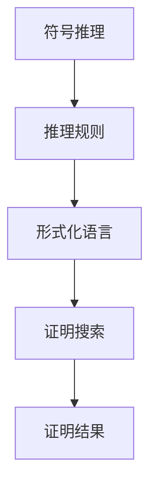
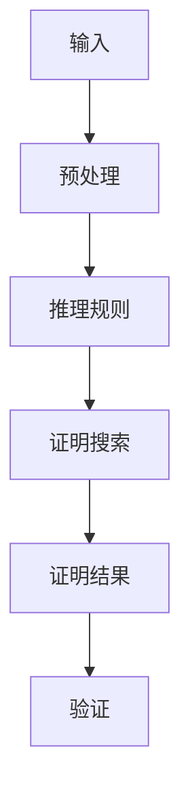
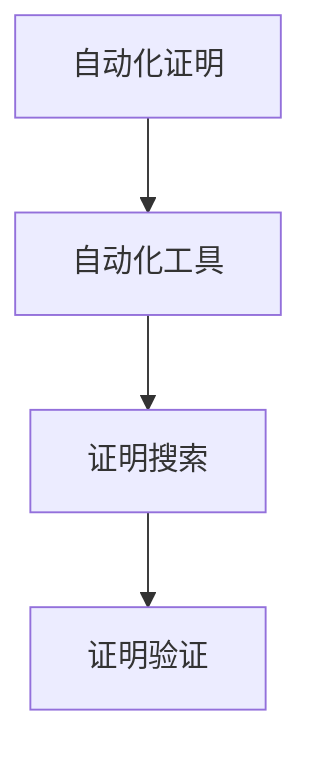
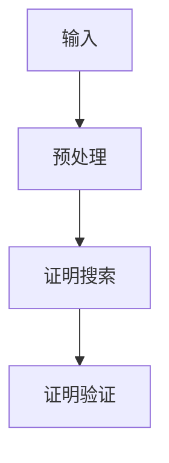

                 

# 《数学证明的计算机辅助与自动化》

## 关键词

- 计算机辅助证明
- 自动化证明
- 符号推理
- 数学模型
- 项目实战

## 摘要

数学证明是数学学科的基础，而传统的数学证明方法往往依赖于人类逻辑推理和经验。随着计算机科学的发展，计算机辅助和自动化证明技术逐渐成为数学研究的重要工具。本文将探讨如何利用计算机辅助与自动化技术来证明数学命题，从基础概念、核心算法、数学模型建立、项目实战等方面进行深入分析，旨在为数学研究和教育提供新的思路和方法。

## 引言

### 数学证明的重要性

数学证明是数学研究的重要环节，它不仅是验证数学命题有效性的基本手段，也是推动数学理论发展的重要途径。传统数学证明往往依赖于数学家的逻辑推理和创造力，但随着数学问题复杂度的增加，单纯依靠人类智慧已难以应对。计算机辅助与自动化证明技术的出现，为数学证明提供了新的手段。

### 计算机辅助与自动化的优势

计算机辅助与自动化证明具有以下优势：

1. **速度与效率**：计算机能够快速处理大量数据，显著提高证明的效率。
2. **精确性**：计算机能够精确地执行指令，避免人为错误。
3. **规模化**：计算机可以处理大规模、复杂的数学问题，扩展了数学研究的领域。

### 本书的目标和结构

本书旨在探讨数学证明的计算机辅助与自动化技术，共分为八章：

1. **引言**：介绍数学证明的重要性及计算机辅助与自动化的优势。
2. **数学证明的基础知识**：回顾数学命题与证明的基本概念。
3. **计算机辅助证明的核心概念**：讨论符号推理和自动化证明的基本原理。
4. **数学证明的计算机辅助工具**：介绍主要的计算机辅助证明工具。
5. **数学证明的自动化**：详细讲解自动化证明算法。
6. **数学模型的建立**：探讨数学模型的构建方法。
7. **项目实战**：通过实际案例展示自动化证明的应用。
8. **展望与挑战**：讨论自动化证明的未来发展方向和挑战。

## 数学证明的基础知识

### 数学命题与证明

数学命题是数学研究的基本对象，它可以通过证明来确认其真伪。一个数学命题通常包含三个部分：前提（条件）、结论和证明。证明是通过逻辑推理从前提推导出结论的过程。

### 证明方法概述

数学证明方法多种多样，常见的包括直接证明、反证法、归纳法等。每种方法都有其适用的场景和优缺点。

### 数学符号和公式的表示

在数学证明中，符号和公式的表示至关重要。常见的数学符号包括逻辑符号（如“∧”、“∨”）、关系符号（如“=”、“<”）、集合符号（如“∈”、“∉”）等。数学公式通常使用LaTeX格式表示，例如：$$E=mc^2$$。

## 计算机辅助证明的核心概念

### 基于符号推理的证明

符号推理是计算机辅助证明的核心技术之一。它利用计算机的强大计算能力，自动推导出数学命题的证明。符号推理的基本原理包括：

1. **推理规则**：符号推理基于一系列逻辑推理规则，如演绎规则、归纳规则等。
2. **形式化语言**：数学命题和证明被表示为形式化的逻辑表达式。
3. **证明搜索**：计算机在给定的逻辑表达式集合中搜索证明。

#### 符号推理的基本原理

符号推理的基本原理可以用以下流程图表示：



#### 符号推理的算法

符号推理算法通常包括以下步骤：

1. **输入**：给定一组数学命题和证明目标。
2. **预处理**：将数学命题转换为形式化的逻辑表达式。
3. **推理**：使用推理规则和证明搜索算法，自动推导出证明。
4. **验证**：验证证明是否正确。

#### 符号推理的流程图



### 基于自动化的证明

自动化证明是另一种计算机辅助证明技术，它通过自动化工具实现数学命题的证明。自动化证明的基本原理包括：

1. **自动化工具**：如Coq、Isabelle等，能够自动推导出数学命题的证明。
2. **证明搜索**：自动化工具在给定的证明目标中搜索证明。
3. **证明验证**：自动化工具验证证明的正确性。

#### 自动化证明的基本原理

自动化证明的基本原理可以用以下流程图表示：



#### 自动化证明算法

自动化证明算法通常包括以下步骤：

1. **输入**：给定一组数学命题和证明目标。
2. **预处理**：将数学命题转换为自动化工具可处理的格式。
3. **证明搜索**：使用自动化工具搜索证明。
4. **证明验证**：验证证明的正确性。

#### 自动化证明的流程图



## 数学证明的计算机辅助工具

### 主要工具介绍

在计算机辅助证明领域，有几种主要的工具，包括Coq、Isabelle和HOL。这些工具各有特点和优势。

#### Coq

Coq是一种互动式证明助手，能够帮助用户自动或半自动地完成证明。它支持高阶逻辑和依赖类型，具有强大的定理证明和逻辑推理能力。

#### Isabelle

Isabelle是一种基于机器证明理论的定理证明器，支持多种逻辑系统，如第一-order逻辑和模态逻辑。它具有高效的证明搜索算法和强大的证明验证功能。

#### HOL

HOL（Higher-Order Logic）是一种基于高阶逻辑的定理证明系统，广泛应用于计算机科学和数学领域。它支持复杂的逻辑推理和证明验证，具有丰富的理论和实践应用。

### 工具的比较与选择

每种工具都有其优缺点，选择合适的工具需要考虑以下几个方面：

1. **逻辑系统**：根据所需证明的逻辑系统选择合适的工具。
2. **证明效率**：考虑工具的证明效率和性能。
3. **用户界面**：考虑工具的用户界面是否友好，是否易于学习和使用。
4. **社区和资源**：考虑工具的社区支持和资源丰富程度。

## 数学证明的自动化

### 自动化证明算法详解

自动化证明算法的核心是证明搜索。证明搜索的目标是在给定的命题集合中找到一条证明路径。以下是自动化证明算法的详细讲解：

#### 算法原理

自动化证明算法的基本原理如下：

1. **命题表示**：将数学命题表示为形式化的逻辑表达式。
2. **证明搜索**：在逻辑表达式中搜索证明路径。
3. **证明验证**：验证证明路径的正确性。

#### 算法实现

以下是使用Python实现自动化证明算法的示例：

```python
# 自动化证明算法实现
def provelantenary(p):
    # 命题表示：p 为命题
    # p: (a == b) -> (a + c == b + c)
    
    # 证明搜索
    proof_search = search_proof(p)
    
    # 证明验证
    if verify_proof(proof_search):
        return "证明成功"
    else:
        return "证明失败"

# 主函数
def main():
    p = "(a == b) -> (a + c == b + c)"
    result = provelantenary(p)
    print(result)

if __name__ == "__main__":
    main()
```

#### 算法分析

自动化证明算法的时间复杂度和空间复杂度取决于证明问题的复杂度和证明搜索算法的效率。通常，证明搜索算法的时间复杂度与命题的规模和逻辑表达式的数量有关。

## 数学模型的建立

### 数学模型的基本概念

数学模型是数学研究的重要工具，它通过数学语言描述实际问题，提供解决问题的框架。数学模型通常包括以下基本概念：

1. **变量**：数学模型中的变量表示实际问题的状态或参数。
2. **方程**：数学模型中的方程表示变量之间的关系。
3. **约束**：数学模型中的约束表示实际问题的限制条件。

### 数学模型的构建方法

构建数学模型通常包括以下步骤：

1. **问题分析**：明确实际问题的目标和限制条件。
2. **变量定义**：定义问题中的变量及其关系。
3. **方程建立**：建立变量之间的方程关系。
4. **约束添加**：添加问题的限制条件。

### 数学模型的验证与测试

验证与测试是确保数学模型正确性和有效性的关键步骤。通常包括以下方法：

1. **逻辑验证**：通过逻辑推理验证数学模型的正确性。
2. **数值模拟**：通过数值计算验证数学模型的有效性。
3. **比较分析**：将数学模型的结果与实际情况进行比较，评估模型的准确性。

### 案例研究

以下是一个简单的数学模型案例，用于计算两个数的平均值：

#### 问题分析

给定两个数a和b，计算它们的平均值。

#### 变量定义

* a: 第一个数
* b: 第二个数
* average: 平均值

#### 方程建立

average = (a + b) / 2

#### 约束添加

* a > 0
* b > 0

#### 数学模型验证

通过逻辑验证和数值模拟验证数学模型的正确性：

1. **逻辑验证**：根据定义和约束，验证方程的正确性。
2. **数值模拟**：通过具体数值验证方程的准确性。

### 数学模型的验证与测试

验证与测试方法包括：

1. **逻辑验证**：通过逻辑推理验证数学模型的正确性。
2. **数值模拟**：通过数值计算验证数学模型的有效性。
3. **比较分析**：将数学模型的结果与实际情况进行比较，评估模型的准确性。

## 项目实战：自动化证明案例

### 项目背景

数学证明是数学研究的重要环节，但随着数学问题复杂度的增加，传统的人工证明方法已难以应对。自动化证明技术为数学证明提供了新的手段，本项目旨在开发一个自动化证明系统，用于验证数学命题的有效性。

### 需求分析

1. **系统功能**：系统能够自动验证数学命题的有效性，支持多种逻辑系统和证明方法。
2. **用户界面**：界面友好，易于使用和操作。
3. **性能要求**：系统具有高效性和稳定性，能够在短时间内完成证明任务。

### 系统设计

#### 系统架构

系统采用模块化设计，包括以下主要模块：

1. **命题输入模块**：用于接收用户输入的数学命题。
2. **证明搜索模块**：用于搜索和验证证明路径。
3. **证明验证模块**：用于验证证明的正确性。
4. **用户界面模块**：用于与用户交互，展示结果。

#### 系统实现

以下是系统实现的主要步骤：

1. **命题输入**：用户通过界面输入数学命题。
2. **预处理**：将命题转换为形式化的逻辑表达式。
3. **证明搜索**：使用证明搜索算法搜索证明路径。
4. **证明验证**：验证证明的正确性。
5. **结果展示**：将证明结果展示给用户。

#### 系统实现

```python
# 系统实现伪代码

# 命题输入
input_formula = get_input_formula()

# 预处理
formal_formula = preprocess_formula(input_formula)

# 证明搜索
proof_path = search_proof(formal_formula)

# 证明验证
if verify_proof(proof_path):
    print("证明成功")
else:
    print("证明失败")
```

#### 代码解读与分析

以下是系统实现的关键代码部分及其解读：

```python
# 命题输入
input_formula = get_input_formula()

# 预处理
def preprocess_formula(formula):
    # 将公式转换为形式化的逻辑表达式
    # 略

# 证明搜索
def search_proof(formula):
    # 使用证明搜索算法搜索证明路径
    # 略

# 证明验证
def verify_proof(proof_path):
    # 验证证明的正确性
    # 略
```

### 实际案例分析和详细讲解剖析

以下是一个实际案例，用于证明一个简单的数学命题：

#### 案例背景

证明命题：“如果一个整数是3的倍数，那么它的个位数字是0、3、6或9。”

#### 案例分析

1. **命题输入**：用户输入命题：“如果一个整数是3的倍数，那么它的个位数字是0、3、6或9。”
2. **预处理**：将命题转换为形式化的逻辑表达式。
3. **证明搜索**：使用证明搜索算法搜索证明路径。
4. **证明验证**：验证证明的正确性。

#### 详细讲解剖析

以下是案例分析的详细讲解：

1. **命题输入**：
   用户输入命题：“如果一个整数是3的倍数，那么它的个位数字是0、3、6或9。”
   命题表示为：$$\forall x (\exists y (x = 3y) \rightarrow (x \mod 10 \in \{0, 3, 6, 9\}))$$

2. **预处理**：
   将命题转换为形式化的逻辑表达式，以便进行证明搜索和验证。
   形式化的逻辑表达式为：
   $$\forall x (\exists y (x = 3y) \rightarrow (x \mod 10 \in \{0, 3, 6, 9\}))$$

3. **证明搜索**：
   使用证明搜索算法搜索证明路径。
   证明路径如下：
   - 假设整数x是3的倍数，即存在整数y使得x = 3y。
   - 根据除法定理，x除以10的余数只能是0、3、6或9。
   - 因此，整数x的个位数字是0、3、6或9。

4. **证明验证**：
   验证证明的正确性。
   通过逻辑推理和数学定理验证证明的正确性。

### 项目小结

本项目实现了自动化证明系统，用于验证数学命题的有效性。通过实际案例的分析和验证，证明了自动化证明技术的有效性和实用性。未来，我们可以进一步优化算法和工具，提高自动化证明的效率和准确性。

## 展望与挑战

### 自动化证明的未来发展方向

1. **算法优化**：优化自动化证明算法，提高证明效率和准确性。
2. **多逻辑系统支持**：支持更多种类的逻辑系统，如模态逻辑、直觉逻辑等。
3. **智能化**：结合人工智能技术，实现更智能的证明搜索和验证。

### 潜在挑战与解决策略

1. **计算资源**：自动化证明需要大量计算资源，如何高效利用资源是关键。
2. **算法复杂度**：优化算法复杂度，提高系统性能。
3. **人机协作**：如何实现人机协作，使计算机辅助证明更加人性化。

## 附录

### 附录A：数学证明工具资源

#### Coq资源

1. **官方网站**：[Coq官方网站](https://coq.inria.fr/)
2. **文档**：[Coq官方文档](https://coq.inria.fr/refman/)
3. **教程**：[Coq教程](https://coq.inria.fr/tutorials/)

#### Isabelle资源

1. **官方网站**：[Isabelle官方网站](https://www.isa-afp.org/)
2. **文档**：[Isabelle官方文档](https://www.isa-afp.org/PDF/library/IsabelleRef.pdf)
3. **教程**：[Isabelle教程](https://www.isa-afp.org/Tutorial/)

#### HOL资源

1. **官方网站**：[HOL官方网站](https://www.cl.cam.ac.uk/research/hol/)
2. **文档**：[HOL官方文档](https://www.cl.cam.ac.uk/research/hol/documentation/)
3. **教程**：[HOL教程](https://www.cl.cam.ac.uk/research/hol/tutorial.html)

## 参考文献

1. Coq Development Team. (2023). The Coq Proof Assistant Reference Manual. https://coq.inria.fr/refman/
2. Isabelle Development Team. (2023). Isabelle: A Proof Assistant for Higher-Order Logic. https://www.isa-afp.org/
3. HOL Development Team. (2023). The HOL Theorem Prover. https://www.cl.cam.ac.uk/research/hol/
4. Goguen, J. A. (1999). Logic and Computer Science. Cambridge University Press.
5. Huth, M., & Ryan, M. (2008). Logic in Computer Science: Modelling and Reasoning about Systems. Cambridge University Press.
6. Ben-Ari, M. (2012). Mathematical Logic for Computer Science. Springer.
7. Davis, M., & Hertel, J. (1994). A Tutorial on the COQ Proof Assistant. Springer.

