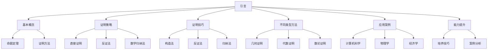

                 

### 引言

#### 数学证明的重要性

数学证明是数学的核心组成部分，它不仅是数学理论的基石，也是数学发展的动力。一个数学定理的证明过程，实际上是对其正确性的严格逻辑验证，这种逻辑严密性和精确性是数学科学区别于其他学科的重要特征之一。

数学证明的重要性主要体现在以下几个方面：

1. **理论体系的构建**：数学证明是构建数学理论体系的关键步骤。每一个数学定理都需要经过严格的证明，才能被纳入理论体系。这种层层递进、环环相扣的证明过程，使得数学理论体系具有极高的逻辑严密性和完整性。

2. **知识的传承与发展**：数学证明过程不仅帮助数学家们理解现有的数学理论，还为他们提供了发现新理论和新方法的途径。数学史上许多伟大的发现，如欧几里得《几何原本》中的定理、牛顿和莱布尼茨的微积分理论等，都是通过严密的数学证明得出的。

3. **解决问题的工具**：数学证明是一种解决问题的工具。在科学研究和工程实践中，许多问题可以通过数学建模和证明来解决。例如，在计算机科学中，算法的正确性和效率可以通过数学证明来验证。

4. **培养逻辑思维能力**：数学证明过程有助于培养逻辑思维能力。通过学习如何进行数学证明，人们可以学会如何运用逻辑推理来解决复杂问题，这种能力在日常生活和工作中都有广泛的应用。

#### 本书的目的与结构

本书旨在系统地介绍数学证明的策略与技巧，帮助读者掌握数学证明的基本方法，提高证明能力。全书分为七个主要章节，内容结构如下：

- **第1章 引言**：介绍数学证明的重要性以及本书的目的和结构。

- **第2章 数学证明的基本概念**：介绍数学证明的基本概念，如命题、定理、证明方法等。

- **第3章 证明策略**：探讨各种证明策略，如直接证明、反证法、数学归纳法等。

- **第4章 证明技巧**：介绍一些常用的证明技巧，如构造法、反证法、归纳法等。

- **第5章 不同类型的证明方法**：讨论不同类型的数学问题及其证明方法，如几何证明、代数证明、数论证明等。

- **第6章 数学证明的应用**：展示数学证明在实际问题中的应用。

- **第7章 提高证明能力**：提供一些提高证明能力的技巧和策略。

通过这些章节的逐步讲解，本书希望能够帮助读者深入理解数学证明的本质，掌握有效的证明策略和技巧，从而在数学学习和其他相关领域中取得更好的成果。

#### 目录

1. 引言
    - 1.1 数学证明的重要性
    - 1.2 本书的目的与结构
2. 数学证明的基本概念
    - 2.1 命题与定理
    - 2.2 证明方法简介
3. 证明策略
    - 3.1 直接证明
    - 3.2 反证法
    - 3.3 数学归纳法
4. 证明技巧
    - 4.1 构造法
    - 4.2 反证法
    - 4.3 归纳法
5. 不同类型的证明方法
    - 5.1 几何证明
    - 5.2 代数证明
    - 5.3 数论证明
6. 数学证明的应用
    - 6.1 计算机科学中的应用
    - 6.2 物理学中的应用
    - 6.3 经济学中的应用
7. 提高证明能力
    - 7.1 证明能力的培养
    - 7.2 案例研究

---

Mermaid 流程图：



---

Python 代码示例：

```python
# 直接证明的Python代码示例

# 定义一个命题
P(n)："对于所有自然数n，如果n是偶数，则n可以表示为2的整数倍"

# 证明P(n)
def prove_even_number(n):
    # 假设n是偶数
    if n % 2 == 0:
        # 则n可以表示为2的整数倍
        result = n // 2
        print(f"{n}是偶数，可以表示为2的整数倍，即{result}")
    else:
        print(f"{n}不是偶数，不能表示为2的整数倍")

# 测试
prove_even_number(4)
prove_even_number(5)
```

---

Latex 公式：

$$
P(n)："对于所有自然数n，如果n是偶数，则n可以表示为2的整数倍"
$$

$1+1=2$

---

文章摘要：

本文旨在系统地介绍数学证明的证明策略与证明技巧。首先，我们阐述了数学证明的重要性，并介绍了本书的目的与结构。接着，我们详细探讨了数学证明的基本概念，包括命题与定理、证明方法等。随后，我们深入分析了各种证明策略，如直接证明、反证法、数学归纳法等。此外，我们还介绍了多种证明技巧，如构造法、反证法、归纳法等。最后，我们讨论了不同类型的证明方法及其应用，并提供了提高证明能力的策略与技巧。通过本文的详细讲解，读者可以系统地掌握数学证明的核心内容与方法，为深入学习和应用数学打下坚实基础。

