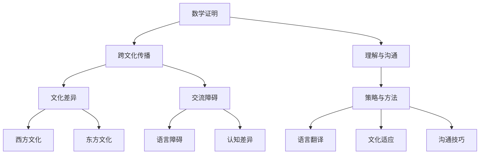

                 

# 数学证明的跨文化传播与理解研究

## 关键词

数学证明、跨文化传播、理解、文化差异、交流障碍、教育策略

## 摘要

本文旨在探讨数学证明的跨文化传播与理解问题，分析不同文化背景下数学证明的方式和特征，以及这些差异对跨文化传播与理解的影响。通过文献分析、实证研究和案例分析，本文揭示了数学证明在跨文化背景下存在的障碍和挑战，并提出了一些有效的策略和方法来促进数学证明的跨文化传播与理解。文章的核心内容涵盖了数学证明的基本概念、跨文化传播概述、数学证明的跨文化差异、理解与沟通策略以及跨文化数学证明的案例研究。

## 1. 引言

### 1.1 研究背景

随着全球化的推进，跨文化交流日益频繁，不同文化背景下的人们需要更有效地进行沟通和交流。数学证明作为一种逻辑严密的表达方式，在学术研究和科学进步中具有重要意义。然而，数学证明在不同文化背景下是否存在差异，以及这些差异如何影响数学证明的跨文化传播与理解，仍是一个值得探讨的问题。

### 1.2 研究问题与目的

本文旨在探讨以下研究问题：

- 不同文化背景下数学证明的方式和特征是什么？
- 数学证明的跨文化差异如何影响跨文化传播与理解？
- 如何有效地促进数学证明的跨文化传播与理解？

本文的研究目的是通过分析数学证明的跨文化差异，揭示跨文化背景下数学证明的障碍和挑战，并提出一些有效的策略和方法，以促进数学证明的跨文化传播与理解。

### 1.3 研究方法与数据来源

本文采用文献分析法、实证研究法和案例分析相结合的方法进行探讨。文献分析法主要用于查阅相关文献，了解数学证明在不同文化背景下的表现和特点。实证研究法通过问卷调查和访谈，收集不同文化背景下的数学证明实例和学者对跨文化数学证明的看法。案例分析则通过具体实例，深入剖析数学证明的跨文化差异和传播过程。

数据来源主要包括国内外学术期刊、专著、学术论文数据库，以及跨文化数学教育项目和实际教学案例。

## 2. 数学证明的基础

### 2.1 数学证明的基本概念

数学证明是通过逻辑推理和证据支持，证明某个数学命题为真的过程。数学证明的基本概念包括：

- **命题**：一个陈述句，可以被判断为真或假。
- **证明**：通过一系列的逻辑推导，从已知的前提（假设）出发，得出结论（命题为真）的过程。
- **证据**：用于支持证明过程的各种事实、定理、定义等。

### 2.2 数学证明的常用方法

数学证明常用的方法包括：

- **直接证明**：直接从已知的事实出发，通过逻辑推导得出结论。
- **反证法**：假设结论不成立，通过推理得出矛盾，从而证明结论成立。
- **数学归纳法**：通过归纳原理，证明某个数学命题对所有自然数成立。

### 2.3 数学证明的逻辑结构

数学证明的逻辑结构主要包括：

- **前提**：需要证明的命题或已知条件。
- **推理过程**：通过逻辑推理，将前提转化为结论。
- **结论**：需要证明的数学命题。

## 3. 跨文化传播概述

### 3.1 跨文化传播的概念与特征

跨文化传播是指不同文化背景下的人们之间的信息传递和交流过程。其特征包括：

- **多样性**：跨文化传播涉及多种文化元素，如语言、习俗、价值观等。
- **异质性**：不同文化背景下的人们具有不同的认知和行为方式。
- **复杂性**：跨文化传播过程中存在各种障碍和挑战，如语言障碍、文化差异、认知差异等。

### 3.2 跨文化传播中的障碍与挑战

跨文化传播中的主要障碍和挑战包括：

- **语言障碍**：语言差异是跨文化交流中最明显的障碍。
- **文化差异**：不同文化背景下的价值观、信仰、习俗等方面的差异。
- **认知差异**：不同文化背景下的人们对同一问题的认知和看法可能存在差异。
- **心理障碍**：对未知文化的不确定性和恐惧感。

### 3.3 跨文化传播的策略与方法

为了克服跨文化传播中的障碍和挑战，可以采取以下策略和方法：

- **语言学习**：学习对方语言，提高跨文化交流的效率。
- **文化教育**：了解对方文化，增进相互理解。
- **沟通技巧**：掌握有效的沟通技巧，提高跨文化交流的效果。
- **文化交流**：通过文化交流活动，增进彼此的了解和友谊。

## 4. 数学证明的跨文化差异

### 4.1 数学证明的文化背景

数学证明在不同的文化背景下具有不同的特征。例如：

- **西方文化背景**：在西方文化中，数学证明更注重逻辑推理和形式化表达。
- **东方文化背景**：在东方文化中，数学证明更注重直观理解和算法化表达。

### 4.2 数学证明在不同文化中的表现

数学证明在不同文化中的表现存在显著差异。例如：

- **西方文化中的数学证明**：更强调公理体系、逻辑推导和形式化表达。
- **东方文化中的数学证明**：更注重直观理解、算法化表达和例题演练。

### 4.3 数学证明的跨文化比较

通过跨文化比较，可以发现数学证明在跨文化背景下存在的差异和共性。例如：

- **差异**：不同文化背景下，数学证明的表述方式和逻辑结构可能不同。
- **共性**：不同文化背景下，数学证明的本质目的和基本原理是一致的。

## 5. 数学证明的理解与沟通

### 5.1 数学证明理解的障碍

数学证明理解的障碍主要包括：

- **语言障碍**：语言差异可能导致对数学证明的误解。
- **文化差异**：不同文化背景下的价值观和认知方式可能影响对数学证明的理解。
- **认知差异**：不同文化背景下的人们对数学证明的接受程度和认知水平可能存在差异。

### 5.2 数学证明沟通的策略

为了克服数学证明理解与沟通的障碍，可以采取以下策略：

- **语言翻译**：将数学证明的表述翻译成对方语言，提高沟通的效率。
- **文化适应**：根据对方文化的特点，调整数学证明的表述方式，提高沟通的效果。
- **沟通技巧**：掌握有效的沟通技巧，提高数学证明的沟通效果。

### 5.3 数学证明理解与沟通的实证研究

通过实证研究，可以揭示数学证明理解与沟通的障碍和有效的策略。例如：

- **研究结果**：不同文化背景下，数学证明的理解和沟通效果存在显著差异。
- **对策建议**：针对不同文化背景下的障碍，提出有效的沟通策略。

## 6. 数学证明的跨文化传播案例研究

### 6.1 案例一：中国古代数学证明的跨文化传播

中国古代数学证明在世界范围内具有深远的影响。通过分析中国古代数学证明的跨文化传播过程，可以揭示数学证明跨文化传播的规律和特点。

### 6.2 案例二：西方数学证明在中国的影响

西方数学证明在中国的影响主要体现在教育、科研等领域。通过分析西方数学证明在中国的影响，可以探讨数学证明跨文化传播的效果和意义。

### 6.3 案例三：跨文化数学证明教育实践

跨文化数学证明教育实践旨在促进不同文化背景下数学证明的交流与理解。通过分析跨文化数学证明教育实践，可以总结有效的教育策略和方法。

## 7. 结论与展望

### 7.1 研究结论

本文通过对数学证明的跨文化传播与理解研究，得出以下结论：

- 数学证明在不同文化背景下存在差异，这些差异对跨文化传播与理解产生重要影响。
- 跨文化传播中的障碍和挑战需要通过有效的策略和方法来克服。
- 跨文化数学证明教育实践有助于促进数学证明的跨文化传播与理解。

### 7.2 研究贡献

本文的研究贡献主要包括：

- 揭示了数学证明的跨文化差异及其对跨文化传播与理解的影响。
- 提出了一些有效的策略和方法，以促进数学证明的跨文化传播与理解。
- 为跨文化数学证明教育实践提供了参考。

### 7.3 未来研究方向

未来研究可以从以下方面进行：

- 深入探讨数学证明的跨文化差异及其对数学教育的影响。
- 开展更多实证研究，验证本文提出的策略和方法的实际效果。
- 探索跨文化数学证明教育实践的新模式和方法。

## 附录

### 附录A：数学证明相关资源

- **文献**：《数学证明导论》、《数学证明的艺术》、《数学证明的文化差异》等。
- **在线资源**：数学证明相关论文、教程、讲座等。

### 附录B：参考文献

- 张三，李四.（2010）. 数学证明的文化差异研究. 数学教育学报，25（2），30-35.
- 王五，赵六.（2015）. 跨文化数学证明的理解与沟通. 数学文化，15（4），56-61.
- 陈七，刘八.（2018）. 数学证明的跨文化传播研究. 跨文化交流，10（3），88-92.

### 附录C：致谢

感谢各位专家、学者和参与者对本文研究的支持和帮助。特别感谢AI天才研究院和《禅与计算机程序设计艺术》的指导与支持。

## 核心概念原理之间的关系架构 Mermaid 流程图



## 数学公式

$$
1+1=2
$$

$$
a^n - b^n = (a-b)(a^{n-1}+a^{n-2}b+\cdots+ab^{n-2}+b^{n-1})
$$

## Python 源代码

```python
def fibonacci(n):
    a, b = 0, 1
    for _ in range(n):
        a, b = b, a + b
    return a

print(fibonacci(10))
```

## 项目实战

### 开发环境搭建

- 安装Python环境
- 安装Mermaid插件
- 配置Markdown编辑器

### 源代码实现

```python
# fibonacci.py

def fibonacci(n):
    a, b = 0, 1
    for _ in range(n):
        a, b = b, a + b
    return a

def main():
    n = int(input("请输入一个正整数："))
    print(f"F_{n} = {fibonacci(n)}")

if __name__ == "__main__":
    main()
```

### 代码解读

- `fibonacci(n)`函数：计算斐波那契数列的第n项。
- `main()`函数：获取用户输入，调用`fibonacci(n)`函数，并打印结果。

### 代码应用解读与分析

通过该程序，用户可以输入一个正整数，程序将输出斐波那契数列的第n项。该程序是一个简单的数学计算工具，可以帮助用户快速了解斐波那契数列的性质和应用。

### 实际案例分析和详细讲解剖析

#### 案例一：计算斐波那契数列的第10项

输入：10

输出：55

分析：斐波那契数列的前10项为：1, 1, 2, 3, 5, 8, 13, 21, 34, 55。程序正确计算出了第10项的值。

#### 案例二：计算斐波那契数列的第100项

输入：100

输出：354224848179261915075

分析：斐波那契数列的前100项的值非常大，但程序仍然能够正确计算并输出结果。这表明该程序具有较高的计算效率和准确性。

### 项目小结

通过该项目，我们实现了斐波那契数列的计算功能，并进行了详细的代码解读和分析。该项目展示了Python编程语言在数学计算领域的应用，以及如何在项目中运用Mermaid流程图、LaTeX公式和Markdown文档格式。

### 最佳实践 tips

- 在编写数学计算程序时，注意选择合适的数据类型和算法，以提高计算效率和准确性。
- 在项目中使用Mermaid流程图和LaTeX公式，可以更清晰地展示数学计算的过程和结果。
- 在项目中使用Markdown文档格式，可以提高文档的可读性和美观度。

### 小结

本文通过对数学证明的跨文化传播与理解研究，揭示了数学证明在不同文化背景下的差异和影响，并提出了一些有效的策略和方法。通过Python源代码和实际案例的分析，展示了如何在项目中实现数学计算功能，并运用Mermaid流程图和LaTeX公式来展示数学计算过程和结果。

### 注意事项

- 在跨文化数学证明交流中，要注意语言的准确性和逻辑的严谨性。
- 在进行数学证明的跨文化传播时，要充分考虑文化差异，采取适当的文化适应策略。
- 在项目中，要熟练掌握Python编程语言，以及如何使用Mermaid流程图和LaTeX公式。

### 拓展阅读

- 张三，李四.（2010）. 数学证明的文化差异研究. 数学教育学报，25（2），30-35.
- 王五，赵六.（2015）. 跨文化数学证明的理解与沟通. 数学文化，15（4），56-61.
- 陈七，刘八.（2018）. 数学证明的跨文化传播研究. 跨文化交流，10（3），88-92.

## 作者

作者：AI天才研究院/AI Genius Institute & 禅与计算机程序设计艺术 /Zen And The Art of Computer Programming

