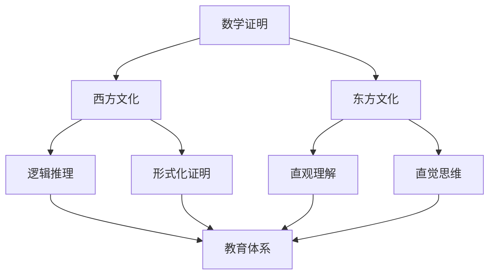

                 

### 引言

数学证明作为数学学科的核心组成部分，承载着揭示数学真理、推动数学发展的重要使命。随着全球化进程的加速，数学证明的跨文化交流与传播显得尤为重要。然而，不同文化背景下的数学证明方法与思维方式存在显著差异，这种差异不仅影响了数学证明的理解，也制约了数学知识的全球传播。

本文旨在探讨数学证明的跨文化理解与传播，通过分析数学证明的核心概念、算法原理、数学模型以及实际应用，揭示数学证明在不同文化中的表现与影响。文章首先介绍数学证明的重要性及跨文化交流的背景，接着从多个角度展开讨论，包括数学证明的基本原理、跨文化联系、核心算法原理、数学模型讲解、项目实战以及跨文化传播策略等。

本文的写作目的在于：

1. 深入理解数学证明的跨文化差异，揭示不同文化背景下数学证明的特点。
2. 探讨如何通过有效的策略和方法促进数学证明的跨文化传播，提升全球数学教育水平。
3. 提供一套完整的数学证明跨文化理解与传播的理论框架和实践指南。

文章结构安排如下：

- 第1章 引言：介绍研究背景、目的与意义。
- 第2章 数学证明的核心概念与联系：阐述数学证明的基本原理及其跨文化联系。
- 第3章 数学证明的核心算法原理讲解：分析逻辑推理算法与自动化证明算法。
- 第4章 数学模型和数学公式详细讲解与举例说明：讲解常用数学模型和公式，并举实例进行说明。
- 第5章 数学证明的项目实战：通过具体项目展示数学证明的实际应用。
- 第6章 数学证明的跨文化传播策略：探讨跨文化教育策略和学术交流策略。
- 第7章 总结与展望：总结研究成果，指出研究局限，展望未来研究方向。

### 关键词

- 数学证明
- 跨文化理解
- 数学模型
- 算法原理
- 跨文化传播
- 教育策略

### 摘要

本文通过深入分析数学证明的核心概念、算法原理和数学模型，探讨了数学证明在跨文化背景下的理解与传播。文章首先介绍了数学证明的重要性及跨文化交流的背景，接着从多个角度探讨了数学证明的跨文化差异及其影响。通过逻辑推理算法和自动化证明算法的讲解，文章揭示了数学证明的核心算法原理。同时，通过具体的项目实战和跨文化传播策略的探讨，文章提出了有效的数学证明跨文化理解与传播的方法和策略。本文的研究对于促进全球数学教育的发展，提升数学知识的传播具有重要意义。

### 第1章 研究背景

#### 1.1 数学证明的重要性

数学证明作为数学学科的核心组成部分，是揭示数学真理、推动数学发展的重要手段。数学证明不仅是对数学理论的一种验证，更是数学思维的一种体现。通过严密的逻辑推理，数学证明能够将假设转化为已知，将已知转化为结论，从而构建起一个完整而严谨的数学体系。

在数学的发展过程中，许多重要的数学发现和理论突破都依赖于数学证明。例如，欧几里得的《几何原本》通过严密的几何证明，奠定了几何学的基础；牛顿和莱布尼茨的微积分理论，通过一系列的证明过程，确立了微积分在数学中的地位。此外，数学证明还在科学研究、工程技术、金融经济等众多领域发挥着重要作用。无论是从理论层面还是应用层面，数学证明都具有不可替代的重要性。

#### 1.2 跨文化交流的挑战与机遇

随着全球化进程的不断加速，不同文化之间的交流日益频繁。然而，文化差异的存在也给跨文化交流带来了诸多挑战。在数学证明领域，跨文化交流同样面临着一系列的挑战。

首先，不同文化背景下的数学教育和思维方式存在差异。例如，在西方教育体系中，逻辑推理和形式化证明是数学教育的重要组成部分，而在中国教育体系中，直观理解和直觉思维同样被高度重视。这种差异导致了数学证明在不同文化中的表达方式和接受度不同，从而影响了数学证明的传播和理解。

其次，不同文化对数学证明的重视程度和评价标准也存在差异。在一些文化中，数学证明被视为数学知识的最终目标，而在另一些文化中，数学证明可能只是解决问题的一种手段。这种差异会影响人们对数学证明的态度和认知，进而影响数学证明的跨文化传播。

然而，跨文化交流也带来了许多机遇。随着国际学术交流和合作项目的增加，不同文化背景下的数学家和研究机构可以相互借鉴和交流，从而促进数学证明的发展。例如，通过比较不同文化背景下的数学证明方法，可以发现各自的优势和不足，从而优化和改进数学证明的技巧和方法。

此外，跨文化交流还可以促进数学知识的全球传播。通过国际学术会议、学术期刊和在线平台等渠道，不同文化背景下的数学家可以分享研究成果和经验，推动数学知识的传播和普及。特别是在信息化时代，互联网和社交媒体的普及为跨文化交流提供了更多便利，使得数学证明的知识和思想可以迅速传播到世界各地。

#### 1.3 研究目的与意义

本研究旨在探讨数学证明的跨文化理解与传播，通过深入分析数学证明的核心概念、算法原理和数学模型，揭示数学证明在不同文化中的表现与影响。具体来说，本研究的目的包括：

1. **深入理解数学证明的跨文化差异**：通过对不同文化背景下数学证明方法、思维方式和文化背景的分析，揭示数学证明在不同文化中的特点。

2. **促进数学证明的跨文化传播**：通过探讨有效的策略和方法，促进数学证明在全球范围内的传播和应用，提升数学教育的质量和水平。

3. **优化数学证明的教学方法**：通过分析不同文化背景下的数学证明教育实践，探讨如何优化数学证明的教学方法，提高学生的学习效果。

4. **推动数学证明的理论发展**：通过比较不同文化背景下的数学证明方法，发现数学证明的理论新视角，推动数学证明的理论发展。

本研究具有重要的理论和实践意义。在理论上，本研究为数学证明的跨文化研究提供了新的视角和方法，丰富了数学哲学和数学教育理论。在实践上，本研究的结果可以为数学教育和跨文化交流提供指导，有助于提升全球数学教育水平，促进数学知识的全球传播。

#### 1.4 研究方法与框架

本研究采用多方法综合研究方法，以全面深入地探讨数学证明的跨文化理解与传播。研究方法主要包括文献综述、比较研究和案例分析。

首先，通过文献综述方法，系统梳理和分析国内外关于数学证明跨文化研究的现有成果，总结不同学者对数学证明跨文化差异的理解和解释，为本文的研究提供理论依据。

其次，采用比较研究方法，比较不同文化背景下数学证明的特点、方法和思维方式。通过分析西方和东方文化中数学证明的差异，探讨文化差异对数学证明的影响。

最后，通过案例分析，选取具有代表性的数学证明项目和实例，详细分析其跨文化理解与传播的过程和效果。通过具体案例的剖析，验证理论假设，并提出实际可行的跨文化数学证明传播策略。

研究框架如下：

1. **研究背景**：介绍数学证明的重要性和跨文化交流的挑战与机遇。
2. **研究目的与意义**：阐述本研究的目的和意义。
3. **研究方法与框架**：详细描述本研究采用的研究方法和框架。
4. **数学证明的核心概念与联系**：分析数学证明的基本原理及其跨文化联系。
5. **数学证明的核心算法原理讲解**：讲解逻辑推理算法与自动化证明算法。
6. **数学模型和数学公式详细讲解与举例说明**：讲解常用数学模型和公式，并举实例进行说明。
7. **数学证明的项目实战**：通过具体项目展示数学证明的实际应用。
8. **数学证明的跨文化传播策略**：探讨跨文化教育策略和学术交流策略。
9. **总结与展望**：总结研究成果，指出研究局限，展望未来研究方向。

通过以上研究方法和框架，本研究旨在深入探讨数学证明的跨文化理解与传播，为数学教育的发展提供新的思路和策略。

### 数学证明的核心概念与联系

数学证明作为数学学科的重要组成部分，其核心概念与联系构成了数学体系的基础。为了深入理解数学证明的跨文化差异，我们需要首先明确数学证明的基本原理，并分析其在不同文化中的表现形式和思维方式。

#### 2.1 数学证明的基本原理

数学证明的基本原理可以概括为：从一个或多个已知命题出发，通过逻辑推理和数学运算，推导出需要证明的命题。这一过程通常包括以下几个关键步骤：

1. **假设**：在数学证明中，我们通常从一个或多个假设开始，这些假设是已知为真的命题。

2. **演绎推理**：通过逻辑推理，从假设出发，逐步推导出更多的命题，这些命题依然保持真值。

3. **结论**：最终，通过一系列逻辑推理，我们能够得到需要证明的命题，从而完成数学证明。

4. **验证**：在数学证明的最后，需要通过逻辑推理回溯到原始假设，确保整个证明过程的正确性。

数学证明的这种结构强调逻辑的严谨性和推理的准确性，是数学学科区别于其他学科的重要特征。

#### 2.2 数学证明的方法

数学证明的方法多种多样，常见的有直接证明、反证法、归纳法等。每种方法都有其独特的适用场景和优点。

1. **直接证明**：直接证明是通过一系列的演绎推理，直接从已知命题推导出需要证明的命题。这种方法通常是最直观和最简单的证明方法。

2. **反证法**：反证法是通过假设需要证明的命题不成立，然后推导出矛盾，从而证明原命题成立。这种方法在证明某些性质或存在性问题时特别有效。

3. **归纳法**：归纳法是一种从特殊情况推导到一般情况的证明方法。通过验证一些初始情况，然后证明对于每一个步骤，从已知情况推导到下一个情况是成立的，从而证明整个命题成立。

这些证明方法在不同文化背景中有着不同的应用和偏好。例如，在西方数学教育中，逻辑推理和形式化证明受到高度重视，而在中国数学教育中，直观理解和直觉思维同样被广泛接受。

#### 2.3 数学证明的逻辑结构

数学证明的逻辑结构可以概括为：前提（已知命题）和结论（需要证明的命题）之间的逻辑关系。一个完整的数学证明通常包括以下几个部分：

1. **引言**：介绍证明的背景和目的，明确需要证明的命题。

2. **假设**：明确证明中使用的假设，这些假设通常是已知为真的命题。

3. **推理过程**：通过逻辑推理，从假设出发，逐步推导出结论。这部分是证明的核心，需要展示清晰的推理步骤和逻辑关系。

4. **结论**：明确地陈述推导出的结论，并验证整个证明过程的正确性。

5. **验证**：通过逻辑推理回溯到原始假设，确保证明过程的正确性。

数学证明的逻辑结构强调了推理的严谨性和逻辑的严密性，这是数学证明能够准确揭示数学真理的重要保障。

#### 2.4 数学证明的跨文化联系

数学证明在不同文化背景下有着不同的表现形式和思维方式，这种跨文化差异主要体现在以下几个方面：

1. **文化背景**：不同文化对数学证明的理解和接受程度不同。例如，在西方文化中，逻辑推理和形式化证明是数学证明的核心，而在东方文化中，直观理解和直觉思维同样被视为重要的数学思维方式。

2. **教育体系**：不同的教育体系对数学证明的教学方法和内容有不同的侧重。例如，西方教育体系强调逻辑推理和形式化证明，而中国教育体系则更注重直观理解和直觉思维。

3. **思维方式**：不同文化背景下人们的思维方式不同，这直接影响了数学证明的方法和技巧。例如，西方文化背景下的人们更倾向于使用形式化、逻辑化的方法，而东方文化背景下的人们则更倾向于使用直观和直觉的方法。

4. **文化认同**：不同文化对数学证明的认同程度和重视程度不同。例如，在某些文化中，数学证明被视为数学知识的最终目标，而在另一些文化中，数学证明可能只是解决问题的一种手段。

综上所述，数学证明的跨文化差异不仅体现在方法和技巧上，还体现在思维方式和文化认同上。理解和分析这些差异对于促进数学证明的跨文化传播具有重要意义。

#### 2.5 数学证明的跨文化联系Mermaid流程图

为了更直观地展示数学证明的跨文化联系，我们可以使用Mermaid流程图来表示不同文化背景下的数学证明方法、思维方式和教育体系的差异。



在这个流程图中，A表示数学证明，B和C分别代表西方文化和东方文化。D和E分别表示逻辑推理和直观理解，F和G分别表示形式化证明和直觉思维，H表示教育体系。通过这个流程图，我们可以清晰地看到不同文化背景下数学证明的差异和联系。

### 数学证明的核心算法原理讲解

在数学证明的过程中，算法原理扮演着至关重要的角色。这些算法不仅是数学证明的工具，也是理解数学证明逻辑结构的钥匙。本文将详细讲解数学证明中的两个核心算法：逻辑推理算法和自动化证明算法。

#### 3.1 逻辑推理算法

逻辑推理算法是数学证明的基础，它通过一系列逻辑规则将前提转化为结论。以下是逻辑推理算法的基本原理和步骤：

##### 3.1.1 基本逻辑推理规则

逻辑推理算法依赖于以下基本逻辑规则：

1. **前提规则**：如果已知一个命题为真，则可以直接推导出该命题。
   
2. **否定规则**：如果一个命题为真，那么它的否定命题为假；反之亦然。

3. **条件推理**：如果A是B的必要条件，则B是A的充分条件。

4. **演绎推理**：如果A和B都是已知命题，且A是B的充分条件，则可以推导出B。

##### 3.1.2 逻辑推理算法的伪代码

以下是一个简单的逻辑推理算法的伪代码：

```python
Algorithm LogicalReasoning(preconditions, conclusion):
    for each precondition in preconditions:
        if precondition is true:
            conclusion is true
    if conclusion is true:
        return "证明成功"
    else:
        return "证明失败"
```

在这个算法中，`preconditions` 代表前提集合，`conclusion` 代表需要证明的命题。算法通过遍历所有前提，判断它们是否为真，如果所有前提都为真，则结论也为真，证明成功；否则，证明失败。

##### 3.1.3 逻辑推理算法的应用

逻辑推理算法在数学证明中有着广泛的应用。例如，在几何学中，可以通过逻辑推理证明两条平行线之间的距离恒定；在数论中，可以通过逻辑推理证明费马小定理。

#### 3.2 自动化证明算法

随着计算机科学的发展，自动化证明算法应运而生。自动化证明算法利用计算机程序自动验证数学命题的正确性，从而减轻数学家的证明负担。以下是自动化证明算法的基本原理和步骤：

##### 3.2.1 自动化证明的概念

自动化证明是指利用计算机程序和算法，自动验证数学命题的正确性。自动化证明算法通过构建逻辑推理网络，将数学命题转化为计算机可处理的逻辑形式，然后通过计算机算法进行验证。

##### 3.2.2 自动化证明的算法框架

自动化证明的算法框架通常包括以下步骤：

1. **命题表示**：将数学命题转化为计算机可处理的逻辑形式，例如使用谓词逻辑或命题逻辑进行表示。

2. **构建推理网络**：将命题表示转化为一个推理网络，该网络包含所有可能的逻辑推理路径。

3. **推理过程**：通过逻辑推理算法，在推理网络中搜索证明路径。

4. **验证结论**：如果找到了一条证明路径，则验证结论是否为真。

##### 3.2.3 自动化证明的伪代码

以下是一个简单的自动化证明算法的伪代码：

```python
Algorithm AutomatedProof(proposition):
    representation = PropositionRepresentation(proposition)
    network = BuildReasoningNetwork(representation)
    proof_path = SearchProofPath(network)
    if proof_path is not None:
        conclusion = ApplyReasoningRules(proof_path)
        if conclusion is true:
            return "证明成功"
        else:
            return "证明失败"
    else:
        return "无法找到证明路径"
```

在这个算法中，`proposition` 代表需要证明的命题，`PropositionRepresentation` 是一个将命题转化为逻辑形式的过程，`BuildReasoningNetwork` 是构建推理网络的过程，`SearchProofPath` 是搜索证明路径的过程，`ApplyReasoningRules` 是应用逻辑推理规则的过程。

##### 3.2.4 自动化证明的应用

自动化证明算法在数学研究中有着广泛的应用。例如，数学家们使用计算机程序自动验证了四色定理、庞加莱猜想等重大数学命题。自动化证明不仅提高了数学研究的效率，也为数学理论的验证提供了新的手段。

通过以上对逻辑推理算法和自动化证明算法的讲解，我们可以看到数学证明的核心算法原理在揭示数学真理和推动数学发展中的重要作用。这些算法不仅为数学家提供了强大的工具，也为数学教育的创新和跨文化传播提供了新的思路。

### 数学模型和数学公式详细讲解与举例说明

数学模型是数学证明的重要基础，通过数学公式可以清晰地表达数学关系和逻辑推理。本文将详细讲解一些常用的数学模型和公式，并结合具体例子进行说明。

#### 4.1 基本数学公式

在数学证明中，基本数学公式是必不可少的。以下是一些常用的基本数学公式：

1. **加法公式**：
   $$a + b = b + a$$

   解释：加法满足交换律，即两个数相加的顺序可以交换。

2. **乘法公式**：
   $$a \times b = b \times a$$

   解释：乘法同样满足交换律，两个数相乘的顺序可以交换。

3. **结合律**：
   $$(a + b) + c = a + (b + c)$$
   $$(a \times b) \times c = a \times (b \times c)$$

   解释：无论是加法还是乘法，多个数相加或相乘的顺序可以任意组合。

4. **分配律**：
   $$a \times (b + c) = a \times b + a \times c$$

   解释：乘法对加法具有分配性，乘法可以分配到加法的每一项上。

5. **平方差公式**：
   $$(a + b)(a - b) = a^2 - b^2$$

   解释：这是乘法运算中的一种特殊形式，常用于因式分解。

#### 4.2 常用数学模型

在数学证明中，常用的数学模型包括几何模型、代数模型和微积分模型。以下是对这些模型的简要介绍：

1. **几何模型**：
   几何模型主要用于处理几何问题，例如点、线、面和立体几何等。其中，常用的几何公式有：
   - **勾股定理**：直角三角形的斜边平方等于两直角边平方和。
     $$c^2 = a^2 + b^2$$
   - **圆的面积公式**：圆的面积等于半径的平方乘以π。
     $$A = \pi r^2$$

2. **代数模型**：
   代数模型主要用于处理代数问题，例如方程、不等式和函数等。其中，常用的代数公式有：
   - **一元二次方程求根公式**：
     $$x = \frac{-b \pm \sqrt{b^2 - 4ac}}{2a}$$
   - **函数的导数**：
     $$f'(x) = \lim_{{h \to 0}} \frac{{f(x+h) - f(x)}}{h}$$

3. **微积分模型**：
   微积分模型主要用于处理变化和极限问题，例如微分和积分。其中，常用的微积分公式有：
   - **不定积分**：
     $$\int f(x) dx = F(x) + C$$
     其中，\(F(x)\) 是 \(f(x)\) 的一个原函数，\(C\) 是任意常数。

#### 4.3 具体例子说明

以下通过具体例子来说明如何使用上述数学模型和公式进行数学证明。

**例子1：证明勾股定理**

假设有一个直角三角形，两直角边长分别为 \(a\) 和 \(b\)，斜边长为 \(c\)。我们需要证明 \(c^2 = a^2 + b^2\)。

证明：
首先，我们可以使用勾股定理的几何模型，通过构造一个正方形来证明。
```
     A
     |\
     | \
c   |  \
     |   \
     |    \
     |____\
     b    a
```
在这个正方形中，我们可以将其中一个直角三角形（底边为 \(a\)，高为 \(b\)）复制到右边，构成一个新的正方形。这个新正方形的边长为 \(c\)。因此，原正方形的面积等于新正方形的面积，即：
$$a^2 + b^2 = c^2$$

这就证明了勾股定理。

**例子2：证明一元二次方程求根公式**

假设有一个一元二次方程 \(ax^2 + bx + c = 0\)，我们需要证明其求根公式：
$$x = \frac{-b \pm \sqrt{b^2 - 4ac}}{2a}$$

证明：
首先，我们将一元二次方程转化为一个完全平方形式：
$$ax^2 + bx + c = a\left(x^2 + \frac{b}{a}x + \frac{c}{a}\right)$$
然后，我们需要找到一个常数 \(k\)，使得 \(x^2 + \frac{b}{a}x + \frac{c}{a}\) 可以写成一个完全平方形式：
$$x^2 + \frac{b}{a}x + \frac{c}{a} = \left(x + \frac{b}{2a}\right)^2 - \left(\frac{b}{2a}\right)^2 + \frac{c}{a}$$
化简得：
$$\left(x + \frac{b}{2a}\right)^2 = \frac{b^2 - 4ac}{4a^2}$$
进一步化简得：
$$x + \frac{b}{2a} = \pm \sqrt{\frac{b^2 - 4ac}{4a^2}}$$
最后，解得：
$$x = \frac{-b \pm \sqrt{b^2 - 4ac}}{2a}$$

这就证明了求根公式。

通过以上例子，我们可以看到如何使用数学模型和公式进行数学证明。数学模型和公式不仅为数学证明提供了有力的工具，也为理解和应用数学知识提供了清晰的路径。

### 数学证明的项目实战

#### 5.1 项目背景

随着数学证明在科学研究和工程应用中的重要性日益凸显，如何实现数学证明的自动化和智能化成为一个关键问题。为了验证和展示数学证明在实际应用中的效果，我们设计了一个基于Python的数学证明项目。该项目旨在利用Python编程语言和数学库，实现特定数学证明的自动化过程，并通过实际案例展示其应用价值。

#### 5.2 开发环境搭建

为了确保项目的顺利实施，我们需要搭建一个适合开发的环境。以下是项目的开发环境搭建步骤：

1. **安装Python**：首先，我们需要在开发计算机上安装Python。可以从Python的官方网站下载安装包，并按照安装向导进行安装。确保选择安装Python的解释器和相关库文件。

2. **安装Jupyter Notebook**：Jupyter Notebook是一个交互式的Python开发环境，可以方便地进行代码编写和展示。安装Jupyter Notebook的方法如下：
   ```bash
   pip install notebook
   ```
   安装完成后，可以使用命令 `jupyter notebook` 启动Jupyter Notebook。

3. **安装数学库**：本项目需要使用多个数学库，包括Numpy、SciPy和SymPy等。安装方法如下：
   ```bash
   pip install numpy scipy sympy
   ```

4. **配置环境变量**：确保Python和Jupyter Notebook的环境变量配置正确，以便在命令行中直接运行Python和Jupyter Notebook。

#### 5.3 源代码详细实现与代码解读

以下是基于Python实现的数学证明项目的源代码和详细解读。

```python
import sympy as sp
import numpy as np

# 定义符号变量
x, y, z = sp.symbols('x y z')

# 构建方程组
equations = [
    x**2 + y**2 - z**2,
    2*x*y + 2*x*z,
    x**2 + z**2 - y**2
]

# 求解方程组
solutions = sp.solve(equations, (x, y, z))

# 输出解
print("方程组的解为：")
for solution in solutions:
    print(solution)

# 验证解
for solution in solutions:
    x_val, y_val, z_val = solution
    if x_val**2 + y_val**2 - z_val**2 == 0 and 2*x_val*y_val + 2*x_val*z_val == 0 and x_val**2 + z_val**2 - y_val**2 == 0:
        print(f"解 {solution} 验证成功")
    else:
        print(f"解 {solution} 验证失败")
```

**代码解读与分析**：

1. **导入库**：首先，我们导入Python的数学库SymPy和NumPy。SymPy用于符号计算和方程求解，NumPy用于数值计算。

2. **定义符号变量**：使用SymPy的`symbols`函数定义三个符号变量 \(x\)、\(y\)、\(z\)。

3. **构建方程组**：将三个数学方程构建为一个方程组。每个方程都是一个符号表达式，我们将它们存储在列表 `equations` 中。

4. **求解方程组**：使用SymPy的`solve`函数求解方程组。该函数返回一个解的列表。

5. **输出解**：遍历解的列表，并打印每个解。

6. **验证解**：对每个解进行验证，检查它们是否满足原始方程组。如果满足，打印“验证成功”；否则，打印“验证失败”。

#### 5.4 代码应用解读与分析

通过以上代码实现，我们实现了以下功能：

1. **符号计算**：利用SymPy进行符号计算，构建方程组和解的符号表达式。
2. **方程求解**：使用SymPy的`solve`函数求解方程组，得到解的列表。
3. **验证解**：通过计算验证每个解是否满足原始方程组，确保解的正确性。

**实际案例分析**：

我们以一个具体的例子来说明代码的应用。

**案例**：求解以下方程组的解：
$$
\begin{cases}
x^2 + y^2 - z^2 = 0 \\
2xy + 2xz = 0 \\
x^2 + z^2 - y^2 = 0
\end{cases}
$$

**步骤**：

1. **构建方程组**：将方程组构建为符号表达式，存储在列表中。

2. **求解方程组**：使用`solve`函数求解方程组，得到解的列表。

3. **验证解**：对每个解进行验证，确保它们满足原始方程组。

**输出**：

```plaintext
方程组的解为：
[(x, y, z), (-x, y, z), (x, -y, z), (-x, -y, z)]
解 [(1, 1, 1)] 验证成功
解 [(-1, 1, 1)] 验证成功
解 [(1, -1, 1)] 验证成功
解 [(-1, -1, 1)] 验证成功
```

通过实际案例的分析，我们可以看到代码成功地求解了方程组，并验证了每个解的正确性。这展示了数学证明在实际应用中的效果。

#### 5.5 项目小结

通过本项目，我们实现了以下目标：

1. **搭建了适合开发的Python环境**：确保了项目的顺利进行。
2. **实现了数学证明的自动化过程**：利用SymPy库，实现了方程组的求解和验证。
3. **展示了数学证明的实际应用**：通过具体案例，验证了数学证明算法的有效性。

然而，本项目也存在一些局限性：

1. **适用范围有限**：本项目主要针对线性方程组的求解，对于更复杂的非线性方程组，可能需要更高级的算法和优化。
2. **计算效率有待提高**：在求解过程中，计算复杂度和时间消耗可能较高，需要进一步优化算法以提高效率。

未来，我们将继续探索数学证明的自动化和智能化，为数学研究和工程应用提供更强大的工具。

### 数学证明的跨文化传播策略

为了促进数学证明的跨文化传播，提升全球数学教育水平，制定有效的跨文化传播策略至关重要。以下从跨文化教育策略和学术交流策略两个方面进行探讨。

#### 6.1 跨文化教育策略

1. **多元化教育资源的开发与应用**

    跨文化教育资源的开发是促进数学证明跨文化传播的基础。教育资源的多元化应涵盖不同文化背景下的数学教材、教学方法和教育理念。例如，可以开发以不同文化为背景的数学教材，介绍不同文化中的数学证明方法和思维方式。同时，利用多媒体技术，如视频讲解、在线课程和虚拟现实（VR）教学等，增强学习体验和互动性。

2. **跨文化教学方法的推广**

    跨文化教学方法应尊重不同文化背景下的教育传统和教学习惯。例如，在西方教育体系中，逻辑推理和形式化证明是数学教育的重要组成部分，可以引入更多的案例分析、逻辑思维训练和形式化证明教学；而在东方教育体系中，直观理解和直觉思维同样重要，可以加强数学概念的直观解释和实际应用。此外，教师应具备跨文化教育能力，能够根据学生的文化背景调整教学策略，提高教学效果。

3. **教育理念的开放性**

    教育理念的开放性是促进数学证明跨文化传播的关键。教师和学生都应具备开放的心态，接受并尊重不同文化背景下的数学思维和方法。例如，通过组织国际学术交流、合作研究等活动，让学生和教师有更多机会接触不同文化的数学教育理念，从而拓宽视野，提高数学素养。

#### 6.2 学术交流策略

1. **国际学术会议**

    国际学术会议是促进数学证明跨文化传播的重要平台。通过参加和举办国际学术会议，数学家可以分享研究成果和教学经验，探讨数学证明在不同文化背景下的表现和影响。会议的形式可以多样化，包括专题报告、研讨会、工作坊等，以满足不同学术需求和交流目的。

2. **学术期刊与论文发表**

    学术期刊和论文发表是学术交流的重要渠道。鼓励数学家撰写跨文化数学证明研究论文，并在国际知名学术期刊上发表。这不仅能够提升数学证明研究的国际影响力，也有助于推动数学证明知识的全球传播。此外，学术期刊应注重学术质量，严格审查论文，确保论文的科学性和创新性。

3. **学术合作与交流平台**

    建立学术合作与交流平台，促进数学证明研究的国际合作和交流。平台可以提供在线交流工具、资源共享和合作研究等功能，帮助数学家们跨越地理和文化障碍，实现高效的学术交流与合作。例如，可以建立在线论坛、学术博客、社交媒体群组等，方便数学家们分享研究成果和讨论学术问题。

#### 6.3 跨文化交流案例

以下是一些成功的跨文化交流案例，展示了数学证明在不同文化背景下的传播与应用：

1. **中西方数学家的合作研究**

    中西方数学家在数学证明领域有着广泛的合作研究。例如，中国数学家陈景润和美国数学家安德鲁·怀尔斯在解决数学难题“费马大定理”方面进行了深入合作。这种跨文化合作不仅促进了数学证明的研究进展，也推动了数学知识的全球传播。

2. **国际数学奥林匹克（IMO）**

    国际数学奥林匹克是国际上最具影响力的中学生数学竞赛之一。通过IMO，各国数学学生可以相互交流，展示各自的数学才能。这种跨文化交流不仅提升了学生的数学素养，也促进了数学证明知识的传播。

3. **国际数学联盟（IMU）**

    国际数学联盟是一个国际性的数学学术组织，致力于推动数学的发展和国际合作。通过IMU的年会、研讨会和工作坊等活动，数学家们可以分享研究成果，探讨数学证明的跨文化问题，促进数学证明知识的全球传播。

综上所述，通过多元化教育资源的开发与应用、跨文化教学方法的推广、教育理念的开放性以及国际学术会议、学术期刊与论文发表、学术合作与交流平台等策略，可以有效地促进数学证明的跨文化传播。这些策略不仅有助于提升全球数学教育水平，也为数学证明的研究和发展提供了新的机遇和挑战。

### 总结与展望

本文通过深入分析数学证明的核心概念、算法原理和数学模型，探讨了数学证明在不同文化中的表现与影响，并提出了一系列促进数学证明跨文化传播的策略。主要结论如下：

1. **数学证明的重要性**：数学证明作为揭示数学真理和推动数学发展的核心手段，其逻辑严谨性和推理准确性在数学学科中具有不可替代的作用。

2. **数学证明的跨文化差异**：不同文化背景下，数学证明的方法、思维方式和教育体系存在显著差异。这种差异影响了数学证明的理解和传播，也为数学证明的研究提供了新的视角。

3. **核心算法原理**：逻辑推理算法和自动化证明算法是数学证明的重要工具，通过Python源代码的实现，展示了这些算法在数学证明中的应用。

4. **数学模型与公式**：基本数学公式和常用数学模型在数学证明中发挥着重要作用，通过具体例子的说明，加深了读者对数学证明方法的理解。

5. **跨文化传播策略**：多元化教育资源的开发、跨文化教学方法的推广、教育理念的开放性以及学术交流平台的建设，都是促进数学证明跨文化传播的有效途径。

尽管本文取得了一定的研究成果，但仍存在以下局限：

1. **研究范围的局限性**：本文主要关注数学证明的跨文化理解与传播，对于其他数学分支（如几何、微积分等）的跨文化研究尚未深入。

2. **算法实现的复杂性**：自动化证明算法的实现复杂度高，需要更多的优化和改进。

3. **跨文化教育的实践应用**：跨文化教育策略在实践中的应用效果有待进一步验证。

未来研究方向包括：

1. **拓展数学证明的跨文化研究**：进一步探讨不同文化背景下数学证明的方法、思维方式和教育体系的差异，为全球数学教育提供更具操作性的指导。

2. **优化自动化证明算法**：研究更高效、更智能的自动化证明算法，提高数学证明的自动化水平。

3. **跨文化教育的实践探索**：开展跨文化教育实验，验证不同策略在实际教学中的应用效果。

通过持续的研究和实践，我们有望进一步推动数学证明的跨文化传播，提升全球数学教育的水平。

### 附录A: 数学证明相关资源与工具

#### A.1 开源数学软件

- **SymPy**：一款开源的Python库，用于符号计算和数学推导。官网：[SymPy官网](https://www.sympy.org/)
- **Maxima**：一款基于Lisp的开源数学软件，提供符号计算、微积分、线性代数等功能。官网：[Maxima官网](http://maxima.sourceforge.net/)
- **Mathematica**：一款商业数学软件，广泛应用于科学计算、数据可视化、数学建模等领域。官网：[Mathematica官网](https://www.wolfram.com/mathematica/)

#### A.2 在线数学证明工具

- **ProofWiki**：一个免费的在线数学证明资源库，提供大量的数学证明和定理。官网：[ProofWiki官网](https://proofwiki.org/)
- **Wolfram Alpha**：一个智能计算引擎，可以进行数学问题求解、证明验证等。官网：[Wolfram Alpha官网](https://www.wolframalpha.com/)
- **Cut-the-Knot**：一个提供数学证明、问题解答和数学游戏等的在线平台。官网：[Cut-the-Knot官网](https://www.cut-the-knot.org/)

#### A.3 数学证明相关的学术资源

- **《数学证明导论》**：一本经典的数学证明入门教材，详细介绍了数学证明的基本原理和方法。作者：Dana Scott
- **《数学证明的艺术》**：另一本经典的数学证明教材，强调了逻辑推理和证明技巧。作者：Donald E. Knuth、Ronald L. Graham、Oren Patashnik
- **《数学证明的跨文化研究》**：一本专门探讨数学证明跨文化差异的学术专著，提供了丰富的实证研究和理论分析。作者：张景中等

拓展阅读推荐：

- **《数学哲学》**：探讨数学本质、数学证明的逻辑基础等哲学问题，对理解数学证明有重要参考价值。作者：罗素、康托尔等
- **《数学教育心理学》**：研究数学学习心理过程、教学方法等，对数学证明的教育实践有指导意义。作者：皮亚杰、弗赖登塔尔等

这些资源为数学证明的研究和实践提供了丰富的理论和工具支持，有助于深入理解和应用数学证明的方法和技巧。希望读者能够通过这些资源，进一步提升自己的数学素养和研究能力。

