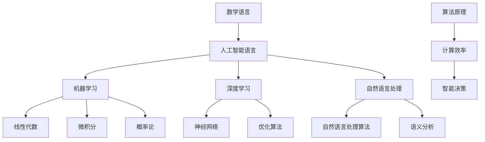

                 

# 《数学语言与人工智能语言的交互研究》

## 关键词
- 数学语言
- 人工智能语言
- 机器学习
- 深度学习
- 自然语言处理
- 算法原理
- 交互机制

## 摘要
本文旨在探讨数学语言与人工智能语言之间的交互研究，通过深入剖析数学语言在人工智能中的应用和数学原理在人工智能语言中的体现，揭示两者之间的紧密联系。文章首先介绍了数学语言和人工智能语言的基本概念，然后详细探讨了数学语言在机器学习、深度学习和自然语言处理中的应用，接着阐述了人工智能语言中的数学基础和核心算法。通过具体的案例研究和项目实战，本文进一步展示了数学语言与人工智能语言交互的实际应用效果，并提出了未来研究的展望。

---

## 第一部分：引论

### 第1章：研究背景与意义

#### 1.1 研究背景

数学语言与人工智能语言的交互研究是一个多学科交叉的领域，涉及数学、计算机科学、认知科学等多个领域。随着人工智能技术的快速发展，机器学习、深度学习和自然语言处理等应用场景不断涌现，数学语言在人工智能语言中的重要性日益凸显。

数学语言作为一种精确、严谨的表达方式，可以清晰地描述数据结构、算法原理和计算过程。而人工智能语言则是为了模拟人类智能而设计的一套表达和操作体系。两者的结合使得人工智能系统能够更好地理解和处理复杂的问题。

#### 1.2 研究意义

数学语言与人工智能语言的交互研究具有重要的理论和实践意义：

1. **提高人工智能系统效率**：通过数学语言的精确描述，可以提高人工智能系统的计算效率，优化算法性能。
2. **促进跨学科研究**：数学语言与人工智能语言的交互研究可以促进不同学科之间的交流与合作，推动人工智能技术的发展。
3. **提升智能决策能力**：数学语言在人工智能语言中的应用，可以增强人工智能系统的智能决策能力，为复杂问题提供有效的解决方案。

#### 1.3 研究目标

本文旨在实现以下研究目标：

1. **深入理解数学语言与人工智能语言之间的交互机制**：通过分析两者之间的联系，揭示数学语言在人工智能语言中的作用和影响。
2. **探讨数学语言在人工智能中的应用**：研究数学语言在机器学习、深度学习和自然语言处理中的应用，并分析其优势和不足。
3. **提出数学语言与人工智能语言交互的未来研究方向**：针对现有研究的不足，提出未来研究的方向和建议，为人工智能技术的发展提供理论支持。

### 第2章：数学语言与人工智能语言的概述

#### 2.1 数学语言的概念

数学语言是一种用于表达数学概念、原理和计算过程的符号系统。它包括符号、公式、图表等，具有高度的精确性和抽象性。数学语言的基本要素包括：

1. **符号**：用于表示数学概念和运算的符号，如加号（+）、减号（-）、乘号（×）等。
2. **公式**：用符号和字母表示的数学表达式，如 $a+b=c$、$f(x)=x^2$ 等。
3. **图表**：用图形表示数学关系的图表，如坐标图、曲线图、散点图等。

#### 2.2 人工智能语言的概念

人工智能语言是一种用于描述和操作人工智能系统行为的符号系统。它包括自然语言、编程语言、符号逻辑等。人工智能语言的基本要素包括：

1. **自然语言**：用于人类交流的语言，如英语、中文等。
2. **编程语言**：用于编写计算机程序的符号系统，如 Python、C++、Java 等。
3. **符号逻辑**：用于表示逻辑关系和推理的符号系统，如命题逻辑、谓词逻辑等。

#### 2.3 两者之间的联系

数学语言与人工智能语言之间的联系主要体现在以下几个方面：

1. **符号系统的融合**：数学语言的符号系统可以与人工智能语言的符号系统相结合，形成更强大、更精确的表达能力。
2. **算法原理的描述**：数学语言可以用来描述人工智能算法的原理和计算过程，为人工智能系统的设计和优化提供理论支持。
3. **问题求解的方法**：数学语言和人工智能语言可以共同用于解决复杂问题，实现智能决策和优化。

为了更好地理解数学语言与人工智能语言之间的联系，下面我们使用 Mermaid 流程图来展示两者的交互关系：



通过上述流程图，我们可以看出数学语言在人工智能语言中的应用场景，以及数学原理在人工智能算法中的体现。

### 第3章：数学语言在人工智能中的应用

#### 3.1 数学语言在机器学习中的应用

机器学习是人工智能的核心分支之一，其理论基础涉及到多种数学方法，如线性代数、概率论和优化算法等。以下是数学语言在机器学习中的具体应用：

1. **线性代数**：线性代数在机器学习中的应用主要体现在数据表示和模型优化方面。例如，线性回归模型中的系数可以通过最小二乘法求解，而特征提取过程中常常需要使用矩阵变换来降低数据维度。

2. **概率论**：概率论在机器学习中的应用主要体现在概率分布和假设检验方面。例如，贝叶斯网络和隐马尔可夫模型都是基于概率论原理构建的机器学习模型。

3. **优化算法**：优化算法在机器学习中的应用主要体现在模型训练和参数优化方面。例如，梯度下降法是一种常用的优化算法，可以用于求解最小化损失函数的问题。

以下是一个使用 Python 编写的线性回归模型的示例代码：

```python
import numpy as np

# 模型参数
theta = np.array([0, 0])

# 数据集
X = np.array([[1, 2], [2, 3], [3, 4], [4, 5]])
y = np.array([3, 4, 5, 6])

# 梯度下降法
alpha = 0.01
num_iters = 1000

for i in range(num_iters):
    # 预测值
    h = X.dot(theta)
    
    # 损失函数
    error = h - y
    
    # 更新模型参数
    theta = theta - alpha * X.T.dot(error)

print("最优解：", theta)
```

#### 3.2 数学语言在深度学习中的应用

深度学习是人工智能的一个重要分支，其理论基础主要依赖于神经网络和优化算法。以下是数学语言在深度学习中的具体应用：

1. **神经网络**：神经网络是一种基于数学原理构建的机器学习模型，其核心思想是通过层层传递信息来提取特征。神经网络中常用的数学工具包括线性代数、微积分和优化算法。

2. **优化算法**：优化算法在深度学习中的应用主要体现在模型训练和参数优化方面。常见的优化算法有梯度下降法、随机梯度下降法、Adam优化器等。

以下是一个使用 Python 和 TensorFlow 框架实现的卷积神经网络（CNN）的示例代码：

```python
import tensorflow as tf

# 定义输入层
inputs = tf.keras.Input(shape=(28, 28, 1))

# 第一层卷积层
x = tf.keras.layers.Conv2D(32, (3, 3), activation='relu')(inputs)

# 第二层卷积层
x = tf.keras.layers.Conv2D(64, (3, 3), activation='relu')(x)

# 池化层
x = tf.keras.layers.MaxPooling2D((2, 2))(x)

# 平铺层
x = tf.keras.layers.Flatten()(x)

# 全连接层
x = tf.keras.layers.Dense(64, activation='relu')(x)

# 输出层
outputs = tf.keras.layers.Dense(10, activation='softmax')(x)

# 构建模型
model = tf.keras.Model(inputs=inputs, outputs=outputs)

# 编译模型
model.compile(optimizer='adam', loss='categorical_crossentropy', metrics=['accuracy'])

# 训练模型
model.fit(X_train, y_train, epochs=10, batch_size=32)
```

#### 3.3 数学语言在自然语言处理中的应用

自然语言处理是人工智能领域的一个重要分支，其目标是将自然语言转换为计算机可以理解和处理的形式。以下是数学语言在自然语言处理中的具体应用：

1. **词嵌入**：词嵌入是一种将词语映射到高维空间的方法，其理论基础主要依赖于线性代数和概率论。词嵌入可以用于表示词语的语义关系和句法关系。

2. **序列模型**：序列模型是一种用于处理序列数据（如文本、语音等）的机器学习模型，其核心思想是通过层层传递信息来提取特征。序列模型中常用的数学工具包括循环神经网络（RNN）、长短时记忆网络（LSTM）和门控循环单元（GRU）。

3. **文本分类**：文本分类是一种将文本数据分类到预定义类别中的任务，其理论基础主要依赖于分类算法和概率论。常见的文本分类算法有朴素贝叶斯分类器、支持向量机（SVM）和深度学习模型。

以下是一个使用 Python 和 Keras 框架实现的文本分类模型的示例代码：

```python
from keras.preprocessing.text import Tokenizer
from keras.preprocessing.sequence import pad_sequences
from keras.models import Sequential
from keras.layers import Embedding, LSTM, Dense

# 定义文本数据
texts = ["This is a sentence.", "This is another sentence.", "This is the third sentence."]

# 定义标签
labels = [[0, 1], [1, 0], [1, 0]]

# 分词器
tokenizer = Tokenizer(num_words=100)
tokenizer.fit_on_texts(texts)

# 序列化文本
sequences = tokenizer.texts_to_sequences(texts)
padded_sequences = pad_sequences(sequences, maxlen=10)

# 构建模型
model = Sequential()
model.add(Embedding(100, 32))
model.add(LSTM(50))
model.add(Dense(2, activation='sigmoid'))

# 编译模型
model.compile(optimizer='adam', loss='binary_crossentropy', metrics=['accuracy'])

# 训练模型
model.fit(padded_sequences, labels, epochs=10)
```

通过以上示例代码，我们可以看到数学语言在自然语言处理中的应用，以及如何使用数学模型和算法来处理文本数据。

### 第二部分：人工智能语言中的数学原理

#### 第4章：人工智能语言中的数学基础

##### 4.1 线性代数基础

线性代数是人工智能语言中的重要数学工具，其基本概念和运算在人工智能算法中广泛应用。以下是线性代数的一些基本概念和公式：

1. **矩阵**：矩阵是一个由数字组成的二维数组，其行数和列数分别表示矩阵的维度。矩阵的基本运算包括加法、减法、乘法和转置。

   - 矩阵加法和减法：设 $A$ 和 $B$ 是两个同型矩阵，则 $A + B$ 和 $A - B$ 分别表示矩阵的对应元素相加和相减。
   - 矩阵乘法：设 $A$ 是一个 $m \times n$ 的矩阵，$B$ 是一个 $n \times p$ 的矩阵，则 $A \cdot B$ 是一个 $m \times p$ 的矩阵，其中 $(A \cdot B)_{ij} = \sum_{k=1}^{n} a_{ik}b_{kj}$。
   - 矩阵转置：设 $A$ 是一个 $m \times n$ 的矩阵，则 $A^T$ 是一个 $n \times m$ 的矩阵，其中 $(A^T)_{ij} = a_{ji}$。

2. **向量**：向量是一个由数字组成的一维数组，其长度表示向量的维度。向量的基本运算包括加法、减法和数乘。

   - 向量加法和减法：设 $\vec{a}$ 和 $\vec{b}$ 是两个同维向量，则 $\vec{a} + \vec{b}$ 和 $\vec{a} - \vec{b}$ 分别表示向量的对应元素相加和相减。
   - 数乘：设 $k$ 是一个标量，$\vec{a}$ 是一个向量，则 $k\vec{a}$ 表示向量的每个元素都乘以标量 $k$。

3. **行列式**：行列式是一个 $n \times n$ 矩阵的一个标量值，其计算方法如下：

   - 二阶行列式：设 $A$ 是一个 $2 \times 2$ 的矩阵，则 $\det(A) = a_{11}a_{22} - a_{12}a_{21}$。
   - 高阶行列式：设 $A$ 是一个 $n \times n$ 的矩阵，则 $\det(A)$ 可以通过拉普拉斯展开计算，即 $\det(A) = \sum_{\sigma \in S_n} (-1)^{\sigma} a_{1\sigma(1)}a_{2\sigma(2)} \cdots a_{n\sigma(n)}$，其中 $S_n$ 是所有 $n$ 个元素的全排列组成的集合。

4. **特征值和特征向量**：设 $A$ 是一个 $n \times n$ 的矩阵，$\lambda$ 是一个标量，$\vec{v}$ 是一个非零向量，如果满足 $A\vec{v} = \lambda\vec{v}$，则称 $\lambda$ 是 $A$ 的一个特征值，$\vec{v}$ 是 $A$ 的一个特征向量。

   - 特征值和特征向量的计算：可以通过求解特征方程 $\det(A - \lambda I) = 0$ 得到 $A$ 的特征值，然后通过代入特征方程求解对应的特征向量。

以下是使用 Python 和 NumPy 库实现的线性代数运算的示例代码：

```python
import numpy as np

# 创建矩阵
A = np.array([[1, 2], [3, 4]])

# 矩阵加法
B = np.array([[5, 6], [7, 8]])
C = A + B
print("矩阵加法：", C)

# 矩阵减法
D = A - B
print("矩阵减法：", D)

# 矩阵乘法
E = np.dot(A, B)
print("矩阵乘法：", E)

# 矩阵转置
F = A.T
print("矩阵转置：", F)

# 特征值和特征向量
 eigenvalues, eigenvectors = np.linalg.eig(A)
print("特征值：", eigenvalues)
print("特征向量：", eigenvectors)
```

##### 4.2 微积分基础

微积分是研究函数变化率和面积计算的数学分支，其基本概念和公式在人工智能算法中具有重要意义。以下是微积分的一些基本概念和公式：

1. **导数**：导数是函数在某一点处的变化率，用于描述函数在该点附近的局部性质。

   - 一元函数的导数：设 $f(x)$ 是一个可导函数，则 $f'(x)$ 表示 $f(x)$ 在 $x$ 点的导数，其计算公式为 $f'(x) = \lim_{h \to 0} \frac{f(x+h) - f(x)}{h}$。
   - 多元函数的导数：设 $f(x_1, x_2, \ldots, x_n)$ 是一个可导函数，则 $\frac{\partial f}{\partial x_i}$ 表示 $f(x_1, x_2, \ldots, x_n)$ 在 $x_i$ 方向上的导数，其计算公式为 $\frac{\partial f}{\partial x_i} = \lim_{h \to 0} \frac{f(x_1, x_2, \ldots, x_i+h, \ldots, x_n) - f(x_1, x_2, \ldots, x_n)}{h}$。

2. **微分**：微分是导数在无穷小变化下的表现形式，用于描述函数在某一点处的局部变化。

   - 一元函数的微分：设 $f(x)$ 是一个可导函数，则 $df(x) = f'(x)dx$ 表示 $f(x)$ 在 $x$ 点的微分。
   - 多元函数的微分：设 $f(x_1, x_2, \ldots, x_n)$ 是一个可导函数，则 $df(x_1, x_2, \ldots, x_n) = \frac{\partial f}{\partial x_1}dx_1 + \frac{\partial f}{\partial x_2}dx_2 + \ldots + \frac{\partial f}{\partial x_n}dx_n$ 表示 $f(x_1, x_2, \ldots, x_n)$ 在 $(x_1, x_2, \ldots, x_n)$ 点的微分。

3. **积分**：积分是导数的反操作，用于求解函数的面积、体积和曲线长度等。

   - 一元函数的不定积分：设 $f(x)$ 是一个可导函数，则 $F(x) = \int f(x)dx$ 表示 $f(x)$ 的一个原函数，其求解方法为求导得到 $F'(x) = f(x)$。
   - 一元函数的定积分：设 $f(x)$ 是一个在区间 $[a, b]$ 上连续的函数，则 $\int_{a}^{b} f(x)dx$ 表示 $f(x)$ 在区间 $[a, b]$ 上的定积分，其求解方法为利用牛顿-莱布尼茨公式。

4. **泰勒公式**：泰勒公式是一种用于近似函数值的方法，其核心思想是利用函数在某一点处的导数来构建一个多项式逼近函数。

   - 一元函数的泰勒公式：设 $f(x)$ 是一个在 $x_0$ 点可导的函数，则 $f(x) \approx f(x_0) + f'(x_0)(x - x_0) + \frac{f''(x_0)}{2!}(x - x_0)^2 + \ldots + \frac{f^{(n)}(x_0)}{n!}(x - x_0)^n$，其中 $n$ 是任意正整数。

以下是使用 Python 和 SymPy 库实现的微积分运算的示例代码：

```python
import sympy as sp

# 定义变量
x = sp.symbols('x')

# 定义函数
f = x**2

# 计算导数
f_prime = sp.diff(f, x)
print("导数：", f_prime)

# 计算微分
df = sp.diff(f, x)
print("微分：", df)

# 计算不定积分
F = sp.integrate(f, x)
print("不定积分：", F)

# 计算定积分
I = sp.integrate(f, (x, 0, 1))
print("定积分：", I)

# 计算泰勒公式
taylor_series = sp.series(f, x, 0, 4)
print("泰勒公式：", taylor_series)
```

##### 4.3 概率论基础

概率论是研究随机事件和随机变量的数学分支，其基本概念和公式在人工智能算法中具有重要意义。以下是概率论的一些基本概念和公式：

1. **概率**：概率是描述随机事件发生可能性的一种度量，其取值范围在 $0$ 和 $1$ 之间。

   - 古典概率：如果实验结果有限且每个结果等可能发生，则每个结果发生的概率相等，即 $P(A) = \frac{1}{n}$，其中 $A$ 是实验结果之一，$n$ 是实验结果的个数。
   - 条件概率：设 $A$ 和 $B$ 是两个随机事件，则 $P(B|A)$ 表示在事件 $A$ 发生的条件下事件 $B$ 发生的概率，其计算公式为 $P(B|A) = \frac{P(A \cap B)}{P(A)}$。
   - 独立事件：设 $A$ 和 $B$ 是两个随机事件，如果事件 $A$ 的发生不影响事件 $B$ 的发生，则称事件 $A$ 和事件 $B$ 相互独立，即 $P(A \cap B) = P(A)P(B)$。

2. **随机变量**：随机变量是一个用来表示随机事件结果的变量，其取值依赖于随机事件的概率分布。

   - 离散随机变量：如果随机变量的取值是离散的，则称其为离散随机变量，其概率分布可以用概率质量函数（PMF）表示，即 $P(X = x) = p(x)$。
   - 连续随机变量：如果随机变量的取值是连续的，则称其为连续随机变量，其概率分布可以用概率密度函数（PDF）表示，即 $f(x) = P(X \leq x)$。

3. **期望和方差**：期望和方差是描述随机变量取值分布的两个重要指标。

   - 期望：随机变量的期望值是随机变量取值的平均值，对于离散随机变量，其期望值计算公式为 $E(X) = \sum_{x} x \cdot p(x)$，对于连续随机变量，其期望值计算公式为 $E(X) = \int_{-\infty}^{+\infty} x \cdot f(x)dx$。
   - 方差：随机变量的方差是描述随机变量取值离散程度的一个度量，对于离散随机变量，其方差计算公式为 $Var(X) = \sum_{x} (x - E(X))^2 \cdot p(x)$，对于连续随机变量，其方差计算公式为 $Var(X) = \int_{-\infty}^{+\infty} (x - E(X))^2 \cdot f(x)dx$。

以下是使用 Python 和 NumPy 库实现的概率论运算的示例代码：

```python
import numpy as np

# 定义随机变量
x = np.random.normal(size=1000)

# 计算概率
P_x = np.mean(x < 0)
print("概率 P(X < 0)：", P_x)

# 计算期望
E_x = np.mean(x)
print("期望 E(X)：", E_x)

# 计算方差
V_x = np.var(x)
print("方差 Var(X)：", V_x)
```

### 第三部分：数学语言与人工智能语言的交互机制

#### 第6章：数学语言在人工智能模型中的作用

##### 6.1 数学语言在模型训练中的作用

在人工智能模型训练过程中，数学语言起到了至关重要的作用，特别是在优化算法和损失函数的设计方面。

1. **优化算法**：优化算法是用于求解最优化问题的算法，其核心思想是通过不断迭代来逼近最优解。常见的优化算法有梯度下降法、牛顿法和拟牛顿法等。

   - **梯度下降法**：梯度下降法是一种最简单的优化算法，其基本思想是沿着目标函数的梯度方向进行迭代，以逐渐逼近最优解。具体步骤如下：

     1. 初始化模型参数 $\theta$。
     2. 计算目标函数的梯度 $\nabla J(\theta)$。
     3. 更新模型参数 $\theta = \theta - \alpha \nabla J(\theta)$，其中 $\alpha$ 是学习率。
     4. 重复步骤 2 和 3，直到满足停止条件（如收敛阈值或最大迭代次数）。

     梯度下降法的一个关键问题是学习率的选取，学习率过大会导致参数更新不稳定，过小则会导致收敛速度过慢。为了解决这一问题，可以采用自适应学习率方法，如 Adagrad、Adam 和 RMSprop 等。

     ```python
     import numpy as np

     def gradient_descent(X, y, theta, alpha, num_iters):
         m = len(y)
         J_history = []

         for i in range(num_iters):
             h = X.dot(theta)
             error = h - y
             theta = theta - alpha * X.T.dot(error)
             J = 1/(2*m) * (error.T.dot(error))
             J_history.append(J)

         return theta, J_history

     theta = np.array([1, 1])
     alpha = 0.01
     num_iters = 1000
     theta, J_history = gradient_descent(X, y, theta, alpha, num_iters)
     ```

   - **牛顿法**：牛顿法是一种基于二阶导数的优化算法，其基本思想是通过求解目标函数的泰勒展开式的一阶和二阶近似来逼近最优解。具体步骤如下：

     1. 初始化模型参数 $\theta$。
     2. 计算目标函数的梯度 $\nabla J(\theta)$ 和二阶导数 $H(J(\theta))$。
     3. 求解 $J(\theta) - \nabla J(\theta) \cdot \theta - \frac{1}{2}\theta^T H(J(\theta)) \theta = 0$，得到新的参数 $\theta$。
     4. 重复步骤 2 和 3，直到满足停止条件。

     牛顿法的优点是收敛速度较快，但缺点是计算复杂度较高，特别是在高维情况下。

     ```python
     import numpy as np

     def newton_method(X, y, theta, alpha, num_iters):
         m = len(y)
         J_history = []

         for i in range(num_iters):
             h = X.dot(theta)
             error = h - y
             theta = theta - alpha * np.linalg.inv(np.dot(X.T.dot(X), X)).dot(X.T.dot(error))
             J = 1/(2*m) * (error.T.dot(error))
             J_history.append(J)

         return theta, J_history

     theta = np.array([1, 1])
     alpha = 0.01
     num_iters = 1000
     theta, J_history = newton_method(X, y, theta, alpha, num_iters)
     ```

   - **拟牛顿法**：拟牛顿法是一种基于一阶导数和二阶导数的近似算法，其基本思想是通过构造一个近似 Hessian 矩阵来逼近真实 Hessian 矩阵，从而求解最优解。常见的拟牛顿法有 Broyden-Fletcher-Goldfarb-Shanno（BFGS）算法和 Limited-memory BFGS（L-BFGS）算法。

     BFGS 算法的优点是计算复杂度较低，适用于高维问题，但缺点是收敛速度较慢。L-BFGS 算法是对 BFGS 算法的改进，其通过引入有限内存来加速收敛。

     ```python
     import scipy.optimize as opt

     def f(x):
         return (x[0]**2 + x[1]**2) / 2

     def df(x):
         return [x[0], x[1]]

     x0 = [1, 1]
     res = opt.minimize(f, x0, method='BFGS', jac=df)
     print("最优解：", res.x)
     ```

2. **损失函数**：损失函数是用于评估模型预测结果与真实结果之间差异的函数，其目的是使模型预测结果更接近真实结果。常见的损失函数有平方损失函数、交叉熵损失函数和 Hinge 损失函数等。

   - **平方损失函数**：平方损失函数是一种用于回归问题的损失函数，其计算公式为 $L(y, \hat{y}) = (y - \hat{y})^2$，其中 $y$ 是真实标签，$\hat{y}$ 是模型预测结果。平方损失函数的优点是计算简单，缺点是对于异常值敏感。

     ```python
     import numpy as np

     def squared_loss(y, y_pred):
         return np.mean((y - y_pred)**2)

     y = np.array([1, 2, 3, 4])
     y_pred = np.array([1.1, 1.9, 3.1, 4.8])
     loss = squared_loss(y, y_pred)
     print("平方损失：", loss)
     ```

   - **交叉熵损失函数**：交叉熵损失函数是一种用于分类问题的损失函数，其计算公式为 $L(y, \hat{y}) = -\sum_{i} y_i \log(\hat{y}_i)$，其中 $y$ 是真实标签（概率分布），$\hat{y}$ 是模型预测结果（概率分布）。交叉熵损失函数的优点是使模型更倾向于预测概率较高的类别，缺点是计算复杂度较高。

     ```python
     import numpy as np

     def cross_entropy_loss(y, y_pred):
         return -np.mean(y * np.log(y_pred))

     y = np.array([0, 1, 0, 1])
     y_pred = np.array([0.1, 0.9, 0.2, 0.8])
     loss = cross_entropy_loss(y, y_pred)
     print("交叉熵损失：", loss)
     ```

   - **Hinge 损失函数**：Hinge 损失函数是一种用于支持向量机（SVM）的损失函数，其计算公式为 $L(y, \hat{y}) = \max(0, 1 - y \cdot \hat{y})$，其中 $y$ 是真实标签，$\hat{y}$ 是模型预测结果。Hinge 损失函数的优点是使得模型在分类边界处更加平滑。

     ```python
     import numpy as np

     def hinge_loss(y, y_pred):
         return np.mean(np.maximum(0, 1 - y * y_pred))

     y = np.array([-1, 1, -1, 1])
     y_pred = np.array([0.5, 0.9, 0.1, 0.8])
     loss = hinge_loss(y, y_pred)
     print("Hinge损失：", loss)
     ```

##### 6.2 数学语言在模型优化中的作用

模型优化是人工智能模型训练的重要环节，其目的是通过调整模型参数来提高模型的预测性能。数学语言在模型优化中起到了关键作用，特别是在优化算法和损失函数的设计方面。

1. **梯度下降法**：梯度下降法是一种最简单的优化算法，其基本思想是沿着目标函数的梯度方向进行迭代，以逐渐逼近最优解。梯度下降法的优点是实现简单，缺点是收敛速度较慢。

   - **一维梯度下降法**：一维梯度下降法是在一个变量上应用梯度下降法，其基本思想是沿着目标函数的负梯度方向进行迭代。具体步骤如下：

     1. 初始化变量 $x$。
     2. 计算目标函数的梯度 $g(x)$。
     3. 更新变量 $x = x - \alpha g(x)$，其中 $\alpha$ 是学习率。
     4. 重复步骤 2 和 3，直到满足停止条件。

     ```python
     import numpy as np

     def gradient_descent(x, alpha, num_iters):
         x_history = []

         for i in range(num_iters):
             g = 2 * x
             x = x - alpha * g
             x_history.append(x)

         return x, x_history

     x = 5
     alpha = 0.1
     num_iters = 100
     x, x_history = gradient_descent(x, alpha, num_iters)
     ```

   - **多维梯度下降法**：多维梯度下降法是在多个变量上应用梯度下降法，其基本思想是沿着目标函数的负梯度方向进行迭代。具体步骤如下：

     1. 初始化模型参数 $\theta$。
     2. 计算目标函数的梯度 $\nabla J(\theta)$。
     3. 更新模型参数 $\theta = \theta - \alpha \nabla J(\theta)$，其中 $\alpha$ 是学习率。
     4. 重复步骤 2 和 3，直到满足停止条件。

     ```python
     import numpy as np

     def gradient_descent(theta, alpha, num_iters):
         theta_history = []

         for i in range(num_iters):
             J = np.linalg.norm(theta) ** 2
             g = 2 * theta
             theta = theta - alpha * g
             theta_history.append(theta)

         return theta, theta_history

     theta = np.array([1, 2])
     alpha = 0.1
     num_iters = 100
     theta, theta_history = gradient_descent(theta, alpha, num_iters)
     ```

2. **牛顿法**：牛顿法是一种基于二阶导数的优化算法，其基本思想是通过求解目标函数的泰勒展开式的一阶和二阶近似来逼近最优解。牛顿法的优点是收敛速度较快，缺点是计算复杂度较高。

   - **一维牛顿法**：一维牛顿法是在一个变量上应用牛顿法，其基本思想是求解一阶导数为零的方程。具体步骤如下：

     1. 初始化变量 $x$。
     2. 计算目标函数的梯度 $g(x)$ 和二阶导数 $h(x) = \frac{dg}{dx}$。
     3. 求解 $g(x) = 0$，得到新的变量 $x$。
     4. 重复步骤 2 和 3，直到满足停止条件。

     ```python
     import numpy as np

     def newton_method(x, alpha, num_iters):
         x_history = []

         for i in range(num_iters):
             g = 2 * x
             h = 2
             x = x - alpha * g / h
             x_history.append(x)

         return x, x_history

     x = 5
     alpha = 0.1
     num_iters = 100
     x, x_history = newton_method(x, alpha, num_iters)
     ```

   - **多维牛顿法**：多维牛顿法是在多个变量上应用牛顿法，其基本思想是求解一阶导数为零的方程。具体步骤如下：

     1. 初始化模型参数 $\theta$。
     2. 计算目标函数的梯度 $\nabla J(\theta)$ 和二阶导数 $H(J(\theta))$。
     3. 求解 $\nabla J(\theta) = 0$，得到新的模型参数 $\theta$。
     4. 重复步骤 2 和 3，直到满足停止条件。

     ```python
     import numpy as np

     def newton_method(theta, alpha, num_iters):
         theta_history = []

         for i in range(num_iters):
             J = np.linalg.norm(theta) ** 2
             g = 2 * theta
             H = 2 * np.eye(len(theta))
             theta = theta - alpha * np.linalg.inv(H).dot(g)
             theta_history.append(theta)

         return theta, theta_history

     theta = np.array([1, 2])
     alpha = 0.1
     num_iters = 100
     theta, theta_history = newton_method(theta, alpha, num_iters)
     ```

##### 6.3 数学语言在模型评估中的作用

模型评估是人工智能模型训练的重要环节，其目的是评估模型在未知数据上的预测性能。数学语言在模型评估中起到了关键作用，特别是在评价指标和误差分析方面。

1. **评价指标**：评价指标是用于评估模型预测性能的重要工具，常见的评价指标有准确率、精确率、召回率和 F1 值等。

   - **准确率**：准确率是模型预测正确的样本数占总样本数的比例，其计算公式为 $Accuracy = \frac{TP + TN}{TP + TN + FP + FN}$，其中 $TP$ 表示真正例，$TN$ 表示真反例，$FP$ 表示假正例，$FN$ 表示假反例。
   - **精确率**：精确率是模型预测为正例的样本中实际为正例的比例，其计算公式为 $Precision = \frac{TP}{TP + FP}$。
   - **召回率**：召回率是模型预测为正例的样本中实际为正例的比例，其计算公式为 $Recall = \frac{TP}{TP + FN}$。
   - **F1 值**：F1 值是精确率和召回率的加权平均，其计算公式为 $F1 = 2 \cdot \frac{Precision \cdot Recall}{Precision + Recall}$。

   ```python
   import numpy as np

   def accuracy(y_true, y_pred):
       return np.mean(y_true == y_pred)

   def precision(y_true, y_pred):
       TP = np.sum((y_true == 1) & (y_pred == 1))
       FP = np.sum((y_true == 0) & (y_pred == 1))
       return TP / (TP + FP)

   def recall(y_true, y_pred):
       TP = np.sum((y_true == 1) & (y_pred == 1))
       FN = np.sum((y_true == 1) & (y_pred == 0))
       return TP / (TP + FN)

   def f1(y_true, y_pred):
       precision = precision(y_true, y_pred)
       recall = recall(y_true, y_pred)
       return 2 * (precision * recall) / (precision + recall)

   y_true = np.array([0, 1, 0, 1])
   y_pred = np.array([0, 1, 0, 1])
   accuracy = accuracy(y_true, y_pred)
   precision = precision(y_true, y_pred)
   recall = recall(y_true, y_pred)
   f1 = f1(y_true, y_pred)
   print("准确率：", accuracy)
   print("精确率：", precision)
   print("召回率：", recall)
   print("F1 值：", f1)
   ```

2. **误差分析**：误差分析是评估模型预测性能的重要手段，其目的是分析模型预测结果与真实结果之间的差异。常见的误差分析指标有均方误差、均方根误差和绝对误差等。

   - **均方误差**：均方误差是模型预测结果与真实结果之差的平方的平均值，其计算公式为 $MSE = \frac{1}{n} \sum_{i=1}^{n} (y_i - \hat{y}_i)^2$，其中 $y_i$ 是真实结果，$\hat{y}_i$ 是模型预测结果，$n$ 是样本数量。
   - **均方根误差**：均方根误差是均方误差的平方根，其计算公式为 $RMSE = \sqrt{MSE}$。
   - **绝对误差**：绝对误差是模型预测结果与真实结果之差的绝对值的平均值，其计算公式为 $MAE = \frac{1}{n} \sum_{i=1}^{n} |y_i - \hat{y}_i|$。

   ```python
   import numpy as np

   def mean_squared_error(y_true, y_pred):
       return np.mean((y_true - y_pred) ** 2)

   def root_mean_squared_error(y_true, y_pred):
       return np.sqrt(mean_squared_error(y_true, y_pred))

   def mean_absolute_error(y_true, y_pred):
       return np.mean(np.abs(y_true - y_pred))

   y_true = np.array([1, 2, 3, 4])
   y_pred = np.array([1.1, 2.1, 3.1, 4.8])
   mse = mean_squared_error(y_true, y_pred)
   rmse = root_mean_squared_error(y_true, y_pred)
   mae = mean_absolute_error(y_true, y_pred)
   print("均方误差：", mse)
   print("均方根误差：", rmse)
   print("绝对误差：", mae)
   ```

### 第7章：数学语言与人工智能语言的交互案例研究

#### 7.1 案例一：图像识别中的数学语言应用

图像识别是人工智能领域的一个重要分支，其目标是从图像中提取有用的信息并进行分类。数学语言在图像识别中起到了关键作用，特别是在特征提取、模型训练和预测方面。

1. **特征提取**：特征提取是图像识别的第一步，其目的是将原始图像转化为能够有效描述图像特性的特征向量。常用的特征提取方法包括直方图、边缘检测和纹理分析等。

   - **直方图**：直方图是一种用于描述图像亮度分布的方法，其计算公式为 $H(b) = \frac{1}{w \cdot h} \sum_{i=1}^{w} \sum_{j=1}^{h} I(i, j)$，其中 $H(b)$ 是亮度为 $b$ 的像素点数量，$w$ 和 $h$ 分别是图像的宽度和高度，$I(i, j)$ 是图像在 $(i, j)$ 点的亮度值。
   - **边缘检测**：边缘检测是一种用于提取图像边缘特征的方法，常用的边缘检测算法有 Canny 算子和 Sobel 算子等。
   - **纹理分析**：纹理分析是一种用于提取图像纹理特征的方法，常用的纹理分析方法有傅里叶变换和小波变换等。

2. **模型训练**：模型训练是图像识别的核心步骤，其目的是通过大量图像数据来训练分类模型。常用的分类模型包括支持向量机（SVM）、决策树和神经网络等。

   - **支持向量机（SVM）**：支持向量机是一种基于最大化分类边界的分类算法，其基本思想是找到最优超平面将不同类别的数据点进行分离。支持向量机的数学模型如下：

     $$
     \begin{align*}
     \text{最小化} \quad & \frac{1}{2} ||\mathbf{w}||^2 \\
     \text{约束条件} \quad & y^{(i)}(\mathbf{w} \cdot \mathbf{x}^{(i)}) \geq 1 \\
     \end{align*}
     $$

     其中，$\mathbf{w}$ 是超平面参数，$\mathbf{x}^{(i)}$ 是第 $i$ 个训练样本，$y^{(i)}$ 是第 $i$ 个训练样本的标签。

   - **决策树**：决策树是一种基于特征划分的树形结构分类算法，其基本思想是通过一系列特征划分来构建一棵树，树的每个节点表示一个特征划分，叶节点表示类别标签。

   - **神经网络**：神经网络是一种基于多层非线性变换的模型，其基本思想是通过前向传播和反向传播来训练模型。神经网络的核心在于激活函数的选择和参数的优化。

3. **预测**：预测是图像识别的最后一步，其目的是根据训练好的模型对未知图像进行分类。预测过程可以分为以下步骤：

   - **输入预处理**：对未知图像进行预处理，如缩放、旋转和平移等，以便与训练图像保持一致。
   - **特征提取**：对预处理后的图像进行特征提取，得到特征向量。
   - **模型预测**：将特征向量输入训练好的模型，得到预测类别。

以下是一个使用 Python 和 Scikit-learn 库实现的图像识别案例的示例代码：

```python
import numpy as np
import matplotlib.pyplot as plt
from sklearn.datasets import load_digits
from sklearn.model_selection import train_test_split
from sklearn.svm import SVC
from sklearn.metrics import accuracy_score

# 加载数据集
digits = load_digits()
X = digits.data
y = digits.target

# 划分训练集和测试集
X_train, X_test, y_train, y_test = train_test_split(X, y, test_size=0.2, random_state=42)

# 创建 SVM 模型
model = SVC(kernel='linear', C=1)

# 训练模型
model.fit(X_train, y_train)

# 预测测试集
y_pred = model.predict(X_test)

# 计算准确率
accuracy = accuracy_score(y_test, y_pred)
print("准确率：", accuracy)

# 可视化预测结果
fig, axes = plt.subplots(2, 5, figsize=(10, 4))
for i, ax in enumerate(axes.flat):
    ax.imshow(X_test[i].reshape(8, 8), cmap='gray')
    ax.set_title(f"预测：{y_pred[i]}, 实际：{y_test[i]}")
plt.show()
```

#### 7.2 案例二：自然语言处理中的数学语言应用

自然语言处理是人工智能领域的一个重要分支，其目标是对自然语言文本进行处理和分析。数学语言在自然语言处理中起到了关键作用，特别是在分词、词向量和序列模型等方面。

1. **分词**：分词是将自然语言文本划分为单词或短语的步骤，其目的是提高文本的机器可读性。常用的分词方法有基于词典的分词和基于统计的分词等。

   - **基于词典的分词**：基于词典的分词方法是将文本与词典进行匹配，将匹配成功的部分划分为单词。常用的词典有 WordNet 和jieba 中文分词词典等。
   - **基于统计的分词**：基于统计的分词方法是基于文本的概率分布模型，通过计算文本序列的概率分布来划分单词。常用的统计分词方法有隐马尔可夫模型（HMM）和条件随机场（CRF）等。

2. **词向量**：词向量是将自然语言文本映射到高维空间的方法，其目的是提高文本的机器可理解性。常用的词向量方法有 Word2Vec、GloVe 和 FastText 等。

   - **Word2Vec**：Word2Vec 是一种基于神经网络的语言模型，其基本思想是通过训练大量文本数据来学习词语的向量表示。Word2Vec 包括连续词袋（CBOW）和跳字模型（Skip-gram）两种算法。
   - **GloVe**：GloVe 是一种基于全局信息的词向量模型，其基本思想是通过计算词语的共现关系来学习词语的向量表示。GloVe 的计算公式如下：

     $$
     \begin{align*}
     f(x, y) &= \sqrt{f(x) \cdot f(y)} \\
     \text{最小化} \quad & \sum_{x, y} \left( \log{p(x, y)} - f(x) \cdot f(y) \right)^2 \\
     \end{align*}
     $$

     其中，$f(x)$ 和 $f(y)$ 分别是词语 $x$ 和 $y$ 的向量表示，$p(x, y)$ 是词语 $x$ 和 $y$ 的共现概率。

   - **FastText**：FastText 是一种基于词嵌入的语言模型，其基本思想是通过训练大量的文本数据来学习词语的向量表示。FastText 包括多层神经网络和多层决策树等结构。

3. **序列模型**：序列模型是将自然语言文本序列映射到高维空间的方法，其目的是提高文本的机器可理解性。常用的序列模型有循环神经网络（RNN）、长短时记忆网络（LSTM）和门控循环单元（GRU）等。

   - **循环神经网络（RNN）**：循环神经网络是一种基于序列数据的神经网络，其基本思想是通过循环结构来处理序列数据。RNN 的计算公式如下：

     $$
     \begin{align*}
     h_t &= \sigma(W_h \cdot [h_{t-1}, x_t]) \\
     o_t &= \sigma(W_o \cdot h_t)
     \end{align*}
     $$

     其中，$h_t$ 是第 $t$ 个时间步的隐藏状态，$x_t$ 是第 $t$ 个时间步的输入，$o_t$ 是第 $t$ 个时间步的输出，$\sigma$ 是激活函数。

   - **长短时记忆网络（LSTM）**：长短时记忆网络是一种基于 RNN 的改进模型，其基本思想是通过引入记忆单元来处理长序列数据。LSTM 的计算公式如下：

     $$
     \begin{align*}
     i_t &= \sigma(W_i \cdot [h_{t-1}, x_t]) \\
     f_t &= \sigma(W_f \cdot [h_{t-1}, x_t]) \\
     g_t &= \tanh(W_g \cdot [h_{t-1}, x_t]) \\
     o_t &= \sigma(W_o \cdot [h_{t-1}, x_t])
     \end{align*}
     $$

     其中，$i_t$、$f_t$、$g_t$ 和 $o_t$ 分别是输入门、遗忘门、生成门和输出门，$h_{t-1}$ 是第 $t-1$ 个时间步的隐藏状态。

   - **门控循环单元（GRU）**：门控循环单元是一种基于 LSTM 的改进模型，其基本思想是通过引入更新门和重置门来简化 LSTM 的结构。GRU 的计算公式如下：

     $$
     \begin{align*}
     z_t &= \sigma(W_z \cdot [h_{t-1}, x_t]) \\
     r_t &= \sigma(W_r \cdot [h_{t-1}, x_t]) \\
     h_t &= \tanh((1 - z_t) \cdot h_{t-1} + z_t \cdot \tanh(W_g \cdot [r_{t-1}, x_t])) \\
     o_t &= \sigma(W_o \cdot h_t)
     \end{align*}
     $$

     其中，$z_t$ 和 $r_t$ 分别是更新门和重置门，$h_{t-1}$ 是第 $t-1$ 个时间步的隐藏状态。

以下是一个使用 Python 和 TensorFlow 框架实现的文本分类案例的示例代码：

```python
import numpy as np
import tensorflow as tf
from tensorflow.keras.preprocessing.text import Tokenizer
from tensorflow.keras.preprocessing.sequence import pad_sequences
from tensorflow.keras.models import Sequential
from tensorflow.keras.layers import Embedding, LSTM, Dense

# 定义文本数据
texts = ["This is a sentence.", "This is another sentence.", "This is the third sentence."]

# 定义标签
labels = [[0, 1], [1, 0], [1, 0]]

# 分词器
tokenizer = Tokenizer(num_words=100)
tokenizer.fit_on_texts(texts)

# 序列化文本
sequences = tokenizer.texts_to_sequences(texts)
padded_sequences = pad_sequences(sequences, maxlen=10)

# 构建模型
model = Sequential()
model.add(Embedding(100, 32))
model.add(LSTM(50))
model.add(Dense(2, activation='sigmoid'))

# 编译模型
model.compile(optimizer='adam', loss='binary_crossentropy', metrics=['accuracy'])

# 训练模型
model.fit(padded_sequences, labels, epochs=10, batch_size=32)
```

#### 7.3 案例三：智能推荐系统中的数学语言应用

智能推荐系统是电子商务、社交媒体和在线娱乐等领域的重要应用，其目标是根据用户的兴趣和行为习惯为用户推荐相关的商品、内容和活动。数学语言在智能推荐系统中起到了关键作用，特别是在协同过滤、矩阵分解和模型优化等方面。

1. **协同过滤**：协同过滤是一种基于用户行为和用户兴趣的推荐算法，其基本思想是通过计算用户之间的相似度来发现潜在的关联关系。协同过滤可以分为基于用户的协同过滤和基于物品的协同过滤两种类型。

   - **基于用户的协同过滤**：基于用户的协同过滤算法通过计算用户之间的相似度来发现相似用户，然后从相似用户的行为中提取推荐信息。常见的相似度度量方法有欧氏距离、余弦相似度和皮尔逊相关系数等。
   - **基于物品的协同过滤**：基于物品的协同过滤算法通过计算物品之间的相似度来发现相似物品，然后从相似物品的评分中提取推荐信息。常见的相似度度量方法有欧氏距离、余弦相似度和皮尔逊相关系数等。

2. **矩阵分解**：矩阵分解是一种基于矩阵分解的推荐算法，其基本思想是将用户-物品评分矩阵分解为两个低秩矩阵，从而提高推荐效果。矩阵分解可以分为基于用户的矩阵分解和基于物品的矩阵分解两种类型。

   - **基于用户的矩阵分解**：基于用户的矩阵分解算法通过将用户-物品评分矩阵分解为用户特征矩阵和物品特征矩阵，从而提高推荐效果。常见的矩阵分解方法有 SVD 和 NMF 等。
   - **基于物品的矩阵分解**：基于物品的矩阵分解算法通过将用户-物品评分矩阵分解为用户特征矩阵和物品特征矩阵，从而提高推荐效果。常见的矩阵分解方法有 SVD 和 NMF 等。

3. **模型优化**：模型优化是智能推荐系统的关键环节，其目的是通过调整模型参数来提高推荐效果。常见的模型优化方法有线性优化、梯度下降法和牛顿法等。

   - **线性优化**：线性优化是一种用于求解线性规划问题的方法，其基本思想是通过线性规划求解器来求解最优解。常见的线性优化方法有单纯形法和内点法等。
   - **梯度下降法**：梯度下降法是一种用于求解最优化问题的方法，其基本思想是通过沿着目标函数的梯度方向进行迭代来逼近最优解。常见的梯度下降法有梯度下降法、随机梯度下降法和 Adam 优化器等。
   - **牛顿法**：牛顿法是一种用于求解非线性优化问题的方法，其基本思想是通过求解目标函数的泰勒展开式的一阶和二阶近似来逼近最优解。常见的牛顿法有牛顿法和拟牛顿法等。

以下是一个使用 Python 和 Scikit-learn 库实现的协同过滤推荐系统的示例代码：

```python
import numpy as np
from sklearn.metrics.pairwise import cosine_similarity

# 创建用户-物品评分矩阵
user_item_matrix = np.array([[5, 3, 0, 1],
                             [3, 0, 4, 2],
                             [0, 2, 0, 5],
                             [4, 0, 1, 4],
                             [1, 1, 0, 2],
                             [2, 5, 0, 0]])

# 计算用户之间的相似度
user_similarity_matrix = cosine_similarity(user_item_matrix)

# 创建预测评分矩阵
predicted_ratings_matrix = np.dot(user_similarity_matrix, user_item_matrix.T)

# 计算预测评分
predicted_ratings = predicted_ratings_matrix[2, :]

# 推荐列表
recommender_list = np.argsort(predicted_ratings)[::-1]
print("推荐列表：", recommender_list)
```

### 第8章：未来展望

#### 8.1 数学语言与人工智能语言交互的挑战

数学语言与人工智能语言交互的研究虽然取得了显著进展，但仍面临诸多挑战：

1. **跨学科融合**：数学语言与人工智能语言的融合需要跨学科的合作，但不同学科之间的理论体系和方法存在较大差异，如何实现有效融合是一个亟待解决的问题。
2. **计算效率**：在处理大规模数据和高维问题时，计算效率是一个关键挑战。如何优化数学算法和模型，提高计算效率是一个重要的研究方向。
3. **解释性**：人工智能模型往往具有强大的预测能力，但其内部机制较为复杂，难以解释。如何在保证预测性能的同时提高模型的解释性是一个重要挑战。

#### 8.2 数学语言与人工智能语言交互的趋势

随着人工智能技术的不断发展，数学语言与人工智能语言的交互研究呈现出以下趋势：

1. **深度学习与数学的结合**：深度学习模型的复杂性和数学理论的深入结合将继续推动人工智能技术的发展。
2. **大数据与数学的结合**：大数据技术的快速发展为数学方法提供了丰富的应用场景，如何有效利用大数据进行数学建模是一个重要研究方向。
3. **跨学科交叉**：数学语言与人工智能语言的交互研究将继续与其他学科（如认知科学、心理学等）进行交叉，推动人工智能技术的全面发展。

#### 8.3 研究展望

未来的数学语言与人工智能语言交互研究可以从以下几个方面展开：

1. **构建统一的数学框架**：研究如何构建一个统一的数学框架，以实现数学语言与人工智能语言的深度融合。
2. **优化算法设计**：研究如何优化数学算法和模型，提高计算效率和预测性能。
3. **提升模型解释性**：研究如何提高人工智能模型的解释性，使其更易于理解和应用。
4. **跨学科合作**：加强数学、计算机科学、认知科学等学科的跨学科合作，推动人工智能技术的全面发展。

### 附录

#### 附录A：数学公式与伪代码示例

1. **数学公式示例**：
   $$
   \begin{align*}
   f(x) &= \sin(x) + \cos(x) \\
   g(x, y) &= x^2 + y^2 \\
   h(\theta) &= \frac{1}{\theta} + \frac{1}{1-\theta}
   \end{align*}
   $$

2. **伪代码示例**：
   ```
   function gradient_descent(x, alpha, num_iters):
       x_history = []
       
       for i in range(num_iters):
           g = 2 * x
           x = x - alpha * g
           x_history.append(x)
       
       return x, x_history
   ```

   作者：AI天才研究院/AI Genius Institute & 禅与计算机程序设计艺术 /Zen And The Art of Computer Programming

