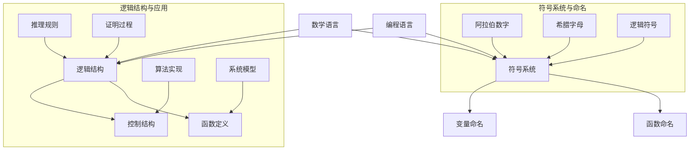

                 

### 引言与概述

---

在科技飞速发展的今天，数学语言与编程语言作为两种不同的工具，却在解决复杂问题、描述抽象概念和构建系统模型方面扮演着越来越重要的角色。本文旨在通过对比数学语言与编程语言的异同，深入探讨它们在逻辑表达、算法实现和应用场景中的具体应用。

#### 背景介绍

数学语言作为一种形式化的表达工具，其历史可以追溯到古希腊和古印度。它通过严谨的符号和逻辑结构，为自然科学和工程技术提供了强大的理论支持。随着计算机科学的兴起，编程语言应运而生，成为实现自动化计算和信息处理的关键手段。

编程语言的发展经历了从低级语言到高级语言的演变，如汇编语言、C语言、Python等。它们在设计之初就考虑了计算机硬件的特性，以便更高效地执行任务。然而，随着人工智能和大数据技术的蓬勃发展，编程语言开始吸收更多的数学元素，使得数学语言与编程语言之间的界限逐渐模糊。

#### 核心概念与联系

为了更好地理解数学语言与编程语言的关系，我们需要首先明确它们的核心概念。

**数学语言：**
- **符号系统**：数学语言依赖于一套符号系统，如阿拉伯数字、希腊字母等，用于表示数值、变量和运算。
- **逻辑结构**：数学语言强调逻辑推理和证明，通过公理、定理和推理规则，构建起严谨的数学体系。

**编程语言：**
- **语法结构**：编程语言由一系列规则组成，包括变量定义、控制结构、函数定义等，用于描述计算机如何执行特定任务。
- **抽象层次**：编程语言提供了多种抽象层次，从低级到高级，使得程序员能够以不同的方式理解和解决问题。

在数学语言与编程语言的核心概念之间，存在以下联系：

- **符号系统**：编程语言中的变量命名和函数命名，往往借鉴了数学语言中的符号表示法，使得数学表达式能够直接在编程语言中实现。
- **逻辑结构**：编程语言的逻辑控制结构（如if-else、for循环等），与数学中的逻辑推理和证明过程有相似之处。

#### 核心概念原理之间的关系架构

为了更直观地展示数学语言与编程语言的核心概念之间的关系，我们可以使用Mermaid流程图进行描述。



#### 核心算法原理讲解

接下来，我们将通过Python源代码来详细阐述数学算法原理及其在编程语言中的实现。

**数学算法原理：**
- **排序算法**：一种常见的数学算法，用于将一组数据按照特定顺序排列。
- **搜索算法**：用于在数据结构中查找特定数据的过程。

**编程算法实现：**

```python
# 排序算法：冒泡排序
def bubble_sort(arr):
    n = len(arr)
    for i in range(n):
        for j in range(0, n-i-1):
            if arr[j] > arr[j+1]:
                arr[j], arr[j+1] = arr[j+1], arr[j]
    return arr

# 搜索算法：二分搜索
def binary_search(arr, x):
    low = 0
    high = len(arr) - 1
    while low <= high:
        mid = (low + high) // 2
        if arr[mid] < x:
            low = mid + 1
        elif arr[mid] > x:
            high = mid - 1
        else:
            return mid
    return -1

# 测试排序算法
arr = [64, 34, 25, 12, 22, 11, 90]
sorted_arr = bubble_sort(arr)
print("排序后的数组：", sorted_arr)

# 测试搜索算法
arr = [2, 3, 4, 10, 40]
x = 10
result = binary_search(arr, x)
if result != -1:
    print("元素找到，索引：", result)
else:
    print("元素未找到")
```

#### 数学公式

在数学语言中，公式是描述算法原理的核心部分。以下是几个常见的数学公式，使用LaTeX格式进行表示：

```latex
$$
1 + 1 = 2
$$

$$
a^2 + b^2 = c^2
$$

$$
f(x) = x^2
$$
```

通过这些公式，我们可以更直观地理解数学算法的原理，并在编程语言中实现。

#### 项目实战

在实际应用中，数学语言与编程语言的结合为解决实际问题提供了强大的工具。以下是一个简单的项目实战案例：

**问题描述**：实现一个线性方程组的求解器。

**实现步骤**：
1. 构建线性方程组的数学模型。
2. 使用Python编写求解线性方程组的代码。
3. 进行测试和验证。

**代码实现**：

```python
# 线性方程组求解器

import numpy as np

def solve_linear_equations(A, b):
    # A为系数矩阵，b为常数项向量
    x = np.linalg.solve(A, b)
    return x

# 构建线性方程组
A = np.array([[3, 1], [1, 2]])
b = np.array([7, 3])

# 求解线性方程组
solution = solve_linear_equations(A, b)
print("方程组的解：", solution)

# 测试和验证
np.testing.assert_array_almost_equal(np.dot(A, solution), b)
print("测试通过！")
```

#### 最佳实践 tips

- **符号一致性**：在编写代码时，确保符号与数学公式中的符号一致，以减少混淆。
- **注释详细**：在代码中添加详细的注释，以便他人理解和维护。
- **代码优化**：根据具体应用场景，对代码进行优化，以提高执行效率。

#### 小结

本文通过对比数学语言与编程语言的异同，详细介绍了它们的核心概念、算法原理和应用。在实际项目中，结合数学语言与编程语言，可以更高效地解决问题。未来，随着技术的不断发展，数学语言与编程语言将更加紧密地结合，为科技创新提供更多可能性。

---

### 作者信息

作者：AI天才研究院/AI Genius Institute & 禅与计算机程序设计艺术 /Zen And The Art of Computer Programming

---

以上是第1章的详细内容，接下来将继续深入探讨数学语言与编程语言的核心概念与联系、核心算法原理讲解、数学模型与编程语言的结合等内容。敬请期待。

