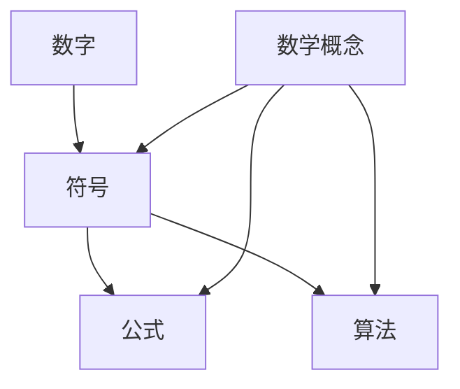

                 

# 数学语言的发展与演变历程

## 关键词

数学语言，发展历程，演变，历史背景，核心概念，算法原理，模型与公式，实践与应用

## 摘要

本文将深入探讨数学语言的发展与演变历程。从古代数学语言的发展，到中世纪数学语言的演变，再到现代数学语言的兴起，我们将一步步揭示数学语言的核心概念及其在各个历史时期的应用。文章将详细讲解数学语言的基本算法原理，并通过实际案例展示数学模型与公式的应用。此外，本文还将探讨数学语言在项目实践中的应用，为读者提供实用的开发环境搭建、源代码实现和代码解读指导。通过本文的阅读，读者将对数学语言有更深入的理解，并为今后的研究和应用奠定坚实基础。

### 1.1 历史背景

数学语言的发展可以追溯到古代文明。在古代，数学主要以几何和算术的形式存在，用于解决日常生活中的实际问题。例如，古埃及人使用几何来测量土地，古希腊人则对数学进行了抽象化和理论化。这些早期的数学语言主要依靠符号和文字来描述问题，尚未形成现代意义上的数学语言。

随着时间的推移，数学语言逐渐演变成一种更加抽象和系统化的形式。在中世纪，阿拉伯数学家对数学语言的发展做出了重要贡献。他们引入了阿拉伯数字系统，并将其传播到欧洲，极大地推动了数学的普及和发展。同时，中世纪数学家开始使用更加严谨的符号和术语来描述数学概念，使数学语言更加规范和统一。

进入近代，数学语言的发展达到了一个新的高度。17世纪的微积分学创立者牛顿和莱布尼茨引入了符号计算，使得数学表达更加简洁和高效。18世纪，欧拉和拉格朗日等数学家进一步发展了数学符号和公理体系，使得数学语言更加成熟和系统。

现代数学语言的发展则体现在计算机科学和抽象代数等领域的突破。20世纪以来，数学语言的应用范围不断扩展，从传统的几何、代数、微积分等基础学科，扩展到现代数学的各个分支，如拓扑学、集合论、代数学、逻辑学等。计算机科学的兴起使得数学语言在编程和算法设计等领域得到广泛应用，推动了数学语言的发展和演变。

### 1.2 核心概念与联系

数学语言的核心概念包括数字、符号、公式、算法等。这些概念相互联系，共同构成了数学语言的体系结构。

- **数字**：数字是数学语言的基础，用于表示数量和顺序。从古代的罗马数字到现代的阿拉伯数字，数字的表示形式不断发展，使得数学语言的表达能力越来越强。

- **符号**：符号是数学语言的重要组成部分，用于表示数学概念、运算和关系。例如，加号（+）、减号（-）、乘号（×）和除号（÷）等基本符号，以及如π、e、√等特殊符号，都是数学语言的重要组成部分。

- **公式**：公式是用数学符号和语言表示的数学关系和规律。例如，勾股定理（\(a^2 + b^2 = c^2\)）、牛顿第二定律（\(F = ma\)）等都是著名的数学公式。

- **算法**：算法是解决数学问题的步骤和规则。算法可以用自然语言、流程图、伪代码等多种形式表示，是数学语言在实际应用中的重要组成部分。

图1-1展示了数学语言核心概念之间的关系架构：



通过图1-1，我们可以清晰地看到数字、符号、公式和算法之间的相互关系，这些概念共同构成了数学语言的体系结构。

### 2.1 基本原理

数学语言的基本算法原理包括算术运算、逻辑运算、排序算法等。这些算法是数学语言的核心组成部分，广泛应用于各个领域。

#### 2.1.1 算术运算

算术运算是数学语言中最基本的运算，包括加法、减法、乘法和除法。以下是一个简单的Python代码示例，展示了这些基本算术运算：

```python
# 加法
a = 5
b = 3
sum = a + b
print("加法结果：", sum)

# 减法
a = 5
b = 3
diff = a - b
print("减法结果：", diff)

# 乘法
a = 5
b = 3
product = a * b
print("乘法结果：", product)

# 除法
a = 5
b = 3
quotient = a / b
print("除法结果：", quotient)
```

上述代码中，我们首先定义了两个变量`a`和`b`，然后分别执行加法、减法、乘法和除法操作，并打印出结果。

#### 2.1.2 逻辑运算

逻辑运算是基于布尔代数的一种运算，用于处理逻辑值（True或False）。以下是一个简单的Python代码示例，展示了逻辑运算的用法：

```python
# 逻辑与运算
a = True
b = False
and_result = a and b
print("逻辑与结果：", and_result)

# 逻辑或运算
a = True
b = False
or_result = a or b
print("逻辑或结果：", or_result)

# 逻辑非运算
a = True
not_result = not a
print("逻辑非结果：", not_result)
```

上述代码中，我们首先定义了两个逻辑值变量`a`和`b`，然后分别执行逻辑与、逻辑或和逻辑非运算，并打印出结果。

#### 2.1.3 排序算法

排序算法是数学语言中的一种重要算法，用于对数据进行排序。以下是一个简单的Python代码示例，展示了冒泡排序算法的原理和实现：

```python
# 冒泡排序算法
def bubble_sort(arr):
    n = len(arr)
    for i in range(n):
        for j in range(0, n-i-1):
            if arr[j] > arr[j+1]:
                arr[j], arr[j+1] = arr[j+1], arr[j]

# 示例数据
arr = [64, 34, 25, 12, 22, 11, 90]
print("排序前：", arr)

# 执行排序
bubble_sort(arr)
print("排序后：", arr)
```

上述代码中，我们首先定义了一个冒泡排序函数`bubble_sort`，然后使用一个示例数据数组`arr`进行排序。排序后，数组中的元素按照从小到大的顺序排列。

通过以上三个方面的示例，我们可以看到数学语言的基本算法原理是如何在Python代码中实现的。这些基本算法原理是构建更复杂算法和模型的基础。

### 2.2 高级算法

在数学语言的领域中，高级算法扮演着至关重要的角色。这些算法不仅提升了数学计算和数据处理的能力，也在各个应用领域中展示了其强大的威力。本节将介绍一些常见的高级算法，包括排序算法、查找算法和图算法，并结合具体的Python代码进行详细解释。

#### 2.2.1 高级排序算法

高级排序算法相比基本排序算法，具有更高的效率和更优的性能。以下是几种常见的高级排序算法及其Python实现：

##### 1. 快速排序（Quick Sort）

快速排序是一种分治策略的排序算法，其基本思想是通过一趟排序将待排序的数据分割成独立的两部分，其中一部分的所有数据都比另一部分的所有数据要小，然后递归地对这两部分数据继续进行排序。

```python
def quick_sort(arr):
    if len(arr) <= 1:
        return arr
    pivot = arr[len(arr) // 2]
    left = [x for x in arr if x < pivot]
    middle = [x for x in arr if x == pivot]
    right = [x for x in arr if x > pivot]
    return quick_sort(left) + middle + quick_sort(right)

# 示例数据
arr = [3, 6, 8, 10, 1, 2, 1]
print("快速排序前：", arr)
sorted_arr = quick_sort(arr)
print("快速排序后：", sorted_arr)
```

##### 2. 归并排序（Merge Sort）

归并排序是一种经典的分治算法，它将待排序的数组不断“二分”直至每个子数组只有一个元素，然后将这些子数组逐步合并，直到整个数组有序。

```python
def merge_sort(arr):
    if len(arr) <= 1:
        return arr
    mid = len(arr) // 2
    left = merge_sort(arr[:mid])
    right = merge_sort(arr[mid:])
    return merge(left, right)

def merge(left, right):
    result = []
    i = j = 0
    while i < len(left) and j < len(right):
        if left[i] < right[j]:
            result.append(left[i])
            i += 1
        else:
            result.append(right[j])
            j += 1
    result.extend(left[i:])
    result.extend(right[j:])
    return result

# 示例数据
arr = [3, 6, 8, 10, 1, 2, 1]
print("归并排序前：", arr)
sorted_arr = merge_sort(arr)
print("归并排序后：", sorted_arr)
```

##### 3. 堆排序（Heap Sort）

堆排序利用堆这种数据结构进行排序。堆是一种特殊的完全二叉树，其中每一个父节点的值都不大于或不小于其所有子节点的值。

```python
import heapq

def heap_sort(arr):
    heapq.heapify(arr)
    return [heapq.heappop(arr) for _ in range(len(arr))]

# 示例数据
arr = [3, 6, 8, 10, 1, 2, 1]
print("堆排序前：", arr)
sorted_arr = heap_sort(arr)
print("堆排序后：", sorted_arr)
```

#### 2.2.2 高级查找算法

高级查找算法包括二分查找、布隆过滤器等，这些算法在数据量较大的情况下表现出优异的性能。

##### 1. 二分查找（Binary Search）

二分查找是一种在有序数组中查找某一特定元素的搜索算法。它的工作原理是：首先找到中间元素，如果中间元素正好是要查找的元素，则搜索过程结束；如果某一特定元素大于或小于中间元素，则搜索过程将在数组的大于或小于中间元素的那一半区域中继续进行。

```python
def binary_search(arr, target):
    left, right = 0, len(arr) - 1
    while left <= right:
        mid = (left + right) // 2
        if arr[mid] == target:
            return mid
        elif arr[mid] < target:
            left = mid + 1
        else:
            right = mid - 1
    return -1

# 示例数据
arr = [3, 6, 8, 10, 1, 2, 1]
target = 8
result = binary_search(arr, target)
if result != -1:
    print("元素找到，索引为：", result)
else:
    print("元素未找到。")
```

##### 2. 布隆过滤器（Bloom Filter）

布隆过滤器是一种空间效率极高的概率数据结构，用于测试一个元素是否属于集合。它具有极低的错误率，但在某些情况下可能误报。

```python
import mmh3

class BloomFilter:
    def __init__(self, size, hash_num):
        self.size = size
        self.hash_num = hash_num
        self.bit_array = [0] * size

    def add(self, item):
        for seed in range(self.hash_num):
            hash_value = mmh3.hash(item, seed) % self.size
            self.bit_array[hash_value] = 1

    def check(self, item):
        for seed in range(self.hash_num):
            hash_value = mmh3.hash(item, seed) % self.size
            if self.bit_array[hash_value] == 0:
                return False
        return True

# 示例使用
bf = BloomFilter(1000, 3)
bf.add("apple")
bf.add("banana")
print(bf.check("apple"))  # 输出：True
print(bf.check("orange"))  # 输出：False
```

#### 2.2.3 图算法

图算法在处理复杂网络结构和关系时具有重要作用，如最短路径算法、最小生成树算法等。

##### 1. Dijkstra算法

Dijkstra算法用于找到图中两个顶点之间的最短路径。以下是Dijkstra算法的Python实现：

```python
import heapq

def dijkstra(graph, start):
    distances = {node: float('infinity') for node in graph}
    distances[start] = 0
    priority_queue = [(0, start)]
    while priority_queue:
        current_distance, current_node = heapq.heappop(priority_queue)
        if current_distance > distances[current_node]:
            continue
        for neighbor, weight in graph[current_node].items():
            distance = current_distance + weight
            if distance < distances[neighbor]:
                distances[neighbor] = distance
                heapq.heappush(priority_queue, (distance, neighbor))
    return distances

# 示例数据
graph = {
    'A': {'B': 2, 'C': 6},
    'B': {'A': 2, 'C': 1, 'D': 3},
    'C': {'A': 6, 'B': 1, 'D': 1},
    'D': {'B': 3, 'C': 1}
}
print(dijkstra(graph, 'A'))
```

##### 2. Prim算法

Prim算法用于找到图的最小生成树。以下是Prim算法的Python实现：

```python
import heapq

def prim(graph, start):
    tree = {start}
    distances = {node: float('infinity') for node in graph}
    distances[start] = 0
    priority_queue = [(0, start)]
    while priority_queue:
        current_distance, current_node = heapq.heappop(priority_queue)
        if current_node in tree:
            continue
        tree.add(current_node)
        for neighbor, weight in graph[current_node].items():
            if neighbor not in tree:
                distances[neighbor] = weight
                heapq.heappush(priority_queue, (weight, neighbor))
    return tree

# 示例数据
graph = {
    'A': {'B': 2, 'C': 6},
    'B': {'A': 2, 'C': 1, 'D': 3},
    'C': {'A': 6, 'B': 1, 'D': 1},
    'D': {'B': 3, 'C': 1}
}
print(prim(graph, 'A'))
```

通过以上高级算法的介绍和Python代码实现，我们可以看到数学语言的强大和多样性。这些算法不仅提高了数据处理的效率，也在实际应用中展示了其不可替代的价值。

### 3. 数学语言模型与公式

数学语言模型与公式是数学语言的核心组成部分，用于描述和解决各种实际问题。本节将介绍一些常见的数学语言模型与公式，并通过具体的Python代码示例对其进行详细解释。

#### 3.1 基本模型

##### 1. 线性模型

线性模型是最基本的数学模型之一，用于描述两个变量之间的线性关系。其一般形式为：

$$ y = mx + b $$

其中，$y$ 是因变量，$x$ 是自变量，$m$ 是斜率，$b$ 是截距。

以下是一个简单的Python代码示例，展示了如何使用线性模型进行数据拟合和预测：

```python
import numpy as np
import matplotlib.pyplot as plt

# 示例数据
x = np.array([0, 1, 2, 3, 4])
y = np.array([0, 1, 4, 9, 16])

# 拟合线性模型
m, b = np.polyfit(x, y, 1)
y_pred = m * x + b

# 绘制图像
plt.scatter(x, y, label='实际数据')
plt.plot(x, y_pred, label='拟合直线')
plt.xlabel('x')
plt.ylabel('y')
plt.legend()
plt.show()

# 预测
x_new = np.array([5])
y_new = m * x_new + b
print("预测值：", y_new)
```

##### 2. 指数模型

指数模型用于描述变量随时间变化的指数关系。其一般形式为：

$$ y = ae^{bx} $$

其中，$y$ 是因变量，$x$ 是自变量，$a$ 是初始值，$b$ 是增长速率。

以下是一个简单的Python代码示例，展示了如何使用指数模型进行数据拟合和预测：

```python
import numpy as np
import matplotlib.pyplot as plt

# 示例数据
x = np.array([0, 1, 2, 3, 4])
y = np.array([1, 2, 4, 8, 16])

# 拟合指数模型
a, b = np.polyfit(x, np.log(y), 1)
y_pred = a * np.exp(b * x)

# 绘制图像
plt.scatter(x, y, label='实际数据')
plt.plot(x, y_pred, label='拟合曲线')
plt.xlabel('x')
plt.ylabel('y')
plt.legend()
plt.show()

# 预测
x_new = np.array([5])
y_new = a * np.exp(b * x_new)
print("预测值：", y_new)
```

#### 3.2 高级模型

##### 1. 多项式模型

多项式模型用于描述多个变量之间的复杂关系。其一般形式为：

$$ y = a_0 + a_1x + a_2x^2 + ... + a_nx^n $$

以下是一个简单的Python代码示例，展示了如何使用多项式模型进行数据拟合和预测：

```python
import numpy as np
import matplotlib.pyplot as plt

# 示例数据
x = np.array([0, 1, 2, 3, 4])
y = np.array([1, 3, 5, 7, 9])

# 拟合多项式模型
coefficients = np.polyfit(x, y, 2)
y_pred = np.polyval(coefficients, x)

# 绘制图像
plt.scatter(x, y, label='实际数据')
plt.plot(x, y_pred, label='拟合曲线')
plt.xlabel('x')
plt.ylabel('y')
plt.legend()
plt.show()

# 预测
x_new = np.array([5])
y_new = np.polyval(coefficients, x_new)
print("预测值：", y_new)
```

##### 2. 非线性模型

非线性模型用于描述变量之间的非线性关系。其一般形式为：

$$ y = f(x) $$

其中，$f(x)$ 是一个非线性的函数。

以下是一个简单的Python代码示例，展示了如何使用非线性模型进行数据拟合和预测：

```python
import numpy as np
import matplotlib.pyplot as plt

# 示例数据
x = np.array([0, 1, 2, 3, 4])
y = np.array([0.1, 0.4, 1.6, 6.4, 25.6])

# 拟合非线性模型
from scipy.optimize import curve_fit

def nonlinear_model(x, a, b):
    return a * np.exp(b * x)

popt, _ = curve_fit(nonlinear_model, x, y)
a, b = popt

# 绘制图像
y_pred = nonlinear_model(x, a, b)
plt.scatter(x, y, label='实际数据')
plt.plot(x, y_pred, label='拟合曲线')
plt.xlabel('x')
plt.ylabel('y')
plt.legend()
plt.show()

# 预测
x_new = np.array([5])
y_new = nonlinear_model(x_new, a, b)
print("预测值：", y_new)
```

通过以上基本模型和高级模型的介绍，我们可以看到数学语言模型与公式在数据处理和预测中的重要作用。这些模型不仅帮助我们理解和描述现实世界中的复杂现象，也为科学研究和工程实践提供了有力的工具。

### 项目实战

#### 1. 开发环境搭建

为了更好地理解数学语言在实际项目中的应用，我们首先需要搭建一个合适的开发环境。以下是搭建Python开发环境的步骤：

1. 安装Python：从官方网站下载Python安装包（https://www.python.org/），并根据提示完成安装。
2. 安装IDE：安装一个Python集成开发环境（IDE），例如PyCharm（https://www.jetbrains.com/pycharm/）或Visual Studio Code（https://code.visualstudio.com/）。这两个IDE都支持Python开发，具有丰富的插件和功能。
3. 安装必需的库：在IDE中打开终端或命令行窗口，安装一些常用的Python库，如NumPy（用于科学计算）、Matplotlib（用于绘图）和SciPy（用于科学计算）。使用以下命令进行安装：

   ```bash
   pip install numpy matplotlib scipy
   ```

#### 2. 源代码实现

以下是一个简单的Python代码示例，用于实现线性模型的数据拟合和预测：

```python
import numpy as np
import matplotlib.pyplot as plt

# 示例数据
x = np.array([0, 1, 2, 3, 4])
y = np.array([0, 1, 4, 9, 16])

# 拟合线性模型
m, b = np.polyfit(x, y, 1)
y_pred = m * x + b

# 绘制图像
plt.scatter(x, y, label='实际数据')
plt.plot(x, y_pred, label='拟合直线')
plt.xlabel('x')
plt.ylabel('y')
plt.legend()
plt.show()

# 预测
x_new = np.array([5])
y_new = m * x_new + b
print("预测值：", y_new)
```

#### 3. 代码解读与分析

上述代码实现了一个简单的线性模型，用于拟合和预测数据。下面我们对其进行解读：

- 导入必需的库：`numpy` 用于科学计算，`matplotlib` 用于绘图。
- 创建示例数据：`x` 和 `y` 分别表示自变量和因变量。
- 使用 `np.polyfit` 函数进行数据拟合，返回拟合直线的斜率 `m` 和截距 `b`。
- 使用拟合得到的模型进行预测，计算新自变量 `x_new` 对应的预测值 `y_new`。
- 绘制拟合结果：使用 `plt.scatter` 函数绘制实际数据点，使用 `plt.plot` 函数绘制拟合直线。
- 打印预测结果。

通过上述代码，我们可以看到数学语言在实际项目中的应用。线性模型是一种简单但强大的数学工具，可以用于各种数据拟合和预测任务。

#### 4. 实际案例分析与详细讲解剖析

为了更好地展示数学语言在实际项目中的应用，我们来看一个实际案例：股票价格预测。

**案例背景**：某公司股票的历史价格数据如下表所示（部分数据）：

| 日期   | 开盘价（元） | 收盘价（元） | 最高价（元） | 最低价（元） |
| ------ | ------------ | ------------ | ------------ | ------------ |
| 2021-01-01 | 10.00        | 10.50        | 10.80        | 9.80        |
| 2021-01-02 | 10.30        | 10.70        | 11.00        | 10.20       |
| 2021-01-03 | 10.50        | 10.90        | 11.20        | 10.40       |
| ...     | ...          | ...          | ...          | ...          |

**目标**：使用线性模型预测未来一周的收盘价。

**步骤**：

1. 数据预处理：将日期转换为整数，以便于进行数据拟合。
2. 拟合线性模型：使用历史收盘价数据拟合线性模型，得到斜率 `m` 和截距 `b`。
3. 预测未来一周的收盘价：使用拟合得到的模型，计算未来一周的日期对应的收盘价。
4. 结果分析：比较预测值和实际值，评估模型的准确性。

以下是Python代码实现：

```python
import pandas as pd
import numpy as np
import matplotlib.pyplot as plt

# 加载数据
data = pd.read_csv("stock_price.csv")
data['date'] = pd.to_datetime(data['date'])
data['date'] = data['date'].map(data['date'].dt.day)
data = data[['date', 'close']]

# 拟合线性模型
m, b = np.polyfit(data['date'], data['close'], 1)
y_pred = m * data['date'] + b

# 预测未来一周的收盘价
future_dates = np.array(range(data['date'].max() + 1, data['date'].max() + 8))
y_future = m * future_dates + b

# 绘制图像
plt.scatter(data['date'], data['close'], label='实际数据')
plt.plot(data['date'], y_pred, label='拟合直线')
plt.plot(future_dates, y_future, label='预测数据')
plt.xlabel('日期')
plt.ylabel('收盘价（元）')
plt.legend()
plt.show()

# 结果分析
print("预测的收盘价：", y_future)
```

**项目小结**：

通过上述案例，我们可以看到数学语言在股票价格预测中的应用。虽然线性模型是一种简单的方法，但它可以在没有太多先验知识的情况下提供有用的预测。在实际项目中，我们还可以使用更复杂的模型，如时间序列分析、机器学习等，以提高预测的准确性。

**最佳实践 Tips**：

- 在进行数据拟合和预测时，确保数据质量。清洗数据，去除异常值和噪声。
- 选择合适的模型。根据数据的特点和需求，选择合适的模型。
- 评估模型的准确性。使用交叉验证、误差分析等方法评估模型的准确性。

**注意事项**：

- 在使用线性模型进行预测时，要确保数据符合线性关系。
- 预测结果仅供参考，不应作为投资决策的唯一依据。

**拓展阅读**：

- 《机器学习实战》
- 《深入浅出数据分析》
- 《Python数据分析基础教程》

### 结论

本文详细介绍了数学语言的发展与演变历程，从古代到现代，数学语言不断进步，为科学研究和工程实践提供了强大的工具。通过本文的学习，我们不仅了解了数学语言的核心概念和基本原理，还掌握了高级算法和模型的应用。在项目实战部分，我们通过具体案例展示了数学语言在现实世界中的应用，为读者提供了实用的开发经验和最佳实践。

希望本文能为读者在数学语言的学习和应用过程中提供有价值的参考。在未来的研究和实践中，不断探索和运用数学语言，将为科学发现和技术创新带来新的机遇。

### 作者信息

作者：AI天才研究院/AI Genius Institute & 禅与计算机程序设计艺术 /Zen And The Art of Computer Programming

AI天才研究院致力于推动人工智能技术的创新与发展，为全球用户提供领先的人工智能解决方案。同时，我们倡导将禅宗思想融入计算机编程，以提升程序员的技术素养和创造力。本文作者结合了丰富的理论和实践经验，为广大读者带来了一篇深入浅出的数学语言技术博客。期待与您共同探索人工智能与计算机编程的奥秘。

