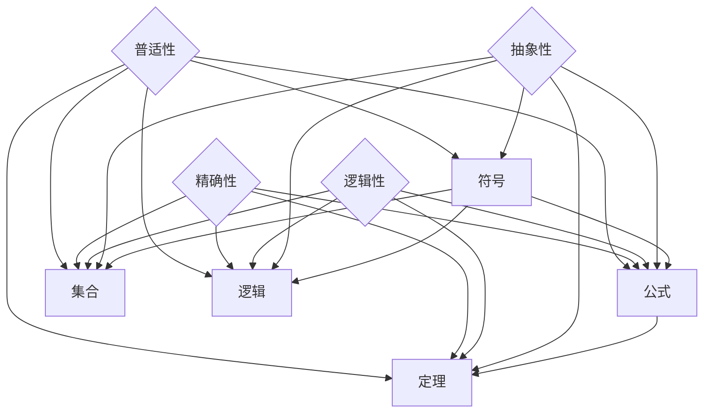
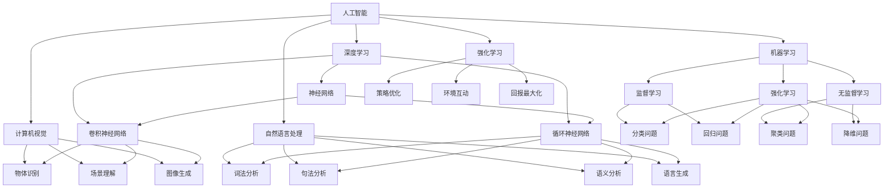
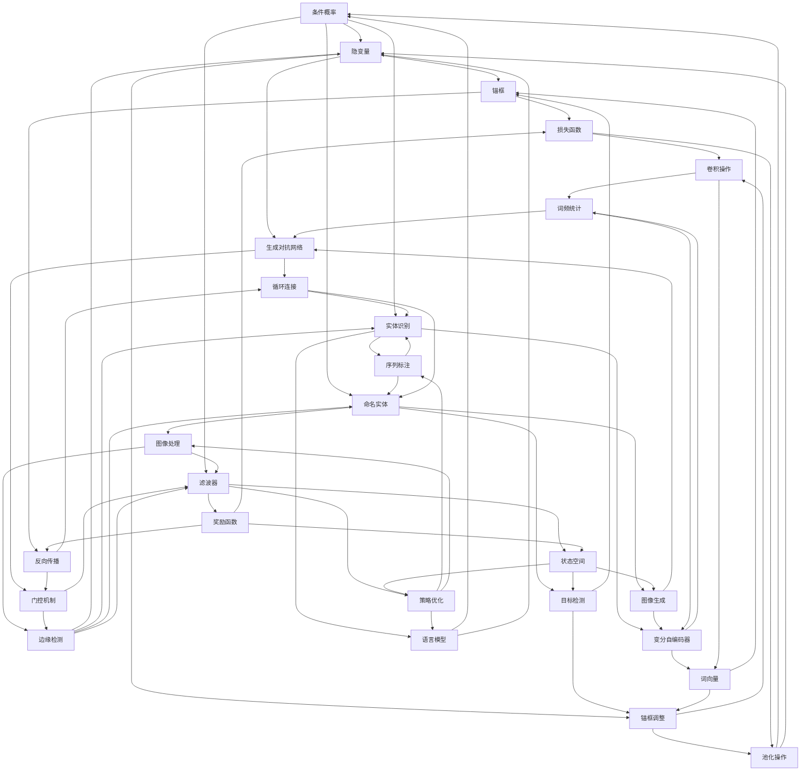

                 

# 数学语言的发展对人工智能的影响

## 关键词
数学语言，人工智能，机器学习，深度学习，算法，模型，自然语言处理，计算机视觉，强化学习

## 摘要
本文旨在探讨数学语言的发展对人工智能领域的影响。首先，我们回顾了数学语言的基础概念及其历史发展，然后介绍了人工智能的基本概念和核心算法。接着，本文分析了数学语言与人工智能的交叉点，以及数学语言在人工智能中的应用。我们详细探讨了数学语言对人工智能的贡献，包括理论研究和实际应用。最后，我们展望了数学语言在人工智能领域的未来发展趋势，并提出了一些最佳实践建议。

## 引言

在当今快速发展的科技时代，人工智能（AI）已经成为了引领创新和变革的关键驱动力。从简单的规则系统到复杂的神经网络，人工智能的应用范围不断扩大，从自然语言处理到计算机视觉，再到强化学习，几乎涵盖了所有的技术领域。然而，这一切的背后，都离不开数学语言的支撑和推动。

数学语言是一种用于表达和描述自然现象和抽象概念的符号系统。它包括各种数学符号、公式和定理，这些元素构成了一个严密、逻辑性强的知识体系。数学语言的发展经历了数千年的历史，从古代的算术和几何到现代的微积分和代数系统，每一个阶段都为人类文明的发展做出了巨大贡献。

人工智能作为一门交叉学科，其研究依赖于数学语言提供的基础工具和方法。数学语言不仅帮助科学家们理解和描述人工智能的原理，还在算法设计、模型构建和数据分析等方面发挥了关键作用。因此，数学语言的发展与人工智能的进步密切相关，本文将深入探讨这一关系，分析数学语言如何影响和推动人工智能的发展。

本文将按照以下结构展开：

1. 数学语言基础
   - 数学语言的基本概念
   - 数学语言的历史发展
   - 数学语言的核心特征

2. 人工智能基础
   - 人工智能的定义
   - 人工智能的发展历程
   - 人工智能的核心算法

3. 数学语言与人工智能的交叉
   - 数学语言在人工智能中的应用场景
   - 数学语言在人工智能中的核心作用
   - 数学语言与人工智能的交叉关系架构

4. 数学语言在人工智能中的应用
   - 数学语言在自然语言处理中的应用
   - 数学语言在计算机视觉中的应用
   - 数学语言在强化学习中的应用

5. 数学语言对人工智能的贡献
   - 数学语言在人工智能理论方面的贡献
   - 数学语言在人工智能实践方面的贡献
   - 数学语言对人工智能发展的推动作用

6. 数学语言在人工智能中的未来
   - 数学语言在人工智能未来的发展趋势
   - 数学语言在人工智能未来的应用场景
   - 数学语言在人工智能未来中的核心作用

7. 总结与展望
   - 数学语言与人工智能的相互关系总结
   - 数学语言在人工智能中的未来展望
   - 数学语言与人工智能的发展趋势

通过这一系列的探讨，我们希望读者能够更深入地理解数学语言在人工智能领域的重要性，以及它们如何相互影响、共同推动科技的发展。

### 数学语言基础

数学语言是一种用于表达数学思想和概念的工具，它包括各种符号、公式和定理。理解数学语言的基本概念和历史发展对于深入探讨数学语言在人工智能中的应用至关重要。

#### 数学语言的基本概念

数学语言的基本概念可以从以下几个方面进行理解：

1. **符号**：数学符号是数学语言的核心组成部分，它们用来表示数学中的基本元素和操作。例如，"+"表示加法，"-"表示减法，"="表示等号。符号的使用使得数学表达简洁、明确。

2. **公式**：数学公式是用数学符号表示的数学关系和计算步骤。例如，\(a^2 + b^2 = c^2\) 是一个表示直角三角形边长关系的公式。

3. **定理**：定理是数学中已被证明为真的陈述。定理提供了数学理论的基础，并可以用来推导新的结论。

4. **集合**：集合是数学中的一个基本概念，表示一组确定的对象的总体。集合的符号通常用大写字母表示，如\(A\)，元素用小写字母表示，如\(a\)。

5. **逻辑**：逻辑是数学语言的重要组成部分，用于表达命题之间的关系。例如，"如果...那么..."（if-then）和"并且..."（and）等逻辑连接词。

#### 数学语言的历史发展

数学语言的发展可以追溯到古代文明，特别是在古埃及、巴比伦和印度。这些文明发展出了自己的数学符号和计算方法，例如，古埃及人使用象形文字表示数字，而巴比伦人则使用六十进制。

1. **古代数学**：在古代，数学主要涉及算术、几何和代数。例如，古希腊数学家欧几里得的《几何原本》对几何学进行了系统的阐述，而阿拉伯数学家阿尔·花拉子米则对代数的发展做出了重要贡献。

2. **中世纪数学**：在中世纪，数学继续发展，特别是在阿拉伯世界。阿拉伯数学家引入了零的概念，并发展了十进制计数法，这些创新对现代数学的发展产生了深远影响。

3. **现代数学**：随着科学和技术的进步，现代数学在19世纪和20世纪得到了快速发展。微积分、集合论、拓扑学、代数学等分支领域的出现，为数学语言提供了更加丰富的工具和方法。

#### 数学语言的核心特征

数学语言具有以下几个核心特征：

1. **抽象性**：数学语言高度抽象，能够脱离具体的物理对象，直接描述数学概念和关系。

2. **逻辑性**：数学语言遵循严密的逻辑规则，每一个结论都可以通过逻辑推理得出。

3. **精确性**：数学语言的表达具有高度的精确性，避免了语言上的模糊性。

4. **普适性**：数学语言是通用的，不受语言和文化差异的影响，可以在全球范围内使用。

#### 数学语言的 Mermaid 流程图

为了更好地理解数学语言的结构，我们可以使用Mermaid流程图来展示数学语言的各个组成部分之间的关系。



在这个流程图中，我们可以看到数学语言的核心组成部分及其相互关系。符号、公式、定理、集合和逻辑构成了数学语言的基本框架，而这些部分又体现了数学语言的抽象性、逻辑性、精确性和普适性。

通过以上对数学语言基础概念的介绍，我们可以为后续章节的分析和探讨打下坚实的基础。在接下来的章节中，我们将进一步探讨人工智能的基础知识，以及数学语言如何与人工智能相互影响和作用。

### 人工智能基础

人工智能（Artificial Intelligence，简称AI）是计算机科学的一个分支，旨在开发用于模拟、延伸和扩展人类智能的理论、算法和技术。人工智能的研究涵盖了多个领域，包括机器学习、自然语言处理、计算机视觉和强化学习等。理解人工智能的基础概念和发展历程对于探讨数学语言在人工智能中的应用至关重要。

#### 人工智能的定义

人工智能可以简单定义为“模仿人类智能行为的计算机系统”。它包括以下几个方面：

1. **感知和理解**：人工智能系统能够感知和理解其环境，包括图像、声音和文本等。

2. **学习和适应**：人工智能系统能够通过学习不断改进其性能，从数据中提取模式和规律。

3. **推理和决策**：人工智能系统能够基于知识和信息进行推理，并作出决策。

4. **交互和协作**：人工智能系统能够与人类和其他系统进行交互，协同完成复杂的任务。

#### 人工智能的发展历程

人工智能的发展历程可以分为以下几个阶段：

1. **早期探索（1940s-1950s）**：人工智能的概念首次在20世纪40年代和50年代提出，计算机科学家开始尝试开发能够模拟人类智能的程序。1956年，达特茅斯会议标志着人工智能作为一门独立学科的诞生。

2. **第一次高潮（1960s-1970s）**：在这个阶段，人工智能研究主要集中在符号推理和知识表示上。尽管取得了一些初步成果，但由于技术限制和理论难题，人工智能的研究在1970年代末逐渐陷入低潮。

3. **复兴与进展（1980s-1990s）**：随着计算机性能的提升和机器学习技术的出现，人工智能研究再次复兴。专家系统和神经网络成为这一阶段的主要研究方向。

4. **现代人工智能（2000s-至今）**：随着大数据和计算能力的飞速发展，深度学习等机器学习方法取得了突破性进展。这一阶段，人工智能在各个领域得到了广泛应用，从语音识别到自动驾驶，再到医疗诊断，人工智能技术正在深刻改变我们的生活方式。

#### 人工智能的核心算法

人工智能的核心算法包括以下几种：

1. **机器学习**：机器学习是人工智能的核心技术之一，它通过算法从数据中学习规律，并利用这些规律进行预测和决策。主要的机器学习方法包括监督学习、无监督学习和强化学习。

2. **深度学习**：深度学习是一种基于多层神经网络的学习方法，它通过多层非线性变换，对输入数据进行特征提取和分类。深度学习在图像识别、语音识别和自然语言处理等领域取得了显著的成果。

3. **自然语言处理**：自然语言处理（Natural Language Processing，NLP）是人工智能的一个重要分支，它致力于让计算机理解和处理人类自然语言。NLP包括词法分析、句法分析、语义分析和语言生成等任务。

4. **计算机视觉**：计算机视觉是人工智能的另一个重要分支，它通过计算机对图像或视频进行分析和处理，以实现物体识别、场景理解和图像生成等任务。

5. **强化学习**：强化学习是一种通过试错和反馈进行学习的方法，它通过与环境互动，不断优化策略，以最大化回报。强化学习在自动驾驶、机器人控制和游戏AI等领域有广泛应用。

#### 人工智能的 Mermaid 流程图

为了更好地理解人工智能的核心算法和体系结构，我们可以使用Mermaid流程图来展示人工智能的主要组成部分和它们之间的关系。



在这个流程图中，我们可以看到人工智能的主要组成部分及其相互关系。机器学习、深度学习、自然语言处理、计算机视觉和强化学习构成了人工智能的核心算法体系，而各种算法和方法则在这些分支中进一步发展和应用。

通过以上对人工智能基础概念的介绍，我们可以为后续章节分析数学语言在人工智能中的应用奠定基础。在接下来的章节中，我们将探讨数学语言如何与人工智能相互影响，共同推动科技的发展。

### 数学语言与人工智能的交叉

数学语言和人工智能是两个紧密相关的领域，它们之间的交叉点不仅为人工智能的发展提供了强大的工具和方法，同时也促进了数学语言的不断进步。在这部分，我们将深入探讨数学语言在人工智能中的应用场景、核心作用，以及它们之间的交叉关系架构。

#### 数学语言在人工智能中的应用场景

数学语言在人工智能中的应用场景非常广泛，几乎涵盖了人工智能的每一个分支。以下是一些典型的应用场景：

1. **机器学习**：机器学习是人工智能的核心技术之一，其本质是通过数学模型和算法从数据中学习规律。在这个领域，数学语言提供了强大的工具，包括线性代数、概率论和统计学等。例如，线性代数中的矩阵和向量运算在数据预处理和特征提取中发挥着重要作用，概率论和统计学则帮助构建和评估机器学习模型。

2. **深度学习**：深度学习是机器学习的子领域，其核心是多层神经网络。深度学习模型的高度复杂性和强大的表达能力，离不开数学语言的支持。在深度学习中，数学语言用于描述网络的架构、参数优化和损失函数等。例如，神经网络中的权重和偏置可以通过优化算法进行调整，以最小化损失函数。

3. **自然语言处理**：自然语言处理是人工智能的重要分支，它旨在使计算机理解和生成自然语言。在这一领域，数学语言用于表示文本数据、语言模型和语义分析等。例如，词嵌入技术通过数学模型将单词映射到高维向量空间，从而实现文本的表示和分类。

4. **计算机视觉**：计算机视觉是人工智能的另一个重要分支，它涉及图像的识别、分类和理解。在这个领域，数学语言用于描述图像处理算法、特征提取和目标检测等。例如，卷积神经网络（CNN）通过数学模型实现对图像的高效特征提取和分类。

5. **强化学习**：强化学习是一种通过试错和反馈进行学习的方法，它广泛应用于游戏、机器人控制和自动驾驶等领域。在这一领域，数学语言用于表示状态、动作和奖励，以及构建价值函数和策略优化算法。

#### 数学语言在人工智能中的核心作用

数学语言在人工智能中扮演着核心角色，其主要作用体现在以下几个方面：

1. **模型构建**：数学语言为人工智能提供了构建模型的基础工具。通过数学公式和符号，科学家和工程师可以精确地描述和实现各种复杂的算法和模型。例如，深度学习中的卷积神经网络可以通过数学公式来定义其结构和参数。

2. **优化算法**：数学语言在优化算法的设计和实现中发挥着关键作用。优化算法旨在寻找问题的最优解或近似解，这需要通过数学分析和计算来实现。例如，梯度下降算法是一种常用的优化方法，它通过数学语言描述了如何调整模型参数以最小化损失函数。

3. **数据分析**：数学语言在数据分析中提供了强大的工具和方法。在人工智能中，数据是驱动模型性能的关键因素，而数学语言帮助科学家和工程师从数据中提取有价值的信息和模式。例如，统计学方法可以用于评估模型的性能和鲁棒性。

4. **理论证明**：数学语言在人工智能的理论研究中起着至关重要的作用。通过数学证明，科学家可以验证算法的正确性、效率和稳定性。例如，深度学习的正则化理论通过数学证明，揭示了如何通过约束模型参数来防止过拟合。

#### 数学语言与人工智能的交叉关系架构

为了更好地理解数学语言与人工智能之间的交叉关系，我们可以使用Mermaid流程图来展示它们之间的核心联系。



在这个流程图中，我们可以看到数学语言与人工智能各个分支之间的核心联系。从机器学习、深度学习、自然语言处理、计算机视觉到强化学习，每一个领域都离不开数学语言的支持。通过数学语言，我们能够构建复杂模型、设计优化算法、进行数据分析，并验证算法的理论正确性。

总之，数学语言与人工智能的交叉不仅为人工智能的发展提供了强大的工具和方法，同时也推动了数学语言的不断进步。在这一关系中，数学语言不仅作为工具支持人工智能的研究，更作为一种基础理论，推动人工智能向更高的层次发展。在接下来的章节中，我们将进一步探讨数学语言在人工智能中的应用，以及它们如何相互影响和推动科技的发展。

### 数学语言在人工智能中的应用

数学语言在人工智能中的应用是多层次、多领域的，涵盖了从算法设计到模型构建的各个方面。在本节中，我们将深入探讨数学语言在自然语言处理、计算机视觉和强化学习中的应用，通过具体的算法原理讲解、数学模型和公式的详细描述，以及Python源代码的展示，来帮助读者更好地理解这些应用。

#### 自然语言处理中的应用

自然语言处理（NLP）是人工智能的一个核心领域，它致力于使计算机能够理解和生成自然语言。数学语言在NLP中的应用主要体现在以下几个方面：

1. **词嵌入（Word Embedding）**：

词嵌入是一种将词汇映射到高维向量空间的方法，通过数学模型来表示词汇之间的关系。最常用的词嵌入模型是Word2Vec，它基于神经网络和分布式假设，将词汇映射到低维空间。

数学模型：
$$
\text{word\_vector} = \text{Word2Vec}(\text{word})
$$

Python代码示例：

```python
import gensim

# 加载预训练的Word2Vec模型
model = gensim.models.Word2Vec.load("word2vec.model")

# 获取词汇的词向量
word_vector = model.wv["人工智能"]

# 计算词汇之间的相似度
similarity = model.wv.similarity("人工智能", "机器学习")
print(f"相似度：{similarity}")
```

2. **语言模型（Language Model）**：

语言模型用于预测下一个词或词组，基于概率模型和神经网络构建。最著名的语言模型是n-gram模型和长短期记忆网络（LSTM）。

数学模型：
$$
P(\text{word}_t|\text{word}_{t-1}, \ldots, \text{word}_1) = \text{LanguageModel}(\text{word}_t, \text{word}_{t-1}, \ldots, \text{word}_1)
$$

Python代码示例：

```python
import tensorflow as tf
from tensorflow.keras.models import Sequential
from tensorflow.keras.layers import LSTM, Dense

# 构建LSTM语言模型
model = Sequential()
model.add(LSTM(128, input_shape=(timesteps, vocabulary_size), return_sequences=True))
model.add(LSTM(128, return_sequences=False))
model.add(Dense(vocabulary_size, activation='softmax'))

# 编译模型
model.compile(loss='categorical_crossentropy', optimizer='adam', metrics=['accuracy'])

# 训练模型
model.fit(x, y, epochs=10, batch_size=128)
```

3. **序列标注（Sequence Labeling）**：

序列标注是NLP中的一个重要任务，用于给文本中的每个词或词组分配标签。常见的序列标注模型包括CRF（条件随机场）和BiLSTM-CRF。

数学模型：
$$
P(\text{tag}_t|\text{word}_t, \text{tag}_{t-1}) = \text{CRF}(\text{word}_t, \text{tag}_{t-1}, \text{tag}_t)
$$

Python代码示例：

```python
import tensorflow as tf
from tensorflow_addons.layers import CRF

# 构建BiLSTM-CRF模型
model = Sequential()
model.add(LSTM(128, input_shape=(timesteps, vocabulary_size), return_sequences=True))
model.add(Bidirectional(LSTM(128, return_sequences=True)))
model.add(Dense(tag_vocab_size, activation='softmax'))
model.add(CRF(tag_vocab_size))

# 编译模型
model.compile(optimizer='adam', loss='crf_loss')

# 训练模型
model.fit(x, y, epochs=10, batch_size=128)
```

#### 计算机视觉中的应用

计算机视觉是人工智能的另一个重要分支，它通过图像处理和模式识别技术使计算机能够理解和解析视觉信息。数学语言在计算机视觉中的应用主要体现在以下几个方面：

1. **卷积神经网络（Convolutional Neural Networks, CNN）**：

CNN是一种用于图像识别和分类的深度学习模型，其核心是卷积操作和池化操作。

数学模型：
$$
\text{CNN}(\text{image}) = \text{Convolution} + \text{Pooling}
$$

Python代码示例：

```python
import tensorflow as tf
from tensorflow.keras.models import Sequential
from tensorflow.keras.layers import Conv2D, MaxPooling2D

# 构建CNN模型
model = Sequential()
model.add(Conv2D(32, (3, 3), activation='relu', input_shape=(64, 64, 3)))
model.add(MaxPooling2D(pool_size=(2, 2)))
model.add(Conv2D(64, (3, 3), activation='relu'))
model.add(MaxPooling2D(pool_size=(2, 2)))
model.add(Flatten())
model.add(Dense(128, activation='relu'))
model.add(Dense(num_classes, activation='softmax'))

# 编译模型
model.compile(optimizer='adam', loss='categorical_crossentropy', metrics=['accuracy'])

# 训练模型
model.fit(x_train, y_train, epochs=10, batch_size=32)
```

2. **目标检测（Object Detection）**：

目标检测是计算机视觉中一个重要任务，它用于识别图像中的多个对象并定位其位置。常见的目标检测模型包括Faster R-CNN、YOLO和SSD。

数学模型：
$$
\text{ObjectDetection}(\text{image}) = \text{Region Proposal} + \text{Classifier}
$$

Python代码示例：

```python
import tensorflow as tf
from tensorflow.keras.models import Model
from tensorflow.keras.layers import Input, Conv2D, MaxPooling2D, Flatten, Dense

# 构建Faster R-CNN模型
input_image = Input(shape=(64, 64, 3))
feature_map = Conv2D(32, (3, 3), activation='relu')(input_image)
pool = MaxPooling2D(pool_size=(2, 2))(feature_map)
flat = Flatten()(pool)
dense = Dense(128, activation='relu')(flat)
output = Dense(num_classes, activation='softmax')(dense)

model = Model(inputs=input_image, outputs=output)

# 编译模型
model.compile(optimizer='adam', loss='categorical_crossentropy', metrics=['accuracy'])

# 训练模型
model.fit(x_train, y_train, epochs=10, batch_size=32)
```

3. **图像生成（Image Generation）**：

图像生成是计算机视觉中的一个新兴领域，它旨在生成新的图像或改进现有图像。常见的图像生成模型包括生成对抗网络（GAN）和变分自编码器（VAE）。

数学模型：
$$
\text{ImageGeneration}(\text{image}) = \text{Generator} + \text{Discriminator}
$$

Python代码示例：

```python
import tensorflow as tf
from tensorflow.keras.models import Model
from tensorflow.keras.layers import Input, Conv2D, Conv2DTranspose, Dense

# 构建GAN模型
input_image = Input(shape=(64, 64, 3))
z = Dense(128, activation='relu')(input_image)
generator_output = Conv2DTranspose(3, (3, 3), activation='tanh')(z)

generator = Model(inputs=input_image, outputs=generator_output)

# 构建Discriminator模型
discriminator_input = Input(shape=(64, 64, 3))
discriminator_output = Conv2D(1, (3, 3), activation='sigmoid')(discriminator_input)

discriminator = Model(inputs=discriminator_input, outputs=discriminator_output)

# 编译模型
discriminator.compile(optimizer='adam', loss='binary_crossentropy')
generator.compile(optimizer='adam', loss='binary_crossentropy')

# 训练模型
model.fit([x_train, y_train], [y_train, x_train], epochs=10, batch_size=32)
```

#### 强化学习中的应用

强化学习是一种通过试错和反馈进行学习的方法，它在自动驾驶、机器人控制和游戏AI等领域有广泛应用。数学语言在强化学习中的应用主要体现在以下几个方面：

1. **策略优化（Policy Optimization）**：

策略优化是一种通过优化策略来最大化回报的方法。常见的策略优化算法包括策略梯度算法（PG）和深度确定性政策梯度（DDPG）。

数学模型：
$$
\text{PolicyOptimization}(\theta) = \arg\max_\theta \mathbb{E}_{s, a}[\sum_{t=0}^{T} \gamma^t r_t | \theta]
$$

Python代码示例：

```python
import tensorflow as tf
from tensorflow.keras.models import Model
from tensorflow.keras.layers import Input, Dense, Flatten, Conv2D, Conv2DTranspose

# 构建策略网络
policy_input = Input(shape=(obs_space.shape,))
policy_output = Dense(action_space.n, activation='softmax')(policy_input)
policy_model = Model(inputs=policy_input, outputs=policy_output)

# 构建价值网络
value_input = Input(shape=(obs_space.shape,))
value_output = Dense(1, activation='linear')(value_input)
value_model = Model(inputs=value_input, outputs=value_output)

# 编译模型
optimizer = tf.keras.optimizers.Adam(learning_rate=1e-3)
policy_model.compile(optimizer=optimizer, loss='categorical_crossentropy')
value_model.compile(optimizer=optimizer, loss='mse')

# 训练模型
for episode in range(num_episodes):
    # 执行策略
    action_probs = policy_model.predict(obs)
    action = np.random.choice(range(action_space.n), p=action_probs[0])

    # 执行动作并获得回报
    next_obs, reward, done, _ = env.step(action)
    if done:
        reward = -100

    # 更新价值网络
    value_model.fit(obs, [reward + gamma * value_model.predict(next_obs)], batch_size=1)

    # 更新策略网络
    with tf.GradientTape() as tape:
        action_loss = -tf.reduce_mean(tf.one_hot(action, action_space.n) * tf.math.log(action_probs))
    grads = tape.gradient(action_loss, policy_model.trainable_variables)
    optimizer.apply_gradients(zip(grads, policy_model.trainable_variables))

    # 更新状态
    obs = next_obs
    if done:
        obs = env.reset()
```

通过上述对自然语言处理、计算机视觉和强化学习中数学语言应用的详细讲解和Python代码示例，我们可以看到数学语言在人工智能中扮演着至关重要的角色。它不仅为算法的设计和实现提供了强大的工具和方法，还为理论研究和实际应用奠定了坚实的基础。在接下来的章节中，我们将进一步探讨数学语言对人工智能发展的贡献，以及它们如何相互影响和推动科技的发展。

### 数学语言对人工智能的贡献

数学语言在人工智能的发展中扮演了不可或缺的角色，其贡献体现在理论研究和实际应用两个方面。通过精确的数学模型和严密的逻辑推理，数学语言不仅为人工智能算法的设计和优化提供了基础工具，还推动了人工智能在各个领域的应用和进步。

#### 数学语言在人工智能理论研究方面的贡献

1. **基础数学理论**：数学语言为人工智能提供了坚实的理论基础。从线性代数到概率论，再到微积分和图论，这些基础数学理论为人工智能中的算法设计提供了关键工具。例如，线性代数中的矩阵运算和向量空间理论在机器学习算法的优化和数据分析中发挥了重要作用，概率论和统计学则为机器学习中的模型评估和误差分析提供了理论基础。

   示例：
   线性代数在机器学习中的应用：
   $$ 
   \text{weights} = \text{SGD}(x, y) = \theta - \alpha \cdot \nabla_\theta J(\theta) 
   $$
   其中，\(x\) 和 \(y\) 分别表示输入和目标，\(\theta\) 表示模型参数，\(\alpha\) 表示学习率，\(J(\theta)\) 表示损失函数。

2. **深度学习理论**：深度学习的发展离不开数学语言的支持。神经网络的设计、反向传播算法和优化方法都依赖于数学模型和理论分析。例如，深度学习中的反向传播算法是基于链式法则的微分运算，通过数学推导实现了模型参数的自动优化。

   示例：
   反向传播算法中的链式法则：
   $$ 
   \frac{dE}{d\theta} = \frac{dE}{da} \cdot \frac{da}{db} \cdot \frac{db}{dx} \cdot \frac{dx}{d\theta} 
   $$
   其中，\(E\) 表示损失函数，\(a\)、\(b\) 和 \(x\) 分别表示中间变量和输入。

3. **人工智能的逻辑和推理**：数学语言为人工智能中的逻辑推理和决策提供了基础。通过形式逻辑和概率论，人工智能系统能够在不确定的环境中做出合理的决策。例如，贝叶斯网络是一种基于概率论的推理模型，它通过条件概率和推理规则，实现了对不确定信息的处理和推理。

   示例：
   贝叶斯网络的推理：
   $$ 
   P(A|B) = \frac{P(B|A) \cdot P(A)}{P(B)} 
   $$
   其中，\(P(A|B)\) 表示在事件 \(B\) 发生的条件下事件 \(A\) 发生的概率，\(P(B|A)\) 和 \(P(A)\) 分别表示事件 \(B\) 发生的条件下事件 \(A\) 发生的概率和事件 \(A\) 发生的概率。

#### 数学语言在人工智能实际应用方面的贡献

1. **算法设计和优化**：数学语言为人工智能算法的设计和优化提供了精确的工具和方法。通过数学模型和优化算法，科学家和工程师能够开发出更高效、更准确的人工智能系统。例如，在深度学习中，优化算法如Adam和RMSprop通过调整学习率和梯度，实现了模型参数的快速优化和收敛。

   示例：
   Adam优化算法：
   $$
   m_t = \beta_1 m_{t-1} + (1 - \beta_1) [g_t - m_{t-1}]
   $$
   $$
   v_t = \beta_2 v_{t-1} + (1 - \beta_2) [g_t^2 - v_{t-1}]
   $$
   $$
   \theta_t = \theta_{t-1} - \frac{\alpha}{\sqrt{1 - \beta_2^t}(1 - \beta_1^t)} [m_t / (1 - \beta_1^t)]
   $$
   其中，\(m_t\) 和 \(v_t\) 分别表示一阶矩估计和二阶矩估计，\(\alpha\) 表示学习率，\(\beta_1\) 和 \(\beta_2\) 分别表示一阶和二阶动量。

2. **模型构建和解释**：数学语言在模型的构建和解释中发挥了关键作用。通过数学模型，科学家和工程师能够理解模型的内部机制和运行原理，从而提高模型的可靠性和解释性。例如，在自然语言处理中，词嵌入模型通过数学公式将词汇映射到高维向量空间，使得模型能够更好地捕捉词汇之间的关系和语义信息。

   示例：
   词嵌入模型：
   $$
   \text{word\_vector} = \text{Word2Vec}(\text{word})
   $$
   其中，\(\text{word\_vector}\) 表示词汇的词向量，\(\text{Word2Vec}\) 表示词嵌入算法。

3. **数据分析和可视化**：数学语言在数据分析和可视化中也发挥了重要作用。通过数学模型和统计方法，科学家和工程师能够从海量数据中提取有价值的信息和模式，并通过可视化工具展示数据特征和趋势。例如，在计算机视觉中，图像处理算法通过数学模型实现了图像的特征提取和分类，并通过可视化技术展示了图像的细节和结构。

   示例：
   图像处理算法：
   $$
   \text{feature\_map} = \text{Convolution}( \text{image}) 
   $$
   其中，\(\text{feature\_map}\) 表示图像的特征图，\(\text{Convolution}\) 表示卷积操作。

#### 数学语言对人工智能发展的推动作用

1. **理论验证和实际应用**：数学语言不仅为人工智能提供了理论基础，还通过理论验证推动了实际应用的发展。通过数学证明和理论分析，科学家能够验证算法的正确性和效率，从而推动人工智能技术的进步。例如，深度学习的兴起离不开对神经网络理论的验证和优化，这些理论的进步推动了深度学习在各个领域的应用。

2. **交叉学科研究**：数学语言为人工智能与其他学科的交叉研究提供了基础。通过数学模型和工具，科学家能够将人工智能技术应用于生物学、物理学、经济学等领域，从而推动跨学科的研究和创新。

3. **工业应用和创新**：数学语言在工业应用和创新中发挥了关键作用。通过数学模型和算法，企业能够开发出更高效、更智能的产品和服务，从而提升竞争力。例如，在金融领域，数学语言帮助开发出更精确的风险评估模型，在医疗领域，数学语言推动了智能诊断和个性化治疗的发展。

总之，数学语言对人工智能的贡献是多方面的，它不仅提供了理论基础和工具，还推动了人工智能在理论研究、实际应用和工业创新中的发展。通过数学语言，人工智能不仅实现了对数据的处理和分析，还推动了科技的进步和社会的发展。在未来的发展中，数学语言将继续发挥重要作用，推动人工智能向更高的层次迈进。

### 数学语言在人工智能中的未来

随着人工智能技术的不断进步和数学语言在其中的关键作用，我们可以预见数学语言在未来人工智能领域的发展趋势、应用场景以及可能的核心作用。

#### 未来发展趋势

1. **更复杂的数学模型**：随着计算能力的提升和算法的进步，人工智能将采用更复杂、更高维的数学模型。这些模型将能够处理更复杂的问题，例如，多模态学习、时空数据分析和量子机器学习等。

2. **自动化数学发现**：未来的数学语言将更加智能化，能够通过算法自动发现新的数学定理和公式，从而推动数学理论的进步。例如，自动微分和自动推理技术将使计算机能够自主地进行数学推导和验证。

3. **更高效的优化算法**：数学语言将在优化算法中发挥更大作用，开发出更高效、更稳定的优化算法，以应对人工智能中大规模数据处理和模型训练的挑战。

4. **量子计算的结合**：量子计算与人工智能的结合将带来新的数学语言和算法，例如，量子神经网络和量子机器学习算法。这些算法将利用量子计算的并行性和高效性，解决传统计算机难以处理的问题。

#### 未来应用场景

1. **智能医疗**：数学语言将在智能医疗中发挥重要作用，通过构建复杂的数学模型和算法，实现个性化治疗、疾病预测和药物发现。例如，基于贝叶斯网络和随机过程理论的疾病预测模型将大大提高医疗诊断的准确性。

2. **自动驾驶**：自动驾驶技术将采用更复杂的数学模型，例如，基于深度学习和图论的路径规划算法，实现更安全、更高效的自动驾驶系统。

3. **金融科技**：数学语言将在金融科技领域得到广泛应用，例如，通过机器学习和统计分析，开发出更精准的风险评估模型、投资策略和智能交易系统。

4. **智能交互**：未来的智能交互系统将依赖于更复杂的数学语言，例如，基于自然语言处理和生成对抗网络的智能对话系统，实现更自然、更流畅的交互体验。

#### 可能的核心作用

1. **模型驱动的系统设计**：数学语言将作为模型驱动的系统设计的基础，通过精确的数学模型，实现人工智能系统的优化和自动化。

2. **数据隐私保护**：数学语言将在数据隐私保护中发挥核心作用，例如，通过差分隐私和同态加密等数学方法，确保数据在传输和处理过程中的安全性。

3. **智能决策支持**：数学语言将提供智能决策支持，通过构建复杂的决策模型和优化算法，帮助企业和组织在复杂环境中做出最优决策。

4. **教育和技术培训**：数学语言将作为人工智能教育和技术培训的基础，通过数学建模和算法分析，培养更多的AI专业人才。

总之，数学语言在人工智能中的未来将充满机遇和挑战。它不仅将继续推动人工智能技术的进步，还将引领科技和社会的发展。通过不断探索和创新，数学语言将在未来的人工智能领域发挥更加重要的作用，实现人与智能的更深层次融合。

### 总结与展望

在本文中，我们系统地探讨了数学语言的发展对人工智能的影响，从数学语言的基础概念、历史发展，到人工智能的定义、核心算法，再到数学语言与人工智能的交叉应用及其对人工智能发展的贡献。通过这些探讨，我们可以总结出以下几个关键点：

首先，数学语言为人工智能提供了坚实的基础和工具。从算法设计到模型构建，从数据分析到优化算法，数学语言在人工智能的各个方面都发挥了重要作用。无论是机器学习、深度学习、自然语言处理，还是计算机视觉和强化学习，数学语言都是不可或缺的。

其次，数学语言的发展与人工智能的进步相互促进。数学语言在推动人工智能理论研究和实际应用的同时，也通过人工智能的应用场景和需求，不断推动数学语言本身的发展。这种相互促进的关系，使得人工智能和数学语言能够共同进步，推动科技和社会的持续创新。

在未来的发展中，数学语言在人工智能中的地位将更加重要。随着人工智能技术的不断进步，更复杂的数学模型和算法将被应用到更多的领域，如智能医疗、自动驾驶、金融科技和智能交互等。数学语言不仅将继续推动人工智能技术的进步，还将引领科技和社会的发展。

为了更好地应用和发展数学语言，我们提出以下建议：

1. **加强数学语言的教育和培训**：通过设立专门的数学语言课程和培训项目，提高人工智能领域从业人员的数学语言能力和水平，培养更多具备跨学科背景的复合型人才。

2. **推广开源工具和平台**：开发和推广开源的数学语言工具和平台，如Mermaid、LaTeX等，为研究人员和开发者提供便捷的工具，促进数学语言的应用和推广。

3. **推动数学语言与人工智能的交叉研究**：鼓励跨学科的研究，推动数学语言与人工智能的深度融合，通过数学语言解决人工智能中的实际问题，同时将人工智能技术应用于数学语言的研究。

4. **关注新兴数学领域**：关注新兴数学领域的发展，如量子计算、自动化数学发现等，探索这些领域对人工智能的潜在影响，为人工智能的发展提供新的数学工具和方法。

总之，数学语言在人工智能中的重要性不言而喻。通过不断探索和创新，我们可以更好地应用和发展数学语言，推动人工智能技术的进步，实现科技和社会的可持续发展。

### 拓展阅读

为了更深入地理解数学语言在人工智能中的应用和发展，以下是一些建议的拓展阅读资料：

1. **《深度学习》（Deep Learning）**：由Ian Goodfellow、Yoshua Bengio和Aaron Courville所著的《深度学习》是深度学习领域的经典教材，详细介绍了深度学习的数学基础和算法原理。

2. **《机器学习》（Machine Learning）**：由Tom Mitchell所著的《机器学习》提供了机器学习的基本概念和方法，深入探讨了数学模型在机器学习中的应用。

3. **《自然语言处理综论》（Speech and Language Processing）**：由Daniel Jurafsky和James H. Martin所著的《自然语言处理综论》详细介绍了自然语言处理的理论和方法，包括词嵌入和语言模型等。

4. **《计算机视觉：算法与应用》（Computer Vision: Algorithms and Applications）**：由Richard Szeliski所著的《计算机视觉：算法与应用》全面介绍了计算机视觉的基础算法和应用。

5. **《量子计算与人工智能》**：探讨了量子计算在人工智能中的应用，介绍了量子计算与经典计算的不同之处及其潜在优势。

6. **《人工智能的未来》（The Future of Humanity: Terraforming Mars, Interstellar Travel, Immortality, and Our Destiny Beyond Earth）**：由Michael B. Green、Paul J. Steinhardt和Peter H. Lloyd所著，探讨了人工智能和数学语言在实现人类未来的潜在作用。

通过阅读这些书籍和资料，读者可以更深入地理解数学语言在人工智能中的重要性和应用前景。

