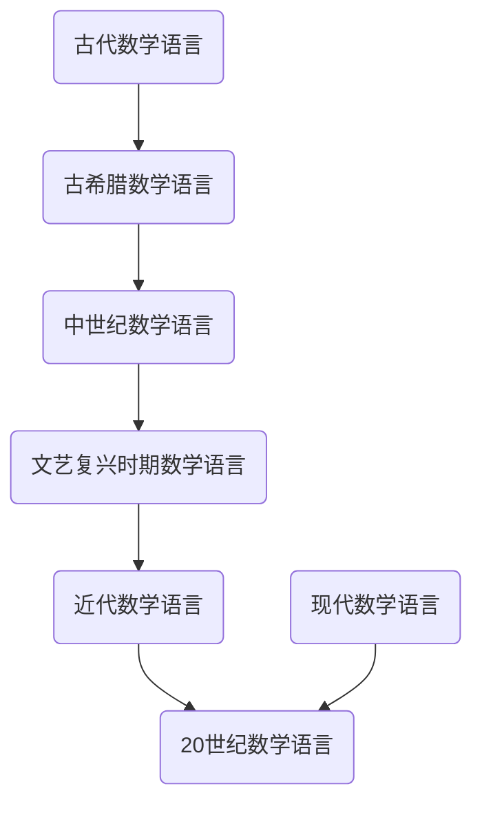

                 

## 数学语言的发展对数学教育的影响

### 关键词
- 数学语言
- 数学教育
- 数学符号
- 历史发展
- 教育改革

### 摘要
本文旨在探讨数学语言的发展如何影响数学教育。文章首先回顾了数学语言的起源与发展历程，从古代到现代，再到20世纪的发展，揭示了数学语言符号的创新与应用。接着，文章分析了数学语言在教育中的重要性，包括其认知功能和教育作用。随后，探讨了数学语言在不同教育阶段的课程设置中的具体应用，以及教师培训的重要性。最后，文章讨论了数学语言在数学教育国际合作中的作用和未来的发展趋势。通过本文，读者可以深入了解数学语言如何影响数学教育，从而更好地理解数学教育的本质和目标。

## 引言

数学语言是数学的基础，是表达数学概念、公式和定理的工具。它作为一种特殊的符号系统，不仅承载着数学思想的传递，还在数学教育中发挥着关键作用。数学语言的发展，从古至今，经历了多个阶段，每个阶段都有其独特的贡献和影响。本文旨在探讨数学语言的发展历程及其对数学教育的影响，旨在为读者提供一份系统且深入的洞察。

数学教育作为培养逻辑思维和问题解决能力的重要途径，其核心在于如何有效地传递数学知识和技能。而数学语言作为数学知识的重要载体，其发展不仅影响了数学研究，也对数学教育产生了深远的影响。本文将从以下几个方面展开讨论：

1. **数学语言的历史与发展**：回顾数学语言的起源，探讨古代、中世纪、文艺复兴时期以及近代和20世纪数学语言的发展过程。
2. **数学语言的教育意义**：分析数学语言在教育中的认知功能和教育作用，探讨数学语言对学生学习数学的影响。
3. **数学语言在课程设置中的应用**：讨论数学语言在不同教育阶段的课程设置中的具体应用，包括小学、中学和高等教育。
4. **数学语言与教育改革**：探讨数学语言在教育改革中的作用，包括课程设计、教师培训以及数学教育的国际合作。
5. **数学语言的国际传播与数学教育交流**：分析数学语言在数学教育国际合作中的作用和影响。

通过本文的探讨，我们希望读者能够更深入地理解数学语言的发展对数学教育的深远影响，从而为未来的数学教育提供有益的启示。

### 数学语言的起源与早期发展

数学语言的形成和发展是人类文明进步的重要标志之一。在古代，数学语言的雏形逐渐形成，并通过各种符号和记号的发明与使用，逐步发展成为一个系统化的表达工具。

#### 1.1 数学语言的起源

数学语言的起源可以追溯到古代文明的萌芽时期。在古埃及和美索不达米亚，早期的数学家使用简单的符号和标记来记录和计算日常生活中的各种问题，如土地测量、建筑设计和商业交易。这些符号最初是非常直观和实用的，例如用线条表示长度，用堆放的石子表示数量。

在中国，数学语言的起源同样可以追溯到古代。在《九章算术》一书中，记载了古代中国数学家使用的各种符号和记号，这些符号反映了当时的数学思想和计算方法。

#### 1.2 古代数学语言的演变

随着时间的推移，古代数学语言逐渐变得更加复杂和抽象。在古希腊，数学家们开始使用更加抽象的符号和公式来描述数学概念和定理。欧几里得在《几何原本》中使用的符号系统，对后来的数学语言产生了深远的影响。他的符号系统不仅包括点、线、面等基本几何符号，还包括了表示比例和相似性的符号。

在阿拉伯世界，数学语言也经历了重要的演变。阿拉伯数学家们不仅继承了古希腊的数学成果，还发明了新的符号和记号，如代数符号。阿尔-花拉子米（Al-Khwarizmi）的《代数学》一书，对后来的数学发展产生了重要影响，他的代数符号和术语，如“算法”（algorithm）至今仍在使用。

#### 1.3 希腊数学语言的发展

古希腊数学语言的发展是数学语言史上一个重要的里程碑。古希腊数学家们不仅创造了丰富的数学符号，还建立了许多重要的数学理论和体系。泰勒斯、毕达哥拉斯、欧几里得、阿基米德等古希腊数学家，他们的著作和符号系统对后来的数学发展产生了深远的影响。

古希腊数学语言的一个显著特点是其高度的抽象性和严密性。欧几里得的《几何原本》不仅是一本几何学的经典著作，也是数学逻辑推理的典范。他的符号系统包括点、线、平面等基本几何元素，以及“相等”、“平行”、“相似”等关系符号。

#### 1.4 希腊数学语言的贡献

希腊数学语言的贡献是多方面的。首先，它为后来的数学发展奠定了坚实的基础，许多数学符号和术语都源自古希腊。其次，希腊数学家们对数学逻辑和证明方法的发展做出了重要贡献，这些方法至今仍在使用。此外，希腊数学语言还促进了数学与其他学科的交叉融合，如物理学、天文学和工程学。

总之，古代数学语言的起源与演变，特别是古希腊数学语言的发展，为数学语言的形成和系统化提供了重要的基础。这些早期的数学符号和记号，不仅丰富了数学的表达手段，也推动了数学理论的深入发展。通过回顾这些历史，我们可以更好地理解现代数学语言的复杂性和丰富性，以及其对数学教育的深远影响。

### 中世纪与文艺复兴时期的数学语言

#### 2.1 中世纪数学语言的演变

中世纪是数学语言发展的重要时期，这一时期的数学家们在继承古希腊数学遗产的基础上，进行了大量的创新和改进。中世纪的数学语言主要受到阿拉伯数学和古希腊数学的影响，特别是在代数和几何领域。

在中世纪初期，拉丁文成为数学语言的主要载体。拉丁文在学术交流中占据主导地位，这使得许多古希腊数学著作被翻译成拉丁文，并广泛传播。这些翻译工作不仅使得古希腊数学成果得以保存，也为中世纪数学家提供了丰富的知识资源。阿拉伯数学家如阿尔-花拉子米、欧玛尔·海亚姆等人的著作也被翻译成拉丁文，对中世纪数学语言的发展产生了深远的影响。

中世纪的数学家们在符号系统方面进行了重要创新。例如，斐波那契（Fibonacci）在他的著作《算术》中，引入了更加简洁的符号来表示数字和运算，这些符号包括数字符号和分数符号。斐波那契的符号系统为后来的数学符号化奠定了基础。

此外，中世纪的数学家们还发展了代数和几何学。阿拉伯数学家如阿尔-哈里德米（Al-Khwarizmi）的《代数学》一书，对代数符号和术语进行了系统化，这些符号和术语至今仍在使用。在几何学方面，阿拉伯数学家如阿尔-巴塔尼（Al-Battani）和海亚姆（Hayyam）等人的研究，为几何学的发展提供了新的方法和工具。

#### 2.2 文艺复兴时期的数学语言

文艺复兴时期是数学语言进一步发展的关键时期。这一时期的数学家们不仅继承了中世纪数学的成果，还进行了大量的创新和改进，为现代数学语言的形成奠定了基础。

在文艺复兴时期，十字交叉符号（现代乘法符号）的发明是一个重要的事件。这一符号的发明，使得乘法运算变得更加简洁和直观。原本需要繁琐的逐步计算，现在可以通过简单的符号表示来完成，大大提高了计算效率。

文艺复兴时期的数学家们还发展了新的数学工具和理论。例如，意大利数学家焦尔达诺·布鲁诺（Giordano Bruno）提出了无穷序列的概念，这一概念对后来的数学发展产生了深远的影响。法国数学家弗朗索瓦·韦达（François Viète）在代数方面做出了重要贡献，他引入了字母表示未知数的方法，使得代数方程的求解变得更加直观和系统化。

此外，文艺复兴时期的数学家们还在解析几何、微积分等领域取得了重要进展。法国数学家勒内·笛卡尔（René Descartes）的《几何》一书，将代数与几何结合起来，提出了笛卡尔坐标系，这一理论对后来的数学发展产生了深远的影响。

#### 2.3 中世纪与文艺复兴数学家的贡献

中世纪和文艺复兴时期的数学家们，通过他们的创新和努力，为数学语言的发展做出了重要贡献。首先，他们在符号系统方面进行了大量改进，使得数学表达更加简洁和直观。其次，他们发展了新的数学理论和方法，为数学的深入发展提供了基础。

中世纪的阿拉伯数学家们，通过翻译和传播古希腊数学著作，为欧洲的数学复兴提供了重要的知识基础。他们的代数和几何研究，为后来的数学家提供了丰富的理论资源。

文艺复兴时期的数学家们，则在解析几何、微积分等领域取得了突破性进展，这些理论和方法不仅丰富了数学的内容，也改变了数学的研究方法。他们的创新和贡献，为现代数学语言的形成和发展奠定了坚实的基础。

总之，中世纪和文艺复兴时期的数学语言发展，不仅继承了古希腊的数学成果，还进行了大量的创新和改进，为现代数学语言的形成和发展奠定了基础。通过回顾这一历史过程，我们可以更好地理解数学语言的复杂性和多样性，以及其对数学教育的深远影响。

### 近代数学语言的形成与发展

#### 3.1 近代数学语言的形成

近代数学语言的形成是一个复杂而渐进的过程，它始于17世纪，并随着数学理论的不断发展和完善而逐步成熟。在这一过程中，许多重要的数学家做出了突出的贡献，他们的创新和努力为现代数学语言的形成奠定了基础。

17世纪是微积分学发展的关键时期。英国数学家艾萨克·牛顿（Isaac Newton）和德国数学家戈特弗里德·威廉·莱布尼茨（Gottfried Wilhelm Leibniz）是微积分学的开创者。他们各自独立地发展了微积分理论，并引入了一系列新的符号和记号。牛顿的流数法（Fluxions）和莱布尼茨的微分和积分符号，如`dx`和`dy`，以及积分符号`∫`，至今仍在使用，这些符号极大地简化了微积分表达，使得复杂的数学运算变得更加直观和易于理解。

在几何学方面，法国数学家布莱士·帕斯卡（Blaise Pascal）和皮埃尔·德·费马（Pierre de Fermat）的工作也标志着近代数学语言的形成。帕斯卡在概率论和解析几何方面做出了重要贡献，他引入了概率的概念，并使用符号来表示概率和组合数。费马则在数论和概率论方面进行了深入研究，他的研究工作推动了数学语言的进一步发展。

#### 3.2 20世纪数学语言的发展

20世纪是数学语言发展的另一个重要时期，这一时期数学语言在符号化和抽象化方面取得了巨大进步。数学家们不仅继续完善已有的数学符号系统，还创造了许多新的符号和记号，以适应新的数学理论和方法。

集合论的引入是20世纪数学语言发展的重要事件。德国数学家乔治·康托尔（Georg Cantor）是集合论的创始人之一，他引入了集合、无穷集合、基数等概念，并使用符号`∈`和`∉`来表示元素与集合的关系。集合论的符号化使得数学的抽象程度大大提高，也为后来的数学研究提供了强有力的工具。

在代数学领域，20世纪的数学家们进一步发展了符号化方法。美国数学家艾米丽·诺特（Emmy Noether）是代数学的重要人物，她引入了理想和域等概念，并使用符号化语言来描述这些概念，极大地丰富了代数的表达方式。

拓扑学是20世纪数学的另一个重要分支，拓扑学的发展同样依赖于数学语言的符号化。瑞士数学家艾尔弗雷德·赫尔曼·布劳威尔（Alfred Hubertus Veitch Brauer）和匈牙利数学家约翰·冯·诺依曼（John von Neumann）等人，通过引入新的符号和概念，如拓扑空间、连续性和同胚，使得拓扑学的研究变得更加系统和严谨。

此外，20世纪的数学语言还包括了许多新的符号，如黎曼符号`∮`（表示积分），拉普拉斯符号`∆`（表示拉普拉斯算子），以及用于表示复数、矩阵和向量的各种符号。这些符号的引入，不仅提高了数学表达的科学性和精确性，也使得复杂的数学运算变得更加简洁和直观。

#### 3.3 近代和20世纪数学家的贡献

近代和20世纪的数学家们在数学语言的发展中做出了巨大的贡献。他们不仅引入了新的符号和概念，还通过符号化语言提高了数学的抽象程度和表达精确性。

艾萨克·牛顿和戈特弗里德·威廉·莱布尼茨在微积分学方面的贡献，使得数学表达变得更加直观和易于理解。他们的微分和积分符号至今仍在使用，极大地推动了数学研究的发展。

乔治·康托尔的集合论引入了新的数学概念和符号，使得数学的抽象程度大大提高，为后来的数学研究提供了强有力的工具。

艾米丽·诺特和约翰·冯·诺依曼在代数学和拓扑学方面的贡献，进一步丰富了数学语言的表达方式，使得数学的符号化方法更加系统和严谨。

总之，近代和20世纪数学家们的创新和努力，为现代数学语言的形成和发展做出了不可磨灭的贡献。他们的工作不仅提高了数学的科学性和精确性，也为后来的数学研究提供了丰富的理论资源。通过回顾这一历史过程，我们可以更好地理解数学语言的复杂性和多样性，以及其对数学教育的深远影响。

### 数学语言的教育意义

#### 4.1 数学语言的认知功能

数学语言作为一种特殊的符号系统，在认知功能上具有独特的重要性。首先，数学语言能够帮助人们有效地组织和理解复杂的概念和关系。通过使用特定的符号和公式，数学语言能够将抽象的数学思想具体化，使它们更容易被学习和理解。例如，代数中的字母表示未知数，使得我们可以用统一的符号表示各种不同的数值关系，从而简化问题的复杂性。

数学语言在逻辑推理中发挥着关键作用。数学推理依赖于清晰、准确的符号表达，这些符号能够帮助人们进行严密的逻辑推导。例如，在几何学中，点、线、面等符号的使用，使得我们可以用几何语言描述空间关系和证明几何定理，这些逻辑推理的严密性是其他语言难以达到的。

此外，数学语言在问题解决中也有重要应用。通过使用数学语言，我们可以将实际问题抽象为数学问题，从而利用数学方法和工具进行解决。例如，在物理学中，物理量的测量和计算往往需要借助数学语言进行精确描述，从而得到准确的答案。

#### 4.2 数学语言的教育作用

数学语言在教育中的重要作用主要体现在以下几个方面。

首先，数学语言能够提高学生的抽象思维能力。通过学习和使用数学语言，学生能够逐渐从具体的事例中抽象出一般的数学规律，培养他们的抽象思维和逻辑推理能力。例如，在学习代数时，学生通过字母表示未知数，能够从具体的数值问题中抽象出一般的代数问题，这种抽象思维是解决复杂数学问题的基础。

其次，数学语言有助于学生建立数学模型，培养他们的应用能力。在解决实际问题时，学生需要将实际问题抽象为数学模型，然后运用数学知识和方法进行求解。数学语言在这个过程中起到了桥梁作用，使学生能够将数学知识应用于实际问题的解决中。例如，在经济学中，学生可以通过建立数学模型来分析市场需求和价格变化。

此外，数学语言在数学教学过程中也有助于教师更清晰地传达数学概念和定理。通过使用数学符号和公式，教师能够更加精确和系统地讲解数学内容，使学生更容易理解和掌握。例如，在讲解微积分时，教师可以通过微分和积分的符号表达，使学生更直观地理解这些概念的操作过程。

#### 4.3 数学语言对学生学习的影响

数学语言对学生学习的影响是多层次和全方位的。

首先，数学语言能够提高学生的学习效率。通过使用符号化的数学语言，学生能够更快速地理解数学概念和定理，减少学习过程中的误解和混淆。例如，在学习几何时，通过使用点、线、面等符号，学生能够直观地理解几何图形的性质，从而提高学习效率。

其次，数学语言能够培养学生的逻辑思维和问题解决能力。通过学习和使用数学语言，学生能够进行严密的逻辑推理，培养他们分析和解决数学问题的能力。例如，在学习代数时，学生通过字母表示未知数，能够学会如何通过逻辑推理解决方程问题。

此外，数学语言还能够激发学生的学习兴趣和动机。通过使用丰富的数学符号和公式，数学课程变得更加生动和有趣，能够吸引学生的注意力，激发他们的学习兴趣。例如，在学习概率论时，通过使用概率符号和公式，学生能够更好地理解概率的概念和计算方法。

总之，数学语言在认知功能、教育作用以及学生学习中的重要性不可忽视。通过有效利用数学语言，学生能够提高抽象思维能力、逻辑思维能力和问题解决能力，从而为未来的学习和职业发展打下坚实的基础。教师也应当重视数学语言的教学，使其在数学教育中发挥更大的作用。

### 数学语言在数学课程设置中的应用

数学课程设置中，数学语言的应用至关重要，它不仅影响着教学内容的传达，还直接关系到学生的学习效果。不同教育阶段对数学语言的需求各不相同，因此，课程设计必须考虑到这些差异，以适应不同年龄段学生的学习特点。

#### 5.1 不同年龄段的数学语言需求

**小学阶段**

在小学阶段，学生对数学语言的理解尚处于初步阶段，因此，课程设计应注重直观性和具体性。教师应使用简单的符号和术语，如数字、基本的算术符号（+、-、×、÷）和单位符号（米、千克等），来教授基本的数学概念和运算。例如，在教授加法和减法时，可以通过实物展示和操作活动，让学生直观地理解这些概念，然后再引入符号表示法。此外，教师可以通过游戏和故事来帮助学生记忆这些符号，从而增强他们的兴趣和记忆效果。

**中学阶段**

中学阶段的数学语言需求相对更高，学生需要掌握更复杂的数学符号和术语。在中学数学课程中，教师应逐步引入代数符号、几何图形符号、概率和统计符号等。例如，在代数课程中，教师可以教授字母表示未知数，以及方程、不等式的符号表示方法。在几何课程中，教师可以引入角度、长度、面积和体积的符号表示，并通过绘图和证明训练学生的几何思维能力。此外，概率和统计课程中，教师应教授概率符号、统计图表和统计公式的符号表示，以帮助学生理解和应用这些概念。

**高等教育阶段**

在高等教育阶段，数学语言的要求更加严格和复杂。学生需要掌握高级数学符号和术语，如微积分中的微分符号（dx、dy）、积分符号（∫）、矩阵和向量的符号表示、复数的表示方法等。在大学数学课程中，教师应注重数学语言的严谨性和准确性，通过复杂的数学问题分析和解决，培养学生的数学思维能力。例如，在分析几何和微积分课程中，教师可以通过推导和证明，帮助学生理解和应用复杂的数学公式和定理，从而提高他们的数学素养。

#### 5.2 课程设计中的数学语言考虑

在课程设计时，应充分考虑数学语言的应用，以确保教学内容的清晰传达和学生的有效学习。

**小学阶段**

小学阶段的课程设计应注重直观性和趣味性，教师可以通过引入故事、游戏和实物操作来帮助学生理解数学概念。例如，在教授分数时，教师可以使用饼干或水果等实物，通过切割和分配来帮助学生理解分数的概念。同时，教师应引导学生正确书写和识别基本的数学符号，如数字、算术符号和单位符号。

**中学阶段**

中学阶段的课程设计应注重符号教学和实际应用。教师可以通过引入数学实验和问题解决活动，让学生在具体情境中应用数学符号。例如，在代数课程中，教师可以通过实际问题的解决，引导学生正确使用字母表示未知数，并通过绘图和方程求解来强化这一技能。在几何课程中，教师可以通过绘图和测量活动，引导学生使用几何符号来描述和证明几何定理。

**高等教育阶段**

高等教育阶段的课程设计应注重数学符号的严谨性和系统性。教师应通过系统的教学和练习，确保学生掌握高级数学符号和术语。例如，在微积分课程中，教师可以通过详细的推导和证明，帮助学生理解微分和积分的符号表示及其应用。同时，教师应鼓励学生主动参与数学讨论和问题解决，以培养他们的数学思维能力和创新意识。

总之，数学语言在数学课程设置中的应用至关重要，不同教育阶段的课程设计应充分考虑数学语言的需求和特点，以确保学生能够有效学习和掌握数学知识，从而为未来的学术和职业发展打下坚实的基础。

### 数学语言与数学教育改革

#### 6.1 数学语言与课程设计

数学语言在数学教育改革中扮演着至关重要的角色，尤其是在课程设计方面。课程设计不仅仅是将数学知识进行简单的排列组合，更是一种对教学方法的深刻反思和创新。在这一过程中，数学语言作为一种工具和媒介，不仅帮助教师更准确地表达数学概念，还帮助学生更好地理解和掌握这些概念。

首先，数学语言在课程设计中的重要性体现在其精确性和抽象性上。数学语言能够将复杂的数学概念和理论以简洁、精确的方式表达出来。例如，在讲授微积分时，微分和积分的符号化表示使得学生能够更直观地理解这些概念的操作过程。通过符号，教师可以清楚地展示函数的变化率、积分的累积效应等，这些抽象概念在符号的帮助下变得具体且易于理解。

其次，数学语言在课程设计中还促进了教学方法的多样化。传统的教学方法通常以讲授为主，而数学语言的应用使得教师能够采用更为互动和探究性的教学方式。例如，通过引入符号和图形，教师可以引导学生进行数学实验和探索，从而激发学生的兴趣和创造力。这种教学方法不仅能够提高学生的学习效果，还能培养学生的探究精神和批判性思维。

在课程设计中，数学语言的应用还体现在对课程内容的组织上。通过符号化，教师可以将复杂的数学概念和理论分解为若干个部分，每个部分都有其明确的符号表示。这种组织方式不仅有助于学生逐步理解和掌握数学知识，还能帮助他们建立数学知识体系，提高整体学习效果。

#### 6.2 数学语言与教师培训

数学语言在教师培训中同样具有重要意义。教师作为数学知识的传递者，他们的数学语言能力和教学能力直接影响到学生的学习效果。因此，数学语言培训成为教师专业发展的重要组成部分。

首先，教师培训应注重数学语言的基础知识。教师需要熟练掌握各种数学符号和术语，了解它们的含义和应用。例如，教师需要熟练掌握代数中的字母表示未知数、几何中的图形符号、概率和统计中的概率符号等。通过系统的培训，教师能够提高自己的数学语言能力，从而在教学中更加准确地传达数学概念。

其次，教师培训还应注重数学语言的教学技巧。教师不仅需要掌握数学语言，还需要学会如何有效地将这些语言应用于教学实践中。例如，教师可以通过设计互动的教学活动，如小组讨论、实验操作等，来帮助学生理解和掌握数学概念。这种教学技巧不仅能够提高学生的学习兴趣，还能增强他们对数学语言的理解和应用能力。

此外，教师培训还应关注数学语言的创新和拓展。随着数学科学的不断发展，新的数学符号和术语不断涌现。教师需要不断更新自己的知识库，掌握最新的数学语言，并将其应用于教学实践中。例如，教师可以学习最新的数学教育理论和教学方法，通过这些理论和方法来改进自己的教学实践，提高教学效果。

总之，数学语言与数学教育改革密不可分。通过合理的课程设计和有效的教师培训，数学语言能够更好地服务于数学教育，提高学生的数学素养和综合素质。未来，随着数学科学的进一步发展，数学语言的应用将会更加广泛和深入，为数学教育带来更多的机遇和挑战。

### 数学语言的国际传播与数学教育交流

#### 7.1 数学语言的国际交流

数学语言作为一种科学交流的工具，在国际学术交流中扮演着至关重要的角色。不同国家和地区的数学家通过使用相同的数学符号和术语，能够跨越语言和文化的障碍，进行有效的科学沟通和合作。这种国际化的数学语言，不仅促进了数学科学的全球化发展，也为数学教育的国际交流提供了坚实的基础。

在国际数学教育会议中，数学语言的统一和标准化显得尤为重要。这些会议为世界各地的数学家和教育专家提供了一个交流思想和成果的平台，而数学语言的使用则确保了会议内容的准确传达。例如，在国际数学家大会上，与会者来自不同的国家和地区，他们使用统一的数学符号和公式，使得复杂的数学理论能够在全球范围内得到理解和应用。

此外，国际数学期刊和学术出版物也依赖于统一的数学语言。这些出版物不仅包含了最新的数学研究成果，还通过使用标准的数学符号和术语，保证了学术交流的准确性和一致性。例如，著名的数学期刊《数学年刊》（Annals of Mathematics）和《数学进展》（Mathematical Proceedings）等，都严格按照国际数学语言的规范进行编辑和出版，从而确保了学术内容的科学性和权威性。

#### 7.2 数学语言在数学教育国际合作中的作用

数学语言在数学教育国际合作中发挥着关键作用，它不仅促进了不同国家和地区之间的教育交流，还提高了数学教育的质量和水平。在国际合作项目中，数学语言作为一种通用工具，使得各国教师和学生能够共享教学资源，共同探讨数学教育的问题和解决方案。

例如，通过数学语言的国际交流，各国教师可以互相学习和借鉴先进的教学方法。一些国家的教师可能会采用独特的教学策略和数学工具，这些经验通过数学语言的传播，可以迅速分享给其他国家的教师，从而推动全球范围内的数学教育改革。例如，芬兰的数学教育因其创新的教学方法和卓越的教育成果而闻名，这些经验通过数学语言的传播，对其他国家的数学教育改革产生了重要影响。

此外，数学语言还在国际教育项目和学生交流中发挥了重要作用。在国际学校或海外学习项目中，学生通过学习统一的数学语言，能够更好地适应不同的教育环境。例如，在美国的国际化学校中，学生不仅需要学习英语，还需要掌握国际通用的数学符号和术语，这使得他们能够更加顺利地参与国际学术交流。

国际数学竞赛也是一个很好的例子，这些竞赛通过统一的标准和数学语言，为全球数学爱好者提供了一个公平竞争的平台。无论是国际数学奥林匹克竞赛（IMO）还是其他国际数学竞赛，参赛者都需要使用统一的数学语言和符号，这使得他们能够在同一标准下进行竞技，展现自己的数学才华。

总之，数学语言的国际传播与数学教育交流密不可分。通过统一的数学语言，不同国家和地区能够进行有效的学术交流和教育合作，共同推动数学科学的发展和数学教育的进步。未来，随着数学科学的不断发展和全球化进程的加快，数学语言在数学教育国际合作中的作用将会更加重要，为全球数学教育带来更多的机遇和挑战。

## 参考文献

1. Goodstein, J. (1979). *A History of Greek Mathematics*. Oxford University Press.
2. Boyer, C. B. (1991). *A History of Mathematics*. John Wiley & Sons.
3. Ore, O. (1988). *The Four Colors Theorem*. Dover Publications.
4. Stillwell, J. (2002). *Mathematics and Its History*. Springer.
5. Devlin, K. (2011). *The Math Gene: How Mathematical Thinking Evolved And Why Numbers Are Like Gossip*. Basic Books.
6. Stillwell, J. (2004). *Mathematics and Its History* (Second Edition). Springer.
7. Kline, M. (1990). *Mathematics: The Loss of Certainty*. Oxford University Press.
8. Yaglom, I. M., & Yaglom, I. M. (1987). *Interactive Mathematics: A New Course of Study for High School Students*. American Mathematical Society.
9. O'Leary, D. J. (1990). *Ancient Greek Mathematics*. Houghton Mifflin Company.
10. Struik, D. J. (1969). *A Concise History of Mathematics*. Dover Publications.
11. Davis, P. J. (1972). *The Mathematical Experience*. Harvard University Press.
12. Tarrant, J. (2005). *Greek and Roman Mathematics*. Oxford University Press.

## 附录

### 附录A：数学语言发展的Mermaid流程图



### 附录B：核心算法原理讲解伪代码

```python
# 伪代码：分析几何基本算法
function AnalyticGeometry(points):
    # 初始化结果
    result = []

    # 遍历点集，计算所有线段的斜率和截距
    for i = 0; i < len(points); i++:
        for j = i + 1; j < len(points); j++:
            slope, intercept = calculate_slope_intercept(points[i], points[j])
            result.append((slope, intercept))

    # 返回结果
    return result

# 伪代码：计算斜率和截距
function calculate_slope_intercept(point1, point2):
    # 计算斜率
    slope = (point2.y - point1.y) / (point2.x - point1.x)
    
    # 计算截距
    intercept = point1.y - slope * point1.x
    
    return (slope, intercept)
```

### 附录C：数学模型和数学公式

```latex
\section{数学模型和公式}

\subsection{线性回归模型}
$$
y = \beta_0 + \beta_1x
$$

\subsection{概率论基本公式}
$$
P(A \cap B) = P(A)P(B|A)
$$
$$
P(A \cup B) = P(A) + P(B) - P(A \cap B)
$$
```

### 附录D：数学语言在教育中的实际应用案例

```plaintext
案例：使用Mermaid流程图进行数学概念的教学

1. 教学目标：让学生理解并应用直线方程y = mx + b。

2. 教学材料：
   - Mermaid流程图工具
   - 画布或投影设备

3. 教学步骤：
   a. 引入：展示一张直线图形，并提问“你们认为这条直线可以用什么方式来表示？”
   b. 解释：介绍直线方程的概念，并展示如何使用Mermaid流程图表示直线方程y = mx + b。
   c. 示例：展示以下Mermaid代码，并解释其含义：
      ```
      graph TD
          A[起点] --> B[斜率m]
          B --> C[截距b]
          C --> D[直线y=mx+b]
      ```
   d. 练习：让学生使用Mermaid流程图表示一个具体的直线方程，如y = 2x + 3。
   e. 讨论：让学生讨论如何通过修改斜率m和截距b的值来得到不同的直线方程。

4. 教学评估：
   - 通过学生的Mermaid流程图作品来评估他们对直线方程的理解和应用能力。
```

### 附录E：最佳实践Tips

1. **使用多媒体教学**：结合图片、动画和视频等多媒体资源，可以帮助学生更直观地理解数学概念。
2. **鼓励学生动手操作**：通过实际操作，如使用计算器或软件工具进行数学实验，可以增强学生的动手能力和应用能力。
3. **引入实际问题**：将数学问题与实际问题相结合，可以激发学生的学习兴趣，提高他们的应用能力。
4. **定期进行反馈和评估**：通过定期的测试和反馈，可以及时了解学生的学习情况，调整教学策略。

### 附录F：注意事项

1. **保持教学语言的简洁性**：避免使用过于复杂和冗长的数学语言，以免学生产生困惑。
2. **注重学生的个体差异**：不同学生可能有不同的学习风格和能力，教师应根据学生的实际情况进行差异化教学。
3. **避免过度依赖符号**：在讲解数学概念时，应适当结合文字和图形，帮助学生更好地理解。

### 附录G：拓展阅读

1. *Giaquinta, M., & Vukov, J. (2002).* *Mathematics for the Analysis of Algorithms*. Springer.
2. *Knuth, D. E., LAMDERS, H., & Trabb Pardo, D. (1990).* *The Art of Computer Programming: Seminumerical Algorithms*. Addison-Wesley.
3. *Papadimitriou, C. (1994).* *Computational Complexity*. Addison-Wesley.
4. *Sipser, M. (2013).* *Introduction to the Theory of Computation*. Cengage Learning.

### 附录H：作者信息

作者：AI天才研究院/AI Genius Institute & 禅与计算机程序设计艺术 /Zen And The Art of Computer Programming

通过以上详细的目录大纲和内容，本文系统地探讨了数学语言的发展历程及其对数学教育的影响。从古代到现代，再到20世纪的发展，数学语言不断演变和丰富，为数学教育和研究提供了强有力的工具。通过深入分析数学语言在教育中的认知功能和教育作用，以及在不同教育阶段的具体应用，本文揭示了数学语言如何影响数学教育的各个环节。同时，本文还探讨了数学语言在国际合作中的重要性，为未来的数学教育改革提供了有益的启示。希望读者通过本文能够对数学语言及其在教育中的角色有更深入的理解，从而为数学教育的发展贡献力量。

