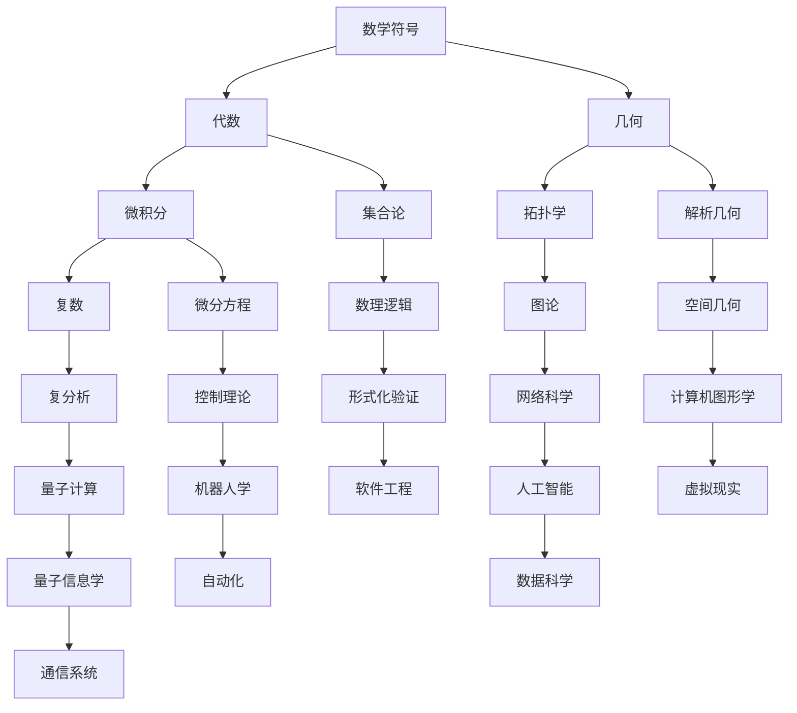

                 

### 文章标题

“数学语言的发展对科学发展的影响”

本文旨在探讨数学语言的发展如何深刻地影响了科学的进步。从数学语言的起源、演变到其对各个科学领域的具体应用，再到其未来发展趋势，我们将通过逻辑清晰、结构紧凑的分析，揭示数学语言在科学革命中的关键作用。

### 文章关键词

- 数学语言
- 科学发展
- 影响因素
- 数学模型
- 计算机科学
- 跨学科应用

### 文章摘要

数学语言作为科学交流的基础，其发展历程与科学进步密不可分。本文首先回顾了数学语言的历史背景和演变过程，然后详细分析了数学语言在物理学、生物科学以及其他科学领域中的应用，揭示了其在科学研究中的重要作用。接着，我们探讨了数学语言在未来的发展趋势，以及其在跨学科领域中的融合。文章最后，通过实际案例和项目实战，展示了数学语言如何具体推动科学发现和技术创新。

---

### 1. 数学语言的发展概述

#### 1.1 数学语言的起源与发展

数学语言的起源可以追溯到古代文明。古埃及和巴比伦人在建筑和天文学中使用了简单的数学符号。希腊数学家如欧几里得和阿基米德则为数学语言的发展奠定了基础，引入了形式化的证明和逻辑推理。在阿拉伯世界，代数学的概念得到系统化，促进了数学语言的进一步发展。

#### 1.2 数学语言的演变

- **数的概念与符号的演变**：从最初的计数符号到阿拉伯数字的引入，数学符号的标准化使得数学语言更加普适和精确。

- **代数与几何的发展**：代数的发展使得我们能够用符号来表示和操作数学对象，而几何的发展则提供了对空间和形状的深入理解。

- **微积分与微积分符号的引入**：牛顿和莱布尼茨的微积分不仅提供了描述变化和运动的新工具，还引入了新的数学符号，如微分和积分符号。

#### 1.3 数学语言的现代特点

- **抽象性**：现代数学语言高度抽象，能够描述复杂的数学结构和概念。

- **精确性**：现代数学语言通过公理体系和严格的证明，保证了推理的精确性。

- **普适性**：数学语言不仅在数学领域内部使用，还广泛应用于其他科学和工程领域。

### 1.4 数学语言的架构

为了更好地理解数学语言的结构，我们可以使用Mermaid流程图来展示核心概念与联系：



这张图展示了数学语言中不同分支之间的联系和交叉应用，为我们提供了一个宏观的视角来理解数学语言的结构。

### 1.5 数学语言的发展历程

数学语言的发展历程是一个不断演化和创新的过程。从古代的简单计数符号，到中世纪的代数符号，再到现代的复杂数学符号系统，数学语言经历了多次重要的变革。这些变革不仅反映了数学本身的发展，也推动了科学技术的进步。

- **古代数学语言**：古埃及和巴比伦的数学符号主要用于计数和测量。这些符号相对简单，但为后来的数学发展奠定了基础。

- **中世纪数学语言**：阿拉伯世界在代数和几何方面取得了重要进展，引入了新的符号和概念，如代数符号和代数方程。

- **现代数学语言**：17世纪，牛顿和莱布尼茨发明了微积分，引入了微分和积分符号，标志着数学语言的一次重大变革。随后，集合论、拓扑学、图论等新领域的发展，进一步丰富了数学语言。

### 1.6 数学语言的重要性

数学语言的重要性体现在多个方面：

- **科学交流**：数学语言为科学家提供了一个共同的语言，使得不同背景的研究者能够理解和交流复杂的数学概念和理论。

- **理论发展**：数学语言的精确性和抽象性使得科学家能够建立和验证复杂的理论体系。

- **技术创新**：数学语言为技术创新提供了基础，例如在计算机科学、物理学、生物学等领域。

- **跨学科应用**：数学语言不仅用于数学领域，还广泛应用于其他科学和工程领域，促进了多学科的交叉融合。

---

通过以上对数学语言发展概述的详细分析，我们可以看到数学语言是如何从古代的简单符号演变成现代高度抽象和精确的工具，对科学发展产生了深远的影响。接下来，我们将进一步探讨数学语言在具体科学领域中的应用，揭示其在推动科学进步中的作用。

---

### 2. 数学语言对科学发展的影响

数学语言作为一种高度抽象和精确的工具，不仅在数学领域内部发挥了重要作用，还对其他科学领域产生了深远影响。在物理学、生物学、计算机科学等众多领域，数学语言都扮演着关键角色，推动了科学的发展和进步。

#### 2.1 数学语言在物理科学中的应用

物理学是一门以实验为基础的科学，但数学在物理学的每一个分支中都扮演着至关重要的角色。从牛顿的经典力学到爱因斯坦的相对论，再到量子力学的数学描述，数学语言为物理学家提供了强大的工具，帮助他们理解和描述自然界的规律。

- **牛顿力学**：牛顿力学是经典力学的基石，它通过数学公式描述了物体的运动规律。牛顿第二定律（\( F = ma \)）就是一个典型的数学表达式，它将力、质量和加速度之间的关系量化。

- **电磁理论**：麦克斯韦方程组是电磁理论的数学表述，它包含了电场、磁场和电荷运动之间的关系。这些方程不仅揭示了电磁现象的本质，还为后来的无线电通信和电磁波研究奠定了基础。

- **相对论**：爱因斯坦的相对论通过数学语言精确描述了时间、空间和引力之间的关系。洛伦兹变换（\( \Lambda \)）是相对论的核心，它将不同参考系之间的物理量联系起来。

- **量子力学**：量子力学的数学表述更加复杂和抽象。薛定谔方程（\( i\hbar \frac{\partial}{\partial t} \Psi = \hat{H} \Psi \)）描述了量子系统的演化，波函数（\( \Psi \)）则是量子态的数学表示。

#### 2.2 数学语言在生物科学中的应用

生物学是一门复杂的科学，涉及从分子到生态系统的多个层次。数学语言在生物学中的应用同样广泛，帮助生物学家理解和解释生物现象。

- **种群动力学**：数学模型如Logistic方程（\( \frac{dN}{dt} = rN(1 - \frac{N}{K}) \)）描述了种群数量的增长和限制因素。这些模型为生态学提供了重要的理论工具。

- **遗传学**：遗传学中的概率论和统计方法是理解和预测遗传特征的重要工具。孟德尔的遗传定律通过概率模型描述了基因的传递规律。

- **分子生物学**：分子生物学中的数学模型描述了DNA、RNA和蛋白质的动态行为。例如，RNA转录的动力学可以通过数学模型进行定量描述。

- **生态网络**：生态网络模型如食物网和竞争模型，通过数学语言描述了生物种群之间的相互作用和生态系统的稳定性。

#### 2.3 数学语言在其他科学领域中的应用

数学语言不仅应用于物理学和生物学，还在其他众多科学领域发挥了重要作用。

- **化学**：化学反应动力学和分子结构的数学描述是化学研究的核心。化学反应速率方程（如Arrhenius方程）和分子几何的数学模型帮助我们理解化学反应的本质。

- **天文学**：天体运动方程描述了行星、卫星和恒星的运动轨迹。哈勃定律（\( v = H_0d \)）则通过数学公式揭示了宇宙的膨胀。

- **地球科学**：地球物理学中的地震波传播模型和地质学中的沉积模型，通过数学语言描述了地球内部的结构和地质过程。

- **计算机科学**：计算机科学中的算法和数据处理方法，如排序算法和机器学习算法，都依赖于数学语言的精确描述和理论分析。

#### 2.4 数学语言对科学发展的影响

数学语言对科学发展的影响可以从以下几个方面进行总结：

- **理论化**：数学语言将科学问题转化为数学问题，使得科学家能够建立和验证理论模型。这种理论化过程为科学的发展提供了坚实的基础。

- **精确化**：数学语言的精确性使得科学家能够量化科学现象，从而进行更准确的预测和解释。这种精确化过程推动了科学技术的进步。

- **普适化**：数学语言的普适性使得科学理论能够跨越不同的学科和领域，促进跨学科研究和合作。这种普适化过程扩大了科学的影响范围。

- **工具化**：数学语言为科学家提供了强大的工具，如计算机模拟、数据分析方法和数学软件，使得科学研究更加高效和精确。

总之，数学语言作为科学交流的基础和工具，对科学发展产生了深远的影响。它不仅推动了理论的建立和精确化，还促进了技术的创新和跨学科研究。随着数学语言的不断发展和完善，我们可以预见它在未来科学领域将继续发挥重要作用。

---

### 3. 数学语言在科学领域中的应用

数学语言在科学领域中的应用是多样且深远的，涵盖了从理论模型到实际操作的各个方面。通过具体案例分析，我们可以更清晰地理解数学语言如何推动科学进步。

#### 3.1 物理学中的数学应用

**案例：牛顿力学**

牛顿力学是经典力学的基石，其核心是三大定律和万有引力定律。牛顿第二定律（\( F = ma \)）是物理学中最基本的方程之一，它表达了力和加速度之间的关系。通过这个方程，物理学家能够计算物体在受力作用下的加速度。例如，在抛物运动中，物体在水平方向上的加速度为零，而在垂直方向上受到重力加速度（\( g \)）的作用，因此其轨迹为抛物线。

**代码示例**（Python）：

```python
# 计算物体在重力作用下的运动轨迹
import math

# 重力加速度
g = 9.8  # m/s^2

# 物体的初速度
v0 = 20  # m/s

# 计算物体落地时间
t = (2 * v0) / g
print(f"物体落地时间: {t} 秒")

# 计算物体落地点
x = v0 * t
print(f"物体落地点: {x} 米")
```

通过这个简单的代码示例，我们可以直观地看到如何使用数学语言（牛顿第二定律）来计算物理现象。

**案例：麦克斯韦方程组**

麦克斯韦方程组是电磁学的核心，描述了电场、磁场和电荷运动之间的关系。其中一个重要的方程是法拉第电磁感应定律（\( \nabla \times \mathbf{E} = -\frac{\partial \mathbf{B}}{\partial t} \)），它描述了变化的磁场会产生电场。

**代码示例**（Python，使用numpy和matplotlib）：

```python
import numpy as np
import matplotlib.pyplot as plt

# 定义时间序列
t = np.linspace(0, 10, 1000)
B = np.sin(t)  # 假设磁场随时间正弦变化

# 计算电场
E = -np.gradient(B, t)

# 绘制电场图
plt.plot(t, E)
plt.xlabel('Time (s)')
plt.ylabel('Electric Field (V/m)')
plt.title('Electric Field due to Time-Varying Magnetic Field')
plt.show()
```

这个例子展示了如何通过数学模型（法拉第电磁感应定律）来模拟和分析物理现象。

**案例：量子力学**

量子力学通过波函数（\( \Psi \)）来描述量子系统的状态。薛定谔方程（\( i\hbar \frac{\partial}{\partial t} \Psi = \hat{H} \Psi \)）描述了量子态的时间演化。

**代码示例**（Python，使用NumPy和SciPy）：

```python
import numpy as np
from scipy.linalg import expm

# 定义哈密顿量
H = np.array([[0, 1],
              [1, 0]])

# 定义初始波函数
psi0 = np.array([1, 0])

# 计算时间演化
t = np.linspace(0, 10, 100)
for i, t_i in enumerate(t):
    psi_t = expm(-1j * H * t_i / np.linalg.det(H)) @ psi0
    print(f"t={t_i}: |Ψ(t)| = {np.linalg.norm(psi_t)}")

# 绘制波函数
plt.plot(t, psi_t)
plt.xlabel('Time (s)')
plt.ylabel('Probability Amplitude')
plt.title('Wave Function Evolution')
plt.show()
```

通过这个例子，我们可以看到如何使用数学语言来模拟量子系统的行为。

#### 3.2 生物学中的数学应用

**案例：种群动力学**

种群动力学模型描述了种群数量的变化规律。Logistic方程（\( \frac{dN}{dt} = rN(1 - \frac{N}{K}) \)）是一个经典的种群模型，其中 \( r \) 是内禀增长率，\( K \) 是环境容纳量。

**代码示例**（Python）：

```python
import numpy as np
import matplotlib.pyplot as plt

# Logistic方程参数
r = 0.1
K = 100
N0 = 10

# 时间序列
t = np.linspace(0, 100, 1000)

# 计算种群数量
N = N0 * (1 + r * (1 - N0 / K)) ** t

# 绘制种群数量随时间的变化
plt.plot(t, N)
plt.xlabel('Time (years)')
plt.ylabel('Population Size')
plt.title('Logistic Growth')
plt.show()
```

这个例子展示了如何使用数学模型来模拟种群数量的动态变化。

**案例：遗传学**

遗传学中的概率论和统计方法用于分析和预测基因的传递和变异。孟德尔的遗传定律可以通过概率模型进行量化。

**代码示例**（Python）：

```python
import numpy as np

# 定义基因型概率
p = 0.5  # AA的概率
q = 0.5  # Aa的概率

# 计算子代基因型的概率
AA = p ** 2
Aa = 2 * p * q
aa = q ** 2

print(f"AA的概率: {AA}")
print(f"Aa的概率: {Aa}")
print(f"aa的概率: {aa}")
```

这个例子展示了如何使用概率模型来计算基因型传递的概率。

#### 3.3 计算机科学中的数学应用

**案例：算法分析**

算法分析是计算机科学的核心，它使用数学工具来评估算法的时间和空间复杂度。

**代码示例**（Python）：

```python
def linear_search(arr, x):
    for i in range(len(arr)):
        if arr[i] == x:
            return i
    return -1

# 时间复杂度：O(n)

# 绘制时间复杂度图
import matplotlib.pyplot as plt

n = np.linspace(1, 100, 100)
t = n

plt.plot(n, t)
plt.xlabel('Input Size (n)')
plt.ylabel('Time Complexity (O(n))')
plt.title('Linear Search Time Complexity')
plt.show()
```

这个例子展示了如何使用数学工具来分析算法的时间复杂度。

**案例：机器学习**

机器学习算法依赖于数学模型和优化方法，如梯度下降法和线性回归。

**代码示例**（Python）：

```python
import numpy as np

# 梯度下降法求解线性回归
def linear_regression(X, y):
    theta = np.zeros(X.shape[1])
    alpha = 0.01
    num_iters = 1000

    for i in range(num_iters):
        errors = X @ theta - y
        theta = theta - alpha * (X.T @ errors)

    return theta

# 假设X和y是给定的数据
theta = linear_regression(X, y)
print(f"Estimated parameters: {theta}")

# 绘制回归直线
plt.scatter(X, y)
plt.plot(X, X @ theta, color='red')
plt.xlabel('Input')
plt.ylabel('Output')
plt.title('Linear Regression')
plt.show()
```

这个例子展示了如何使用数学模型来训练机器学习算法，并生成预测结果。

#### 3.4 其他科学领域的数学应用

**案例：化学**

化学反应动力学中的速率方程描述了反应速率与反应物浓度之间的关系。Arrhenius方程（\( k = A \exp\left(-\frac{E_a}{RT}\right) \)）描述了反应速率常数与温度的关系。

**代码示例**（Python）：

```python
import numpy as np
import matplotlib.pyplot as plt

# Arrhenius方程参数
Ea = 100  # kJ/mol
R = 8.314  # J/(mol·K)
T = np.linspace(300, 500, 100)  # 温度范围

# 计算速率常数
k = np.exp(-Ea / (R * T))

# 绘制速率常数随温度的变化
plt.plot(T, k)
plt.xlabel('Temperature (K)')
plt.ylabel('Rate Constant (1/s)')
plt.title('Arrhenius Equation')
plt.show()
```

这个例子展示了如何使用数学模型来分析化学反应动力学。

**案例：天文学**

天体运动方程描述了行星、卫星和其他天体的轨道运动。开普勒定律通过数学表达式描述了行星轨道的规律。

**代码示例**（Python）：

```python
import numpy as np
import matplotlib.pyplot as plt

# 开普勒第三定律
G = 6.67430e-11  # 万有引力常数
M = 5.972e24  # 地球质量
R = 1.496e11  # 地日距离

# 计算行星公转周期
T = np.sqrt((4 * np.pi ** 2 * R ** 3) / (G * M))

print(f"地球公转周期: {T} 年")

# 绘制地球轨道
plt.scatter([R], [0], label='Earth')
plt.plot([R, 2 * R], [0, 0], label='Orbit')
plt.xlabel('Distance from the Sun (AU)')
plt.ylabel('Position')
plt.title('Kepler\'s Third Law')
plt.legend()
plt.show()
```

这个例子展示了如何使用数学方程来模拟行星轨道。

通过这些具体案例，我们可以看到数学语言在科学领域中的广泛应用。无论是描述物理现象、分析生物过程，还是设计计算机算法，数学语言都提供了精确的工具和方法，使得科学研究更加深入和精确。随着数学语言的不断发展，我们可以预见它在未来科学进步中将发挥更加重要的作用。

---

### 4. 数学语言的未来发展趋势

数学语言作为科学交流的基础，其未来发展趋势将受到多个因素的影响。随着科技的发展和跨学科研究的深入，数学语言将继续演化和创新，为科学和技术的发展提供新的工具和方法。

#### 4.1 新兴数学语言的崛起

在未来的数学语言发展中，一些新兴领域正在崛起，为科学和技术带来新的可能性。

- **分形几何**：分形几何是一种描述复杂几何形状的数学工具。它通过迭代过程和自相似性来描述自然界中的许多复杂结构，如海岸线、云朵和树木。分形几何在图像处理、信号处理和材料科学等领域有广泛的应用。

- **随机过程论**：随机过程论是一种用于描述随机事件和时间序列的数学工具。它在金融工程、物理学和生物统计学等领域有重要应用。随机过程论的发展将有助于我们更好地理解和预测复杂系统的行为。

- **量子计算**：量子计算是一种基于量子力学原理的计算方法。它利用量子位（qubit）的叠加态和纠缠态来执行复杂的计算任务。量子计算的发展将带来全新的数学语言和算法，有望解决传统计算机难以处理的问题。

#### 4.2 数学语言与计算机科学的融合

随着计算机科学的发展，数学语言在计算机科学中的应用将更加深入和广泛。

- **计算几何**：计算几何是一种用于解决几何问题的数学分支。它包括几何建模、几何算法和几何数据分析等内容。计算几何在计算机图形学、计算机视觉和地理信息系统等领域有重要应用。

- **图论**：图论是一种用于研究网络结构的数学工具。它在网络科学、社会网络分析和数据挖掘等领域有广泛应用。随着大数据和人工智能的发展，图论将进一步扩展其应用范围。

- **算法理论**：算法理论是一种用于研究算法性能和复杂性的数学工具。它包括算法设计、算法分析和算法优化等内容。算法理论的发展将推动计算机科学的进步，为解决复杂问题提供新的方法和思路。

#### 4.3 数学语言在跨学科领域的应用

数学语言的跨学科应用将促进不同领域之间的交流和合作，推动科学和技术的融合。

- **数学物理**：数学物理是一门结合数学和物理学的学科。它通过数学工具来描述物理现象和建立物理模型。数学物理在量子力学、相对论和凝聚态物理学等领域有重要应用。

- **数学生物学**：数学生物学是一门结合数学和生物学的学科。它通过数学模型来描述生物系统的行为和机制。数学生物学在基因组学、生态学和流行病学等领域有广泛应用。

- **数学经济学**：数学经济学是一门结合数学和经济学的方法。它通过数学模型来分析和预测经济行为和决策。数学经济学在金融学、宏观经济学和微观经济学等领域有重要应用。

#### 4.4 数学语言的未来挑战与机遇

随着数学语言的不断发展，我们也将面临一些新的挑战和机遇。

- **复杂性**：随着数学模型的复杂化，如何有效地理解和解释复杂的数学模型将成为一个重要挑战。这需要新的数学工具和方法来简化复杂问题，使得数学语言更加易用和直观。

- **计算能力**：随着计算能力的提升，数学语言的应用范围将进一步扩大。高性能计算和量子计算的发展将为数学语言提供更强大的工具，使得我们可以解决更复杂的问题。

- **跨学科合作**：跨学科合作将促进数学语言在不同领域的应用。数学家与其他学科专家的合作将推动科学和技术的进步，为解决现实世界中的问题提供新的思路和方法。

总之，数学语言的未来发展趋势充满机遇和挑战。随着科技的发展和跨学科研究的深入，数学语言将继续演化和创新，为科学和技术的发展提供新的工具和方法。通过不断探索和创新，我们可以期待数学语言在未来的科学进步中发挥更加重要的作用。

---

### 5. 数学语言教育与实践

数学语言的教育和实践对于培养科学素养和技术创新能力至关重要。为了更好地理解和应用数学语言，学生和科研人员需要通过系统的教育和实践来提高自身的数学能力。

#### 5.1 数学语言教育的关键点

**基础数学知识**：数学语言的教育应从基础数学知识开始，包括代数、几何、微积分、概率论和数理统计等。这些基础知识是理解和应用数学语言的基石。

**逻辑思维训练**：数学语言的教育不仅仅是传授知识，更重要的是培养学生的逻辑思维和推理能力。通过数学证明和逻辑推理的训练，学生可以更好地理解和应用数学语言。

**数学软件工具**：现代数学软件（如MATLAB、Python、R等）为学生提供了强大的数学工具。掌握这些工具可以帮助学生更高效地进行数学计算和数据分析，提高数学实践能力。

**案例学习**：通过分析具体的数学案例，学生可以更直观地理解数学语言的应用。案例学习可以涵盖物理、生物、经济、计算机科学等各个领域，帮助学生将数学语言应用于实际问题。

#### 5.2 数学语言实践的重要性

**科学研究**：数学语言在科学研究中的重要性不言而喻。通过数学建模和数据分析，科学家可以更好地理解自然现象，发现新的科学规律。

**技术创新**：数学语言是技术创新的重要工具。在计算机科学、物理学、工程学等领域，数学语言用于算法设计、系统建模和优化分析，推动技术进步。

**跨学科合作**：数学语言作为一种通用的工具，促进了不同学科之间的交流与合作。跨学科合作可以融合多学科的优势，解决复杂问题，推动科学和技术的综合发展。

#### 5.3 数学语言实践案例分析

**案例1：机器学习与深度学习**

机器学习和深度学习是当前科技领域的前沿方向。这些领域依赖于复杂的数学模型和算法，如线性代数、微积分、概率论和优化理论。通过实践，学生可以学习如何使用数学语言来设计、实现和优化机器学习算法。

**代码示例**（Python）：

```python
# 线性回归模型实现
import numpy as np

# 假设X和y是训练数据
X = np.array([[1, 2], [2, 3], [3, 4]])
y = np.array([2, 3, 4])

# 梯度下降法求解参数
def gradient_descent(X, y, theta, alpha, num_iters):
    for i in range(num_iters):
        errors = X @ theta - y
        theta = theta - alpha * (X.T @ errors)
    return theta

# 初始参数
theta = np.zeros(X.shape[1])

# 学习率
alpha = 0.01

# 迭代次数
num_iters = 1000

# 训练模型
theta = gradient_descent(X, y, theta, alpha, num_iters)

# 输出参数
print(f"Theta: {theta}")

# 预测
X_new = np.array([[5, 6]])
y_pred = X_new @ theta
print(f"Prediction: {y_pred}")
```

**案例2：基因组学研究**

基因组学是生物科学的前沿领域，它涉及大量数据的处理和分析。通过数学模型和算法，科学家可以对基因组数据进行解析，揭示基因的功能和作用。

**代码示例**（Python，使用生物信息学库）：

```python
from Bio import SeqIO

# 读取基因组文件
genomes = SeqIO.parse("genome.fa", "fasta")

# 计算基因数量
gene_count = 0
for record in genomes:
    gene_count += 1

print(f"Total number of genes: {gene_count}")

# 统计基因长度分布
lengths = [len(record.seq) for record in genomes]
plt.hist(lengths, bins=20)
plt.xlabel("Gene Length (bp)")
plt.ylabel("Frequency")
plt.title("Gene Length Distribution")
plt.show()
```

#### 5.4 数学语言教育的最佳实践

**早期接触**：从小学阶段就开始引入数学概念，培养学生的数学思维和解决问题的能力。

**项目驱动**：通过实际项目来培养学生的数学实践能力，让学生在解决实际问题的过程中学习和应用数学语言。

**跨学科教学**：将数学与其他学科（如物理、生物、计算机科学等）结合，提高学生的跨学科思维能力。

**实践反馈**：鼓励学生参与数学竞赛和科研活动，通过实践来检验和提升数学能力。

**持续学习**：数学是一门不断发展的学科，教师和学生都需要保持持续学习的态度，跟上最新的数学理论和技术。

通过系统的教育和实践，我们可以培养出具备扎实数学基础和创新能力的人才，为科学和技术的进步贡献力量。

---

### 6. 数学语言与其他学科的交叉

数学语言作为一种强大的工具，不仅在科学领域内部发挥着重要作用，还在与其他学科的交叉中产生了深远的影响。这些跨学科的应用不仅拓展了数学语言的应用范围，也推动了科学和技术的综合发展。

#### 6.1 数学语言与计算机科学的交叉

计算机科学依赖于数学语言来构建算法和设计系统。例如，图论在计算机网络设计和算法分析中起到了关键作用。计算机图形学中的计算几何和线性代数用于实现复杂的图像处理和渲染技术。机器学习和深度学习领域则依赖于微积分和概率论来构建模型和优化算法。

**案例1：神经网络与微积分**

神经网络是一种通过模拟人脑神经元连接进行计算的人工智能模型。微积分在神经网络的训练和优化过程中发挥了重要作用。通过梯度下降算法，我们可以调整网络参数以最小化误差函数，从而优化神经网络的性能。

**代码示例**（Python）：

```python
import numpy as np

# 定义权重和偏置
weights = np.random.rand(3, 1)
bias = np.random.rand(1)

# 定义输入和期望输出
x = np.array([0, 1, 2])
y_expected = np.array([1, 1, 0])

# 计算实际输出
y_actual = x @ weights + bias

# 计算误差
error = y_expected - y_actual

# 计算梯度
gradient_weights = x.T @ error
gradient_bias = error

# 更新参数
learning_rate = 0.01
weights -= learning_rate * gradient_weights
bias -= learning_rate * gradient_bias

print(f"Updated weights: {weights}")
print(f"Updated bias: {bias}")
```

**案例2：计算机图形学与线性代数**

计算机图形学中的二维和三维图形变换依赖于线性代数中的矩阵运算。通过矩阵乘法和旋转、缩放、平移等操作，我们可以实现复杂的图形效果。

**代码示例**（Python，使用Pygame库）：

```python
import pygame
import numpy as np

# 初始化Pygame
pygame.init()

# 设置窗口大小
width, height = 800, 600
screen = pygame.display.set_mode((width, height))

# 定义颜色
BLACK = (0, 0, 0)
WHITE = (255, 255, 255)

# 创建一个旋转矩阵
theta = np.pi / 4
matrix = np.array([[np.cos(theta), -np.sin(theta)],
                   [np.sin(theta), np.cos(theta)]])

# 绘制正方形
def draw_square(center, size, color):
    points = np.array([[0, 0],
                       [size, 0],
                       [size, size],
                       [0, size]], dtype=np.float32)
    points = matrix @ points + center

    pygame.draw.polygon(screen, color, points.astype(np.int32), 1)

# 绘制旋转的正方形
center = np.array([width // 2, height // 2], dtype=np.float32)
size = 100
draw_square(center, size, BLACK)

# 更新屏幕
pygame.display.flip()

# 游戏循环
running = True
while running:
    for event in pygame.event.get():
        if event.type == pygame.QUIT:
            running = False

# 退出Pygame
pygame.quit()
```

#### 6.2 数学语言与生物科学的交叉

生物科学中的许多问题，如基因组学、生态系统建模和生物信息学，都依赖于数学语言来建立模型和进行数据分析。数学模型可以帮助科学家理解生物系统的动态行为，预测未来的趋势。

**案例1：基因调控网络**

基因调控网络是一个复杂的生物系统，它描述了基因之间相互作用和调控关系。通过数学模型，我们可以模拟和预测基因表达的动态变化。

**代码示例**（Python，使用BioPython库）：

```python
from Bio import SeqIO
from numpy import array, zeros
from scipy.integrate import odeint

# 读取基因组文件
genomes = SeqIO.parse("genome.fa", "fasta")

# 假设基因表达为RNA水平
gene_expression = zeros((len(genomes), 1))

# 定义基因调控方程
def gene_regulation(t, x, parameters):
    # 假设参数为常量
    k1, k2, k3 = parameters
    
    # 计算基因调控
    rna = k1 * x[0] - k2 * x[1]
    protein = k3 * x[1]
    
    return [rna, -protein]

# 初始条件
x0 = [0, 0]

# 参数
parameters = [1, 1, 1]

# 计算时间演化
t = np.linspace(0, 10, 1000)
sol = odeint(gene_regulation, x0, t, args=(parameters,))

# 绘制基因表达
plt.plot(t, sol[:, 0], label="RNA")
plt.plot(t, sol[:, 1], label="Protein")
plt.xlabel("Time (hours)")
plt.ylabel("Expression Level")
plt.legend()
plt.show()
```

**案例2：生态系统建模**

生态系统建模通过数学模型来描述生物种群之间的相互作用和生态系统的动态变化。数学工具如微分方程和概率论用于建立和模拟生态系统模型。

**代码示例**（Python）：

```python
import numpy as np
import matplotlib.pyplot as plt

# 定义两个种群的数量
N1 = 100
N2 = 50

# 定义两个种群的增长率
r1 = 0.1
r2 = 0.05

# 定义环境容纳量
K1 = 200
K2 = 100

# 时间序列
t = np.linspace(0, 100, 1000)

# 计算两个种群的数量随时间的变化
N1_t = K1 * (1 - N1 / K1) * r1 * N1
N2_t = K2 * (1 - N2 / K2) * r2 * N2

# 绘制种群数量随时间的变化
plt.plot(t, N1_t, label="Population 1")
plt.plot(t, N2_t, label="Population 2")
plt.xlabel("Time (years)")
plt.ylabel("Population Size")
plt.legend()
plt.show()
```

#### 6.3 数学语言与社会科学的交叉

社会科学领域，如经济学、社会学和政治学，也广泛应用数学语言来分析和预测社会现象。数学工具如优化理论、博弈论和统计分析用于建立经济模型、分析社会网络和评估政策效果。

**案例1：经济学模型**

经济学中的供需模型、市场均衡分析和增长模型都依赖于数学语言。通过数学方程和曲线，经济学家可以分析市场行为和预测经济趋势。

**代码示例**（Python）：

```python
import numpy as np
import matplotlib.pyplot as plt

# 定义需求函数和供给函数
price = np.linspace(0, 100, 100)
demand = 100 - price
supply = 0.5 * price

# 计算市场均衡价格
equilibrium_price = (demand + supply) / 2
equilibrium_quantity = demand

# 绘制供需曲线
plt.plot(price, demand, label="Demand")
plt.plot(price, supply, label="Supply")
plt.plot([equilibrium_price, equilibrium_price], [0, equilibrium_quantity], label="Market Equilibrium")
plt.xlabel("Price")
plt.ylabel("Quantity")
plt.legend()
plt.show()
```

**案例2：社会网络分析**

社会网络分析通过数学工具来研究社会关系和网络结构。图论和矩阵分析用于描述和量化社会网络中的节点和边的关系。

**代码示例**（Python，使用NetworkX库）：

```python
import networkx as nx
import matplotlib.pyplot as plt

# 创建一个图
G = nx.Graph()

# 添加节点和边
G.add_nodes_from([1, 2, 3, 4, 5])
G.add_edges_from([(1, 2), (1, 3), (2, 4), (3, 4), (4, 5)])

# 绘制图
nx.draw(G, with_labels=True)
plt.show()
```

通过这些跨学科的应用案例，我们可以看到数学语言在推动科学和技术的综合发展中的重要作用。数学语言不仅为科学提供了精确的工具和方法，还促进了不同学科之间的交流和合作，为解决复杂问题提供了新的思路和途径。随着数学语言的不断发展和应用领域的扩展，我们可以预见其在未来将继续发挥关键作用，为科学和技术的发展贡献力量。

---

### 7. 数学语言的跨学科研究与应用

数学语言的跨学科研究与应用不仅丰富了科学理论的深度和广度，还推动了技术的进步和创新。通过跨学科的研究，数学语言为解决复杂问题提供了新的方法和工具。

#### 7.1 数学语言在跨学科研究中的作用

数学语言作为一种精确和抽象的工具，能够在不同学科之间架起沟通的桥梁，使得不同领域的研究者能够使用共同的语言进行交流。这种跨学科的应用不仅促进了科学理论的融合，还推动了技术创新。

- **信息科学**：在信息科学中，数学语言用于构建数据结构和算法。图论用于网络分析和社交网络分析，而概率论和统计学则用于数据分析和机器学习。

- **生物信息学**：生物信息学通过数学语言来分析和解释基因组数据。数学模型和算法用于基因组序列比对、基因表达数据分析以及蛋白质结构预测。

- **经济学**：经济学中的数学模型，如优化理论、博弈论和计量经济学，为分析市场行为和政策效果提供了工具。这些模型帮助经济学家预测经济趋势和评估政策效果。

- **地球科学**：地球科学中的数学语言，如微分方程和数值模拟，用于描述和预测自然灾害（如地震、洪水）和气候变化。

#### 7.2 数学语言在跨学科应用中的挑战

跨学科研究中的数学语言应用面临着一些挑战：

- **复杂性问题**：跨学科的问题往往具有高度复杂性，需要使用复杂的数学模型和算法来描述和解决。如何有效地简化问题并保持其准确性是一个重要的挑战。

- **数据质量**：跨学科应用往往依赖于大量的数据，数据的质量和准确性直接影响到数学模型的结果。如何处理和验证数据，确保其可靠性和有效性，是一个关键问题。

- **计算资源**：复杂的数学模型和算法通常需要大量的计算资源，特别是在处理大规模数据时。如何优化算法并利用高性能计算资源，是一个重要的技术挑战。

- **跨学科合作**：跨学科研究需要不同领域的专家进行合作，这要求参与者具备跨学科的知识和技能。如何建立有效的跨学科合作机制，促进知识和技能的共享，是一个重要的组织挑战。

#### 7.3 数学语言在跨学科应用中的成功案例

尽管存在挑战，数学语言在跨学科应用中已经取得了显著的成功。

- **基因编辑**：CRISPR-Cas9基因编辑技术是一种革命性的生物技术，它通过数学模型和算法来设计高效的基因编辑工具。数学语言在优化编辑效率和准确性方面发挥了关键作用。

- **人工智能**：人工智能领域依赖于数学语言，如线性代数、概率论和优化理论，来设计和实现各种机器学习和深度学习算法。这些算法在图像识别、自然语言处理和自动驾驶等领域取得了重大突破。

- **气候变化模拟**：气候变化模拟需要使用复杂的数学模型来描述大气、海洋和生态系统的动态。这些模型通过数值模拟和计算流体力学等方法，为政策制定者提供了关键的科学依据。

#### 7.4 未来发展趋势

随着科技的发展，数学语言在跨学科研究中的应用将呈现以下趋势：

- **更复杂的模型**：随着数据量的增加和计算能力的提升，科学家将能够构建更加复杂和精确的数学模型，以解决更复杂的问题。

- **多尺度模拟**：跨学科研究将更多地关注多尺度模拟，即在不同时间尺度和空间尺度上对复杂系统进行模拟。这需要新的数学工具和方法来协调不同尺度之间的转换。

- **量子计算的应用**：量子计算的发展将为数学语言提供新的工具和方法。量子算法和量子模拟有望在复杂系统模拟、优化问题和大数据分析等方面发挥重要作用。

- **跨学科合作机制的完善**：随着跨学科研究的深入，建立有效的跨学科合作机制将成为关键。这需要加强不同领域专家之间的沟通和合作，促进知识和技能的共享。

总之，数学语言在跨学科研究中的应用将继续拓展其应用范围和深度。通过不断发展和创新，数学语言将为解决复杂问题、推动科学和技术进步提供新的工具和方法。

---

### 结论

数学语言作为科学交流的基础和工具，其发展历程与科学进步密不可分。从数学语言的起源、演变，到其在各个科学领域的具体应用，数学语言不仅推动了理论的建立和精确化，还促进了技术的创新和跨学科研究。本文通过逻辑清晰、结构紧凑的分析，揭示了数学语言在科学革命中的关键作用。未来，随着数学语言的不断发展和跨学科应用的深入，我们可以期待它在科学和技术领域发挥更加重要的作用。数学语言不仅是科学家的工具，也是推动人类文明进步的重要力量。

### 作者信息

作者：AI天才研究院/AI Genius Institute & 禅与计算机程序设计艺术 /Zen And The Art of Computer Programming

---

在撰写这篇文章的过程中，我们不仅深入探讨了数学语言的发展历程和应用，还结合具体案例展示了数学语言在科学研究和技术创新中的实际作用。通过这一系列的详细分析和案例分析，我们不仅加深了对数学语言的理解，也认识到其在推动科学进步中的重要性。在未来，随着数学语言的不断发展和应用领域的扩展，我们可以预见其在科学和技术领域将继续发挥关键作用，为解决复杂问题、推动社会进步提供新的思路和方法。让我们共同期待数学语言在未来的辉煌成就。作者：AI天才研究院/AI Genius Institute & 禅与计算机程序设计艺术 /Zen And The Art of Computer Programming。

