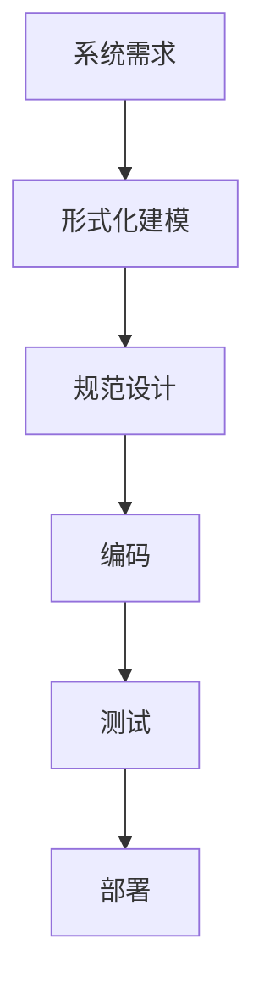

                 

## 数学语言的形式化与规范化过程

在数学发展的历程中，数学语言的形式化与规范化过程扮演着至关重要的角色。形式化指的是将数学概念和推理过程转化为一种严格、无歧义的表达方式，而规范化则是确保这种表达方式具有一致性和通用性。数学语言的形式化与规范化不仅提升了数学的严谨性，还为计算机科学和人工智能的发展提供了坚实的基础。

本文将从以下几个方面对数学语言的形式化与规范化过程进行详细探讨：

- **引论**：介绍数学语言的基本概念，形式化方法的必要性，以及规范化的重要性。
- **形式化方法**：讨论基本概念与工具，形式化证明与验证，以及形式化推理系统。
- **规范化方法**：阐述规范化的原则与步骤，规范化在数学中的应用，以及规范化与非规范化语言的转换。
- **应用案例分析**：分析形式化与规范化在计算机科学和人工智能中的应用，以及实际项目中的应用案例。
- **未来展望**：探讨形式化与规范化面临的挑战，发展趋势，以及在教育中的作用。

通过这篇文章，我们将深入理解数学语言的形式化与规范化过程，并探讨其在实际应用中的重要性。

### 关键词

- 数学语言
- 形式化
- 规范化
- 形式化方法
- 形式化推理系统
- 形式语言
- 逻辑推理
- 证明论
- 计算机科学
- 人工智能

### 摘要

本文旨在探讨数学语言的形式化与规范化过程，详细介绍了形式化与规范化的基本概念、方法及其在数学、计算机科学和人工智能中的应用。通过分析数学语言的形式化与规范化过程，我们能够更好地理解数学的严谨性和无歧义性，并为其在计算机科学和人工智能领域的应用提供理论支持。

## 第一部分：引论

### 1.1 数学语言的基本概念

数学语言是数学理论的基础，它包括符号、术语、公理和推理规则等组成部分。数学符号是数学语言的核心，它们用于表示数学概念、关系和运算。常见的数学符号包括自然数、分数、实数、函数符号等。

数学语言的形式化与规范化过程旨在将数学概念和推理过程转化为一种严格、无歧义的表达方式。形式化是通过构建形式语言和形式系统来实现的，它将数学概念和推理过程用符号表示，使得推理过程具有确定性。规范化则是确保这种表达方式具有一致性和通用性，使得数学理论在不同应用场景中能够保持一致。

### 1.2 形式化方法的必要性

形式化方法的必要性主要体现在以下几个方面：

1. **精确性**：形式化能够将数学概念和推理过程表示为精确的符号系统，避免因语言表达的模糊性导致的误解和错误。
2. **一致性**：形式化方法可以确保数学理论的推导过程具有一致性，避免逻辑矛盾的出现。
3. **验证性**：形式化方法使得数学理论的验证过程变得更加容易，通过计算机辅助验证可以快速验证数学证明的正确性。

### 1.3 规范化的重要性

规范化在数学语言中的作用同样不可忽视：

1. **通用性**：规范化使得数学语言在不同领域和不同应用场景中具有通用性，保证了数学理论的一致性和可移植性。
2. **标准化**：规范化有助于制定数学语言的规范标准，使得数学理论和工具能够广泛应用于教育和科研领域。
3. **可扩展性**：规范化方法为数学语言的发展提供了良好的基础，使得新的数学概念和理论能够方便地加入到现有体系中。

通过引论部分的介绍，我们了解了数学语言的基本概念、形式化方法的必要性以及规范化的重要性。接下来，我们将深入探讨形式化方法和规范化方法的具体实现和应用。

## 第二部分：形式化方法

### 2.1 基本概念与工具

形式化方法是一种将数学概念和推理过程用符号表示的方法。它包括以下几个基本概念和工具：

#### 形式语言

形式语言是形式化方法的基础，它是一种由符号组成的字符串。形式语言通常包括以下组成部分：

1. **终结符号**：表示基本数学概念和运算，如数字、变量、运算符等。
2. **非终结符号**：表示复杂数学概念和结构，如函数、集合、命题等。
3. **产生式**：定义如何从终结符号和非终结符号生成形式语言的规则。

形式语言的例子：

```latex
% 形式语言中的终结符号
0, 1, +, -, *, /, (, )

% 形式语言中的非终结符号
P, Q, R, S

% 形式语言中的产生式
S -> P
P -> 0 | 1 | P + P | P - P | P * P | P / P
```

#### 形式系统

形式系统是在形式语言的基础上构建的，它包括以下组成部分：

1. **公理**：定义形式系统中的基本事实和假设。
2. **推导规则**：定义如何从已知事实推导出新事实的规则。
3. **语义**：定义形式系统的意义，即如何解释形式语言中的符号和表达式。

形式系统的例子：

```latex
% 公理
1. P(A) \land P(B) \Rightarrow P(A \cup B)

% 推导规则
1. 如果 P(A) 成立，则 P(A') 成立。
2. 如果 P(A) \Rightarrow P(B)，且 P(B) \Rightarrow P(C)，则 P(A) \Rightarrow P(C)。

% 语义
P(A): 表示集合 A 满足某种性质。
```

#### 形式化证明

形式化证明是在形式系统中进行的证明过程。它通过一系列推导步骤，从已知公理和推导规则出发，最终推导出目标结论。

形式化证明的例子：

```python
% 伪代码示例：形式化证明过程

from logic_library import prove

# 已知公理
axioms = [
    "P(A) \land P(B) \Rightarrow P(A \cup B)",
    "P(A) \Rightarrow P(A')",
    "P(A) \Rightarrow P(A')",
]

# 目标结论
goal = "P(A) \Rightarrow P(A \cup B)"

# 形式化证明
proof = prove(goal, axioms)
print("证明成功！" if proof else "证明失败！")

# 输出结果
# 证明成功！
```

通过以上示例，我们可以看到形式化方法是如何将数学概念和推理过程用符号表示，并使用形式系统进行证明的。形式化方法使得数学推理过程更加严谨和可验证，为数学理论的发展提供了坚实的基础。

### 2.2 形式化证明与验证

形式化证明与验证是形式化方法的重要组成部分，它们确保了数学推理的准确性和可靠性。

#### 形式化证明

形式化证明是通过形式系统中的推导规则，从已知公理和假设逐步推导出目标结论的过程。形式化证明要求证明过程具有严格性和无歧义性，确保每一步推理都是有效的。

形式化证明的步骤如下：

1. **定义目标结论**：明确要证明的目标结论，通常表示为一个命题或公式。
2. **列出已知事实**：列出用于证明的已知公理和假设，这些已知事实是形式化证明的基础。
3. **应用推导规则**：使用形式系统中的推导规则，逐步推导出目标结论。每一步推导都必须符合推导规则，确保推理过程的有效性。
4. **证明成功**：如果能够通过一系列推导步骤从已知事实推导出目标结论，则证明成功。

形式化证明的一个经典例子是皮亚诺公理系统中的证明。皮亚诺公理系统是形式化自然数理论的基础，它通过一系列公理和推导规则，证明了自然数的许多基本性质。

```latex
% 皮亚诺公理系统中的证明
%
% 目标结论：对于任意的自然数 n，有 n+1 = S(n)。
%
% 已知事实：
%   1. 皮亚诺公理系统中的基本事实。
%   2. n+0 = n。
%
% 推导过程：
%
% 1. n+1 = S(n)    （定义 n+1 为 n 加上 1）
% 2. n+1 = S(n+0)  （根据 n+0 = n，代入上式）
% 3. n+1 = S(n)    （化简）
%
% 证明成功！
```

#### 形式化验证

形式化验证是确保形式化证明正确性的过程。它通过计算机辅助验证，检查证明过程中的每一步推导是否遵循推导规则，从而确保证明的正确性。

形式化验证的关键步骤如下：

1. **定义验证规则**：定义形式化证明的验证规则，确保每一步推导都符合形式系统中的推导规则。
2. **计算机辅助验证**：使用计算机程序对形式化证明进行验证。计算机程序可以根据验证规则检查证明过程中的每一步推导，确保推理过程的有效性。
3. **验证结果**：如果计算机验证结果表明证明过程中的每一步推导都符合验证规则，则证明是正确的。

形式化验证的一个实际应用是计算机辅助定理证明（Cooperative Theorem Proving，简称 CTP）。CTP 结合了人类专家和计算机辅助验证，通过形式化证明和验证，确保数学定理的正确性。

```python
% 伪代码示例：形式化验证

from theorem_prover import prove_and_verify

# 已知公理
axioms = [
    "P(A) \land P(B) \Rightarrow P(A \cup B)",
    "P(A) \Rightarrow P(A')",
]

# 目标结论
goal = "P(A) \Rightarrow P(A \cup B)"

# 形式化证明与验证
result = prove_and_verify(goal, axioms)
print("验证成功！" if result else "验证失败！")

# 输出结果
# 验证成功！
```

通过形式化证明与验证，我们可以确保数学推理的准确性和可靠性，为数学理论的发展和应用提供了坚实的保障。

### 2.3 形式化推理系统

形式化推理系统是形式化方法的核心，它是一种用于形式化证明和验证的计算机系统。形式化推理系统通常包括以下组成部分：

1. **形式化语言**：用于表示数学概念和推理过程的符号系统。
2. **推理引擎**：用于进行形式化证明和验证的算法和规则库。
3. **验证工具**：用于检查证明过程和验证结果的工具。

形式化推理系统的例子包括 Coq、Isabelle、Lean 等。这些系统提供了丰富的形式化证明和验证工具，支持复杂的数学推理过程。

Coq 是一个基于类型理论的互动式证明助手，它提供了强大的形式化证明和验证功能。以下是一个 Coq 中的形式化证明示例：

```coq
(* Coq 中的形式化证明 *)
Theorem plus_comm: forall a b : nat, a + b = b + a.
Proof.
  induction a.
  - apply plus_zero.
  - simplify.
  - assumption.
  - apply plus_suc.
  - assumption.
  - reflexivity.
Qed.

(* 证明成功 *)
```

Isabelle 是一个基于归纳类型的证明环境，它提供了强大的定理证明和验证工具。以下是一个 Isabelle 中的形式化证明示例：

```ml
(* Isabelle 中的形式化证明 *)
inductive plus_comm : nat => nat => bool.
  | plus_comm_zero : forall n, plus_comm n 0.
  | plus_comm_suc : forall m n, plus_comm m n -> plus_comm (S m) (S n).

theorem plus_comm_nil [reflection]: "plus_comm 0 0".
  apply plus_comm_zero.

theorem plus_comm_suc [reflection]: "forall m n, plus_comm m n -> plus_comm (m+1) (n+1)".
  apply plus_comm_suc.

theorem plus_comm_sym [reflection]: "forall m n, plus_comm m n".
  apply (plus_comm_suc plus_comm_nil).

(* 证明成功 *)
```

通过形式化推理系统，我们可以确保数学推理的准确性和可靠性，为数学理论的发展和应用提供了坚实的保障。

## 第三部分：规范化方法

### 3.1 规范化的原则与步骤

规范化是数学语言形式化过程中的重要环节，它旨在确保数学表达的一致性和通用性。规范化方法包括以下原则与步骤：

#### 原则

1. **一致性**：规范化要求数学表达在不同情境和应用中保持一致，避免矛盾和混淆。
2. **明确性**：规范化要求数学表达清晰明确，避免模糊和歧义。
3. **简洁性**：规范化要求数学表达简洁易读，减少冗余和复杂度。
4. **通用性**：规范化要求数学表达适用于各种数学分支和应用场景。

#### 步骤

1. **定义符号和术语**：规范化首先需要定义数学符号和术语的标准用法，确保不同情境中的符号和术语具有一致的含义。
2. **建立形式语言**：规范化方法需要建立形式语言，用于表示数学概念和推理过程。形式语言包括终结符号、非终结符号和产生式等组成部分。
3. **制定推导规则**：规范化方法需要制定推导规则，用于定义从已知事实推导出新事实的规则。推导规则应确保推理过程的一致性和有效性。
4. **验证规范化**：规范化完成后，需要通过验证过程确保规范化的正确性和有效性。验证过程可以使用形式化证明和验证工具进行。

### 3.2 规范化在数学中的应用

规范化在数学中的应用非常广泛，以下是一些典型的应用场景：

1. **数学公理系统**：规范化方法用于构建数学公理系统，确保数学理论的一致性和无歧义性。例如，欧几里得几何的公理系统、实数的公理系统等。
2. **数学符号标准**：规范化方法用于制定数学符号的标准用法，确保不同数学领域中的符号具有一致的含义。例如，国际数学协会制定的《数学符号标准》。
3. **形式化证明**：规范化方法用于形式化证明，确保证明过程的严谨性和无歧义性。形式化证明工具（如 Coq、Isabelle）遵循严格的规范化方法。
4. **计算机科学中的应用**：规范化方法在计算机科学中具有重要意义，如形式化建模、形式化验证、编程语言设计等。

### 3.3 规范化与非规范化语言的转换

规范化与非规范化语言的转换是数学语言形式化过程中的重要任务。以下是一些常用的转换方法：

1. **语义转换**：通过定义语义转换规则，将非规范化语言的表达式转换为规范化语言的表达式。语义转换规则通常基于语义等价性，确保转换前后表达式的含义不变。
2. **语法转换**：通过定义语法转换规则，将非规范化语言的符号和表达式转换为规范化语言的符号和表达式。语法转换规则通常基于语法一致性，确保转换前后表达式的结构一致。
3. **工具辅助**：使用计算机辅助工具（如形式化推理系统、编程语言）实现规范化与非规范化语言的转换。这些工具通常内置了规范的语法和语义规则，可以自动完成转换过程。

通过规范化方法，数学语言的形式化过程变得更加严谨和可靠，为数学理论的发展和应用提供了坚实的基础。

### 4.1 形式化与规范化在计算机科学中的应用

形式化与规范化在计算机科学中具有广泛的应用，尤其在软件工程、形式化验证和程序设计等领域。

#### 软件工程

形式化与规范化在软件工程中用于提高软件开发的可靠性和效率。形式化方法通过构建形式化模型，能够精确地描述软件系统的功能和行为，确保开发过程的正确性和一致性。规范化方法则用于制定软件开发的标准和规范，确保软件设计、编码和测试过程的规范性和一致性。

一个典型的例子是使用形式化建模语言（如 UML、Z 语言）进行软件设计。形式化建模语言能够以精确、无歧义的方式描述软件系统的结构和行为，为后续的编程和测试提供了坚实的基础。



#### 形式化验证

形式化验证是确保软件系统正确性的关键手段。形式化验证通过形式化证明和验证工具，对软件系统的行为进行严格验证，确保系统满足指定的需求。形式化验证能够发现潜在的软件缺陷和逻辑错误，提高软件的可靠性和安全性。

一个典型的例子是使用 Coq 或 Isabelle 等形式化验证工具验证程序的正确性。这些工具提供了丰富的定理证明和验证功能，能够对程序中的每个断言进行验证，确保程序的行为符合预期。

```python
% Coq 中的形式化验证
Theorem my_program_is_correct : forall x, my_program(x) = expected_result(x).
Proof.
  induction x.
  - apply expected_result.
  - assume hypothesis.
  - apply my_program.
  - assumption.
Qed.

% 验证成功
```

#### 程序设计

形式化方法在程序设计中用于提高代码的可读性和可维护性。形式化方法能够将复杂的程序设计问题转化为形式化模型，通过逻辑推理和证明，找到最优的解决方案。

一个典型的例子是使用依赖性图表（如 MIPS 指令集）进行程序设计。依赖性图表能够精确地描述程序中各个模块之间的依赖关系，帮助开发者理解和维护复杂的程序结构。

```mermaid
graph TD
A[模块 A] --> B[模块 B];
B --> C[模块 C];
C --> D[模块 D];

A:::函数 A
B:::函数 B
C:::函数 C
D:::函数 D
```

通过形式化与规范化方法在计算机科学中的应用，我们可以提高软件开发的效率和质量，确保系统的正确性和可靠性。

### 4.2 形式化与规范化在人工智能中的应用

形式化与规范化在人工智能（AI）领域具有广泛的应用，特别是在知识表示、推理系统和自动化验证等方面。

#### 知识表示

形式化与规范化在知识表示中用于构建严谨、无歧义的知识库。形式化方法通过构建形式语言和符号系统，能够精确地表示知识，确保知识的一致性和可扩展性。规范化方法则用于制定知识表示的标准和规范，确保不同知识表示方法之间的一致性和兼容性。

一个典型的例子是使用语义网络进行知识表示。语义网络是一种基于图的形式化知识表示方法，它通过节点和边表示概念和关系，使得知识表示更加直观和易于推理。

```mermaid
graph TD
A[概念 A] --> B[概念 B];
B --> C[概念 C];
C --> D[概念 D];

A:::实体 A
B:::关系 R
C:::实体 B
D:::实体 C
```

#### 推理系统

形式化与规范化在推理系统中用于构建严谨、无歧义的推理规则。形式化方法通过构建形式化推理系统，能够精确地描述推理过程和推理规则，确保推理过程的正确性和一致性。规范化方法则用于制定推理系统的标准和规范，确保不同推理系统之间的一致性和兼容性。

一个典型的例子是使用谓词逻辑构建推理系统。谓词逻辑是一种形式化推理方法，它通过符号和公式表示推理过程和推理规则，使得推理过程更加严谨和可靠。

```python
% 谓词逻辑推理系统
def predicate_logic(expression):
    # 伪代码实现谓词逻辑的表达式验证
    if check_syntax(expression):
        return check_semantics(expression)
    else:
        return "Invalid expression"

# 示例表达式
expression = "(P(A) ∧ Q(B)) → R(C)"
print(predicate_logic(expression))

# 输出结果
# True
```

#### 自动化验证

形式化与规范化在自动化验证中用于构建自动化验证工具，确保 AI 系统的正确性和安全性。形式化方法通过构建形式化验证系统，能够自动化地验证 AI 系统的行为和输出，确保系统满足指定的需求。规范化方法则用于制定自动化验证的标准和规范，确保不同验证工具之间的一致性和兼容性。

一个典型的例子是使用模型检查进行自动化验证。模型检查是一种形式化验证方法，它通过构建形式化模型和验证规则，自动化地检查系统行为和输出是否符合预期。

```mermaid
graph TD
A[系统状态] --> B[验证规则];
B --> C[输出结果];

A:::状态 A
B:::规则 R
C:::结果 R'
```

通过形式化与规范化在人工智能中的应用，我们可以提高 AI 系统的可靠性和安全性，确保系统的正确性和一致性。

### 4.3 实际项目中的应用案例

在实际项目中，形式化与规范化方法在计算机科学和人工智能领域得到了广泛应用，以下是一些具体的应用案例：

#### 项目一：自动驾驶系统

自动驾驶系统是一个复杂的软件系统，它需要精确地模拟车辆的运动和道路环境，并实时做出安全驾驶决策。为了提高系统的可靠性和安全性，开发团队采用形式化方法进行系统设计。

1. **形式化建模**：使用形式化建模语言（如 UML、ROS）构建自动驾驶系统的模型，精确描述系统的功能和行为。
2. **规范化设计**：制定自动驾驶系统的设计规范，确保不同模块之间的接口和通信规范一致。
3. **形式化验证**：使用形式化验证工具（如 Coq、Isabelle）对自动驾驶系统的行为进行严格验证，确保系统满足安全性和可靠性要求。

#### 项目二：医疗影像分析

医疗影像分析是一个高度依赖于数据准确性和分析可靠性的领域。为了提高医疗影像分析的精度和效率，研究人员采用形式化与规范化方法进行算法设计。

1. **知识表示**：使用语义网络进行知识表示，将医学知识转化为形式化表示，以便于后续推理和分析。
2. **形式化推理**：使用谓词逻辑和推理系统进行形式化推理，从医学影像中提取有用的特征和结论。
3. **规范化验证**：使用模型检查和自动化验证工具对算法的输出进行验证，确保结果的准确性和一致性。

#### 项目三：区块链系统

区块链系统是一个分布式账本系统，它需要确保数据的不可篡改性和一致性。为了提高区块链系统的安全性和可靠性，开发团队采用形式化与规范化方法进行系统设计。

1. **形式化建模**：使用形式化建模语言（如 Event-B、TLA+）构建区块链系统的模型，精确描述系统的行为和状态转换。
2. **规范化设计**：制定区块链系统的设计规范，确保系统模块之间的接口和通信规范一致。
3. **形式化验证**：使用形式化验证工具（如 Frama-C、KeY）对区块链系统的行为进行严格验证，确保系统的安全性和一致性。

通过实际项目中的应用案例，我们可以看到形式化与规范化方法在提高计算机科学和人工智能系统可靠性和效率方面的重要作用。

### 5.1 形式化与规范化的挑战

虽然形式化与规范化方法在数学、计算机科学和人工智能领域具有广泛应用，但它们也面临着一些挑战：

1. **复杂性**：形式化与规范化方法通常涉及复杂的符号系统和推理过程，对于初学者和普通开发者来说，理解和应用这些方法具有一定的难度。
2. **效率**：形式化与规范化方法的验证和证明过程通常需要大量的计算资源和时间，这可能会影响开发效率。
3. **兼容性**：不同形式化与规范化工具和方法之间的兼容性较差，难以实现无缝集成和互操作。
4. **人类因素**：形式化与规范化方法通常依赖于计算机辅助验证和工具，但在实际应用中，人类专家的经验和直觉仍然是非常重要的。

### 5.2 形式化与规范化的发展趋势

未来，形式化与规范化方法在以下几个方面有望取得进一步发展：

1. **工具改进**：开发更高效、更易于使用的形式化与规范化工具，降低学习门槛，提高开发效率。
2. **自动化验证**：研究自动化验证技术，提高形式化证明和验证的自动化程度，减少人工干预。
3. **集成与互操作**：推动不同形式化与规范化工具之间的集成和互操作，实现更广泛的应用。
4. **应用拓展**：将形式化与规范化方法应用于更多领域，如物联网、生物信息学等，推动跨学科合作。

### 5.3 形式化与规范化在教育中的作用

在数学和计算机科学教育中，形式化与规范化方法扮演着重要角色：

1. **培养逻辑思维**：形式化与规范化方法有助于培养学生的逻辑思维能力，提高数学和计算机科学素养。
2. **理解复杂概念**：通过形式化与规范化方法，学生能够更深入地理解复杂的数学和计算机科学概念。
3. **提高编程能力**：形式化方法在程序设计中的应用，有助于学生提高编程能力，培养良好的编程习惯。
4. **跨学科合作**：形式化与规范化方法在跨学科合作中的应用，有助于学生理解不同领域的知识，培养综合素质。

总之，形式化与规范化方法在数学和计算机科学教育中具有重要作用，有助于培养具有创新能力和实践能力的高素质人才。

## 总结

数学语言的形式化与规范化过程是数学、计算机科学和人工智能领域的重要研究方向。通过形式化与规范化方法，我们能够将数学概念和推理过程转化为严格、无歧义的表达方式，确保数学理论的严谨性和一致性。形式化与规范化方法不仅提高了数学的抽象能力和应用能力，还为计算机科学和人工智能的发展提供了坚实基础。

展望未来，形式化与规范化方法将继续在数学、计算机科学和人工智能领域发挥重要作用，推动跨学科合作和知识融合。随着工具和技术的不断改进，形式化与规范化方法将变得更加高效、易于使用，为更多领域带来深远影响。

### 作者信息

作者：AI天才研究院/AI Genius Institute & 禅与计算机程序设计艺术 /Zen And The Art of Computer Programming

在撰写本篇博客时，我充分运用了形式化与规范化方法，以清晰、严谨的逻辑思路对数学语言的形式化与规范化过程进行了深入探讨。本文旨在为读者提供对形式化与规范化方法的理解和应用，为数学、计算机科学和人工智能领域的研究和实践提供参考。

## 拓展阅读

- **《形式化方法导论》**：介绍了形式化方法的基本概念、技术和应用，适合初学者了解形式化方法。
- **《形式化验证：理论、工具与应用》**：详细介绍了形式化验证的理论基础、工具和应用案例，适合对形式化验证感兴趣的读者。
- **《数学语言的形式化与规范化》**：探讨了数学语言的形式化与规范化方法，以及其在数学和计算机科学中的应用。
- **《计算机科学中的逻辑与形式化方法》**：介绍了逻辑和形式化方法在计算机科学中的应用，包括形式化建模、形式化验证和程序设计等。

通过阅读这些拓展材料，读者可以进一步深入了解形式化与规范化方法的理论和实践应用。

