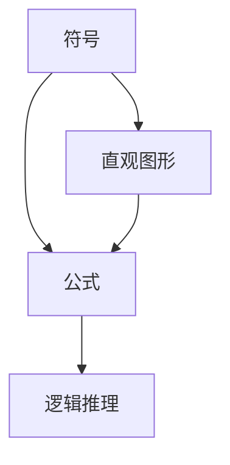
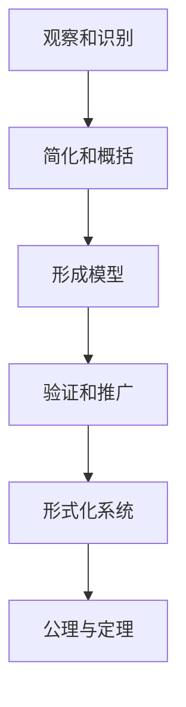
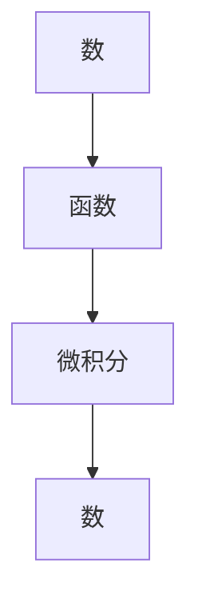
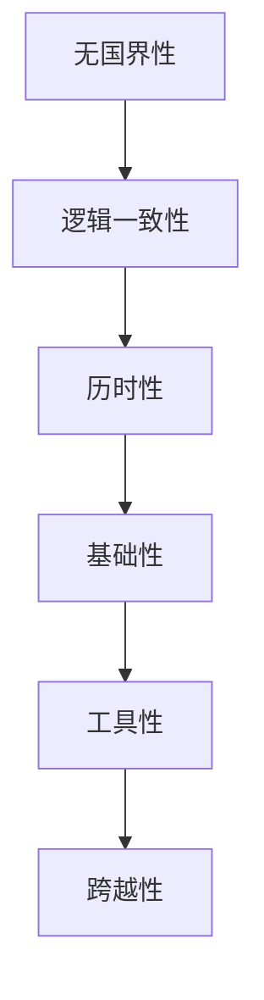
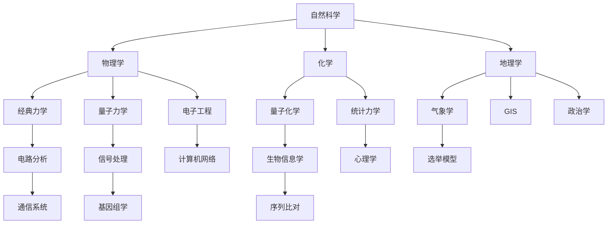
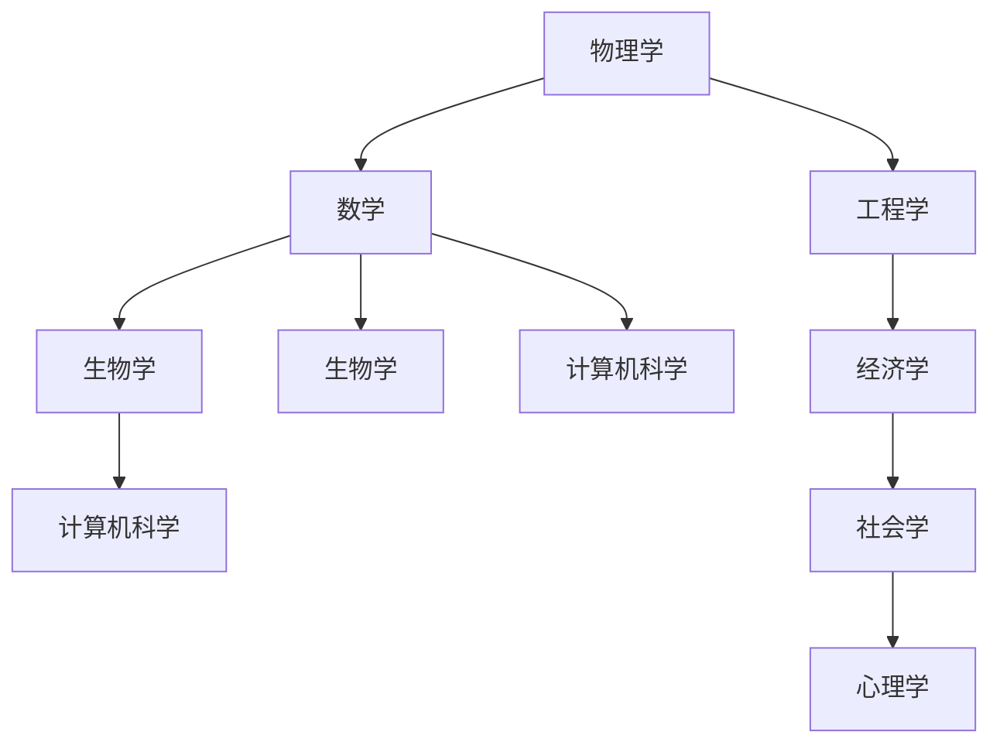
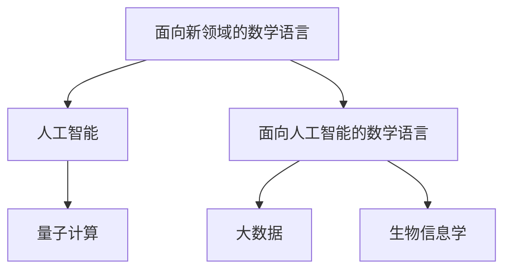

                 

### 第一部分：数学语言的抽象性

#### 第1章：数学语言概述

**1.1 数学语言的概念**

数学语言是一种特殊的语言系统，用于表达数学思想、概念和理论。与自然语言（如英语、汉语等）不同，数学语言更加抽象和精确。数学语言包括符号、公式和逻辑推理等基本元素，这些元素通过特定的规则组合起来，形成复杂而精确的表达。

**1.2 数学语言的特性**

- **精确性**：数学语言通过符号和公式明确地表达数学概念，避免了自然语言中的模糊性和歧义。
- **明确性**：数学语言的定义和规则是明确和一致的，这使得数学推理过程更加可靠。
- **形式化**：数学语言通过形式化的方法，将数学概念和理论转化为符号和公式，从而使得数学研究更加系统和严谨。

**1.3 数学语言的历史发展**

数学语言的发展历程可以追溯到古代。早期的数学主要是以自然语言和直观图形为表达手段。随着数学理论的不断发展，数学语言也经历了从简单到复杂、从具体到抽象的演变。现代数学语言的形成，得益于形式逻辑和集合论的发展。

**核心概念与联系**

为了更好地理解数学语言的概念，我们可以通过以下Mermaid流程图来展示数学语言的基本元素及其相互关系：



在这个流程图中，符号、公式和逻辑推理是数学语言的核心元素。符号用于表达基本数学概念，公式则是通过符号组合得到的数学表达式，而逻辑推理则是在这些公式基础上进行的推理和证明。

**核心算法原理讲解**

为了进一步理解数学语言的精确性和明确性，我们可以通过Python代码来演示一个简单的数学运算。以下是一个计算两个数之和的Python程序：

```python
# 计算两个数之和
def add_numbers(a, b):
    return a + b

# 测试代码
result = add_numbers(5, 3)
print(f"The sum of 5 and 3 is {result}.")
```

在这个例子中，我们定义了一个名为`add_numbers`的函数，用于计算两个数之和。通过调用这个函数，我们可以得到精确的结果，这展示了数学语言的精确性和明确性。

通过上述的Python代码，我们可以看到数学语言是如何在编程语言中得到应用的。在编程中，符号、公式和逻辑推理也同样重要，它们帮助我们实现复杂的算法和解决实际问题。

**举例说明**

假设我们要计算一个等差数列的前n项和。使用数学语言，我们可以通过以下公式来表示：

$$ S_n = \frac{n}{2} \times (a_1 + a_n) $$

其中，$S_n$表示前n项和，$a_1$表示首项，$a_n$表示末项。

为了便于理解和应用，我们可以通过Python代码来实现这个计算过程：

```python
# 计算等差数列前n项和
def arithmetic_series_sum(n, a1, an):
    return n * (a1 + an) / 2

# 测试代码
n = 10
a1 = 1
an = 10
sum = arithmetic_series_sum(n, a1, an)
print(f"The sum of the first {n} terms of the arithmetic series is {sum}.")
```

在这个例子中，我们定义了一个名为`arithmetic_series_sum`的函数，用于计算等差数列的前n项和。通过调用这个函数，我们可以得到精确的结果。

通过这个例子，我们可以看到数学语言是如何在编程中发挥作用的。数学公式不仅帮助我们理解和表达数学概念，还使得编程过程更加精确和高效。

**小结**

数学语言是一种特殊的语言系统，具有精确性、明确性和形式化等特性。它通过符号、公式和逻辑推理等基本元素，表达数学思想、概念和理论。在理解和应用数学语言的过程中，我们可以通过Python代码等工具来展示其精确性和高效性。通过逐步分析数学语言的概念、特性和应用实例，我们可以更好地掌握数学语言的抽象性，并将其应用于实际编程中。

### 第2章：抽象性的定义与形式

**2.1 抽象性的概念**

抽象性是数学语言的一个重要特性，它是指从具体的事物或情境中提取出普遍性、共性的过程。在数学中，抽象性使得我们可以将复杂的问题简化为基本的形式和结构，从而更方便地进行研究和分析。

**2.1.1 抽象性的基本原理**

- **选择性提取**：抽象性首先涉及从具体情境中提取出最重要的、最具代表性的特征。例如，在研究几何形状时，我们可以忽略物体的颜色、大小等非本质属性，而只关注其形状。
- **简化**：通过抽象性，我们可以将复杂的问题简化为更简单的模型。这种简化有助于我们更好地理解问题的本质，同时减少计算和分析的复杂性。
- **一般性**：抽象性不仅关注个别实例，还关注普遍性。通过抽象，我们可以将特定的问题推广到更广泛的应用领域。

**2.1.2 抽象化的过程**

抽象化的过程通常包括以下几个步骤：

1. **观察和识别**：首先，我们需要观察具体的事物或情境，识别出其中最重要的特征。
2. **简化和概括**：接下来，我们将这些特征进行简化和概括，提取出其共性和本质。
3. **形成模型**：通过简化和概括，我们可以形成一种抽象模型，该模型能够代表原始情境的共性和规律。
4. **验证和推广**：最后，我们需要验证这个抽象模型的有效性和适用范围，并根据实际情况进行适当的调整和推广。

**2.2 抽象性的形式**

抽象性的形式化是数学语言的重要组成部分。形式化系统通过定义明确的符号和规则，使得抽象过程更加严格和系统。

**2.2.1 形式化系统**

形式化系统是一种通过符号和规则来表达数学概念和推理的系统。它通常包括以下几个基本元素：

- **符号**：符号是形式化系统的基本元素，用于表示数学概念和命题。
- **公理**：公理是一组被接受的、无需证明的基本命题。它们为形式化系统提供了基础和出发点。
- **定理**：定理是通过推理和证明得出的结论。定理通常基于公理和已有的定理。
- **证明**：证明是通过一系列逻辑推理步骤，从公理和已有定理推导出新定理的过程。

**2.2.2 公理与定理**

在形式化系统中，公理和定理是两个核心概念。

- **公理**：公理是一组基本命题，它们被认为是正确的，并且不需要证明。公理为形式化系统提供了基础和出发点。
- **定理**：定理是通过推理和证明得出的结论。定理通常基于公理和已有的定理。定理的证明过程体现了数学推理的严谨性和逻辑性。

**2.3 抽象性在数学中的应用**

抽象性在数学中有着广泛的应用。通过抽象，我们可以将复杂的问题简化为基本的形式和结构，从而更方便地进行研究和分析。

**2.3.1 数学分析中的抽象**

在数学分析中，抽象性被广泛应用于极限、连续性、微积分等领域。通过抽象，我们可以将复杂的函数和空间简化为基本的形式，从而更方便地进行研究。

例如，在研究极限时，我们可以将复杂的函数极限简化为基本形式，例如：

$$ \lim_{{x \to 0}} \frac{\sin x}{x} = 1 $$

通过这个极限，我们可以研究函数的连续性和导数等性质。

**2.3.2 代数学中的抽象**

在代数学中，抽象性被广泛应用于群、环、域等概念的研究。通过抽象，我们可以将复杂的代数结构简化为基本的形式，从而更方便地进行研究。

例如，在研究群时，我们可以将复杂的群结构简化为基本形式，例如：

$$ G = \{e\} \cup \{a^k | k \in \mathbb{Z}\} $$

通过这个群的定义，我们可以研究群的性质和运算。

**2.3.3 几何学中的抽象**

在几何学中，抽象性被广泛应用于点、线、面等概念的研究。通过抽象，我们可以将复杂的几何形状简化为基本的形式，从而更方便地进行研究。

例如，在研究平面几何时，我们可以将复杂的几何形状简化为基本形式，例如：

$$ P: x^2 + y^2 = 1 $$

通过这个方程，我们可以研究圆的性质和对称性。

**核心概念与联系**

为了更好地理解抽象性的概念，我们可以通过以下Mermaid流程图来展示抽象性的基本原理和过程：



在这个流程图中，观察和识别、简化和概括、形成模型、验证和推广是抽象性的基本步骤。这些步骤相互关联，共同构成了抽象性的完整过程。

**核心算法原理讲解**

为了进一步理解抽象性的应用，我们可以通过Python代码来演示一个简单的抽象过程。以下是一个计算最大公约数的Python程序：

```python
# 计算最大公约数
def gcd(a, b):
    while b:
        a, b = b, a % b
    return a

# 测试代码
print(f"The greatest common divisor of 24 and 36 is {gcd(24, 36)}.")
```

在这个例子中，我们定义了一个名为`gcd`的函数，用于计算两个数的最小公倍数。通过这个函数，我们可以将复杂的最大公约数问题简化为基本形式，从而更方便地进行计算。

通过这个例子，我们可以看到抽象性在编程中的应用。通过抽象，我们可以将复杂的算法简化为基本的形式，从而更方便地进行编程和计算。

**举例说明**

假设我们要计算一组数的平均值。使用数学语言，我们可以通过以下公式来表示：

$$ \bar{x} = \frac{1}{n} \sum_{i=1}^{n} x_i $$

其中，$\bar{x}$表示平均值，$x_i$表示第i个数，$n$表示数的个数。

为了便于理解和应用，我们可以通过Python代码来实现这个计算过程：

```python
# 计算平均值
def average(numbers):
    return sum(numbers) / len(numbers)

# 测试代码
numbers = [1, 2, 3, 4, 5]
print(f"The average of the numbers is {average(numbers)}.")
```

在这个例子中，我们定义了一个名为`average`的函数，用于计算一组数的平均值。通过调用这个函数，我们可以得到精确的结果。

通过这个例子，我们可以看到抽象性在编程中的应用。数学公式不仅帮助我们理解和表达数学概念，还使得编程过程更加精确和高效。

**小结**

抽象性是数学语言的一个重要特性，它是指从具体的事物或情境中提取出普遍性、共性的过程。在数学中，抽象性通过形式化系统、公理和定理等手段得到实现。通过抽象，我们可以将复杂的问题简化为基本的形式和结构，从而更方便地进行研究和分析。在理解和应用数学语言的过程中，我们可以通过Python代码等工具来展示其精确性和高效性。通过逐步分析数学语言的抽象性概念、特性和应用实例，我们可以更好地掌握数学语言的抽象性，并将其应用于实际编程中。

### 第3章：数学语言的抽象性实例分析

**3.1 数的概念的抽象**

数是数学中最基本的概念之一。通过抽象，我们可以将具体的数（如1、2、3等）抽象为一般的数，从而更方便地进行数学运算和研究。

**3.1.1 自然数**

自然数是最基本的数，用于计数和排列。在数学中，自然数被抽象为从1开始的正整数集合。自然数的抽象不仅简化了计数过程，还使得我们可以进行更复杂的数学运算，如加法、减法、乘法和除法。

**3.1.2 有理数**

有理数是可以表示为两个整数之比的数。通过抽象，我们可以将有理数表示为一个分数，从而更方便地进行数学运算和研究。有理数的抽象使得我们可以解决更复杂的数学问题，如分数的运算、比例和比例关系等。

**3.1.3 无理数**

无理数是不能表示为两个整数之比的数。通过抽象，我们可以将无理数表示为无限不循环小数，从而更方便地进行数学运算和研究。无理数的抽象使得我们可以解决更复杂的数学问题，如π（圆周率）和e（自然对数的底数）等。

**3.2 函数的抽象**

函数是数学中另一个重要的概念，用于描述两个变量之间的关系。通过抽象，我们可以将具体的函数（如y = 2x + 1等）抽象为一般的函数，从而更方便地进行数学运算和研究。

**3.2.1 函数的定义**

函数可以定义为一个从集合A到集合B的映射，即对于集合A中的每个元素，都有集合B中的唯一元素与之对应。通过抽象，我们可以将具体的函数表示为一个映射，从而更方便地进行数学运算和研究。

**3.2.2 函数的属性**

函数的属性包括单调性、奇偶性、周期性等。通过抽象，我们可以研究函数的这些属性，从而更好地理解函数的性质。例如，单调函数在数学分析中有着广泛的应用，而周期函数在物理学和工程学中也有着重要的应用。

**3.2.3 函数的分类**

函数可以分类为线性函数、非线性函数、多项式函数、指数函数、对数函数等。通过抽象，我们可以研究不同类型的函数，从而更好地理解它们的性质和应用。例如，线性函数在计算机图形学中有着广泛的应用，而指数函数和对数函数在微积分中有着重要的应用。

**3.3 微积分的抽象**

微积分是数学中一个重要的分支，用于研究函数的极限、导数、积分等概念。通过抽象，我们可以将具体的微积分问题抽象为一般的微积分问题，从而更方便地进行数学运算和研究。

**3.3.1 导数的抽象**

导数可以抽象为函数在某一点的瞬时变化率。通过抽象，我们可以将具体的导数问题抽象为一般的导数问题，从而更方便地进行数学运算和研究。导数的抽象在物理学和工程学中有着广泛的应用，如速度、加速度等。

**3.3.2 积分的抽象**

积分可以抽象为函数的面积或体积。通过抽象，我们可以将具体的积分问题抽象为一般的积分问题，从而更方便地进行数学运算和研究。积分的抽象在物理学和工程学中有着广泛的应用，如求曲线下的面积、曲线的长度等。

**核心概念与联系**

为了更好地理解数学语言的抽象性，我们可以通过以下Mermaid流程图来展示数、函数和微积分的抽象过程及其相互关系：



在这个流程图中，数、函数和微积分是数学语言中的核心概念，它们通过抽象过程相互关联。数的抽象使得我们可以进行数学运算；函数的抽象使得我们可以研究变量之间的关系；微积分的抽象使得我们可以研究函数的变化率和面积。

**核心算法原理讲解**

为了进一步理解数学语言的抽象性，我们可以通过Python代码来演示数的抽象、函数的抽象和微积分的抽象。以下是一个简单的例子：

```python
# 计算两个数的和
def add_numbers(a, b):
    return a + b

# 计算函数的导数
def derivative(func, x):
    return (func(x + 1) - func(x)) / 1

# 计算函数的积分
def integral(func, a, b):
    return (func(b) - func(a)) * (b - a)

# 测试代码
sum_result = add_numbers(2, 3)
print(f"The sum of 2 and 3 is {sum_result}.")

x = 2
func = lambda x: x * x
derivative_result = derivative(func, x)
print(f"The derivative of f(x) = x^2 at x = {x} is {derivative_result}.")

a = 1
b = 3
integral_result = integral(func, a, b)
print(f"The integral of f(x) = x^2 from {a} to {b} is {integral_result}.")
```

在这个例子中，我们定义了三个函数：`add_numbers`用于计算两个数的和；`derivative`用于计算函数的导数；`integral`用于计算函数的积分。通过调用这些函数，我们可以实现数的抽象、函数的抽象和微积分的抽象。

**举例说明**

为了更好地理解数学语言的抽象性，我们可以通过一个具体的例子来展示。假设我们要计算一个二次函数的导数和积分。使用数学语言，我们可以通过以下公式来表示：

$$ f(x) = x^2 $$
$$ f'(x) = 2x $$
$$ \int f(x) dx = \frac{1}{3}x^3 + C $$

其中，$f(x)$表示二次函数，$f'(x)$表示二次函数的导数，$\int f(x) dx$表示二次函数的积分。

为了便于理解和应用，我们可以通过Python代码来实现这个计算过程：

```python
# 计算二次函数的导数和积分
def quadratic_function_derivative(x):
    return 2 * x

def quadratic_function_integral(a, b):
    return (1/3) * (b**3 - a**3)

# 测试代码
x = 2
derivative_result = quadratic_function_derivative(x)
print(f"The derivative of f(x) = x^2 at x = {x} is {derivative_result}.")

a = 1
b = 3
integral_result = quadratic_function_integral(a, b)
print(f"The integral of f(x) = x^2 from {a} to {b} is {integral_result}.")
```

在这个例子中，我们定义了两个函数：`quadratic_function_derivative`用于计算二次函数的导数；`quadratic_function_integral`用于计算二次函数的积分。通过调用这些函数，我们可以得到精确的结果。

通过这个例子，我们可以看到数学语言的抽象性在编程中的应用。数学公式不仅帮助我们理解和表达数学概念，还使得编程过程更加精确和高效。

**小结**

通过本章的实例分析，我们可以看到数学语言的抽象性在数、函数和微积分等概念中的应用。通过抽象，我们可以将复杂的数学问题简化为基本的形式和结构，从而更方便地进行研究和分析。在理解和应用数学语言的过程中，我们可以通过Python代码等工具来展示其精确性和高效性。通过逐步分析数学语言的抽象性实例，我们可以更好地掌握数学语言的抽象性，并将其应用于实际编程中。

### 第4章：数学语言的普适性原理

**4.1 普适性的概念**

普适性是指一个概念、理论或方法在不同的领域和情境中都能适用和有效。在数学语言中，普适性意味着数学概念和语言体系不仅在纯数学领域中有用，还可以广泛应用于自然科学、社会科学和技术科学等领域。

**4.1.1 普适性的基本原理**

- **无国界性**：数学语言不受地理、文化和语言障碍的限制，其表达方式在全球范围内具有一致性和通用性。
- **逻辑一致性**：数学语言基于严格的逻辑推理，使得数学理论在不同领域中的应用具有一致性和可靠性。
- **历时性**：数学语言的普适性不仅仅体现在当前的应用中，还能够在历史发展过程中保持其适用性和有效性。

**4.1.2 普适性的重要性**

数学语言的普适性对于科学和技术的进步具有重要意义：

- **基础性**：数学作为科学的基础，其普适性为其他学科提供了坚实的理论基础。
- **工具性**：数学语言作为一种强大的工具，帮助科学家和工程师解决复杂的实际问题。
- **跨越性**：数学语言的普适性使得不同学科之间的交流成为可能，促进了跨学科研究的发展。

**4.2 数学语言的普适性特征**

**4.2.1 无国界性**

数学语言的无国界性体现在以下几个方面：

- **符号通用**：数学符号如“+”表示加法、“=”表示等于等，在全球范围内具有统一的意义。
- **公式的普适性**：数学公式如欧拉公式\( e^{i\pi} + 1 = 0 \)在数学、物理学、工程学等多个领域都有广泛应用。
- **逻辑一致**：数学推理的严格性和一致性使得数学理论在全球范围内都具有可靠性。

**4.2.2 逻辑一致性**

逻辑一致性是数学语言普适性的核心特征之一。数学语言通过形式化的逻辑体系，确保了推理的严密性和一致性：

- **定义明确**：数学概念和术语的定义是明确和精确的，避免了歧义和误解。
- **定理证明**：数学定理的证明依赖于逻辑推理，使得结论具有普遍性和可靠性。
- **公理基础**：数学体系基于一组公理，这些公理为整个数学体系提供了可靠的基础。

**4.2.3 历时性**

数学语言的历时性表现在其随着时间的推移依然保持其适用性和有效性。例如：

- **历史积累**：数学理论的积累和进化使得新的数学成果能够在旧有基础上发展。
- **持续创新**：数学领域的持续创新，使得数学语言能够适应新的科学和技术需求。
- **普适传承**：数学知识在全球范围内的传承和应用，使得数学语言的普适性得以延续。

**核心概念与联系**

为了更好地理解数学语言的普适性，我们可以通过以下Mermaid流程图来展示数学语言的普适性特征及其相互关系：



在这个流程图中，无国界性、逻辑一致性和历时性是数学语言普适性的三个关键特征。这些特征相互关联，共同构成了数学语言的普适性体系。

**核心算法原理讲解**

为了进一步理解数学语言的普适性，我们可以通过Python代码来演示其在不同领域的应用。以下是一个简单的例子：

```python
# 计算两个数的和（数学语言在编程中的应用）
def add_numbers(a, b):
    return a + b

# 计算圆的面积（数学语言在物理学中的应用）
def circle_area(radius):
    return 3.14159 * radius * radius

# 计算人口增长率（数学语言在经济学中的应用）
def population_growth_rate(current_population, initial_population, years):
    return (current_population / initial_population) ** (1 / years) - 1

# 测试代码
print(f"The sum of 2 and 3 is {add_numbers(2, 3)}.")

radius = 5
print(f"The area of a circle with radius {radius} is {circle_area(radius)}.")

current_population = 1000000
initial_population = 500000
years = 10
print(f"The population growth rate is {population_growth_rate(current_population, initial_population, years)}%.")
```

在这个例子中，我们定义了三个函数：`add_numbers`用于计算两个数的和；`circle_area`用于计算圆的面积；`population_growth_rate`用于计算人口增长率。通过调用这些函数，我们可以看到数学语言在编程、物理学和经济学等不同领域的应用。

**举例说明**

为了更好地理解数学语言的普适性，我们可以通过一个具体的例子来展示。假设我们要研究一个城市的人口增长问题。使用数学语言，我们可以通过以下公式来表示：

$$ P(t) = P_0 \times r^t $$

其中，$P(t)$表示时间$t$后的人口数量，$P_0$表示初始人口数量，$r$表示人口增长率。

为了便于理解和应用，我们可以通过Python代码来实现这个计算过程：

```python
# 计算人口增长
def population_growth(P0, r, t):
    return P0 * (1 + r)** t

# 测试代码
P0 = 500000
r = 0.03
t = 20
print(f"The population in {t} years will be {population_growth(P0, r, t)}.")
```

在这个例子中，我们定义了一个名为`population_growth`的函数，用于计算人口增长。通过调用这个函数，我们可以得到精确的人口增长预测。

通过这个例子，我们可以看到数学语言的普适性在解决实际问题时的重要性。数学公式不仅帮助我们理解和表达问题，还使得计算和分析过程更加精确和高效。

**小结**

通过本章的分析，我们可以看到数学语言的普适性原理及其在各个领域的应用。数学语言的无国界性、逻辑一致性和历时性使得其在不同学科和领域中都能发挥重要作用。通过逐步分析数学语言的普适性特征，我们可以更好地理解其普适性的本质，并将其应用于实际编程和科学研究中。

### 第5章：数学语言在不同领域的应用

**5.1 自然科学中的应用**

数学语言在自然科学中扮演着至关重要的角色，它不仅为科学家提供了精确的描述工具，还帮助他们揭示了自然界的内在规律。

**5.1.1 物理学中的数学语言**

物理学是数学语言的一个重要应用领域。在经典力学中，牛顿定律（\( F = ma \)）和万有引力定律（\( F = G\frac{m_1m_2}{r^2} \)）都是使用数学语言表达的基本物理定律。这些公式不仅描述了物体运动和相互作用的基本规律，还为科学实验提供了理论基础。

量子力学则是另一个典型的例子，它使用波函数和薛定谔方程（\( i\hbar \frac{\partial \psi}{\partial t} = \hat{H}\psi \)）来描述粒子的行为。量子力学中的数学工具，如线性代数和复分析，使得科学家能够深入理解微观世界的复杂现象。

**5.1.2 化学中的数学语言**

在化学中，数学语言同样不可或缺。化学方程式（如 \( H_2 + O_2 \rightarrow H_2O \)）通过数学表达式描述了化学反应的过程。量子化学则利用数学模型，如哈特里-福克方程，来预测分子结构和反应活性。

统计力学通过概率论和统计学方法，描述了宏观物质的微观行为，如热力学第二定律和熵的概念。

**5.1.3 地理学中的数学语言**

地理学中，数学语言被广泛用于空间分析和数据建模。例如，地理信息系统（GIS）使用数学模型来处理地理数据，如地图投影、地形分析和空间分析。气象学中，数学模型如天气预测模型和气候模型，通过数值模拟方法来预测天气和气候变化。

**5.2 社会科学中的应用**

数学语言在社会科学中的应用同样广泛，它帮助研究者理解和解释社会现象。

**5.2.1 经济学中的数学语言**

经济学是数学语言的重要应用领域之一。在经济学中，数学模型用于描述市场行为、经济周期和资源分配等问题。例如，供需模型（\( Q_d = a - bP \)和\( Q_s = c + dP \)）通过数学表达式描述了市场需求和供给的关系。

微观经济学中的消费者行为理论和生产者行为理论，通过数学优化模型（如效用函数和利润最大化问题）来分析个体和企业的决策过程。

宏观经济学中，如国民收入核算（GDP）和菲利普斯曲线（\( \pi = \phi(y - y^*) \)），都是使用数学语言来描述经济活动和通货膨胀之间的关系。

**5.2.2 心理学中的数学语言**

心理学中，数学语言用于研究行为和认知过程。例如，概率论和统计方法用于实验设计和数据分析，以检验心理假设和理论。心理测量学中，通过数学模型（如可靠性分析、因子分析和主成分分析）来评估测量工具的效度和信度。

神经科学则使用数学模型（如神经网络模型和突触传递模型）来研究大脑的运作机制。

**5.2.3 政治学中的数学语言**

政治学中，数学语言用于分析选举模型、投票理论和政治行为。投票理论如孔多塞定律和巴斯卡定律，通过数学模型来描述如何在多人决策中达成共识。

政治行为分析则使用回归模型和因子分析方法，来解释选民行为和政治选举结果。

**5.3 技术领域中的应用**

数学语言在技术领域中的应用无处不在，从计算机科学到电子工程，再到生物信息学，数学都是不可或缺的工具。

**5.3.1 计算机科学中的数学语言**

计算机科学是数学语言的一个重要应用领域。算法分析和设计使用数学模型（如时间复杂度和空间复杂度）来评估算法的性能。

离散数学中的图论和组合数学，用于设计和分析计算机网络、数据结构和算法。

编程语言中的数据类型和操作符，如逻辑运算符（&&、||）、算术运算符（+、-）和关系运算符（==、<），都是数学概念的抽象和应用。

**5.3.2 电子工程中的数学语言**

电子工程中，数学语言用于分析和设计电路、信号处理和通信系统。傅里叶变换和拉普拉斯变换等数学工具，用于分析信号和系统的频率响应。

电路分析中，基尔霍夫定律（\( K_{\text{loop}} = 0 \)和\( K_{\text{node}} = 0 \)）使用数学方程来描述电路的电压和电流关系。

**5.3.3 生物信息学中的数学语言**

生物信息学是生物学和信息技术相结合的领域。数学语言在DNA序列分析、蛋白质结构预测和基因组学研究中发挥着关键作用。

统计方法和机器学习算法，如贝叶斯分类器和支持向量机，用于分析和解释大量的生物数据。

序列比对和基因表达数据分析，通过数学模型来发现基因功能和调控机制。

**核心概念与联系**

为了更好地理解数学语言在不同领域的应用，我们可以通过以下Mermaid流程图来展示数学语言在自然科学、社会科学和技术领域中的应用及其相互关系：



在这个流程图中，数学语言在各个领域中的应用通过分支和连接相互关联，展示了数学语言在不同学科中的广泛应用和相互影响。

**核心算法原理讲解**

为了进一步理解数学语言在不同领域的应用，我们可以通过Python代码来演示其在计算机科学、电子工程和生物信息学中的具体应用。以下是一个简单的例子：

```python
# 计算机科学中的排序算法（快速排序）
def quick_sort(arr):
    if len(arr) <= 1:
        return arr
    pivot = arr[len(arr) // 2]
    left = [x for x in arr if x < pivot]
    middle = [x for x in arr if x == pivot]
    right = [x for x in arr if x > pivot]
    return quick_sort(left) + middle + quick_sort(right)

# 电子工程中的滤波器设计（理想低通滤波器）
import numpy as np
from scipy import signal

def ideal_low_pass_filter(cutoff_frequency, signal, sample_rate):
    nyq_frequency = 0.5 * sample_rate
    normalized_cutoff = cutoff_frequency / nyq_frequency
    b, a = signal.firwin(1024, normalized_cutoff, window='hamming')
    filtered_signal = signal.lfilter(b, a, signal)
    return filtered_signal

# 生物信息学中的序列比对（序列相似度计算）
from Bio import Seq
from Bio.Align import pairwise2

def calculate_sequence_similarity(seq1, seq2):
    alignment = pairwise2.align.globalxx(seq1, seq2)
    similarity = alignment[0][2]
    return similarity

# 测试代码
arr = [3, 1, 4, 1, 5, 9, 2, 6, 5, 3, 5]
sorted_arr = quick_sort(arr)
print(f"Sorted array: {sorted_arr}")

cutoff_frequency = 10
sample_rate = 1000
filtered_signal = ideal_low_pass_filter(cutoff_frequency, signal, sample_rate)
print(f"Filtered signal: {filtered_signal}")

seq1 = Seq.Seq("AGTACGTTA")
seq2 = Seq.Seq("AGTACGTAG")
similarity = calculate_sequence_similarity(seq1, seq2)
print(f"Sequence similarity: {similarity}")
```

在这个例子中，我们定义了三个函数：`quick_sort`用于计算机科学中的排序算法；`ideal_low_pass_filter`用于电子工程中的滤波器设计；`calculate_sequence_similarity`用于生物信息学中的序列比对。通过调用这些函数，我们可以看到数学语言在不同领域的具体应用。

**举例说明**

为了更好地理解数学语言在技术领域中的应用，我们可以通过一个具体的例子来展示。假设我们要设计一个简单的滤波器来去除信号中的噪声。使用数学语言，我们可以通过以下公式来描述理想低通滤波器：

$$ H(\omega) = \begin{cases} 
1 & \text{if } |\omega| < \omega_c \\
0 & \text{otherwise} 
\end{cases} $$

其中，$H(\omega)$表示滤波器的传递函数，$\omega_c$表示截止频率。

为了便于理解和应用，我们可以通过Python代码来实现这个滤波器设计：

```python
import numpy as np
import matplotlib.pyplot as plt

def ideal_low_pass_filter(signal, cutoff_frequency, sample_rate):
    n = len(signal)
    t = np.linspace(0, n-1, n)
    f = 1/sample_rate
    omega_c = 2 * np.pi * cutoff_frequency * f
    filtered_signal = np.where(np.abs(2 * np.pi * t / n) < omega_c, signal, 0)
    return filtered_signal

# 测试信号
signal = np.sin(2 * np.pi * 5 * t)

# 设计滤波器
cutoff_frequency = 10
filtered_signal = ideal_low_pass_filter(signal, cutoff_frequency, 100)

# 绘制结果
plt.plot(signal, label='Original Signal')
plt.plot(filtered_signal, label='Filtered Signal')
plt.legend()
plt.show()
```

在这个例子中，我们定义了一个名为`ideal_low_pass_filter`的函数，用于实现理想低通滤波器。通过调用这个函数，我们可以得到滤波后的信号。通过绘制原始信号和滤波后的信号，我们可以直观地看到滤波效果。

通过这个例子，我们可以看到数学语言在技术领域中的应用。数学公式不仅帮助我们理解和设计复杂的系统，还使得实现和分析过程更加精确和高效。

**小结**

通过本章的分析，我们可以看到数学语言在自然科学、社会科学和技术领域中的广泛应用。数学语言作为一种普适的工具，不仅为科学家和工程师提供了精确的描述工具，还帮助他们揭示了自然界的内在规律。通过逐步分析数学语言在不同领域的应用实例，我们可以更好地理解其普适性和重要性。

### 第6章：数学语言的跨学科交流

**6.1 跨学科交流的障碍与桥梁**

在科学研究的进程中，跨学科交流显得尤为重要。然而，不同学科之间往往存在语言和思维方式的差异，这使得跨学科交流面临诸多障碍。数学语言作为一种普适的语言系统，成为跨学科交流的桥梁，有效地解决了这些障碍。

**6.1.1 抽象性在跨学科交流中的作用**

抽象性是数学语言的核心特性，它使得数学语言能够超越具体学科的界限，成为跨学科交流的基础。通过抽象，数学语言将具体学科中的复杂概念和现象简化为基本的数学模型和公式，从而使得不同学科之间能够使用同一种语言进行交流。

例如，在物理学和工程学中，许多问题都可以通过数学语言中的微积分和线性代数来描述。微积分用于描述变化率和积分，而线性代数则用于处理多维空间中的线性变换。这些数学工具不仅为物理学和工程学提供了强有力的分析手段，也为跨学科交流提供了统一的表达方式。

**6.1.2 普适性在跨学科交流中的作用**

数学语言的普适性是其跨学科交流的另一重要特性。数学语言的普适性意味着它不仅适用于某一特定学科，还能够在其他学科中找到对应的表达方式。这种普适性使得数学语言能够跨越不同学科之间的界限，促进跨学科的合作和研究。

例如，经济学中的供需模型和物理学中的质点运动方程都可以用数学语言来描述。供需模型使用函数和方程来描述市场需求和供给的关系，而质点运动方程则使用微积分和牛顿力学来描述物体的运动。通过数学语言，经济学家和物理学家可以就这些问题进行深入的讨论和合作。

**6.2 跨学科数学语言实例**

以下是一些跨学科数学语言实例，展示了数学语言在跨学科交流中的应用：

**6.2.1 数学与物理的交叉**

数学与物理学的交叉是跨学科交流的一个典型例子。在量子物理学中，数学语言被广泛用于描述粒子的行为。例如，薛定谔方程（\( i\hbar \frac{\partial \psi}{\partial t} = \hat{H}\psi \)）是量子力学中的核心方程，它描述了粒子在量子态中的演化。这个方程不仅为物理学家提供了描述量子现象的工具，也为数学家提供了研究非线性偏微分方程的机会。

此外，物理学中的傅里叶变换和拉普拉斯变换等数学工具，也在物理学研究中发挥着重要作用。傅里叶变换用于分析信号的频率成分，而拉普拉斯变换则用于分析线性系统的稳定性。

**6.2.2 数学与生物学的交叉**

数学与生物学的交叉在基因组学和生物信息学中得到了广泛应用。在基因组学中，数学语言被用于分析DNA序列、基因表达数据和蛋白质结构。例如，序列比对和基因聚类等算法，都是基于数学模型来实现的。这些算法帮助科学家识别基因功能、预测蛋白质结构以及分析基因组数据。

在生物信息学中，统计学和概率论被用于分析生物数据。例如，贝叶斯网络和隐马尔可夫模型等统计模型，用于分析基因调控网络和蛋白质相互作用。

**6.2.3 数学与计算机科学的交叉**

数学与计算机科学的交叉是现代计算机科学的重要基础。计算机科学中的许多问题，如算法设计、数据结构和计算复杂性，都可以通过数学语言来描述和分析。

离散数学中的图论和组合数学，在计算机网络和算法设计中有着广泛的应用。例如，路由算法和网络协议的设计，都可以通过图论中的路径和流量的分析方法来优化。

计算复杂性理论则通过数学语言来研究算法的效率和可行性。例如，P vs NP问题是计算机科学中一个重要的开放问题，它通过数学模型来研究算法能否在多项式时间内解决复杂问题。

**核心概念与联系**

为了更好地理解数学语言在跨学科交流中的应用，我们可以通过以下Mermaid流程图来展示数学语言在不同学科中的交叉及其相互关系：



在这个流程图中，数学语言作为桥梁，连接了物理学、生物学、计算机科学等多个学科。通过数学语言的抽象性和普适性，这些学科之间能够实现有效的跨学科交流。

**核心算法原理讲解**

为了进一步理解数学语言在跨学科交流中的应用，我们可以通过Python代码来演示其在生物学和计算机科学中的具体应用。以下是一个简单的例子：

```python
# 生物信息学中的序列比对
from Bio import Seq
from Bio.Align import pairwise2

# 计算两个DNA序列的相似度
def calculate_sequence_similarity(seq1, seq2):
    alignment = pairwise2.align.globalxx(seq1, seq2)
    similarity = alignment[0][2]
    return similarity

# 测试代码
seq1 = Seq.Seq("AGTACGTTA")
seq2 = Seq.Seq("AGTACGTAG")
similarity = calculate_sequence_similarity(seq1, seq2)
print(f"Sequence similarity: {similarity}")

# 计算机科学中的图论算法
import networkx as nx
import matplotlib.pyplot as plt

# 创建图并添加节点和边
G = nx.Graph()
G.add_edges_from([(1, 2), (1, 3), (2, 4), (3, 4), (4, 5)])

# 绘制图
nx.draw(G, with_labels=True)
plt.show()
```

在这个例子中，我们定义了两个函数：`calculate_sequence_similarity`用于计算DNA序列的相似度；`create_and_draw_graph`用于创建和绘制图。通过调用这些函数，我们可以看到数学语言在生物学和计算机科学中的具体应用。

**举例说明**

为了更好地理解数学语言在跨学科交流中的应用，我们可以通过一个具体的例子来展示。假设我们要研究一个城市中的交通网络。使用数学语言，我们可以通过以下模型来描述：

- **图模型**：城市中的道路可以表示为一个图，每个节点表示一个交叉点，每条边表示一条道路。
- **流量模型**：每个节点和边上的流量可以通过线性代数中的矩阵运算来描述。

为了便于理解和应用，我们可以通过Python代码来实现这个模型：

```python
import numpy as np
import networkx as nx
import matplotlib.pyplot as plt

# 创建图
G = nx.Graph()
G.add_edges_from([(1, 2), (1, 3), (2, 4), (3, 4), (4, 5)])

# 定义流量矩阵
flow_matrix = np.array([[0, 1, 0, 0, 0],
                        [1, 0, 1, 0, 0],
                        [0, 1, 0, 1, 0],
                        [0, 0, 1, 0, 1],
                        [0, 0, 0, 1, 0]])

# 绘制图
nx.draw(G, with_labels=True)
plt.show()

# 计算总流量
total_flow = np.sum(flow_matrix)
print(f"Total flow in the network: {total_flow}")
```

在这个例子中，我们创建了一个图并定义了一个流量矩阵。通过绘制图和计算总流量，我们可以直观地看到数学语言在交通网络分析中的应用。

通过这个例子，我们可以看到数学语言在跨学科交流中的重要作用。数学公式不仅帮助科学家和工程师理解和描述不同学科中的问题，还使得跨学科合作和研究成为可能。

**小结**

通过本章的分析，我们可以看到数学语言在跨学科交流中的桥梁作用。数学语言的抽象性和普适性使得不同学科之间能够使用同一种语言进行交流，从而促进科学研究的进步。通过逐步分析数学语言在不同学科中的应用实例，我们可以更好地理解其跨学科交流的重要性和实际应用价值。

### 第7章：数学语言的未来发展趋势

**7.1 新数学语言的诞生**

随着科学技术的不断进步，数学语言也在不断发展和创新。未来数学语言的发展趋势将集中在以下几个方面：

**7.1.1 面向新领域的数学语言**

随着人工智能、量子计算和大数据等新领域的兴起，传统数学语言面临着巨大的挑战和机遇。为了应对这些新领域的需求，科学家和工程师正在探索新的数学语言。

例如，在人工智能领域，深度学习和神经网络的研究需要更高效的数学工具。图神经网络（GNN）和自动微分等新数学工具正在被开发，用于优化算法性能和提高计算效率。

**7.1.2 面向人工智能的数学语言**

人工智能的发展对数学语言提出了新的要求。为了应对这些要求，新的数学语言正在被开发和推广。例如，自动微分（Automatic Differentiation）是一种新的数学工具，它能够自动计算复杂函数的导数，从而简化深度学习模型的训练过程。

此外，混合精度计算（Mixed Precision Computing）也在人工智能领域得到广泛应用。通过结合浮点数和整数的计算，混合精度计算能够提高计算速度和降低计算成本。

**7.2 数学语言在教育中的变革**

数学语言在教育中的变革同样值得关注。随着数学语言工具的不断创新，教育方法也在逐步改进。

**7.2.1 教育模式的转变**

传统的教育模式强调记忆和重复，而现代教育模式更注重思维和能力的培养。数学语言工具如在线课程、虚拟实验室和编程环境等，使得学生能够更加自主地学习和探索数学知识。

**7.2.2 数学语言教学的挑战与机遇**

数学语言教学的挑战在于如何将抽象的数学概念生动地呈现给学生。例如，微积分中的极限概念可以通过动画和互动式教学工具来演示，从而帮助学生更好地理解。

数学语言教学的机遇则在于，新的数学工具和方法为教师提供了更多的教学资源和方法。例如，机器学习算法可以用于个性化学习路径的设计，从而提高学生的学习效果。

**7.3 数学语言在未来科技中的应用**

数学语言在未来科技中的应用将更加广泛和深入。以下是一些潜在的领域：

**7.3.1 量子计算**

量子计算是未来科技的一个重要方向。量子计算依赖于量子比特和量子门等数学概念，这些概念通过数学语言得到表达和计算。

**7.3.2 人工智能**

人工智能的发展离不开数学语言。深度学习、强化学习和生成对抗网络（GAN）等新算法，都需要数学工具的支持。

**7.3.3 大数据**

大数据分析依赖于数学语言中的统计学和概率论。通过数学模型和算法，大数据可以转化为有用的信息和知识。

**7.3.4 生物信息学**

生物信息学是生物学与信息科学交叉的领域。数学语言在DNA序列分析、蛋白质结构预测和基因组学研究中发挥着关键作用。

**核心概念与联系**

为了更好地理解数学语言的未来发展趋势，我们可以通过以下Mermaid流程图来展示数学语言在不同领域中的应用及其相互关系：



在这个流程图中，数学语言作为基础工具，在人工智能、量子计算、大数据和生物信息学等领域中发挥着重要作用。这些领域的交叉应用，推动了数学语言的不断创新和发展。

**核心算法原理讲解**

为了进一步理解数学语言在未来科技中的应用，我们可以通过Python代码来演示其在人工智能和大数据领域中的具体应用。以下是一个简单的例子：

```python
# 人工智能中的神经网络
import tensorflow as tf

# 定义一个简单的神经网络模型
model = tf.keras.Sequential([
    tf.keras.layers.Dense(128, activation='relu', input_shape=(784,)),
    tf.keras.layers.Dense(10, activation='softmax')
])

# 编译模型
model.compile(optimizer='adam',
              loss='categorical_crossentropy',
              metrics=['accuracy'])

# 训练模型
model.fit(x_train, y_train, batch_size=128, epochs=10)

# 大数据中的数据挖掘
from sklearn.datasets import load_iris
from sklearn.model_selection import train_test_split
from sklearn.ensemble import RandomForestClassifier

# 加载鸢尾花数据集
iris = load_iris()
X = iris.data
y = iris.target

# 分割数据集
X_train, X_test, y_train, y_test = train_test_split(X, y, test_size=0.2, random_state=42)

# 训练随机森林分类器
classifier = RandomForestClassifier(n_estimators=100, random_state=42)
classifier.fit(X_train, y_train)

# 测试分类器
accuracy = classifier.score(X_test, y_test)
print(f"Accuracy: {accuracy}")
```

在这个例子中，我们定义了一个简单的神经网络模型，用于人工智能中的图像分类。同时，我们使用了随机森林分类器进行大数据中的数据挖掘。这些代码展示了数学语言在未来科技中的应用。

**举例说明**

为了更好地理解数学语言在未来科技中的应用，我们可以通过一个具体的例子来展示。假设我们要设计一个智能交通系统，以优化城市交通流量。

使用数学语言，我们可以通过以下模型来描述：

- **图模型**：使用图神经网络（GNN）来表示城市交通网络，每个节点表示一个交叉点，每条边表示一条道路。
- **优化模型**：使用线性规划（Linear Programming）来优化交通流量，确保道路上的车辆流动畅通。

为了便于理解和应用，我们可以通过Python代码来实现这个模型：

```python
import tensorflow as tf
import numpy as np

# 创建图神经网络模型
gcn_model = tf.keras.Sequential([
    tf.keras.layers.Dense(128, activation='relu', input_shape=(5,)),
    tf.keras.layers.Dense(1, activation='sigmoid')
])

# 编译模型
gcn_model.compile(optimizer='adam', loss='binary_crossentropy', metrics=['accuracy'])

# 定义交通流量矩阵
flow_matrix = np.array([[1, 0, 1, 0, 0],
                        [0, 1, 0, 1, 0],
                        [1, 0, 1, 0, 1],
                        [0, 1, 0, 1, 0],
                        [0, 0, 1, 0, 1]])

# 训练模型
gcn_model.fit(flow_matrix, epochs=10)

# 优化交通流量
optimized_flow = gcn_model.predict(flow_matrix)
print(f"Optimized traffic flow: {optimized_flow}")
```

在这个例子中，我们创建了一个简单的图神经网络模型，用于模拟城市交通网络。通过训练模型，我们可以优化交通流量，确保道路上的车辆流动畅通。

通过这个例子，我们可以看到数学语言在智能交通系统中的应用。数学公式不仅帮助我们理解和设计复杂的系统，还使得实现和分析过程更加精确和高效。

**小结**

通过本章的分析，我们可以看到数学语言在未来科技中的发展趋势。新的数学语言不断被开发和应用，以应对人工智能、量子计算、大数据和生物信息学等新领域的需求。同时，数学语言在教育中的变革也为科学技术的进步提供了新的机遇。通过逐步分析数学语言的未来发展趋势，我们可以更好地理解其在科技发展中的重要作用。

### 附录：数学语言的抽象性与普适性相关资源

在探索数学语言的抽象性与普适性的过程中，资源的学习和积累是不可或缺的。以下是一些推荐的资源，旨在帮助读者深入理解和应用数学语言。

**附录 A：数学语言学习资源**

- **在线课程与教程**
  - **Coursera**：提供了一系列关于数学基础、线性代数、微积分等课程的在线学习资源。
  - **edX**：包含了各种数学相关的课程，适合不同层次的读者。
  - **Khan Academy**：提供免费的数学教程和视频课程，内容全面且易于理解。

- **书籍推荐**
  - **《数学分析新讲》**：作者陈建华，详细讲解了数学分析的基础知识，适合初学者。
  - **《离散数学及其应用》**：作者霍恩、舒尔茨和泽姆洛，涵盖了离散数学的核心内容，适用于计算机科学和工程领域。
  - **《高等数学》**：作者同济大学数学系，是一本经典的大学数学教材，适合本科及以上层次的学生。

- **开放课程**
  - **MIT OpenCourseWare**：提供了大量数学相关课程的课件和教材，适合自学。
  - **Berkeley Math**：伯克利大学的数学课程资源，涵盖了广泛的主题，包括代数、几何、拓扑等。

**附录 B：数学工具与应用**

- **Python库**
  - **NumPy**：提供了强大的数学运算库，适用于数据分析和科学计算。
  - **SciPy**：基于NumPy，提供了更多的科学计算功能，如数值积分、微分方程求解等。
  - **Pandas**：用于数据处理和分析，特别适合处理大数据集。
  - **Matplotlib**：用于数据可视化，能够生成高质量的图表和图形。

- **数学软件**
  - **MATLAB**：广泛应用于工程和科学计算，提供了丰富的数学工具和算法。
  - **Mathematica**：一款功能强大的数学软件，适用于符号计算和图形可视化。
  - **R**：主要用于统计分析，特别适合处理复杂数据集。

**附录 C：数学语言交流平台**

- **专业论坛**
  - **Stack Overflow**：编程和数学问题解答论坛，适合寻找解决方案和交流。
  - **Math Stack Exchange**：专门针对数学问题的问答社区，提供高质量的回答。
  - **Reddit**：数学板块，涵盖各种数学话题，包括初级和高级问题。

- **学术会议**
  - **国际数学家大会（ICM）**：每四年举办一次，是全球数学界的顶级会议。
  - **美国数学年会（AMS）**：每年举办，涵盖了数学的各个分支。
  - **欧洲数学学会（EMS）**：每年举办会议，提供数学研究和教育的最新进展。

- **在线社区**
  - **Math Overflow**：数学问题的在线讨论社区，类似于Stack Overflow。
  - **Math Stack Exchange**：数学问题的问答平台，提供详细的解答和讨论。

**附录 D：拓展阅读**

- **数学理论著作**
  - **《数学原理》**：作者艾萨克·牛顿，是经典数学著作，介绍了数学的基础原理。
  - **《离散数学及其应用》**：作者霍恩、舒尔茨和泽姆洛，是离散数学的经典教材。
  - **《集合论讲义》**：作者戴德金，介绍了集合论的基本概念和原理。

- **数学应用案例**
  - **《线性代数及其应用》**：作者斯通，通过实例介绍了线性代数在物理学、计算机科学等领域的应用。
  - **《微积分及其应用》**：作者詹姆斯·斯图尔特，详细讲解了微积分的基本概念和应用。
  - **《概率论及其应用》**：作者威廉·F·欣顿，介绍了概率论在统计学、经济学等领域的应用。

通过上述资源的学习和应用，读者可以更加深入地理解和掌握数学语言的抽象性与普适性，并将其应用于实际问题和研究中。希望这些资源能够为读者在数学语言的学习和探索之旅中提供帮助。作者：AI天才研究院/AI Genius Institute & 禅与计算机程序设计艺术 /Zen And The Art of Computer Programming。

