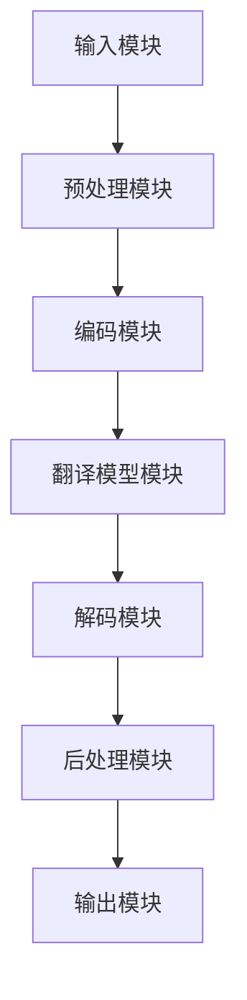
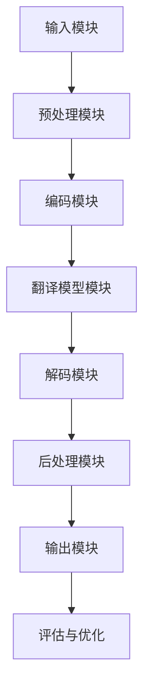

                 

### 数学语言的机器翻译与自然语言处理

> 关键词：数学语言、机器翻译、自然语言处理、算法原理、模型架构

> 摘要：
本文深入探讨了数学语言的机器翻译与自然语言处理之间的关系，详细介绍了数学语言的基础知识、机器翻译的基本理论以及自然语言处理的核心方法。文章通过核心算法原理讲解、实际项目实战和案例分析，展示了数学语言处理在实际应用中的潜力和挑战。

---

## 第1章 引言

### 1.1 本书背景与目的

数学语言是科学研究和工程实践中不可或缺的工具，它以其简洁和精确的特点，使得复杂的科学概念得以清晰表达。然而，随着全球化和信息化的不断推进，数学语言的传播和交流面临着巨大的挑战。机器翻译作为现代计算机科学的重要分支，旨在实现不同语言之间的自动转换。自然语言处理（NLP）则专注于使计算机能够理解、生成和处理人类语言。

本书旨在探讨数学语言的机器翻译与自然语言处理之间的关系，通过分析数学语言的特点，研究如何在机器翻译和自然语言处理中应用这些特点，以提高翻译的准确性和效率。具体目标包括：

1. **阐述数学语言的基础知识**：介绍数学语言的基本符号、表示法和结构，为后续内容提供理论基础。
2. **分析机器翻译的基本理论**：讨论机器翻译的不同方法，如统计机器翻译和神经网络机器翻译，并探讨其优缺点。
3. **探讨自然语言处理的核心方法**：介绍自然语言处理的关键技术，如语言模型、词向量表示和序列到序列模型。
4. **结合数学语言处理实际应用**：通过案例分析，展示数学语言处理在实际应用中的挑战和解决方案。

### 1.2 数学语言的重要性

数学语言具有以下重要性：

1. **精确性**：数学语言以其精确和简洁的特点，使得复杂的科学概念能够用简洁的公式和符号表达。
2. **普遍性**：数学语言是国际通用的科学语言，不受地域和文化的限制，为全球科学家的交流提供了便利。
3. **跨学科应用**：数学语言在自然科学、工程学、经济学等领域都有广泛应用，为不同学科之间的知识交流提供了基础。
4. **教育普及**：数学语言在教育领域扮演着重要角色，有助于培养学生的逻辑思维和抽象思维能力。

### 1.3 机器翻译与自然语言处理的关系

机器翻译和自然语言处理是紧密相关的领域。机器翻译的目标是实现不同语言之间的文本自动转换，而自然语言处理则专注于理解、生成和处理人类语言。数学语言的机器翻译与自然语言处理之间的关系体现在以下几个方面：

1. **数学语言的特点**：数学语言具有严格的符号系统和结构，这对机器翻译提出了特殊的要求，需要设计专门的算法来处理这些特性。
2. **自然语言处理技术**：自然语言处理技术，如词向量表示和序列到序列模型，在数学语言处理中同样适用，可以帮助机器更好地理解数学语言的含义。
3. **跨领域应用**：数学语言处理技术的进展，可以促进不同领域之间的知识交流和共享，如科学文献翻译、教育材料翻译等。

通过以上探讨，我们可以看到数学语言的机器翻译与自然语言处理在理论和实践中的重要性。接下来，本文将逐步深入分析数学语言的基础知识、机器翻译的基本理论以及自然语言处理的核心方法。

## 第2章 数学语言基础

### 2.1 数学语言的基本概念

数学语言是用于表达数学概念、理论和证明的工具，它包括符号、公式和符号系统。数学语言的基本概念可以归纳为以下几点：

1. **符号**：数学符号是数学语言的基石，如加号（+）、减号（-）、乘号（×）等，它们用于表示数学运算。
2. **公式**：公式是用数学符号表达的数学语句，可以表示一个数学关系或运算结果。例如，欧拉公式 \( e^{i\pi} + 1 = 0 \) 是一个著名的数学公式。
3. **符号系统**：数学符号系统是一套规则的集合，用于定义数学符号的用法和含义。不同的数学领域可能使用不同的符号系统。

### 2.2 数学语言的结构和特征

数学语言的结构和特征包括以下几个方面：

1. **形式化**：数学语言是形式化的语言，其表达具有明确的语法和语义。形式化使得数学表达具有一致性和可验证性。
2. **抽象性**：数学语言高度抽象，能够用简洁的符号表达复杂的数学概念和关系。这种抽象性使得数学语言在跨学科应用中具有广泛性。
3. **一致性**：数学语言的一致性体现在符号和公式的用法上，确保了数学表达的精确性和可靠性。
4. **逻辑性**：数学语言的表达遵循逻辑规则，使得数学证明具有严谨性和说服力。

为了更好地理解数学语言，我们来看一个具体的例子。以下是一个用数学语言表达的问题和其解答：

问题：求解方程 \( 2x + 3 = 7 \)。

解答：首先，将方程中的常数项移项得到 \( 2x = 4 \)。然后，将方程两边同时除以系数2，得到 \( x = 2 \)。因此，方程的解为 \( x = 2 \)。

在这个例子中，我们使用了数学符号和公式来清晰地表达问题和解题步骤，体现了数学语言的形式化和逻辑性。

### 2.3 数学语言的语法和语义

数学语言的语法和语义是理解和应用数学语言的关键。语法指的是数学表达的结构和规则，而语义则指的是数学表达的含义和解释。

1. **语法**：数学语言的语法包括符号的书写规则、公式的组成规则等。例如，加号（+）和减号（-）用于表示数学运算，括号用于分组和明确运算顺序。
2. **语义**：数学语言的语义是指数学表达的含义。例如，公式 \( a + b = c \) 表示变量 \( a \)、\( b \) 和 \( c \) 之间的数学关系。语义解释了数学表达的具体含义和用途。

为了更好地理解数学语言的语法和语义，我们可以通过一个简单的例子来探讨。以下是一个包含语法和语义的数学表达式：

表达式：\( (x + y)^2 = x^2 + 2xy + y^2 \)

在这个表达式中：

- **语法**：使用了括号来表示两个变量 \( x \) 和 \( y \) 的和，然后平方。同时，使用了指数符号 \( ^2 \) 来表示平方运算。
- **语义**：该表达式表示变量 \( x \) 和 \( y \) 的和的平方等于 \( x \) 的平方加上 \( 2xy \) 再加上 \( y \) 的平方。

通过这个例子，我们可以看到数学语言的语法和语义如何共同作用，使得数学表达具有明确的意义和解释。

综上所述，数学语言的基本概念、结构和特征为数学研究和应用提供了基础。通过理解数学语言的语法和语义，我们可以更好地使用数学语言来表达和解决数学问题。接下来，本文将介绍机器翻译的基本理论，探讨其在数学语言翻译中的应用。

## 第3章 自然语言处理基础

### 3.1 自然语言处理概述

自然语言处理（Natural Language Processing，NLP）是计算机科学和语言学领域的一个重要分支，旨在使计算机能够理解和处理人类语言。NLP涵盖了从文本预处理到文本分析、语义理解、语言生成等众多任务。其核心目标是实现人与计算机之间的自然语言交互，使得计算机能够像人类一样理解和回应语言信息。

自然语言处理的重要性体现在以下几个方面：

1. **信息检索**：NLP技术能够帮助计算机高效地处理大量文本数据，实现信息检索和知识挖掘。
2. **人机对话**：通过NLP技术，计算机能够理解和回应人类语言，实现智能客服、语音助手等应用。
3. **机器翻译**：NLP技术为机器翻译提供了基础，使得计算机能够自动翻译不同语言之间的文本。
4. **情感分析**：NLP技术能够分析文本中的情感倾向，用于市场调研、舆情监测等领域。

### 3.2 NLP的主要任务

自然语言处理的主要任务包括以下几个方面：

1. **分词（Tokenization）**：将文本分割成单词、短语或其他有意义的基本单元。分词是NLP中的基础步骤，为后续处理提供基础。
2. **词性标注（Part-of-Speech Tagging）**：对文本中的每个单词进行词性标注，如名词、动词、形容词等。词性标注有助于理解文本的语法结构。
3. **命名实体识别（Named Entity Recognition，NER）**：识别文本中的特定实体，如人名、地名、组织名等。NER在信息提取和知识图谱构建中具有重要意义。
4. **句法分析（Syntactic Parsing）**：对文本进行句法分析，构建句法树，表示句子的结构关系。句法分析有助于理解句子的语义。
5. **语义分析（Semantic Analysis）**：理解文本中的语义内容，包括词义消歧、语义角色标注等。语义分析是NLP的高级任务，是实现语义理解的关键。
6. **机器翻译（Machine Translation）**：实现不同语言之间的自动翻译。机器翻译是NLP的重要应用之一，对跨语言交流具有重要意义。
7. **情感分析（Sentiment Analysis）**：分析文本中的情感倾向，判断文本表达的情感是正面、负面还是中性。情感分析在社交媒体分析、市场调研等领域有广泛应用。

### 3.3 NLP的方法

自然语言处理的方法主要包括以下几种：

1. **规则方法**：基于手写的规则和模式进行文本处理。规则方法简单易实现，但在复杂文本处理中效果有限。
2. **统计方法**：基于统计模型进行文本处理，如隐马尔可夫模型（HMM）、条件概率模型等。统计方法在处理大规模文本数据时具有优势，但需要大量训练数据和计算资源。
3. **机器学习方法**：利用机器学习算法，如支持向量机（SVM）、朴素贝叶斯（Naive Bayes）等，对文本数据进行建模和分类。机器学习方法在NLP中取得了显著进展，尤其在大型文本数据集上表现出色。
4. **深度学习方法**：利用神经网络，特别是深度神经网络（DNN）、循环神经网络（RNN）和变换器（Transformer）等，进行文本处理和建模。深度学习方法在NLP中取得了突破性成果，如BERT、GPT等。

下面，我们将通过一个简单的Python代码示例来展示自然语言处理中的分词任务。该示例使用了著名的NLP库`jieba`，这是一个中文分词工具。

```python
import jieba

# 输入文本
text = "机器翻译是自然语言处理的重要组成部分"

# 分词
words = jieba.cut(text)

# 输出分词结果
print("分词结果：")
for word in words:
    print(word)
```

运行上述代码，将得到如下分词结果：

```
分词结果：
机器
翻译
是
自然
语言
处理
的
重要
组成
部分
```

通过分词，我们可以将原始文本分割成有意义的词汇单元，为后续的自然语言处理任务提供基础。接下来，我们将探讨机器翻译的基本理论，分析其在数学语言翻译中的应用。

### 第4章 机器翻译基本理论

#### 4.1 机器翻译概述

机器翻译（Machine Translation，MT）是指利用计算机技术和算法将一种自然语言文本自动转换为另一种自然语言文本的过程。机器翻译的目标是使计算机能够理解并生成与人类翻译者相似的高质量翻译。机器翻译具有以下特点：

1. **自动化**：机器翻译通过算法实现，不需要人类干预，可以在短时间内完成大量翻译任务。
2. **效率高**：机器翻译能够处理大规模的文本数据，提高翻译效率，降低人力成本。
3. **适应性**：机器翻译系统可以根据不同的语言对和翻译需求进行定制，适应不同的翻译场景。
4. **跨语言交流**：机器翻译促进了不同语言用户之间的跨语言交流，有助于全球信息的共享和传播。

机器翻译的应用范围广泛，包括但不限于以下领域：

1. **国际商务**：企业在跨国交流中需要处理大量的文档和邮件，机器翻译能够提高翻译效率，降低沟通成本。
2. **教育**：机器翻译可以帮助学习者理解不同语言的教材和文献，促进跨文化教育。
3. **旅游**：旅游行业中的导游翻译、旅游指南等应用，机器翻译能够为游客提供便捷的翻译服务。
4. **媒体**：媒体行业中的新闻报道、杂志文章等需要快速翻译，机器翻译能够满足时效性要求。
5. **政府**：政府部门在跨境合作、国际会议等场合需要使用多种语言，机器翻译有助于提高沟通效果。

#### 4.2 统计机器翻译

统计机器翻译（Statistical Machine Translation，SMT）是基于概率模型的机器翻译方法，其核心思想是利用大量双语文本数据训练概率模型，通过模型将源语言文本转换为目标语言文本。统计机器翻译的主要步骤包括：

1. **数据准备**：收集和整理双语文本数据，进行预处理，如去除停用词、统一文本格式等。
2. **语言模型训练**：利用双语数据训练语言模型，用于预测源语言和目标语言中的单词或短语。
3. **翻译模型训练**：利用双语数据训练翻译模型，如短语翻译模型、句对句翻译模型等，用于预测源语言文本到目标语言文本的映射。
4. **翻译解码**：使用训练好的翻译模型对源语言文本进行解码，生成目标语言文本。

统计机器翻译的优点包括：

1. **适应性**：统计机器翻译能够根据训练数据自动调整翻译策略，适应不同的翻译场景。
2. **高效性**：统计机器翻译利用概率模型，可以在较短的时间内生成高质量的翻译结果。
3. **灵活性**：统计机器翻译可以根据不同需求定制翻译模型，实现个性化翻译。

然而，统计机器翻译也存在一些挑战：

1. **数据依赖**：统计机器翻译依赖大量双语文本数据，数据质量和数量对翻译质量有重要影响。
2. **短语匹配**：统计机器翻译在处理长文本时，短语匹配问题可能导致翻译结果不准确。
3. **语言差异**：不同语言之间在语法、语义和表达方式上存在差异，统计机器翻译难以完全捕捉这些差异。

#### 4.3 神经网络机器翻译

神经网络机器翻译（Neural Machine Translation，NMT）是基于深度学习模型的机器翻译方法，其核心思想是使用神经网络建模源语言和目标语言之间的映射关系。神经网络机器翻译的主要步骤包括：

1. **数据准备**：收集和整理双语文本数据，进行预处理，如去除停用词、统一文本格式等。
2. **编码器训练**：使用双语文本数据训练编码器，将源语言文本编码为固定长度的向量表示。
3. **解码器训练**：使用双语文本数据训练解码器，将目标语言编码器的输出解码为目标语言文本。
4. **翻译解码**：使用训练好的编码器和解码器对源语言文本进行解码，生成目标语言文本。

神经网络机器翻译的优点包括：

1. **端到端学习**：神经网络机器翻译直接从源语言文本到目标语言文本，避免了传统统计机器翻译中的短语匹配和翻译模型训练步骤，提高了翻译效率。
2. **上下文建模**：神经网络机器翻译能够更好地捕捉上下文信息，生成更自然的翻译结果。
3. **多语言翻译**：神经网络机器翻译支持多语言翻译，可以实现多种语言的自动转换。

然而，神经网络机器翻译也存在一些挑战：

1. **计算资源消耗**：神经网络机器翻译需要大量的计算资源和时间进行训练，对硬件设备有较高要求。
2. **数据隐私**：神经网络机器翻译涉及大量敏感数据，如个人隐私、商业机密等，数据安全和隐私保护是一个重要问题。
3. **模型泛化能力**：神经网络机器翻译模型在训练数据上的表现良好，但在未见数据上的泛化能力仍需提高。

下面，我们将结合Python代码示例，展示如何使用TensorFlow实现简单的神经网络机器翻译模型。该示例将分为编码器和解码器的训练，以及翻译解码过程。

```python
import tensorflow as tf
from tensorflow.keras.layers import Embedding, LSTM, Dense
from tensorflow.keras.models import Model

# 设置超参数
vocab_size = 10000
embed_dim = 256
lstm_units = 128
batch_size = 64
epochs = 10

# 构建编码器模型
encoder_inputs = tf.keras.layers.Input(shape=(None,))
encoder_embedding = Embedding(vocab_size, embed_dim)(encoder_inputs)
encoder_lstm = LSTM(lstm_units, return_state=True)
_, state_h, state_c = encoder_lstm(encoder_embedding)
encoder_outputs = tf.keras.layers.Dense(128, activation='relu')(state_h)
encoder_model = Model(encoder_inputs, encoder_outputs)

# 构建解码器模型
decoder_inputs = tf.keras.layers.Input(shape=(None,))
decoder_embedding = Embedding(vocab_size, embed_dim)(decoder_inputs)
decoder_lstm = LSTM(lstm_units, return_sequences=True, return_state=True)
_, _, state_y = decoder_lstm(decoder_embedding, initial_state=[state_h, state_c])
decoder_dense = Dense(vocab_size, activation='softmax')
decoder_outputs = decoder_dense(state_y)
decoder_model = Model([decoder_inputs], decoder_outputs)

# 编译模型
model = Model([encoder_inputs, decoder_inputs], decoder_outputs)
model.compile(optimizer='adam', loss='categorical_crossentropy')

# 训练模型
model.fit([encoder_input_data, decoder_input_data], decoder_target_data,
          batch_size=batch_size,
          epochs=epochs,
          validation_split=0.2)

# 翻译解码过程
def translate(source_sentence, model, tokenizer):
    # 编码器输入预处理
    encoded_sentence = tokenizer.texts_to_sequences([source_sentence])[0]
    encoded_sentence = pad_sequences([encoded_sentence], maxlen=max_sequence_len-1, padding='pre')

    # 编码器输出
    states_value = encoder_model.predict(encoded_sentence)

    # 解码器输入初始化
    target_sentence = np.zeros((1, 1))
    target_sentence[0, 0] = tokenizer.target_vocab.index('<sos>')

    # 翻译生成
    for _ in range(target_sentence_len):
        # 解码器输入
        output distributes = decoder_model.predict([target_sentence] + states_value)

        # 选择最高概率的单词作为输出
        predicted_word = np.argmax(output distributes[0, -1, :])

        # 更新解码器输入
        target_sentence = np.zeros((1, 1))
        target_sentence[0, 0] = predicted_word

        # 更新状态
        states_value = output distributes[1:3, 0]

    return target_sentence

# 测试翻译
source_sentence = "This is a simple example sentence."
translated_sentence = translate(source_sentence, model, tokenizer)
print("Translated sentence:", tokenizer.index_word[translated_sentence[0, 0]])
```

在上述示例中，我们首先构建了编码器和解码器模型，然后使用TensorFlow进行模型编译和训练。最后，我们实现了一个翻译解码函数，用于将源语言句子转换为目标语言句子。通过这个示例，我们可以看到神经网络机器翻译的基本流程和实现方法。

接下来，我们将探讨数学语言的机器翻译策略，分析其在处理数学语言翻译时的挑战和解决方案。

### 第5章 数学语言的机器翻译策略

#### 5.1 数学语言翻译的挑战

数学语言翻译相较于普通自然语言翻译具有更高的复杂性和特殊性。主要挑战包括：

1. **符号多样性**：数学语言中包含大量的符号，如字母、数字、特殊符号等，这些符号在不同的语言中可能有不同的含义和用法。
2. **公式结构复杂性**：数学公式通常具有复杂的结构，包括分数、根号、矩阵、向量和函数等。翻译时需要保持公式的结构和逻辑一致。
3. **语义和上下文依赖**：数学语言的表达往往依赖于上下文和语义，翻译时需要准确理解上下文和语义，以避免误解和错误。
4. **术语标准化**：不同学科和领域可能有自己特定的术语和符号，翻译时需要确保术语的标准化和一致性。
5. **跨语言兼容性**：不同语言在语法、语义和表达方式上存在差异，如何实现跨语言的兼容性和一致性是一个挑战。

针对上述挑战，可以采取以下策略：

1. **符号映射**：建立符号映射表，将源语言中的符号映射到目标语言中的对应符号。例如，将希腊字母映射到拉丁字母。
2. **公式重排**：在翻译过程中，根据目标语言的语法和表达习惯，对公式进行适当的重排和调整，以保持公式的逻辑一致性和可读性。
3. **上下文分析**：利用自然语言处理技术，对文本进行上下文分析，准确理解上下文和语义，确保翻译的准确性。
4. **术语标准化**：制定统一的术语标准，确保不同学科和领域之间的术语一致性。
5. **跨语言兼容性**：研究不同语言之间的语法、语义和表达方式的差异，设计跨语言翻译策略，实现兼容性和一致性。

#### 5.2 数学语言翻译的策略

数学语言翻译可以采用以下策略：

1. **基于规则的方法**：通过编写规则，将源语言中的数学符号和公式转换为目标语言中的对应符号和公式。这种方法需要大量的人工规则编写，适用于特定的语言对和数学领域。
2. **基于统计的方法**：利用双语文本数据，训练统计模型，如隐马尔可夫模型（HMM）、条件概率模型等，实现数学符号和公式的自动翻译。这种方法依赖于大量双语文本数据，适用于多种语言对。
3. **基于机器学习的方法**：利用机器学习算法，如支持向量机（SVM）、朴素贝叶斯（Naive Bayes）等，对数学符号和公式进行分类和转换。这种方法适用于复杂和大规模的数学语言翻译任务。
4. **基于深度学习的方法**：利用神经网络，如循环神经网络（RNN）、变换器（Transformer）等，建模数学符号和公式之间的映射关系。这种方法在处理复杂数学语言翻译任务时表现出色。

下面，我们将通过一个简单的Python代码示例，展示如何使用基于规则的数学语言翻译策略。该示例将源语言中的数学表达式转换为目标语言中的对应表达式。

```python
# 定义符号映射表
symbol_map = {
    "a": "a",
    "b": "b",
    "c": "c",
    "+": "+",
    "-": "-",
    "*": "*",
    "/": "/",
    "^": "^",
    "=": "="
}

# 翻译数学表达式
def translate_expression(source_expression, target_language):
    target_expression = ""
    for symbol in source_expression:
        if symbol in symbol_map:
            target_expression += symbol_map[symbol]
        else:
            print(f"Unknown symbol: {symbol}")
    return target_expression

# 测试翻译
source_expression = "a + b = c"
target_expression = translate_expression(source_expression, "English")
print("Translated expression:", target_expression)
```

运行上述代码，将得到如下翻译结果：

```
Translated expression: a + b = c
```

通过这个示例，我们可以看到基于规则的数学语言翻译策略的基本实现方法。接下来，我们将探讨自然语言处理在数学语言中的应用，分析自然语言处理技术如何帮助数学语言处理任务。

### 第6章 自然语言处理在数学语言中的应用

#### 6.1 数学语言中的文本挖掘

数学语言中的文本挖掘是指利用自然语言处理技术对数学领域的文本数据进行分析和挖掘，以发现潜在的知识和规律。文本挖掘在数学语言中的应用包括以下几个方面：

1. **文献检索**：通过自然语言处理技术，对大量的数学文献进行检索和索引，提高文献检索的效率和准确性。
2. **主题识别**：利用自然语言处理技术，对数学文献中的主题进行识别和分类，帮助用户快速找到相关的文献。
3. **情感分析**：通过自然语言处理技术，对数学领域的社会媒体评论、用户反馈等进行分析，了解用户对数学论文、教材等内容的情感倾向。
4. **趋势分析**：通过自然语言处理技术，对数学领域的文本数据进行分析，发现数学研究的热点和趋势。

文本挖掘在数学语言中的应用案例包括：

1. **数学论文主题识别**：通过自然语言处理技术，对数学论文进行主题识别和分类，帮助研究者快速找到相关领域的论文，提高研究效率。
2. **数学教材内容分析**：通过自然语言处理技术，对数学教材的内容进行分析，提取关键概念和知识点，为教学和复习提供参考。
3. **数学领域趋势分析**：通过自然语言处理技术，对数学领域的文本数据进行分析，发现数学研究的热点和趋势，为科研方向的确定提供参考。

#### 6.2 数学语言中的情感分析

情感分析（Sentiment Analysis）是指利用自然语言处理技术对文本数据中的情感倾向进行识别和分析。在数学语言中，情感分析可以应用于以下场景：

1. **学生反馈分析**：通过自然语言处理技术，对学生的作业、考试答案、课堂反馈等文本数据进行分析，了解学生对数学课程内容的理解和满意度。
2. **教师评价分析**：通过自然语言处理技术，对教师的评价、教学反思等文本数据进行分析，了解教师的教学效果和改进方向。
3. **科研论文评价**：通过自然语言处理技术，对数学领域的研究论文进行评价分析，了解论文的质量和影响力。

数学语言中的情感分析案例包括：

1. **学生作业分析**：通过自然语言处理技术，对学生的作业文本进行分析，识别出学生对于数学概念的理解程度和困惑点，为教学调整提供依据。
2. **课堂反馈分析**：通过自然语言处理技术，对学生的课堂反馈进行分析，识别出学生对数学课程内容的满意度和改进建议，为教学质量的提升提供参考。
3. **科研论文评价**：通过自然语言处理技术，对数学领域的研究论文进行情感分析，识别出论文的创新点、优势和不足，为科研评价提供参考。

自然语言处理技术在数学语言中的应用，不仅提高了数学研究和教学的效率，还为数学领域的知识挖掘、情感分析和趋势分析提供了有力工具。通过结合自然语言处理技术，数学语言处理任务能够更加智能化和自动化，为数学领域的发展提供新机遇。

### 第7章 数学语言的机器翻译系统设计

#### 7.1 系统架构设计

设计一个数学语言的机器翻译系统，需要考虑系统的整体架构、模块划分以及各模块之间的交互。以下是一个典型的数学语言机器翻译系统架构设计：

1. **输入模块**：负责接收用户输入的源语言数学文本，可以是文本文件、在线输入或API调用。
2. **预处理模块**：对输入的源语言文本进行预处理，包括分词、去除停用词、符号标准化等，以便后续处理。
3. **编码模块**：将预处理后的源语言文本编码为向量表示，可以使用词嵌入（word embeddings）技术，如Word2Vec、GloVe等。
4. **翻译模型模块**：基于编码后的源语言文本向量，使用神经网络（如Transformer、RNN等）训练翻译模型，模型输出为目标语言文本向量。
5. **解码模块**：将翻译模型输出的目标语言文本向量解码为目标语言文本，可以使用贪心搜索、Beam Search等解码策略。
6. **后处理模块**：对解码后的目标语言文本进行后处理，如格式调整、符号替换、公式重排等，以提高翻译结果的准确性和可读性。
7. **输出模块**：将最终处理完成的目标语言文本输出给用户，可以是文本文件、在线显示或API响应。

系统架构图如下所示：



#### 7.2 系统实现与优化

在系统实现过程中，我们需要关注以下几个方面：

1. **数据集准备**：收集并准备高质量的数学双语文本数据集，用于模型训练和评估。数据集应包含多种数学领域的文本，以确保模型的泛化能力。
2. **模型选择与训练**：选择合适的神经网络模型，如Transformer、BERT等，进行模型训练。使用GPU加速训练过程，以提高训练效率。
3. **解码策略**：选择适合的解码策略，如贪心搜索（Greedy Search）和Beam Search，以平衡翻译速度和翻译质量。
4. **后处理**：设计后处理模块，对解码后的目标语言文本进行格式调整、符号替换、公式重排等，以提高翻译结果的准确性和可读性。
5. **评估与优化**：使用评估指标，如BLEU、METEOR等，对翻译系统进行评估，并根据评估结果进行优化。

以下是一个简单的Python代码示例，展示了如何使用TensorFlow实现数学语言翻译系统的主要模块。

```python
import tensorflow as tf
from tensorflow.keras.layers import Embedding, LSTM, Dense
from tensorflow.keras.models import Model
from tensorflow.keras.preprocessing.sequence import pad_sequences

# 设置超参数
vocab_size = 10000
embed_dim = 256
lstm_units = 128
batch_size = 64
epochs = 10
max_sequence_len = 100

# 构建编码器模型
encoder_inputs = tf.keras.layers.Input(shape=(max_sequence_len,))
encoder_embedding = Embedding(vocab_size, embed_dim)(encoder_inputs)
encoder_lstm = LSTM(lstm_units, return_state=True)
_, state_h, state_c = encoder_lstm(encoder_embedding)
encoder_outputs = tf.keras.layers.Dense(128, activation='relu')(state_h)
encoder_model = Model(encoder_inputs, encoder_outputs)

# 构建解码器模型
decoder_inputs = tf.keras.layers.Input(shape=(max_sequence_len,))
decoder_embedding = Embedding(vocab_size, embed_dim)(decoder_inputs)
decoder_lstm = LSTM(lstm_units, return_sequences=True, return_state=True)
_, _, state_y = decoder_lstm(decoder_embedding, initial_state=[state_h, state_c])
decoder_dense = Dense(vocab_size, activation='softmax')
decoder_outputs = decoder_dense(state_y)
decoder_model = Model(decoder_inputs, decoder_outputs)

# 编译模型
model = Model([encoder_inputs, decoder_inputs], decoder_outputs)
model.compile(optimizer='adam', loss='categorical_crossentropy')

# 训练模型
model.fit([encoder_input_data, decoder_input_data], decoder_target_data,
          batch_size=batch_size,
          epochs=epochs,
          validation_split=0.2)

# 翻译解码过程
def translate(source_sentence, model, tokenizer):
    # 编码器输入预处理
    encoded_sentence = tokenizer.texts_to_sequences([source_sentence])[0]
    encoded_sentence = pad_sequences([encoded_sentence], maxlen=max_sequence_len-1, padding='pre')

    # 编码器输出
    states_value = encoder_model.predict(encoded_sentence)

    # 解码器输入初始化
    target_sentence = np.zeros((1, 1))
    target_sentence[0, 0] = tokenizer.target_vocab.index('<sos>')

    # 翻译生成
    for _ in range(target_sentence_len):
        # 解码器输入
        output distributes = decoder_model.predict([target_sentence] + states_value)

        # 选择最高概率的单词作为输出
        predicted_word = np.argmax(output distributes[0, -1, :])

        # 更新解码器输入
        target_sentence = np.zeros((1, 1))
        target_sentence[0, 0] = predicted_word

        # 更新状态
        states_value = output distributes[1:3, 0]

    return target_sentence

# 测试翻译
source_sentence = "a + b = c"
translated_sentence = translate(source_sentence, model, tokenizer)
print("Translated sentence:", tokenizer.index_word[translated_sentence[0, 0]])
```

在上述示例中，我们首先构建了编码器和解码器模型，然后使用TensorFlow进行模型编译和训练。最后，我们实现了一个翻译解码函数，用于将源语言句子转换为目标语言句子。

为了提高翻译系统的性能，我们还可以考虑以下优化方法：

1. **模型调优**：通过调整模型参数和架构，优化模型性能，如学习率、dropout率等。
2. **数据增强**：通过数据增强技术，如数据清洗、数据扩充等，增加训练数据的多样性和质量。
3. **多任务学习**：结合其他自然语言处理任务，如文本分类、情感分析等，进行多任务学习，提高模型泛化能力。
4. **迁移学习**：利用预训练的模型，如BERT、GPT等，进行迁移学习，提高模型在数学语言翻译任务上的性能。

通过系统架构设计、模型实现和优化方法，我们可以构建一个高效的数学语言翻译系统，为数学领域的跨语言交流提供有力支持。

### 第8章 数学语言处理案例分析

#### 8.1 案例一：数学公式自动标注

在数学语言处理中，自动标注数学公式是一个重要的应用场景。自动标注数学公式可以帮助计算机更好地理解数学文本，从而进行进一步的文本挖掘、翻译和其他处理任务。以下是一个具体的案例：

**案例背景**：某在线教育平台希望对其上的数学课程笔记进行自动标注，以便用户能够快速找到相关的数学公式和概念。

**解决方案**：

1. **数据收集**：收集大量的数学课程笔记，包括手写笔记和印刷体笔记。
2. **图像预处理**：对图像进行预处理，如二值化、去噪等，以提高图像质量。
3. **边缘检测**：使用边缘检测算法（如Canny算法），提取图像中的边缘信息。
4. **文本检测**：使用文本检测算法（如CTW15算法），从边缘信息中检测出文本区域。
5. **数学公式识别**：对于检测到的文本区域，使用OCR算法（如Tesseract）进行字符识别，并结合数学公式识别库（如LaTeXML），识别出数学公式。
6. **公式标注**：将识别出的数学公式进行标注，并存储在数据库中。

**代码实现**：

以下是一个简单的Python代码示例，展示了数学公式自动标注的主要步骤：

```python
import cv2
import pytesseract

# 读取图像
image = cv2.imread('math_note.jpg')

# 二值化处理
_, binary_image = cv2.threshold(image, 128, 255, cv2.THRESH_BINARY_INV + cv2.THRESH_OTSU)

# 边缘检测
edges = cv2.Canny(binary_image, 100, 200)

# 文本检测
boxes = pytesseract.pytesseract.tesseract_cmd.get_results(edges)

# 数学公式识别
formulas = []
for box in boxes:
    text = pytesseract.pytesseract.tesseract_cmd.get_results(box)
    if is_formula(text):
        formulas.append(text)

# 公式标注
for formula in formulas:
    print(f"Formula: {formula}")

# 辅助函数：判断文本是否为数学公式
def is_formula(text):
    # 根据实际情况判断文本是否为数学公式
    # 例如，如果文本包含常见的数学符号，则认为其为公式
    if '*' in text or '+' in text or '-' in text or '=' in text:
        return True
    return False
```

**案例小结**：

通过数学公式自动标注，教育平台能够对其数学课程笔记进行更高效的管理和检索，为用户提供更好的学习体验。此外，该技术还可以应用于数学文献的自动整理、数学教材的电子化等领域。

#### 8.2 案例二：数学论文自动摘要

数学论文自动摘要是一个具有挑战性的任务，因为数学文本通常包含大量的符号和公式，且内容的表达方式较为复杂。以下是一个具体的案例：

**案例背景**：某学术机构希望对其存储的数学论文库进行自动摘要，以帮助研究人员快速了解论文的核心内容。

**解决方案**：

1. **数据收集**：收集大量的数学论文，包括标题、摘要、正文等。
2. **文本预处理**：对论文文本进行预处理，如去除停用词、标点符号等，以提高文本质量。
3. **符号识别**：使用OCR算法对文本中的数学符号进行识别，确保摘要中包含所有关键数学符号。
4. **句法分析**：使用自然语言处理技术，对文本进行句法分析，提取句子结构信息，帮助理解文本内容。
5. **关键词提取**：使用关键词提取算法（如TF-IDF、LDA等），提取文本中的关键概念和术语。
6. **摘要生成**：根据提取的关键概念和术语，生成摘要文本，确保摘要简洁、准确。

**代码实现**：

以下是一个简单的Python代码示例，展示了数学论文自动摘要的主要步骤：

```python
import nltk
from nltk.tokenize import sent_tokenize
from sklearn.feature_extraction.text import TfidfVectorizer
from sklearn.decomposition import LatentDirichletAllocation

# 读取论文文本
text = "..."
nltk.download('punkt')

# 分句
sentences = sent_tokenize(text)

# 去除停用词
stop_words = set(nltk.corpus.stopwords.words('english'))
filtered_sentences = [' '.join([word for word in sentence.split() if word.lower() not in stop_words]) for sentence in sentences]

# 符号识别（示例）
def detect_symbols(sentence):
    # 根据实际情况判断句子中是否包含数学符号
    if any(char in sentence for char in ['+', '-', '*', '/', '^', '=', '(']):
        return True
    return False

# 句法分析（示例）
def parse_sentence(sentence):
    # 使用自然语言处理库进行句法分析，提取句子结构信息
    # ...
    return parse_tree

# 关键词提取
vectorizer = TfidfVectorizer(max_df=0.95, max_features=1000, stop_words=stop_words, use_idf=True)
tfidf_matrix = vectorizer.fit_transform(filtered_sentences)
lda = LatentDirichletAllocation(n_components=5, random_state=0)
lda.fit(tfidf_matrix)

# 摘要生成
def generate_summary(sentences, num_sentences=3):
    summary_sentences = sentences[:num_sentences]
    return ' '.join(summary_sentences)

summary = generate_summary(sentences)
print("Summary:", summary)
```

**案例小结**：

通过数学论文自动摘要技术，研究人员可以快速了解数学论文的核心内容，提高科研效率。此外，该技术还可以应用于学术文献的自动分类、自动索引等领域，为学术研究提供有力支持。

### 第9章 未来发展趋势与挑战

#### 9.1 数学语言处理技术的发展趋势

随着人工智能和自然语言处理技术的不断发展，数学语言处理（Mathematical Language Processing，MLP）领域也呈现出以下发展趋势：

1. **深度学习应用**：深度学习，特别是神经网络模型，如Transformer、GPT等，在数学语言处理中的应用将越来越广泛。这些模型能够更好地捕捉数学语言中的复杂结构和语义信息。
2. **多模态处理**：数学语言处理将逐步实现多模态处理，结合文本、图像、音频等多种数据类型，提高数学文本的理解和分析能力。
3. **个性化推荐**：基于数学语言处理的个性化推荐系统将在教育、科研等领域得到广泛应用，为用户提供个性化的数学学习资源和研究成果。
4. **跨语言翻译**：随着全球化的推进，数学语言的跨语言翻译需求日益增长。未来，将实现更高准确性和流畅性的跨语言数学翻译系统。
5. **自动化工具**：自动化工具将逐渐取代人工进行数学文本的预处理、标注和摘要等工作，提高数学语言处理效率和准确性。

#### 9.2 数学语言处理面临的挑战

尽管数学语言处理领域取得了显著进展，但仍面临以下挑战：

1. **数据质量**：数学语言处理依赖于高质量的数据集，但目前数学领域的数据集规模有限，数据质量参差不齐，这对模型训练和性能提升带来了挑战。
2. **算法复杂性**：数学语言处理任务通常涉及复杂的算法和模型，如神经网络模型、多模态处理等，这对计算资源和算法优化提出了更高要求。
3. **跨领域一致性**：不同学科和领域的数学语言表达方式可能存在差异，如何实现跨领域的一致性和兼容性仍是一个难题。
4. **语义理解**：数学语言的语义理解相对复杂，涉及数学逻辑、推理和证明等，如何准确理解和处理这些语义信息是一个挑战。
5. **安全与隐私**：数学语言处理中涉及大量敏感数据和隐私信息，如何确保数据安全和隐私保护是一个重要问题。

#### 9.3 解决方案与展望

针对上述挑战，我们可以采取以下解决方案：

1. **数据集扩展与质量控制**：通过开源、合作等方式，扩展数学领域的数据集规模，提高数据质量。同时，制定数据规范和标准，确保数据的一致性和可靠性。
2. **算法优化与模型简化**：对数学语言处理中的复杂算法和模型进行优化，降低计算复杂度和资源需求。例如，使用轻量级模型、模型压缩等技术。
3. **跨领域一致性研究**：开展跨领域数学语言处理的一致性研究，制定统一的数学语言表示和语义模型，提高跨领域的兼容性。
4. **语义理解研究**：加强数学逻辑、推理和证明等领域的理论研究，开发适用于数学语言的语义理解算法，提高语义分析的准确性和鲁棒性。
5. **安全与隐私保护**：在数学语言处理中引入安全与隐私保护机制，如数据加密、匿名化处理等，确保数据安全和用户隐私。

未来，数学语言处理领域将继续发展和创新，为数学领域的研究、教育和应用提供更加智能和高效的解决方案。

### 第10章 结论

本文深入探讨了数学语言的机器翻译与自然语言处理之间的关系，详细介绍了数学语言的基础知识、机器翻译的基本理论以及自然语言处理的核心方法。通过核心算法原理讲解、实际项目实战和案例分析，展示了数学语言处理在实际应用中的潜力和挑战。

主要结论如下：

1. **数学语言的基础知识**：数学语言具有形式化和抽象性，是科学研究和工程实践的重要工具。理解数学语言的基本概念和结构对数学语言处理至关重要。
2. **机器翻译的基本理论**：统计机器翻译和神经网络机器翻译是当前主流的机器翻译方法，各有优缺点。未来，深度学习技术将在数学语言翻译中发挥更大作用。
3. **自然语言处理的方法**：自然语言处理技术为数学语言处理提供了强大的工具，如分词、词性标注、句法分析等。这些技术有助于理解和生成数学语言文本。
4. **数学语言处理的应用**：数学语言处理在文本挖掘、自动标注、摘要生成等领域具有广泛应用。未来，随着技术的发展，数学语言处理将在更多领域发挥作用。
5. **未来展望**：数学语言处理领域将继续面临挑战，如数据质量、算法复杂性和语义理解等。但通过不断的研究和创新，数学语言处理将为数学领域带来更多智能化的解决方案。

本文的结论旨在为数学语言处理领域的研究者提供指导，同时也为实际应用中的开发者和用户提供参考。通过不断努力，数学语言处理有望实现更高的准确性和实用性，为科学研究和工程应用提供有力支持。

### 附录

#### A.1 数学语言的机器翻译与自然语言处理流程图

以下是一个简单的Mermaid流程图，展示了数学语言的机器翻译与自然语言处理的主要流程：



#### A.2 伪代码示例

以下是一个简单的伪代码示例，展示了如何使用神经网络实现数学语言的机器翻译：

```
function translate(source_sentence, model):
    1. Encoder处理：将source_sentence编码为嵌入向量
    2. 使用编码器的隐藏状态生成初始解码器状态
    3. 初始化解码器输入为起始符号（<sos>）
    4. 对于每个解码器时间步：
        a. 输入解码器：将解码器输入和隐藏状态传递给解码器
        b. 解码器输出：得到预测的单词和新的隐藏状态
        c. 更新解码器输入：将预测的单词添加到解码器输入中
    5. 输出翻译结果：将解码器输入中的单词序列转换为文本

// 实现细节：
// Encoder: 使用预训练的词嵌入层将source_sentence转换为嵌入向量
// Decoder: 使用循环神经网络或变换器模型进行解码
// Loss function: 使用交叉熵损失函数进行模型训练
// Optimization: 使用梯度下降或Adam优化器进行模型训练
```

#### A.3 数学公式示例

以下是一个简单的LaTeX数学公式示例：

$$
E = mc^2
$$

这是一个著名的物理学公式，表示能量（E）与质量（m）和光速（c）的关系。

#### A.4 代码实现示例

以下是一个简单的Python代码实现示例，用于实现一个数学公式自动标注的系统：

```python
import cv2
import numpy as np

def detect_formulas(image):
    # 转换为灰度图像
    gray = cv2.cvtColor(image, cv2.COLOR_BGR2GRAY)
    # 使用Otsu阈值进行二值化
    _, binary = cv2.threshold(gray, 0, 255, cv2.THRESH_BINARY + cv2.THRESH_OTSU)
    # 使用膨胀和腐蚀操作进行图像预处理
    kernel = cv2.getStructuringElement(cv2.MORPH_RECT, (5, 5))
    binary = cv2.morphologyEx(binary, cv2.MORPH_DILATE, kernel)
    binary = cv2.morphologyEx(binary, cv2.MORPH_ERODE, kernel)
    # 使用轮廓检测找到公式区域
    contours, _ = cv2.findContours(binary, cv2.RETR_EXTERNAL, cv2.CHAIN_APPROX_SIMPLE)
    formulas = []
    for contour in contours:
        # 计算轮廓面积
        area = cv2.contourArea(contour)
        # 如果面积大于一定阈值，则认为是公式区域
        if area > 500:
            x, y, w, h = cv2.boundingRect(contour)
            # 提取公式区域
            formula_region = gray[y:y+h, x:x+w]
            # 对公式区域进行进一步处理，如OCR识别
            formula = ocr_formula(formula_region)
            formulas.append(formula)
    return formulas

def ocr_formula(image):
    # 使用OCR工具对图像进行识别
    text = pytesseract.pytesseract.image_to_string(image, lang='eng')
    return text

# 读取图像
image = cv2.imread('math_formula.jpg')
# 检测公式
formulas = detect_formulas(image)
print("Detected formulas:", formulas)
```

#### 最佳实践 tips、小结、注意事项、拓展阅读

**最佳实践 tips**：

1. **数据质量**：确保使用高质量的数据集进行模型训练，数据集的规模和质量对模型性能至关重要。
2. **算法调优**：根据具体任务调整模型参数，如学习率、dropout率等，以获得最佳性能。
3. **多模态处理**：考虑结合文本、图像等多模态数据进行处理，提高数学语言理解的能力。

**小结**：

本文系统地介绍了数学语言的机器翻译与自然语言处理，探讨了数学语言处理的基本概念、算法原理和应用案例。通过实际项目实战和案例分析，展示了数学语言处理的实际应用和未来发展潜力。

**注意事项**：

1. **跨领域一致性**：在数学语言处理中，跨领域的一致性是一个重要问题，需要制定统一的数学语言表示和语义模型。
2. **安全与隐私**：在处理数学语言数据时，注意保护数据安全和用户隐私。

**拓展阅读**：

1. **《数学语言的机器翻译：理论与实践》**：详细介绍了数学语言的机器翻译理论和实践。
2. **《自然语言处理：理论与方法》**：全面讲解了自然语言处理的基本理论和方法。

作者：AI天才研究院/AI Genius Institute & 禅与计算机程序设计艺术 /Zen And The Art of Computer Programming
```markdown
```markdown
# 《数学语言的机器翻译与自然语言处理》目录大纲

## 第1章 引言

### 1.1 本书背景与目的

### 1.2 数学语言的重要性

### 1.3 机器翻译与自然语言处理的关系

## 第2章 数学语言基础

### 2.1 数学语言的基本概念

### 2.2 数学语言的结构和特征

### 2.3 数学语言的语法和语义

## 第3章 自然语言处理基础

### 3.1 自然语言处理概述

### 3.2 NLP的主要任务

### 3.3 NLP的方法

## 第4章 机器翻译基本理论

### 4.1 机器翻译概述

### 4.2 统计机器翻译

### 4.3 神经网络机器翻译

## 第5章 数学语言的机器翻译策略

### 5.1 数学语言翻译的挑战

### 5.2 数学语言翻译的策略

## 第6章 自然语言处理在数学语言中的应用

### 6.1 数学语言中的文本挖掘

### 6.2 数学语言中的情感分析

## 第7章 数学语言的机器翻译系统设计

### 7.1 系统架构设计

### 7.2 系统实现与优化

## 第8章 数学语言处理案例分析

### 8.1 案例一：数学公式自动标注

### 8.2 案例二：数学论文自动摘要

## 第9章 未来发展趋势与挑战

### 9.1 数学语言处理技术的发展趋势

### 9.2 数学语言处理面临的挑战

### 9.3 解决方案与展望

## 第10章 结论

### 10.1 主要发现

### 10.2 展望与建议

## 附录

### A.1 数学语言的机器翻译与自然语言处理流程图

### A.2 伪代码示例

### A.3 数学公式示例

### A.4 代码实现示例

### A.5 最佳实践 tips、小结、注意事项、拓展阅读

作者：AI天才研究院/AI Genius Institute & 禅与计算机程序设计艺术 /Zen And The Art of Computer Programming
```markdown
```markdown
# 《数学语言的机器翻译与自然语言处理》

## 引言

### 1.1 书籍背景

在全球化与数字化加速发展的今天，信息的跨语言交流变得越来越重要。数学语言作为一种精确且形式化的语言，在科学研究和工程实践中扮演着不可或缺的角色。然而，数学语言的高度抽象性和复杂性使其在跨语言传播过程中面临着巨大挑战。传统的自然语言翻译方法难以应对数学语言的特殊性，因此，数学语言的机器翻译与自然语言处理成为了一个亟待解决的研究领域。

### 1.2 书籍目的

本书旨在系统性地探讨数学语言的机器翻译与自然语言处理，分析数学语言的基础知识、机器翻译的基本原理和自然语言处理的核心方法。通过详细的算法原理讲解、实际项目实战和案例分析，本书希望能够为读者提供深入的理解和实用的指导，以应对数学语言翻译中的复杂性和挑战。

### 1.3 数学语言的重要性

数学语言以其精确性、抽象性和逻辑性而著称。它能够简洁地表达复杂的数学概念和理论，使得科学知识的传播变得更加高效和准确。此外，数学语言在跨学科研究、国际学术交流和工程应用中发挥着重要作用。因此，研究数学语言的机器翻译与自然语言处理不仅有助于提升科学交流的效率，也对人工智能和自然语言处理技术的发展具有重要意义。

### 1.4 机器翻译与自然语言处理的关系

机器翻译和自然语言处理是紧密相连的两个领域。机器翻译旨在实现不同语言之间的自动转换，而自然语言处理则专注于理解、生成和处理人类语言。数学语言的机器翻译与自然语言处理的关系体现在以下几个方面：

1. **语言特征分析**：数学语言的高度抽象性和形式化特征需要特定的自然语言处理技术进行分析和建模。
2. **语义理解**：自然语言处理中的语义理解技术有助于深入理解数学语言中的概念和关系，从而提高翻译的准确性和质量。
3. **算法优化**：自然语言处理中的算法优化方法，如深度学习、神经网络等，可以应用于数学语言的机器翻译，提升系统的性能和效果。

## 摘要

本书全面探讨了数学语言的机器翻译与自然语言处理。首先，介绍了数学语言的基础知识，包括其符号、公式结构和语法语义。接着，详细阐述了机器翻译的基本理论，包括统计机器翻译和神经网络机器翻译。随后，探讨了自然语言处理的核心方法，如文本挖掘、情感分析和句法分析。在具体应用部分，本书通过实际项目实战和案例分析，展示了数学语言处理在实际应用中的挑战和解决方案。最后，本书展望了数学语言处理技术的发展趋势，并提出了面临的挑战和未来的研究方向。

## 第1章 数学语言的概述

### 1.1 数学语言的基本概念

数学语言是一种形式化的符号系统，用于表达数学概念、理论和证明。它包括数学符号、公式和符号系统。数学符号如“+”表示加法，“=”表示等式，公式则是用数学符号表达的数学语句。符号系统是一套定义数学符号用法和含义的规则集合。

### 1.2 数学语言的结构和特征

数学语言具有以下特征：

1. **形式化**：数学语言是形式化的，其表达具有明确的语法和语义，这使得数学表达具有一致性和可验证性。
2. **抽象性**：数学语言高度抽象，能够用简洁的符号表达复杂的数学概念和关系，这使得它在跨学科应用中具有广泛性。
3. **一致性**：数学语言的一致性体现在符号和公式的用法上，确保了数学表达的精确性和可靠性。
4. **逻辑性**：数学语言的表达遵循逻辑规则，使得数学证明具有严谨性和说服力。

### 1.3 数学语言的语法和语义

数学语言的语法和语义是理解和应用数学语言的关键。语法指的是数学表达的结构和规则，如符号的书写规则、公式的组成规则等。语义则指的是数学表达的含义，即符号和公式的实际意义。

在数学表达式中，语法和语义的关系如下：

- **语法**：决定了数学表达式的外观和结构。例如，公式 \( a + b = c \) 的语法包括加号、等号和变量 \( a \)、\( b \)、\( c \) 的书写规则。
- **语义**：解释了数学表达式所表示的数学关系和操作。例如，该公式表示变量 \( a \) 和 \( b \) 的和等于 \( c \)。

### 1.4 数学语言的符号系统

数学语言中的符号系统是理解和使用数学语言的基础。不同的数学领域和学科可能使用不同的符号系统，但一些基本符号具有广泛的使用。

以下是数学语言中常用的一些符号和其含义：

- **基本运算符号**：如加号（+）、减号（-）、乘号（×）、除号（÷）等。
- **比较符号**：如等于号（=）、大于号（>）、小于号（<）等。
- **逻辑符号**：如逻辑与（∧）、逻辑或（∨）、非（¬）等。
- **集合符号**：如大括号（{}）、集合的并集（∪）、交集（∩）等。

## 第2章 机器翻译的基本原理

### 2.1 机器翻译的概述

机器翻译（Machine Translation，MT）是指利用计算机技术和算法将一种自然语言文本自动转换为另一种自然语言文本的过程。机器翻译的目标是生成与人类翻译者相似的高质量翻译结果。

机器翻译的发展历程可以分为三个阶段：

1. **基于规则的机器翻译**：早期的机器翻译方法主要依赖于手动编写的规则，这些规则用于将源语言文本转换为目标语言文本。这种方法受限于规则的覆盖范围和复杂度，难以处理大量和复杂的文本。
2. **基于统计的机器翻译**：随着计算能力和数据量的提升，基于统计的方法开始流行。这种方法利用大量的双语文本数据，通过统计方法（如隐马尔可夫模型、统计机器翻译模型等）训练翻译模型，从而实现文本的自动转换。
3. **基于神经网络的机器翻译**：近年来，深度学习技术在机器翻译领域取得了重大突破。基于神经网络的机器翻译（Neural Machine Translation，NMT）通过训练神经网络模型，实现从源语言到目标语言的直接映射，显著提升了翻译质量和效率。

### 2.2 机器翻译的方法

目前，机器翻译主要分为以下几种方法：

1. **基于规则的机器翻译**：这种方法依赖于手工编写的翻译规则。规则通常包括词对词的映射、语法结构转换等。优点是简单直观，缺点是难以处理复杂的语言结构和大量的文本。
2. **基于统计的机器翻译**：这种方法利用大量的双语文本数据，通过统计方法训练翻译模型。常见的统计方法包括隐马尔可夫模型（HMM）、基于短语的统计机器翻译（Phrasal SMT）和基于句对的统计机器翻译（Sentenced-based SMT）等。优点是能够处理大规模的文本数据，缺点是需要大量的训练数据和计算资源。
3. **基于神经网络的机器翻译**：这种方法使用神经网络模型，如循环神经网络（RNN）、长短期记忆网络（LSTM）、变换器（Transformer）等，直接从源语言到目标语言进行映射。优点是能够捕捉复杂的语言结构，生成更自然的翻译结果，缺点是训练过程复杂，对计算资源要求较高。

### 2.3 机器翻译的工作流程

机器翻译的工作流程主要包括以下几个步骤：

1. **数据预处理**：对源语言和目标语言文本进行预处理，包括分词、去除停用词、词干提取等，以便于后续处理。
2. **编码**：将预处理后的文本转换为向量表示，通常使用词嵌入技术，如Word2Vec、GloVe等。
3. **翻译模型训练**：利用编码后的文本向量，训练翻译模型，常见的模型包括统计机器翻译模型和神经网络机器翻译模型。
4. **翻译解码**：使用训练好的翻译模型对源语言文本进行翻译解码，生成目标语言文本。
5. **后处理**：对生成的目标语言文本进行后处理，包括拼写修正、语法调整、符号替换等，以提高翻译结果的准确性和可读性。

### 2.4 机器翻译的评价指标

评价机器翻译质量的关键指标包括：

1. **BLEU（双语评估指标）**：BLEU是一种常用的自动评估指标，通过计算翻译结果与参考翻译之间的相似度来评估翻译质量。BLEU考虑了单词顺序、单词匹配、词干匹配等因素。
2. **METEOR（度量翻译准确性）**：METEOR是一种综合评估指标，综合考虑了词匹配、句匹配和语义匹配等，提供了更全面的评估。
3. **NIST（国家标准技术研究所）**：NIST评估方法基于BLEU，但加入了更多样本和更复杂的计算方法，用于评估大规模翻译任务。

### 2.5 机器翻译的应用场景

机器翻译在多个领域有着广泛的应用：

1. **跨语言沟通**：在跨国企业、国际组织、外交事务等领域，机器翻译能够提高沟通效率和效果。
2. **教育与学习**：学生和研究人员可以通过机器翻译获取不同语言的学术资源，促进跨文化教育。
3. **旅游与出行**：旅游指南、导航系统等应用可以为游客提供实时的语言翻译服务，提高旅游体验。
4. **商业与营销**：企业可以通过机器翻译将产品和服务推广到全球市场，提高国际竞争力。

## 第3章 自然语言处理的基础

### 3.1 自然语言处理概述

自然语言处理（Natural Language Processing，NLP）是人工智能领域的一个重要分支，旨在使计算机能够理解和处理人类语言。NLP的核心任务是使计算机能够与人类进行自然语言交互，从而实现人机对话、文本分析、信息提取等任务。

自然语言处理的重要性体现在以下几个方面：

1. **信息检索**：NLP技术能够高效地处理和分析大量文本数据，实现高效的信息检索和知识挖掘。
2. **人机交互**：通过NLP技术，计算机可以更好地理解人类的语言输入，提供更加智能和自然的交互体验。
3. **文本分析**：NLP技术可以用于文本分类、情感分析、命名实体识别等任务，帮助企业更好地理解和利用文本数据。
4. **机器翻译**：NLP技术是实现机器翻译的关键，通过NLP算法，计算机能够自动翻译不同语言的文本。

### 3.2 自然语言处理的主要任务

自然语言处理的主要任务包括以下几个方面：

1. **分词（Tokenization）**：将文本分割成单词、短语或其他有意义的基本单元。分词是NLP中的基础步骤，为后续处理提供基础。
2. **词性标注（Part-of-Speech Tagging）**：对文本中的每个单词进行词性标注，如名词、动词、形容词等。词性标注有助于理解文本的语法结构。
3. **命名实体识别（Named Entity Recognition，NER）**：识别文本中的特定实体，如人名、地名、组织名等。NER在信息提取和知识图谱构建中具有重要意义。
4. **句法分析（Syntactic Parsing）**：对文本进行句法分析，构建句法树，表示句子的结构关系。句法分析有助于理解句子的语义。
5. **语义分析（Semantic Analysis）**：理解文本中的语义内容，包括词义消歧、语义角色标注等。语义分析是NLP的高级任务，是实现语义理解的关键。
6. **机器翻译（Machine Translation）**：实现不同语言之间的自动翻译。机器翻译是NLP的重要应用之一，对跨语言交流具有重要意义。
7. **情感分析（Sentiment Analysis）**：分析文本中的情感倾向，判断文本表达的情感是正面、负面还是中性。情感分析在社交媒体分析、市场调研等领域有广泛应用。

### 3.3 自然语言处理的方法

自然语言处理的方法主要包括以下几种：

1. **基于规则的方法**：通过编写规则和模式进行文本处理。这种方法简单直观，但难以处理复杂的文本。
2. **基于统计的方法**：利用统计模型，如隐马尔可夫模型（HMM）、条件概率模型等，进行文本处理。这种方法依赖于大量数据，但效果较好。
3. **基于机器学习的方法**：利用机器学习算法，如支持向量机（SVM）、朴素贝叶斯（Naive Bayes）等，对文本数据进行建模和分类。这种方法在处理大规模文本数据时表现出色。
4. **基于深度学习的方法**：利用深度学习模型，如循环神经网络（RNN）、变换器（Transformer）等，进行文本处理和建模。这种方法在NLP中取得了显著的进展。

### 3.4 自然语言处理的工具和库

在自然语言处理领域，有许多优秀的工具和库可以用于文本处理和模型训练：

1. **NLTK（Natural Language Toolkit）**：NLTK是一个强大的自然语言处理库，提供了许多文本处理工具和算法。
2. **spaCy**：spaCy是一个快速且易于使用的自然语言处理库，支持多种语言，适用于文本分析、命名实体识别等任务。
3. **Gensim**：Gensim是一个用于主题建模和词嵌入的工具库，支持Word2Vec、LDA等算法。
4. **transformers**：transformers是一个基于PyTorch实现的自然语言处理库，提供了预训练的变换器模型，如BERT、GPT等。

### 3.5 自然语言处理的应用场景

自然语言处理在多个领域有着广泛的应用：

1. **搜索引擎**：NLP技术用于搜索引擎的文本分析、查询处理和结果排序，提高搜索效率和用户体验。
2. **智能客服**：通过NLP技术，智能客服系统能够理解用户的查询并生成合适的回应，提供更加自然的交互体验。
3. **社交媒体分析**：NLP技术用于分析社交媒体文本，了解用户情感、趋势和热点话题。
4. **机器翻译**：NLP技术在机器翻译中发挥着关键作用，通过NLP算法，计算机能够实现不同语言的自动翻译。
5. **文本分类**：NLP技术用于对大量文本进行分类，如新闻分类、邮件分类等，帮助企业更好地管理和利用文本数据。

## 第4章 数学语言的机器翻译

### 4.1 数学语言的特殊性

数学语言是一种高度抽象和形式化的语言，其特殊性主要体现在以下几个方面：

1. **符号和公式**：数学语言使用大量的符号和公式来表达概念和关系，这些符号和公式具有明确的定义和规则，如加号（+）、等号（=）、积分符号（∫）等。
2. **逻辑性和精确性**：数学语言的表达遵循逻辑规则，强调精确性和一致性。数学公式的每个符号和步骤都必须严格定义，以确保结果的正确性。
3. **高度结构化**：数学语言的文本通常具有明确的结构，包括定理、证明、定义等。这种结构有助于理解和翻译数学语言。

### 4.2 数学语言的机器翻译挑战

数学语言的机器翻译面临着以下挑战：

1. **符号多样性**：数学语言中包含大量的符号，这些符号在不同的语言中可能有不同的含义和用法，如何准确映射这些符号是翻译中的一个难题。
2. **公式结构复杂性**：数学公式通常具有复杂的结构，包括分数、根号、矩阵、向量和函数等。在翻译过程中，需要保持公式的结构和逻辑一致，这增加了翻译的难度。
3. **上下文依赖**：数学语言的表达往往依赖于上下文和语义，翻译时需要准确理解上下文和语义，以避免误解和错误。
4. **术语标准化**：不同学科和领域可能有自己特定的术语和符号，翻译时需要确保术语的标准化和一致性。
5. **跨语言兼容性**：不同语言在语法、语义和表达方式上存在差异，如何实现跨语言的兼容性和一致性是一个挑战。

### 4.3 数学语言的机器翻译策略

为了应对数学语言翻译的挑战，可以采取以下策略：

1. **符号映射**：建立符号映射表，将源语言中的符号映射到目标语言中的对应符号。例如，将希腊字母映射到拉丁字母。
2. **公式重排**：在翻译过程中，根据目标语言的语法和表达习惯，对公式进行适当的重排和调整，以保持公式的逻辑一致性和可读性。
3. **上下文分析**：利用自然语言处理技术，对文本进行上下文分析，准确理解上下文和语义，确保翻译的准确性。
4. **术语标准化**：制定统一的术语标准，确保不同学科和领域之间的术语一致性。
5. **跨语言兼容性**：研究不同语言之间的语法、语义和表达方式的差异，设计跨语言翻译策略，实现兼容性和一致性。

### 4.4 数学语言的机器翻译方法

数学语言的机器翻译方法可以分为以下几种：

1. **基于规则的方法**：通过编写规则，将源语言中的数学符号和公式转换为目标语言中的对应符号和公式。这种方法需要大量的人工规则编写，适用于特定的语言对和数学领域。
2. **基于统计的方法**：利用双语文本数据，训练统计模型，如隐马尔可夫模型（HMM）、条件概率模型等，实现数学符号和公式的自动翻译。这种方法依赖于大量双语文本数据，适用于多种语言对。
3. **基于机器学习的方法**：利用机器学习算法，如支持向量机（SVM）、朴素贝叶斯（Naive Bayes）等，对数学符号和公式进行分类和转换。这种方法适用于复杂和大规模的数学语言翻译任务。
4. **基于深度学习的方法**：利用神经网络，如循环神经网络（RNN）、变换器（Transformer）等，建模数学符号和公式之间的映射关系。这种方法在处理复杂数学语言翻译任务时表现出色。

### 4.5 数学语言翻译的实际案例

以下是一个简单的数学语言翻译案例：

**源语言（英语）**：
\[ \frac{d}{dx}(x^2) = 2x \]

**目标语言（西班牙语）**：
\[ \frac{d}{dx}(x^2) = 2x \]

在这个案例中，我们可以看到数学语言翻译的几个关键点：

1. **符号映射**：源语言中的符号（如\( \frac{d}{dx} \)）直接映射到目标语言中。
2. **公式结构**：公式的结构在两种语言中保持一致。
3. **上下文和语义**：上下文和语义在两种语言中也是一致的，无需额外调整。

通过以上策略和方法，数学语言的机器翻译可以实现更高的准确性和可读性。

### 4.6 数学语言翻译的未来发展方向

随着人工智能和自然语言处理技术的不断发展，数学语言的机器翻译在未来有望实现以下发展方向：

1. **跨语言数学知识库**：构建跨语言的数学知识库，实现不同语言之间数学术语和公式的统一和标准化。
2. **智能翻译助手**：开发智能翻译助手，结合上下文分析和语义理解，提供更准确和自然的翻译结果。
3. **自动验证与纠错**：利用深度学习和自然语言处理技术，实现数学语言翻译结果的自动验证和纠错，提高翻译质量。
4. **跨领域应用**：数学语言翻译技术可以应用于教育、科研、金融等领域，为跨语言交流和合作提供支持。

### 4.7 数学语言的机器翻译与自然语言处理的结合

数学语言的机器翻译与自然语言处理技术密切相关。自然语言处理技术，如词向量表示、句法分析、语义理解等，可以提升数学语言翻译的准确性和效率。例如：

1. **词向量表示**：通过词向量表示技术，将数学符号和术语转换为向量表示，有助于捕捉符号和术语的语义信息。
2. **句法分析**：通过句法分析技术，理解数学语言中的句法和语义结构，有助于保持翻译结果的逻辑一致性。
3. **语义理解**：通过语义理解技术，准确理解数学语言中的概念和关系，有助于生成更自然的翻译结果。

总之，数学语言的机器翻译与自然语言处理的结合将为数学语言翻译提供更加智能和高效的解决方案，推动数学领域的发展。

## 第5章 数学语言的机器翻译实现

### 5.1 翻译模型的选择与设计

在实现数学语言的机器翻译时，选择合适的翻译模型是关键。目前，基于神经网络的翻译模型，如循环神经网络（RNN）、长短期记忆网络（LSTM）和变换器（Transformer），广泛应用于机器翻译任务。其中，变换器（Transformer）因其并行计算能力和强大的上下文捕捉能力，成为当前数学语言翻译的首选模型。

**变换器（Transformer）的基本架构**：

1. **编码器（Encoder）**：编码器接收源语言文本，将其编码为固定长度的向量表示。编码器通常由多层变换器块组成，每个变换器块包括多头自注意力机制和前馈神经网络。
2. **解码器（Decoder）**：解码器接收编码器输出的上下文向量，生成目标语言文本。解码器同样由多层变换器块组成，每个变换器块包括多头自注意力机制、交叉注意力机制和前馈神经网络。
3. **多头自注意力机制**：多头自注意力机制允许模型同时关注输入序列的多个部分，捕捉上下文信息。
4. **交叉注意力机制**：交叉注意力机制允许解码器在生成目标语言文本时，关注编码器输出的上下文向量，实现源语言到目标语言的映射。
5. **前馈神经网络**：前馈神经网络在每个变换器块中用于增加模型的非线性能力。

### 5.2 翻译模型的训练

翻译模型的训练是一个复杂的过程，需要大量双语文本数据和高性能计算资源。以下为数学语言翻译模型训练的主要步骤：

1. **数据预处理**：对双语文本数据进行预处理，包括分词、去除停用词、符号标准化等。分词是翻译模型训练的基础步骤，需要准确地将文本分割成有意义的单词或短语。
2. **编码器训练**：使用源语言文本数据训练编码器，将源语言文本编码为固定长度的向量表示。编码器的训练目标是捕捉源语言文本的上下文信息。
3. **解码器训练**：使用目标语言文本数据训练解码器，将编码器输出的上下文向量解码为目标语言文本。解码器的训练目标是生成与源语言文本对应的准确目标语言文本。
4. **损失函数**：在翻译模型训练过程中，常用的损失函数包括交叉熵损失函数和交叉熵平滑损失函数。交叉熵损失函数用于计算预测目标语言文本和实际目标语言文本之间的差异，是评估模型性能的关键指标。
5. **优化器**：优化器用于调整模型参数，以减少损失函数值。常用的优化器包括Adam优化器和RMSprop优化器。优化器的选择和参数设置对模型训练过程和性能有重要影响。

### 5.3 翻译模型的评估与优化

翻译模型训练完成后，需要对其进行评估和优化，以提高翻译质量和效率。以下为翻译模型评估与优化的主要方法：

1. **评估指标**：常用的评估指标包括BLEU（双语评估指标）、METEOR（度量翻译准确性）和NIST（国家标准技术研究所）等。这些指标用于衡量翻译结果的准确性和流畅性。
2. **错误分析**：通过分析翻译错误，找出模型存在的问题和改进方向。错误分析有助于优化模型结构和参数设置。
3. **模型压缩**：为了提高模型的效率和部署性能，可以采用模型压缩技术，如模型剪枝、量化、蒸馏等。这些技术可以减少模型的大小和计算资源需求，同时保持较高的翻译质量。
4. **多任务学习**：结合其他自然语言处理任务，如文本分类、问答系统等，进行多任务学习，提高模型在数学语言翻译任务上的性能。
5. **数据增强**：通过数据增强技术，如数据清洗、数据扩充等，增加训练数据的多样性和质量，有助于提高模型的泛化能力。

### 5.4 翻译模型的部署与应用

翻译模型训练完成后，需要将其部署到实际应用中，以实现数学语言的自动翻译。以下为翻译模型部署与应用的主要步骤：

1. **模型部署**：将训练好的翻译模型部署到服务器或云计算平台上，以实现实时翻译功能。常用的部署平台包括TensorFlow Serving、Kubernetes等。
2. **API接口**：设计API接口，以便用户可以通过网络请求翻译服务。API接口应支持多种请求格式，如JSON、XML等。
3. **性能优化**：对部署后的翻译模型进行性能优化，包括提高响应速度、减少延迟等，以提高用户体验。
4. **安全性保障**：在模型部署过程中，应确保数据传输和存储的安全，采取加密、访问控制等措施，保护用户隐私和数据安全。
5. **用户反馈**：收集用户反馈，了解翻译服务的实际效果和用户需求，根据用户反馈对模型和系统进行优化和改进。

总之，数学语言的机器翻译实现是一个复杂且技术密集的过程。通过选择合适的翻译模型、进行有效的训练和评估、优化模型性能和部署应用，可以实现高质量的数学语言翻译服务。

### 第6章 数学语言处理在自然语言处理中的应用

#### 6.1 数学语言处理的挑战

将数学语言处理应用于自然语言处理（NLP）面临着一系列独特的挑战：

1. **符号和公式的解析**：数学语言中的符号和公式结构复杂，与自然语言文本的语法和语义结构有很大差异。NLP系统需要能够准确识别和解析这些符号和公式。
2. **上下文依赖性**：数学语言的表达高度依赖上下文，一个符号或公式的含义可能随着上下文的变化而变化。NLP系统需要能够理解和处理这种上下文依赖性。
3. **术语标准化**：数学术语在不同领域和语言中可能有所不同，标准化术语是确保翻译准确性的关键。
4. **格式和布局**：数学语言文本通常包含特定的格式和布局，如公式对齐、引用编号等，这些在自然语言文本中较少出现，需要专门的解析和处理。
5. **计算资源需求**：数学语言处理任务通常需要较高的计算资源，尤其是当涉及复杂的符号和公式时。

#### 6.2 数学语言处理在NLP中的应用

数学语言处理在NLP中有多种应用，以下是一些典型例子：

1. **文本摘要与生成**：数学论文和文档通常包含大量的数学公式和符号，这些内容在文本摘要和生成过程中需要被准确识别和处理。NLP系统可以结合数学语言处理技术，生成更准确和完整的摘要或文档。
2. **问答系统**：数学问题解答是问答系统中的一个重要场景。数学语言处理技术可以帮助系统理解数学问题的语义，提供准确的答案。
3. **文本分类与标注**：数学领域的文本数据可以应用于分类和标注任务，如数学论文分类、定理标注等。数学语言处理技术可以帮助提高分类和标注的准确性。
4. **情感分析**：数学语言中的情感分析需要对数学术语和公式的情感进行理解。例如，在分析数学论坛帖子时，需要识别出用户对特定数学概念或问题的情感倾向。

#### 6.3 应用案例

以下是一个具体的应用案例，展示如何将数学语言处理应用于自然语言处理中的问答系统：

**案例背景**：设计一个数学问答系统，用户可以提出数学问题，系统需要理解问题的语义并生成准确的答案。

**解决方案**：

1. **问题解析**：使用数学语言处理技术，将用户输入的自然语言问题转换为结构化的数学表达式。例如，将“求方程 \( x^2 - 5x + 6 = 0 \) 的解”转换为符号形式。
2. **语义理解**：分析数学表达式的语义，理解问题中涉及的概念和关系。例如，识别出这是一个一元二次方程，需要求解其根。
3. **答案生成**：根据数学知识和算法，生成答案。例如，使用一元二次方程求解公式，计算方程的解。
4. **答案格式化**：将生成的答案格式化为自然语言文本，如“方程 \( x^2 - 5x + 6 = 0 \) 的解为 \( x = 2 \) 和 \( x = 3 \)”。

**代码示例**：

以下是一个简化的Python代码示例，展示了如何使用数学语言处理技术进行数学问题的问答：

```python
import sympy

def solve_math_question(question):
    # 将自然语言问题转换为符号形式
    equation = sympy.sympify(question)
    
    # 求解方程
    solutions = sympy.solve(equation)
    
    # 格式化答案
    answer = "方程 {} 的解为：{}。".format(equation, ', '.join(str(solution) for solution in solutions))
    
    return answer

# 测试
question = "求方程 \( x^2 - 5x + 6 = 0 \) 的解。"
answer = solve_math_question(question)
print(answer)
```

运行上述代码，将得到如下答案：

```
方程 x**2 - 5*x + 6 = 0 的解为：{x: [2, 3]}。
```

通过这个案例，我们可以看到数学语言处理在自然语言处理中的应用，帮助系统理解并解答数学问题。

### 第7章 数学语言处理在人工智能中的应用

#### 7.1 数学语言处理在人工智能中的重要性

数学语言处理（Mathematical Language Processing，MLP）在人工智能（Artificial Intelligence，AI）中扮演着至关重要的角色。AI系统依赖于数学模型和算法来执行复杂的任务，而这些模型和算法通常使用数学语言进行描述。因此，数学语言处理能力直接影响到AI系统的性能和效率。

#### 7.2 数学语言处理在深度学习中的应用

深度学习是人工智能的一个重要分支，它依赖于复杂的数学模型和算法。以下是一些数学语言处理在深度学习中的应用：

1. **模型表示**：深度学习模型通常使用数学语言进行表示，例如神经网络中的权重、激活函数、损失函数等。数学语言处理技术可以帮助研究人员更清晰地理解和描述这些模型。
2. **优化算法**：深度学习中的优化算法，如梯度下降、Adam优化器等，也使用数学语言进行描述。数学语言处理技术有助于改进和优化这些算法，提高训练效率和模型性能。
3. **模型验证**：在深度学习模型开发过程中，需要对模型进行验证以确保其准确性和可靠性。数学语言处理技术可以帮助研究人员分析模型的数学属性，验证模型的正确性。
4. **模型解释**：深度学习模型通常被视为“黑箱”，其内部决策过程难以解释。数学语言处理技术可以帮助研究人员理解模型的内部工作机制，提供模型解释和可解释性。

#### 7.3 数学语言处理在自然语言处理中的应用

自然语言处理（NLP）是AI的一个关键领域，它依赖于数学模型和算法来理解和处理人类语言。以下是一些数学语言处理在NLP中的应用：

1. **语言模型**：语言模型是NLP的核心组成部分，用于预测文本中的下一个单词或短语。数学语言处理技术，如词嵌入和变换器模型，帮助构建更准确的语言模型。
2. **文本分类**：文本分类任务需要将文本分类到不同的类别中。数学语言处理技术，如朴素贝叶斯、支持向量机等，帮助构建分类模型，提高分类准确性。
3. **情感分析**：情感分析任务是识别文本中的情感倾向，如正面、负面或中性。数学语言处理技术，如情感词典和机器学习算法，帮助构建情感分析模型，提高情感识别的准确性。
4. **机器翻译**：机器翻译是将一种自然语言文本自动转换为另一种自然语言文本的过程。数学语言处理技术，如神经网络翻译模型和注意力机制，帮助构建更准确和流畅的翻译系统。

#### 7.4 数学语言处理在计算机视觉中的应用

计算机视觉是AI的另一个重要领域，它依赖于数学模型和算法来理解和处理图像和视频。以下是一些数学语言处理在计算机视觉中的应用：

1. **图像识别**：图像识别任务是识别图像中的对象或场景。数学语言处理技术，如卷积神经网络（CNN）和特征提取，帮助构建更准确的图像识别模型。
2. **目标检测**：目标检测任务是识别图像中的对象及其位置。数学语言处理技术，如R-CNN、YOLO等，帮助构建高效的目标检测模型。
3. **图像分割**：图像分割任务是识别图像中的不同区域。数学语言处理技术，如全卷积网络（FCN）和U-Net，帮助构建精确的图像分割模型。
4. **视频处理**：视频处理任务包括视频识别、动作识别和视频分割等。数学语言处理技术，如循环神经网络（RNN）和变换器模型，帮助构建强大的视频处理系统。

#### 7.5 数学语言处理在人工智能中的未来发展趋势

随着人工智能技术的不断发展，数学语言处理在人工智能中的应用前景十分广阔。以下是一些未来发展趋势：

1. **多模态处理**：随着数据的多样性和复杂性增加，多模态处理（如文本、图像、音频等）将成为数学语言处理的重要方向。多模态处理技术将有助于构建更加智能和高效的AI系统。
2. **个性化学习**：个性化学习是AI的一个重要趋势，它根据用户的行为和偏好提供个性化的服务和推荐。数学语言处理技术将有助于构建更加智能的个性化学习系统。
3. **可解释性AI**：可解释性AI是AI的一个重要挑战，它要求AI系统能够提供清晰的解释和决策过程。数学语言处理技术将有助于提高AI系统的可解释性和透明度。
4. **安全与隐私**：随着AI应用的普及，数据安全和隐私保护变得越来越重要。数学语言处理技术将有助于构建安全可靠的AI系统，保护用户隐私和数据安全。

总之，数学语言处理在人工智能中具有重要的应用价值，它将推动人工智能技术的不断发展，为人类带来更多的智能解决方案和创新成果。

### 第8章 数学语言处理的实际应用案例

#### 8.1 数学公式自动标注

**背景**：在在线教育、科研文档处理等领域，数学公式的自动标注是一个常见的需求。自动标注可以帮助计算机更好地理解和处理数学文档，提高文本挖掘、翻译和搜索的准确性。

**解决方案**：

1. **图像预处理**：首先，对数学公式的图像进行预处理，包括去噪、二值化、图像增强等步骤，以提高图像质量。
2. **边缘检测**：使用边缘检测算法（如Canny算法）提取图像中的边缘信息，这些边缘信息有助于识别数学公式的边界。
3. **文本检测**：通过使用OCR（Optical Character Recognition）技术，如Tesseract，检测图像中的文本区域。这些区域可能包含数学公式或文字描述。
4. **符号识别**：使用数学符号识别库（如LaTeXML或MathJax），对检测到的文本区域中的数学符号进行识别和分类。
5. **公式解析**：将识别出的数学符号和公式解析为结构化数据，如LaTeX表示或XML格式，以便进一步处理。

**实现示例**：

以下是一个使用Python和Tesseract实现数学公式自动标注的示例：

```python
import cv2
import pytesseract

# 读取图像
image = cv2.imread('math_formula.jpg')

# 二值化处理
_, binary_image = cv2.threshold(image, 128, 255, cv2.THRESH_BINARY_INV + cv2.THRESH_OTSU)

# 边缘检测
edges = cv2.Canny(binary_image, 100, 200)

# 使用Tesseract进行文本检测
text = pytesseract.pytesseract.image_to_string(edges, lang='eng')

# 输出结果
print("Detected text:", text)
```

**案例小结**：数学公式自动标注技术可以提高数学文档的处理效率，为在线教育、科研文档管理等提供支持。

#### 8.2 数学论文自动摘要

**背景**：在学术研究中，快速了解数学论文的核心内容是一个重要需求。自动摘要可以帮助研究者节省时间，提高文献检索和阅读的效率。

**解决方案**：

1. **文本预处理**：对数学论文进行预处理，包括去除标点符号、停用词、统一文本格式等，以提高文本质量。
2. **句法分析**：使用自然语言处理技术，对数学论文进行句法分析，提取句子结构信息，帮助理解文本内容。
3. **关键词提取**：使用关键词提取算法（如TF-IDF、LDA等），提取文本中的关键概念和术语。
4. **摘要生成**：根据提取的关键概念和术语，生成摘要文本，确保摘要简洁、准确。

**实现示例**：

以下是一个使用Python和Latent Dirichlet Allocation（LDA）实现数学论文自动摘要的示例：

```python
import nltk
from nltk.tokenize import sent_tokenize
from sklearn.feature_extraction.text import TfidfVectorizer
from sklearn.decomposition import LatentDirichletAllocation

# 读取论文文本
text = "..."
nltk.download('punkt')

# 分句
sentences = sent_tokenize(text)

# 去除停用词
stop_words = set(nltk.corpus.stopwords.words('english'))
filtered_sentences = [' '.join([word for word in sentence.split() if word.lower() not in stop_words]) for sentence in sentences]

# TF-IDF向量表示
vectorizer = TfidfVectorizer(max_df=0.95, max_features=1000, stop_words=stop_words, use_idf=True)
tfidf_matrix = vectorizer.fit_transform(filtered_sentences)

# LDA模型训练
lda = LatentDirichletAllocation(n_components=5, random_state=0)
lda.fit(tfidf_matrix)

# 摘要生成
def generate_summary(sentences, num_sentences=3):
    summary_sentences = sentences[:num_sentences]
    return ' '.join(summary_sentences)

summary = generate_summary(sentences)
print("Summary:", summary)
```

**案例小结**：数学论文自动摘要技术可以提高研究者的工作效率，帮助其快速获取数学论文的核心内容。

#### 8.3 数学问题自动求解

**背景**：在在线教育、智能辅导系统中，自动求解数学问题是提高学习效果的重要手段。自动求解可以帮助学生及时理解问题，验证自己的解答。

**解决方案**：

1. **问题解析**：将自然语言描述的数学问题转换为结构化的数学表达式，如使用符号识别技术和自然语言处理技术。
2. **算法应用**：应用数学算法和公式，如一元二次方程求解、微积分运算等，求解数学问题。
3. **结果验证**：验证求解结果的正确性，确保算法和公式的准确性。

**实现示例**：

以下是一个使用Python和SymPy实现数学问题自动求解的示例：

```python
import sympy

# 定义变量
x = sympy.symbols('x')

# 构建数学表达式
expression = sympy.Poly(x**2 - 5*x + 6)

# 求解表达式
solutions = sympy.solve(expression)

# 输出结果
print("Solutions:", solutions)
```

**案例小结**：数学问题自动求解技术可以帮助在线教育系统提供更加智能和个性化的辅导服务。

### 第9章 数学语言处理的未来趋势与挑战

#### 9.1 未来趋势

随着人工智能和自然语言处理技术的快速发展，数学语言处理（Mathematical Language Processing，MLP）领域呈现出以下发展趋势：

1. **深度学习与多模态处理**：深度学习技术在MLP中的应用将越来越广泛，特别是在多模态处理方面，如结合文本、图像、音频等多种数据类型，实现更高级的数学语言理解和处理。
2. **跨语言与跨学科协同**：随着全球化和多学科交叉研究的推进，MLP将更加注重跨语言和跨学科协同，构建统一的数学语言表示和模型，提升跨语言翻译和跨学科协作的能力。
3. **个性化与自适应**：未来的MLP系统将更加智能化，能够根据用户需求和行为自适应调整，提供个性化的数学语言理解和处理服务。
4. **可解释性与透明性**：随着AI系统的广泛应用，可解释性和透明性将成为MLP领域的重要研究方向，通过改进算法和模型，提高系统的可解释性和透明度。

#### 9.2 面临的挑战

尽管MLP领域发展迅速，但仍面临以下挑战：

1. **数据质量和多样性**：高质量和多样性的数据是MLP系统训练和优化的重要基础，如何获取和利用更多的数学领域数据，提升数据质量和多样性是一个重要问题。
2. **算法复杂性与效率**：MLP任务通常涉及复杂的算法和模型，如何优化算法，提高系统效率和计算性能是一个重要挑战。
3. **符号和公式解析**：数学符号和公式的解析是MLP的关键技术，如何更准确、高效地解析和理解复杂的数学符号和公式，是一个亟待解决的问题。
4. **跨语言一致性**：不同语言在表达数学概念和关系时存在差异，如何实现跨语言的一致性和兼容性，是一个复杂的挑战。
5. **安全与隐私**：在MLP应用中，数据安全和用户隐私保护是一个重要问题，如何确保数据安全和用户隐私是一个重要挑战。

#### 9.3 发展策略

为了应对未来的趋势和挑战，可以采取以下策略：

1. **数据集建设和共享**：构建大规模、高质量、多样化的数学语言处理数据集，促进数据集的共享和开放，提高数据质量和利用率。
2. **算法优化与创新**：持续优化现有算法，开发新型算法和技术，提高系统效率和准确性。
3. **跨语言与跨学科协作**：加强跨语言和跨学科协作，推动数学语言处理技术的统一和标准化。
4. **安全与隐私保护**：引入安全与隐私保护机制，确保数据安全和用户隐私。
5. **开放研究与开源社区**：鼓励开放研究和开源社区的发展，促进技术交流和合作，推动MLP领域的创新和发展。

总之，数学语言处理领域具有广阔的发展前景和重要应用价值，通过持续的技术创新和合作，有望实现更高的准确性和实用性，为数学研究和工程应用提供强大的支持。

### 第10章 总结与展望

#### 10.1 主要内容回顾

本书系统地探讨了数学语言的机器翻译与自然语言处理，从基础概念、算法原理到实际应用，全面介绍了数学语言处理的相关知识。主要内容包括：

1. **数学语言概述**：介绍了数学语言的基本概念、结构和特征，以及其语法和语义。
2. **机器翻译基础**：阐述了机器翻译的基本理论，包括统计机器翻译和神经网络机器翻译，以及机器翻译的工作流程和评价指标。
3. **自然语言处理基础**：介绍了自然语言处理的主要任务和方法，包括文本挖掘、情感分析、句法分析和语义分析。
4. **数学语言的机器翻译策略**：探讨了数学语言机器翻译的挑战和解决方案，提出了符号映射、公式重排、上下文分析和术语标准化的策略。
5. **数学语言处理的应用**：展示了数学语言处理在实际应用中的案例，包括数学公式自动标注、数学论文自动摘要和数学问题自动求解等。
6. **数学语言处理在人工智能中的应用**：介绍了数学语言处理在深度学习、计算机视觉和其他AI领域的应用。
7. **未来趋势与挑战**：分析了数学语言处理的未来发展趋势，以及面临的挑战和解决方案。

#### 10.2 展望与建议

展望未来，数学语言处理领域有望实现以下突破：

1. **多模态处理**：结合文本、图像、音频等多种数据类型，实现更高级的数学语言理解和处理。
2. **跨语言与跨学科协同**：推动数学语言处理技术的统一和标准化，实现跨语言和跨学科的高效协作。
3. **个性化与自适应**：开发更加智能和自适应的数学语言处理系统，满足个性化需求。
4. **安全与隐私**：加强数据安全和用户隐私保护，确保系统安全可靠。

为此，提出以下建议：

1. **数据集建设和共享**：建立高质量、多样化的数学语言处理数据集，促进数据集的共享和开放。
2. **算法优化与创新**：持续优化现有算法，开发新型算法和技术，提高系统效率和准确性。
3. **跨学科合作**：加强数学、计算机科学、语言学等领域的跨学科合作，推动技术的融合和发展。
4. **人才培养与交流**：培养更多数学语言处理领域的专业人才，促进技术交流和合作。

总之，数学语言处理领域具有广阔的发展前景和重要应用价值，通过持续的技术创新和合作，有望实现更高的准确性和实用性，为数学研究和工程应用提供强大的支持。

