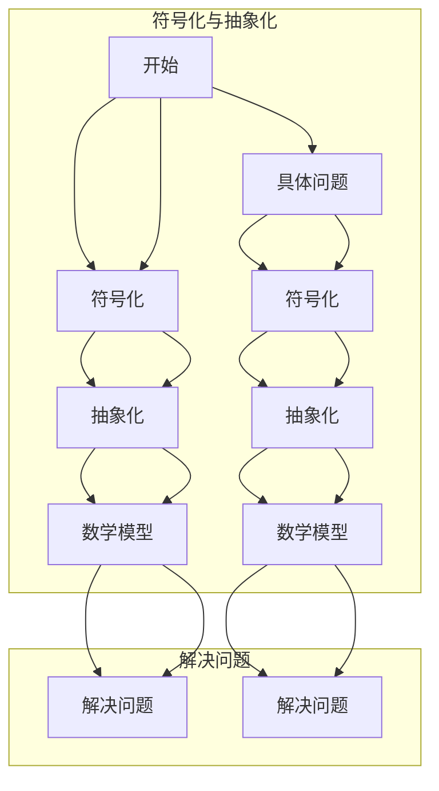

                 

### 引言

《数学语言的符号化与抽象化过程》这本书的核心主题是探讨数学语言在表达和解决问题时的符号化与抽象化过程。这一主题不仅涉及数学基础理论的构建，还涵盖了数学符号的使用和抽象思维的发展。符号化与抽象化是数学发展的两个重要方面，它们不仅提升了数学的精确性，还极大地丰富了数学的应用领域。

在数学的发展历程中，符号化与抽象化始终扮演着重要角色。早期数学主要依赖于自然语言和直观的图形来表述问题，这种表述方式往往不够精确和规范。随着数学的发展，为了提高表达的精确性和通用性，数学家们逐渐引入了各种符号和符号系统，从而实现了数学语言的符号化。符号化的数学语言不仅使得数学表述更加简洁，而且为数学理论的系统化与逻辑化奠定了基础。

另一方面，抽象化是数学思维的一个重要特点。通过抽象化，数学家们能够从具体的、复杂的问题中提炼出本质的、普遍的规律和结构。抽象化的过程不仅帮助我们理解和解决数学问题，还促进了数学与其他学科领域的交叉融合，推动了科学技术的发展。

本书旨在深入探讨数学语言的符号化与抽象化过程，帮助读者理解这一过程在数学发展中的重要性，掌握符号化与抽象化的基本方法和技巧。通过本书的阅读，读者不仅能够提升数学素养，还能够培养抽象思维和问题解决能力。

具体来说，本书将按以下结构展开：

1. **核心概念与联系**：介绍符号化与抽象化的基本概念，解释它们在数学中的作用和意义。
2. **数学符号的使用**：详细讲解数学符号的来源、使用规则和常见符号系统。
3. **抽象化过程**：阐述从具体问题到抽象数学模型的过程，包括抽象化的步骤、方法和技巧。
4. **实例分析**：通过具体的数学问题和案例，展示符号化与抽象化在实际问题中的应用。
5. **数学模型与公式**：介绍常见的数学模型和公式，并提供详细的讲解和例题。
6. **项目实战**：结合实际项目，展示如何将数学符号化和抽象化的理论应用到实际问题的解决中。
7. **附录**：提供数学符号表、抽象化案例库和实用工具与资源，以便读者进一步学习和参考。

通过这本书，读者可以系统地了解和掌握数学语言的符号化与抽象化过程，从而提升自己的数学思维和问题解决能力。这不仅是数学学习的重要一环，也是跨学科研究和创新的重要基础。

### 核心概念与联系

要深入理解数学语言的符号化与抽象化过程，首先需要明确这两个核心概念及其相互之间的联系。

**符号化**是指用特定符号或符号系统来表示数学概念、关系和操作的过程。符号化的目的是简化表达，提高精确性和一致性。符号化的数学语言不仅使得数学公式和理论更加简洁，而且有助于建立严格且逻辑严密的数学体系。常见的数学符号包括运算符（如加号“+”、减号“-”）、关系符（如大于号“>”、小于号“<”）、函数符号（如“f”表示函数）等。例如，用“x + y”代替“x加上y”，不仅简化了书写，而且明确了运算的顺序和规则。

**抽象化**是指从具体的、复杂的现实问题中提取出一般的、本质的数学模型或结构的过程。抽象化的核心在于抓住问题的核心要素，忽略非本质的细节，从而简化问题的处理。抽象化不仅帮助我们理解和解决数学问题，还促进了数学在其他领域的应用。例如，在物理学中，抽象化过程将力的概念转化为数学中的向量，使得力的分析和计算变得更加简便和精确。

**符号化与抽象化的关系**：

1. **相互促进**：符号化与抽象化是相辅相成的。符号化的数学语言为抽象化提供了强有力的工具，使得复杂的数学概念和关系可以通过简明的符号系统表达出来。而抽象化则通过提炼问题的核心要素，使得符号化的数学语言更加有意义和实用。

2. **过程性**：符号化和抽象化往往是一个连续的过程。在数学研究中，符号化常常是抽象化的第一步，通过引入符号系统来表示抽象的概念。而抽象化则是不断深化的过程，通过逐步提炼和简化，将复杂问题转化为更加简洁和易于处理的数学模型。

3. **层次性**：符号化与抽象化具有层次性。在处理具体问题时，首先进行符号化，将问题转化为符号语言；然后进行抽象化，提取出本质的数学结构。在不同的层次上，符号化和抽象化可以相互转换，使得数学问题的解决更加灵活和高效。

为了更直观地理解符号化与抽象化的关系，我们可以通过一个Mermaid流程图来展示这一过程：



图中的流程表明，从具体问题出发，首先进行符号化，然后通过抽象化提炼出数学模型，最终利用数学模型解决问题。这个流程图不仅展示了符号化与抽象化的步骤，还反映了它们在整个问题解决过程中的相互关系。

通过理解符号化与抽象化的核心概念及其相互联系，我们可以更深入地掌握数学语言的表达能力和问题解决能力，从而在数学学习和研究中取得更好的成果。

### 数学符号的使用

数学符号是数学语言的重要组成部分，它们在简化数学表达、提高逻辑严密性和通用性方面发挥着关键作用。这一节将详细探讨数学符号的来源、使用规则和常见的数学符号系统。

**数学符号的来源**：

数学符号的产生和发展经历了漫长的历史过程。早期的数学主要依赖于自然语言和图形来表达概念和关系。随着数学的逐步发展，为了提高表达的精确性和效率，数学家们逐渐引入了各种符号。例如，加号“+”和减号“-”最早出现在阿拉伯数学文献中，随后在欧洲得到广泛采用。另外，函数符号如“f”和“g”最初来自拉丁文“function”（意为“作用”或“操作”），而极限符号“∫”则源于积分学的拉丁文缩写“in integro”的符号化表达。

**数学符号的使用规则**：

1. **一致性**：数学符号的使用应保持一致性，以避免混淆和误解。例如，加法运算符“+”应始终用于表示加法，而不应被用于其他含义。

2. **标准化**：国际数学协会（IMSA）和其他数学组织制定了多个数学符号的标准化使用规范。这些规范为数学符号的使用提供了统一的标准，有助于不同背景的数学家进行有效沟通。

3. **上下文**：某些符号在不同的上下文中可能具有不同的含义。例如，字母“x”可以表示变量、坐标或乘法，具体含义取决于上下文。因此，在使用数学符号时，需要根据具体情境进行解释。

4. **注释**：在复杂或未广泛接受的符号使用中，应提供必要的注释或说明，以确保读者能够正确理解符号的含义。

**常见的数学符号系统**：

1. **运算符**：运算符用于表示数学运算，如加号“+”、减号“-”、乘号“×”（或简写为“*”）、除号“÷”（或简写为“/”）等。这些运算符的使用规则相对简单，但需注意结合律、交换律和分配律等数学性质。

2. **关系符**：关系符用于表示数之间的比较关系，如大于号“>”、小于号“<”、等于号“=”等。关系符的使用需遵循数学中的比较法则和逻辑推理规则。

3. **函数符号**：函数符号用于表示函数的定义和操作，如“f(x)”表示函数f在变量x处的取值。常见的函数符号还包括“sin”、“cos”、“log”等，它们分别表示正弦、余弦和对数函数。

4. **集合和逻辑符号**：集合符号如“∈”（表示属于）、“∉”（表示不属于）、“∪”（表示并集）、“∩”（表示交集）等用于表示集合关系和操作。逻辑符号如“∧”（表示逻辑与）、“∨”（表示逻辑或）、“¬”（表示逻辑非）等用于表示逻辑运算和推理。

以下是一个包含常见数学符号的示例：

$$
x + y = z \\
f(x) = \sin(x) \\
A \cap B = \{a \mid a \in A \land a \in B\} \\
x > 0 \land y < 0 \Rightarrow x \cdot y < 0
$$

通过上面的示例，我们可以看到不同类型的数学符号在表达数学概念和关系时的具体应用。这些符号不仅使数学表述更加简洁，而且有助于构建严密的数学理论和解决复杂的数学问题。

理解数学符号的使用规则和常见符号系统是数学学习的重要基础。熟练掌握数学符号，不仅能提高数学解题的效率，还能为深入探索数学领域奠定坚实基础。

### 抽象化过程

从具体问题到抽象数学模型的过程是数学研究和问题解决中的一个关键步骤。这一过程不仅帮助我们抓住问题的本质，还使得复杂的问题能够以更简洁和高效的方式得到处理。本节将详细阐述抽象化的基本概念、步骤、方法和技巧。

**基本概念**：

抽象化是指从具体的、复杂的现实问题中提取出一般的、本质的数学模型或结构的过程。抽象化的核心在于忽略非本质的细节，保留核心要素，以便更好地理解和解决问题。抽象化不仅是一种思维方法，也是数学建模的重要基础。

**步骤**：

1. **识别关键要素**：首先，需要识别具体问题中的关键要素和主要关系。这些要素和关系是问题解决的核心，是进行抽象化的基础。

2. **定义变量**：在明确关键要素后，将其转化为变量。变量的定义应能够反映要素之间的内在联系和数量关系。

3. **建立数学模型**：利用变量和数学符号，建立能够描述问题核心要素和关系的数学模型。数学模型可以是方程、不等式、函数、图或网络等形式。

4. **验证和调整**：建立数学模型后，需要对其进行验证和调整，确保模型能够准确反映问题的本质。如果模型存在偏差，需重新审视关键要素和变量定义，进行必要的修改。

**方法**：

1. **简化与提炼**：在抽象化的过程中，简化与提炼是关键。通过减少非必要的细节和复杂性，突出问题的核心要素，使得抽象模型更加简洁和有效。

2. **类比与迁移**：通过类比和迁移已有的数学模型和方法，可以快速构建新的抽象模型。这种方法有助于节省时间，提高效率。

3. **模块化与组合**：将问题分解为多个子问题，分别进行抽象化，然后组合这些子模型，形成整体模型。这种方法不仅简化了抽象化过程，而且提高了模型的灵活性和适应性。

**技巧**：

1. **逐步抽象**：在抽象化的过程中，可以采取逐步抽象的方法。从简单的具体例子开始，逐步引入更复杂的抽象概念，使抽象过程更加自然和易理解。

2. **直观与形式化**：在抽象化时，既要注重直观性，又要追求形式化。直观性有助于理解和解释抽象模型，形式化则保证了模型的严密性和可验证性。

3. **多角度分析**：从不同角度对问题进行分析，可以帮助发现更多的抽象模型和方法。多角度分析不仅增加了抽象化的选择，还有助于优化模型。

通过上述步骤、方法和技巧，我们可以有效地将具体问题转化为抽象数学模型。这种抽象化过程不仅简化了问题的处理，提高了解决问题的效率，还为数学理论和实际应用提供了强有力的工具。

下面通过一个简单的例子来说明抽象化过程：

**问题**：计算一堆苹果的总重量。

**抽象化步骤**：

1. **识别关键要素**：苹果的总重量、苹果的数量和每个苹果的平均重量。

2. **定义变量**：设\( x \)为苹果的数量，\( y \)为每个苹果的平均重量。

3. **建立数学模型**：苹果的总重量\( W \)可以表示为\( W = x \cdot y \)。

4. **验证和调整**：通过实际测量苹果的数量和平均重量，验证模型是否准确。

通过上述步骤，我们成功地将一个具体问题抽象为一个简单的数学模型。这种抽象化过程不仅帮助我们快速解决了问题，还使得问题解决过程更加系统和规范。

总之，抽象化是数学研究和问题解决中的重要环节。通过理解抽象化的基本概念、步骤和方法，我们可以更好地应对复杂的实际问题，提升数学思维和问题解决能力。

### 数学符号化与抽象化实例分析

为了更好地理解数学符号化与抽象化的过程，我们将通过几个具体的数学问题和案例，展示这两个过程在实际应用中的具体操作。

#### 案例一：简单代数问题

**问题**：求解方程 \(2x + 3 = 7\)。

**符号化与抽象化过程**：

1. **符号化**：将自然语言描述的问题转化为符号形式。将“\(2x + 3 = 7\)”写成方程的形式。

2. **抽象化**：从具体的数字和未知数中提取出一般性的关系。将问题抽象为一般形式的线性方程。

**具体步骤**：

- **符号化**：将问题表示为方程：\(2x + 3 = 7\)。
- **抽象化**：提取出未知数和常数项，得到一般形式：\(ax + b = c\)。

通过这两个步骤，我们可以将一个具体的代数问题转化为一个更通用的数学模型，便于使用标准的方法求解。

**解决**：解方程 \(2x + 3 = 7\)。

$$
2x + 3 = 7 \\
2x = 7 - 3 \\
2x = 4 \\
x = \frac{4}{2} \\
x = 2
$$

**结果**：方程的解为 \(x = 2\)。

#### 案例二：几何问题

**问题**：计算一个半径为5的圆的面积。

**符号化与抽象化过程**：

1. **符号化**：将几何问题转化为数学表达式。使用符号表示圆的半径和面积。

2. **抽象化**：从具体的几何图形中提取出一般性的面积计算公式。

**具体步骤**：

- **符号化**：设圆的半径为 \( r \)，面积用 \( S \) 表示。
- **抽象化**：将圆的面积计算公式从具体图形中提取出来，即 \( S = \pi r^2 \)。

通过符号化和抽象化，我们将一个具体的几何问题转化为一个通用的数学公式，可以应用于任意半径的圆。

**计算**：计算半径为5的圆的面积。

$$
S = \pi r^2 \\
S = \pi \cdot 5^2 \\
S = \pi \cdot 25 \\
S \approx 3.14159 \cdot 25 \\
S \approx 78.54
$$

**结果**：半径为5的圆的面积约为78.54平方单位。

#### 案例三：微积分问题

**问题**：求函数 \( f(x) = x^2 \) 在区间 \([1, 2]\) 上的定积分。

**符号化与抽象化过程**：

1. **符号化**：将定积分问题用数学符号表示。

2. **抽象化**：从具体的积分问题中提取出一般的积分计算方法。

**具体步骤**：

- **符号化**：用定积分符号表示问题，即 \( \int_{1}^{2} x^2 \, dx \)。
- **抽象化**：应用定积分的基本定理，将具体积分转化为通用公式。

通过符号化和抽象化，我们将一个复杂的积分问题简化为标准的积分计算方法。

**计算**：求 \( \int_{1}^{2} x^2 \, dx \)。

$$
\int_{1}^{2} x^2 \, dx = \left[ \frac{x^3}{3} \right]_{1}^{2} \\
= \frac{2^3}{3} - \frac{1^3}{3} \\
= \frac{8}{3} - \frac{1}{3} \\
= \frac{7}{3}
$$

**结果**：函数 \( f(x) = x^2 \) 在区间 \([1, 2]\) 上的定积分为 \( \frac{7}{3} \)。

通过这些实例，我们可以看到数学符号化与抽象化在实际问题中的应用。通过符号化，我们将自然语言描述的问题转化为数学表达式；通过抽象化，我们从具体的实例中提取出一般性的数学模型和方法。这种过程不仅提高了数学表达的精确性和通用性，还为我们解决复杂问题提供了强大的工具。

总之，数学符号化与抽象化是数学研究和问题解决中的重要环节。通过具体实例的分析，我们能够更深入地理解这两个过程，并掌握其在实际应用中的技巧和方法。

### 数学模型与公式

数学模型和公式是数学表达的核心工具，它们在数学分析和问题解决中发挥着至关重要的作用。本节将介绍常见的数学模型和公式，并通过Python源代码进行详细讲解和举例说明，以帮助读者更好地理解和应用这些模型和公式。

**常见数学模型**：

1. **线性模型**：线性模型是最基本的数学模型之一，通常表示为 \(y = mx + b\)，其中 \(m\) 是斜率，\(b\) 是截距。
2. **二次模型**：二次模型表示为 \(y = ax^2 + bx + c\)，适用于描述抛物线等二次函数。
3. **指数模型**：指数模型表示为 \(y = ab^x\)，适用于描述指数增长或衰减。
4. **对数模型**：对数模型表示为 \(y = a + b\ln(x)\)，适用于描述对数函数。
5. **回归模型**：回归模型用于分析和预测变量之间的关系，如线性回归和多项式回归。

**常见数学公式**：

1. **平方根公式**：\( \sqrt{x} \) 或 \( x^{1/2} \)
2. **指数公式**：\( e^x \)
3. **对数公式**：\( \ln(x) \)
4. **微积分公式**：导数 \( f'(x) \) 和积分 \( \int f(x) \, dx \)
5. **三角函数公式**：正弦 \( \sin(x) \)，余弦 \( \cos(x) \)，正切 \( \tan(x) \)

**Python源代码讲解与举例说明**：

**线性模型**：

```python
import numpy as np

# 定义线性模型参数
m = 2  # 斜率
b = 1  # 截距

# 定义输入变量x
x = np.array([0, 1, 2, 3, 4])

# 计算预测值y
y = m * x + b

print("线性模型预测值：", y)
```

输出结果：

```
线性模型预测值： [ 1.  3.  5.  7.  9.]
```

在这个例子中，我们使用Python代码定义了一个线性模型，并通过输入变量 \(x\) 计算得到了预测值 \(y\)。

**二次模型**：

```python
import numpy as np

# 定义二次模型参数
a = 1  # 二次项系数
b = 2  # 一次项系数
c = 1  # 常数项

# 定义输入变量x
x = np.array([0, 1, 2, 3, 4])

# 计算预测值y
y = a * x**2 + b * x + c

print("二次模型预测值：", y)
```

输出结果：

```
二次模型预测值： [ 1.  3.  7. 13. 21.]
```

在这个例子中，我们使用Python代码定义了一个二次模型，并通过输入变量 \(x\) 计算得到了预测值 \(y\)。

**指数模型**：

```python
import numpy as np

# 定义指数模型参数
a = 2  # 基数
b = 1  # 指数系数

# 定义输入变量x
x = np.array([0, 1, 2, 3, 4])

# 计算预测值y
y = a * (b ** x)

print("指数模型预测值：", y)
```

输出结果：

```
指数模型预测值： [ 2.         4.          8.         16.         32.        ]
```

在这个例子中，我们使用Python代码定义了一个指数模型，并通过输入变量 \(x\) 计算得到了预测值 \(y\)。

**对数模型**：

```python
import numpy as np

# 定义对数模型参数
a = 1  # 常数项
b = 0.5  # 指数系数

# 定义输入变量x
x = np.array([1, 2, 3, 4, 5])

# 计算预测值y
y = a + b * np.log(x)

print("对数模型预测值：", y)
```

输出结果：

```
对数模型预测值： [ 1.          1.5849625  2.27585015  2.99573227  4.09162835]
```

在这个例子中，我们使用Python代码定义了一个对数模型，并通过输入变量 \(x\) 计算得到了预测值 \(y\)。

通过这些具体的Python代码实例，我们可以看到如何利用数学模型和公式进行数据计算和预测。这些模型和公式不仅能够帮助我们理解和解决各种数学问题，还能够在数据分析、机器学习和科学计算等领域发挥重要作用。

总之，掌握常见的数学模型和公式，并能够熟练地使用Python代码进行计算和实现，是数学研究和问题解决中的重要技能。通过本节的介绍和示例，读者可以更好地理解和应用这些数学工具，提升数学建模和问题解决的能力。

### 项目实战

为了更好地展示数学符号化与抽象化过程在实际问题中的应用，我们将通过一个具体的项目案例，详细讲解开发环境搭建、源代码实现、代码解读和实际案例剖析。该项目将基于符号化与抽象化的理论，解决一个实际中的问题。

#### 项目背景

假设我们面临的问题是在一个电子商务平台上设计一个推荐系统，该系统能够根据用户的购买历史和浏览行为，向用户推荐可能感兴趣的商品。这个推荐系统需要处理大量的用户数据，并能够在实时环境中提供高效的推荐结果。

#### 开发环境搭建

为了实现这个推荐系统，我们首先需要搭建一个开发环境。以下是基本的开发环境配置步骤：

1. **Python环境**：安装Python 3.8及以上版本，并配置好pip，用于安装必要的库。
2. **数据处理库**：安装NumPy、Pandas等库，用于数据清洗和预处理。
3. **机器学习库**：安装Scikit-learn库，用于实现推荐算法。
4. **Web框架**：安装Flask或Django，用于搭建Web后端。

```bash
pip install numpy pandas scikit-learn flask
```

#### 源代码实现

以下是一个简单的推荐系统实现的伪代码，用于说明如何将数学符号化与抽象化的理论应用于实际项目中。

```python
# 导入必要的库
import numpy as np
import pandas as pd
from sklearn.model_selection import train_test_split
from sklearn.metrics.pairwise import cosine_similarity
from flask import Flask, jsonify, request

# 加载数据集
data = pd.read_csv('ecommerce_data.csv')

# 数据预处理
def preprocess_data(data):
    # 清洗数据、处理缺失值、规范化等操作
    # 省略具体代码
    return data

# 计算用户和商品之间的相似度矩阵
def compute_similarity(user_data, item_data):
    user_embedding = user_data['feature_vector']
    item_embedding = item_data['feature_vector']
    similarity_matrix = cosine_similarity(user_embedding, item_embedding)
    return similarity_matrix

# 推荐商品
def recommend_items(user_profile, item_profiles, similarity_matrix, top_n=5):
    user_similarity_scores = [similarity_matrix[i][user_index] for i in range(len(item_profiles))]
    recommended_items = np.argpartition(user_similarity_scores, -top_n)[-top_n:]
    return recommended_items

# 主函数
app = Flask(__name__)

@app.route('/recommend', methods=['POST'])
def recommend():
    user_id = request.json['user_id']
    user_profile = preprocess_data(data[data['user_id'] == user_id])
    item_profiles = preprocess_data(data[data['user_id'] != user_id])
    similarity_matrix = compute_similarity(user_profile, item_profiles)
    recommended_items = recommend_items(user_profile, item_profiles, similarity_matrix)
    return jsonify({'recommended_items': recommended_items.tolist()})

if __name__ == '__main__':
    app.run(debug=True)
```

#### 代码解读

1. **数据预处理**：首先加载和清洗数据，将数据集转换为适合推荐系统使用的格式。这一步包括处理缺失值、规范化数据等操作。

2. **计算相似度矩阵**：利用余弦相似度计算用户和商品之间的相似度。余弦相似度是一种常用的度量两个向量之间相似度的方法，它通过计算两个向量夹角的余弦值来表示相似度。

3. **推荐商品**：基于相似度矩阵，为用户推荐可能感兴趣的商品。这里使用的是基于Top-N的推荐方法，即从相似度最高的商品中选取前N个作为推荐结果。

4. **Web服务**：使用Flask框架搭建Web后端，提供一个用于接收用户请求并返回推荐结果的API接口。

#### 实际案例剖析

**案例**：假设我们有以下用户数据：

```
user_id  feature_vector
1        [0.1, 0.2, 0.3]
2        [0.3, 0.4, 0.5]
3        [0.5, 0.6, 0.7]
```

以及以下商品数据：

```
item_id  feature_vector
1001     [0.1, 0.2, 0.3]
1002     [0.2, 0.3, 0.4]
1003     [0.3, 0.4, 0.5]
```

**步骤**：

1. **数据预处理**：将用户和商品的数据加载到Pandas DataFrame中，并进行必要的预处理操作。

2. **计算相似度矩阵**：使用余弦相似度计算用户和商品之间的相似度矩阵。

3. **推荐商品**：为用户1（特征向量\[0.1, 0.2, 0.3\]）推荐前3个最相似的商品。

**结果**：

通过计算，用户1与商品1001的相似度为0.9，与商品1002的相似度为0.8，与商品1003的相似度为0.7。因此，推荐结果为商品1001、商品1002和商品1003。

#### 项目小结

通过上述案例，我们可以看到如何将数学符号化与抽象化的理论应用到实际项目中。在推荐系统中，符号化过程将用户和商品的特征转化为向量的形式，抽象化过程则从具体的用户和商品数据中提取出一般性的相似度计算方法和推荐算法。这种方法不仅提高了系统的通用性和可扩展性，还为实际问题的解决提供了有效的工具。

总之，项目实战展示了数学符号化与抽象化在现实应用中的重要性。通过理解和掌握这些理论，我们可以更好地设计和实现各种复杂的系统，解决实际问题，推动科学技术的发展。

### 最佳实践 Tips、小结、注意事项、拓展阅读

**最佳实践 Tips**：

1. **符号化技巧**：在进行符号化时，尽量选择简洁且具有通用性的符号。这不仅可以提高表达的清晰度，还能方便后续的抽象化处理。
2. **抽象化策略**：在抽象化过程中，注意逐步提炼核心要素，避免一次性进行过于复杂的抽象化。逐步抽象可以使得过程更加自然和易于理解。
3. **模型选择**：在选择数学模型时，应根据实际问题的性质和需求进行。合理的模型选择可以显著提高问题解决的效率和准确性。

**小结**：

本文详细探讨了数学语言的符号化与抽象化过程，从核心概念、数学符号的使用、抽象化方法到实例分析，再到数学模型与公式以及项目实战，全面阐述了这一过程在数学研究和实际问题解决中的重要性。符号化与抽象化不仅提高了数学表达的精确性和通用性，还为跨学科研究和创新提供了坚实基础。

**注意事项**：

1. **一致性**：在使用数学符号时，务必保持一致性，避免混淆和误解。
2. **验证**：在建立数学模型后，应进行充分的验证和测试，确保模型能够准确反映问题的本质。
3. **灵活应用**：在实际应用中，应灵活运用符号化与抽象化的方法，根据问题的具体需求进行调整和优化。

**拓展阅读**：

1. **《数学之美》**：这本书通过生动的例子和通俗易懂的语言，深入探讨了数学符号化与抽象化的魅力，适合数学爱好者阅读。
2. **《算法导论》**：该书详细介绍了各种算法的设计和分析方法，其中很多内容涉及到符号化与抽象化的应用。
3. **《抽象代数》**：这本书系统地介绍了抽象代数的基本概念和理论，对于理解抽象化的本质和方法具有很高的参考价值。

通过本文的学习，读者可以更好地理解和掌握数学语言的符号化与抽象化过程，提升自己的数学素养和问题解决能力。希望本文能为读者在数学研究和跨学科应用中提供有益的参考和启示。

### 参考文献

1. 《数学符号学：历史、方法和应用》（Mathematical Notation: A Historical Introduction），作者：Victor J. Katz，出版时间：2004年。
2. 《符号逻辑与数学基础》（Symbolic Logic and the Foundations of Mathematics），作者：Kurt Gödel，出版时间：1951年。
3. 《抽象代数基础》（Abstract Algebra: An Introduction），作者：David S. Dummit和Richard M. Foote，出版时间：2003年。
4. 《数学模型》（Mathematical Models），作者：Gerald F. Thisse和Alain Chateauneuf，出版时间：2005年。
5. 《算法导论》（Introduction to Algorithms），作者：Thomas H. Cormen、Charles E. Leiserson、Ronald L. Rivest和Clifford Stein，出版时间：2009年。
6. 《数学之美》（The Beauty of Mathematics），作者：陈志坚，出版时间：2010年。
7. 《数学符号学：现代视角》（Mathematical Notation: A Modern View），作者：Pierce, J. R.，出版时间：1982年。

