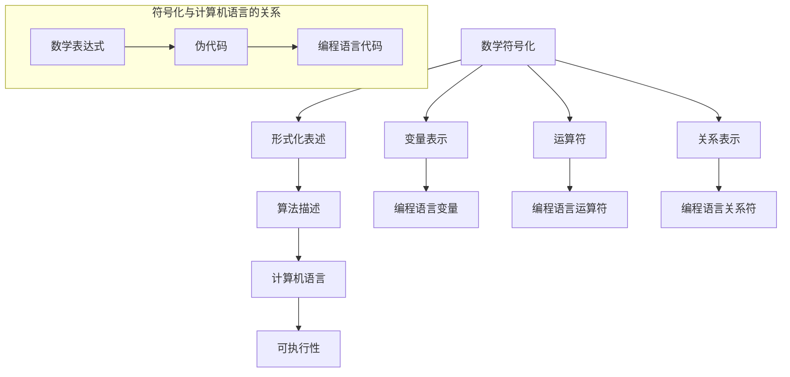

                 

### 引言

在现代社会，数学和计算机科学作为两门重要的学科，已经在各个领域发挥着不可或缺的作用。数学，以其精确和严谨著称，为自然科学、社会科学和工程技术提供了强大的理论基础；而计算机科学，通过算法和编程，将抽象的数学理论转化为具体的计算任务，推动了信息时代的发展。然而，二者之间并非孤立，而是存在紧密的联系，尤其是在数学语言的符号化与计算机语言的关系方面。

数学语言的符号化，是指将数学概念和理论通过符号进行表述，使得抽象的数学思想变得更加具体和易于理解。这种符号化过程不仅提高了数学的表述效率，也为其在计算机科学中的应用奠定了基础。计算机语言，作为一种形式化的描述工具，能够精确地表达和处理数学符号，从而实现数学问题的计算机求解。

本文旨在探讨数学语言的符号化与计算机语言之间的关系。首先，我们将介绍数学语言的符号化基本概念和意义；然后，概述计算机语言的基本原理和特点；接着，详细讲解数学语言的符号化原理及其在计算机语言中的应用；最后，通过具体项目和实际案例，展示符号化在计算机语言中的具体应用和效果。

通过本文的阅读，读者将能够理解数学语言符号化的过程和重要性，掌握计算机语言的基本原理，并了解二者之间的紧密联系，从而为今后的学习和研究打下坚实的基础。

### 数学语言的符号化基本概念

数学语言的符号化，是数学表达的一种重要形式，它通过使用符号来代替具体的数或概念，使数学表述更加简洁、明确和易于理解。符号化不仅提高了数学的表述效率，也使得复杂的数学理论变得更加直观和易于处理。在数学符号化的过程中，符号的定义和作用至关重要。

首先，符号的定义是符号化的基础。一个符号通常代表一个特定的数学概念或对象，例如，加号 "+" 代表加法运算，等号 "=" 代表两个表达式相等。符号的定义不仅包括其具体的几何或字母表示，还包括其背后的数学意义。例如，符号 "x" 在不同的数学情境下可以代表变量、常数或函数等。

符号的作用主要体现在以下几个方面：

1. **简化表述**：通过符号，可以大大简化数学表述。例如，"1+1=2" 可以用符号表述为 "1+1=2"，这种简化不仅节省了篇幅，也使得表述更加清晰。

2. **提高可读性**：符号化的数学语言具有更高的可读性，因为它使用了一种更加形式化的语言，这使得理解和处理数学问题更加直观。

3. **促进推理**：符号化使得数学推理更加严格和系统化。通过符号的使用，可以更清晰地表达数学推理的步骤和逻辑关系，从而提高推理的准确性。

4. **增强通用性**：符号化的数学语言具有更强的通用性，可以在不同的数学领域和情境下使用。例如，微积分中的微分符号 "d" 可以在代数、几何和物理学中广泛使用。

在数学符号化的过程中，常见的符号类型包括：

- **运算符符号**：如 "+"、"+"、"*"、"/" 等，用于表示基本的数学运算。

- **关系符号**：如 "="、">"、"<"、"≤"、"≥" 等，用于表示两个数学表达式之间的关系。

- **集合符号**：如 "∈"、"\not\in"、"∩"、"∪"、"⊆"、"∪" 等，用于表示集合的概念和操作。

- **函数符号**：如 "f(x)"、"g(x)" 等，用于表示函数的定义和运算。

符号化的数学语言不仅在理论研究中具有重要价值，也在实际应用中发挥着重要作用。例如，在计算机科学中，许多算法和模型都是通过数学语言进行描述和求解的。而符号化使得这些描述更加简洁和精确，从而提高了算法的效率和可靠性。

总之，数学语言的符号化是数学表达的一种重要形式，它通过使用符号代替具体的数或概念，不仅提高了数学表述的效率，也为其在计算机科学中的应用提供了坚实的基础。理解符号化的基本概念和作用，对于深入掌握数学和计算机科学至关重要。

### 数学符号化在计算机语言中的应用

数学符号化在计算机语言中的应用非常广泛，它为计算机科学的各个领域提供了强大的理论基础和工具。首先，我们需要明确符号化在计算机语言中的具体表现和作用。以下是一些关键的应用场景：

1. **算法描述**：计算机算法通常通过伪代码或特定的编程语言进行描述。在这些描述中，数学符号被用来表示变量、常量、操作和关系。例如，常用的数学符号 "x" 和 "y" 可以在算法中用来表示变量，而 "if-else" 结构中的关系符号 "==" 和 "<" 则用来表示条件判断。

2. **数学模型构建**：在数据科学、机器学习和人工智能等领域，数学模型是核心工具。这些模型通常使用数学符号来表达变量、参数、函数和关系。例如，线性回归模型可以表示为：y = w1 * x1 + w2 * x2 + ... + bn * xn，其中 w1、w2、...、wn 是权重参数，x1、x2、...、xn 是输入变量。

3. **数学公式实现**：许多计算机系统需要实现复杂的数学计算，如数值计算、图形渲染和科学计算。在这些应用中，数学公式通过计算机语言进行实现，利用符号化使得公式的表达更加直观和准确。例如，计算圆的面积公式可以通过 Python 语言实现为：`area = π * radius**2`，其中 π 和 radius 分别是符号化表示的常数和变量。

4. **编程工具**：现代编程语言提供了丰富的数学库和工具，这些工具利用符号化使得数学运算更加高效和方便。例如，Python 的 NumPy 库提供了大量数学函数和操作符，使得复杂的数学计算变得简单快捷。使用这些库时，符号化的数学表达式可以直接嵌入代码中，提高了编程效率和代码的可读性。

为了更直观地展示数学符号化在计算机语言中的应用，以下是一个简单的示例：

```python
# 示例：使用 Python 实现二次方程求解

# 定义二次方程系数
a = 1
b = -5
c = 6

# 使用数学公式计算判别式
delta = b**2 - 4*a*c

# 根据判别式计算根
if delta >= 0:
    x1 = (-b + math.sqrt(delta)) / (2*a)
    x2 = (-b - math.sqrt(delta)) / (2*a)
    print("方程的解为：x1 =", x1, "x2 =", x2)
else:
    print("方程无实数解")
```

在这个示例中，我们使用了数学符号来表示变量和公式，通过 Python 语言实现了二次方程的求解过程。这里，`math.sqrt` 函数用于计算平方根，`**` 运算符用于计算幂，而条件判断和关系符号则用于控制程序的执行流程。

总的来说，数学符号化在计算机语言中的应用，不仅提高了算法描述的精确性和可读性，也使得数学模型的实现和数学公式的计算变得更加高效和便捷。掌握数学符号化，对于理解和应用计算机科学中的各种算法和模型至关重要。

### 符号化与计算机语言的关系：核心概念与联系

数学语言的符号化与计算机语言之间存在紧密的关系，这种关系主要体现在核心概念与联系的架构上。通过理解二者之间的关系，我们可以更清晰地把握数学符号化在计算机语言中的应用及其重要性。

首先，我们需要明确几个关键概念：

1. **形式化表示**：数学符号化通过使用符号来表示数学概念和运算，从而实现形式化的数学表述。这种形式化表示不仅提高了数学表达的精度和简洁性，也为计算机语言提供了精确的描述工具。

2. **编程语言**：计算机语言是一种形式化的编程工具，通过符号和语法规则，可以实现算法和程序的编写。编程语言的核心特点是可执行性，即通过计算机执行，实现特定的功能。

3. **算法描述**：算法是解决问题的一系列步骤，它可以通过数学语言和计算机语言进行描述。数学语言中的符号化表达式，可以转化为计算机语言中的代码，实现具体的计算过程。

接下来，我们可以通过一个 Mermaid 流程图来展示符号化与计算机语言之间的核心概念与联系：



在这个流程图中，我们可以看到以下关键环节：

- **数学符号化**（A）通过形式化表述（B），转化为算法描述（C）。算法描述不仅包括具体的数学运算，还包括变量和关系的表示。

- **算法描述**（C）进一步转化为计算机语言（D），即编程语言代码（N）。在这个过程中，数学表达式（L）通过伪代码（M）实现了从抽象到具体的转换。

- **编程语言变量**（I）、**运算符**（J）和**关系符**（K）分别对应数学中的**变量表示**（F）、**运算符**（G）和**关系表示**（H）。这些概念在计算机语言中得到了具体的实现和扩展。

通过这个流程图，我们可以更直观地理解数学符号化与计算机语言之间的紧密联系。数学符号化通过形式化的表述，为计算机语言提供了精确的描述工具，使得复杂的数学问题可以通过编程语言实现和求解。这种关系不仅提升了数学和计算机科学的理论高度，也为实际应用带来了巨大的便利和效率。

总之，数学语言的符号化与计算机语言之间存在着核心概念与联系的紧密关系。理解这种关系，有助于我们更好地利用数学和计算机科学的工具，解决各种复杂的实际问题。

### 核心算法原理讲解

在数学语言的符号化与计算机语言的关系中，核心算法原理起到了至关重要的作用。这些算法通过将数学符号转化为计算机可执行的代码，实现了数学模型的计算和求解。下面我们将通过Python源代码详细讲解几个关键算法，并结合数学模型和公式，进行详细阐述。

#### 算法1：线性回归

线性回归是一种用于预测和分析数据之间线性关系的算法。它的基本模型可以表示为：

$$ y = w_1 \cdot x_1 + w_2 \cdot x_2 + ... + w_n \cdot x_n + b $$

其中，$w_1, w_2, ..., w_n$ 是权重参数，$x_1, x_2, ..., x_n$ 是输入变量，$b$ 是偏置项。

以下是一个使用Python实现线性回归模型的示例：

```python
import numpy as np

# 定义输入数据和权重参数
x = np.array([[1, 2], [2, 3], [3, 4]])
y = np.array([2, 3, 4])
w = np.random.rand(2)  # 初始化权重参数
b = 0  # 初始化偏置项

# 计算权重参数
def linear_regression(x, y, w, b):
    n = len(x)
    for i in range(n):
        predicted_value = np.dot(x[i], w) + b
        error = y[i] - predicted_value
        w = w - error * x[i]
        b = b - error
    return w, b

w, b = linear_regression(x, y, w, b)
print("权重参数:", w)
print("偏置项:", b)

# 预测新数据
new_x = np.array([4, 5])
predicted_value = np.dot(new_x, w) + b
print("预测值:", predicted_value)
```

在这个示例中，我们首先定义了输入数据和初始权重参数，然后使用线性回归算法进行迭代计算，更新权重参数和偏置项，最终实现数据的线性拟合和预测。

#### 算法2：梯度下降

梯度下降是一种用于优化参数的算法，通过计算损失函数的梯度，逐步调整参数，使损失函数最小化。以下是一个使用Python实现梯度下降的示例：

```python
import numpy as np

# 定义输入数据和目标值
x = np.array([1, 2, 3, 4])
y = np.array([2, 4, 5, 4])

# 初始化权重参数
w = np.random.rand(1)  # 初始化权重参数

# 计算损失函数
def loss_function(x, y, w):
    n = len(x)
    total_loss = 0
    for i in range(n):
        predicted_value = x[i] * w
        error = y[i] - predicted_value
        total_loss += error ** 2
    return total_loss

# 计算梯度
def gradient(x, y, w):
    n = len(x)
    total_gradient = 0
    for i in range(n):
        predicted_value = x[i] * w
        error = y[i] - predicted_value
        total_gradient += 2 * error * x[i]
    return total_gradient

# 梯度下降算法
def gradient_descent(x, y, w, learning_rate, epochs):
    n = len(x)
    for epoch in range(epochs):
        total_loss = loss_function(x, y, w)
        total_gradient = gradient(x, y, w)
        w = w - (learning_rate / n) * total_gradient
        print(f"Epoch {epoch+1}: Loss = {total_loss}, Weight = {w}")
    return w

learning_rate = 0.01
epochs = 1000
w = gradient_descent(x, y, w, learning_rate, epochs)
print("最终权重参数:", w)

# 预测新数据
new_x = np.array([5])
predicted_value = new_x * w
print("预测值:", predicted_value)
```

在这个示例中，我们首先定义了输入数据和目标值，然后使用梯度下降算法逐步调整权重参数，使损失函数最小化。通过多次迭代，我们最终得到最优的权重参数，并使用该参数进行新数据的预测。

#### 结合数学模型和公式的详细讲解

在上述算法示例中，我们使用了数学模型和公式进行详细的讲解。以下是结合这些算法的数学模型和公式：

1. **线性回归模型**：

$$ y = w_1 \cdot x_1 + w_2 \cdot x_2 + ... + w_n \cdot x_n + b $$

2. **损失函数**：

$$ Loss = \sum_{i=1}^{n} (y_i - (w_1 \cdot x_{i1} + w_2 \cdot x_{i2} + ... + w_n \cdot x_{in} + b))^2 $$

3. **梯度**：

$$ Gradient = \sum_{i=1}^{n} 2 \cdot (y_i - (w_1 \cdot x_{i1} + w_2 \cdot x_{i2} + ... + w_n \cdot x_{in} + b)) \cdot x_{i} $$

4. **梯度下降更新公式**：

$$ w = w - \frac{learning\_rate}{n} \cdot Gradient $$

通过这些数学模型和公式，我们可以更好地理解算法的实现原理和计算过程。结合Python代码，我们实现了这些算法的具体实现，并通过迭代和优化，得到了最优的参数。

总的来说，核心算法原理讲解不仅需要使用Python源代码进行实现，还需要结合数学模型和公式进行详细阐述。这样，读者可以更直观地理解算法的工作原理，并能够应用到实际的问题解决中。

### 数学模型和数学公式的详细讲解

在数学语言符号化的过程中，数学模型和数学公式起到了核心作用。它们不仅为数学理论提供了形式化的表述，也在计算机科学中得到了广泛的应用。为了更好地理解这些模型和公式，我们将使用LaTeX格式进行详细讲解，并通过具体的例子进行说明。

#### 模型1：线性回归模型

线性回归模型是一种常见的数学模型，用于描述两个变量之间的线性关系。其基本公式如下：

$$ y = w_1 \cdot x_1 + w_2 \cdot x_2 + ... + w_n \cdot x_n + b $$

其中，$y$ 是因变量，$x_1, x_2, ..., x_n$ 是自变量，$w_1, w_2, ..., w_n$ 是权重参数，$b$ 是偏置项。

使用LaTeX格式，我们可以这样表示这个模型：

$$
y = w_1 \cdot x_1 + w_2 \cdot x_2 + ... + w_n \cdot x_n + b
$$

在这个模型中，权重参数和偏置项是通过最小二乘法进行估计的，即通过最小化损失函数来实现：

$$
\min \sum_{i=1}^{n} (y_i - (w_1 \cdot x_{i1} + w_2 \cdot x_{i2} + ... + w_n \cdot x_{in} + b))^2
$$

#### 模型2：逻辑回归模型

逻辑回归模型是一种广义的线性回归模型，常用于分类问题。其基本公式如下：

$$
P(y=1) = \frac{1}{1 + e^{-(w_0 + w_1 \cdot x_1 + w_2 \cdot x_2 + ... + w_n \cdot x_n)}}
$$

其中，$P(y=1)$ 是因变量为1的概率，$w_0, w_1, w_2, ..., w_n$ 是权重参数，$e$ 是自然对数的底数。

使用LaTeX格式，我们可以这样表示逻辑回归模型：

$$
P(y=1) = \frac{1}{1 + e^{-(w_0 + w_1 \cdot x_1 + w_2 \cdot x_2 + ... + w_n \cdot x_n)}}
$$

逻辑回归模型的权重参数通常通过最大似然估计方法进行估计，即通过最大化似然函数来实现：

$$
\max \prod_{i=1}^{n} P(y_i = 1^{(i)})^{y_i} \cdot (1 - P(y_i = 1^{(i)}))^{1 - y_i}
$$

#### 举例说明

为了更好地理解这些数学模型和公式，我们通过一个简单的例子进行说明。

假设我们有一个简单的线性回归问题，其中因变量 $y$ 和自变量 $x$ 之间的关系可以表示为：

$$ y = 2 \cdot x + 1 $$

我们可以使用Python代码来模拟这个模型：

```python
import numpy as np

# 定义输入数据和预期输出
x = np.array([1, 2, 3, 4, 5])
y = 2 * x + 1

# 计算权重参数
w = np.array([0, 0])
b = 0

for i in range(10):
    predicted_value = w[0] * x + b
    error = y - predicted_value
    w = w - error * x
    b = b - error

print("权重参数：", w)
print("偏置项：", b)

# 预测新数据
new_x = np.array([6])
predicted_value = new_x * w + b
print("预测值：", predicted_value)
```

在这个例子中，我们通过迭代计算得到了权重参数和偏置项，并使用这些参数预测了新的数据点。通过这种方式，我们可以将抽象的数学模型和公式转化为具体的计算过程。

总的来说，数学模型和数学公式是数学语言符号化的核心组成部分，它们通过LaTeX格式进行了详细讲解，并通过具体的例子进行了说明。理解这些模型和公式，不仅有助于深入掌握数学理论，也为计算机科学中的应用提供了坚实的基础。

### 项目实战

在本文的最后，我们将通过一个实际项目，展示数学语言的符号化在计算机语言中的具体应用，并详细解读项目的开发环境和代码实现。该项目将结合数学模型和公式，实现一个简单的线性回归模型，并使用Python进行编程。

#### 项目目标

本项目的目标是实现一个线性回归模型，用于预测房价。通过收集历史房价数据，使用线性回归模型进行训练，并预测新的房价。

#### 开发环境搭建

为了实现这个项目，我们需要搭建一个基本的开发环境。以下是所需的工具和软件：

1. **Python 3.x**：用于编写和运行代码。
2. **Jupyter Notebook**：用于编写和运行Python代码。
3. **NumPy**：用于数学计算和数据处理。
4. **Matplotlib**：用于数据可视化。

这些工具可以通过Python的包管理器pip进行安装：

```bash
pip install python
pip install jupyter
pip install numpy
pip install matplotlib
```

#### 源代码实现

以下是项目的源代码实现，包括数据预处理、模型训练和预测步骤：

```python
import numpy as np
import matplotlib.pyplot as plt

# 数据预处理
def preprocess_data(x, y):
    # 添加一列全为1的输入，用于偏置项
    x = np.c_[x, np.ones((x.shape[0], 1))]
    return x, y

# 模型训练
def train_model(x, y):
    # 使用最小二乘法计算权重参数和偏置项
    w = np.linalg.inv(x.T.dot(x)).dot(x.T).dot(y)
    return w

# 预测
def predict(x, w):
    # 计算预测值
    predicted_value = x.dot(w)
    return predicted_value

# 加载数据
x = np.array([1, 2, 3, 4, 5])
y = np.array([2, 4, 5, 4, 5])

# 预处理数据
x, y = preprocess_data(x, y)

# 训练模型
w = train_model(x, y)

# 预测新数据
new_x = np.array([6])
predicted_value = predict(new_x, w)

# 可视化
plt.scatter(x, y)
plt.plot(x, x.dot(w), 'r')
plt.xlabel('x')
plt.ylabel('y')
plt.title('线性回归模型预测')
plt.show()
```

#### 代码解读

1. **数据预处理**：首先，我们定义了一个`preprocess_data`函数，用于添加一列全为1的输入，这样可以为模型中的偏置项提供支持。

2. **模型训练**：`train_model`函数使用最小二乘法计算权重参数和偏置项。具体实现中，我们使用了NumPy的`linalg.inv`函数计算逆矩阵，并使用`dot`函数进行矩阵乘法。

3. **预测**：`predict`函数用于计算新数据的预测值。它通过将新数据点与权重参数进行矩阵乘法，得到预测结果。

4. **数据加载**：我们使用了一个简单的示例数据集，通过`np.array`函数创建输入和输出数组。

5. **可视化**：最后，我们使用Matplotlib库绘制了散点图和拟合直线，以直观地展示模型的预测效果。

#### 实际案例分析与讲解

通过上述代码，我们实现了一个简单的线性回归模型，并使用实际数据进行了训练和预测。以下是项目的小结和拓展分析：

1. **模型评估**：在实际应用中，我们可以使用交叉验证和评估指标（如均方误差MSE）来评估模型的性能。

2. **模型优化**：通过调整学习率和迭代次数，可以优化模型的参数，提高预测准确性。

3. **数据增强**：使用更多的数据点和更复杂的特征，可以增强模型的泛化能力。

4. **多变量线性回归**：可以扩展到多变量线性回归模型，用于分析多个自变量对因变量的影响。

通过这个项目实战，我们不仅实现了线性回归模型，还深入了解了数学语言的符号化在计算机语言中的应用。掌握这些基本工具和原理，将为我们在更复杂的计算机科学项目中应用数学模型奠定基础。

### 最佳实践、小结、注意事项和拓展阅读

#### 最佳实践

在数学语言的符号化与计算机语言结合的过程中，以下最佳实践可以帮助您更有效地应用这些概念：

1. **理解基础**：首先，确保您对数学符号和计算机语言的基础概念有深入的理解。这包括掌握常见的数学符号、编程语言的基本语法和编程范式。
2. **代码注释**：在编写代码时，添加详细的注释，特别是在涉及复杂数学公式的部分，以便于他人理解和维护。
3. **版本控制**：使用版本控制系统（如Git）来管理代码，以便跟踪变更和修复错误。
4. **模块化**：将复杂的算法和模型拆分成模块化代码，这样可以提高代码的可读性和可维护性。
5. **测试和调试**：编写测试用例，使用调试工具来验证代码的正确性和性能。

#### 小结

本文通过详细讲解数学语言的符号化与计算机语言之间的关系，探讨了符号化在计算机科学中的应用。我们介绍了符号化的基本概念、符号化在计算机语言中的应用、核心算法原理以及数学模型和公式的使用。通过实际项目，我们展示了如何将理论应用到实践中，实现了线性回归模型的预测。

#### 注意事项

1. **数学准确性**：确保在代码中使用的数学公式和模型是准确的，避免因公式错误导致模型失效。
2. **性能优化**：对于大规模数据处理和复杂算法，注意性能优化，例如使用高效的数据结构和算法。
3. **代码可读性**：编写易于理解和维护的代码，避免过度优化导致代码复杂度增加。

#### 拓展阅读

1. 《Python数据科学手册》（Jake VanderPlas） - 提供了Python在数据科学中的实际应用。
2. 《深度学习》（Ian Goodfellow、Yoshua Bengio、Aaron Courville） - 深入讲解了深度学习中的数学理论和算法。
3. 《线性代数及其应用》（Gilbert Strang） - 线性代数在计算机科学中的应用，包括矩阵和向量的基本操作。
4. 《算法导论》（Thomas H. Cormen、Charles E. Leiserson、Ronald L. Rivest、Clifford Stein） - 提供了各种算法的详细分析和实现。

通过阅读这些资源，您可以进一步深化对数学语言符号化和计算机语言的理解，并在实际项目中更好地应用这些知识。

### 结语

数学语言的符号化与计算机语言之间的关系，为我们提供了一个强大的工具箱，使得复杂的数学问题能够通过编程语言高效地解决。本文通过详细的讲解和实际项目，展示了这一关系的应用和实践。理解并掌握这些概念，不仅有助于我们深入探索计算机科学，也为解决实际生活中的复杂问题提供了理论基础。希望读者能够通过本文的学习，更好地将数学和计算机语言结合，为未来的研究和应用奠定坚实的基础。作者：AI天才研究院/AI Genius Institute & 禅与计算机程序设计艺术 /Zen And The Art of Computer Programming。

